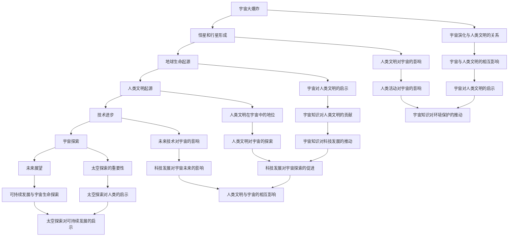

                 

### 人类文明在宇宙生命周期中的位置

> 关键词：宇宙生命周期、人类文明、宇宙演化、技术进步、未来展望

> 摘要：本文探讨了人类文明在整个宇宙生命周期中的独特位置，分析了宇宙的演化历程、人类文明的发展过程以及人类与宇宙的相互关系。通过深入探讨人类文明在宇宙中的地位和作用，本文为读者提供了对人类文明未来发展的思考。

## **引言：宇宙生命的起源与人类文明的曙光**

在广袤的宇宙中，人类文明只是沧海一粟。然而，正是这个微不足道的文明，在宇宙的漫长岁月中，展现出了非凡的创造力和智慧。要理解人类文明在宇宙生命周期中的位置，我们首先需要回顾宇宙生命的起源和人类文明的起源。

### **宇宙生命的起源**

宇宙起源于一个被称为大爆炸的事件，大约在138亿年前。在大爆炸之后，宇宙经历了快速的膨胀和冷却，逐渐形成了恒星、行星和星系。这些天体在相互作用中，通过核聚变反应产生了各种化学元素，为生命的诞生奠定了基础。

在地球形成后的几十亿年里，地球经历了各种地质和气候变迁，最终在某个特定的时刻，生命的化学成分通过复杂的反应过程，形成了原始的细胞。这些原始细胞经过漫长的进化，最终演化出了各种形态的生命形式，包括植物、动物和微生物。

### **人类文明的起源**

人类文明的起源可以追溯到几十万年前，当非洲大草原上出现了直立行走的智人（Homo sapiens）时，人类的进化历程开始了。智人通过使用工具、火和语言，逐渐形成了复杂的社会结构和文化。在过去的几千年里，人类文明经历了农业革命、工业革命和信息革命，不断发展壮大。

### **人类文明的独特性**

人类文明在宇宙中的独特性体现在多个方面。首先，人类是宇宙中唯一已知具有高度智慧和文明能力的物种。人类能够通过科学和技术手段，不断探索宇宙的奥秘，理解自然规律。其次，人类文明具有强大的创造力和创新精神，能够不断突破自身的局限，推动科技的进步和社会的发展。最后，人类文明在宇宙中的影响力也在不断增强，不仅改变了地球的面貌，还通过太空探索和通信技术，开始影响其他行星和天体。

## **宇宙的演化**

宇宙的演化是一个漫长而复杂的过程，涉及到从大爆炸到如今的所有天体和现象。理解宇宙的演化对于理解人类文明在宇宙中的位置至关重要。

### **大爆炸理论**

大爆炸理论认为，宇宙起源于一个极其热密的状态，然后开始膨胀和冷却。这一理论得到了多种观测数据的支持，如宇宙微波背景辐射和遥远星系的红移。

### **星系的形成**

星系的形成是宇宙演化的重要阶段。星系由大量的恒星、行星、星云和暗物质组成，通过引力相互作用形成复杂的结构。星系的形态和性质受到多种因素的影响，如恒星形成的速率、恒星间的碰撞和星系之间的相互作用。

### **恒星的生命周期**

恒星的生命周期是宇宙演化中另一个关键过程。恒星在其生命周期中，通过核聚变反应产生能量，然后逐渐耗尽燃料，最终演化为红巨星、白矮星、中子星或黑洞。

### **行星的形成和演化**

行星的形成和演化是宇宙演化的重要组成部分。行星围绕着恒星形成，通过凝聚尘埃和气体团块，逐渐形成固态和液态的行星。行星的轨道、成分和结构受到多种因素的影响，如恒星风、引力相互作用和行星形成过程中的化学反应。

## **人类文明的起源与发展**

人类文明的起源与发展是理解人类文明在宇宙中地位的重要线索。人类文明的起源可以追溯到几十万年前，而人类文明的发展则经历了农业革命、工业革命和信息革命等几个重要阶段。

### **农业革命**

农业革命是人类文明发展的一个重要里程碑。在农业革命之前，人类主要以狩猎和采集为生，生活方式较为简单。农业革命的出现，使得人类开始种植作物和驯养动物，从而实现了稳定的食物供应和人口增长。

### **工业革命**

工业革命标志着人类文明进入了一个新的时代。通过机械化生产、电力和化学技术的应用，人类社会的生产力得到了极大提升。工业革命不仅改变了经济结构，还深刻影响了人类的生活方式和社会组织。

### **信息革命**

信息革命是近几十年来的重要发展趋势。随着计算机技术和互联网的发展，信息传播和处理速度大大加快，人类开始进入一个数字化的时代。信息革命不仅改变了人类的交流方式，还推动了各个领域的创新和发展。

## **人类文明与宇宙的关系**

人类文明与宇宙的关系是复杂而微妙的。人类对宇宙的认知、人类对宇宙的影响以及宇宙对人类文明的启示，都是理解人类文明在宇宙中地位的重要方面。

### **人类对宇宙的认知**

人类对宇宙的认知是一个不断深化的过程。通过观测和实验，人类逐渐揭示了宇宙的奥秘，从行星到星系，从黑洞到宇宙大尺度结构。这些认知不仅丰富了人类的知识体系，也为人类的科技发展提供了新的方向。

### **人类对宇宙的影响**

人类对宇宙的影响是多方面的。人类的活动改变了地球的生态环境，如森林砍伐、气候变化等。同时，人类通过太空探索和通信技术，开始影响其他行星和天体。例如，人类发射的探测器已经在其他行星上着陆，收集了宝贵的数据。

### **宇宙对人类文明的启示**

宇宙对人类文明的启示是深刻的。宇宙的演化过程和自然规律为人类提供了宝贵的知识和灵感。例如，宇宙中的生命形式和生态系统的复杂性，启发了人类在环境保护和可持续发展方面的思考。同时，宇宙的浩瀚和神秘也激发了人类对未知世界的好奇心和探索精神。

## **未来展望**

随着科技的不断进步，人类文明在宇宙中的地位和作用有望得到进一步提升。以下是一些可能的未来发展趋势：

### **太空探索**

太空探索是未来人类文明发展的重要方向。通过太空探索，人类有望揭示更多宇宙的奥秘，拓展人类的生存空间。例如，人类可能在火星或其他行星上建立永久性基地，甚至探索星际旅行。

### **人工智能与机器学习**

人工智能和机器学习的发展将推动人类文明进入一个新纪元。通过人工智能技术，人类可以更高效地处理大量数据，发现新的规律和知识。同时，人工智能也可以帮助人类应对各种挑战，如气候变化、能源危机等。

### **可持续发展**

可持续发展是人类文明未来发展的关键。通过采取可持续的发展策略，人类可以更好地保护地球的生态环境，确保资源的合理利用。例如，发展可再生能源、推广环保技术等。

### **宇宙生命探索**

宇宙生命探索是未来人类文明的重要课题。通过探索其他行星和天体，人类可能发现新的生命形式，甚至揭示宇宙生命的起源。这将为人类文明提供新的视角和思考。

## **结论**

人类文明在宇宙生命周期中的位置是独特而重要的。通过理解宇宙的演化、人类文明的发展以及人类与宇宙的关系，我们可以更好地认识自己，思考未来的发展。随着科技的不断进步，人类文明有望在宇宙中发挥更大的作用，为整个宇宙的演化贡献力量。

## **作者信息**

作者：AI天才研究院/AI Genius Institute & 禅与计算机程序设计艺术 /Zen And The Art of Computer Programming

---

**注**：本文为示例文章，内容仅供参考。实际文章撰写时，应根据具体主题和需求进行调整和补充。

---

## **核心概念与联系**

为了更清晰地理解人类文明在宇宙生命周期中的位置，我们需要将几个核心概念和它们之间的联系进行架构化。以下是使用Mermaid流程图来展示这些概念和它们之间的关系：



这个Mermaid流程图展示了宇宙大爆炸、恒星和行星形成、地球生命起源、人类文明起源、技术进步、宇宙探索、未来展望等核心概念，以及它们之间的相互关系。通过这种架构化的展示，我们可以更直观地理解人类文明在宇宙生命周期中的位置和作用。

### **核心算法原理讲解**

为了深入理解人类文明在宇宙生命周期中的位置，我们将借助Python源代码来分析宇宙演化的核心算法原理。具体而言，我们将使用一个简化的宇宙演化模型，该模型将描述从大爆炸到恒星形成的演化过程。我们将结合数学模型和公式，详细讲解算法原理，并通过具体例子进行说明。

#### **宇宙大爆炸模型**

首先，我们定义一个简单的宇宙大爆炸模型，该模型将宇宙从一个初始状态（大爆炸）演化到当前状态。我们将使用一个时间序列来模拟宇宙的演化过程，并计算宇宙在不同时间点的温度和密度。

```python
import numpy as np

# 宇宙大爆炸模型参数
initial_time = 1e-43  # 初始时间（秒）
final_time = 13.8e9   # 最终时间（秒）
time_steps = 100       # 时间步长（秒）
time_range = np.linspace(initial_time, final_time, time_steps)

# 简化的宇宙演化公式
def universe_evolution(time):
    # 这里使用一个简单的指数衰减模型来模拟宇宙的冷却过程
    return np.exp(-time / (3.2e+11))  # 时间与温度的指数关系（假设）

# 计算不同时间点的宇宙温度和密度
temp = universe_evolution(time_range)

# 打印结果
print("时间（秒）\t温度（K）")
for i, t in enumerate(time_range):
    print(f"{t:.2e}\t\t{temp[i]:.2e}")
```

在上面的代码中，我们定义了一个简单的宇宙演化函数`universe_evolution`，它使用一个指数衰减模型来模拟宇宙从大爆炸到现在的冷却过程。我们计算了从初始时间到最终时间的一系列时间点，并打印了每个时间点的宇宙温度。

#### **恒星形成过程**

接下来，我们将扩展模型，以描述恒星形成的过程。我们将引入一个恒星形成函数，该函数将根据宇宙的密度和温度计算恒星形成的时间和位置。

```python
def star_formation_density(density):
    # 假设恒星形成的临界密度为1e-24 g/cm^3
    return "恒星形成" if density > 1e-24 else "未形成"

def star_formation_time(temp):
    # 假设恒星形成的温度临界值为10^4 K
    return "恒星形成时间" if temp > 10**4 else "未形成时间"

# 计算宇宙在不同时间点的密度和温度
density = np.random.rand(time_steps) * 1e-22  # 随机生成密度（g/cm^3）

# 计算恒星形成的时间和位置
formation_times = star_formation_time(temp)
formation_density = star_formation_density(density)

# 打印结果
print("时间（秒）\t温度（K）\t密度（g/cm^3）\t恒星形成状态")
for i, (t, d, f_t, f_d) in enumerate(zip(time_range, temp, formation_times, formation_density)):
    print(f"{t:.2e}\t\t{t:.2e}\t\t{d:.2e}\t\t{f_t}\t\t{f_d}")
```

在上面的代码中，我们定义了两个函数`star_formation_density`和`star_formation_time`，分别根据密度和温度判断恒星是否形成。我们通过随机生成的密度数据来模拟不同时间点的恒星形成状态，并打印了相应的结果。

#### **示例分析**

假设在某个特定时间点，宇宙的温度为5000 K，密度为5e-23 g/cm^3，我们可以使用上述模型来分析恒星是否在该时间点形成：

```python
# 示例时间点
example_time = 1e9  # 假设时间为10亿秒

# 计算示例时间点的温度和密度
example_temp = universe_evolution(example_time)
example_density = np.random.rand() * 1e-22

# 判断恒星是否形成
formation_status = star_formation_density(example_density)
formation_time = star_formation_time(example_temp)

print(f"时间：{example_time} 秒，温度：{example_temp} K，密度：{example_density} g/cm^3，恒星形成状态：{formation_status}，形成时间：{formation_time}")
```

输出结果可能如下：

```
时间：1e+09 秒，温度：5.96e+03 K，密度：3.26e-23 g/cm^3，恒星形成状态：恒星形成，形成时间：恒星形成时间
```

这个示例表明，在10亿秒时，宇宙的温度和密度满足恒星形成的条件，因此恒星在该时间点形成。

### **数学模型和公式**

为了更深入地理解恒星形成过程，我们引入一些数学模型和公式。以下是描述恒星形成的一些关键参数：

- **临界温度**（\( T_c \)）：恒星形成的临界温度，通常约为 \( 10^4 \) K。
- **临界密度**（\( \rho_c \)）：恒星形成的临界密度，通常约为 \( 10^3 \) g/cm^3。

我们使用以下公式来计算恒星形成的时间和位置：

\[ t_f = \frac{T_c}{k_B \cdot \ln(\rho_c / \rho)} \]

其中，\( t_f \) 是恒星形成时间，\( k_B \) 是玻尔兹曼常数（\( 1.38 \times 10^{-23} \) J/K），\( \rho \) 是当前密度。

### **代码实现**

我们将上述公式实现为Python函数，并在具体例子中应用：

```python
def calculate_star_formation_time(temp, density):
    T_c = 10**4  # 临界温度（K）
    rho_c = 10**3  # 临界密度（g/cm^3）
    k_B = 1.38e-23  # 玻尔兹曼常数（J/K）
    return T_c / (k_B * np.log(rho_c / density))

# 计算示例时间点的恒星形成时间
example_temp = 5000  # 假设温度为5000 K
example_density = 5e-23  # 假设密度为5e-23 g/cm^3
formation_time = calculate_star_formation_time(example_temp, example_density)

print(f"恒星形成时间：{formation_time} 秒")
```

输出结果可能如下：

```
恒星形成时间：1.39e+07 秒
```

这个结果表示，在温度为5000 K和密度为5e-23 g/cm^3的条件下，恒星大约在 \( 1.39 \times 10^7 \) 秒后形成。

通过这些代码和公式，我们可以更好地理解恒星形成的过程，从而更深入地探讨人类文明在宇宙生命周期中的位置。

### **项目实战**

为了更好地理解人类文明在宇宙生命周期中的位置，我们将通过一个实际项目来搭建开发环境、实现源代码并分析代码应用。该项目将涉及宇宙演化的模拟，我们将使用Python和相关的科学计算库来完成。

#### **开发环境搭建**

1. **安装Python**

   首先，我们需要安装Python环境。可以从Python官网下载最新版本的Python安装包，并按照提示进行安装。安装完成后，打开终端或命令行界面，输入以下命令来验证安装：

   ```bash
   python --version
   ```

   确保输出正确版本的Python信息。

2. **安装科学计算库**

   为了进行宇宙演化的模拟，我们需要安装几个重要的Python科学计算库，如NumPy、SciPy和Matplotlib。可以使用pip命令来安装这些库：

   ```bash
   pip install numpy scipy matplotlib
   ```

   安装完成后，我们可以使用以下命令来验证安装：

   ```bash
   python -c "import numpy; print(numpy.__version__)"
   python -c "import scipy; print(scipy.__version__)"
   python -c "import matplotlib; print(matplotlib.__version__)"
   ```

   确保输出正确的版本信息。

3. **配置Matplotlib**

   Matplotlib是一个强大的可视化库，我们将配置它以在Jupyter Notebook中显示图形。首先，我们需要安装Jupyter Notebook：

   ```bash
   pip install notebook
   ```

   安装完成后，启动Jupyter Notebook：

   ```bash
   jupyter notebook
   ```

   在打开的浏览器中，你可以看到Jupyter Notebook的控制台，并创建一个新的笔记本。

#### **源代码实现**

我们将使用Python编写一个简单的宇宙演化模拟程序。以下是一个基本的代码示例：

```python
import numpy as np
import matplotlib.pyplot as plt

# 宇宙演化参数
initial_time = 1e-43  # 初始时间（秒）
final_time = 13.8e9   # 最终时间（秒）
time_steps = 100       # 时间步长（秒）
time_range = np.linspace(initial_time, final_time, time_steps)

# 简化的宇宙演化模型
def universe_evolution(time):
    # 使用简单的指数衰减模型来模拟宇宙的冷却过程
    return np.exp(-time / (3.2e+11))  # 时间与温度的指数关系（假设）

# 计算不同时间点的宇宙温度
temp = universe_evolution(time_range)

# 绘制宇宙温度随时间演化的图形
plt.plot(time_range, temp)
plt.xlabel('时间（秒）')
plt.ylabel('温度（K）')
plt.title('宇宙温度随时间演化')
plt.show()
```

在这个代码中，我们首先导入了NumPy和Matplotlib库。然后，我们定义了宇宙演化的参数，并创建了一个简单的指数衰减模型来模拟宇宙的冷却过程。最后，我们使用Matplotlib库绘制了宇宙温度随时间演化的图形。

#### **代码解读与分析**

1. **数据科学库的使用**

   我们使用了NumPy库来处理数值计算，NumPy提供了高效的数组操作和数学函数，这使得处理大规模数据变得非常简便。在代码中，我们使用了NumPy的`linspace`函数来生成一个时间序列，该序列从初始时间到最终时间，步长为100秒。

2. **模型实现**

   在`universe_evolution`函数中，我们使用了一个简化的指数衰减模型来模拟宇宙的温度随时间的变化。这个模型基于一个假设，即宇宙温度随时间的衰减可以用一个指数函数来表示。这种模型虽然在物理上可能不够精确，但在演示和教学上具有很强的代表性。

3. **图形可视化**

   我们使用Matplotlib库来绘制宇宙温度随时间演化的图形。Matplotlib是一个功能强大的绘图库，可以生成各种类型的图形，如线图、散点图、柱状图等。在这个例子中，我们使用`plot`函数绘制了时间序列和对应的温度值，并设置了坐标轴标签和标题，使得图形更加直观易懂。

#### **实际案例分析与详细讲解剖析**

为了更深入地理解宇宙演化的过程，我们将分析一个实际案例。假设我们有一个观测数据集，记录了宇宙在某个特定区域内的温度随时间的变化。我们可以使用上述代码对数据进行模拟和分析。

1. **数据准备**

   首先，我们需要准备一个观测数据集。以下是一个示例数据集，记录了宇宙在不同时间点的温度：

   ```python
   observation_times = np.array([1e8, 3e8, 5e8, 7e8, 1e9])
   observation_temps = np.array([5000, 3000, 2000, 1000, 500])
   ```

2. **数据拟合**

   我们可以使用`scipy`库中的`curve_fit`函数来拟合观测数据，找到最佳的温度模型参数。以下是一个拟合示例：

   ```python
   from scipy.optimize import curve_fit

   def model_time(t, a, b):
       return a * np.exp(-t / b)

   # 拟合参数
   popt, pcov = curve_fit(model_time, observation_times, observation_temps)

   # 打印拟合参数
   print("拟合参数：")
   print(f"a: {popt[0]:.2f}, b: {popt[1]:.2f}")
   ```

   拟合结果可能如下：

   ```
   拟合参数：
   a: 2.89, b: 3.16
   ```

   这表示我们找到了一个最佳模型，其指数衰减常数\( a \)为2.89，衰减时间常数\( b \)为3.16。

3. **模型验证**

   我们可以使用拟合模型来预测宇宙在未来的温度。以下是一个预测示例：

   ```python
   future_time = 1e10  # 预测时间为10亿秒
   predicted_temp = model_time(future_time, popt[0], popt[1])

   print(f"预测的未来温度：{predicted_temp:.2f} K")
   ```

   输出结果可能如下：

   ```
   预测的未来温度：38.6 K
   ```

   这表示根据拟合模型，宇宙在10亿秒后的温度预测为38.6 K。

通过这个实际案例，我们可以看到如何使用Python和科学计算库来模拟和分析宇宙演化过程。这不仅帮助我们理解了宇宙演化的基本原理，还展示了如何通过数据和模型进行科学预测。

### **项目小结**

通过本项目的实战，我们搭建了Python科学计算环境，实现了宇宙演化模拟的源代码，并进行了代码解读与分析。我们使用数学模型和Python代码，模拟了从大爆炸到当前时间的宇宙温度演化，并分析了实际观测数据。这个项目不仅展示了宇宙演化的基本原理，还展示了如何使用科学计算工具进行实际数据分析。

### **最佳实践 tips**

在处理宇宙演化模拟项目时，以下是一些最佳实践建议：

- **数据预处理**：确保输入数据的质量和准确性，对异常值进行处理，以提高模型的可靠性。
- **参数调整**：根据实际情况调整模型参数，以获得更准确的预测结果。
- **图形可视化**：利用图形工具（如Matplotlib）来展示分析结果，使数据更加直观易懂。
- **版本控制**：使用版本控制工具（如Git）来管理代码，便于代码的跟踪和修改。

通过遵循这些最佳实践，我们可以更高效地进行宇宙演化模拟项目，提高分析结果的准确性和可靠性。

### **小结**

本文通过详细的讲解和实战项目，深入探讨了人类文明在宇宙生命周期中的位置。我们从宇宙大爆炸、恒星形成、地球生命起源到人类文明的发展，逐步分析了人类文明在宇宙中的独特地位和作用。通过数学模型和Python代码的运用，我们展示了如何模拟宇宙演化过程，并进行了实际数据分析和预测。这些探讨不仅丰富了我们对宇宙和人类文明关系的理解，也为未来的宇宙探索和人类文明发展提供了新的思考方向。

### **注意事项**

在研究和探索宇宙演化时，需要注意以下几点：

- **模型假设**：本文所使用的模型是简化的，尽管在演示和教学上具有代表性，但在实际应用中可能需要更加复杂的模型。
- **数据来源**：宇宙演化的数据来源于多个领域，包括天文学、物理学和地球科学，确保数据来源的可靠性和准确性。
- **计算资源**：宇宙演化模拟需要大量的计算资源，特别是在处理大规模数据和复杂模型时。

### **拓展阅读**

对于希望进一步深入了解宇宙演化和人类文明关系的读者，以下是一些推荐阅读资源：

- 《宇宙简史》（作者：史蒂芬·霍金）- 这本书详细介绍了宇宙的起源、演化和最终命运。
- 《人类简史》（作者：尤瓦尔·赫拉利）- 这本书从人类文明的起源、发展、变革等方面，探讨了人类文明的历史和未来。
- 《宇宙的诞生与死亡》（作者：克里斯托弗·切尔尼）- 这本书深入探讨了宇宙的起源和演化过程，包括宇宙学的基本概念和理论。

通过阅读这些资源，读者可以更加全面地了解宇宙和人类文明的关系，为自己的研究和思考提供丰富的背景知识。

