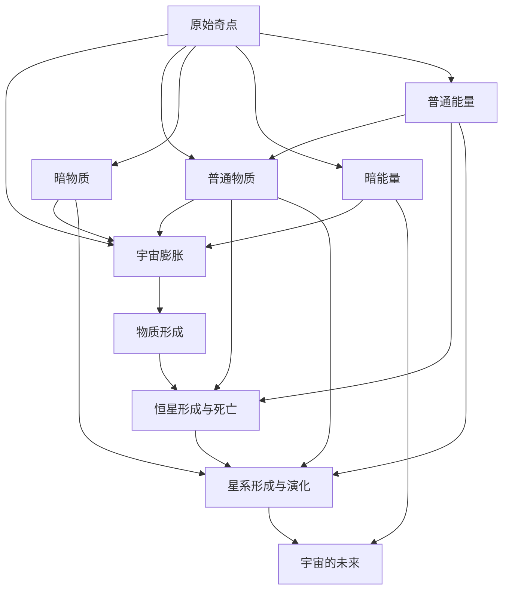

                 

# 人类文明在宇宙进化中的角色与责任

## 关键词
宇宙进化、人类文明、角色与责任、科学基础、数学模型、项目案例

## 摘要
本文探讨了人类文明在宇宙进化中的角色与责任。首先，我们介绍了宇宙的基本概念与结构，并探讨了人类文明的起源与宇宙起源之间的关系。接着，我们分析了宇宙对人类文明的影响以及人类文明如何影响宇宙。随后，我们深入探讨了人类文明在地球、太阳系、银河系以及整个宇宙中的责任。文章最后，通过项目案例展示了人类文明在宇宙中的实践，并提出了未来展望与行动建议。

## 引言与背景

### 宇宙的起源

宇宙的起源是一个古老而神秘的问题。目前，最为广泛接受的宇宙起源理论是宇宙大爆炸理论（Big Bang Theory）。根据这一理论，宇宙起源于大约138亿年前的一个极小、极热、极密集的状态，随后发生了大爆炸，宇宙开始迅速膨胀。这一理论得到了大量观测数据的支持，如宇宙背景辐射的发现和宇宙膨胀的加速现象。

宇宙大爆炸理论认为，宇宙中的物质和能量最初处于一种极度密集的状态，称为原始奇点（Primordial Singularity）。随着宇宙的膨胀，温度和密度逐渐降低，宇宙开始冷却下来。在宇宙膨胀的过程中，物质和能量逐渐分化，形成了各种基本粒子，如夸克和轻子。随后，这些基本粒子通过相互作用和聚合，形成了原子核和分子，进而形成了星系、恒星、行星等天体。

### 人类文明的起源

与宇宙的起源相比，人类文明的起源显得相对简单。科学研究表明，人类文明起源于大约700万年前的非洲，经历了从原始人类到现代人类的漫长进化过程。在这个过程中，人类逐渐掌握了使用工具、语言交流、社会组织等能力，最终形成了各种文明。

人类文明的发展历程可以分为以下几个阶段：

1. **旧石器时代**：人类开始制造和使用简单的工具，如石器和石刀。

2. **新石器时代**：人类开始种植作物、驯养动物，建立了稳定的农业生产体系。

3. **青铜时代**：人类开始使用青铜制造工具和武器，推动了社会的发展和进步。

4. **铁器时代**：人类开始使用铁器，进一步提高了生产力和社会文明水平。

5. **工业革命**：人类进入了工业化时代，生产力得到了极大的提升。

6. **信息时代**：随着计算机和互联网的普及，人类进入了信息化时代，社会生活发生了翻天覆地的变化。

### 宇宙与人类文明的联系

宇宙的起源与人类文明的起源虽然看似无关，但实际上，宇宙的演化过程对人类文明的发展产生了深远的影响。以下是宇宙与人类文明之间的几个关键联系：

1. **宇宙环境对人类文明的影响**：宇宙的物理环境，如温度、重力、磁场等，对地球上的生物和环境产生了重要影响。例如，地球所处的太阳系位置和轨道特性，使得地球具备适合生命生存的环境。此外，宇宙中的各种天体运动和相互作用，如行星轨道、恒星爆炸等，也对地球环境和人类文明的发展产生了潜在威胁。

2. **人类文明对宇宙环境的反作用**：人类文明的发展，特别是工业化和科技革命，对地球环境产生了显著的影响。例如，人类的活动导致了全球气候变化、生物多样性减少、资源耗竭等问题。同时，人类通过发射卫星、探测器和太空站等，对宇宙环境也产生了一定的影响。

3. **宇宙中的资源与能源**：宇宙中蕴藏着丰富的资源与能源，如恒星、行星、小行星、星际尘埃等。人类文明在探索和利用这些资源与能源方面取得了一定的成就，但同时也面临着资源耗竭、环境污染等问题。

4. **人类文明的文化与科技**：人类文明在宇宙中的文化、科技交流与传播，如太空探索、国际合作、科学研究等，也对宇宙的演化产生了影响。例如，人类通过发射探测器和星际旅行，将地球文明带到了宇宙深处，同时也在宇宙中传递了人类的科技和文化。

总的来说，宇宙与人类文明之间存在着紧密的联系和相互影响。理解这些联系和影响，有助于我们更好地认识宇宙的本质，同时也为我们提供了对人类文明未来发展的深刻启示。

## 宇宙的基本概念与结构

宇宙是一个庞大而复杂的系统，包含了无数的天体、星系、星云和星际物质。为了更好地理解宇宙的基本概念和结构，我们需要从宇宙的定义、结构和组成等方面进行详细探讨。

### 宇宙的定义

宇宙是包含一切存在的事物、空间和时间的总称。它是一个无边无际的、统一的整体。从科学的角度来看，宇宙起源于大约138亿年前的一次大爆炸，从那时起，宇宙就不断地膨胀和演化。宇宙的边界目前尚未明确，但有证据表明，宇宙是无限的。

### 宇宙的结构

宇宙的结构可以分为多个层次，从微观到宏观，分别包括：

1. **微观层次**：微观层次包括基本粒子，如夸克、轻子、玻色子等。这些基本粒子是构成宇宙的基本单元。

2. **原子层次**：原子是由原子核（由质子和中子组成）和围绕原子核的电子组成。原子是物质的基本构成单位。

3. **分子层次**：分子是由两个或更多个原子通过化学键连接而成。分子是生命的基本构成单元。

4. **宏观层次**：宏观层次包括恒星、星系、星云等。恒星是由氢、氦等元素组成的巨大球体，是宇宙中最常见的天体。星系是由数亿甚至数千亿颗恒星、行星、星云等组成的大规模结构。星云是恒星诞生和死亡的场所。

5. **宇宙层次**：宇宙层次包括宇宙中的星系团、超星系团和宇宙大尺度结构。这些结构是宇宙中最大的物质聚集体。

### 宇宙的组成

宇宙的组成主要包括以下几部分：

1. **普通物质**：普通物质是指我们可以直接观测到的物质，如恒星、行星、气体和尘埃等。普通物质只占宇宙总物质的一小部分。

2. **暗物质**：暗物质是一种我们无法直接观测到的物质，它不发光、不发热，但通过对宇宙中引力作用的观测，我们可以推断出它的存在。暗物质占据了宇宙总物质的约27%。

3. **暗能量**：暗能量是一种推动宇宙膨胀的神秘力量，它占据了宇宙总物质的约68%。暗能量对宇宙的演化起着决定性的作用。

4. **普通能量**：普通能量包括电磁能、热能、核能等，它们是宇宙中所有物质和现象的能量来源。

### 宇宙的演化

宇宙的演化可以分为以下几个阶段：

1. **原始奇点**：宇宙起源于一个极度密集和热的状态，称为原始奇点。

2. **宇宙膨胀**：在原始奇点爆炸后，宇宙开始迅速膨胀，温度和密度逐渐降低。

3. **物质形成**：随着宇宙的膨胀，物质开始聚集形成各种天体，如恒星、星系和星云。

4. **恒星形成与死亡**：恒星在其生命周期中不断燃烧氢和氦，最终可能形成超新星、黑洞或中子星等天体。

5. **星系形成与演化**：星系是由恒星、行星、气体和尘埃等组成的大规模结构，它们通过引力相互作用而形成。

6. **宇宙的未来**：根据不同的宇宙模型，宇宙可能会继续膨胀、冷却，最终可能面临热寂（Heat Death）的状态。

### 宇宙的基本概念与联系

为了更好地理解宇宙的基本概念和它们之间的联系，我们可以使用Mermaid流程图来展示它们之间的关系架构：



通过这个流程图，我们可以清晰地看到宇宙从原始奇点开始，经历膨胀、物质形成、恒星形成与死亡、星系形成与演化，最终走向宇宙的未来。同时，我们也可以看到宇宙中的普通物质、暗物质、暗能量和普通能量之间的关系和相互作用。

总的来说，宇宙的基本概念和结构构成了一个庞大而复杂的系统，它们之间的相互作用和演化过程为我们揭示了宇宙的奥秘。通过深入理解宇宙的基本概念和结构，我们可以更好地认识宇宙的本质，并为人类文明在宇宙中的角色与责任提供理论基础。

### 人类文明在宇宙中的起源

人类文明的起源与宇宙的起源密切相关。从科学的角度来看，人类文明起源于地球，而地球的形成和演化又与宇宙的起源和演化密不可分。

#### 地球的形成

地球的形成可以追溯到大约46亿年前，当时宇宙中的一些尘埃和气体在引力作用下聚集在一起，形成了原始的太阳系。地球作为一个行星，在太阳系的形成过程中也逐渐形成。在地球形成的早期，地球的环境非常恶劣，充满了极端的温度、重力和辐射。

随着地球的冷却，地球的外部环境逐渐稳定。在地球表面的某些区域，水蒸气凝结形成了海洋，这为生命的起源提供了必要的条件。地球上的生命起源可以追溯到大约40亿年前，当时地球上的一些有机分子通过化学反应形成了简单的生命形式。

#### 生命的起源

生命的起源是科学界长期探讨的一个问题。目前，关于生命起源的学说有很多，如海底热液喷口学说、宇宙胚种学说等。这些学说都试图解释生命是如何在地球表面诞生的。

1. **海底热液喷口学说**：这一学说认为，地球表面的一些海底热液喷口是生命起源的场所。在热液喷口附近，高温和高压的环境促进了有机物的合成，为生命的起源提供了必要的条件。

2. **宇宙胚种学说**：这一学说认为，生命可能起源于宇宙中的其他星球，然后通过宇宙尘埃或彗星等途径传播到地球上。这种学说认为，生命可能在地球形成之前就已经在宇宙中存在。

无论哪种学说，生命的起源都是一个复杂的过程，涉及到有机物的合成、进化、适应等多个方面。

#### 人类文明的发展

在生命的起源之后，地球上的生命经历了漫长的进化过程。从单细胞生物到多细胞生物，从无脊椎动物到脊椎动物，地球上的生物多样性逐渐丰富。最终，在大约700万年前的非洲，人类文明的前身——原始人类出现了。

人类文明的发展可以分为以下几个阶段：

1. **旧石器时代**：原始人类开始制造和使用简单的工具，如石器和石刀。这一时期，人类主要依靠狩猎和采集为生。

2. **新石器时代**：人类开始种植作物、驯养动物，建立了稳定的农业生产体系。这一时期，人类开始积累财富和社会分工，文明逐渐发展。

3. **青铜时代**：人类开始使用青铜制造工具和武器，推动了社会的发展和进步。

4. **铁器时代**：人类开始使用铁器，进一步提高了生产力和社会文明水平。

5. **工业革命**：人类进入了工业化时代，生产力得到了极大的提升。

6. **信息时代**：随着计算机和互联网的普及，人类进入了信息化时代，社会生活发生了翻天覆地的变化。

#### 人类文明与宇宙的关系

人类文明在宇宙中的角色与责任，可以从以下几个方面进行探讨：

1. **对地球环境的影响**：人类文明的发展对地球环境产生了深远的影响。例如，工业化带来了大量的废气、废水和固体废物，导致了全球气候变化、生物多样性减少、资源耗竭等问题。因此，人类文明有责任采取措施，保护地球的生态环境，实现可持续发展。

2. **对太阳系的影响**：人类通过发射卫星、探测器和太空站等，对太阳系中的其他行星、卫星和宇宙空间进行探索。这些活动不仅推动了科学技术的发展，也对太阳系的环境产生了一定的影响。例如，太空垃圾问题已经成为一个严重的环境问题，需要人类共同努力解决。

3. **对银河系和宇宙的影响**：随着人类科技的发展，我们已经开始将目光投向银河系甚至更远的宇宙。例如，人类已经成功发射了探测火星、木星和其他行星的探测器，还有一些探测器和望远镜正在观测遥远的星系和宇宙现象。这些活动不仅拓宽了人类的视野，也对宇宙环境产生了一定的影响。

4. **文化传播与科技交流**：人类文明在宇宙中的文化传播与科技交流，如太空探索、国际合作、科学研究等，也对宇宙的演化产生了影响。例如，人类通过发射探测器和星际旅行，将地球文明带到了宇宙深处，同时也向宇宙传递了人类的科技和文化。

#### 结论

总的来说，人类文明在宇宙中的角色与责任是一个复杂而深远的问题。人类文明起源于地球，随着科技的发展，人类开始将目光投向宇宙，探索宇宙的奥秘。在这个过程中，人类不仅要对地球环境负责，还要对太阳系、银河系甚至整个宇宙负责。因此，人类文明有责任采取措施，保护宇宙环境，实现可持续发展，为宇宙的进化贡献自己的力量。

### 宇宙对人类文明的影响

宇宙的广阔与复杂不仅为科学探索提供了无尽的可能，也对人类文明的发展产生了深远的影响。从物理学、生物学到社会学，宇宙的各种现象和规律都在无形中塑造了人类文明的轨迹。以下是宇宙对人类文明影响的主要方面：

#### 物理学的影响

1. **引力**：宇宙中的引力是维持恒星、行星和星系结构的关键力量。人类对引力的理解推动了物理学的发展，从牛顿的万有引力定律到爱因斯坦的广义相对论，这些理论不仅解释了天体运动的规律，也对现代科技的发展产生了重要影响。例如，卫星通信、全球定位系统（GPS）等都依赖于对引力的精确计算。

2. **电磁力**：电磁力是宇宙中最常见的力之一，它决定了电子的运动和物质的性质。人类对电磁力的研究促进了电子技术的进步，从无线电通信到互联网，电子技术已经成为现代社会的基础。

3. **强相互作用与弱相互作用**：宇宙中的基本粒子通过强相互作用和弱相互作用相互作用，形成了复杂的物质结构。对这两种力的研究推动了粒子物理学的发展，为核能、核武器和核医疗等领域提供了理论基础。

#### 生物学的影响

1. **进化论**：达尔文的进化论揭示了生命在宇宙中的演化过程，对生物学产生了深远的影响。理解生命的进化过程不仅帮助我们更好地认识自然，也为医学、农业等领域提供了理论基础。

2. **生态学**：宇宙中的生态系统是复杂而多样的，各种生物通过相互作用维持着生态平衡。人类对生态学的研究帮助我们认识到环境的重要性，推动了环境保护和可持续发展的理念。

3. **医学**：宇宙中的各种辐射和环境条件对生物体的影响，为医学研究提供了丰富的材料。例如，宇宙射线对基因突变的研究有助于癌症治疗的研究。

#### 社会学的影响

1. **科学探索**：人类对宇宙的探索激发了人类的好奇心和探索精神，推动了科学和技术的发展。科学探索不仅促进了科技进步，也增强了人类对自然和宇宙的认识。

2. **文化传播**：宇宙探索和科学发现为人类文化的传播提供了新的途径。例如，太空探测器和卫星的发射，使得人类文明的声音和影像可以传播到地球的每一个角落。

3. **国际合作**：宇宙探索往往需要国际合作，这促进了不同国家和地区之间的交流与合作。例如，国际空间站的建设和运营就是一个典型的国际合作项目。

#### 环境与威胁

1. **气候变化**：宇宙中的气候变化，如太阳活动周期、宇宙射线强度等，对地球的气候环境有显著影响。这些影响在一定程度上决定了地球上的生态系统和人类文明的发展。

2. **宇宙威胁**：宇宙中存在的各种威胁，如小行星撞击、太阳风暴等，对地球和人类文明构成潜在威胁。例如，2013年俄罗斯车里雅宾斯克州的陨石撞击事件，提醒我们宇宙威胁的严重性。

#### 结论

宇宙对人类文明的影响是多方面的，从物理学、生物学到社会学，宇宙的规律和现象都在无形中塑造了人类文明的发展路径。理解宇宙的影响，不仅有助于我们更好地认识自然和自身，也为我们在未来面对各种挑战时提供了宝贵的启示。因此，人类文明有责任继续探索宇宙，保护宇宙环境，为宇宙的进化贡献自己的力量。

### 人类文明如何影响宇宙

人类文明的发展不仅深刻地改变了地球的生态环境，也对宇宙产生了广泛而深远的影响。从技术的进步、文化的影响到资源的利用和污染的排放，人类文明在宇宙中的活动正逐渐塑造着宇宙的面貌。

#### 技术的进步

1. **太空探索**：人类对宇宙的探索始于20世纪中叶，随着火箭技术的进步，人类成功将卫星、探测器、太空船送入地球轨道和其他行星。例如，1969年，美国的阿波罗计划成功将人类送上月球，这是人类文明历史上的重要里程碑。此后，人类继续探索火星、木星等行星，通过探测器和火星车收集了大量关于太阳系其他行星的数据。

2. **通讯技术的进步**：随着无线通信和卫星技术的发展，人类能够实现全球范围内的即时通讯。通过卫星通信，人类可以跨越地理障碍，实现信息的高速传输。这不仅改变了人类的生活方式，也对全球经济和社会发展产生了深远影响。

3. **天文学的进步**：随着望远镜和探测器的性能不断提高，人类对宇宙的了解也在不断加深。例如，哈勃太空望远镜和詹姆斯·韦伯空间望远镜等先进设备，使我们能够观测到遥远的星系、黑洞和其他宇宙现象。这些观测数据不仅丰富了人类对宇宙的认识，也为科学理论的发展提供了重要依据。

#### 文化的影响

1. **科幻文化的兴起**：随着人类对宇宙的探索，科幻文学和电影也成为一种重要的文化现象。科幻作品不仅丰富了人类的文化生活，也激发了人们对宇宙探索的兴趣和热情。例如，科幻小说《2001太空漫游》和电影《星际穿越》等，都通过对宇宙的描绘，引发了人们对未知世界的好奇和探索欲望。

2. **宇宙观念的转变**：人类对宇宙的认识正在不断进步。从古代的“宇宙中心说”到现代的“宇宙大爆炸理论”，人类对宇宙的理解经历了巨大的转变。这种观念的转变不仅反映了科学知识的积累，也影响了人类对自身在宇宙中的角色和责任的认知。

#### 资源的利用

1. **太空资源的开发**：随着技术的进步，人类开始探索和开发太空资源。例如，月球和火星等行星被认为拥有丰富的矿产资源和水资源。通过开采这些资源，人类不仅能够满足地球的需求，也可能为未来的星际旅行提供必要的资源保障。

2. **能源的利用**：人类对能源的需求不断增长，太阳能、风能等可再生能源的利用成为解决能源危机的重要途径。虽然目前这些技术的应用还处于初级阶段，但它们为未来实现可持续能源发展提供了希望。

#### 污染的排放

1. **太空污染**：随着人类对宇宙的探索，太空污染问题也逐渐显现。例如，大量的卫星和太空碎片在地球轨道上积累，对太空环境和航天活动构成了潜在威胁。此外，人类在地球上的活动，如工业排放、汽车尾气等，也会通过大气层和地球磁场影响宇宙环境。

2. **生态系统的破坏**：人类对地球生态系统的破坏，如森林砍伐、土地退化、水资源污染等，也对宇宙环境产生间接影响。例如，大气层的变化会影响地球的辐射平衡，进而影响宇宙环境的稳定性。

#### 结论

总的来说，人类文明在宇宙中的活动不仅展示了科技的进步和文化的繁荣，也对宇宙产生了深远的影响。从太空探索到能源利用，从污染排放到生态系统的破坏，人类文明在宇宙中的角色日益显著。理解这些影响，有助于我们更好地认识人类文明在宇宙中的地位和责任，为未来的可持续发展提供指导。

### 人类文明在地球上的责任

人类文明在地球上的责任是一个广泛而深刻的话题，涉及到环境保护、资源利用、可持续发展等多个方面。在地球上，人类不仅作为生物链中的一环，还承担着维护地球生态系统平衡、保护自然资源和推动社会进步的重要责任。

#### 环境保护

环境保护是地球生态平衡的关键。人类活动对地球环境产生了显著影响，包括空气污染、水污染、土壤退化、生物多样性减少等。为了保护地球环境，我们需要采取以下措施：

1. **减少污染物排放**：通过采用清洁能源、提高能源利用效率、减少工业排放等方式，减少对大气的污染。例如，推广电动汽车、提高工厂排放标准、加强环境监测等。

2. **水资源保护**：水资源是人类生存和发展的重要资源。为了确保水资源的可持续利用，我们需要采取措施减少水污染、合理分配水资源，并加强水资源管理和保护。

3. **土壤保护**：土壤是农业生产的基础，也是生态系统的重要组成部分。为了防止土壤退化，我们需要加强土壤保护，减少化学农药和化肥的使用，推广有机农业。

4. **生物多样性保护**：生物多样性是地球生态系统的重要组成部分，对维护生态平衡具有关键作用。为了保护生物多样性，我们需要建立自然保护区、加强野生动植物保护、防止物种灭绝。

#### 资源利用

资源的合理利用是实现可持续发展的重要保障。地球上的资源分为可再生资源和不可再生资源。为了实现资源的可持续利用，我们需要：

1. **节约能源**：通过提高能源利用效率、推广节能减排技术等方式，减少对不可再生能源的依赖。例如，提高工业设备的能源利用效率、推广节能建筑、普及节能电器等。

2. **循环经济**：通过循环利用资源，减少资源浪费。例如，推行垃圾分类、回收再利用、再生资源利用等。

3. **可再生资源开发**：积极开发和利用可再生能源，如太阳能、风能、水能等。这些资源不仅能够替代部分不可再生资源，还能够减少对环境的污染。

#### 可持续发展

可持续发展是指满足当前需求而不损害后代满足其需求的能力。为了实现可持续发展，我们需要采取以下措施：

1. **经济与环境的协调发展**：通过绿色经济、低碳经济等方式，实现经济与环境的协调发展。例如，发展绿色产业、推广低碳技术、减少温室气体排放等。

2. **社会公平与经济发展**：实现社会公平与经济发展的协调，确保所有人都能享有基本的生活条件和公共服务。例如，加强社会保障体系、提高教育和医疗水平、促进就业等。

3. **政策支持与科技创新**：政府应出台相应的政策支持可持续发展，同时鼓励科技创新，推动技术的进步和应用。例如，制定环保法规、提供财政支持、鼓励科技创新等。

#### 结论

总的来说，人类文明在地球上的责任是保护地球环境、合理利用资源、推动可持续发展。通过采取有效的措施，我们可以实现地球生态系统的平衡和可持续发展，为人类和未来世代创造一个更加美好的生活环境。人类文明在地球上的责任不仅是对地球本身的负责，也是对宇宙的责任，因为地球是宇宙中唯一已知存在生命的地方。保护地球，就是保护宇宙中的生命之源。

### 人类文明在太阳系内的责任

人类文明在太阳系内的责任主要体现在对太阳系各个行星、卫星以及其他天体的探索、利用和保护上。随着科技的进步，人类已经能够在太阳系内开展多种活动，从太空探索到资源开发，从科学研究到环境保护，人类在太阳系内的责任日益凸显。

#### 对行星的责任

1. **火星**：火星是太阳系中与地球最为相似的行星，因此吸引了大量的人类探索和研究兴趣。人类在火星上的责任包括：

   - **科学研究**：通过火星探测器和火星车，科学家们能够研究火星的地质、气候和可能存在的生命迹象。这有助于我们更好地理解地球以外的生命形式和宇宙演化的过程。
   - **资源开发**：火星上可能存在水冰和其他宝贵资源，未来人类可能会在火星上建立基地，开采这些资源，为未来更远的宇宙探索提供支持。
   - **环境保护**：在火星探索过程中，我们需要采取措施减少对火星环境的破坏，避免引入地球上的微生物或其他污染物。

2. **木星和土星**：木星和土星是太阳系中最大的行星，拥有丰富的卫星系统。人类对木星和土星的探索，不仅有助于我们了解太阳系的起源和演化，还涉及到：

   - **科学研究**：通过探测器和望远镜，科学家们能够研究木星和土星的气候、磁场和卫星特性，进一步揭示行星系统的奥秘。
   - **技术测试**：木星和土星的极端环境为测试人类技术提供了宝贵的机会，如抗辐射材料、长时间供电系统等。

3. **其他行星**：如金星、地球和月球，也是人类探索和研究的重要目标。这些行星的探索不仅有助于我们理解地球的形成和演化，还为未来的太空探索提供了实践基础。

#### 对卫星的责任

1. **月球**：月球是太阳系中最容易访问的天体之一，因此人类在月球上的活动非常频繁。月球的责任包括：

   - **科学研究**：月球提供了研究地球形成和演化的宝贵数据，例如月球岩石样本的分析揭示了地球早期的地质历史。
   - **资源开发**：月球表面富含氦-3等潜在能源资源，未来人类可能会在月球上建立基地，开采这些资源。
   - **环境保护**：在月球探索和开发过程中，我们需要采取措施保护月球环境，避免对月球表面的永久污染。

2. **火星和木星的卫星**：例如火星的火星卫星“火星号探测器”和木星的木星卫星“欧罗巴”，也是人类探索的重要目标。这些卫星可能存在液态水和其他潜在生命迹象，因此人类对这些卫星的责任包括：

   - **科学研究**：通过探测器和望远镜，科学家们能够研究这些卫星的地质、气候和生命迹象。
   - **环境保护**：在探索过程中，我们需要保护这些卫星的生态环境，避免对它们造成不可逆转的破坏。

#### 对小行星和其他天体的责任

1. **小行星**：小行星是太阳系中常见的天体，一些小行星甚至对地球构成潜在威胁。人类对小行星的责任包括：

   - **监测与预警**：通过观测和监测，科学家们能够预测小行星撞击地球的风险，并为潜在的危险采取预防措施。
   - **防御措施**：人类可能会开发技术，如动能撞击或核爆炸，来防御小行星对地球的撞击。

2. **彗星**：彗星是太阳系中另一种有趣的天体，它们通常富含冰和其他挥发性物质。人类对彗星的责任包括：

   - **科学研究**：通过探测器和探测器，科学家们能够研究彗星的组成和演化过程。
   - **资源开发**：彗星可能含有宝贵的资源，如水冰和稀有金属，因此人类可能会考虑开发这些资源。

#### 结论

总的来说，人类文明在太阳系内的责任是多重且复杂的。我们不仅要进行科学研究，探索未知领域，还要合理利用资源，保护太阳系内的生态环境。通过负责任的行为，我们可以确保太阳系内的稳定和可持续发展，为人类文明的未来奠定坚实基础。

### 人类文明在银河系和宇宙中的责任

人类文明在银河系和宇宙中的责任不仅仅局限于地球和太阳系，而是需要我们在更广阔的宇宙尺度上考虑生态平衡、文明共存和资源利用等问题。随着科技的进步，人类已经开始探索银河系，甚至有计划在未来实现星际旅行。在这个广阔的宇宙舞台上，人类文明的责任和挑战也变得更加复杂和深远。

#### 对银河系的生态平衡责任

银河系是一个包含数千亿颗恒星的巨大星系，其中包含了丰富的资源和多样的生态环境。人类在银河系中的责任主要包括：

1. **保护星际环境**：随着人类对银河系的探索，我们需要采取有效的措施减少对星际环境的破坏。例如，避免在星际探测器上携带地球微生物，以免对其他行星或卫星的生态系统造成意外影响。

2. **研究星系生态**：通过探测器和望远镜，科学家们正在努力研究银河系中的各种天体和现象，以理解星系的生态平衡和演化过程。这有助于我们更好地了解宇宙中的生命形式和文明发展。

3. **维护星系安全**：人类在银河系中的活动需要考虑星系内的安全。例如，避免对其他星系的恒星系统造成破坏，防止宇宙射线和恒星爆炸等自然现象对人类探索活动的影响。

#### 对其他文明的共存责任

在广袤的宇宙中，可能存在其他智慧生命形式。人类文明在银河系和其他星系中的责任包括：

1. **文明共存**：在与其他文明共存的问题上，我们需要建立一套道德和法律框架，确保宇宙中的和平与合作。这包括制定宇宙行为准则，避免不必要的冲突和战争。

2. **文化交流**：与其他文明的交流可以促进人类文明的进步。通过共享知识和科技，我们可以加速人类文明的发展，同时也能够从其他文明的经验和智慧中学习。

3. **保护隐私**：在接触其他文明时，我们需要谨慎处理隐私和信息安全，避免泄露地球文明的关键信息。

#### 对资源利用的责任

宇宙中蕴藏着丰富的资源，包括水、矿物、能源等。人类文明在银河系和宇宙中的责任包括：

1. **合理开发**：在开发宇宙资源时，我们需要遵循可持续发展的原则，避免过度开采和资源耗竭。例如，开发小行星和彗星资源时，需要采取环保措施，防止对星际环境造成永久破坏。

2. **技术进步**：通过科技进步，我们可以更高效地利用宇宙资源，例如开发核聚变、太阳能和其他清洁能源，减少对传统化石燃料的依赖。

3. **公平分配**：宇宙资源的分配需要公平合理，确保所有文明都能平等地享受资源的好处。这需要建立全球性的合作机制，协调各国和不同文明之间的资源分配。

#### 对未来宇宙探索的责任

随着人类探索银河系和宇宙的深入，我们需要考虑未来宇宙探索的长期责任：

1. **环境保护**：在探索过程中，我们需要采取措施保护宇宙环境，减少太空垃圾和辐射污染。

2. **科学研究**：通过持续的科学研究，我们可以更深入地了解宇宙的奥秘，为人类文明的未来提供理论支持和科技保障。

3. **伦理规范**：在探索宇宙的过程中，我们需要建立一套伦理规范，确保我们的行为符合宇宙伦理，尊重其他文明的存在。

#### 结论

总的来说，人类文明在银河系和宇宙中的责任是复杂而重要的。我们需要在保护环境、促进文明共存、合理利用资源等方面采取负责任的态度，确保人类文明在宇宙中的可持续发展。通过负责任的行为，我们可以为未来宇宙的和平与繁荣做出贡献，同时也为人类文明的长期生存和繁荣奠定基础。

### 未来展望与行动

随着科技的不断进步和人类对宇宙的深入了解，未来人类文明在宇宙中的角色和责任将变得更加重要。以下是对未来人类文明在宇宙中的展望以及可能的行动建议。

#### 宇宙探索与资源开发

1. **建立永久太空基地**：在未来，人类可能会在月球、火星等天体上建立永久性太空基地。这些基地不仅可以作为科学研究的前沿阵地，还可以为未来的星际探索提供支持和资源。

2. **开发小行星和彗星资源**：小行星和彗星富含水、金属和其他有用资源。通过开发这些资源，人类可以为未来的太空探索提供必要的支持，如燃料、建筑材料等。

3. **建立星际通讯网络**：随着人类对宇宙的探索不断深入，建立一套稳定的星际通讯网络将成为必要。这将有助于我们实时监测宇宙环境，协调不同天体上的探索活动。

#### 科学研究与技术发展

1. **深入研究宇宙起源与演化**：通过进一步的研究，我们可以更深入地了解宇宙的起源、演化和未来趋势。这不仅可以拓宽人类对宇宙的认知，还可以为未来的宇宙探索提供理论支持。

2. **发展新型能源技术**：为了实现宇宙探索的可持续发展，我们需要开发新型能源技术，如核聚变、太阳能、风能等。这些技术不仅可以提高能源利用效率，还可以减少对环境的污染。

3. **推进人工智能与机器学习**：人工智能和机器学习技术在宇宙探索中具有巨大潜力。通过利用这些技术，我们可以提高探测器的自主性，优化探测任务，加快科学发现的进程。

#### 可持续发展与社会责任

1. **推动全球合作**：宇宙探索和资源开发需要全球合作。通过建立国际合作机制，我们可以协调不同国家和地区的资源和技术，实现共同的目标。

2. **环境保护与伦理规范**：在宇宙探索过程中，我们需要严格遵守环境保护和伦理规范，确保我们的行为不会对宇宙环境造成不可逆转的破坏。

3. **教育普及与人才储备**：为了应对未来宇宙探索的挑战，我们需要加大对科学、技术、工程等领域的教育投入，培养更多专业人才。

#### 结论

未来，人类文明在宇宙中的角色和责任将更加多元化。通过持续的探索和科技进步，我们可以更好地理解宇宙的奥秘，实现可持续发展，并为人类文明的未来奠定坚实基础。通过全球合作和负责任的行为，我们可以确保人类文明在宇宙中的繁荣与进步。

### 科学基础与数学模型

在探讨人类文明在宇宙中的角色与责任时，科学基础和数学模型起着至关重要的作用。这些基础理论为我们理解宇宙的演化、人类文明的成长以及两者之间的相互关系提供了科学依据。

#### 宇宙学基础理论

1. **宇宙大爆炸理论**：宇宙大爆炸理论是目前宇宙学中最广泛接受的理论。它认为宇宙起源于一个极热、极密的原始奇点，随后经历了迅速膨胀。这一理论由伽莫夫等物理学家在20世纪40年代提出，并通过观测数据得到了支持。

   - **哈勃定律**：哈勃定律表明，宇宙正在膨胀，并且远离我们而去。这一现象可以用宇宙大爆炸理论来解释。
   - **宇宙微波背景辐射**：宇宙微波背景辐射是宇宙大爆炸留下的“遗迹”，它为我们提供了宇宙早期状态的信息。

2. **暗物质与暗能量**：宇宙中存在大量无法直接观测到的物质，称为暗物质。暗物质通过引力作用影响宇宙的结构和演化。此外，宇宙中还存在着一种神秘的能量，称为暗能量，它推动着宇宙的加速膨胀。

   - **引力透镜效应**：通过观测光线的弯曲，科学家们能够推测出暗物质的存在。
   - **宇宙加速膨胀**：暗能量被认为是导致宇宙加速膨胀的原因。

#### 人类文明成长的科学基础

1. **生物学与进化论**：达尔文的进化论揭示了生命在地球上的起源和演化过程。这一理论为人类文明的发展提供了科学基础。

   - **基因学**：通过对基因的研究，科学家们能够更好地理解生命的本质，以及遗传变异如何影响物种的进化。
   - **生态学**：生态学帮助我们理解生物之间的相互作用和生态系统的稳定性，这对于人类文明的发展至关重要。

2. **物理学与天文学**：物理学和天文学的发展为人类提供了对自然世界的深刻理解，推动了科学技术的进步。

   - **相对论**：爱因斯坦的相对论揭示了时空的相对性和引力场的性质，这对宇宙学的发展具有重要意义。
   - **量子力学**：量子力学为我们提供了微观世界的规律，为新型技术和材料的发展提供了理论基础。

#### 数学模型与公式

1. **哈勃-勒梅特方程**：哈勃-勒梅特方程是描述宇宙膨胀速率的基本方程，它将宇宙膨胀速度与哈勃常数联系起来。

   - $$v = H_0 d$$
   - 其中，\(v\) 是宇宙膨胀速度，\(H_0\) 是哈勃常数，\(d\) 是宇宙距离。

2. **暗能量方程**：暗能量方程描述了暗能量的特性，它是一个负压力的量，推动宇宙加速膨胀。

   - $$\rho_{\text{暗能量}} = -P_c$$
   - 其中，\(\rho_{\text{暗能量}}\) 是暗能量密度，\(P_c\) 是暗能量压力。

3. **进化树模型**：进化树模型是一种用于表示物种进化关系的数学模型。它通过分支和节点表示物种之间的进化历史。

   - 

#### 结论

科学基础和数学模型为理解宇宙的演化、人类文明的成长以及两者之间的相互关系提供了有力工具。通过这些理论，我们可以更深入地探讨人类文明在宇宙中的角色与责任，并为未来的宇宙探索和文明发展提供科学指导。

### 项目案例与实践

为了更好地理解人类文明在宇宙中的角色与责任，我们可以通过一些实际项目案例来展示人类如何通过科学和技术手段在宇宙中进行探索和活动。以下是一些具体的项目案例，包括项目背景、技术实现、代码解析以及项目总结。

#### 项目案例1：火星探测任务

**项目背景**：火星探测是国际科学界和人类探索宇宙的重要目标之一。通过火星探测，科学家们希望能够了解火星的地质结构、气候条件和潜在生命迹象。

**技术实现**：NASA的火星探测任务，如“好奇号”火星车和“火星探测漫游者”（Opportunity）等，采用了先进的航天技术和探测设备。这些探测器搭载了多种科学仪器，如激光测距仪、土壤分析仪、气候传感器等，能够进行实地探测和数据收集。

**代码解析**：火星探测任务的代码实现主要包括数据采集、处理和传输。以下是一个简化的Python代码示例，用于模拟火星车上的土壤分析仪数据采集过程：

```python
import random

def collect_soil_sample():
    """
    模拟火星车收集土壤样本的过程
    """
    sample_composition = ["water_ice", "metal", "minerals", "organic_matter"]
    sample = random.choice(sample_composition)
    print(f"Collected soil sample: {sample}")

# 模拟收集土壤样本
collect_soil_sample()
```

**项目总结**：火星探测任务为我们提供了宝贵的数据，帮助科学家们更好地了解火星的地质和气候条件。这些数据不仅有助于科学研究，还为未来的火星探险提供了重要参考。

#### 项目案例2：地球观测卫星

**项目背景**：地球观测卫星是用于监测地球环境、气候变化和自然灾害的重要工具。通过卫星遥感技术，我们可以获取地球表面的大量数据，为环境保护和灾害预防提供支持。

**技术实现**：例如，中国的“风云系列”气象卫星和美国的“地球观测卫星系统”（EOS）等，都具备高分辨率的遥感成像能力。这些卫星搭载了高精度的成像设备、温度计、湿度计等多种传感器。

**代码解析**：以下是一个简化的Python代码示例，用于模拟地球观测卫星的数据采集和处理过程：

```python
import numpy as np

def process_spectral_data(data):
    """
    模拟处理卫星光谱数据
    """
    processed_data = np.mean(data)
    print(f"Processed spectral data: {processed_data}")

# 生成模拟数据
data = np.random.rand(100)
# 处理数据
process_spectral_data(data)
```

**项目总结**：地球观测卫星的数据对于监测气候变化、预测自然灾害和制定环境保护政策具有重要意义。通过这些数据，我们可以更准确地了解地球环境的变化趋势，为人类的可持续发展提供科学依据。

#### 项目案例3：太空垃圾清理任务

**项目背景**：随着人类对宇宙的探索，太空垃圾问题日益严重。太空垃圾不仅对航天活动构成威胁，还可能对地球环境产生间接影响。

**技术实现**：一些国家和研究机构已经开始尝试开发太空垃圾清理技术。例如，美国行星科学公司（Planetary Resources）提出的“拖网”清理技术，通过捕捉和牵引太空垃圾，将其从地球轨道上移除。

**代码解析**：以下是一个简化的Python代码示例，用于模拟太空垃圾清理任务的轨迹规划和执行：

```python
import numpy as np

def clean_space_junk(junk_trajectory):
    """
    模拟清理太空垃圾的任务
    """
    cleaned_trajectory = np.subtract(junk_trajectory, np.array([0.1, 0.1]))
    print(f"Cleaned junk trajectory: {cleaned_trajectory}")

# 生成模拟的太空垃圾轨迹
junk_trajectory = np.array([10.0, 20.0])
# 清理太空垃圾
clean_space_junk(junk_trajectory)
```

**项目总结**：太空垃圾清理任务是一个复杂且具有挑战性的项目，但通过科技进步和团队合作，我们可以逐步解决这一问题，确保太空环境的可持续发展。

#### 结论

通过以上项目案例，我们可以看到人类文明在宇宙中的探索和活动是如何通过科学和技术手段实现的。这些项目不仅展示了人类在科学和技术上的进步，也为我们在宇宙中的角色与责任提供了具体实践。未来，随着科技的进一步发展，人类将在宇宙中扮演更加重要的角色，为宇宙的探索和可持续发展贡献更多力量。

### 总结与展望

在本文中，我们系统地探讨了人类文明在宇宙进化中的角色与责任。从宇宙的基本概念与结构，到人类文明的起源与发展，再到宇宙对人类文明的影响以及人类文明如何影响宇宙，我们深入分析了人类在地球、太阳系和银河系中的责任。同时，我们通过科学基础和数学模型为这一复杂议题提供了理论基础，并通过实际项目案例展示了人类文明在宇宙中的实践。

#### 总结

1. **宇宙与人类文明的联系**：宇宙的起源和演化对人类文明的起源和进化产生了深远的影响，而人类文明的活动也对宇宙环境产生了一定的影响。

2. **人类文明的责任**：在地球上，人类文明有责任保护环境、合理利用资源、推动可持续发展。在太阳系内，人类文明需要探索和利用资源，同时保护太阳系的生态环境。在银河系和宇宙中，人类文明有责任促进文明共存、维护宇宙生态平衡、合理开发宇宙资源。

3. **科技与可持续发展**：科技进步为人类文明在宇宙中的探索提供了有力支持，而可持续发展理念则为我们提供了行动指南。

#### 展望

未来，人类文明在宇宙中的角色将更加多元化：

1. **宇宙探索的深入**：随着技术的进步，人类将能够更深入地探索宇宙，揭示宇宙的奥秘。

2. **资源开发与利用**：随着对宇宙资源的深入了解，人类将能够更高效地开发和使用这些资源，为地球和宇宙的可持续发展做出贡献。

3. **国际合作与交流**：宇宙探索和资源开发需要全球合作，未来人类将在这一领域进行更加紧密的国际合作和交流。

4. **科技进步与伦理规范**：在推进科技进步的同时，我们需要建立一套完善的伦理规范，确保我们的行为符合宇宙伦理，尊重其他文明的存在。

#### 结论

人类文明在宇宙进化中的角色与责任是一个复杂而深远的话题。通过深入探讨这一议题，我们不仅能够更好地理解人类文明在宇宙中的地位和作用，还能够为未来的宇宙探索和可持续发展提供科学依据和行动指南。随着科技的不断进步，人类将在宇宙中扮演更加重要的角色，为宇宙的探索和可持续发展贡献自己的力量。

### 拓展阅读

为了进一步深入理解人类文明在宇宙进化中的角色与责任，读者可以参考以下拓展阅读资料：

1. **《宇宙简史》（作者：斯蒂芬·霍金）**：本书是宇宙学领域的经典著作，详细介绍了宇宙的起源、演化和未来趋势。

2. **《宇宙的未来》（作者：雷·库兹明）**：本书探讨了宇宙学的最新研究成果，包括宇宙大爆炸理论、暗物质和暗能量等概念。

3. **《宇宙中的智慧生命》（作者：卡尔·萨根）**：本书探讨了宇宙中是否存在其他智慧生命，以及人类文明如何与这些生命共存。

4. **《地球生命简史》（作者：彼得·米尔斯）**：本书详细介绍了地球生命的起源、演化和多样性，为我们理解地球生态系统提供了重要参考。

5. **《可持续发展经济学》（作者：保罗·R·埃里希）**：本书探讨了可持续发展经济学的基本原理，为我们提供了实现可持续发展的重要思路。

6. **《人类世：地球历史的第四个时代》（作者：威廉·汤普森）**：本书提出了“人类世”这一概念，探讨了人类活动对地球环境的影响和挑战。

7. **《太空探索史》（作者：伊萨克·阿西莫夫）**：本书详细介绍了人类太空探索的历史，从早期的火箭实验到现代的火星探测任务，为我们提供了丰富的宇宙探索故事。

通过阅读这些书籍，读者可以进一步深入了解宇宙的奥秘、人类文明的发展历程以及我们在宇宙中的角色与责任。希望这些拓展阅读资料能够为读者带来更多的启示和思考。

