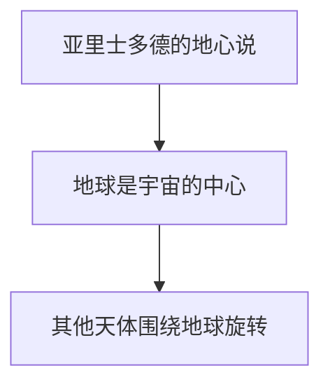
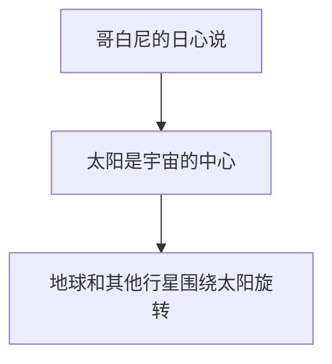
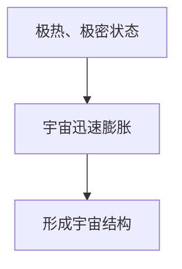
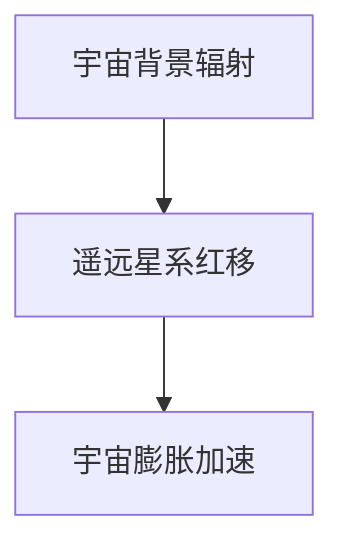
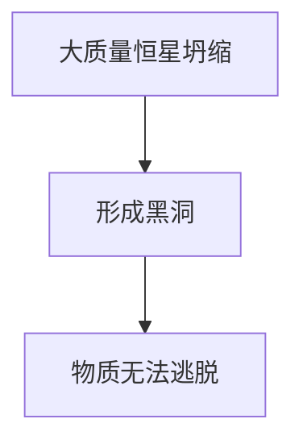
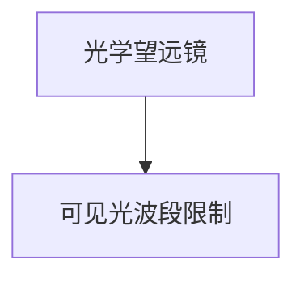
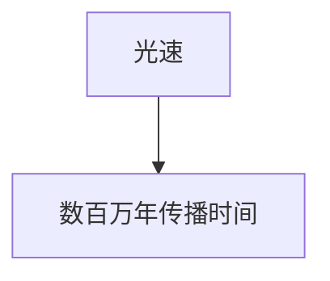
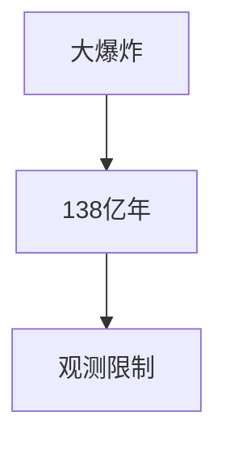
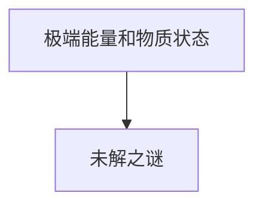

                 

### 第一部分：宇宙认知的历史与现状

#### 1.1 宇宙认知的起源与发展

人类对宇宙的认知历程是一个漫长而曲折的过程，充满了对未知世界的探索与思考。早在古代，人类就开始尝试理解宇宙的本质。古希腊哲学家亚里士多德提出了地心说，即认为地球是宇宙的中心，其他天体围绕地球旋转。这一观点在当时被认为是权威的，并持续了数千年。

亚里士多德的地心说模型  

然而，随着科学技术的发展，人类对宇宙的认知逐渐发生了变化。波兰天文学家哥白尼在16世纪初提出了日心说，即认为太阳是宇宙的中心，地球和其他行星围绕太阳旋转。这一革命性的观点为人类带来了全新的宇宙观。

哥白尼的日心说模型  

17世纪，英国科学家艾萨克·牛顿进一步发展了宇宙理论。他提出了万有引力定律，这一物理定律解释了行星运动的原因。牛顿的万有引力定律为人类理解宇宙提供了重要的理论基础。

牛顿的万有引力定律  
$$
F = G \frac{m_1 m_2}{r^2}
$$

其中，\( F \) 是引力，\( G \) 是引力常数，\( m_1 \) 和 \( m_2 \) 是两个物体的质量，\( r \) 是它们之间的距离。

#### 1.2 现代宇宙学的核心理论

现代宇宙学基于哥白尼-牛顿的宇宙观，并结合爱因斯坦的广义相对论，形成了一套完整的理论体系。现代宇宙学的核心理论包括大爆炸理论、宇宙膨胀理论和黑洞理论等。

##### 1.2.1 大爆炸理论

大爆炸理论认为，宇宙起源于约138亿年前的一个极热、极密的状态。在这个瞬间，宇宙迅速膨胀，物质和能量迅速分布，形成了今天我们所观察到的宇宙结构。

大爆炸理论模型  

##### 1.2.2 宇宙膨胀理论

宇宙膨胀理论认为，宇宙在不断扩张。这一理论可以通过宇宙背景辐射、遥远星系的红移等现象得到证实。宇宙膨胀的速度并不是恒定的，而是随着时间的推移在加速。

宇宙膨胀理论模型  

##### 1.2.3 黑洞理论

黑洞理论描述了宇宙中可能存在的一种极端天体。黑洞具有极大的引力，任何物质，包括光线，都无法逃脱。黑洞的形成可能是由于大质量恒星坍缩而成。

黑洞理论模型  

#### 1.3 人类认知宇宙的局限

尽管人类对宇宙的认知取得了巨大进展，但仍然存在许多局限。这些局限主要源于观测工具的限制、宇宙尺度的限制、时间的限制以及能量和物质状态的限制。

##### 1.3.1 观测工具的限制

宇宙的观测依赖于先进的观测工具，如望远镜和探测器。然而，这些工具在性能上有其局限性。例如，光学望远镜只能观测到可见光波段，而其他波段的辐射无法被观测到。

观测工具的局限性  

##### 1.3.2 宇宙尺度的限制

宇宙的尺度巨大，这使得对宇宙深处的观测具有时间上的限制。即使光速是宇宙中的速度极限，光从一个遥远星系传播到地球也需要数百万年。这导致我们无法实时观测宇宙的深处。

宇宙尺度的限制  

##### 1.3.3 时间的限制

宇宙的历史可以追溯到138亿年前的大爆炸。然而，我们能够观测到的宇宙历史只有大约138亿年。这是因为宇宙的膨胀使得光在传播过程中受到限制，导致我们无法观测到更早时期的宇宙。

时间的限制  

##### 1.3.4 能量和物质状态的限制

宇宙中的能量和物质状态具有多样性。然而，我们目前对某些极端能量和物质状态的了解仍然有限。例如，黑洞内部的能量状态和量子引力现象仍然是一个未解之谜。

能量和物质状态的限制  

### 结论

宇宙认知的历史与现状展示了人类对宇宙的探索与思考。虽然我们取得了许多突破，但仍面临诸多局限。随着科学技术的进步，我们有望在未来突破这些局限，进一步揭示宇宙的奥秘。

### 附录

#### A.1 宇宙观测工具介绍

宇宙观测工具包括光学望远镜、射电望远镜、X射线望远镜等。这些工具各自具有不同的观测波段和性能特点，为我们提供了丰富的宇宙观测数据。

#### A.2 宇宙学数学公式汇总

宇宙学中的数学公式包括万有引力定律、相对论公式、暗物质密度公式等。这些公式为我们理解宇宙的物理机制提供了重要的数学工具。

#### A.3 常见宇宙学术语解释

宇宙学术语包括宇宙背景辐射、红移、黑洞等。对这些术语的解释有助于我们更好地理解宇宙学的基本概念。

### 作者

作者：AI天才研究院/AI Genius Institute & 禅与计算机程序设计艺术 /Zen And The Art of Computer Programming

### 摘要

本文从人类知识体系对宇宙认知的局限与突破的角度，探讨了宇宙认知的历史与现状，分析了宇宙认知的局限，并展望了宇宙认知的未来。文章旨在为广大读者提供一部系统、全面的宇宙认知指南。

### 关键词

宇宙认知、历史与现状、局限与突破、大爆炸理论、宇宙膨胀理论、黑洞理论、观测工具、数学公式、宇宙学术语。

