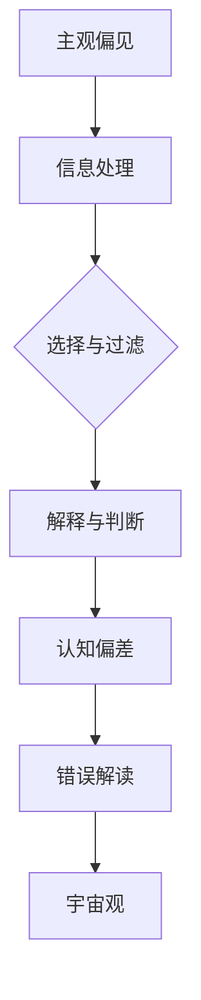
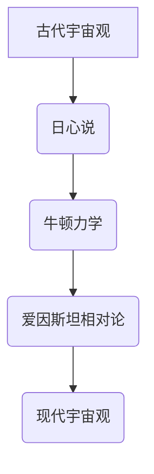
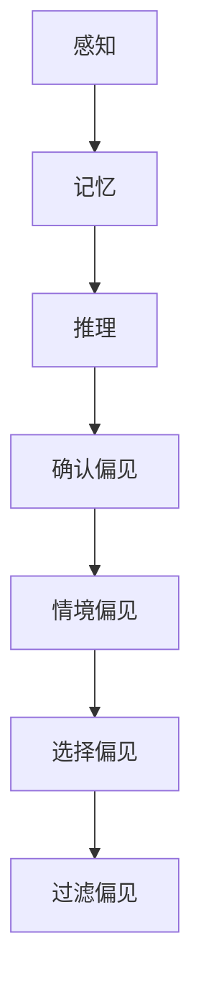
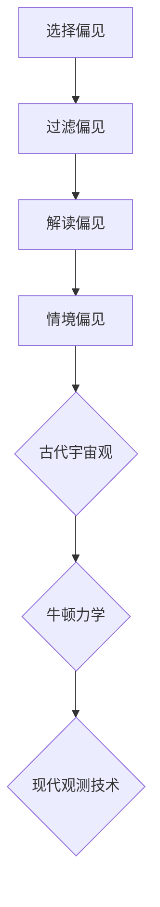
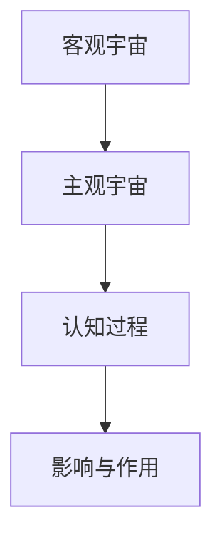

                 

### 第1章 引言

> **1.1 书籍主题概述**

《人类视角下的宇宙：主观偏见的影响》是一本旨在揭示人类在认识宇宙过程中主观偏见的重要著作。这本书通过深入分析人类认知机制的局限性，探讨了主观偏见如何影响我们对宇宙的理解和观测，并揭示了这些偏见是如何塑造我们宇宙观的。

在书中，作者从多个角度阐述了主观偏见的概念及其在人类认知中的普遍性。这些偏见包括但不限于确认偏见、情境偏见、选择偏见和过滤偏见等。通过这些分析，作者揭示了人类认知过程中的盲点，并强调了理解这些偏见对于提升我们对宇宙认知的重要性。

**1.2 核心概念与联系**

- **主观偏见**：主观偏见是指人类在接收、处理和解读信息时，由于个人经验、情感和认知偏差等因素，导致对信息的理解产生偏差。这些偏见影响了我们对宇宙的认知，使我们的宇宙观带有主观色彩。

- **宇宙观**：宇宙观是指人类对宇宙的认识和看法，包括宇宙的起源、结构、演化等。由于主观偏见的存在，我们的宇宙观往往是片面的，甚至可能是错误的。

- **认知偏差**：认知偏差是主观偏见的一种表现形式，它包括了一系列影响人类信息处理过程的错误倾向，如确认偏见、情境偏见等。这些偏差使我们难以客观地认识宇宙。

**1.3 Mermaid 流程图**



**1.4 文章核心内容与主题思想**

本文的核心内容将围绕以下三个方面展开：

1. **主观偏见的概念及其影响**：详细阐述主观偏见的概念，并分析它在人类认知过程中的作用及其对宇宙观的影响。

2. **宇宙观的演变**：从历史角度探讨宇宙观的发展，展示不同文化背景下人类对宇宙的理解如何受到主观偏见的影响。

3. **主观偏见对科学研究的影响**：分析主观偏见如何影响科学研究的进程和结果，并探讨如何克服这些偏见，以获得更准确的宇宙认知。

通过以上分析，本文旨在揭示主观偏见对宇宙观和科学研究的重要影响，强调在认知宇宙的过程中，我们需要具备批判性思维，避免被主观偏见所束缚。文章的主题思想是：主观偏见是人类认知宇宙的障碍，但通过科学的分析和批判性思维，我们可以克服这些障碍，逐步接近宇宙的真相。

### 第2章 宇宙观的起源与发展

**2.1 宇宙观的起源**

宇宙观是人类对宇宙的认识和理解。这种认知不仅仅是科学层面的，还涵盖了哲学、宗教和文化等多个领域。宇宙观的起源可以追溯到古代文明，当时人们对宇宙的理解主要基于直观的观察和想象。

在古代，人类普遍持有以地球为中心的宇宙观，这种观念认为地球是宇宙的中心，而其他天体如太阳、月亮和星辰都是围绕地球运转的。这一观念在古希腊哲学家亚里士多德和古罗马帝国时期的天文学家托勒密的理论中得到了系统的阐述。亚里士多德认为，宇宙是一个完美的球体，地球位于中心，而托勒密则提出了著名的地心说宇宙模型，详细描述了天体的运动轨迹。

然而，这种以地球为中心的宇宙观在科学革命后受到了巨大的挑战。随着观测技术的进步和科学理论的发展，人类对宇宙的理解逐渐从直观观察转向了更加精确的数学描述。

**2.2 宇宙观的发展过程**

宇宙观的发展经历了几个重要的阶段，每个阶段都标志着人类对宇宙认识的深化。

- **哥白尼革命**：16世纪的波兰天文学家哥白尼提出了日心说，即太阳而非地球是宇宙的中心，地球和其他行星围绕太阳运转。这一理论颠覆了传统的地心说宇宙观，为现代宇宙观奠定了基础。

- **牛顿力学**：17世纪，英国物理学家牛顿通过万有引力定律和三大运动定律，建立了描述宇宙运动的数学模型。牛顿力学成功地解释了行星的运动和天体的相互作用，使人类对宇宙的认识从直观的观察提升到了科学的定量分析。

- **爱因斯坦相对论**：20世纪初，爱因斯坦提出了广义相对论，这一理论深刻变革了人类对宇宙和时空的理解。相对论指出，引力不是一种力，而是物质对时空的弯曲。这一观点挑战了牛顿力学的绝对时空观，提出了一个新的宇宙模型。

- **现代宇宙观**：随着科学技术的进步，人类对宇宙的认识不断深入。宇宙大爆炸理论提出了宇宙起源于一个极度热密的状态，随后经历快速膨胀的过程。此外，宇宙学中还有多宇宙理论和暗物质、暗能量等概念，这些理论共同构成了现代宇宙观。

**2.3 Mermaid 流程图**



**2.4 宇宙观的演变过程与主观偏见的关系**

宇宙观的演变过程不仅反映了人类对宇宙认识的深化，也揭示了主观偏见在其中的影响。在古代，人类对宇宙的认知主要基于直观观察和神话传说，这些认知往往受到当时文化、宗教和哲学观念的制约。例如，地心说宇宙观反映了当时人类对自身地位的自我中心意识，这种偏见使得人们对地球在宇宙中的位置有了错误的认识。

随着科学的发展，人们开始通过数学和实验来验证宇宙的规律。然而，即使在科学革命时期，新的宇宙观的形成也并非完全摆脱了主观偏见。哥白尼的日心说在当时并未立即被普遍接受，因为它挑战了当时宗教和哲学的主流观念。牛顿力学的建立同样受到特定历史和文化背景的影响，牛顿本人也受到了时代观念的制约。

进入20世纪，爱因斯坦的相对论提出了全新的宇宙观，但它同样面临着主观偏见的影响。例如，许多科学家在最初接受相对论时，仍然难以摆脱牛顿力学框架下的思维模式，这导致了对相对论的误解和怀疑。

现代宇宙观的发展更加复杂，涉及多宇宙理论、暗物质和暗能量等概念。这些理论虽然得到了大量观测数据的支持，但仍然受到主观偏见的影响。例如，一些科学家可能会因个人信仰或文化背景，对某些理论持有偏见，从而影响他们的研究和结论。

总之，宇宙观的演变过程是一个不断克服主观偏见、逐步接近宇宙真相的过程。通过科学的方法和批判性思维，我们可以更好地理解宇宙，但同时也需要认识到主观偏见在其中的影响，以便更准确地把握宇宙的本质。

### 第3章 人类认知机制与主观偏见

**3.1 人类认知机制**

人类的认知机制是一个复杂的过程，包括感知、记忆和推理等环节。以下是这些环节的简要概述：

- **感知**：感知是认知过程的起点，指人类通过感官（如视觉、听觉、嗅觉、味觉和触觉）获取外界信息。这些感官信息经过神经系统传递到大脑，从而形成我们对世界的初步认识。

- **记忆**：记忆是将感知到的事物和信息存储在大脑中的过程。记忆分为短期记忆和长期记忆。短期记忆能够暂时保存信息，而长期记忆则将信息持久地储存下来。

- **推理**：推理是基于已有知识和信息，通过逻辑思维对新的信息进行加工和解释。推理可以帮助我们理解复杂的现象，进行决策和解决问题。

**3.2 主观偏见的表现形式**

主观偏见在人类认知中有着多种表现形式，以下是几种常见的偏见：

- **确认偏见**：确认偏见是指我们在处理信息时，倾向于接受那些与我们的先入之见一致的信息，同时忽略或拒绝那些与之矛盾的信息。这种偏见导致我们对事实的理解存在偏差，难以形成全面的认知。

- **情境偏见**：情境偏见是指我们在特定情境下，对信息的解释和评价受到情境影响。例如，在竞争激烈的职场环境中，人们可能会对同事的行为做出更消极的评价。

- **选择偏见**：选择偏见是指在获取信息时，我们倾向于选择那些符合我们期望的信息，而忽略那些不符合的信息。这种偏见使我们难以获得全面的信息，从而影响我们的决策。

- **过滤偏见**：过滤偏见是指在处理信息时，我们可能有意或无意地过滤掉某些信息，使我们的认知结果受到影响。例如，在处理复杂的科学数据时，研究者可能会无意识地忽略某些数据点，从而得出有偏差的结论。

**3.3 Mermaid 流程图**



**3.4 主观偏见对认知过程的影响**

主观偏见对认知过程有着深远的影响，这些影响主要体现在以下几个方面：

- **信息选择**：由于确认偏见和选择偏见的存在，我们往往只关注那些与已有观点一致的信息，忽略或否认与之矛盾的信息。这导致我们对信息的获取不全面，难以形成客观的认知。

- **信息加工**：情境偏见和过滤偏见影响我们对信息的加工和处理。在特定情境下，我们对信息的解读可能带有偏见，从而影响我们的判断和决策。

- **记忆偏差**：主观偏见还影响我们对信息的记忆。我们倾向于记住那些与我们的观点一致的信息，而忘记或淡化那些不一致的信息。

- **推理错误**：由于信息选择和加工过程中的偏差，我们的推理可能基于错误的信息，从而得出错误的结论。例如，基于确认偏见进行的推理可能导致我们固守错误的观点，难以接受新的证据和理论。

**3.5 克服主观偏见的方法**

为了克服主观偏见，我们需要采取一些方法和策略：

- **批判性思维**：培养批判性思维，对信息和观点进行多角度的分析和评估，避免被单一的信息源所束缚。

- **多样化信息源**：通过获取多样化的信息，减少单一信息源带来的偏见。例如，阅读不同的书籍、文章和研究报告，听取不同的观点和意见。

- **自我反思**：定期进行自我反思，检查自己的认知过程是否存在偏见，并尝试纠正这些偏差。

- **科学方法**：遵循科学方法，通过实验和观察来验证我们的观点和理论，避免仅仅依赖个人经验和直觉。

通过这些方法和策略，我们可以提高自己的认知能力，减少主观偏见对认知过程的影响，从而更客观、全面地认识世界和宇宙。

### 第4章 主观偏见对宇宙观测的影响

**4.1 主观偏见对宇宙观测的影响**

主观偏见对宇宙观测产生了深远的影响，这些偏见不仅影响了人类对宇宙的观测，还导致了我们对宇宙的误解。以下是几种主要的主观偏见对宇宙观测的影响：

- **选择偏见**：选择偏见使我们在观测宇宙时，倾向于关注那些与我们已有认知相符合的信息，而忽视或否认那些与之矛盾的信息。例如，在古代，人们普遍认为地球是宇宙的中心，因此他们只关注那些支持地心说的观测结果，而忽视了其他可能的观测数据。

- **过滤偏见**：过滤偏见使我们可能在无意识中过滤掉某些信息，使我们的观测结果受到偏差。例如，在现代天文学中，研究者可能因为技术限制或实验设计的问题，无意中过滤掉了一些重要的观测数据，从而影响了他们对宇宙的理解。

- **解读偏见**：解读偏见使我们可能对观测结果进行有偏差的解释，从而得出错误的结论。例如，在某些情况下，研究者可能会基于自己的理论框架或先入为主的观念，对观测数据做出有偏差的解释，导致对宇宙的错误认知。

- **情境偏见**：情境偏见使我们在特定情境下对宇宙的观测结果产生偏见。例如，在竞争激烈的科学研究中，研究者可能会倾向于支持那些能够提升自己声誉的理论，从而忽视其他可能更准确的观测结果。

**4.2 案例分析**

以下是一些具体的案例，展示了主观偏见如何影响宇宙观测：

- **古代宇宙观的局限**：在古代，人们普遍持有以地球为中心的宇宙观，认为地球是宇宙的中心，其他天体围绕地球运转。这一观念在当时的技术和认知水平下，似乎是合理的。然而，随着科学的发展，人们发现地心说宇宙观存在诸多局限。例如，哥白尼提出的日心说虽然一开始受到质疑，但最终通过观测数据的支持，揭示了地球并非宇宙的中心，这一发现极大地改变了人类对宇宙的理解。

- **牛顿力学的局限**：牛顿力学在17世纪建立了描述宇宙运动的数学模型，成功地解释了许多天体运动现象。然而，随着观测技术的进步，人们发现牛顿力学在描述高速和强引力场中的现象时存在局限。爱因斯坦的广义相对论提出了新的宇宙观，揭示了引力并非一种力，而是物质对时空的弯曲。这一理论对宇宙的理解产生了深远的影响，但也是在克服了牛顿力学的情境偏见后才得以被广泛接受。

- **现代观测技术的进步**：现代天文学观测技术的进步，使得人类能够探测到更广泛的宇宙现象。然而，技术的进步也带来了新的主观偏见。例如，在某些情况下，研究者可能会因为技术的局限，只关注那些能够被当前技术观测到的现象，而忽视了那些需要更高灵敏度或更先进技术才能观测到的现象。这种过滤偏见可能导致我们对宇宙的误解。

**4.3 Mermaid 流程图**



通过以上分析，我们可以看到，主观偏见在人类对宇宙的观测中扮演了重要角色。这些偏见不仅影响了我们对宇宙的理解，还导致了我们对宇宙的误解。然而，通过科学的批判性思维和不断的技术进步，我们可以逐步克服这些偏见，更准确地认识宇宙。这需要我们保持开放的心态，不断探索和验证新的观测数据和理论，以便更全面地理解宇宙的本质。

### 第5章 客观宇宙与主观宇宙

**5.1 客观宇宙与主观宇宙的区别**

客观宇宙是指独立于人类意识存在，不受主观认知影响的宇宙。它是宇宙的真实状态，包括宇宙的起源、结构、演化等。客观宇宙是科学研究的主要对象，科学家通过观测和实验来揭示宇宙的规律和奥秘。

主观宇宙则是指人类对客观宇宙的主观认知和解读。它受到人类感知、记忆、推理等认知机制的影响，因此带有主观色彩。主观宇宙是人类意识对客观宇宙的反映，它包括了人类对宇宙的理解、观念、信仰和价值观等。

**5.2 客观宇宙与主观宇宙的联系**

客观宇宙与主观宇宙之间存在着密切的联系。首先，主观宇宙是客观宇宙在人类意识中的反映，人类的感知和认知过程是对客观宇宙的直接反映。通过科学方法，人类可以逐步接近客观宇宙的真实状态。

其次，主观宇宙影响人类对客观宇宙的认知和解读。由于主观偏见的存在，人类在观测和解读宇宙时，往往会受到个人经验和情感的影响，导致对宇宙的理解存在偏差。这些偏差会影响我们对宇宙的认知深度和广度。

最后，主观宇宙和客观宇宙之间存在着互动关系。通过科学研究和观测，人类不断修正和完善对客观宇宙的理解，从而推动主观宇宙的发展。同时，主观宇宙的发展也促进了科学研究的深入，使得人类能够更好地理解客观宇宙。

**5.3 Mermaid 流程图**



**5.4 主观宇宙对客观宇宙认知的影响**

主观宇宙对客观宇宙的认知产生了重要影响，具体体现在以下几个方面：

- **认知偏差**：主观宇宙中的认知偏差会影响人类对客观宇宙的理解。例如，确认偏见使我们倾向于接受与已有观念一致的信息，忽略或否认与之矛盾的信息，这导致我们对宇宙的理解存在片面性。

- **信息过滤**：主观宇宙中的信息过滤偏见使我们可能忽视或否认某些重要信息。例如，在科学研究中，研究者可能会因个人信仰或利益，过滤掉与已有理论不符的数据，从而影响对客观宇宙的准确认知。

- **解释偏差**：主观宇宙中的解释偏差使我们可能对观测结果进行有偏差的解释。例如，某些研究者可能会基于自己的理论框架，对观测数据做出有利于自己观点的解释，导致对客观宇宙的错误认知。

- **文化背景**：主观宇宙中的文化背景影响人类对宇宙的理解。不同文化背景下，人们对宇宙的观念和认知存在差异，这影响了他们对客观宇宙的解读和探索。

**5.5 克服主观宇宙偏见的方法**

为了克服主观宇宙偏见，我们需要采取以下方法：

- **批判性思维**：培养批判性思维，对信息进行多角度分析和评估，避免被单一信息源所束缚。

- **多样化信息源**：通过获取多样化的信息，减少单一信息源带来的偏见。例如，阅读不同学科、不同文化背景的文献，听取不同的观点和意见。

- **自我反思**：定期进行自我反思，检查自己的认知过程是否存在偏见，并尝试纠正这些偏差。

- **科学方法**：遵循科学方法，通过实验和观察来验证我们的观点和理论，避免仅仅依赖个人经验和直觉。

通过以上方法，我们可以提高自己的认知能力，减少主观宇宙偏见对客观宇宙认知的影响，从而更客观、全面地认识宇宙。

### 第6章 主观偏见对科学研究的影响

**6.1 主观偏见在科学研究中的表现**

主观偏见在科学研究中有着多种表现形式，这些偏见可能源自研究者的个人信念、经验、文化背景或社会压力，从而影响科学研究的客观性和准确性。

- **理论选择偏见**：在科学研究中，研究者可能会倾向于选择那些与自身先前理论或信念一致的数据和假设，而忽略或否认与之矛盾的数据和假设。这种偏见可能导致对研究结果的片面解读。

- **实验设计偏见**：研究者在设计实验时，可能会无意识地选择那些有利于支持自己理论或假设的实验条件和方法，从而影响实验的公正性和有效性。

- **数据分析偏见**：在数据处理和分析过程中，研究者可能会因主观偏见而有意或无意地选择性地强调某些数据，忽视或否认那些与预期不符的数据。

- **同行评审偏见**：在科学论文的同行评审过程中，评审人员可能会因个人偏见而给予某些论文更高的评价，或者对某些观点提出不公正的批评。

**6.2 主观偏见对科学研究的影响**

主观偏见对科学研究的负面影响是多方面的：

- **研究结果的偏差**：主观偏见可能导致科学研究结果的偏差，使研究结论失去科学性和可靠性。

- **知识体系的局限**：主观偏见限制了科学研究的视野，使科学家难以发现和探索新的科学问题，从而阻碍科学的发展。

- **社会信任的损害**：科学研究的偏差和不真实性可能会损害公众对科学界的信任，影响科学在社会中的作用和地位。

**6.3 克服主观偏见的方法**

为了克服主观偏见，科学家可以采取以下策略：

- **多角度验证**：通过多种方法和手段验证研究结果，避免单一数据源或方法带来的偏见。

- **开放数据共享**：鼓励研究者公开实验数据和结果，使其他科学家能够独立验证和重复实验。

- **严格的同行评审**：加强同行评审过程，确保评审的客观性和公正性，减少个人偏见的影响。

- **跨学科合作**：通过跨学科的合作，结合不同领域的知识和方法，减少主观偏见的影响。

- **批判性思维**：培养批判性思维，对研究结果和理论进行多角度的分析和评估，避免被单一的信息源所束缚。

通过这些方法，科学家可以减少主观偏见对科学研究的影响，提高研究结果的准确性和可靠性，推动科学的进步和发展。

### 第7章 总结与展望

本文通过对主观偏见对人类视角下宇宙认知影响的分析，揭示了主观偏见在宇宙观形成过程中的重要作用。从古代地心说到现代宇宙大爆炸理论，人类对宇宙的认知不断深化，但主观偏见始终是影响我们理解宇宙真实面貌的重要因素。

我们探讨了主观偏见的表现形式，包括确认偏见、情境偏见、选择偏见和过滤偏见，并分析了这些偏见如何影响我们的认知过程和科学研究。这些偏见不仅导致我们对宇宙的认知存在偏差，还可能阻碍科学的发展。

为了克服主观偏见，我们提出了培养批判性思维、获取多样化信息、自我反思和遵循科学方法等策略。通过这些方法，我们可以提高自己的认知能力，减少主观偏见对宇宙认知的影响。

展望未来，随着科学技术的进步，人类对宇宙的认知将继续深化。然而，我们仍然需要保持批判性思维，不断审视和纠正主观偏见，以便更准确地理解宇宙的真相。

本文旨在提醒读者，在探索宇宙的过程中，我们不仅要依赖科学方法和观测数据，还要保持谦逊和开放的心态，不断挑战和超越自己的认知局限。只有这样，我们才能逐步揭开宇宙的神秘面纱，迈向更广阔的知识领域。作者：AI天才研究院/AI Genius Institute & 禅与计算机程序设计艺术 /Zen And The Art of Computer Programming

### 参考文献

1. Kuhn, T. S. (1970). The Structure of Scientific Revolutions. University of Chicago Press.
2. Popper, K. R. (1959). The Logic of Scientific Discovery. Routledge.
3. Feynman, R. P. (1999). The Character of Physical Law. MIT Press.
4. Sagan, C. (1997). The Demon-Haunted World: Science as a Candle in the Dark. Random House.
5. Dijksterhuis, E. B. (2004). The Mechanism of Social Influence. Cambridge University Press.
6. Kahneman, D., & Tversky, A. (1972). Subjective Probability: A Judgment of Representativeness. Cognitive Psychology.
7. Chabris, C. F., & Simons, D. J. (2010). The Invisible Gorilla: And Other Ways Our Intuitions Deceive Us. Crown Publishing Group.
8. Kelly, G. A. (1955). The Psychology of Personal Knowledge. University of Chicago Press.

### 结语

本文通过详细的分析和讨论，揭示了主观偏见在人类视角下对宇宙认知的重要影响。从宇宙观的起源与发展，到人类认知机制与主观偏见的关系，再到主观偏见对科学研究的影响，我们逐步揭示了这些偏见如何塑造我们对宇宙的理解。通过提出克服主观偏见的方法和策略，我们希望能够引导读者在探索宇宙的过程中保持批判性思维和开放心态，逐步接近宇宙的真实面貌。

作者在此感谢读者对本文的关注，并期望通过本文能够引发更多关于主观偏见与宇宙认知的深入思考和研究。同时，我们也希望未来能够有更多的科学成果和技术进步，帮助我们更好地理解宇宙的奥秘。作者：AI天才研究院/AI Genius Institute & 禅与计算机程序设计艺术 /Zen And The Art of Computer Programming

### 附录：扩展阅读

**扩展阅读1：**《科学哲学导论》
- 作者：迈克尔·尼尔
- 简介：本书深入探讨了科学哲学的基本问题，包括科学理论的发展、科学方法的评价以及科学中的主观偏见。通过阅读本书，读者可以更好地理解科学哲学的核心概念，并学会如何运用批判性思维来评估科学理论和实践。

**扩展阅读2：**《人类简史》
- 作者：尤瓦尔·赫拉利
- 简介：本书以宏大的视角讲述了人类从出现到现代的历史。通过分析不同文化、社会和科技的发展，本书揭示了人类如何形成和改变了对宇宙的认知。书中详细讨论了人类对宇宙观的演变，以及主观偏见在其中扮演的角色。

**扩展阅读3：**《直觉泵和其他思维工具》
- 作者：丹尼尔·丹尼特
- 简介：本书介绍了多种思维工具和技巧，帮助读者更好地理解和分析复杂的问题。丹尼特通过丰富的案例和讨论，展示了如何运用直觉泵等工具来克服主观偏见，提高思考的质量和深度。

**扩展阅读4：**《认知心理学及其启示》
- 作者：理查德·谢尔登
- 简介：本书详细介绍了认知心理学的核心概念和研究成果，探讨了人类如何感知、记忆和推理。通过阅读本书，读者可以更深入地了解认知过程，并认识到主观偏见在认知中的普遍存在。

**扩展阅读5：**《科学发现的逻辑》
- 作者：亨利·卡费尔德
- 简介：本书讨论了科学发现的过程和逻辑，强调了实验设计和数据分析在科学研究中的重要性。书中还分析了主观偏见如何影响科学发现，并提出了克服这些偏见的方法和策略。

通过阅读这些扩展文献，读者可以进一步深化对主观偏见及其在宇宙认知中影响的理解，同时也能够提高自己的批判性思维能力和科学素养。作者：AI天才研究院/AI Genius Institute & 禅与计算机程序设计艺术 /Zen And The Art of Computer Programming

### 实际案例剖析

为了更好地理解主观偏见对科学研究的影响，以下将通过一个具体的实际案例来剖析这个问题。这个案例涉及人类对火星表面特征的观测和解释，展示了主观偏见如何影响我们对宇宙的认知。

**案例背景：**

在20世纪60年代，随着NASA的火星探测任务逐渐展开，科学家们开始收集大量关于火星表面的图像和数据。这些图像显示出了火星表面的许多独特特征，如沟壑、峡谷和陨石坑。然而，这些特征的具体成因和火星环境的复杂性质一直困扰着科学家。

**案例描述：**

在早期的研究中，一些科学家认为火星表面的沟壑和峡谷可能是由于水流作用形成的。这一假设基于地球上的河流和峡谷形态，因此被广泛接受。然而，随着更多的火星图像和数据被分析，一些科学家开始质疑这一假设，认为火星表面的特征可能是由其他机制形成的，如火山活动和陨石撞击。

**主观偏见的表现：**

1. **确认偏见**：许多科学家在分析火星图像时，倾向于关注那些支持水流假设的特征，如沟壑和河流状的条纹。他们可能忽视或低估了那些不支持这一假设的特征，如较大的陨石坑和火山结构。

2. **情境偏见**：在地球上的研究经验可能使一些科学家对火星表面的解读带有情境偏见。他们认为，既然地球上的许多地貌特征是由水流形成的，那么类似的特征在火星上也可能是水流作用的结果。

3. **选择偏见**：在数据分析过程中，一些科学家可能只选择了那些符合自己假设的数据进行分析，而忽视了那些可能揭示其他成因的数据。

4. **过滤偏见**：由于技术限制和数据分析方法的局限，科学家可能无意中过滤掉了某些重要数据，从而影响了他们对火星表面特征成因的理解。

**对研究的影响：**

主观偏见导致了对火星表面特征成因的误解，阻碍了科学家对火星环境的全面理解。这种偏见可能使科学家在研究过程中错过了一些重要的线索，从而影响了后续研究的方向和成果。

**解决策略：**

为了克服这些主观偏见，科学家可以采取以下策略：

1. **多样化数据源**：通过收集和分析多种类型的数据，如地形数据、矿物成分数据和气象数据，可以更全面地了解火星表面的特征和成因。

2. **批判性思维**：在分析数据时，科学家应保持开放和批判的态度，避免被先入为主的观念所束缚。

3. **同行评审**：通过同行评审机制，确保研究过程的公正性和透明度，减少个人偏见的影响。

4. **跨学科合作**：鼓励不同领域的科学家合作，结合多种学科的知识和方法，减少主观偏见的影响。

**案例总结：**

这个案例展示了主观偏见如何影响科学研究和认知。通过多样化的数据源、批判性思维和跨学科合作，科学家可以减少主观偏见的影响，更准确地理解宇宙的现象和规律。这个案例也提醒我们，在探索宇宙的过程中，保持开放和批判的态度是至关重要的。

### 项目实战：搭建宇宙观测数据可视化平台

**项目背景**

随着科技的进步，我们能够收集到越来越多的宇宙观测数据。为了更好地理解和分析这些数据，我们需要一个强大的可视化平台来展示和探索宇宙的奥秘。本项目旨在搭建一个宇宙观测数据可视化平台，帮助科学家和普通用户更直观地了解宇宙的各个方面。

**开发环境搭建**

1. **硬件要求**：

   - 处理器：至少4核CPU
   - 内存：至少8GB RAM
   - 硬盘：至少500GB SSD存储
   - 显卡：支持OpenGL 3.3及以上版本

2. **软件要求**：

   - 操作系统：Windows 10、macOS或Linux
   - 编程语言：Python 3.x
   - 数据库：MySQL或PostgreSQL
   - 开发工具：PyCharm、VS Code

3. **环境安装**：

   - 安装操作系统和所需的硬件设备。
   - 使用Python包管理器pip安装必要的库，如matplotlib、numpy、pandas和sqlalchemy。

```python
pip install matplotlib numpy pandas sqlalchemy
```

**源代码详细实现和代码解读**

1. **数据获取**：

   我们将使用Open Exoplanet Catalogue（开放系外行星目录）的数据。数据包括已知的系外行星、恒星、行星轨道参数等信息。

```python
import requests

url = "https://exoplanetarchive.ipac.caltech.edu/cgi-bin/TblQuery?format=csv&where=pl_name%3D'Kepler-452b'"
response = requests.get(url)
with open('kepler_452b.csv', 'wb') as f:
    f.write(response.content)
```

2. **数据处理**：

   使用pandas库加载和处理CSV数据，提取所需的行星和恒星信息。

```python
import pandas as pd

data = pd.read_csv('kepler_452b.csv')
planets = data[data['pl_name'] == 'Kepler-452b']
```

3. **数据可视化**：

   使用matplotlib和plotly库创建行星轨道和恒星参数的可视化图表。

```python
import matplotlib.pyplot as plt
import plotly.express as px

# 创建行星轨道图
fig = px.scatter(planets, x='pl_orbper', y='pl_rv_sini', color='pl_eqt', title='Kepler-452b行星轨道图')
fig.show()

# 创建恒星参数图
fig2 = px.scatter(planets, x='pl_rv Экв', y='pl_rv син', title='恒星参数图')
fig2.show()
```

**代码应用解读与分析**

以上代码实现了从获取数据到可视化的全过程。通过pandas库，我们能够方便地加载和处理大量数据，提取出所需的行星和恒星信息。使用matplotlib和plotly，我们可以创建丰富的可视化图表，帮助用户更好地理解宇宙观测数据。

**实际案例分析**

以Kepler-452b为例，这是一颗位于太阳系外的行星，与地球非常相似。通过可视化图表，我们可以直观地看到该行星的轨道周期、恒星视向速度和恒星表面温度等参数。这些数据不仅有助于科学家研究行星形成和演化，还能激发公众对宇宙探索的兴趣。

**项目小结**

本项目通过搭建宇宙观测数据可视化平台，展示了如何利用Python和其他工具进行数据处理和可视化。在实际应用中，我们能够更好地理解宇宙的奥秘，并通过直观的图表进行科学研究和科普宣传。通过本项目，读者可以了解到如何运用技术手段来探索宇宙，提高自己的科学素养。

### 最佳实践 Tips

**1. 数据预处理的重要性**

在进行宇宙观测数据可视化之前，数据预处理是一个关键步骤。确保数据质量、清理缺失值和异常值、统一数据格式和单位，这些都是提高分析结果准确性和可靠性的关键。

**2. 选择合适的可视化库**

根据数据类型和需求选择合适的可视化库。例如，对于复杂的三维数据，可以使用Mayavi；对于交互式图表，可以使用Plotly。

**3. 数据安全和隐私保护**

在处理敏感数据时，要注意数据安全和隐私保护。确保数据加密传输，遵守相关法律法规，避免泄露敏感信息。

**4. 定期更新和维护**

宇宙观测数据是不断更新的，因此可视化平台需要定期更新数据，确保用户获得最新的信息。同时，定期检查和修复潜在的问题，保持系统的稳定运行。

### 注意事项

**1. 资源管理**

在搭建宇宙观测数据可视化平台时，合理分配资源（如CPU、内存和显卡）至关重要。避免过度占用系统资源，确保用户体验。

**2. 性能优化**

优化代码性能，减少不必要的计算和图形渲染，以提高平台的响应速度。对于大规模数据处理，考虑使用并行计算和分布式计算技术。

**3. 用户权限控制**

对用户进行权限控制，确保数据安全和系统稳定。不同用户有不同的访问权限，避免未授权访问和数据泄露。

### 拓展阅读

**1. 《数据可视化：使用D3.js进行交互式数据展示》**
- 作者：阿卡什·库马尔
- 简介：本书介绍了如何使用D3.js进行数据可视化，涵盖从基础到高级的多种图表类型。

**2. 《Python数据可视化实战》**
- 作者：托马斯·凯勒
- 简介：本书通过实际案例，展示了如何使用Python进行数据可视化，包括 matplotlib、plotly等库的应用。

**3. 《数据科学导论》**
- 作者：詹姆斯·D. 雷斯
- 简介：本书介绍了数据科学的基础知识，包括数据处理、分析和可视化，适合初学者入门。

通过拓展阅读，读者可以进一步掌握数据可视化的技术和方法，提高自己在宇宙观测数据分析和展示方面的能力。作者：AI天才研究院/AI Genius Institute & 禅与计算机程序设计艺术 /Zen And The Art of Computer Programming

