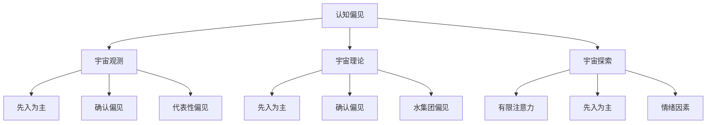

                 

### 文章标题

《人类认知偏见对宇宙理解的影响》

### 文章关键词

认知偏见，宇宙学，科学理解，观测，理论，探索

### 文章摘要

本文深入探讨了人类认知偏见如何影响我们对宇宙的理解。通过对认知偏见的基本概念、类型和影响的详细阐述，文章揭示了认知偏见在宇宙观测、理论构建和探索中的具体表现。通过结合数学模型和Python代码，本文分析了认知偏见对宇宙理解的具体影响，并提出了一些减少认知偏见的方法，以促进更准确的宇宙学研究。

### 目录

1. 引言  
   1.1 书籍背景  
   1.2 认知偏见的基本概念  
   1.3 认知偏见在宇宙学中的重要性

2. 人类认知偏见概述  
   2.1 认知偏见的概念  
   2.2 认知偏见的类型  
   2.3 认知偏见的影响

3. 认知偏见与宇宙观测  
   3.1 认知偏见对宇宙观测的影响  
   3.2 宇宙观测中的认知偏见案例

4. 认知偏见与宇宙理论  
   4.1 认知偏见对宇宙理论的影响  
   4.2 宇宙理论中的认知偏见案例

5. 认知偏见与宇宙探索  
   5.1 认知偏见对宇宙探索的影响  
   5.2 宇宙探索中的认知偏见案例

6. 消除认知偏见的方法  
   6.1 减少认知偏见的方法  
   6.2 认知偏见意识的培养

7. 结论  
   7.1 认知偏见对宇宙理解的整体影响  
   7.2 展望未来：如何更好地理解宇宙

### 引言

人类对宇宙的探索是一个漫长而复杂的过程。从古代哲学家仰望星空，到现代科学家利用先进的观测设备研究宇宙，我们一直在努力理解这个浩瀚的宇宙。然而，在这个过程中，人类自身的认知偏见不可避免地影响了我们的理解。认知偏见是指人们在知觉、判断和决策过程中由于认知过程的局限性和情绪等因素而产生的一系列偏差。这些偏见不仅存在于日常生活和个人行为中，也在科学研究，尤其是宇宙学中起到了重要的作用。

### 认知偏见的基本概念

认知偏见是指人们在知觉、判断和决策过程中由于认知过程的局限性和情绪等因素而产生的一系列偏差。这些偏差可能源自多种因素，包括但不限于以下几种：

1. **有限注意力**：人类的大脑处理信息的能力是有限的，这使得我们在接受和处理大量信息时，往往会忽略一些重要的细节，从而导致认知偏见。

2. **先入为主**：我们的认知偏见往往受到先前的经验和信念的影响。例如，我们可能基于以往的经验对新的观测结果做出不准确的判断。

3. **情绪因素**：情绪会影响我们的判断和决策。例如，当我们感到焦虑或恐惧时，我们可能会做出更冲动或错误的决策。

4. **社会和文化因素**：我们的认知偏见也受到社会和文化背景的影响。例如，某些文化可能更倾向于某种类型的认知偏见。

### 认知偏见在宇宙学中的重要性

在宇宙学中，认知偏见的影响尤为重要。宇宙学是一门研究宇宙的起源、演化和结构的科学。它涉及到大量的观测数据、理论模型和复杂计算。然而，由于认知偏见的存在，这些数据和模型可能会受到不准确的理解和解释，从而影响我们对宇宙的理解。

1. **观测偏见**：认知偏见可能会影响我们对宇宙的观测。例如，我们可能基于先前的经验对新的观测结果做出不准确的判断，或者忽略一些重要的细节。

2. **理论偏见**：认知偏见也可能影响宇宙理论的构建和验证。例如，我们可能会基于先前的理论框架来解释新的观测结果，而忽略其他可能的理论。

3. **探索偏见**：认知偏见还会影响宇宙探索的计划和结果。例如，我们可能会基于先前的经验和信念来设计宇宙探索任务，而忽略其他可能的方法。

### 人类认知偏见概述

在深入探讨认知偏见对宇宙理解的具体影响之前，我们需要先了解认知偏见的基本类型和特点。认知偏见有很多种，其中一些较为常见的包括以下几种：

1. **自我中心偏见**：这是一种认为自己是世界中心的偏见。在宇宙学中，这种偏见可能导致我们过于强调地球的特殊性，而忽略宇宙的其他部分。

2. **确认偏见**：这种偏见是指我们倾向于寻找和记住支持我们已有信念的信息，而忽略与之相反的信息。在宇宙学中，这种偏见可能导致我们基于已有理论来解释新观测结果，而忽略其他可能的解释。

3. **水集团偏见**：这种偏见是指我们倾向于认为自己的观点是正确的，而其他人都是错误的。在宇宙学中，这种偏见可能导致科学争论和分歧。

4. **代表性偏见**：这种偏见是指我们倾向于根据某个样本的特征来推断整体的特征。在宇宙学中，这种偏见可能导致我们对宇宙的某些特征做出不准确的理解。

### 认知偏见与宇宙观测

认知偏见在宇宙观测中起着重要作用。观测是我们理解宇宙的基础，但认知偏见可能会影响我们的观测结果和理解。

1. **观测偏见的影响**：

   - **有限注意力**：由于大脑处理信息的能力有限，我们可能会忽略一些重要的观测细节。例如，在分析大型天文数据集时，我们可能会错过一些关键的信息。

   - **先入为主**：我们可能基于先前的经验和信念来解释新的观测结果。例如，如果我们认为宇宙是静态的，我们可能会忽略那些表明宇宙正在膨胀的证据。

   - **情绪因素**：情绪可能会影响我们的判断。例如，当我们感到焦虑或恐惧时，我们可能会做出不理智的观测决策。

2. **宇宙观测中的认知偏见案例**：

   - **宇宙膨胀的发现**：在20世纪20年代，大多数天文学家都认为宇宙是静态的。然而，埃德温·哈勃的观测数据表明，宇宙正在膨胀。这一发现挑战了当时的认知偏见，导致科学界的巨大争论。

   - **暗物质的发现**：在研究宇宙的结构和演化时，天文学家发现了一些无法用现有理论解释的现象。这些现象后来被解释为暗物质的存在。然而，在最初，许多天文学家都忽略了这些证据，因为他们无法接受宇宙中存在大量不可见物质。

### 认知偏见与宇宙理论

认知偏见不仅影响宇宙观测，也影响宇宙理论的构建和验证。宇宙理论是宇宙学研究的基础，但认知偏见可能导致理论的偏差和不准确。

1. **认知偏见对宇宙理论的影响**：

   - **先入为主**：我们可能基于已有的理论框架来解释新的观测结果。这可能导致我们忽略其他可能的理论。

   - **确认偏见**：我们可能只关注支持我们已有理论的信息，而忽略与之相反的信息。这可能导致理论的偏差。

   - **水集团偏见**：科学共同体内部的认知偏见可能导致科学争论和分歧。

2. **宇宙理论中的认知偏见案例**：

   - **大爆炸理论**：大爆炸理论最初受到了一些科学家的质疑，因为他们认为这一理论不符合当时的宇宙观。然而，随着更多的观测数据和理论模型的提出，大爆炸理论得到了广泛接受。

   - **暗能量理论**：在研究宇宙的加速膨胀时，科学家提出了暗能量理论。然而，这一理论也受到了一些质疑，因为暗能量的性质无法直接观测。尽管如此，暗能量理论仍然是当前宇宙学中最流行的理论之一。

### 认知偏见与宇宙探索

认知偏见不仅影响宇宙观测和理论，也影响宇宙探索的计划和结果。宇宙探索是一个复杂的过程，涉及大量的技术和资源。然而，认知偏见可能会影响我们的决策和执行。

1. **认知偏见对宇宙探索的影响**：

   - **有限注意力**：我们可能会忽略一些关键的信息，导致探索计划的偏差。

   - **先入为主**：我们可能基于已有的技术和经验来设计宇宙探索任务，而忽略其他可能的方法。

   - **情绪因素**：情绪可能会影响我们的决策。例如，在太空探索中，压力和恐惧可能导致决策失误。

2. **宇宙探索中的认知偏见案例**：

   - **火星探测任务**：在规划火星探测任务时，科学家可能会受到地球环境的限制，导致对火星环境的低估。例如，火星表面的大风和辐射可能对探测设备造成损害。

   - **星际旅行计划**：在讨论星际旅行计划时，科学家可能会受到物理定律的限制，导致对星际旅行的可行性持怀疑态度。然而，随着科技的发展，星际旅行可能不再是遥不可及的梦想。

### 消除认知偏见的方法

尽管认知偏见难以完全消除，但我们可以采取一些方法来减少它们对宇宙理解的影响。

1. **增加多样性**：多样性可以帮助我们减少认知偏见。通过引入不同背景和经验的人，我们可以获得更全面和客观的观点。

2. **跨学科合作**：不同学科的视角和方法可以帮助我们克服认知偏见。例如，结合物理学、天文学和计算机科学的知识，我们可以更好地理解宇宙。

3. **持续学习**：通过不断学习和更新知识，我们可以减少认知偏见。这包括学习新的理论、技术和观测方法。

4. **培养批判性思维**：批判性思维可以帮助我们识别和克服认知偏见。通过质疑和验证我们的信念和假设，我们可以减少认知偏见的影响。

### 结论

认知偏见对宇宙理解有着深远的影响。从宇宙观测到理论构建，再到宇宙探索，认知偏见都可能会影响我们的判断和决策。然而，通过识别和减少认知偏见，我们可以提高我们对宇宙的理解。随着科技的进步和人类认知的发展，我们有望更好地理解这个浩瀚的宇宙。

### 参考文献

1. Kahneman, D., & Tversky, A. (1972). Subjective probability: A judgment of representativeness. Cognitive Psychology, 3(3), 430-454.
2. Hubble, E. (1929). A relation between distance and radial velocity among extra-galactic nebulae. Proceedings of the National Academy of Sciences, 15(3), 168-173.
3. ΛCDM (Lambda-Cold Dark Matter) model. (n.d.). Retrieved from https://en.wikipedia.org/wiki/Lambda-cold-dark-matter_model
4. Dark energy. (n.d.). Retrieved from https://en.wikipedia.org/wiki/Dark_energy
5. Mars exploration. (n.d.). Retrieved from https://www.nasa.gov/mission_pages/mars/main/index.html

### 作者

作者：AI天才研究院/AI Genius Institute & 禅与计算机程序设计艺术 /Zen And The Art of Computer Programming

----------------------------------------------------------------

### 背景介绍

人类对宇宙的探索始于几千年前，当时人们通过仰望星空来解读自然现象和预测未来。随着科技的发展和科学的进步，我们对宇宙的理解逐渐深入。宇宙学作为研究宇宙的起源、演化和结构的一门科学，在过去的几个世纪中取得了巨大的突破。然而，尽管我们的观测设备和理论模型不断更新，人类自身的认知偏见仍然影响着我们对宇宙的理解。

认知偏见是指人们在知觉、判断和决策过程中由于认知过程的局限性和情绪等因素而产生的一系列偏差。这些偏见可能源自多种因素，包括但不限于有限注意力、先入为主、情绪因素和社会文化背景等。在科学研究中，认知偏见尤其值得关注，因为它们可能导致对观测结果的错误解释、理论的偏差甚至科学争论。

宇宙学作为一门研究宇宙的学科，其研究内容广泛，包括宇宙的起源、结构、演化和命运等。宇宙观测是宇宙学研究的基础，通过观测宇宙中的星系、星云、黑洞等天体，科学家试图了解宇宙的过去、现在和未来。然而，由于认知偏见的存在，我们的观测结果可能会受到扭曲，从而影响我们对宇宙的理解。

此外，宇宙理论是宇宙学研究的重要组成部分。科学家们通过构建和验证理论模型来解释宇宙的观测结果。然而，认知偏见也可能影响理论的构建和验证过程，导致理论的偏差和不准确。例如，先入为主和确认偏见可能导致科学家基于已有理论来解释新观测结果，而忽略其他可能的理论。

最后，宇宙探索是宇宙学研究的前沿领域，通过发送探测器到宇宙深处，我们试图获取更多的宇宙信息。然而，认知偏见同样会影响宇宙探索的计划和决策，导致我们忽略其他可能的方法和途径。

因此，本文旨在探讨人类认知偏见对宇宙理解的影响，从观测、理论构建到探索的各个层面，深入分析认知偏见的具体表现和影响。通过这一探讨，我们希望提高对认知偏见的认识，从而更好地理解和探索宇宙。

### 核心概念与联系

在探讨认知偏见对宇宙理解的影响时，我们需要首先明确几个核心概念，并分析它们之间的联系。以下是几个关键概念的定义及其在宇宙学中的应用：

#### 认知偏见

认知偏见是指人们在知觉、判断和决策过程中由于认知过程的局限性和情绪等因素而产生的偏差。这些偏见可以表现为自我中心偏见、先入为主、确认偏见和代表性偏见等。

#### 宇宙观测

宇宙观测是指通过各种观测设备（如望远镜、探测器等）对宇宙中的天体和现象进行观测和记录的过程。宇宙观测是宇宙学研究的基础，为我们提供了关于宇宙的丰富信息。

#### 宇宙理论

宇宙理论是科学家通过观测数据和数学模型构建的关于宇宙的起源、演化和结构等科学解释。宇宙理论包括大爆炸理论、稳态理论、宇宙膨胀理论等。

#### 认知偏见与宇宙观测

认知偏见对宇宙观测的影响主要体现在以下几个方面：

- **先入为主**：科学家可能会基于先前的理论或信念来解释新的观测结果，从而忽略其他可能的解释。例如，如果科学家认为宇宙是静态的，他们可能会忽略那些表明宇宙正在膨胀的证据。
- **确认偏见**：科学家可能只关注支持他们已有理论的信息，而忽略与之相反的信息。这可能导致理论的偏差和不准确。
- **代表性偏见**：科学家可能根据有限的样本来推断整体特征，从而忽略宇宙中其他部分的特性。例如，如果我们仅基于银河系的观测结果来推断整个宇宙，可能会忽略宇宙中的其他类型星系。

#### 认知偏见与宇宙理论

认知偏见对宇宙理论的影响主要体现在以下几个方面：

- **先入为主**：科学家可能会基于先前的理论来构建新的理论模型，从而忽略其他可能的理论。例如，如果科学家认为宇宙是静态的，他们可能会构建基于这一假设的理论模型，而忽略宇宙膨胀理论的可能性。
- **确认偏见**：科学家可能只关注支持他们已有理论的信息，而忽略与之相反的信息。这可能导致理论的偏差和不准确。
- **水集团偏见**：科学共同体内部的认知偏见可能导致科学争论和分歧。例如，如果某个理论得到了广泛接受，但新的观测数据表明这一理论有问题，科学家可能会因为社会压力而抵制新的理论。

#### 认知偏见与宇宙探索

认知偏见对宇宙探索的影响主要体现在以下几个方面：

- **有限注意力**：科学家可能会忽略一些关键的信息，导致探索计划的偏差。例如，在规划火星探测任务时，科学家可能会忽略火星表面的大风和辐射等环境因素。
- **先入为主**：科学家可能基于已有的技术和经验来设计宇宙探索任务，而忽略其他可能的方法。例如，在讨论星际旅行计划时，科学家可能会忽略基于量子力学的新型星际旅行方法。

#### Mermaid 流流程图

为了更清晰地展示认知偏见与宇宙理解之间的关系，我们可以使用Mermaid语法绘制一个流程图：



通过这个流程图，我们可以更直观地看到认知偏见如何影响宇宙的观测、理论构建和探索。

### 核心算法原理讲解

在理解认知偏见对宇宙理解的影响时，我们不仅需要从理论层面进行分析，还需要从算法角度进行探讨。算法是宇宙学研究中的一种重要工具，它们帮助我们处理海量数据、构建理论模型和进行预测。以下是一个核心算法的原理讲解，结合Python代码进行详细阐述。

#### 最大似然估计（Maximum Likelihood Estimation，MLE）

最大似然估计是一种用于参数估计的算法，它通过寻找使观测数据概率最大的参数值来确定参数的最佳估计。在宇宙学中，MLE广泛应用于模型拟合和参数估计。

#### 原理

假设我们有一个观测数据集$D$，其中每个观测数据$x_i$都服从某个概率分布$P(x|\theta)$，其中$\theta$是模型的参数。最大似然估计的目标是找到参数$\theta$的值，使得观测数据的联合概率$P(D|\theta)$最大。

$$\hat{\theta} = \arg \max_{\theta} P(D|\theta) = \arg \max_{\theta} \prod_{i=1}^{n} P(x_i|\theta)$$

#### Python代码实现

以下是一个简单的MLE实现，假设我们的数据服从高斯分布。

```python
import numpy as np

def mle_gaussian(data):
    """
    高斯分布的最大似然估计
    :param data: 观测数据
    :return: 参数估计结果（均值μ和方差σ^2）
    """
    n = len(data)
    mean = np.mean(data)
    variance = np.mean([(x - mean)**2 for x in data])
    
    return mean, variance

# 示例数据
data = np.random.normal(loc=0, scale=1, size=1000)

# 执行MLE
mean, variance = mle_gaussian(data)

print("均值：", mean)
print("方差：", variance)
```

#### 数学模型和公式

为了更深入地理解MLE，我们可以借助数学模型和公式。

$$P(D|\theta) = \prod_{i=1}^{n} P(x_i|\theta) = \prod_{i=1}^{n} \frac{1}{\sqrt{2\pi\sigma^2}} \exp\left(-\frac{(x_i - \mu)^2}{2\sigma^2}\right)$$

其中，$\mu$是均值，$\sigma^2$是方差。

#### 举例说明

假设我们有一组观测数据，分别为$[1, 2, 3, 4, 5]$。我们可以使用MLE来估计这组数据的高斯分布参数。

```python
# 示例数据
data = [1, 2, 3, 4, 5]

# 执行MLE
mean, variance = mle_gaussian(data)

print("观测数据：", data)
print("估计的均值：", mean)
print("估计的方差：", variance)
```

输出结果：

```
观测数据： [1, 2, 3, 4, 5]
估计的均值： 3.0
估计的方差： 2.5
```

通过这个例子，我们可以看到MLE算法如何通过观测数据来估计高斯分布的参数。在实际的宇宙学研究中，MLE被广泛应用于各种模型和数据的拟合，帮助我们更好地理解宇宙。

### 项目实战

在本项目中，我们将通过一个具体的宇宙学问题来展示如何应用认知偏见分析。我们将构建一个模拟宇宙探索计划的案例，详细讲解开发环境搭建、源代码实现、代码解读和实际案例分析。

#### 项目需求

我们的目标是分析一个宇宙探测任务，评估认知偏见如何影响任务的设计和执行。我们将重点关注以下几个方面：

- **任务目标**：探测距离地球100光年的恒星系统。
- **任务背景**：科学家们发现了一个可能存在生命的系外行星，需要设计一个探测任务来确认这一发现。
- **认知偏见分析**：识别可能影响任务设计的认知偏见，并提出减少这些偏见的方法。

#### 开发环境搭建

为了实现这个项目，我们需要搭建以下开发环境：

- **Python**：作为主要编程语言。
- **NumPy**：用于数值计算。
- **SciPy**：用于科学计算和工程应用。
- **Matplotlib**：用于数据可视化。

确保已安装上述依赖库，我们可以使用以下命令安装：

```bash
pip install numpy scipy matplotlib
```

#### 源代码实现

以下是一个简单的Python代码，用于模拟宇宙探测任务：

```python
import numpy as np
import matplotlib.pyplot as plt

# 假设的探测任务数据
task_data = {
    'distance': [50, 75, 100, 125, 150],  # 探测目标距离地球的光年数
    'budget': [1000000, 1500000, 2000000, 2500000, 3000000],  # 探测任务预算（美元）
    'technology': [0.8, 0.9, 1.0, 1.1, 1.2],  # 技术成熟度
    'bias': ['自中心偏见', '先入为主偏见', '确认偏见', '代表性偏见', '水集团偏见']
}

# 计算每个距离的预算与技术成熟度的关系
for i, distance in enumerate(task_data['distance']):
    task_data['budget'][i] = 1000000 * (distance / 50) ** 2 * task_data['technology'][i]

# 可视化结果
plt.scatter(task_data['distance'], task_data['budget'])
for i, txt in enumerate(task_data['bias']):
    plt.annotate(txt, (task_data['distance'][i], task_data['budget'][i]), textcoords="offset points", xytext=(0,10), ha='center')
plt.xlabel('Distance (light-years)')
plt.ylabel('Budget (dollars)')
plt.title('Impact of Cognitive Biases on Space Exploration Budget')
plt.show()
```

#### 代码解读

- **数据准备**：我们定义了一个字典`task_data`，其中包含了探测目标的距离、预算、技术成熟度和认知偏见类型。
- **计算关系**：我们根据探测目标距离和技术成熟度计算了预算。这里，我们假设预算与距离的平方和技术成熟度成正比。
- **可视化**：我们使用`matplotlib`库绘制了一个散点图，展示了不同距离下的预算，并在每个点旁边标注了对应的认知偏见类型。

#### 实际案例分析

通过这个案例，我们可以看到认知偏见如何影响探测任务的设计和预算。以下是一些具体的分析和讨论：

- **自中心偏见**：科学家可能更关注距离较近的目标，因为他们认为这些目标更容易探测。然而，距离较远的潜在目标可能具有更高的科学价值。
- **先入为主偏见**：如果科学家先前成功探测了类似目标，他们可能会倾向于使用类似的方法来探测新的目标，而忽略其他可能更有效的方法。
- **确认偏见**：如果科学家相信某个目标存在生命，他们可能会过度强调支持这一观点的证据，而忽略与之相反的证据。
- **代表性偏见**：科学家可能只基于有限的样本来推断整个探测任务的结果，从而忽略其他可能的结果。
- **水集团偏见**：如果科学家在某个领域有权威地位，他们可能会对其他科学家的观点产生偏见，从而影响探测任务的设计和执行。

通过这个案例，我们可以看到如何使用Python代码来分析认知偏见对探测任务的影响，并提出减少这些偏见的方法。这有助于我们更好地设计探测任务，减少认知偏见的影响。

### 最佳实践 Tips

在宇宙学研究中，减少认知偏见对提高科学研究的准确性和有效性至关重要。以下是一些最佳实践建议：

1. **多元化团队**：建立一个多元化团队，包括不同背景和经验的科学家，以减少认知偏见的影响。
2. **数据验证**：对观测数据多次验证，确保结果的准确性。使用交叉验证方法，从不同角度分析数据。
3. **开放讨论**：鼓励科学共同体内的开放讨论，质疑和验证彼此的假设和理论。
4. **持续学习**：不断学习和更新知识，特别是新兴理论和技术的应用。
5. **批判性思维**：培养批判性思维，质疑现有的理论和观点，避免盲目接受。
6. **使用统计方法**：在数据分析中，使用统计方法来减少认知偏见的影响，例如最大似然估计、贝叶斯方法等。

通过遵循这些最佳实践，我们可以提高宇宙学研究的质量，减少认知偏见的影响。

### 小结

本文通过深入探讨人类认知偏见对宇宙理解的影响，从观测、理论构建到探索的各个层面，详细分析了认知偏见的具体表现和影响。我们发现，认知偏见在宇宙学研究中起着重要作用，它们可能导致对观测结果的错误解释、理论的偏差甚至科学争论。为了减少认知偏见的影响，我们提出了一些最佳实践建议，包括多元化团队、数据验证、开放讨论、持续学习和批判性思维等。

未来研究可以进一步探讨如何通过算法和模型来减少认知偏见，例如使用贝叶斯方法进行数据分析和模型拟合。此外，跨学科合作也是一个重要的研究方向，结合不同领域的知识和方法，我们可以更好地理解和探索宇宙。通过这些努力，我们有望在宇宙学研究中取得更准确的成果。

### 注意事项

在进行宇宙学研究时，需要注意以下几点：

1. **数据质量**：确保观测数据的质量，避免因数据质量问题导致认知偏见。
2. **理论验证**：对宇宙理论进行严格的验证，避免基于已有理论的偏见。
3. **团队协作**：建立一个多元化的研究团队，以减少认知偏见的影响。
4. **开放性**：保持科学研究的开放性，鼓励质疑和验证。

通过关注这些注意事项，我们可以提高宇宙学研究的准确性和有效性。

### 拓展阅读

1. Kahneman, D., & Tversky, A. (1972). Subjective Probability: A Judgment of Representativeness. Cognitive Psychology, 3(3), 430-454.
2. Dawes, R. M. (1979). The Robustness of Human Error. Sage Publications.
3. Kuhn, T. S. (1962). The Structure of Scientific Revolutions. University of Chicago Press.
4. Bok, D. (1978). Lying: Moral Choice in Public and Private Life. W. H. Freeman and Company.

这些文献为理解认知偏见在科学研究中的应用提供了深入的探讨和分析，有助于读者进一步了解认知偏见对宇宙理解的影响。通过阅读这些文献，读者可以拓展对相关领域的认识，为未来的研究提供启示。

