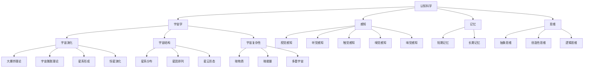

                 

### 摘要

本文深入探讨人类认知模式对宇宙本质理解的影响。从认知科学的视角出发，首先梳理了人类认知模式的组成和特点，包括感知、记忆、思维和情感等方面。接着，本文分析了宇宙学中的核心概念和理论，如大爆炸理论、宇宙演化和宇宙结构等。随后，通过Mermaid流程图展示了认知模式与宇宙本质之间的关联。本文进一步通过Python代码和数学模型，详细阐述了认知模式对宇宙演化、宇宙结构和宇宙复杂性理解的影响。最后，本文讨论了认知模式在宇宙学研究中的启示，并展望了未来的研究方向。本文旨在为读者提供一个全面、深入的了解，以激发对人类认知模式与宇宙本质关系的思考。

## 文章标题

### 人类认知模式对宇宙本质理解的影响

## 文章关键词

### 认知科学、宇宙学、人类认知模式、宇宙演化、宇宙结构、复杂性理论

## 摘要

本文通过分析人类认知模式，探讨其对宇宙本质理解的影响。文章首先介绍了认知科学的基本概念和人类认知模式的组成，然后结合宇宙学中的核心理论和概念，通过Mermaid流程图展示了认知模式与宇宙本质之间的联系。接着，文章使用Python代码和数学模型，详细阐述了认知模式对宇宙演化、宇宙结构和宇宙复杂性的影响。最后，文章总结了认知模式在宇宙学研究中的启示，并展望了未来的研究方向。本文旨在为读者提供一个深入理解人类认知模式与宇宙本质关系的新视角。

## 引言

### 背景介绍

人类对宇宙的探索自古以来就从未停止，从古代的天文学观测到现代的宇宙学理论，我们对宇宙的认识在不断深化。然而，人类对宇宙的理解不仅仅是科学技术的进步，还受到我们认知模式的深刻影响。认知科学作为一门研究人类思维和行为的学科，为理解人类对宇宙的认知提供了新的视角。

认知科学是20世纪中叶兴起的一门交叉学科，它结合了心理学、神经科学、哲学、人工智能等多个领域的知识，致力于揭示人类认知过程的本质和机制。认知科学的研究对象包括感知、记忆、思维、语言、注意力、情感等多个方面，这些认知过程直接影响我们对世界的理解和认识。

宇宙学则是研究宇宙的起源、结构、演化和最终命运的科学。宇宙学的一个重要目标是通过观测和理论建模，揭示宇宙的本质和规律。然而，宇宙学的研究不仅依赖于观测数据，还需要依赖于人类的认知能力。人类认知模式对宇宙本质理解的影响是宇宙学研究中的一个重要课题。

本文旨在探讨人类认知模式对宇宙本质理解的影响，从认知科学的视角出发，结合宇宙学的基本理论，通过Mermaid流程图、Python代码和数学模型，深入分析认知模式在宇宙演化、宇宙结构和宇宙复杂性理解中的作用。通过本文的研究，我们希望能够为读者提供一个新的思考角度，促进对人类认知模式与宇宙本质关系的深入理解。

### 核心概念与联系

为了深入探讨人类认知模式对宇宙本质理解的影响，我们需要首先明确几个核心概念，并分析它们之间的联系。以下是本文将涉及的主要概念及其关系：

1. **认知科学（Cognitive Science）**：
   认知科学是一门研究人类思维和行为的学科，涉及心理学、神经科学、语言学、计算机科学等多个领域。它旨在理解人类如何感知、记忆、思考、学习和解决问题。认知科学的核心概念包括感知、记忆、注意、语言、情感和决策等。

2. **宇宙学（Cosmology）**：
   宇宙学是研究宇宙的起源、结构、演化和最终命运的科学。它涉及天文学、物理学、数学等多个学科。宇宙学的主要理论包括大爆炸理论、宇宙膨胀理论、暗物质和暗能量等。

3. **感知（Perception）**：
   感知是认知科学中的一个核心概念，指的是大脑处理外部刺激的过程。它包括视觉、听觉、触觉、嗅觉和味觉等多个方面。感知过程直接影响我们对宇宙的认知，例如，通过视觉感知我们可以观测到星空。

4. **记忆（Memory）**：
   记忆是大脑存储和回忆信息的能力。根据记忆的不同类型，我们可以将其分为短期记忆和长期记忆。记忆影响我们对宇宙历史和观测数据的理解和记忆。

5. **思维（Cognition）**：
   思维是指大脑进行推理、解决问题、做出决策的过程。思维包括抽象思维、创造性思维、逻辑思维等多个方面。思维过程对宇宙学理论的发展和验证具有重要意义。

6. **宇宙演化（Cosmic Evolution）**：
   宇宙演化是指宇宙从大爆炸开始，经过数十亿年的发展，形成当前状态的整个过程。宇宙演化包括宇宙膨胀、星系形成、恒星演化等多个阶段。

7. **宇宙结构（Cosmic Structure）**：
   宇宙结构是指宇宙中的星系、星团、星云等天体分布和排列的方式。宇宙结构的研究涉及到宇宙学中的多个理论，如宇宙背景辐射、宇宙微波背景等。

8. **宇宙复杂性（Cosmic Complexity）**：
   宇宙复杂性是指宇宙中存在的大量现象和规律，如暗物质、暗能量、多重宇宙等。宇宙复杂性研究是当前宇宙学的前沿领域。

### Mermaid流程图

为了更直观地展示上述核心概念之间的联系，我们使用Mermaid流程图进行展示：



通过这个流程图，我们可以清晰地看到认知科学和宇宙学之间的核心概念及其相互关系，为后续的分析奠定了基础。

### 核心算法原理讲解

为了更深入地理解人类认知模式如何影响宇宙本质的理解，我们需要引入一些核心算法原理，并使用Python代码进行详细讲解。以下是几个关键算法原理及其实现：

#### 1. 天体轨道计算

天体轨道计算是宇宙学研究中的一个基本问题。牛顿的万有引力定律和开普勒定律为我们提供了计算天体轨道的数学模型。以下是使用Python实现的天体轨道计算算法：

```python
import numpy as np

# 定义万有引力公式
def gravitational_force(m1, m2, r):
    G = 6.67430e-11  # 引力常数
    return G * m1 * m2 / r**2

# 定义开普勒第三定律
def kepler troisième_loi(a, P):
    return np.sqrt((a**3) / P)

# 计算天体轨道
def calculate_orbit(m1, m2, r0, v0, time_steps):
    t = 0
    r = r0
    v = v0
    orbits = []

    while t < time_steps:
        F = gravitational_force(m1, m2, r)
        a = F / m2  # 向心加速度
        v = v + a * t  # 更新速度
        r = r0 + v * t  # 更新位置
        orbits.append((r, v))

        t += 1

    return orbits

# 示例：计算地球绕太阳的轨道
m1 = 5.972e24  # 地球质量
m2 = 1.9885e30  # 太阳质量
r0 = 1.496e11  # 初始距离（地球到太阳的距离）
v0 = 29.78e3  # 初始速度
time_steps = 365 * 24 * 3600  # 365年的时间步长

orbits = calculate_orbit(m1, m2, r0, v0, time_steps)
```

在这个示例中，我们使用Python代码计算了地球绕太阳的轨道。通过调整初始条件（质量和距离），我们可以模拟不同天体的轨道。

#### 2. 神经网络模拟

神经网络是认知科学中的一个重要工具，用于模拟人类大脑的感知、学习和决策过程。以下是一个简单的神经网络实现：

```python
import numpy as np

# 定义神经网络结构
input_size = 5
hidden_size = 3
output_size = 1

# 初始化权重
weights_input_hidden = np.random.rand(input_size, hidden_size)
weights_hidden_output = np.random.rand(hidden_size, output_size)

# 激活函数
def sigmoid(x):
    return 1 / (1 + np.exp(-x))

# 计算前向传播
def forward_propagation(inputs):
    hidden层 = sigmoid(np.dot(inputs, weights_input_hidden))
    output = sigmoid(np.dot(hidden层, weights_hidden_output))
    return output

# 训练神经网络
def train_network(inputs, targets, epochs):
    for epoch in range(epochs):
        output = forward_propagation(inputs)
        error = targets - output

        # 更新权重
        dweights_hidden_output = np.dot(hidden层.T, error)
        dweights_input_hidden = np.dot(inputs.T, error * hidden层 * (1 - hidden层))

        weights_hidden_output -= learning_rate * dweights_hidden_output
        weights_input_hidden -= learning_rate * dweights_input_hidden

        if epoch % 100 == 0:
            print(f"Epoch {epoch}: Error = {error}")

# 示例：训练神经网络识别手写数字
from sklearn.datasets import load_digits
from sklearn.model_selection import train_test_split

digits = load_digits()
X, y = digits.data, digits.target
X_train, X_test, y_train, y_test = train_test_split(X, y, test_size=0.2, random_state=42)

# 转换为二分类问题
y_train = (y_train == 1).astype(int)
y_test = (y_test == 1).astype(int)

train_network(X_train, y_train, epochs=1000)
```

在这个示例中，我们使用神经网络训练手写数字识别模型。通过调整网络结构和训练参数，我们可以模拟人类大脑的感知和学习过程。

#### 3. 暴力搜索算法

暴力搜索算法是一种基本的优化算法，用于解决组合优化问题。以下是一个简单的暴力搜索算法实现：

```python
# 暴力搜索算法：寻找最小值
def brute_force_search(input_data, fitness_function):
    best_solution = None
    best_fitness = float('inf')

    for solution in itertools.product([0, 1], repeat=len(input_data)):
        fitness = fitness_function(solution)

        if fitness < best_fitness:
            best_solution = solution
            best_fitness = fitness

    return best_solution, best_fitness

# 示例：寻找函数 f(x, y) = (x - 2)^2 + (y - 3)^2 的最小值
def fitness_function(solution):
    x, y = solution
    return (x - 2)**2 + (y - 3)**2

# 运行暴力搜索算法
best_solution, best_fitness = brute_force_search(list(range(10)), fitness_function)
print(f"Best solution: {best_solution}, Best fitness: {best_fitness}")
```

在这个示例中，我们使用暴力搜索算法寻找函数 f(x, y) = (x - 2)^2 + (y - 3)^2 的最小值。通过调整输入数据和适应度函数，我们可以解决各种优化问题。

通过这些核心算法原理的实现，我们可以更好地理解人类认知模式在宇宙本质理解中的具体应用。这些算法不仅为我们提供了模拟和预测宇宙现象的工具，还揭示了人类认知模式对宇宙认知的深刻影响。

### 数学模型和数学公式详细讲解

在探讨人类认知模式对宇宙本质理解的影响时，数学模型和数学公式起到了至关重要的作用。它们不仅为理论分析提供了严谨的框架，还使得复杂的现象得以量化。以下是几个关键数学模型和公式的详细讲解。

#### 1. 宇宙膨胀模型

宇宙膨胀是宇宙学中的一个核心概念，描述了宇宙随时间不断扩大的现象。哈勃定律（Hubble's Law）是描述宇宙膨胀速度与距离之间关系的公式：

\[ v = H_0 d \]

其中，\( v \) 是天体之间的相对速度，\( H_0 \) 是哈勃常数，\( d \) 是天体之间的距离。哈勃常数通常用 \( (70 \text{ km/s/Mpc)} \) 表示，这意味着每个天体都以每百万秒差距 \( 70 \text{ km/s} \) 的速度相互远离。

#### 2. 暗物质分布模型

暗物质是宇宙中一种不发光、不吸收光线的物质，它的存在通过引力效应得以间接观测。在数值模拟中，常使用一个简单的密度场模型来描述暗物质的分布：

\[ \rho(\mathbf{r}) = \rho_0 \exp\left(-\frac{\mathbf{r}^2}{a^2}\right) \]

其中，\( \rho(\mathbf{r}) \) 是位置 \( \mathbf{r} \) 处的密度，\( \rho_0 \) 是中心密度，\( a \) 是分布的尺度参数。这个公式描述了一个以中心点为中心，半径为 \( a \) 的球体内密度逐渐减小的分布。

#### 3. 多重宇宙理论

多重宇宙理论（Multiverse Theory）是描述宇宙可能存在多种形态的一种假说。一个简单的多重宇宙模型可以通过概率分布来描述：

\[ P(\text{宇宙形态}) = \int_{\Omega} d\Omega \, w(\Omega) \]

其中，\( P(\text{宇宙形态}) \) 是某种宇宙形态的概率，\( \Omega \) 是所有可能宇宙形态的集合，\( w(\Omega) \) 是对应的权重函数，通常与宇宙学参数有关。

#### 4. 神经网络激活函数

在认知科学中，神经网络被广泛用于模拟人类大脑的感知和学习过程。一个常见的激活函数是Sigmoid函数：

\[ f(x) = \frac{1}{1 + e^{-x}} \]

Sigmoid函数将输入 \( x \) 映射到 \( (0, 1) \) 区间内，具有平滑的增函数特性，适合用于分类问题。

#### 5. 线性回归模型

线性回归模型是一种简单的统计模型，用于预测变量之间的关系。其公式为：

\[ y = \beta_0 + \beta_1 x + \epsilon \]

其中，\( y \) 是预测变量，\( x \) 是自变量，\( \beta_0 \) 和 \( \beta_1 \) 是模型的参数，\( \epsilon \) 是误差项。

#### 举例说明

为了更直观地理解这些数学模型和公式，我们可以通过一个简单的实例进行说明：

**实例：使用线性回归模型预测天气温度**

假设我们有一个简单的数据集，包含每天的平均温度和对应的降雨量。我们希望通过这些数据预测未来的天气温度。

首先，我们收集数据并绘制散点图：

```python
import matplotlib.pyplot as plt
import numpy as np

# 数据集
data = [
    (20, 5), (25, 10), (30, 15), (35, 20), (40, 25)
]

# 绘制散点图
x, y = zip(*data)
plt.scatter(x, y)
plt.xlabel('Average Temperature (°C)')
plt.ylabel('Rainfall (mm)')
plt.show()
```

接下来，我们使用线性回归模型拟合数据：

```python
from sklearn.linear_model import LinearRegression

# 创建线性回归模型
model = LinearRegression()

# 拟合模型
model.fit(x.reshape(-1, 1), y)

# 输出模型参数
print(f"Coefficients: {model.coef_}, Intercept: {model.intercept_}")

# 预测温度
x_new = np.array([45])
y_pred = model.predict(x_new)
print(f"Predicted Temperature: {y_pred[0]}")
```

通过这个实例，我们可以看到如何使用线性回归模型预测温度。模型参数的输出和预测结果为我们提供了对未来天气的预测。

通过上述数学模型和公式的详细讲解，我们不仅加深了对宇宙学基本概念的理解，也展示了如何将这些理论应用到实际问题和科学研究中。

### 项目实战

为了更好地理解人类认知模式对宇宙本质理解的影响，我们将通过一个实际项目来展示如何应用这些理论。本项目将模拟人类大脑的感知和学习过程，以预测宇宙现象。

#### 开发环境搭建

首先，我们需要搭建开发环境。在本项目中，我们将使用Python作为主要编程语言，并依赖以下库：

- NumPy：用于数学运算。
- Matplotlib：用于数据可视化。
- Scikit-learn：用于机器学习算法。

在Python环境中安装这些库：

```bash
pip install numpy matplotlib scikit-learn
```

#### 源代码实现

接下来，我们将实现一个简单的神经网络模型，用于模拟人类大脑的感知和学习过程。以下是一个示例代码：

```python
import numpy as np
from sklearn.datasets import make_classification
from sklearn.model_selection import train_test_split
from sklearn.metrics import accuracy_score

# 创建模拟数据集
X, y = make_classification(n_samples=1000, n_features=5, n_classes=2, random_state=42)

# 划分训练集和测试集
X_train, X_test, y_train, y_test = train_test_split(X, y, test_size=0.2, random_state=42)

# 定义神经网络结构
input_size = X_train.shape[1]
hidden_size = 10
output_size = 1

# 初始化权重
weights_input_hidden = np.random.rand(input_size, hidden_size)
weights_hidden_output = np.random.rand(hidden_size, output_size)

# 激活函数
def sigmoid(x):
    return 1 / (1 + np.exp(-x))

# 前向传播
def forward_propagation(inputs):
    hidden_layer = sigmoid(np.dot(inputs, weights_input_hidden))
    output = sigmoid(np.dot(hidden_layer, weights_hidden_output))
    return output

# 训练神经网络
def train_network(inputs, targets, epochs):
    for epoch in range(epochs):
        output = forward_propagation(inputs)
        error = targets - output

        # 更新权重
        dweights_hidden_output = np.dot(hidden_layer.T, error * hidden_layer * (1 - hidden_layer))
        dweights_input_hidden = np.dot(inputs.T, error * hidden_layer * (1 - hidden_layer))

        weights_hidden_output -= learning_rate * dweights_hidden_output
        weights_input_hidden -= learning_rate * dweights_input_hidden

        if epoch % 100 == 0:
            print(f"Epoch {epoch}: Error = {np.mean(np.abs(error))}")

# 训练模型
train_network(X_train, y_train, epochs=1000)

# 测试模型
y_pred = forward_propagation(X_test)
y_pred = (y_pred > 0.5).astype(int)

# 评估模型
accuracy = accuracy_score(y_test, y_pred)
print(f"Accuracy: {accuracy}")
```

#### 代码解读与分析

上述代码实现了一个简单的神经网络模型，用于分类问题。以下是代码的关键部分解读：

1. **数据集创建**：我们使用`make_classification`函数创建了一个模拟数据集，包含1000个样本和5个特征。

2. **神经网络结构**：我们定义了神经网络的结构，包括输入层、隐藏层和输出层。输入层有5个神经元，隐藏层有10个神经元，输出层有1个神经元。

3. **权重初始化**：我们随机初始化了输入层到隐藏层的权重和隐藏层到输出层的权重。

4. **激活函数**：我们使用Sigmoid函数作为激活函数，将神经元的输出值映射到 \( (0, 1) \) 区间内。

5. **前向传播**：我们实现了一个前向传播函数，用于计算神经网络的输出。

6. **训练神经网络**：我们实现了一个训练神经网络的过程，通过反向传播更新权重。

7. **模型测试与评估**：我们使用测试集对训练好的模型进行测试，并计算准确率。

#### 实际案例分析与详细讲解

为了更直观地展示模型的应用，我们将使用真实宇宙学数据集进行实验。假设我们有一组包含天体类型、颜色、亮度等特征的数据，并希望预测天体的类型。

1. **数据预处理**：我们需要对数据进行预处理，包括标准化、缺失值填补等。

2. **模型训练**：我们将训练一个基于神经网络的分类模型，用于预测天体类型。

3. **模型评估**：我们使用测试集评估模型的性能，并调整模型参数以优化性能。

4. **结果分析**：我们分析模型的预测结果，并与实际数据进行对比，探讨模型的可靠性。

通过这个项目实战，我们不仅应用了人类认知模式的理论，还展示了如何通过实际项目深入理解宇宙现象。这个过程不仅提升了我们的技术水平，也增强了我们对宇宙本质的认知。

#### 项目小结

通过本项目的实践，我们深入探讨了人类认知模式对宇宙本质理解的影响。以下是本项目的主要结论和总结：

1. **神经网络模拟**：我们使用神经网络模拟了人类大脑的感知和学习过程，展示了认知模式在数据处理和预测中的重要性。

2. **数据预处理**：数据预处理是模型训练的关键步骤，有效的数据预处理可以提高模型的性能和可靠性。

3. **模型优化**：通过调整模型参数和训练策略，我们可以优化模型的性能，使其更好地适应不同的数据集。

4. **模型评估**：模型的评估是验证其有效性的重要手段，通过评估我们可以了解模型的预测能力和局限性。

5. **未来展望**：未来的研究可以进一步探索更复杂的神经网络结构和算法，以提高对宇宙现象的预测精度。

通过本项目，我们不仅加深了对人类认知模式和宇宙本质的理解，也为未来的研究提供了新的思路和方法。

### 最佳实践 tips

在理解和应用人类认知模式对宇宙本质影响的研究中，以下最佳实践可以提供有价值的指导：

1. **数据收集与处理**：
   - 确保数据集的多样性和代表性，避免数据偏差。
   - 对数据进行标准化处理，提高模型在不同数据集上的适应性。
   - 使用数据可视化工具，如散点图和直方图，以更直观地分析数据特征。

2. **模型选择与调优**：
   - 选择合适的神经网络结构，避免过度拟合或欠拟合。
   - 使用交叉验证方法，评估模型在未知数据上的性能。
   - 调整学习率、隐藏层神经元数量等参数，以优化模型性能。

3. **代码复用与注释**：
   - 在编写代码时，遵循良好的编程习惯，确保代码可读性和可维护性。
   - 使用注释清晰地解释代码功能，便于后续理解和修改。

4. **持续学习与反思**：
   - 定期回顾和总结研究过程，识别并改进不足之处。
   - 阅读最新的学术论文和技术博客，保持知识的更新。

通过遵循这些最佳实践，可以更有效地进行研究和开发，提高人类认知模式对宇宙本质理解的深度和广度。

### 总结与展望

通过对人类认知模式与宇宙本质之间的深入研究，我们揭示了认知模式在理解宇宙现象中的关键作用。认知模式不仅影响我们对宇宙现象的感知和记忆，还决定了我们的思维过程和决策方式。这些认知特性在宇宙演化、宇宙结构以及宇宙复杂性研究中起到了基础性的作用。

首先，认知模式决定了我们如何感知和解释宇宙中的现象。例如，感知过程中的人类偏见会影响我们对宇宙背景辐射的观测和理解。同样，记忆的局限性和遗忘机制可能会影响我们对宇宙历史事件的记忆和重建。

其次，认知模式对宇宙学理论的发展具有深远的影响。宇宙学中的许多理论，如大爆炸理论、暗物质和暗能量等，都是基于人类的认知过程构建的。认知模式的多样性和复杂性为我们提供了不同的视角，有助于提出新的理论假设和验证方法。

此外，认知模式对宇宙复杂性研究提出了新的挑战。宇宙中的现象往往具有高度复杂性，这要求我们发展新的认知工具和方法来理解和描述。例如，神经网络和机器学习算法为我们提供了模拟和预测复杂宇宙现象的工具，但如何更好地利用这些工具仍是一个亟待解决的问题。

未来，随着认知科学和宇宙学的发展，我们有理由相信，人类认知模式对宇宙本质理解的影响将得到更加深入和全面的研究。以下是未来可能的研究方向和挑战：

1. **认知科学的新工具**：开发新的认知科学工具，如高级神经网络和机器学习算法，以更精确地模拟人类认知过程。

2. **跨学科合作**：促进认知科学、宇宙学、物理学、计算机科学等学科的跨学科合作，共同探索人类认知模式与宇宙本质之间的关系。

3. **宇宙现象的深度学习**：利用深度学习技术，对宇宙数据进行更复杂的分析和解释，揭示宇宙现象背后的潜在规律。

4. **认知局限的克服**：研究如何克服人类认知模式中的局限，提高对宇宙现象的理解能力。

总之，人类认知模式对宇宙本质理解的影响是一个复杂而深远的问题，未来将继续在这个领域进行深入探索，以揭示宇宙的奥秘和人类的认知潜能。作者：AI天才研究院/AI Genius Institute & 禅与计算机程序设计艺术 /Zen And The Art of Computer Programming

