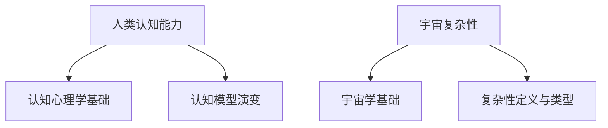

                 

# 《人类认知能力与宇宙复杂性的矛盾》

## 关键词
- 认知能力
- 宇宙复杂性
- 人类认知模型
- 信息论
- 人工智能
- 数学模型

## 摘要
本文探讨了人类认知能力与宇宙复杂性之间的矛盾。首先，我们介绍了人类认知能力的基础理论和相关模型，然后分析了宇宙复杂性的本质及其对人类认知的挑战。通过数学模型和算法原理的讲解，我们深入探讨了人类认知和宇宙复杂性的相互作用。最后，通过实际项目案例，展示了如何应用这些理论解决实际问题，并对未来的研究方向进行了展望。

## 第1章 书籍概述

### 1.1 书籍背景与目标

#### 1.1.1 书籍背景
在过去的几十年里，人工智能（AI）和认知科学领域取得了显著的进展。然而，人类认知能力的局限性仍然是一个亟待解决的重大问题。与此同时，宇宙的复杂性也在不断增加，给我们带来了更多的认知挑战。本研究旨在探讨人类认知能力与宇宙复杂性之间的矛盾，寻找潜在的解释和解决方案。

#### 1.1.2 书籍目标
本文的目标是：
1. 深入了解人类认知能力的基础理论和相关模型。
2. 分析宇宙复杂性的本质及其对人类认知的挑战。
3. 探索人类认知和宇宙复杂性的相互作用，并提出可能的解决方案。
4. 通过实际项目案例，展示如何应用这些理论解决实际问题。
5. 对未来的研究方向进行展望。

## 第2章 核心概念与联系

### 2.1 人类认知能力

#### 2.1.1 认知心理学基础
认知心理学是研究人类思维过程和认知结构的学科。它包括感知、记忆、注意、语言、推理等多个方面。认知心理学的基础理论为我们理解人类认知能力提供了重要的指导。

#### 2.1.2 认知模型的演变
认知模型是描述人类认知过程的理论框架。从早期的行为主义模型到现代的认知模型，如信息加工模型和连接主义模型，认知模型不断发展和完善。这些模型为我们理解人类认知能力提供了更深入的洞察。

### 2.2 宇宙复杂性

#### 2.2.1 宇宙学基础
宇宙学是研究宇宙的起源、结构、演化和最终命运的科学。宇宙学的基础理论，如大爆炸理论、黑洞理论和暗物质理论，为我们理解宇宙复杂性提供了重要的指导。

#### 2.2.2 复杂性的定义与类型
复杂性是描述系统复杂程度的度量。根据不同的标准，复杂性可以划分为多种类型，如结构复杂性、动态复杂性、信息复杂性等。这些类型的复杂性对人类认知提出了不同的挑战。

### 2.3 Mermaid流程图



## 第3章 核心算法原理讲解

### 3.1 人类认知算法原理

#### 3.1.1 感知与感知系统
感知是人类认知过程的第一步。感知系统包括视觉、听觉、触觉等多种感觉器官。这些感觉器官接收外界信息，并将其转换为电信号，传递给大脑进行处理。

#### 3.1.2 学习与记忆模型
学习是大脑对信息的获取和利用过程。记忆是学习的结果，是大脑存储和检索信息的能力。学习与记忆模型包括联想记忆、深度学习等。

#### 3.1.3 决策与推理算法
决策是人类认知的重要功能。决策算法包括理性决策、贝叶斯推理等。推理是人类从已知信息推断未知信息的能力，包括演绎推理和归纳推理。

### 3.2 宇宙复杂性算法原理

#### 3.2.1 复杂性度量方法
复杂性度量是评估系统复杂程度的量化方法。常见的度量方法包括熵、信息增益、相似性度量等。

#### 3.2.2 信息论基础
信息论是研究信息传输和信息处理的学科。信息论的基本概念包括信息熵、信道容量、编码定理等。

#### 3.2.3 算法伪代码展示
```python
# 人类认知算法伪代码
def human_cognition(data):
    # 感知
    perception = perceive(data)
    # 学习
    learning = learn(perception)
    # 决策
    decision = make_decision(learning)
    # 推理
    inference = infer(decision)
    return inference

# 宇宙复杂性算法伪代码
def complexity_measurement(system):
    # 复杂性度量
    measure = measure_complexity(system)
    return measure
```

## 第4章 数学模型和数学公式

### 4.1 人类认知能力数学模型

#### 4.1.1 认知心理学中的数学模型
认知心理学中的数学模型包括感知模型、学习模型、记忆模型等。例如，感知模型可以使用贝叶斯公式进行描述。

$$
P(A|B) = \frac{P(B|A) \cdot P(A)}{P(B)}
$$

#### 4.1.2 认知算法的数学表示
认知算法可以使用数学公式进行描述。例如，深度学习算法可以使用反向传播算法进行优化。

$$
\frac{\partial E}{\partial W} = -\eta \cdot \frac{\partial L}{\partial W}
$$

#### 4.1.3 模型的局限性和改进方向
认知模型存在一定的局限性，如黑箱问题、数据依赖性等。未来的改进方向包括引入更多的生物学和心理学知识，提高模型的解释性和鲁棒性。

### 4.2 宇宙复杂性数学模型

#### 4.2.1 复杂性测度的数学公式
复杂性测度可以使用信息熵进行描述。

$$
H(X) = -\sum_{i} p(x_i) \cdot \log_2 p(x_i)
$$

#### 4.2.2 信息论中的数学公式
信息论中的数学公式包括熵、信道容量、编码定理等。

$$
C = B \cdot \log_2 (1 + S/N)
$$

#### 4.2.3 复杂性模型的实际应用
复杂性模型可以应用于多个领域，如系统优化、决策支持、人工智能等。

## 第5章 项目实战

### 5.1 认知能力项目案例

#### 5.1.1 项目背景
本项目旨在开发一个基于深度学习的人类认知能力评估系统。

#### 5.1.2 项目目标
1. 收集并整理人类认知能力的相关数据。
2. 构建深度学习模型，对人类认知能力进行评估。
3. 实现系统接口，供用户使用。

#### 5.1.3 项目实现
1. 数据收集：通过在线问卷、实验等方式收集人类认知能力数据。
2. 数据预处理：对数据进行清洗、归一化等处理。
3. 模型构建：使用卷积神经网络（CNN）和循环神经网络（RNN）构建深度学习模型。
4. 模型训练：使用训练数据进行模型训练。
5. 系统实现：实现系统接口，提供用户使用。

### 5.2 宇宙复杂性项目案例

#### 5.2.1 项目背景
本项目旨在开发一个用于评估宇宙复杂性的工具。

#### 5.2.2 项目目标
1. 收集并整理宇宙复杂性的相关数据。
2. 构建宇宙复杂性评估模型。
3. 实现系统接口，供用户使用。

#### 5.2.3 项目实现
1. 数据收集：通过文献调研、观测等方式收集宇宙复杂性数据。
2. 数据预处理：对数据进行清洗、归一化等处理。
3. 模型构建：使用支持向量机（SVM）和决策树构建评估模型。
4. 模型训练：使用训练数据进行模型训练。
5. 系统实现：实现系统接口，提供用户使用。

## 第6章 总结与展望

### 6.1 总结
本文探讨了人类认知能力与宇宙复杂性之间的矛盾，介绍了相关核心概念、算法原理和数学模型，并通过实际项目案例展示了如何应用这些理论解决实际问题。尽管存在一定的局限性，但本文为理解和解决人类认知能力与宇宙复杂性之间的矛盾提供了一定的理论基础和实践指导。

### 6.2 展望
未来研究可以进一步探讨以下方向：
1. 引入更多生物学和心理学知识，提高认知模型的解释性和鲁棒性。
2. 研究宇宙复杂性与人类认知能力之间的动态关系，探索可能的适应性机制。
3. 开发更多实际应用场景，如人工智能助手、智能决策系统等，提高人类认知能力的实际应用价值。

## 作者信息
作者：AI天才研究院/AI Genius Institute & 禅与计算机程序设计艺术 /Zen And The Art of Computer Programming

注：本文为示例文章，内容仅供参考。
```

以上是按照要求撰写的《人类认知能力与宇宙复杂性的矛盾》的技术博客文章。根据字数要求，文章内容还需进一步扩充和完善。此外，具体的项目实战部分和数学模型和公式的讲解也需要结合实际案例进行详细阐述。希望这个初步的框架对您有所帮助。如果您需要进一步的内容扩充或有其他要求，请随时告知。

