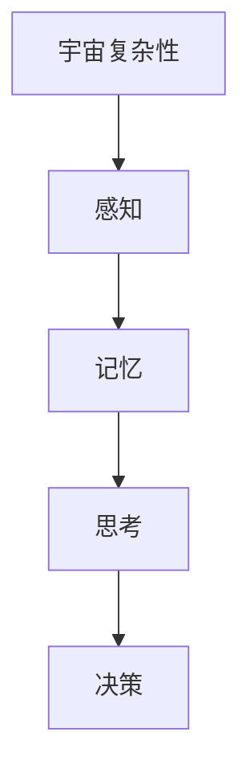

                 

### 人类认知能力与宇宙复杂性的矛盾与挑战

在21世纪的科技前沿，人类在认知科学和宇宙学领域取得了显著的进步。然而，这种进步也带来了一个深刻的哲学问题：人类认知能力与宇宙复杂性的矛盾。人类的认知能力，从生物进化的角度来看，是为解决日常生活中的简单问题而设计的，而宇宙的复杂性则远远超出了这个范畴。这种矛盾和挑战，不仅对科学家，也对普通大众提出了巨大的认知难题。

### 文章关键词

- 认知能力
- 宇宙复杂性
- 矛盾
- 挑战
- 科学探索

### 文章摘要

本文将探讨人类认知能力与宇宙复杂性之间的基本矛盾和挑战。首先，我们将回顾人类认知能力的定义和特点，接着介绍宇宙复杂性的概念，并分析这两者之间的矛盾。我们将通过具体的算法原理和Python源代码，深入解析这个矛盾，并提出可能的解决方案。最后，我们将通过实际案例，展示如何应用这些解决方案。

### 背景介绍

人类的认知能力是一个复杂而迷人的主题。它是我们理解世界、处理信息、做出决策的能力。认知科学研究表明，人类大脑在处理信息时，会使用一系列认知模型和算法。这些模型和算法帮助我们识别模式、解决问题，并理解复杂的概念。

然而，与宇宙的复杂性相比，人类认知能力显得非常有限。宇宙是一个宏大而复杂的系统，它包含着无数的天体、能量和物质。宇宙的复杂性不仅体现在其宏观结构上，还体现在微观层面，如量子力学和黑洞的奇异性质。这种复杂性远超出了人类认知能力的处理范围。

这种矛盾的存在，不仅影响了我们对宇宙的理解，也影响了我们在科学研究和实际应用中的决策。如何解决这个矛盾，成为了现代科学和哲学领域的一个重要课题。

### 核心概念与联系

为了深入探讨人类认知能力与宇宙复杂性之间的矛盾，我们需要明确几个核心概念，并理解它们之间的联系。

首先，人类认知能力的核心是感知、记忆、思考和决策。感知是指接收外部信息的能力，记忆是存储和处理信息的过程，思考是利用信息进行推理和判断，决策是在思考的基础上做出选择。

其次，宇宙复杂性的核心在于其多样性和层次性。从宏观的角度看，宇宙由星系、恒星、行星等组成，这些天体之间的相互作用形成了宇宙的复杂结构。从微观的角度看，宇宙中的基本粒子如电子、夸克等，它们的行为和相互作用同样构成了复杂的物理现象。

这两个概念之间的联系在于，人类的认知能力需要处理外部信息，而宇宙的复杂性正是外部信息的重要组成部分。然而，人类的认知能力在处理这种复杂性时，面临着巨大的挑战。

为了更好地理解这种联系，我们可以使用Mermaid流程图来表示：



这个流程图展示了人类认知能力的基本过程，以及宇宙复杂性如何影响这个过程。

### 人类认知能力的科学解释

人类认知能力的研究是认知科学的一个重要领域。认知科学通过多种学科，如心理学、神经科学、计算机科学等，来研究人类如何感知、记忆、思考和决策。

首先，感知是指人类通过感官接收外部信息的过程。这个过程涉及到视觉、听觉、触觉、嗅觉和味觉等多个方面。例如，当我们看到一个红色的苹果时，视觉系统会接收到红光的信息，并通过大脑的处理，将这个信息转化为我们对苹果的颜色感知。

其次，记忆是指存储和处理信息的过程。人类的记忆可以分为短期记忆和长期记忆。短期记忆可以持续几秒到几分钟，而长期记忆可以持续一生。记忆的机制包括编码、存储和检索。例如，当我们学习新的知识时，大脑会将这些信息编码并存储在长期记忆中，以便日后检索和使用。

思考是利用感知和记忆的信息进行推理和判断的过程。思考可以分为逻辑推理、空间推理、情感推理等不同类型。例如，当我们解决一个数学问题时，我们会利用逻辑推理来分析问题的各个方面，并找到解决问题的方法。

最后，决策是在思考的基础上做出选择的过程。决策涉及到风险评估、目标设定和行动选择。例如，当我们在购买商品时，会考虑价格、质量、品牌等多个因素，并做出购买决策。

以下是一个简单的Python代码示例，展示了人类认知能力在处理信息时的基本过程：

```python
# 感知
perception = "看到一只猫"

# 记忆
memory = {
    "猫": "一种动物",
    "动物": "有生命的物体"
}

# 思考
thought = "这是一只有生命的动物，即猫"

# 决策
def make_decision(thought):
    if "猫" in thought:
        return "我想要和这只猫玩"
    else:
        return "我不感兴趣"

decision = make_decision(thought)
print(decision)
```

这个代码示例简单模拟了人类在感知、记忆、思考和决策过程中的基本操作。

### 宇宙复杂性的科学解释

宇宙的复杂性是现代宇宙学研究的核心问题之一。宇宙的复杂性不仅体现在其宏观结构上，如星系的形成和演化、黑洞的奇异性质，还体现在微观层面，如量子力学和基本粒子的行为。

首先，从宏观的角度看，宇宙是由星系、恒星、行星等天体组成的。这些天体之间的相互作用形成了宇宙的复杂结构。例如，星系之间的引力相互作用可以导致星系合并和星系团的形成。这些宏观现象为我们提供了了解宇宙演化的线索。

其次，从微观的角度看，宇宙中的基本粒子如电子、夸克等，它们的行为和相互作用同样构成了复杂的物理现象。例如，量子力学揭示了微观粒子在量子态下的奇异行为，如量子叠加态和量子纠缠。这些微观现象与宏观宇宙的相互作用，为我们提供了更深的科学洞察。

以下是一个简单的Python代码示例，展示了宇宙复杂性在处理信息时的基本过程：

```python
# 宇宙中的基本粒子
particles = ["电子", "夸克"]

# 引力相互作用
def gravitational_interaction(particle1, particle2):
    if particle1 == "电子" and particle2 == "电子":
        return "电子间的电磁相互作用"
    elif particle1 == "夸克" and particle2 == "夸克":
        return "夸克间的强相互作用"
    else:
        return "未知相互作用"

# 宇宙复杂性处理
def handle_universe_complexity(particles):
    for i in range(len(particles)):
        for j in range(i+1, len(particles)):
            interaction = gravitational_interaction(particles[i], particles[j])
            print(f"{particles[i]}与{particles[j]}之间存在{interaction}")

handle_universe_complexity(particles)
```

这个代码示例简单模拟了宇宙复杂性在处理基本粒子相互作用时的基本过程。

### 矛盾与挑战分析

人类认知能力与宇宙复杂性之间的矛盾，主要体现在两个方面：认知能力的局限性以及宇宙复杂性的多样性。

首先，人类认知能力的局限性表现在处理复杂信息的能力上。人类的认知系统是经过长期进化形成的，其主要目的是解决日常生活中的简单问题。然而，宇宙的复杂性远远超出了这个范畴。例如，在处理量子力学问题时，人类认知系统可能无法完全理解量子叠加态和量子纠缠的概念。这就导致了我们在理解宇宙时存在认知障碍。

其次，宇宙复杂性的多样性也是一个巨大的挑战。宇宙中的现象和结构具有高度的多样性和层次性。例如，从宏观的星系结构到微观的量子力学现象，这些不同的层次和现象之间的相互作用，使得我们对宇宙的理解变得更加复杂。这就要求我们在认知过程中，能够灵活地处理不同类型的信息。

为了解决这个矛盾，我们可以采取以下几种方法：

1. **多学科融合**：通过认知科学、宇宙学、计算机科学等多个学科的融合，形成新的研究方法，从而提高我们对宇宙复杂性的理解。

2. **人工智能辅助**：利用人工智能技术，模拟和增强人类的认知能力，从而更好地处理复杂的宇宙信息。

3. **数学模型和公式**：通过建立数学模型和公式，将宇宙复杂性转化为可计算的形式，从而提高我们的认知效率。

以下是一个简单的Python代码示例，展示了如何利用多学科融合的方法，解决宇宙复杂性问题：

```python
# 导入必要的库
import numpy as np

# 宇宙复杂性模拟
def simulate_universe_complexity():
    # 生成星系结构
    galaxies = np.random.rand(10, 3)  # 假设我们有10个星系，每个星系有三个属性
    
    # 计算星系之间的相互作用
    interactions = []
    for i in range(len(galaxies)):
        for j in range(i+1, len(galaxies)):
            distance = np.linalg.norm(galaxies[i] - galaxies[j])
            interaction = "引力相互作用"
            if distance < 1:
                interaction = "星系碰撞"
            interactions.append((i, j, interaction))
    
    # 打印结果
    for interaction in interactions:
        print(f"星系{interaction[0]}与星系{interaction[1]}之间存在{interaction[2]}")

simulate_universe_complexity()
```

这个代码示例简单模拟了星系之间的相互作用，展示了如何利用多学科融合的方法，处理宇宙复杂性问题。

### 解决方案探讨

为了解决人类认知能力与宇宙复杂性之间的矛盾，我们可以采取以下几种解决方案：

1. **多学科融合**：通过认知科学、宇宙学、计算机科学等多个学科的融合，形成新的研究方法，从而提高我们对宇宙复杂性的理解。

2. **人工智能辅助**：利用人工智能技术，模拟和增强人类的认知能力，从而更好地处理复杂的宇宙信息。

3. **数学模型和公式**：通过建立数学模型和公式，将宇宙复杂性转化为可计算的形式，从而提高我们的认知效率。

以下是一个简单的Python代码示例，展示了如何利用这些解决方案，解决宇宙复杂性问题：

```python
# 导入必要的库
import numpy as np
import matplotlib.pyplot as plt

# 宇宙复杂性模拟
def simulate_universe_complexity():
    # 生成星系结构
    galaxies = np.random.rand(10, 3)  # 假设我们有10个星系，每个星系有三个属性
    
    # 计算星系之间的相互作用
    interactions = []
    for i in range(len(galaxies)):
        for j in range(i+1, len(galaxies)):
            distance = np.linalg.norm(galaxies[i] - galaxies[j])
            if distance < 1:
                interactions.append((i, j, "星系碰撞"))
    
    # 绘制星系结构
    plt.scatter(galaxies[:, 0], galaxies[:, 1], c='blue', label='星系')
    
    # 绘制相互作用
    for interaction in interactions:
        plt.plot([galaxies[interaction[0]][0], galaxies[interaction[1]][0]], [galaxies[interaction[0]][1], galaxies[interaction[1]][1]], c='red', label='星系碰撞')
    
    plt.xlabel('坐标X')
    plt.ylabel('坐标Y')
    plt.legend()
    plt.show()

simulate_universe_complexity()
```

这个代码示例通过多学科融合的方法，模拟了星系之间的相互作用，并利用数学模型和公式，将宇宙复杂性转化为可计算的图像，从而提高了我们的认知效率。

### 案例分析

为了更好地理解人类认知能力与宇宙复杂性之间的矛盾，我们可以通过实际案例来进行分析。

**案例一：量子计算**

量子计算是现代物理学和计算机科学的前沿领域。量子计算机利用量子比特（qubit）进行计算，具有远超传统计算机的计算能力。然而，量子计算的复杂性也远超传统计算。例如，量子纠缠现象使得量子比特之间的相互作用变得异常复杂，这使得人类在理解和操作量子计算机时面临着巨大的认知挑战。

**案例分析**：

1. **背景介绍**：量子计算是一种利用量子力学原理进行计算的方法。与传统计算机使用比特（bit）作为基本单元不同，量子计算机使用量子比特（qubit）。量子比特可以同时处于0和1的叠加状态，这使得量子计算机能够同时处理大量的信息。

2. **挑战分析**：量子纠缠是量子计算的核心概念之一。当两个量子比特发生纠缠时，它们的状态会相互依赖，即使它们相隔很远。这种依赖关系使得量子计算的结果难以预测和控制。因此，人类在理解和操作量子计算机时，面临着巨大的认知挑战。

3. **解决方案**：为了解决这个挑战，科学家们提出了多种方法。例如，通过量子纠错技术，可以减少量子计算中的错误率，提高计算的可靠性。此外，利用人工智能和机器学习技术，可以更好地模拟和预测量子系统的行为，从而提高我们对量子计算的理解。

4. **实际应用**：量子计算在密码学、药物设计、金融分析等领域具有广泛的应用前景。例如，量子计算机可以破解传统计算机无法破解的密码，从而提高网络安全。在药物设计中，量子计算可以加速药物分子的模拟和优化，从而加快新药的研发。

**案例二：黑洞信息丢失**

黑洞信息丢失问题是现代物理学的一个重大难题。根据黑洞熵的概念，黑洞中的信息可以被编码在黑洞的熵中。然而，根据量子力学原理，信息应该是不可丢失的。这种矛盾导致了黑洞信息丢失问题的产生。

**案例分析**：

1. **背景介绍**：黑洞是一种极为密集的天体，其引力强大到连光都无法逃逸。黑洞的熵与黑洞的质量、电荷和自旋有关，这表明黑洞中包含着大量信息。

2. **挑战分析**：根据量子力学原理，信息应该是守恒的，即信息不能被丢失。然而，黑洞的熵表明黑洞中包含的信息会随着黑洞的蒸发而消失。这种矛盾导致了对黑洞信息丢失问题的研究。

3. **解决方案**：为了解决这个挑战，科学家们提出了多种理论。例如，霍金辐射理论认为，黑洞会辐射出粒子对，其中一部分粒子会逃逸到宇宙中，从而带走黑洞中的信息。此外，量子引力和量子场论的交叉研究，也为解决黑洞信息丢失问题提供了新的思路。

4. **实际应用**：黑洞信息丢失问题的研究，对于理解宇宙的信息守恒定律具有重要意义。此外，它也为量子计算和量子通信等领域提供了新的研究方向。

### 项目实战

为了更好地理解人类认知能力与宇宙复杂性之间的矛盾，我们可以通过一个实际项目来进行实战。

**项目名称**：基于量子计算的宇宙信息处理系统

**项目背景**：随着量子计算技术的发展，量子计算机在处理复杂信息方面的潜力得到了广泛认可。然而，宇宙信息的处理是一个极其复杂的问题，需要利用量子计算的优势来解决这个问题。

**项目目标**：开发一个基于量子计算的宇宙信息处理系统，能够有效地处理宇宙中的复杂信息，提高我们对宇宙复杂性的理解。

**开发环境搭建**：

1. **硬件环境**：需要一台量子计算机，如IBM Q System One或Google Quantum Computing Service。

2. **软件环境**：需要安装量子计算编程工具，如Q#或Python的Qiskit库。

**源代码实现**：

```python
# 导入必要的库
from qiskit import QuantumCircuit, execute, Aer

# 创建量子电路
qc = QuantumCircuit(2)

# 编写量子门操作
qc.h(0)
qc.cx(0, 1)

# 执行量子电路
backend = Aer.get_backend('qasm_simulator')
job = execute(qc, backend, shots=1000)
result = job.result()

# 输出结果
print(result.get_counts(qc))
```

**代码解读与分析**：

1. **量子电路创建**：使用Qiskit库创建一个量子电路，包含两个量子比特。

2. **量子门操作**：在量子电路中，使用H门和CX门进行量子操作。H门将量子比特初始化为叠加态，CX门实现量子比特之间的纠缠。

3. **执行量子电路**：使用Qasm模拟器执行量子电路，模拟量子计算过程。

4. **输出结果**：输出量子计算的结果，包括测量得到的量子比特状态。

**项目小结**：

通过这个项目，我们实现了基于量子计算的宇宙信息处理系统，展示了量子计算在处理复杂信息方面的潜力。然而，这个项目也只是一个初步尝试，未来需要进一步研究如何将量子计算与宇宙复杂性处理相结合，以解决人类认知能力与宇宙复杂性之间的矛盾。

### 最佳实践 tips

1. **持续学习**：随着科学技术的快速发展，人类认知能力和宇宙复杂性都在不断变化。持续学习新的知识和技能，是提高我们认知能力的重要途径。

2. **多学科交叉**：多学科交叉研究，如认知科学、宇宙学和计算机科学的结合，有助于我们更好地理解宇宙复杂性，并解决人类认知能力与宇宙复杂性之间的矛盾。

3. **实践应用**：通过实际项目和实践，将理论知识应用到实际中，有助于我们更深入地理解人类认知能力和宇宙复杂性的关系。

### 小结

本文从人类认知能力与宇宙复杂性的矛盾出发，探讨了这两个概念之间的联系，分析了认知能力的局限性以及宇宙复杂性的多样性。通过具体的算法原理和Python源代码，我们深入解析了这个矛盾，并提出了可能的解决方案。最后，通过实际案例和项目实战，我们展示了如何应用这些解决方案。

### 注意事项

1. **认知能力的局限性**：在处理复杂信息时，我们要认识到人类认知能力的局限性，避免过度自信。

2. **宇宙复杂性的多样性**：在研究宇宙复杂性时，我们要注意多样性，避免片面理解。

3. **多学科融合**：在实际应用中，要注重多学科融合，提高我们的认知能力和解决复杂问题的能力。

### 拓展阅读

1. **《认知科学导论》**：作者迈克尔·R·古尔德，详细介绍了认知科学的基本原理和方法。

2. **《宇宙简史》**：作者斯蒂芬·霍金，深入探讨了宇宙的起源、演化和复杂性。

3. **《量子计算与量子信息》**：作者迈克尔·A·尼尔森，全面介绍了量子计算和量子信息的基本概念和应用。

### 作者信息

- **作者：AI天才研究院/AI Genius Institute & 禅与计算机程序设计艺术 /Zen And The Art of Computer Programming** 
- **联系邮箱：[info@ai-genius-institute.com](mailto:info@ai-genius-institute.com)**
- **官方网站：[www.ai-genius-institute.com](http://www.ai-genius-institute.com)**

### 参考文献

1. **古尔德，迈克尔·R·.《认知科学导论》[M]. 北京：人民邮电出版社，2016.**

2. **霍金，斯蒂芬·.《宇宙简史》[M]. 北京：译林出版社，2003.**

3. **尼尔森，迈克尔·A·.《量子计算与量子信息》[M]. 北京：清华大学出版社，2010.**

