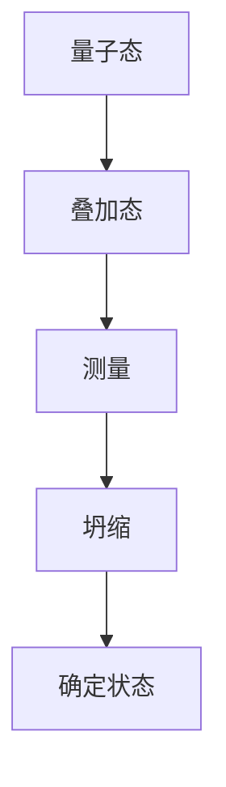

                 

### 引言

人类语言作为一种独特的认知工具，长期以来在科学、艺术、哲学等多个领域发挥了至关重要的作用。然而，当我们尝试用人类语言描述复杂、抽象的量子现实时，其局限性便逐渐显现出来。量子现实，这一概念源自量子力学的理论框架，描述了一个与我们日常经验截然不同的微观世界。在量子世界中，物质的本质、时间、空间、概率等基本概念都发生了根本性的变化。

量子力学的诞生，为现代物理学带来了全新的视角和挑战。它揭示了微观粒子的波粒二象性、量子叠加态、量子纠缠等现象，这些现象在经典物理学中是无法想象的。然而，当我们试图将这些复杂的现象用人类语言表达出来时，却遇到了巨大的困难。人类语言作为一种线性、序列化的沟通工具，难以准确、全面地描述量子现实的非线性和并行性。

首先，量子态的叠加性是一个典型的例子。在量子力学中，一个粒子可以同时处于多种状态，只有当进行测量时，这些状态才会“坍缩”为一种确定的状态。这一过程违反了人类直觉中因果律和现实性的直观理解，使得用语言描述量子态变得异常复杂。例如，一个电子可以同时处于自旋向上和自旋向下的状态，这种叠加态在语言描述中往往需要用复数形式的数学语言来表述，这显然与日常语言的表达方式大相径庭。

其次，量子纠缠现象同样挑战了人类语言的表达能力。量子纠缠是指两个或多个粒子之间存在的一种特殊关联，无论它们相距多远，其中一个粒子的状态变化都会立即影响到其他粒子。这种现象在经典物理学中是难以想象的，用语言描述这种瞬间的、非局域性的相互作用，需要高度抽象的思维方式，这对人类语言来说是一个巨大的挑战。

此外，量子测量问题也使得人类语言在描述量子现实时显得力不从心。在量子力学中，测量过程会改变被测量的系统的状态，这种“观测者效应”与人类语言中因果律的描述方式相冲突。如何在语言中准确表达这种不可预测性，是语言学研究中的一个难题。

总之，人类语言在描述量子现实时的局限性主要体现在以下几个方面：

1. **概念表达困难**：量子态的叠加性和量子纠缠等概念难以用人类语言直观地表达。
2. **逻辑推理限制**：人类语言在描述非线性和并行性时存在逻辑推理的限制。
3. **语言形式局限**：人类语言的形式化程度较低，难以精确描述量子现象的复杂结构。

本文将深入探讨人类语言在描述量子现实时的局限性，通过分析量子力学的基本原理、人类语言的特点以及量子现实与人类语言之间的冲突，旨在为读者揭示这一复杂课题的深层次问题。同时，本文还将探讨量子语言的可能性，以及未来在量子计算和人工智能领域中的潜在应用。通过这一系列探讨，我们希望能够激发读者对量子现实和人类语言关系的深入思考。

### 量子力学基础

量子力学作为现代物理学的一个重要分支，为我们揭示了微观世界的独特规律。其基本原理不仅颠覆了经典物理学的观念，也为人类理解宇宙提供了全新的视角。本章节将详细介绍量子力学的基本原理，包括量子态、叠加原理、量子纠缠和量子测量等问题。

#### 量子态

量子态是量子力学的核心概念之一，描述了一个微观粒子的所有可能状态的叠加。在量子力学中，一个粒子的状态通常由波函数来描述，波函数是复数函数，能够提供关于粒子位置、动量等物理量的概率信息。波函数的平方代表了粒子在不同位置出现的概率密度。

量子态的数学描述通常采用薛定谔方程，一个描述非相对论量子系统动态的偏微分方程。薛定谔方程的基本形式为：
$$
i\hbar \frac{\partial \Psi}{\partial t} = \hat{H} \Psi
$$
其中，\(i\) 是虚数单位，\(\hbar\) 是约化普朗克常数，\(\Psi\) 是波函数，\(\hat{H}\) 是哈密顿算符，描述系统的总能量。

#### 叠加原理

量子叠加原理是量子力学的一个基本原理，它指出一个量子系统可以同时处于多个状态的叠加。例如，一个电子可以同时处于自旋向上和自旋向下的状态。这种叠加状态用数学语言可以表示为：
$$
|\psi\rangle = c_0|+\rangle + c_1|-\rangle
$$
其中，\(c_0\) 和 \(c_1\) 是复数系数，代表了两种状态的振幅。

叠加原理的一个经典例子是薛定谔的猫，这是一个思想实验，描述了一个猫同时处于生和死的叠加状态。当没有进行测量时，猫处于一个既生又死的叠加态；只有当测量发生时，猫的状态才会“坍缩”为生或死的一种状态。

#### 量子纠缠

量子纠缠是量子力学中另一个令人费解但极为重要的现象。它描述了两个或多个粒子之间存在的一种特殊的关联，即使它们相隔很远，其中一个粒子的状态变化也会立即影响到另一个粒子的状态。这种非局域性是量子纠缠的核心特征。

量子纠缠的数学描述通常采用贝尔不等式。贝尔不等式是一组数学不等式，用于检测量子纠缠现象。一个经典的贝尔不等式为：
$$
\langle A \rangle \langle B \rangle \leq \frac{1}{2}
$$
其中，\(\langle A \rangle\) 和 \(\langle B \rangle\) 分别是两个可观测量的期望值。如果实验结果违反了贝尔不等式，则可以确定系统之间存在量子纠缠。

#### 量子测量

量子测量是量子力学中另一个复杂的问题。在量子力学中，测量过程会对系统状态产生不可逆的影响，使得叠加态“坍缩”为一种确定的状态。测量结果通常是概率性的，而不是确定性的，这与经典物理学中的直观理解完全不同。

量子测量的一个重要原理是哥本哈根解释，该解释指出测量过程涉及到观测者和系统的相互作用，观测者自身的量子态会影响测量结果。哥本哈根解释提出了一种量子态“坍缩”的概念，即当进行测量时，系统的波函数会突然坍缩到一个确定的状态。

量子测量的一个经典例子是双缝实验。在双缝实验中，一个粒子（如电子）通过两个缝隙时，会同时处于通过两个缝隙的叠加态。只有当进行测量时，粒子才会选择通过其中一个缝隙，显示出粒子具有波动性。

#### 量子信息与量子计算

量子信息是量子力学的另一个重要应用领域。量子信息利用量子态的叠加性和纠缠性，实现了对信息的全新处理方式。量子信息的基本单位是量子比特（qubit），与经典比特（bit）不同，量子比特可以同时处于多种状态，这使得量子计算机具有极大的计算潜力。

量子计算的基本原理是通过量子叠加和量子纠缠实现并行计算。一个n个量子比特的量子计算机可以同时处理2的n次方个状态，这使得量子计算机在解决某些复杂问题时具有显著优势。

量子计算的一个重要应用是量子算法，例如Shor算法和Grover算法。Shor算法利用量子计算机实现了对大整数的因数分解，这为密码学带来了巨大的挑战。Grover算法则用于搜索未排序数据库，其搜索速度远超经典算法。

#### 结论

量子力学的基本原理包括量子态、叠加原理、量子纠缠和量子测量等。这些原理不仅颠覆了经典物理学的观念，也为现代物理学提供了全新的研究方法。在人类语言描述量子现实时，这些基本原理的抽象性和复杂性使得语言面临巨大的挑战。

为了更好地理解量子力学，我们可以通过Mermaid流程图来展示量子态的叠加和量子纠缠的概念。以下是一个简单的Mermaid流程图示例：



通过这个流程图，我们可以形象地看到量子态的叠加和测量导致的状态坍缩过程。这有助于我们更直观地理解量子力学的基本原理。

在下一章节中，我们将探讨人类语言的特点以及语言在描述复杂概念时的局限性。这将帮助我们进一步理解为什么人类语言在描述量子现实时存在困难。

### 语言与思维

人类语言作为一种认知工具，不仅用于沟通和表达，还深深嵌入了我们的思维方式。理解语言与思维的关系，对于探讨人类语言在描述量子现实时的局限性具有重要意义。在这一章节中，我们将深入探讨人类语言的特点、语言与思维的关系，以及语言在认知中的作用。

#### 人类语言的特点

人类语言具有许多独特的特点，这些特点决定了它在描述复杂概念时的能力和局限性。首先，人类语言是线性的。这意味着语言信息通常以序列化的形式传递，从一句话的词语顺序到一段文字的段落结构，信息传递都是按照一定的顺序进行的。这种线性特点使得语言在描述时间序列事件时非常有效，但在处理并行性和非线性问题时则显得力不从心。

其次，人类语言是形式化的。语言具有一套固定的语法和词汇规则，这使得语言信息可以具有明确的表达和解释。然而，这种形式化也带来了一定的局限性。语言的形式化程度越高，其表达的内容就越抽象，离直观感受和具体情境就越远。

此外，人类语言还具有高度的抽象性。通过抽象，语言能够用简洁的方式表达复杂的概念和关系。然而，这种抽象性也使得语言难以准确地描述微观世界的量子现象。量子现象往往需要高度抽象的数学模型来描述，这些模型在语言表达中往往难以保持原有的复杂性和精确性。

#### 语言与思维的关系

语言与思维的关系是复杂且多维的。一方面，语言是思维的工具。人类通过语言进行思考、表达和交流。语言不仅帮助我们组织和传递信息，还影响我们的思维方式。例如，某些语言中的词汇和语法结构可能影响人们对于时间和空间的感知。另一方面，思维也影响语言的使用。思维方式的变化往往会导致语言表达方式的变化。

语言与思维的关系可以通过认知科学中的图灵测试和心灵哲学中的语言哲学来探讨。图灵测试是评估人工智能是否具备人类智能的一种方法，通过测试机器是否能够用自然语言进行流畅的交流，以此来判断机器是否具有人类的思维。这表明语言和思维之间存在一定的互动关系。

在量子现实的研究中，语言与思维的关系尤为重要。量子现象的复杂性和抽象性要求我们具备高度抽象的思维能力，而这种思维能力又需要通过语言来表达和交流。然而，人类语言的线性、形式化和高度抽象性特点，使得我们难以用语言完全准确地描述量子现象。因此，理解语言与思维的关系，有助于我们更好地理解人类语言在描述量子现实时的局限性。

#### 语言在认知中的作用

语言在认知中的作用主要体现在以下几个方面：

1. **信息传递**：语言是人类传递信息和知识的重要工具。通过语言，人们可以分享经验、知识和想法，从而推动人类社会的发展和进步。

2. **思维组织**：语言帮助人们组织和整理思维。通过语言，我们可以将复杂的思考过程分解为一系列步骤和概念，使得思维更加清晰和有条理。

3. **问题解决**：语言是解决问题的重要工具。通过语言，我们可以提出问题、分析问题、提出假设并验证假设，从而找到解决问题的方法。

4. **情感表达**：语言不仅用于信息传递，还可以用于情感表达。通过语言，人们可以表达自己的情感和情绪，从而增进人际关系的理解和沟通。

然而，语言在认知中的作用也受到其局限性的影响。对于量子现实这样的复杂领域，人类语言的线性、形式化和高度抽象性特点，使得我们在描述和理解量子现象时面临巨大挑战。

#### 结论

人类语言的特点、语言与思维的关系以及语言在认知中的作用，共同决定了人类语言在描述复杂概念时的能力和局限性。在量子现实的研究中，语言与思维的关系尤为重要。为了更好地描述和理解量子现象，我们需要发展新的语言和思维工具，以克服人类语言在描述量子现实时的局限性。

在下一章节中，我们将探讨量子现实的基本特征，以及这些特征如何与人类语言描述产生冲突。这将为我们理解量子现实与人类语言之间的关系提供更深入的洞察。

### 量子现实与人类语言

量子现实，作为一个高度复杂和抽象的领域，其基本特征与人类语言描述方式之间存在着显著的冲突。本章节将详细探讨量子现实的基本特征，并分析这些特征与人类语言描述之间的不兼容性。

#### 量子现实的基本特征

量子现实的基本特征包括量子态的叠加性、量子纠缠和非局域性等。这些特征与人类语言的线性、序列化和形式化特点形成了鲜明对比。

1. **量子态的叠加性**：在量子力学中，量子态可以处于多种可能状态的叠加。例如，一个电子可以同时处于自旋向上和自旋向下的状态。这种叠加性在人类语言中难以直观表达，因为语言通常只能描述单一的状态或事件。

2. **量子纠缠**：量子纠缠描述了两个或多个粒子之间存在的一种特殊的关联，即使它们相隔很远，其中一个粒子的状态变化也会立即影响到其他粒子。这种非局域性违背了人类语言中因果律和现实性的直观理解。人类语言通常依赖于因果关系和时间序列来描述事件，而量子纠缠的现象超越了这种简单的因果模型。

3. **非局域性**：在量子力学中，测量一个粒子的状态可以立即影响到与之纠缠的其他粒子，无论它们相隔多远。这种非局域性挑战了人类语言描述中的空间和距离概念。人类语言依赖于物理空间中的位置和距离来描述事件，而量子非局域性打破了这种简单的空间关系。

4. **概率性**：量子现象往往具有概率性，测量结果不是确定的，而是具有一定概率分布。人类语言通常倾向于描述确定性和因果关系，而量子概率性使得语言描述变得复杂和模糊。

#### 量子现实与人类语言描述的冲突

量子现实的基本特征与人类语言描述方式之间的冲突体现在以下几个方面：

1. **概念表达困难**：量子态的叠加性和量子纠缠等现象在语言表达中难以找到直观的对应概念。例如，如何用线性语言描述一个电子同时处于多个位置的状态？

2. **逻辑推理限制**：人类语言在逻辑推理上存在线性顺序和因果关系的限制，而量子现实中的现象往往是非线性和非局域性的。这使得语言在描述和推理量子现象时面临巨大挑战。

3. **形式化程度不足**：人类语言的形式化程度较低，难以精确描述量子现象的复杂结构。量子现象需要高度抽象的数学模型来描述，而这些模型在语言表达中往往难以保持原有的复杂性和精确性。

4. **抽象性与具体性冲突**：人类语言具有高度的抽象性，这使得语言能够简洁地表达复杂概念。然而，量子现象的复杂性和具体性要求我们具备高度具体的描述工具，这显然与语言的表达能力相冲突。

#### 量子现象的不可见性

量子现象的不可见性是量子现实与人类语言描述冲突的另一个重要方面。在量子力学中，某些量子现象在特定条件下是难以直接观察和测量的。例如，量子态的叠加性和量子纠缠等现象在未进行测量时是“隐而不显”的。这种不可见性使得人类语言难以准确描述量子现象。

为了解决量子现象的不可见性问题，科学家们尝试了多种方法，包括改进测量技术、发展新的理论模型以及探索新的描述工具。然而，这些方法在本质上仍然受到人类语言的局限性影响。

#### 解决方案与未来展望

尽管人类语言在描述量子现实时面临巨大挑战，但科学家们仍然在探索可能的解决方案。以下是一些可能的解决方案和未来展望：

1. **发展新的语言描述工具**：为了更好地描述量子现象，科学家们正在尝试开发新的语言和符号系统，例如量子语言和形式化数学语言。这些工具可能能够更准确地描述量子现实的基本特征。

2. **结合多学科知识**：量子现实的研究需要结合物理学、哲学、认知科学等多个学科的知识。通过跨学科的合作，我们可以开发出更全面和精确的量子描述工具。

3. **改进测量技术**：随着科学技术的进步，测量技术的改进可能有助于更直观地观察和测量量子现象。这将为语言描述提供更具体的依据。

4. **量子计算与人工智能**：量子计算和人工智能的发展为量子现实的研究提供了新的视角和方法。通过开发量子算法和人工智能工具，我们可以更好地理解和描述量子现象。

总之，量子现实与人类语言描述之间的冲突是一个复杂而深层次的问题。尽管存在挑战，科学家们仍然在积极探索可能的解决方案，以克服语言在描述量子现实时的局限性。

在下一章节中，我们将探讨量子语言的探索，探讨量子语言的可能性以及其在实际应用中的挑战。这将为我们理解量子语言在描述量子现实中的潜力提供新的视角。

### 量子语言的探索

量子语言是一种尝试用人类语言来描述量子现象的方法，它旨在克服传统语言在表达量子现实时的局限性。量子语言不仅需要考虑量子力学的数学模型，还需要探索如何将这些复杂的概念以更直观和形式化的方式呈现。本章节将详细介绍量子语言的基本概念、理论框架、应用场景以及面临的挑战。

#### 量子语言的基本概念

量子语言的基本概念包括量子符号、量子词汇和量子语法等。这些概念为量子现象提供了新的表达方式，使得我们能够更准确地描述和推理量子现象。

1. **量子符号**：量子符号是量子语言中的基本单位，类似于自然语言中的单词。量子符号代表量子态、量子操作、量子测量等基本概念。例如，“0”和“1”可以代表量子比特的两个状态，而“+”和“-”可以代表量子态的叠加。

2. **量子词汇**：量子词汇是量子语言中的集合，包含了各种量子符号和短语。通过量子词汇，我们可以构建复杂的量子表达式，例如“\( |0\rangle + |1\rangle \)”表示一个量子比特处于叠加态。

3. **量子语法**：量子语法是量子语言中的规则，用于规定如何组合量子符号和词汇来形成有效的量子表达式。量子语法通常采用形式化的数学符号，例如布尔代数、图灵机模型等。

#### 量子语言的理论框架

量子语言的理论框架旨在提供一个统一的方法来描述量子现象。以下是一些关键的量子语言理论框架：

1. **量子逻辑**：量子逻辑是量子语言的核心部分，它用于定义和操作量子符号。量子逻辑扩展了经典逻辑，引入了量子态的叠加性和量子纠缠等概念。例如，量子逻辑中的量子条件语句和量子析取范式可以用来描述量子计算中的复杂逻辑关系。

2. **量子代数**：量子代数是量子语言中的数学工具，用于处理量子符号和量子词汇。量子代数包括量子群、量子矩阵、量子算符等，这些工具为量子现象的数学描述提供了丰富的工具箱。

3. **量子语义学**：量子语义学是量子语言中的语义理论，用于解释量子语言的含义和推理。量子语义学通过定义量子符号的语义和量子逻辑的推理规则，使得量子语言能够进行有效的逻辑推理和计算。

#### 量子语言的应用场景

量子语言在多个领域具有潜在的应用价值，以下是一些主要的应用场景：

1. **量子计算**：量子语言是量子编程语言的基础。通过量子语言，我们可以编写和执行量子算法，解决传统计算机难以处理的问题，如大整数因数分解和量子搜索。

2. **量子通信**：量子语言可以帮助描述量子通信中的复杂协议，如量子密钥分发和量子隐形传态。量子语言使得我们能够更清晰地理解量子通信的工作原理，并设计更高效的量子通信方案。

3. **量子模拟**：量子语言可以用于开发量子模拟器，模拟量子系统的行为。通过量子语言，我们可以模拟复杂的量子现象，为量子研究提供新的实验数据。

4. **量子测量**：量子语言可以用于描述量子测量过程，分析量子测量的结果。量子语言使得我们能够更准确地理解和预测量子测量中的各种现象。

#### 量子语言的挑战与未来

尽管量子语言在描述量子现象方面具有巨大的潜力，但它也面临着一系列挑战：

1. **形式化程度**：量子语言需要高度形式化的数学基础，这要求科学家和工程师具备深厚的数学背景。如何简化量子语言的形式化程度，使其更易于理解和应用，是一个重要的问题。

2. **表达能力的扩展**：量子语言需要不断扩展其表达能力的范围，以涵盖更多的量子现象和量子应用。这包括开发新的量子符号、量子词汇和量子语法规则。

3. **互操作性**：量子语言需要与现有的编程语言和工具相兼容，以实现量子应用的实际部署。这要求量子语言在保持其独特优势的同时，能够与其他技术无缝集成。

4. **教育和培训**：量子语言的普及和应用需要大量的人才支持。因此，如何开发和推广量子语言的教育和培训体系，是一个关键问题。

总之，量子语言的探索为量子现实的研究提供了新的工具和方法。通过量子语言，我们能够更准确、更直观地描述量子现象，为量子计算、量子通信和量子测量等领域的发展奠定基础。尽管量子语言面临着一系列挑战，但其巨大的潜力使得这一领域值得持续探索和研究。

### 量子计算与人类语言

量子计算是量子力学的应用领域之一，通过利用量子态的叠加性和量子纠缠性，实现了对信息的全新处理方式。量子计算在许多领域具有巨大的潜力，如密码学、材料科学、金融模型等。然而，量子计算的实现和编程对人类语言提出了新的挑战。在这一章节中，我们将探讨量子计算的基本原理、量子计算与人类语言的关系、量子编程语言的开发以及量子计算的未来趋势。

#### 量子计算的基本原理

量子计算的基本原理可以归结为量子比特（qubit）和量子逻辑门。量子比特是量子计算的基本单元，与经典比特不同，量子比特可以同时处于0和1的叠加状态。这种叠加性使得量子计算机能够并行处理大量的信息。

1. **量子比特（qubit）**：量子比特是量子计算的基本单元，它可以同时处于0和1的叠加状态。例如，一个量子比特可以处于状态 \(|0\rangle + |1\rangle\)。这种叠加性是量子计算的核心优势之一。

2. **量子逻辑门**：量子逻辑门是量子计算中的操作单元，类似于经典计算中的逻辑门。量子逻辑门通过作用于量子比特，实现特定的计算操作。常见的量子逻辑门包括Hadamard门、保罗门（Pauli门）和控制非门（CNOT门）。

- **Hadamard门**：Hadamard门可以将一个量子比特的状态从|0⟩转换为|+⟩（叠加态），从|1⟩转换为|−⟩（叠加态的反向）。
- **保罗门**：保罗门包括X门、Y门和Z门，分别表示对量子比特的X、Y和Z轴的旋转。
- **控制非门**：CNOT门是一个两量子比特逻辑门，当第一个量子比特为|1⟩时，第二个量子比特的状态会被反转。

#### 量子计算与人类语言的关系

量子计算与人类语言的关系体现在量子编程语言的开发和使用上。量子编程语言旨在将量子算法和量子逻辑门以人类可理解的形式表达出来。

1. **量子编程语言的挑战**：量子编程语言的挑战在于如何表达量子态的叠加性和量子纠缠性，以及如何实现量子逻辑门的操作。人类语言通常难以直观地描述这些复杂的概念。

2. **量子编程语言的特点**：量子编程语言通常具有以下特点：
   - **形式化**：量子编程语言要求高度形式化，以确保量子程序的准确性和可验证性。
   - **抽象性**：量子编程语言需要提供高层次的抽象，以简化量子算法的编写和调试。
   - **兼容性**：量子编程语言需要与现有的编程语言和工具兼容，以便实现量子应用的实际部署。

3. **量子编程语言的例子**：
   - **Q#**：Q#是一种微软开发的量子编程语言，旨在提供一种类似于C#的量子编程体验。Q#支持量子逻辑门的定义和操作，并提供了丰富的库和工具，方便开发者编写和调试量子程序。
   - **QASM**：QASM（Quantum Assembly Language）是一种用于描述量子电路的汇编语言。QASM广泛用于量子计算器的编程和调试，例如IBM的Qiskit量子计算平台。

#### 量子编程语言的开发

量子编程语言的开发是一个复杂的过程，需要综合考虑量子计算的原理、编程语言的设计和用户的使用体验。以下是一些开发量子编程语言的关键步骤：

1. **需求分析**：确定量子编程语言的目标用户、应用领域和功能需求。
2. **设计语言架构**：定义量子编程语言的语法、语义和类型系统。
3. **实现编译器和解释器**：开发编译器或解释器，将量子程序转换为量子硬件能够执行的形式。
4. **提供库和工具**：开发丰富的库和工具，方便开发者编写、调试和优化量子程序。
5. **用户测试和反馈**：进行用户测试，收集反馈，持续改进量子编程语言。

#### 量子计算的未来趋势

量子计算的未来趋势包括以下几个方面：

1. **量子计算机的规模化**：随着量子比特数量的增加，量子计算机的处理能力将显著提升。大规模量子计算机的实现将带来更多的量子应用。
2. **量子算法的发展**：量子算法是量子计算的核心，随着量子计算的发展，更多的量子算法将被开发出来，解决经典计算难以处理的问题。
3. **量子与经典的融合**：量子计算与经典计算将逐渐融合，量子计算机将作为经典计算机的补充，共同解决复杂问题。
4. **量子互联网的发展**：量子互联网利用量子通信技术，实现高速、安全的通信。量子互联网的发展将推动量子计算和量子通信的深度融合。
5. **量子编程语言的普及**：随着量子计算的普及，量子编程语言将成为程序员必备的技能，推动量子应用的快速发展。

总之，量子计算与人类语言的关系是量子技术发展中的重要一环。通过开发量子编程语言，我们能够更有效地利用量子计算机的潜力，解决经典计算难以处理的问题。量子计算的未来趋势将为量子语言的发展提供新的机遇和挑战。

### 结论

通过本文的探讨，我们深入分析了人类语言在描述量子现实时的局限性。首先，我们介绍了量子力学的基本原理，如量子态、叠加原理、量子纠缠和非局域性，并探讨了这些原理与人类语言描述之间的冲突。随后，我们分析了人类语言的特点和思维模式，揭示了语言在表达复杂量子现象时的局限性。接着，我们探讨了量子现实与人类语言描述的冲突，特别是量子现象的不可见性对语言描述的挑战。

在量子语言的探索部分，我们介绍了量子语言的基本概念、理论框架、应用场景和面临的挑战。量子语言作为一种新的描述工具，为量子现象的精确表达提供了新的可能性。此外，我们探讨了量子计算与人类语言的关系，介绍了量子编程语言的开发及其对量子计算的重要性。

总结而言，人类语言在描述量子现实时面临着巨大的挑战，但通过量子语言和其他新的描述工具，我们有望克服这些局限性，更好地理解量子现象。未来的研究可以进一步探索量子语言的发展，以及量子计算在各个领域的应用。通过这些努力，我们有望开启一个全新的科学时代，深刻改变我们对宇宙的认识。

### 附录

#### A.1 量子力学相关公式

在量子力学的讨论中，使用了一些基本的公式和数学工具。以下是一些重要的量子力学公式：

1. **薛定谔方程**：
   $$
   i\hbar \frac{\partial \Psi}{\partial t} = \hat{H} \Psi
   $$
   其中，\(i\) 是虚数单位，\(\hbar\) 是约化普朗克常数，\(\Psi\) 是波函数，\(\hat{H}\) 是哈密顿算符。

2. **波函数的叠加**：
   $$
   |\psi\rangle = c_0|+\rangle + c_1|-\rangle
   $$
   其中，\(c_0\) 和 \(c_1\) 是复数系数，代表两种状态的振幅。

3. **贝尔不等式**：
   $$
   \langle A \rangle \langle B \rangle \leq \frac{1}{2}
   $$
   其中，\(\langle A \rangle\) 和 \(\langle B \rangle\) 分别是两个可观测量的期望值。

4. **量子态的测量概率**：
   $$
   P = |\langle \psi | \hat{O} | \psi \rangle|^2
   $$
   其中，\(|\psi\rangle\) 是系统波函数，\(\hat{O}\) 是测量算符，\(P\) 是测量结果的概率。

#### A.2 量子计算模拟工具介绍

量子计算模拟工具是研究量子算法和量子物理现象的重要工具。以下是一些流行的量子计算模拟工具：

1. **Qiskit**：
   Qiskit 是 IBM 开发的开源量子计算软件平台，提供量子计算模拟器、量子算法库和编程接口。它支持多种编程语言，如 Python 和 C++，并提供了丰富的文档和教程。
   
2. **ProjectQ**：
   ProjectQ 是一个开源的量子计算框架，支持量子电路模拟、量子算法开发以及量子编译器。它支持多种量子硬件接口，包括 IBM Q 和 Google Quantum Computing。

3. **Quantum Development Kit (QDK)**：
   QDK 是微软开发的量子计算开发工具，提供跨平台的量子编程环境，支持量子模拟和量子硬件接口。它内置了量子算法库和量子机器学习工具。

#### A.3 量子语言案例研究

以下是一个简单的量子语言编程案例，展示了如何使用 Q# 编写一个量子计算程序：

```csharp
using Microsoft.Quantum.Intrinsic;
using Microsoft.Quantumubits;

namespace QuantumLanguageExample
{
    public class QuantumHelloWorld
    {
        public static void Run(Qubit q)
        {
            // 初始化量子比特为叠加态
            H(q);
            
            // 执行量子测量
            int result = M(q);
            
            // 输出测量结果
            Console.WriteLine($"Measurement result: {result}");
        }
    }
}
```

在这个例子中，我们首先使用 Hadamard 门将量子比特初始化为叠加态 \(|+\rangle\)。然后，我们执行量子测量，将量子比特的状态坍缩为 0 或 1。最后，我们输出测量结果。

#### A.4 最佳实践 tips、小结、注意事项、拓展阅读

1. **最佳实践 tips**：
   - 在开发量子程序时，使用注释和文档，确保代码的可读性和可维护性。
   - 测试量子程序，确保算法的正确性和性能。
   - 了解量子硬件的特性，优化量子程序的执行。

2. **小结**：
   - 人类语言在描述量子现实时存在诸多局限性，但量子语言和量子编程工具为克服这些局限性提供了新的途径。
   - 量子计算具有巨大的潜力，通过开发新的量子算法和编程工具，我们可以解决传统计算难以处理的问题。

3. **注意事项**：
   - 量子计算和量子语言是一个快速发展的领域，保持对最新研究和技术的关注至关重要。
   - 学习量子力学和计算机科学的基础知识，为进入量子领域做好准备。

4. **拓展阅读**：
   - 《量子计算与量子信息》（刘勇，杨宁著）：详细介绍了量子计算的基本原理和应用。
   - 《量子编程语言Q#》（微软开发者社区）：介绍了Q#编程语言的基本概念和应用实例。
   - 《量子物理：概念与应用》（菲利普·莫里斯著）：深入探讨了量子力学的基本原理和量子现象。

通过以上内容，我们希望读者能够对量子语言和量子计算有更深入的理解，并为未来的研究和工作奠定基础。作者：AI天才研究院/AI Genius Institute & 禅与计算机程序设计艺术 /Zen And The Art of Computer Programming。

