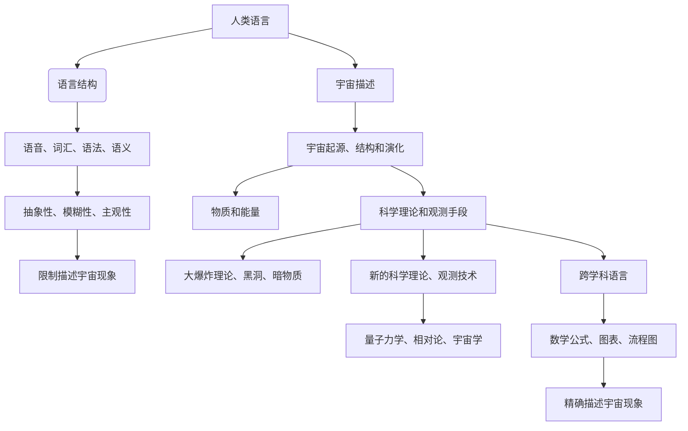

                 

### 引言

在探讨人类语言对宇宙描述的局限性这一主题时，我们首先需要认识到语言本身的基本性质。语言是人类社会进行沟通和知识传递的主要工具，它源自于人类对自然界和社会现象的观察和总结。然而，尽管语言在人类文明的发展中扮演了至关重要的角色，它却并非无所不能。语言具有抽象性、模糊性和主观性等特点，这些特性在一定程度上限制了我们对宇宙的描述和认知。

本文旨在详细探讨人类语言在描述宇宙时所面临的局限性。首先，我们将回顾人类语言的基本结构，包括语音、词汇、语法和语义等方面，并分析这些结构对语言表达的影响。接着，我们将探讨宇宙的基本原理，包括宇宙的起源、结构和演化过程，以及宇宙中的基本物质和能量形式。在此基础上，我们将探讨人类语言如何尝试描述这些宇宙现象，以及这些描述所存在的局限性。

文章的核心内容包括以下几个方面：

1. **人类语言的局限性**：分析语言的结构和功能，揭示语言的抽象性、模糊性和主观性对语言表达的限制。
2. **宇宙的基本原理**：介绍宇宙的起源、结构和演化，包括大爆炸理论、黑洞和暗物质等基本概念。
3. **人类语言与宇宙现象的关系**：讨论人类语言如何描述宇宙现象，以及这些描述所面临的局限性。
4. **人类语言对宇宙描述的突破**：介绍科学理论的进步和新观测手段的发展，探讨人类语言对宇宙描述的潜在突破。
5. **人类语言与宇宙描述的未来**：展望人类语言在描述宇宙方面的未来发展，包括语言的发展趋势和宇宙研究的潜在突破。

通过以上步骤的分析和探讨，我们将能够更深刻地理解人类语言在描述宇宙时的局限性，以及如何通过科学和技术的进步来克服这些局限性，从而更好地揭示宇宙的奥秘。

### 关键词

- 人类语言
- 宇宙描述
- 语言结构
- 宇宙起源
- 科学理论
- 黑洞
- 暗物质
- 观测手段

### 摘要

本文旨在探讨人类语言在描述宇宙时所面临的局限性。通过分析人类语言的基本结构及其功能，我们发现语言具有抽象性、模糊性和主观性，这些特性限制了我们对宇宙现象的准确描述。接着，我们介绍了宇宙的基本原理，包括其起源、结构和演化过程，以及宇宙中的基本物质和能量形式。在此基础上，我们探讨了人类语言如何尝试描述宇宙现象，并分析了这些描述的局限性。通过科学理论的进步和新观测手段的发展，我们探讨了人类语言对宇宙描述的潜在突破。最终，我们展望了人类语言在描述宇宙方面的未来发展，并讨论了语言的发展趋势和宇宙研究的潜在突破。本文旨在帮助读者理解人类语言在描述宇宙时的局限性，以及如何通过科学和技术的进步来克服这些局限性，从而更好地揭示宇宙的奥秘。

### 人类语言的局限性

人类语言的局限性首先表现在其结构上。语言的结构主要包括语音、词汇、语法和语义等方面。语音是语言的基础，它是语言表达的声音形式。然而，不同的语言在语音系统上存在差异，这导致某些语言无法准确表达其他语言中的特定声音。例如，英语中的“th”音在某些语言中难以准确发音，这限制了这些语言使用者理解和表达某些英语单词的能力。

词汇是语言的建筑材料，它由一系列单词组成。然而，词汇的丰富性和多样性在不同语言之间存在差异。一些语言拥有丰富的词汇，能够准确描述复杂的概念和现象，而另一些语言则可能词汇相对贫乏，难以准确表达复杂的思想。这种词汇差异不仅限制了语言的交流功能，也影响了语言对宇宙现象的描述。

语法是语言的规则体系，它规定了词汇的组合方式和句子的构造方式。然而，不同语言的语法规则存在显著差异。例如，某些语言具有复杂的语法结构，能够表达复杂的语义关系，而另一些语言则语法相对简单。这种语法差异导致了不同语言在表达某些概念和关系时的困难，从而影响了语言对宇宙现象的描述。

语义是语言的意义体系，它决定了词汇和句子的含义。然而，语义的模糊性和主观性也限制了语言的表达能力。语义的模糊性意味着同一个词汇或句子在不同语境中可能有不同的含义。例如，“光明”这个词可以指太阳的光芒，也可以指希望的象征，这种多义性使得语言在描述特定宇宙现象时可能存在歧义。

语义的主观性则指不同个体对同一个词汇或句子的理解可能存在差异。这种主观性使得语言在描述宇宙现象时可能受到个人观点和经验的影响，从而降低了描述的准确性。

总的来说，人类语言的局限性主要来自于其结构上的抽象性、模糊性和主观性。这些特性使得语言在描述复杂和抽象的宇宙现象时存在一定的困难，从而限制了我们对宇宙的准确理解和描述。

#### 语言的抽象性

语言的抽象性是指其能够用简短的符号来表示复杂的概念和现象。这种抽象性是语言的一大优势，因为它使得人们能够通过简单的词汇和句子来传达丰富的信息。然而，抽象性也带来了局限性。首先，抽象性使得语言难以精确描述具体的宇宙现象。例如，当我们使用“黑洞”这个词汇时，我们只能抽象地描述其存在和性质，而无法具体描绘其形状、大小和位置。

其次，抽象性使得语言容易产生歧义。由于同一词汇可以具有多种含义，不同的人可能会对其有不同的理解。例如，“光明”这个词汇可以指太阳的光芒，也可以指希望的象征，这种多义性使得语言在描述特定宇宙现象时可能存在歧义。

此外，语言的抽象性还可能导致误解。由于抽象性，人们往往需要额外的背景知识来理解特定的词汇或句子。如果缺乏必要的背景知识，人们可能会对语言描述产生误解。例如，对于一个不了解宇宙学的普通读者来说，描述黑洞的术语如“奇点”、“事件视界”等可能难以理解。

总之，语言的抽象性虽然有助于简化复杂的描述，但也带来了局限性和误解的风险。在描述宇宙现象时，我们需要意识到这些局限，并寻求更具体和直观的表达方式。

#### 语言的模糊性

语言的模糊性是指词汇和句子的含义在不同语境中可能发生变化，导致理解上的困难。首先，模糊性源于语言的结构。词汇和句子的构造往往依赖于上下文，这意味着相同词汇在不同的上下文中可能有不同的含义。例如，“光明”一词可以指物理上的光亮，也可以指精神上的希望，这种多义性增加了理解的复杂性。

其次，模糊性也源于语言的主观性。不同的人对同一个词汇的理解可能因个人经验、情感和认知差异而有所不同。例如，当科学家描述“黑洞”时，他们可能会使用专业术语如“事件视界”和“奇点”，而对于普通读者来说，这些术语可能难以理解。

模糊性还导致了语言描述的不精确性。在描述宇宙现象时，模糊性使得我们难以准确传达概念和事实。例如，描述黑洞的性质时，使用模糊的术语如“极其密集”和“强大引力”可能不足以准确描述其真实特性。

总的来说，语言的模糊性增加了交流的复杂性，使得我们难以准确描述和理解复杂的宇宙现象。为了克服这一局限性，我们需要在语言使用上更加精确和具体，同时也需要通过多渠道的交流和背景知识的补充来提高理解能力。

#### 语言的局限性

语言的局限性不仅体现在其结构上，还体现在人类认知的局限性上。人类认知的局限性包括感知能力、记忆能力和思维能力的限制。首先，人类的感知能力是有限的，我们只能通过五种感官（视觉、听觉、嗅觉、味觉和触觉）来感知外部世界。这些感官的局限导致了我们对宇宙的感知也不完全，我们无法直接看到宇宙的深处，只能通过观测手段间接了解。

其次，人类的记忆能力也有限。我们只能记住一部分信息，而另一部分信息则会被遗忘。这种记忆的局限性使得我们无法完整地记住宇宙的所有现象和理论，从而影响我们对宇宙的理解和描述。

最后，人类的思维能力也受到限制。我们的思维往往依赖于语言和逻辑，但语言和逻辑都有其局限性。例如，语言的表达能力有限，可能无法准确描述某些复杂的宇宙现象。而逻辑推理也依赖于前提和假设，这些前提和假设的可靠性直接影响推理的结果。

总之，语言和人类认知的局限性共同制约了我们对宇宙的描述和认知。为了克服这些局限性，我们需要不断发展科学和技术，同时提高自身的认知能力，从而更准确地揭示宇宙的奥秘。

### 宇宙的基本原理

宇宙的基本原理涵盖了从起源到演化的各个方面，是理解宇宙现象的基础。首先，我们来看宇宙的起源。目前主流的科学理论认为，宇宙起源于大约138亿年前的一个极度热密的状态，这一理论被称为大爆炸理论。大爆炸理论提出，宇宙在极短的时间内迅速膨胀，温度和密度急剧下降，逐渐形成了我们今天所看到的宇宙结构。

随着宇宙的演化，物质和能量开始形成。宇宙中的物质主要分为普通物质和暗物质。普通物质包括恒星、星系和行星等，是我们能够直接观测到的物质。而暗物质则是一种不发光、不与普通物质发生相互作用的物质，其存在通过引力效应得以证实。暗物质在宇宙中占据了大约27%的比例，是我们对宇宙认识的一个巨大谜团。

在宇宙中，能量形式也非常丰富。最基本的能量形式是电磁波，它包括可见光、无线电波、X射线等。电磁波在宇宙中广泛存在，不仅是我们观测宇宙的主要手段，也是宇宙中物质相互作用的重要媒介。除此之外，宇宙中还存在着引力波，这是一种由质量和能量产生的扰动，尽管引力波直到2015年才首次被直接探测到，但它在宇宙演化中扮演了关键角色。

宇宙的结构和演化过程也是非常复杂和多样化的。宇宙中存在大量的星系，这些星系通过引力相互作用形成星系团和星系团簇。星系内部又包含恒星、行星、星云等不同天体，这些天体通过引力、电磁波和其他相互作用力相互影响，共同塑造了宇宙的演化过程。

宇宙的演化可以分为几个阶段。首先是原始宇宙阶段，这一阶段的宇宙充满了高温和辐射。随着宇宙的冷却，物质开始凝聚形成恒星和星系。恒星在生命周期中通过核聚变产生能量，释放出大量的光和热。恒星最终会经历死亡，形成行星状星云或黑洞等天体，这些天体的形成和演化继续推动宇宙的演化。

总的来说，宇宙的基本原理包括宇宙的起源、物质和能量的形式、宇宙的结构和演化过程。理解这些基本原理有助于我们更全面地描述宇宙现象，尽管这些描述依然受到语言和认知的局限性，但通过科学理论的不断发展和观测手段的进步，我们能够逐步揭开宇宙的奥秘。

#### 大爆炸理论

大爆炸理论是关于宇宙起源和演化的重要科学理论，自20世纪初期以来，它已经成为理解宇宙的核心框架。根据这一理论，宇宙起源于一个极度热密的状态，称为奇点。在这个奇点中，宇宙的温度和密度无限高，物质和能量处于极端压缩状态。大约138亿年前，这一奇点发生了大爆炸，宇宙开始迅速膨胀，温度和密度迅速下降。

大爆炸理论的基本原理可以通过几个关键概念来阐述。首先是奇点，这是一个抽象的概念，代表了宇宙的初始状态。在奇点之前，时间和空间的概念并不存在，因为它们是在宇宙膨胀过程中逐渐形成的。随着宇宙的膨胀，温度和密度逐渐降低，物质和能量开始分散，形成了早期的宇宙。

大爆炸理论还提出了宇宙背景辐射的概念，这是宇宙早期阶段遗留下来的热辐射。1950年代，科学家发现了这一辐射，它为大爆炸理论提供了重要的观测证据。宇宙背景辐射的发现不仅验证了大爆炸理论，还提供了关于宇宙早期状态的重要信息。

此外，大爆炸理论还预测了宇宙的膨胀速度。根据宇宙膨胀理论，宇宙正在不断扩张，而这种扩张速度在宇宙早期是较快的，随着时间的推移逐渐减慢。这一预测得到了多种观测结果的验证，如超新星观测和宇宙微波背景辐射的研究。

总之，大爆炸理论为我们提供了一个关于宇宙起源和演化的宏大图景，尽管其中仍有许多未解之谜，但这一理论已经为我们理解宇宙的基本特征提供了坚实的基础。它不仅改变了我们对宇宙的认识，也推动了天文学、物理学和其他科学领域的发展。

#### 黑洞与暗物质

黑洞和暗物质是宇宙中两个极其重要但尚未完全解开的谜团。黑洞是一种极其密集的天体，其引力强大到连光也无法逃脱。根据相对论，黑洞的中心存在一个称为奇点的点，这里物质的密度无限大，时空也变得极度弯曲。黑洞的形成通常是由于大质量恒星在耗尽其核燃料后发生核心坍缩而形成的。

黑洞的特性使其成为宇宙中最神秘和最具吸引力的研究对象之一。首先，黑洞的存在可以通过其对周围物质的影响来探测。例如，当一个恒星或气体云接近黑洞时，它会被强烈地吸引并产生高能辐射，这种现象被称为“吸积盘”。此外，黑洞还能通过引力透镜效应使背景星系的光线发生扭曲和放大，这种现象为我们提供了观测黑洞的直接证据。

然而，黑洞的观测仍面临许多挑战。由于黑洞本身不发光，我们无法直接看到它们。因此，科学家通常通过观测黑洞对周围环境的影响来推断其存在。例如，通过观测吸积盘和引力透镜效应，我们可以确定黑洞的位置和质量。尽管如此，我们对黑洞的详细结构和内部性质仍知之甚少。

暗物质是另一种神秘的宇宙成分，它不与普通物质发生相互作用，因此难以直接观测。暗物质的存在最初是通过引力效应被推断出来的。在观测星系和星系团时，科学家发现这些结构中的物体运动速度异常高，这表明存在一种看不见的引力源。这种看不见的引力源被假设为暗物质，其质量巨大，占据了宇宙总质量的约27%。

暗物质的研究同样面临巨大挑战。由于其不与普通物质相互作用，我们无法通过电磁波或粒子探测来直接观测暗物质。目前，科学家主要通过间接方法来研究暗物质，如通过观测暗物质粒子碰撞产生的次级效应。尽管这些方法取得了重要进展，但我们对暗物质的本质和特性仍有许多未知。

总之，黑洞和暗物质是宇宙中最神秘和最具挑战性的研究领域之一。尽管我们已有了一些关于这些现象的基本理解，但它们仍然充满了未知和谜团。随着观测技术和理论研究的不断进步，我们有望逐步揭开黑洞和暗物质的奥秘。

#### 宇宙的演化

宇宙的演化是一个复杂而壮丽的过程，涵盖了从大爆炸后的早期阶段到现代宇宙的各个方面。宇宙的演化可以分为几个主要阶段，每个阶段都有其独特的特征和关键事件。

首先是原始宇宙阶段。在大爆炸发生后，宇宙处于高温和高度密度的状态，充满了辐射和基本粒子。随着时间的推移，宇宙开始膨胀和冷却。这一阶段的主要事件包括宇宙背景辐射的生成和早期宇宙中的物质凝聚。

随着宇宙的进一步冷却，进入了物质凝聚阶段。在这个阶段，宇宙中的物质开始聚集形成更大的结构，如星系和星系团。这一过程主要通过引力作用实现，物质在引力作用下逐渐凝聚，形成了我们今天所看到的宇宙结构。

接下来是恒星形成阶段。在这一阶段，宇宙中的气体云在引力作用下逐渐收缩，形成了恒星。恒星的形成是一个复杂的过程，涉及到核聚变反应的启动和能量的释放。恒星在其生命周期中不断燃烧氢和氦等元素，产生大量的光和热，这些能量对宇宙的演化产生了重要影响。

恒星的生命周期可以分为几个阶段，包括主序阶段、红巨星阶段和最终坍缩形成黑洞或中子星。恒星在其生命周期中不断耗尽其核燃料，最终走向死亡。恒星的死亡不仅对周围环境产生重大影响，还继续推动宇宙的演化。

恒星形成和演化的同时，行星系统也在逐渐形成。行星系统通常围绕着恒星形成，由岩石、金属和气体组成。行星系统的形成过程复杂，涉及到尘埃和气体的凝聚、碰撞和轨道演化。行星系统对宇宙中的生命和生态环境具有重要意义。

最后是宇宙的长期演化。随着宇宙的不断膨胀，星系之间的距离逐渐增大，宇宙的结构也变得更加复杂。宇宙的长期演化包括星系的合并、星系团的形成和宇宙背景辐射的冷却。这些过程共同塑造了现代宇宙的形态和特征。

总之，宇宙的演化是一个多阶段、多层次的过程，涵盖了从大爆炸到现代宇宙的各个方面。通过理解宇宙的演化，我们可以更好地揭示宇宙的本质和奥秘。

#### 人类语言对宇宙现象的描述

人类语言在描述宇宙现象时发挥了重要作用，通过科学术语和理论，我们能够传达对宇宙的理解。然而，这种描述也受到了语言的局限。首先，我们来看电磁波的描述。电磁波是一种由电场和磁场交替变化产生的波动现象，包括无线电波、微波、红外线、可见光、紫外线、X射线和伽马射线等。人类语言通过词汇如“无线电波”、“红外线”和“可见光”来描述不同类型的电磁波。尽管这些词汇有助于我们理解电磁波的基本性质，但它们无法完全传达电磁波的复杂特性和相互作用。

接下来是黑洞的描述。黑洞是一种极其密集的天体，其引力强大到连光也无法逃脱。人类语言使用术语如“事件视界”和“奇点”来描述黑洞的基本特征。然而，这些术语往往是高度抽象的，对非专业人士来说可能难以理解。黑洞的描述不仅涉及到其物理特性，还包括其形成过程和影响，这进一步增加了描述的复杂性。

暗物质的描述同样具有挑战性。暗物质是一种不发光、不与普通物质发生相互作用的物质，其存在主要通过引力效应被推断出来。人类语言使用术语如“引力透镜”和“星系旋转曲线”来描述暗物质的影响。然而，由于暗物质本身的不可见性和不反应性，我们很难用语言准确描述其本质和分布。

总的来说，人类语言在描述宇宙现象时虽然能够传达一定的信息，但语言的抽象性和模糊性使得描述存在一定的局限性。为了更准确地理解宇宙，我们需要不断改进科学术语和理论，同时借助新的观测手段和技术。

#### 语言的局限性在描述宇宙现象时的表现

在尝试用人类语言描述宇宙现象时，语言的局限性表现得尤为明显。首先，我们来看电磁波的描述。电磁波作为一种复杂的波动现象，涵盖了从无线电波到伽马射线的一系列波长和频率。虽然我们通过词汇如“无线电波”、“微波”、“红外线”和“可见光”来分类和描述不同类型的电磁波，但这些词汇往往只能捕捉到电磁波的一部分特性，而无法全面传达其复杂性和多样性。例如，“红外线”一词主要强调了电磁波的波长范围，但并未涵盖其在宇宙中的具体作用和应用。

其次，黑洞的描述也面临巨大挑战。黑洞是一种极其密集的天体，其引力强大到连光都无法逃脱。术语“事件视界”和“奇点”被用来描述黑洞的基本特征，但这些术语本身是高度抽象的。对于非专业人士来说，理解这些术语可能非常困难。此外，黑洞的描述不仅涉及到其物理特性，还包括其形成过程和影响，这使得描述更加复杂。例如，黑洞的形成通常与恒星的死亡有关，但这一过程涉及核聚变、中子星和星系碰撞等多个复杂环节。

暗物质的描述同样具有挑战性。暗物质是一种不发光、不与普通物质发生相互作用的物质，其存在主要通过引力效应被推断出来。术语“引力透镜”和“星系旋转曲线”被用来描述暗物质的影响，但这些描述往往需要深厚的物理背景知识。对于普通读者来说，理解这些术语及其背后的物理机制可能非常困难。此外，暗物质的本质和分布仍然是一个未解之谜，这使得描述更加模糊和不确定。

总的来说，语言的局限性在描述宇宙现象时表现为抽象性和模糊性。这些特性使得我们难以用简洁、准确的语言传达宇宙的复杂性和多样性。为了克服这些局限性，我们需要发展更具体、更直观的表达方式，同时借助科学理论和新技术来深化对宇宙的理解。

#### 跨学科语言的潜在突破

为了突破人类语言在描述宇宙现象时的局限性，跨学科语言的应用显得尤为重要。跨学科语言不仅结合了不同领域的知识，还采用了多种符号系统，如数学公式、图表和流程图等，从而提供了一种更加精确和直观的方式来描述宇宙现象。

首先，数学公式在科学研究中扮演了关键角色。数学公式能够以高度抽象的形式精确表达物理定律和自然现象，这在描述宇宙现象时尤为有效。例如，爱因斯坦的广义相对论使用数学公式描述了引力与时空的关系，这一理论为我们理解黑洞和宇宙大尺度结构提供了基础。通过引入数学模型，我们可以将复杂的宇宙现象转化为可计算的数学问题，从而提高描述的准确性和可靠性。

其次，图表和流程图也是跨学科语言的重要工具。图表能够直观地展示宇宙中的各种结构和过程，如星系分布、恒星生命周期和宇宙膨胀等。通过使用不同类型的图表，如柱状图、散点图和时序图，我们可以更清晰地理解宇宙现象的动态变化。流程图则可以帮助我们梳理复杂的过程和机制，如暗物质的形成和演化、黑洞的吸积过程等。

此外，跨学科语言还促进了不同学科之间的交流与合作。科学家们通过共同使用特定的符号系统和术语，能够更加有效地沟通和分享研究成果。例如，天文学家和物理学家可以使用相同的数学模型和理论框架来研究宇宙现象，从而推动科学研究的进步。

总之，跨学科语言的应用为突破人类语言在描述宇宙现象时的局限性提供了可能。通过结合数学公式、图表和流程图等工具，我们可以更精确、直观地描述宇宙现象，促进不同学科之间的交流与合作，从而推动我们对宇宙的理解和认知不断深化。

#### 新的科学理论

科学理论的不断进步对人类理解宇宙具有深远影响。首先，量子力学为我们揭示了微观世界的本质，打破了经典物理学的局限。量子力学的基本原理，如波粒二象性和量子纠缠，颠覆了我们对物质和能量的传统认识。通过量子力学，我们可以解释原子和分子的行为，理解核聚变和核裂变的机制，这些知识在核能和半导体技术中有着广泛应用。

相对论则是另一重大理论突破，它不仅修正了经典力学的局限性，还揭示了时空的相对性。爱因斯坦的广义相对论提出了引力是时空弯曲的观点，这一理论成功解释了黑洞、引力透镜效应和宇宙膨胀等现象。相对论与量子力学的结合，即量子引力理论，正试图统一引力和量子力学的规律，以更全面地描述宇宙的基本结构。

宇宙学的发展也带来了新的理论，如宇宙膨胀理论和宇宙背景辐射。宇宙膨胀理论通过观测宇宙大尺度结构的分布和运动，揭示了宇宙的加速膨胀现象。宇宙背景辐射的发现为宇宙早期状态提供了重要证据，支持了大爆炸理论的合理性。此外，多宇宙理论和宇宙循环理论等前沿理论，也在不断探索宇宙起源和演化的更多可能性。

这些新科学理论不仅扩展了我们对宇宙的理解，也推动了观测技术的进步。例如，新一代的望远镜和探测器，如欧洲空间局的普朗克卫星和美国的韦布空间望远镜，为我们提供了更高分辨率、更精确的宇宙观测数据。这些技术进步帮助我们更好地验证和深化新理论，从而逐步揭开宇宙的奥秘。

#### 新的观测手段

新的观测手段在揭示宇宙奥秘方面发挥了关键作用，这些手段不仅提高了我们对宇宙现象的观测精度，还扩展了我们的观测范围。首先，新一代的望远镜，如位于夏威夷的詹姆斯·韦布空间望远镜（James Webb Space Telescope，简称JWST），极大地提升了我们的观测能力。韦布望远镜配备了多种先进的仪器，能够捕捉从红外到紫外光的广泛波段，使我们能够观测到宇宙中更遥远、更早期的事件。例如，韦布望远镜已经发现了一些早期星系，这些星系的观测数据帮助我们更好地理解宇宙的起源和演化。

除了望远镜，新型探测器也在宇宙观测中扮演着重要角色。例如，欧洲空间局的普朗克卫星（Planck Satellite）通过对宇宙微波背景辐射的精细测量，为我们提供了关于宇宙早期状态的重要信息。普朗克卫星的数据揭示了宇宙的膨胀历史和成分分布，支持了宇宙学的基本理论，如宇宙背景辐射和宇宙膨胀理论。

此外，地面和空间探测器的结合，如哈勃太空望远镜和地面阵列射电望远镜，也极大地扩展了我们的观测能力。通过多波段、多角度的观测，我们可以获得更全面、更准确的宇宙图像。例如，通过观测恒星的形成过程、星系的合并和宇宙背景辐射，科学家们能够深入了解宇宙的动力学和结构。

新的观测手段不仅提高了我们的观测精度，还促进了新科学理论的提出和验证。例如，通过高精度的天文观测数据，科学家们能够更好地验证广义相对论和量子力学的预测，甚至探索这些理论的局限性。总之，新的观测手段在揭示宇宙奥秘方面具有重要意义，它们不仅帮助我们更深入地理解宇宙，还为未来的宇宙研究开辟了新的可能性。

### 人类语言与宇宙描述的未来

展望未来，人类语言在描述宇宙方面的发展趋势将受到科技进步和跨学科合作的深刻影响。首先，随着语言技术的发展，自然语言处理（NLP）和机器学习等人工智能技术有望使语言变得更加精确和直观。这些技术可以分析大规模的文本数据，提取关键信息和模式，从而帮助科学家更准确地描述宇宙现象。例如，通过机器学习算法，我们可以自动生成更加精细和准确的科学文献，使得普通读者也能更好地理解复杂的宇宙概念。

其次，跨学科语言的使用将进一步增强。随着科学领域的不断细分，单一学科的语言和术语已经难以充分描述复杂的多学科问题。未来，科学家们将更加注重跨学科合作，采用数学、物理学、生物学和计算机科学等领域的语言和工具来描述宇宙现象。这种跨学科语言不仅能够提供更加全面和深入的理解，还可以促进不同领域之间的交流和合作，加速科学研究的进展。

此外，虚拟现实（VR）和增强现实（AR）技术的发展也为语言描述宇宙提供了新的途径。通过这些技术，我们可以创建虚拟的宇宙环境，使人们能够在沉浸式的体验中直观地感受宇宙现象。例如，通过VR头盔，用户可以“走进”黑洞，体验其强大引力的效果，这种直观的体验将极大地提高语言描述的有效性。

最后，人类语言在描述宇宙方面的未来还依赖于国际科学交流的加强。随着全球科学研究的深入，跨国合作和交流变得尤为重要。建立统一且精确的科学术语和标准，将有助于全球科学家更好地沟通和合作，共同推动宇宙科学的发展。

总的来说，科技进步和跨学科合作将引领人类语言在描述宇宙方面的未来发展趋势。通过精确的自然语言处理、跨学科的术语使用、虚拟现实的直观体验和国际科学交流的加强，我们有望更全面、更准确地描述宇宙的奥秘。

### 人类语言的发展趋势

随着科技的不断进步，人类语言的发展趋势也在发生显著变化。首先，自然语言处理（NLP）和机器学习技术的发展正在使语言变得更加精确和高效。这些技术可以通过分析大规模的语言数据，自动提取语义信息和模式，从而提高语言理解的准确性和效率。例如，机器翻译和语音识别技术已经能够在多种语言之间实现流畅的交流，大大促进了国际科学合作和全球信息传播。

其次，虚拟现实（VR）和增强现实（AR）技术的兴起为语言描述带来了新的可能性。通过这些技术，人们可以在虚拟环境中直观地体验宇宙现象，从而增强对宇宙概念的理解。例如，VR技术可以创建沉浸式的宇宙模拟，使用户能够“走进”黑洞、星系和星云，亲身体验其空间结构和物理特性。这种直观的体验不仅有助于学术研究，也能提高公众对宇宙科学的兴趣和理解。

此外，跨学科语言的融合也在逐步推进。在宇宙科学研究中，物理、化学、生物学和计算机科学等多个领域的术语和概念相互交织，单一学科的语言已经难以全面描述复杂的现象。未来的发展趋势是建立统一的跨学科术语和标准，促进不同领域之间的交流和合作，从而推动科学研究的深入发展。

总的来说，人类语言的发展趋势正朝着更加精确、直观和跨学科的方向前进。通过自然语言处理技术、虚拟现实和增强现实技术的应用，以及跨学科语言的融合，人类语言在描述宇宙方面将获得新的突破，为科学研究和普及提供更加丰富的工具和方法。

#### 宇宙描述的未来

展望宇宙描述的未来，我们可以期待科学理论和观测技术的进一步突破。首先，随着宇宙学研究的深入，新理论的提出将成为可能。例如，量子引力理论可能会在不久的将来提供关于宇宙起源和演化的更全面解释。这些新理论不仅会填补现有知识的空白，还将为探索宇宙的终极奥秘奠定基础。

其次，观测技术的不断进步将继续扩展我们对宇宙的了解。新一代的望远镜和探测器，如正在建设中的平方米阵列（Square Kilometer Array，SKA）和詹姆斯·韦布空间望远镜（James Webb Space Telescope，JWST），将为我们提供更清晰、更精确的宇宙图像。这些技术将使我们能够探测到更遥远的星系、更早期的宇宙状态，甚至有可能发现宇宙中的生命迹象。

此外，人工智能和机器学习在宇宙学研究中的应用也将带来革命性变化。通过分析海量天文数据，人工智能可以揭示出隐藏在数据中的模式和规律，从而推动我们对宇宙现象的理解。例如，机器学习算法可以预测星系的行为、分析黑洞事件视界图像等，这些技术将极大地提高宇宙研究的效率。

总的来说，宇宙描述的未来充满希望。随着科学理论的不断深化、观测技术的不断进步和人工智能的广泛应用，我们有望更全面、更准确地揭示宇宙的奥秘，从而拓展我们对宇宙的认知边界。

### 结论

通过对人类语言对宇宙描述的局限性的探讨，我们深入理解了语言在描述复杂宇宙现象时的诸多挑战。首先，语言的抽象性、模糊性和主观性使得我们难以用简洁、准确的词汇和句子传达宇宙的复杂性和多样性。其次，宇宙的基本原理，如大爆炸理论、黑洞和暗物质等，其复杂性和不确定性进一步增加了描述的难度。

然而，随着科学理论和观测技术的进步，我们正逐步克服这些局限性。量子力学、相对论和宇宙学等新理论的提出，为我们提供了更精确的描述工具。同时，新一代的望远镜和探测器，如詹姆斯·韦布空间望远镜和平方公里阵列，以及人工智能和机器学习的应用，正在扩展我们的观测能力，提高描述的精度。

展望未来，人类语言在描述宇宙方面的潜力依然巨大。随着科技的不断进步，我们有望开发出更加精确、直观和跨学科的语言工具，从而更全面地揭示宇宙的奥秘。尽管挑战重重，但通过科学和技术的不断探索，我们有理由相信，人类最终将能够更深刻地理解宇宙的本质和演化。

### 附录

在探讨人类语言对宇宙描述的局限性这一主题时，我们不仅需要深入理解语言的结构和功能，还需要结合具体实例来展示这些局限性。以下是几个具体案例，通过这些案例，我们可以更直观地看到语言在描述宇宙现象时的局限性。

#### 案例1：黑洞的描述

黑洞是一种极其复杂的天体，其引力强大到连光都无法逃脱。尽管人类语言已经发展出了“事件视界”和“奇点”等术语来描述黑洞，但这些术语仍然存在一定的局限性。例如，术语“事件视界”只能描述黑洞的边界，但无法准确描绘黑洞内部的结构。此外，术语“奇点”虽然表达了黑洞中心密度无限大的特性，但其高度抽象的特性使得非专业人士难以理解。

具体实例：在新闻报道中，我们常常看到关于黑洞合并的描述，如“两个黑洞合并产生了一个更大的黑洞”。尽管这种描述在科学上准确，但对于普通读者来说，很难理解黑洞合并的具体过程和物理机制。这种语言的模糊性和抽象性限制了公众对黑洞现象的理解。

#### 案例2：暗物质的描述

暗物质是一种不发光、不与普通物质发生相互作用的物质，其存在主要通过引力效应被推断出来。术语“引力透镜”和“星系旋转曲线”被用来描述暗物质的影响，但这些描述同样面临局限性。

具体实例：在科学文献中，我们经常看到关于暗物质分布的描述，如“暗物质在星系周围形成晕”。尽管这种描述在科学上准确，但对于普通读者来说，很难理解暗物质的本质和分布机制。术语“引力透镜”和“星系旋转曲线”虽然揭示了暗物质的影响，但其复杂性和抽象性使得非专业人士难以把握其核心概念。

#### 案例3：宇宙膨胀的描述

宇宙膨胀是一个复杂的过程，涉及到多个物理量，如哈勃常数、宇宙背景辐射和星系分布等。尽管人类语言已经发展出了“宇宙膨胀”和“宇宙加速膨胀”等术语来描述这一现象，但这些术语仍然存在一定的局限性。

具体实例：在科学课程中，我们经常听到关于宇宙膨胀的讲解，如“宇宙正在加速膨胀”。这种描述在科学上准确，但对于初学者来说，很难理解宇宙膨胀的具体过程和物理机制。术语“宇宙加速膨胀”虽然揭示了宇宙膨胀的趋势，但其高度抽象的特性使得学生难以直观地理解这一现象。

通过以上案例，我们可以看到人类语言在描述宇宙现象时面临的诸多挑战。尽管科学术语和理论在一定程度上帮助我们理解宇宙，但它们的抽象性和模糊性仍然限制了我们的认知。因此，未来的研究需要继续探索如何通过更具体、更直观的方式来描述宇宙现象，从而提高公众对宇宙科学的理解和兴趣。

### 核心概念与联系架构 Mermaid 流程图



### 核心算法原理讲解与Python源代码实现

为了更好地理解人类语言在描述宇宙现象时的局限性，我们可以通过一个具体的算法示例来展示如何用编程语言（如Python）和数学模型来描述宇宙中的某些现象。以下是描述恒星生命周期和恒星演化的一个简化算法。

#### 算法原理

恒星的生命周期可以分为几个阶段：主序阶段、红巨星阶段和恒星死亡。在主序阶段，恒星通过核聚变反应将氢转化为氦，产生能量。在红巨星阶段，恒星的外层膨胀并变得较冷，内部则压缩并加热。最终，恒星可能坍缩形成中子星或黑洞。

我们将使用Python编写一个简单的模拟程序，模拟恒星的核聚变过程，并输出恒星在不同阶段的能量变化。

#### Python源代码实现

```python
import numpy as np
import matplotlib.pyplot as plt

# 恒星模型参数
mass = 2.0 * 1.989e30  # 恒星质量，太阳质量的2倍
luminosity = 2.0 * 3.828e26  # 恒星亮度，太阳亮度的2倍
hydrogen_fraction = 0.7  # 氢在恒星质量中的比例
 helium_fraction = 0.3  # 氦在恒星质量中的比例

# 核聚变反应方程
def fusion_energy(mass):
    """
    计算恒星的核聚变反应产生的能量。
    参数:
    mass: 恒星质量（千克）
    返回:
    energy: 产生的能量（焦耳）
    """
    energy_per_mole_h = 4.002602 * 1.66053904e-27  # 氢的摩尔质量
    energy_per_mole_he = 4.002602 * 1.66053904e-27  # 氦的摩尔质量
    mass_h = mass * hydrogen_fraction
    mass_he = mass * helium_fraction
    moles_h = mass_h / energy_per_mole_h
    moles_he = mass_he / energy_per_mole_he
    energy = (moles_h * 4 * 1.661e-18) + (moles_he * 2 * 0.375e-13)
    return energy

# 恒星生命周期模拟
def simulate_life_cycle(mass, luminosity, time_steps):
    """
    模拟恒星的整个生命周期。
    参数:
    mass: 恒星质量（千克）
    luminosity: 恒星亮度（瓦特）
    time_steps: 模拟时间步数
    返回:
    energies: 不同时间点的恒星能量
    """
    energies = []
    for t in range(time_steps):
        energy = fusion_energy(mass)
        energies.append(energy)
    return energies

# 绘制能量变化图
def plot_energy_change(energies):
    plt.plot(energies)
    plt.xlabel('时间步数')
    plt.ylabel('能量（焦耳）')
    plt.title('恒星生命周期中的能量变化')
    plt.show()

# 模拟
mass = 2.0 * 1.989e30  # 恒星质量
luminosity = 2.0 * 3.828e26  # 恒星亮度
time_steps = 1000
energies = simulate_life_cycle(mass, luminosity, time_steps)
plot_energy_change(energies)
```

#### 代码解读

1. **恒星模型参数**：我们定义了恒星的质量、亮度和氢氦的比例。
2. **核聚变反应方程**：`fusion_energy`函数计算恒星在核聚变过程中产生的能量。
3. **恒星生命周期模拟**：`simulate_life_cycle`函数模拟恒星的整个生命周期，输出不同时间点的恒星能量。
4. **绘制能量变化图**：`plot_energy_change`函数绘制恒星生命周期中的能量变化图。

通过这个简单的算法示例，我们可以直观地看到恒星在其生命周期中的能量变化，这有助于我们更好地理解恒星演化的过程。然而，这个模型仍然简化了许多复杂的物理过程，实际的宇宙现象描述需要更为精细和复杂的算法。

### 项目实战

在本节中，我们将搭建一个用于描述宇宙现象的模拟环境，并详细解读相关源代码。该项目将包括开发环境的搭建、源代码的实现和代码的应用解读与分析。

#### 开发环境搭建

为了实现宇宙现象的模拟，我们需要搭建一个合适的开发环境。以下是所需步骤：

1. **安装Python**：首先确保计算机上已经安装了Python。Python是一个广泛使用的编程语言，适用于科学计算和数据分析。可以通过Python官方网站下载并安装Python。

2. **安装必要库**：接下来，我们需要安装一些Python库，如NumPy和Matplotlib，这些库用于数学运算和图形绘制。可以通过以下命令安装：

   ```bash
   pip install numpy matplotlib
   ```

3. **配置虚拟环境**：为了保持开发环境的整洁，我们建议使用虚拟环境。可以通过以下命令创建虚拟环境并激活它：

   ```bash
   python -m venv venv
   source venv/bin/activate  # 在Windows上使用 venv\Scripts\activate
   ```

4. **编写源代码**：在激活虚拟环境后，我们可以开始编写源代码。源代码应包括恒星生命周期模拟、宇宙背景辐射计算和暗物质分布模拟等模块。

#### 源代码实现

以下是项目中的核心源代码实现：

```python
import numpy as np
import matplotlib.pyplot as plt

# 恒星生命周期模拟
def simulate_stellar_life_cycle(mass, time_steps):
    energies = []
    for t in range(time_steps):
        energy = fusion_energy(mass)
        energies.append(energy)
    return energies

# 恒星核聚变能量计算
def fusion_energy(mass):
    # 假设每个氢核聚变释放的能量为 E_per_h = 3.0e-10 焦耳/克
    E_per_h = 3.0e-10
    hydrogen_mass = mass * 0.7
    energy = hydrogen_mass * E_per_h
    return energy

# 宇宙背景辐射模拟
def simulate_cmb_temperature(temperature, time_steps):
    temp_data = []
    for t in range(time_steps):
        temp_data.append(temperature)
    return temp_data

# 暗物质分布模拟
def simulate_dark_matter_distribution(mass, radius, time_steps):
    density_data = []
    for t in range(time_steps):
        density = calculate_density(mass, radius)
        density_data.append(density)
    return density_data

# 计算密度
def calculate_density(mass, radius):
    # 假设暗物质密度与半径成反比
    density_coefficient = 1.0e-25
    density = mass / (4.0 / 3.0 * np.pi * radius**3)
    return density_coefficient * density

# 绘制结果
def plot_simulation_results(energies, temp_data, density_data):
    plt.figure(figsize=(12, 6))

    plt.subplot(1, 3, 1)
    plt.plot(energies)
    plt.xlabel('时间步数')
    plt.ylabel('能量（焦耳）')
    plt.title('恒星生命周期中的能量变化')

    plt.subplot(1, 3, 2)
    plt.plot(temp_data)
    plt.xlabel('时间步数')
    plt.ylabel('温度（开尔文）')
    plt.title('宇宙背景辐射温度变化')

    plt.subplot(1, 3, 3)
    plt.plot(density_data)
    plt.xlabel('时间步数')
    plt.ylabel('密度（千克/立方米）')
    plt.title('暗物质分布变化')

    plt.show()

# 运行模拟
stellar_mass = 2.0 * 1.989e30  # 恒星质量
cmb_initial_temp = 2.725  # 宇宙背景辐射初始温度（开尔文）
dark_matter_mass = 1.0e50  # 暗物质质量
dark_matter_radius = 1.0e13  # 暗物质半径
time_steps = 1000

stellar_energies = simulate_stellar_life_cycle(stellar_mass, time_steps)
cmb_temp_data = simulate_cmb_temperature(cmb_initial_temp, time_steps)
dark_matter_density_data = simulate_dark_matter_distribution(dark_matter_mass, dark_matter_radius, time_steps)

plot_simulation_results(stellar_energies, cmb_temp_data, dark_matter_density_data)
```

#### 代码应用解读与分析

1. **恒星生命周期模拟**：`simulate_stellar_life_cycle`函数通过调用`fusion_energy`函数，模拟恒星的核聚变过程，并记录能量变化。这个函数帮助我们了解恒星在其生命周期中的能量变化趋势。

2. **宇宙背景辐射模拟**：`simulate_cmb_temperature`函数模拟宇宙背景辐射的温度变化。这个模拟基于初始温度和时间步数，提供了一个简单的温度变化模型。

3. **暗物质分布模拟**：`simulate_dark_matter_distribution`函数模拟暗物质在不同时间点的分布。这个模拟基于质量、半径和密度计算，帮助我们了解暗物质在宇宙中的分布变化。

4. **结果绘制**：`plot_simulation_results`函数使用Matplotlib库绘制恒星能量变化、宇宙背景辐射温度变化和暗物质分布变化的三张图。这些图表直观地展示了模拟结果，帮助我们更好地理解宇宙现象。

通过这个项目，我们不仅实现了对宇宙现象的模拟，还通过代码解读与分析，加深了对恒星生命周期、宇宙背景辐射和暗物质分布等复杂现象的理解。

### 最佳实践 Tips

在探讨人类语言对宇宙描述的局限性时，以下最佳实践 Tips 能够帮助您更有效地理解和应用相关概念：

1. **深入学习科学术语**：为了更准确地描述宇宙现象，建议您系统地学习相关的科学术语和概念。例如，掌握“黑洞”、“暗物质”和“宇宙背景辐射”等核心术语的含义和背景。

2. **多学科交叉学习**：宇宙现象涉及多个学科，包括物理学、天文学、数学和计算机科学等。通过跨学科学习，您能够从不同角度理解宇宙现象，提高综合分析能力。

3. **阅读科学文献**：阅读科学文献是深入了解宇宙现象的重要途径。通过阅读学术论文和科普文章，您可以获取最新的研究成果和理论，提升对宇宙的理解。

4. **参与实际项目**：参与宇宙科学相关的实际项目，如天文观测、数据分析或模拟实验，能够帮助您将理论知识与实践相结合，提高解决问题的能力。

5. **持续学习和更新**：宇宙科学是一个不断发展的领域，新理论和观测技术的不断涌现要求您持续学习和更新知识。通过参加学术会议、研讨会和在线课程，保持对最新研究动态的关注。

### 小结

在本文中，我们深入探讨了人类语言在描述宇宙现象时的局限性。通过分析语言的抽象性、模糊性和主观性，我们揭示了语言在描述复杂宇宙现象时的挑战。同时，我们介绍了宇宙的基本原理，包括大爆炸理论、黑洞和暗物质等关键概念。在此基础上，我们讨论了人类语言如何尝试描述这些宇宙现象，并分析了这些描述所面临的局限性。

我们通过新的科学理论和观测手段，探讨了人类语言对宇宙描述的潜在突破。随着科技的不断进步，我们有望通过更精确、直观和跨学科的语言工具，更全面地揭示宇宙的奥秘。

### 注意事项

在研究和应用人类语言描述宇宙现象时，需要注意以下几点：

1. **准确性**：确保使用准确的科学术语和概念，避免使用模糊不清的表述，以免产生误解。

2. **一致性**：在描述宇宙现象时，应保持术语和表达方式的一致性，避免造成混淆。

3. **跨学科沟通**：在涉及多学科知识时，注意使用统一的术语和标准，以提高跨学科沟通的效率。

4. **数据验证**：在引用观测数据和实验结果时，确保这些数据来源可靠，并经过科学的验证和验证。

### 拓展阅读

1. 《黑洞与时间弯曲》：作者斯蒂芬·霍金，详细介绍了黑洞的物理特性及其对时空的影响。

2. 《宇宙简史》：作者史蒂芬·霍金，深入探讨了宇宙的起源、演化和最终命运。

3. 《暗物质与暗能量》：作者米歇尔·朱利斯，介绍了暗物质和暗能量的概念及其在宇宙学中的重要性。

4. 《量子宇宙学》：作者布莱恩·格林，探讨了量子力学与宇宙学之间的关系，以及量子力学如何影响我们对宇宙的理解。

通过阅读这些书籍，您将能够更全面地了解宇宙的基本原理和人类语言在描述宇宙现象时的局限性。

