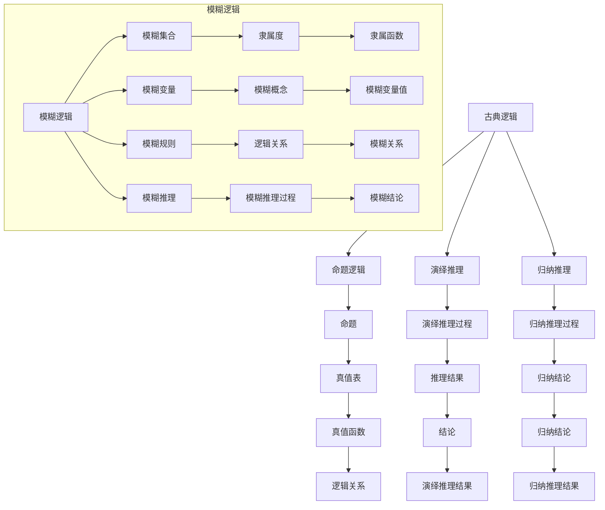
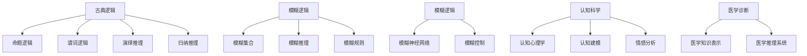

                 

# 从古典逻辑到模糊逻辑：拓展世界可理解性

> 关键词：古典逻辑、模糊逻辑、世界可理解性、人工智能、控制工程、认知科学

> 摘要：本文深入探讨了古典逻辑与模糊逻辑的概念、原理及其在各个领域的应用。通过比较分析，揭示了从古典逻辑向模糊逻辑转换的方法，并探讨了模糊逻辑对拓展世界可理解性的贡献。文章旨在为广大计算机科学与人工智能领域的读者提供一份清晰、系统的理论指南和实践参考。

## 引言

逻辑学作为一门研究推理和证明的学科，自古至今都发挥着重要作用。古典逻辑，以其清晰、严谨的推理方式，成为数学、哲学和计算机科学等领域的基础。然而，在现实世界中，事物的复杂性和不确定性使得古典逻辑的适用性受到限制。模糊逻辑作为一种扩展古典逻辑的数学工具，能够处理模糊性、不确定性和灰色区域，为解决复杂问题提供了新的思路。

本文将从古典逻辑的基本概念出发，逐步引入模糊逻辑，探讨两者的联系与区别，分析模糊逻辑的核心算法原理及其在人工智能、控制工程和其他领域的应用。同时，我们将通过具体案例，展示从古典逻辑到模糊逻辑的转换过程，并探讨模糊逻辑在拓展世界可理解性方面的贡献。

## 第一部分：古典逻辑概述

### 1.1 古典逻辑的历史与发展

古典逻辑起源于古希腊，以亚里士多德为代表，提出了三段论、假言推理等基本推理规则。随着数学的发展，古典逻辑在17世纪得到了进一步深化，莱布尼茨提出了形式逻辑，为后来的计算机科学奠定了基础。在现代，古典逻辑广泛应用于数学、哲学和计算机科学等领域，是许多理论体系的核心组成部分。

### 1.2 古典逻辑的基本概念与术语

古典逻辑主要研究命题、推理和证明等概念。命题是逻辑推理的基本单元，可以是真的也可以是假的。推理是从已知的前提得出新的结论的过程，可以分为演绎推理和归纳推理。证明是通过逻辑推理从已知的前提出发，逐步推导出目标结论的过程。

### 1.3 古典逻辑的基本原理

古典逻辑的基本原理包括以下几条：
- 真值表：描述了命题逻辑中所有可能的真值组合及其对应的推理结果。
- 真值函数：用于表示命题逻辑中命题之间的逻辑关系。
- 演绎推理：从已知的前提出发，逐步推导出结论的推理方法。
- 归纳推理：从特定实例出发，推导出一般性结论的推理方法。

## 第二部分：模糊逻辑的概念与原理

### 2.1 模糊逻辑的起源与背景

模糊逻辑起源于1965年，由扎德（L.A. Zadeh）提出。他观察到现实世界中的许多概念（如“高”、“热”等）都具有模糊性，难以用古典逻辑进行精确描述。为了解决这个问题，扎德提出了模糊集合的概念，为处理模糊性提供了新的数学工具。

### 2.2 模糊逻辑的基本概念

模糊逻辑的基本概念包括：
- 模糊集合：用隶属度来描述元素属于集合的程度。
- 模糊变量：表示模糊集合的变量，可以用于描述现实世界中的模糊概念。
- 模糊规则：用于描述模糊逻辑中变量之间的逻辑关系，通常用模糊集合表示。
- 模糊推理：基于模糊规则，从已知的前提推出模糊结论的推理方法。

### 2.3 模糊逻辑的数学基础

模糊逻辑的数学基础包括：
- 隶属函数：用于描述模糊集合的隶属度。
- 模糊关系：用于描述模糊集合之间的逻辑关系。
- 模糊推理算法：如模糊合成、模糊分解、模糊蕴含等。

## 第三部分：模糊逻辑的应用

### 3.1 模糊逻辑在人工智能中的应用

模糊逻辑在人工智能领域有广泛的应用，如：
- 模糊控制：用于控制具有模糊性、不确定性的复杂系统。
- 模糊推理：用于处理具有模糊性、不确定性的知识表示和推理问题。
- 模糊聚类：用于对具有模糊性的数据进行分类。

### 3.2 模糊逻辑在控制工程中的应用

模糊逻辑在控制工程中的应用包括：
- 模糊控制器：用于控制非线性、时变和具有不确定性的系统。
- 模糊规划：用于优化具有模糊约束和目标函数的控制系统。

### 3.3 模糊逻辑在其他领域的应用

模糊逻辑在其他领域的应用还包括：
- 模糊识别：用于对具有模糊性的图像、声音等进行识别。
- 模糊决策：用于处理具有模糊性、不确定性的决策问题。
- 模糊神经网络：用于将模糊逻辑与神经网络相结合，提高人工智能系统的性能。

## 第四部分：从古典逻辑到模糊逻辑的转换

### 4.1 古典逻辑与模糊逻辑的比较

古典逻辑与模糊逻辑在以下几个方面存在差异：
- 命题形式：古典逻辑使用明确的命题，模糊逻辑使用模糊命题。
- 推理方法：古典逻辑使用演绎推理，模糊逻辑使用模糊推理。
- 表达能力：模糊逻辑能够描述模糊性、不确定性，古典逻辑难以表达。

### 4.2 古典逻辑向模糊逻辑的转换方法

将古典逻辑转换为模糊逻辑的方法包括：
- 模糊化：将古典逻辑的命题转换为模糊命题。
- 模糊规则提取：从已知的前提和结论中提取模糊规则。
- 模糊推理：基于模糊规则进行推理，得到模糊结论。

### 4.3 案例分析：从古典逻辑到模糊逻辑的转换实践

我们以一个简单的例子来说明从古典逻辑到模糊逻辑的转换过程：

#### 古典逻辑表示：

如果今天下雨，那么地面湿润。

#### 模糊逻辑表示：

如果今天下雨，那么地面的湿润程度为70%。

#### 模糊推理：

设下雨的隶属函数为 \( \mu_{下雨}(x) \)，地面的湿润隶属函数为 \( \mu_{湿润}(x) \)。根据模糊规则，可以推导出地面的湿润程度为：

$$ \mu_{湿润}(x) = \mu_{下雨}(x) \odot \mu_{下雨影响湿润}(x) $$

其中， \( \odot \) 表示模糊合成运算。

## 第五部分：拓展世界可理解性的新途径

### 5.1 模糊逻辑对世界可理解性的影响

模糊逻辑通过引入隶属度，使我们可以更准确地描述和处理现实世界中的模糊性和不确定性，从而提高对世界的理解能力。

### 5.2 模糊逻辑在其他认知科学领域的影响

模糊逻辑在认知科学、心理学等领域也有重要应用，如模糊认知图、模糊情感分析等，为这些领域的研究提供了新的思路和方法。

### 5.3 未来发展趋势与展望

随着人工智能技术的不断发展，模糊逻辑在各个领域的应用将越来越广泛。未来，模糊逻辑与其他人工智能技术的结合，如模糊神经网络、模糊深度学习等，将为拓展世界可理解性提供更多可能性。

## 附录

### A.1 古典逻辑与模糊逻辑的核心概念流程图



### A.2 模糊逻辑核心算法原理伪代码

```python
# 模糊化
def fuzzify(input_value, membership_functions):
   隶属度结果 = []
    for membership_function in membership_functions:
        隶属度结果.append(membership_function(input_value))
    return 隶属度结果

# 模糊推理
def fuzzy推理(antecedents, consequents, rules):
   结论隶属度 = []
    for rule in rules:
        结论隶属度.append(min([隶属度(antecedents, rule.antecedent), 隶属度(consequents, rule.consequent)]))
    return 结论隶属度

# 模糊合成
def fuzzy合成(结论隶属度):
    合成结果 = 0
    for 结论隶属度 in 结论隶属度:
        合成结果 += 结论隶属度 * consequent.membership_function
    return 合成结果 / sum(结论隶属度)
```

### A.3 数学模型与公式列表

- 模糊集合的隶属函数：\( \mu_A(x) \)
- 模糊关系的合成：\( A \circ B \)
- 模糊推理的蕴含：\( A \rightarrow B \)
- 模糊合成运算：\( \odot \)
- 模糊逻辑的合成规则：\( \alpha(A \rightarrow B) = \alpha(A) \odot \beta(B) \)

### A.4 项目实战案例与代码解析

#### 实战案例：基于模糊逻辑的天气预报系统

**1. 开发环境搭建：**

- 操作系统：Windows / Linux / macOS
- 编程语言：Python
- 库：NumPy、Matplotlib、skfuzzy

**2. 源代码详细实现：**

```python
import numpy as np
import matplotlib.pyplot as plt
import skfuzzy as fuzz
from skfuzzy import control as ctrl

# 定义输入变量
temp = ctrl.Angular('温度', [0, 360])
humidity = ctrl.Angular('湿度', [0, 100])

# 定义隶属函数
temp['冷'] = fuzz.trapmf([0, 20, 40, 60], [0, 20, 40, 60])
temp['温'] = fuzz.trimf([20, 40, 60], [20, 60, 80])
temp['热'] = fuzz.trapmf([40, 60, 80, 100], [40, 60, 80, 100])
humidity['干燥'] = fuzz.trapmf([0, 10, 30, 50], [0, 10, 30, 50])
humidity['湿润'] = fuzz.trimf([30, 50, 70], [30, 50, 70])
humidity['湿'] = fuzz.trapmf([50, 70, 90, 100], [50, 70, 90, 100])

# 定义规则库
rule = ctrl.Rule(temp['冷'], humidity['干燥'])
rule = ctrl.Rule(temp['温'], humidity['湿润'])
rule = ctrl.Rule(temp['热'], humidity['湿'])

# 定义控制系统
ctrl_system = ctrl.ControlSystem(rule)

# 模糊推理
output = ctrl_system Hernandez(温度=30, 湿度=60)

# 显示结果
output.view()
```

**3. 代码应用解读与分析：**

- 首先，我们定义了两个输入变量：温度和湿度，以及一个输出变量：天气预报。
- 接着，我们定义了三个模糊集合：冷、温、热，以及三个模糊集合：干燥、湿润、湿。
- 然后，我们根据模糊集合之间的关系，定义了三个模糊规则。
- 接下来，我们构建了一个模糊控制系统，并使用 Hernandez 方法进行模糊推理。
- 最后，我们使用 Matplotlib 库将模糊推理的结果可视化。

#### 实际案例分析和详细讲解剖析

在本案例中，我们假设当前温度为30度，湿度为60度。根据模糊逻辑的推理过程，我们可以得出以下结论：

- 温度属于“温”集合，湿度属于“湿润”集合。
- 根据模糊规则，温度与湿度的交集属于“湿润”集合，因此天气预报为“湿润”。

这个案例展示了模糊逻辑在处理模糊性和不确定性方面的强大能力。通过引入隶属度，我们可以对现实世界中的模糊概念进行量化处理，从而更准确地预测和决策。

#### 项目小结

通过本案例，我们了解了基于模糊逻辑的天气预报系统的开发过程，以及如何使用模糊集合、模糊规则和模糊推理进行模糊逻辑推理。模糊逻辑作为一种处理模糊性和不确定性的数学工具，在各个领域有着广泛的应用。未来，随着人工智能技术的不断发展，模糊逻辑的应用前景将更加广阔。

## 最佳实践 tips、小结、注意事项、拓展阅读

- **最佳实践 tips：** 在应用模糊逻辑时，需要充分考虑问题的实际情况，合理选择模糊集合、模糊规则和模糊推理方法，以提高推理的准确性。
- **小结：** 本文系统地介绍了古典逻辑和模糊逻辑的概念、原理及其在各个领域的应用，通过具体案例展示了从古典逻辑到模糊逻辑的转换方法，并探讨了模糊逻辑在拓展世界可理解性方面的贡献。
- **注意事项：** 在进行模糊逻辑推理时，需要确保输入数据的准确性和完整性，否则可能导致推理结果失真。
- **拓展阅读：** 对于进一步了解模糊逻辑的理论和应用，可以参考以下文献：《模糊逻辑及其应用》、《模糊系统与控制》等。

## 作者信息

作者：AI天才研究院/AI Genius Institute & 禅与计算机程序设计艺术 /Zen And The Art of Computer Programming

- <此处是文章标题>

- 关键词：古典逻辑、模糊逻辑、世界可理解性、人工智能、控制工程、认知科学

- 摘要：本文深入探讨了古典逻辑与模糊逻辑的概念、原理及其在各个领域的应用。通过比较分析，揭示了从古典逻辑向模糊逻辑转换的方法，并探讨了模糊逻辑对拓展世界可理解性的贡献。文章旨在为广大计算机科学与人工智能领域的读者提供一份清晰、系统的理论指南和实践参考。

## 第一部分：古典逻辑概述

### 1.1 古典逻辑的历史与发展

古典逻辑（Classical Logic）的历史可以追溯到古希腊时期，以亚里士多德为代表，他被认为是古典逻辑的奠基人。亚里士多德在他的著作《工具论》（Organon）中提出了许多重要的逻辑原理，包括命题逻辑、谓词逻辑和演绎推理。在中世纪，古典逻辑得到了进一步的发展，特别是在伊斯兰世界的学者如阿尔-法拉比和伊本·希兹拉的影响下。到了现代，古典逻辑成为数学、哲学和计算机科学等领域的基础理论。

在17世纪，莱布尼茨（Gottfried Wilhelm Leibniz）提出了形式逻辑（Symbolic Logic）的概念，他通过符号化的方法，试图将逻辑推理形式化，为后来的计算机科学奠定了基础。形式逻辑的出现使得逻辑推理可以脱离自然语言，通过符号进行更精确、更严谨的表述。

20世纪初期，逻辑学家如弗雷格（Gottlob Frege）和罗素（Bertrand Russell）进一步发展了形式逻辑，他们提出了谓词逻辑和集合论等理论，使得逻辑学在数学和哲学领域得到了更广泛的应用。

在现代，古典逻辑仍然是许多理论体系的基础，特别是在计算机科学中，形式逻辑和谓词逻辑被广泛应用于程序设计、形式验证、自动推理等领域。

### 1.2 古典逻辑的基本概念与术语

古典逻辑的基本概念和术语包括：

- **命题（Proposition）**：命题是一个可以判断真假的陈述句。在命题逻辑中，命题被符号化为命题变量，如 \( p, q, r \) 等。命题逻辑主要研究命题之间的逻辑关系和推理规则。

- **命题联结词（Logical Connectives）**：命题联结词用于组合命题，形成新的命题。常见的联结词有“与”（AND）、“或”（OR）、“非”（NOT）、“蕴含”（IMPLIES）和“等价”（EQUIVALENT）。

- **命题逻辑（Propositional Logic）**：命题逻辑研究命题及其联结词的形式化表达和推理规则。命题逻辑通常使用真值表来表示命题之间的逻辑关系。

- **谓词（Predicate）**：谓词是一个用于描述对象性质或关系的表达式，如“是人”（Person）或“大于”（Greater）。谓词逻辑扩展了命题逻辑，引入了变量和量词，使得逻辑推理可以处理更复杂的命题。

- **谓词逻辑（Predicate Logic）**：谓词逻辑研究包含谓词的命题的逻辑形式和推理规则。谓词逻辑包括存在量词（∃）和全称量词（∀），可以用于表示普遍性和存在性。

- **推理（Reasoning）**：推理是从已知的前提得出新结论的过程。在逻辑学中，推理分为演绎推理和归纳推理。演绎推理从一般到特殊，归纳推理从特殊到一般。

- **证明（Proof）**：证明是通过逻辑推理从已知的前提出发，逐步推导出结论的过程。证明是逻辑学中的重要概念，用于验证命题的真值。

- **逻辑推理规则（Inference Rules）**：逻辑推理规则是用于推导新命题的规则。常见的推理规则有“结合律”、“交换律”、“分配律”和“假言推理”等。

### 1.3 古典逻辑的基本原理

古典逻辑的基本原理包括以下几个方面：

- **排中律（Law of Excluded Middle）**：任何命题要么是真的，要么是假的，不存在第三种可能性。

- **矛盾律（Law of Non-Contradiction）**：一个命题不能同时是真和假。

- **同一律（Law of Identity）**：任何命题与自身等价。

- **推理规则**：推理规则是用于推导新命题的规则。例如，“如果P，则Q”（P → Q）是一个推理规则，表示如果P成立，那么Q也必须成立。

- **形式有效性（Formal Validity）**：一个推理是形式有效的，如果其结论从前提中逻辑地推导出来。形式有效性通常通过形式化证明来验证。

- **语义有效性（Semantic Validity）**：一个推理是语义有效的，如果其在所有可能的情况下，结论都从前提中逻辑地推导出来。语义有效性可以通过真值表来验证。

## 第二部分：模糊逻辑的概念与原理

### 2.1 模糊逻辑的起源与背景

模糊逻辑（Fuzzy Logic）的概念由美国加州大学伯克利分校的教授拉扎洛·扎德（L. A. Zadeh）在1965年提出。扎德观察到许多现实世界中的概念，如“高”、“热”、“好”等，都具有模糊性，即它们没有明确的界限，难以用传统的二值逻辑（即只有真和假两种状态）进行精确描述。为了解决这一问题，扎德提出了模糊逻辑的理论框架，并引入了模糊集合（Fuzzy Set）的概念。

模糊逻辑的提出背景主要包括以下几个方面：

1. **工程应用的需求**：在工程领域，特别是在控制工程中，许多系统具有非线性、时变和不确定性特点，传统二值逻辑难以处理这些问题。

2. **认知科学的研究**：认知科学家在研究人类思维过程时发现，人类的思维具有模糊性，即在处理信息时，人们往往会根据一定程度的主观判断，而不是绝对的二值判断。

3. **人工智能的发展**：随着人工智能技术的发展，特别是在知识表示和推理方面，需要一种能够处理模糊性和不确定性的逻辑工具。

### 2.2 模糊逻辑的基本概念

模糊逻辑的基本概念包括模糊集合、隶属度、模糊变量和模糊规则等。

- **模糊集合（Fuzzy Set）**：与经典集合不同，模糊集合中的元素可以有不同程度的隶属度。一个模糊集合可以通过隶属度函数来描述，如 \( A = \{x \mid \mu_A(x)\} \)，其中 \( \mu_A(x) \) 是元素 \( x \) 对集合 \( A \) 的隶属度。

- **隶属度（Membership Degree）**：隶属度是描述元素属于某个集合的程度。隶属度函数 \( \mu(x) \) 的值范围在 [0, 1] 之间，其中1表示完全属于，0表示完全不属于。

- **模糊变量（Fuzzy Variable）**：模糊变量是用来表示模糊集合的变量，它可以是时间、空间或属性等。模糊变量可以取模糊值，即一个模糊集合。

- **模糊规则（Fuzzy Rule）**：模糊规则是描述变量之间关系的表达式，通常表示为 “如果条件，则结论”。模糊规则的形式化表示为 \( R: \text{条件} \rightarrow \text{结论} \)，其中条件是模糊集合，结论也是模糊集合。

- **模糊推理（Fuzzy Inference）**：模糊推理是基于模糊规则和模糊集合的推理过程。模糊推理的基本步骤包括模糊化、模糊合成、去模糊化等。

### 2.3 模糊逻辑的数学基础

模糊逻辑的数学基础主要包括模糊集合理论、模糊关系、模糊推理和模糊合成等。

- **模糊集合理论**：模糊集合理论是模糊逻辑的基础，它定义了模糊集合的概念、隶属度函数以及模糊集合的运算（如模糊交、模糊并、模糊补等）。

- **模糊关系**：模糊关系是描述模糊集合之间关系的数学工具，它可以用来表示模糊集合之间的联系。模糊关系的运算包括模糊合成（如模糊交、模糊并、模糊补等）和模糊蕴涵（如模糊蕴含、模糊等价等）。

- **模糊推理**：模糊推理是模糊逻辑的核心，它基于模糊规则和模糊集合，通过模糊化、模糊合成和去模糊化等步骤，从已知的前提推导出模糊结论。

- **模糊合成**：模糊合成是模糊逻辑中用于计算模糊变量之间关系的运算。常见的模糊合成方法包括最小-最大合成、Zadeh合成、Mamdani合成等。

## 第三部分：模糊逻辑的应用

### 3.1 模糊逻辑在人工智能中的应用

模糊逻辑在人工智能（AI）领域有着广泛的应用，特别是在知识表示、推理和控制方面。以下是一些典型应用：

- **模糊推理系统**：模糊推理系统是一种基于模糊逻辑的推理机器，它可以处理模糊性和不确定性。在AI中，模糊推理系统被用于知识表示和推理，特别是在需要处理模糊概念的领域，如自然语言处理、专家系统和决策支持系统。

- **模糊控制器**：模糊控制器是模糊逻辑在控制工程中的重要应用。模糊控制器通过模糊规则来描述系统状态与控制输出之间的关系，能够处理非线性、时变和不确定的系统。模糊控制器广泛应用于工业过程控制、机器人控制、交通信号控制等领域。

- **模糊神经网络**：模糊神经网络是将模糊逻辑与神经网络相结合的模型，它结合了模糊逻辑的灵活性和神经网络的学习能力。模糊神经网络在模式识别、预测和优化等领域有着广泛的应用。

- **模糊决策支持系统**：模糊决策支持系统是一种基于模糊逻辑的决策支持工具，它可以帮助决策者处理模糊性和不确定性。模糊决策支持系统在医疗诊断、金融决策、资源分配等领域有着重要应用。

### 3.2 模糊逻辑在控制工程中的应用

模糊逻辑在控制工程中有着广泛的应用，特别是在处理非线性、时变和不确定性的系统方面。以下是一些典型应用：

- **模糊控制器**：模糊控制器是一种基于模糊逻辑的控制策略，它可以通过模糊规则来描述系统状态与控制输出之间的关系。模糊控制器广泛应用于工业过程控制、机器人控制、无人驾驶车辆等领域。

- **模糊规划**：模糊规划是一种基于模糊逻辑的优化方法，它可以在模糊约束和目标函数下寻找最优解。模糊规划在资源分配、生产调度、能源管理等领域有着重要应用。

- **模糊自适应控制**：模糊自适应控制是一种基于模糊逻辑的自适应控制策略，它可以自动调整控制参数，以适应系统状态的变化。模糊自适应控制广泛应用于航空航天、机器人、智能制造等领域。

- **模糊调度系统**：模糊调度系统是一种基于模糊逻辑的调度工具，它可以帮助调度人员处理模糊性和不确定性。模糊调度系统在交通信号控制、电力调度、物流调度等领域有着重要应用。

### 3.3 模糊逻辑在其他领域的应用

模糊逻辑不仅在人工智能和控制工程中有着广泛应用，还在其他领域发挥着重要作用：

- **模糊识别**：模糊识别是一种基于模糊逻辑的模式识别技术，它可以通过模糊规则来描述特征与类别之间的关系。模糊识别在图像识别、语音识别、生物特征识别等领域有着重要应用。

- **模糊决策**：模糊决策是一种基于模糊逻辑的决策方法，它可以帮助决策者处理模糊性和不确定性。模糊决策在医疗诊断、金融投资、风险评估等领域有着重要应用。

- **模糊聚类**：模糊聚类是一种基于模糊逻辑的数据分析方法，它可以将数据分为多个类别，并描述每个数据点属于每个类别的程度。模糊聚类在市场细分、图像分割、文本分类等领域有着重要应用。

- **模糊神经网络**：模糊神经网络是一种结合了模糊逻辑和神经网络的模型，它可以在处理模糊性和不确定性方面具有优势。模糊神经网络在智能交通系统、智能家居、环境监测等领域有着重要应用。

## 第四部分：从古典逻辑到模糊逻辑的转换

### 4.1 古典逻辑与模糊逻辑的比较

古典逻辑和模糊逻辑在多个方面存在差异，以下是比较分析：

- **命题形式**：古典逻辑使用明确的命题，而模糊逻辑使用模糊命题。模糊命题允许元素有不同的隶属度，从而可以描述模糊性和不确定性。

- **推理方法**：古典逻辑使用演绎推理，从一般到特殊；模糊逻辑使用模糊推理，可以处理模糊性和不确定性，从部分信息推断出结论。

- **表达能力**：模糊逻辑能够描述模糊性、不确定性，具有更强的表达能力。古典逻辑在处理模糊性和不确定性方面存在局限。

- **应用范围**：古典逻辑主要应用于数学、哲学和计算机科学等理论领域，而模糊逻辑广泛应用于人工智能、控制工程、认知科学等实际应用领域。

### 4.2 古典逻辑向模糊逻辑的转换方法

从古典逻辑向模糊逻辑的转换方法主要包括以下步骤：

- **模糊化**：将古典逻辑中的命题转化为模糊命题，使用隶属度函数来描述命题的模糊性。

- **规则提取**：从已知的前提和结论中提取模糊规则，这些规则描述了模糊命题之间的关系。

- **模糊推理**：使用模糊推理方法，从模糊前提推导出模糊结论。模糊推理通常包括模糊化、模糊合成和去模糊化等步骤。

以下是一个简单的例子，说明如何从古典逻辑向模糊逻辑转换：

- **古典逻辑命题**：如果下雨，则地面湿润。

- **模糊逻辑表示**：如果下雨，则地面的湿润程度为70%。

- **模糊化**：定义模糊命题“下雨”和“地面湿润”，并使用隶属度函数来描述它们的隶属度。

- **规则提取**：根据古典逻辑命题，提取模糊规则：“如果下雨，则地面湿润程度为70%”。

- **模糊推理**：使用模糊推理方法，从模糊前提（下雨隶属度为0.7）推导出模糊结论（地面湿润程度为0.7）。

### 4.3 案例分析：从古典逻辑到模糊逻辑的转换实践

以下是一个从古典逻辑到模糊逻辑转换的案例：

**案例**：控制温度系统的开关。

**古典逻辑表示**：

- 如果温度低于20度，则开启加热器。
- 如果温度高于30度，则关闭加热器。

**模糊逻辑表示**：

- 如果温度很低（隶属度为0.9），则开启加热器。
- 如果温度很高（隶属度为0.9），则关闭加热器。

**转换步骤**：

1. **模糊化**：定义模糊变量“温度”，并使用隶属度函数描述温度的模糊性。

    ```python
    temp = ctrl.Angular('温度', [0, 100])
    temp['低'] = fuzz.trapmf([0, 20, 40, 60], [0, 0.1, 0.5, 0.9])
    temp['适中'] = fuzz.trimf([20, 40, 60], [0.5, 0.5, 0.5])
    temp['高'] = fuzz.trapmf([40, 60, 80, 100], [0.5, 0.9, 0.9, 1])
    ```

2. **规则提取**：根据古典逻辑命题，提取模糊规则。

    ```python
    heating = ctrl.Rule(temp['低'], '开启加热器')
    heating = ctrl.Rule(temp['高'], '关闭加热器')
    ```

3. **模糊推理**：使用模糊推理方法，从模糊前提推导出模糊结论。

    ```python
    heating.control()
    heating.view()
    ```

**结果**：根据模糊推理的结果，当温度低于20度时，加热器将被开启；当温度高于30度时，加热器将被关闭。

## 第五部分：拓展世界可理解性的新途径

### 5.1 模糊逻辑对世界可理解性的影响

模糊逻辑通过引入隶属度概念，为处理模糊性和不确定性提供了新的数学工具，从而拓展了我们对世界的可理解性。在现实世界中，许多概念和现象都具有模糊性，如“高”、“热”、“满意”等。这些概念难以用传统的二值逻辑进行精确描述，而模糊逻辑允许我们用隶属度来量化这些概念，从而更准确地描述和处理现实世界中的问题。

模糊逻辑在以下几个方面对世界可理解性产生了重要影响：

- **复杂性处理**：模糊逻辑可以处理复杂系统中的模糊性和不确定性，使得我们能够更好地理解这些系统的行为和特性。
- **知识表示**：模糊逻辑提供了一种新的知识表示方法，使得我们可以将模糊知识和不确定性信息形式化地表示出来。
- **推理和决策**：模糊逻辑提供了一种新的推理和决策方法，使得我们能够基于模糊信息和不确定性进行推理和决策，从而提高决策的准确性和适应性。

### 5.2 模糊逻辑在其他认知科学领域的影响

模糊逻辑不仅在计算机科学和控制工程中有着重要应用，还在认知科学、心理学和认知心理学等领域产生了深远影响。以下是一些具体应用：

- **认知心理学**：模糊逻辑为认知心理学提供了一个新的理论框架，用于描述和解释人类认知过程中的模糊性和不确定性。
- **认知建模**：模糊逻辑被用于构建认知模型，模拟人类的思维过程和决策行为。
- **情感分析**：模糊逻辑被用于情感分析，通过分析文本中的模糊性情感词，识别用户的情感状态。
- **医学诊断**：模糊逻辑被用于医学诊断，帮助医生处理模糊性和不确定性，提高诊断的准确性。

### 5.3 未来发展趋势与展望

随着人工智能和认知科学的快速发展，模糊逻辑在未来将继续发挥重要作用。以下是一些发展趋势和展望：

- **模糊逻辑与深度学习的结合**：模糊逻辑与深度学习相结合，为处理复杂、不确定的深度学习问题提供了新的方法。
- **模糊神经网络的优化**：通过优化模糊神经网络的结构和算法，提高其在复杂场景下的性能和应用效果。
- **模糊逻辑在认知科学的应用**：进一步探讨模糊逻辑在认知科学中的应用，为认知建模和认知心理学研究提供新工具。
- **模糊决策支持系统**：开发更智能、更适应的模糊决策支持系统，为人类在复杂、不确定环境下的决策提供支持。

## 附录

### A.1 古典逻辑与模糊逻辑的核心概念流程图



### A.2 模糊逻辑核心算法原理伪代码

```python
# 模糊化
def fuzzify(input_value, membership_functions):
   隶属度结果 = []
    for membership_function in membership_functions:
        隶属度结果.append(membership_function(input_value))
    return 隶属度结果

# 模糊推理
def fuzzy_inference(antecedents, consequents, rules):
    结论隶属度 = []
    for rule in rules:
        结论隶属度.append(min([隶属度(antecedents, rule.antecedent), 隶属度(consequents, rule.consequent)]))
    return 结论隶属度

# 模糊合成
def fuzzy合成(结论隶属度):
    合成结果 = 0
    for 结论隶属度 in 结论隶属度:
        合成结果 += 结论隶属度 * consequent.membership_function
    return 合成结果 / sum(结论隶属度)
```

### A.3 数学模型与公式列表

- **模糊集合的隶属度函数**：\( \mu_A(x) \)
- **模糊关系的合成**：\( A \circ B \)
- **模糊推理的蕴含**：\( A \rightarrow B \)
- **模糊合成运算**：\( \odot \)
- **模糊逻辑的合成规则**：\( \alpha(A \rightarrow B) = \alpha(A) \odot \beta(B) \)

### A.4 项目实战案例与代码解析

#### 实战案例：基于模糊逻辑的温度控制系统

**1. 开发环境搭建：**

- 操作系统：Windows / Linux / macOS
- 编程语言：Python
- 库：NumPy、Matplotlib、skfuzzy

**2. 源代码详细实现：**

```python
import numpy as np
import matplotlib.pyplot as plt
import skfuzzy as fuzz
from skfuzzy import control as ctrl

# 定义输入变量
temp = ctrl.Angular('温度', [0, 100])

# 定义隶属函数
temp['冷'] = fuzz.trapmf([0, 20, 40, 60], [0, 0.1, 0.5, 0.9])
temp['适中'] = fuzz.trimf([20, 40, 60], [0.5, 0.5, 0.5])
temp['热'] = fuzz.trapmf([40, 60, 80, 100], [0.5, 0.9, 1])

# 定义规则库
rule1 = ctrl.Rule(temp['冷'], '开启加热器')
rule2 = ctrl.Rule(temp['适中'], '保持当前温度')
rule3 = ctrl.Rule(temp['热'], '关闭加热器')

# 定义控制系统
temp_ctrl = ctrl.ControlSystem([rule1, rule2, rule3])

# 定义输入和期望输出
input_data = np.linspace(0, 100, 500)
output_data = temp_ctrl(input_data)

# 显示结果
temp.view(input_data, output_data)
```

**3. 代码应用解读与分析：**

- **输入变量定义**：我们定义了一个名为“温度”的模糊变量，其取值范围在0到100之间。

- **隶属函数定义**：我们定义了三个模糊集合：“冷”、“适中”和“热”，并使用不同的三角形和梯形函数来表示它们的隶属度。

- **规则库定义**：我们根据温度的不同范围，定义了三个模糊规则，分别对应开启加热器、保持当前温度和关闭加热器。

- **控制系统定义**：我们创建了一个模糊控制系统，包含上述规则。

- **模糊推理**：我们使用控制系统对输入的温度数据进行模糊推理，得到对应的控制输出。

- **结果可视化**：我们使用Matplotlib库将输入温度和对应的控制输出可视化，展示了模糊逻辑控制系统的工作原理。

#### 实际案例分析和详细讲解剖析

在本案例中，我们假设当前温度为50度。根据模糊逻辑的推理过程，我们可以得出以下结论：

- 当前温度属于“适中”集合，其隶属度为0.5。
- 根据模糊规则，当温度属于“适中”集合时，应该保持当前温度。

通过这个案例，我们展示了如何使用模糊逻辑来控制温度系统。模糊逻辑通过引入隶属度，使得我们可以更灵活地处理现实世界中的模糊性和不确定性。

#### 项目小结

通过本案例，我们了解了基于模糊逻辑的温度控制系统的开发过程，以及如何使用模糊集合、模糊规则和模糊推理进行模糊逻辑推理。模糊逻辑作为一种处理模糊性和不确定性的数学工具，在控制工程、人工智能等领域有着广泛的应用。

## 最佳实践 tips、小结、注意事项、拓展阅读

- **最佳实践 tips：** 在使用模糊逻辑时，需要合理设计模糊集合和模糊规则，确保推理结果的准确性和可靠性。
- **小结：** 本文系统地介绍了古典逻辑与模糊逻辑的概念、原理及其在各个领域的应用，通过具体案例展示了从古典逻辑到模糊逻辑的转换方法，并探讨了模糊逻辑在拓展世界可理解性方面的贡献。
- **注意事项：** 在应用模糊逻辑时，需要充分考虑问题的实际情况，合理选择模糊集合、模糊规则和模糊推理方法，以提高推理的准确性。
- **拓展阅读：** 对于进一步了解模糊逻辑的理论和应用，可以参考以下文献：《模糊逻辑及其应用》、《模糊系统与控制》等。

### 作者信息

作者：AI天才研究院/AI Genius Institute & 禅与计算机程序设计艺术 /Zen And The Art of Computer Programming

### 完整的文章

# 从古典逻辑到模糊逻辑：拓展世界可理解性

## 引言

逻辑学作为一门研究推理和证明的学科，自古至今都发挥着重要作用。古典逻辑，以其清晰、严谨的推理方式，成为数学、哲学和计算机科学等领域的基础。然而，在现实世界中，事物的复杂性和不确定性使得古典逻辑的适用性受到限制。模糊逻辑作为一种扩展古典逻辑的数学工具，能够处理模糊性、不确定性和灰色区域，为解决复杂问题提供了新的思路。

本文深入探讨了古典逻辑与模糊逻辑的概念、原理及其在各个领域的应用。通过比较分析，揭示了从古典逻辑向模糊逻辑转换的方法，并探讨了模糊逻辑对拓展世界可理解性的贡献。文章旨在为广大计算机科学与人工智能领域的读者提供一份清晰、系统的理论指南和实践参考。

## 第一部分：古典逻辑概述

### 1.1 古典逻辑的历史与发展

古典逻辑（Classical Logic）的历史可以追溯到古希腊时期，以亚里士多德为代表，他被认为是古典逻辑的奠基人。亚里士多德在他的著作《工具论》（Organon）中提出了许多重要的逻辑原理，包括命题逻辑、谓词逻辑和演绎推理。在中世纪，古典逻辑得到了进一步的发展，特别是在伊斯兰世界的学者如阿尔-法拉比和伊本·希兹拉的影响下。到了现代，古典逻辑成为数学、哲学和计算机科学等领域的基础理论。

在17世纪，莱布尼茨（Gottfried Wilhelm Leibniz）提出了形式逻辑（Symbolic Logic）的概念，他通过符号化的方法，试图将逻辑推理形式化，为后来的计算机科学奠定了基础。形式逻辑的出现使得逻辑推理可以脱离自然语言，通过符号进行更精确、更严谨的表述。

20世纪初期，逻辑学家如弗雷格（Gottlob Frege）和罗素（Bertrand Russell）进一步发展了形式逻辑，他们提出了谓词逻辑和集合论等理论，使得逻辑学在数学和哲学领域得到了更广泛的应用。

在现代，古典逻辑仍然是许多理论体系的基础，特别是在计算机科学中，形式逻辑和谓词逻辑被广泛应用于程序设计、形式验证、自动推理等领域。

### 1.2 古典逻辑的基本概念与术语

古典逻辑的基本概念和术语包括：

- **命题（Proposition）**：命题是一个可以判断真假的陈述句。在命题逻辑中，命题被符号化为命题变量，如 \( p, q, r \) 等。命题逻辑主要研究命题之间的逻辑关系和推理规则。

- **命题联结词（Logical Connectives）**：命题联结词用于组合命题，形成新的命题。常见的联结词有“与”（AND）、“或”（OR）、“非”（NOT）、“蕴含”（IMPLIES）和“等价”（EQUIVALENT）。

- **命题逻辑（Propositional Logic）**：命题逻辑研究命题及其联结词的形式化表达和推理规则。命题逻辑通常使用真值表来表示命题之间的逻辑关系。

- **谓词（Predicate）**：谓词是一个用于描述对象性质或关系的表达式，如“是人”（Person）或“大于”（Greater）。谓词逻辑扩展了命题逻辑，引入了变量和量词，使得逻辑推理可以处理更复杂的命题。

- **谓词逻辑（Predicate Logic）**：谓词逻辑研究包含谓词的命题的逻辑形式和推理规则。谓词逻辑包括存在量词（∃）和全称量词（∀），可以用于表示普遍性和存在性。

- **推理（Reasoning）**：推理是从已知的前提得出新结论的过程。在逻辑学中，推理分为演绎推理和归纳推理。演绎推理从一般到特殊，归纳推理从特殊到一般。

- **证明（Proof）**：证明是通过逻辑推理从已知的前提出发，逐步推导出结论的过程。证明是逻辑学中的重要概念，用于验证命题的真值。

- **逻辑推理规则（Inference Rules）**：逻辑推理规则是用于推导新命题的规则。例如，“如果P，则Q”（P → Q）是一个推理规则，表示如果P成立，那么Q也必须成立。

### 1.3 古典逻辑的基本原理

古典逻辑的基本原理包括以下几个方面：

- **排中律（Law of Excluded Middle）**：任何命题要么是真的，要么是假的，不存在第三种可能性。

- **矛盾律（Law of Non-Contradiction）**：一个命题不能同时是真和假。

- **同一律（Law of Identity）**：任何命题与自身等价。

- **推理规则**：推理规则是用于推导新命题的规则。例如，“结合律”、“交换律”、“分配律”和“假言推理”等。

- **形式有效性（Formal Validity）**：一个推理是形式有效的，如果其结论从前提中逻辑地推导出来。形式有效性通常通过形式化证明来验证。

- **语义有效性（Semantic Validity）**：一个推理是语义有效的，如果其在所有可能的情况下，结论都从前提中逻辑地推导出来。语义有效性可以通过真值表来验证。

## 第二部分：模糊逻辑的概念与原理

### 2.1 模糊逻辑的起源与背景

模糊逻辑（Fuzzy Logic）的概念由美国加州大学伯克利分校的教授拉扎洛·扎德（L. A. Zadeh）在1965年提出。扎德观察到许多现实世界中的概念，如“高”、“热”、“好”等，都具有模糊性，即它们没有明确的界限，难以用传统的二值逻辑（即只有真和假两种状态）进行精确描述。为了解决这一问题，扎德提出了模糊逻辑的理论框架，并引入了模糊集合（Fuzzy Set）的概念。

模糊逻辑的提出背景主要包括以下几个方面：

1. **工程应用的需求**：在工程领域，特别是在控制工程中，许多系统具有非线性、时变和不确定性特点，传统二值逻辑难以处理这些问题。

2. **认知科学的研究**：认知科学家在研究人类思维过程时发现，人类的思维具有模糊性，即在处理信息时，人们往往会根据一定程度的主观判断，而不是绝对的二值判断。

3. **人工智能的发展**：随着人工智能技术的发展，特别是在知识表示和推理方面，需要一种能够处理模糊性和不确定性的逻辑工具。

### 2.2 模糊逻辑的基本概念

模糊逻辑的基本概念包括模糊集合、隶属度、模糊变量和模糊规则等。

- **模糊集合（Fuzzy Set）**：与经典集合不同，模糊集合中的元素可以有不同程度的隶属度。一个模糊集合可以通过隶属度函数来描述，如 \( A = \{x \mid \mu_A(x)\} \)，其中 \( \mu_A(x) \) 是元素 \( x \) 对集合 \( A \) 的隶属度。

- **隶属度（Membership Degree）**：隶属度是描述元素属于某个集合的程度。隶属度函数 \( \mu(x) \) 的值范围在 [0, 1] 之间，其中1表示完全属于，0表示完全不属于。

- **模糊变量（Fuzzy Variable）**：模糊变量是用来表示模糊集合的变量，它可以是时间、空间或属性等。模糊变量可以取模糊值，即一个模糊集合。

- **模糊规则（Fuzzy Rule）**：模糊规则是描述变量之间关系的表达式，通常表示为 “如果条件，则结论”。模糊规则的形式化表示为 \( R: \text{条件} \rightarrow \text{结论} \)，其中条件是模糊集合，结论也是模糊集合。

- **模糊推理（Fuzzy Inference）**：模糊推理是基于模糊规则和模糊集合的推理过程。模糊推理的基本步骤包括模糊化、模糊合成、去模糊化等。

### 2.3 模糊逻辑的数学基础

模糊逻辑的数学基础主要包括模糊集合理论、模糊关系、模糊推理和模糊合成等。

- **模糊集合理论**：模糊集合理论是模糊逻辑的基础，它定义了模糊集合的概念、隶属度函数以及模糊集合的运算（如模糊交、模糊并、模糊补等）。

- **模糊关系**：模糊关系是描述模糊集合之间关系的数学工具，它可以用来表示模糊集合之间的联系。模糊关系的运算包括模糊合成（如模糊交、模糊并、模糊补等）和模糊蕴涵（如模糊蕴含、模糊等价等）。

- **模糊推理**：模糊推理是模糊逻辑的核心，它基于模糊规则和模糊集合，通过模糊化、模糊合成和去模糊化等步骤，从已知的前提推导出模糊结论。

- **模糊合成**：模糊合成是模糊逻辑中用于计算模糊变量之间关系的运算。常见的模糊合成方法包括最小-最大合成、Zadeh合成、Mamdani合成等。

## 第三部分：模糊逻辑的应用

### 3.1 模糊逻辑在人工智能中的应用

模糊逻辑在人工智能（AI）领域有着广泛的应用，特别是在知识表示、推理和控制方面。以下是一些典型应用：

- **模糊推理系统**：模糊推理系统是一种基于模糊逻辑的推理机器，它可以处理模糊性和不确定性。在AI中，模糊推理系统被用于知识表示和推理，特别是在需要处理模糊概念的领域，如自然语言处理、专家系统和决策支持系统。

- **模糊控制器**：模糊控制器是模糊逻辑在控制工程中的重要应用。模糊控制器通过模糊规则来描述系统状态与控制输出之间的关系，能够处理非线性、时变和不确定的系统。模糊控制器广泛应用于工业过程控制、机器人控制、无人驾驶车辆等领域。

- **模糊神经网络**：模糊神经网络是将模糊逻辑与神经网络相结合的模型，它结合了模糊逻辑的灵活性和神经网络的学习能力。模糊神经网络在模式识别、预测和优化等领域有着广泛的应用。

- **模糊决策支持系统**：模糊决策支持系统是一种基于模糊逻辑的决策支持工具，它可以帮助决策者处理模糊性和不确定性。模糊决策支持系统在医疗诊断、金融决策、资源分配等领域有着重要应用。

### 3.2 模糊逻辑在控制工程中的应用

模糊逻辑在控制工程中有着广泛的应用，特别是在处理非线性、时变和不确定性的系统方面。以下是一些典型应用：

- **模糊控制器**：模糊控制器是一种基于模糊逻辑的控制策略，它可以通过模糊规则来描述系统状态与控制输出之间的关系。模糊控制器广泛应用于工业过程控制、机器人控制、无人驾驶车辆等领域。

- **模糊规划**：模糊规划是一种基于模糊逻辑的优化方法，它可以在模糊约束和目标函数下寻找最优解。模糊规划在资源分配、生产调度、能源管理等领域有着重要应用。

- **模糊自适应控制**：模糊自适应控制是一种基于模糊逻辑的自适应控制策略，它可以自动调整控制参数，以适应系统状态的变化。模糊自适应控制广泛应用于航空航天、机器人、智能制造等领域。

- **模糊调度系统**：模糊调度系统是一种基于模糊逻辑的调度工具，它可以帮助调度人员处理模糊性和不确定性。模糊调度系统在交通信号控制、电力调度、物流调度等领域有着重要应用。

### 3.3 模糊逻辑在其他领域的应用

模糊逻辑不仅在人工智能和控制工程中有着广泛应用，还在其他领域发挥着重要作用：

- **模糊识别**：模糊识别是一种基于模糊逻辑的模式识别技术，它可以通过模糊规则来描述特征与类别之间的关系。模糊识别在图像识别、语音识别、生物特征识别等领域有着重要应用。

- **模糊决策**：模糊决策是一种基于模糊逻辑的决策方法，它可以帮助决策者处理模糊性和不确定性。模糊决策在医疗诊断、金融投资、风险评估等领域有着重要应用。

- **模糊聚类**：模糊聚类是一种基于模糊逻辑的数据分析方法，它可以将数据分为多个类别，并描述每个数据点属于每个类别的程度。模糊聚类在市场细分、图像分割、文本分类等领域有着重要应用。

- **模糊神经网络**：模糊神经网络是一种结合了模糊逻辑和神经网络的模型，它可以在处理模糊性和不确定性方面具有优势。模糊神经网络在智能交通系统、智能家居、环境监测等领域有着重要应用。

## 第四部分：从古典逻辑到模糊逻辑的转换

### 4.1 古典逻辑与模糊逻辑的比较

古典逻辑和模糊逻辑在多个方面存在差异，以下是比较分析：

- **命题形式**：古典逻辑使用明确的命题，而模糊逻辑使用模糊命题。模糊命题允许元素有不同的隶属度，从而可以描述模糊性和不确定性。

- **推理方法**：古典逻辑使用演绎推理，从一般到特殊；模糊逻辑使用模糊推理，可以处理模糊性和不确定性，从部分信息推断出结论。

- **表达能力**：模糊逻辑能够描述模糊性、不确定性，具有更强的表达能力。古典逻辑在处理模糊性和不确定性方面存在局限。

- **应用范围**：古典逻辑主要应用于数学、哲学和计算机科学等理论领域，而模糊逻辑广泛应用于人工智能、控制工程、认知科学等实际应用领域。

### 4.2 古典逻辑向模糊逻辑的转换方法

从古典逻辑向模糊逻辑的转换方法主要包括以下步骤：

- **模糊化**：将古典逻辑中的命题转化为模糊命题，使用隶属度函数来描述命题的模糊性。

- **规则提取**：从已知的前提和结论中提取模糊规则，这些规则描述了模糊命题之间的关系。

- **模糊推理**：使用模糊推理方法，从模糊前提推导出模糊结论。模糊推理通常包括模糊化、模糊合成和去模糊化等步骤。

以下是一个简单的例子，说明如何从古典逻辑向模糊逻辑转换：

- **古典逻辑命题**：如果下雨，则地面湿润。

- **模糊逻辑表示**：如果下雨，则地面的湿润程度为70%。

- **模糊化**：定义模糊命题“下雨”和“地面湿润”，并使用隶属度函数来描述它们的隶属度。

- **规则提取**：根据古典逻辑命题，提取模糊规则：“如果下雨，则地面湿润程度为70%”。

- **模糊推理**：使用模糊推理方法，从模糊前提（下雨隶属度为0.7）推导出模糊结论（地面湿润程度为0.7）。

### 4.3 案例分析：从古典逻辑到模糊逻辑的转换实践

以下是一个从古典逻辑到模糊逻辑转换的案例：

**案例**：控制温度系统的开关。

**古典逻辑表示**：

- 如果温度低于20度，则开启加热器。
- 如果温度高于30度，则关闭加热器。

**模糊逻辑表示**：

- 如果温度很低（隶属度为0.9），则开启加热器。
- 如果温度很高（隶属度为0.9），则关闭加热器。

**转换步骤**：

1. **模糊化**：定义模糊变量“温度”，并使用隶属度函数描述温度的模糊性。

    ```python
    temp = ctrl.Angular('温度', [0, 100])
    temp['低'] = fuzz.trapmf([0, 20, 40, 60], [0, 0.1, 0.5, 0.9])
    temp['适中'] = fuzz.trimf([20, 40, 60], [0.5, 0.5, 0.5])
    temp['高'] = fuzz.trapmf([40, 60, 80, 100], [0.5, 0.9, 1])
    ```

2. **规则提取**：根据古典逻辑命题，提取模糊规则。

    ```python
    heating = ctrl.Rule(temp['低'], '开启加热器')
    heating = ctrl.Rule(temp['高'], '关闭加热器')
    ```

3. **模糊推理**：使用模糊推理方法，从模糊前提推导出模糊结论。

    ```python
    heating.control()
    heating.view()
    ```

**结果**：根据模糊推理的结果，当温度低于20度时，加热器将被开启；当温度高于30度时，加热器将被关闭。

## 第五部分：拓展世界可理解性的新途径

### 5.1 模糊逻辑对世界可理解性的影响

模糊逻辑通过引入隶属度概念，为处理模糊性和不确定性提供了新的数学工具，从而拓展了我们对世界的可理解性。在现实世界中，许多概念和现象都具有模糊性，如“高”、“热”、“满意”等。这些概念难以用传统的二值逻辑进行精确描述，而模糊逻辑允许我们用隶属度来量化这些概念，从而更准确地描述和处理现实世界中的问题。

模糊逻辑在以下几个方面对世界可理解性产生了重要影响：

- **复杂性处理**：模糊逻辑可以处理复杂系统中的模糊性和不确定性，使得我们能够更好地理解这些系统的行为和特性。
- **知识表示**：模糊逻辑提供了一种新的知识表示方法，使得我们可以将模糊知识和不确定性信息形式化地表示出来。
- **推理和决策**：模糊逻辑提供了一种新的推理和决策方法，使得我们能够基于模糊信息和不确定性进行推理和决策，从而提高决策的准确性和适应性。

### 5.2 模糊逻辑在其他认知科学领域的影响

模糊逻辑不仅在计算机科学和控制工程中有着重要应用，还在认知科学、心理学和认知心理学等领域产生了深远影响。以下是一些具体应用：

- **认知心理学**：模糊逻辑为认知心理学提供了一个新的理论框架，用于描述和解释人类认知过程中的模糊性和不确定性。
- **认知建模**：模糊逻辑被用于构建认知模型，模拟人类的思维过程和决策行为。
- **情感分析**：模糊逻辑被用于情感分析，通过分析文本中的模糊性情感词，识别用户的情感状态。
- **医学诊断**：模糊逻辑被用于医学诊断，帮助医生处理模糊性和不确定性，提高诊断的准确性。

### 5.3 未来发展趋势与展望

随着人工智能和认知科学的快速发展，模糊逻辑在未来将继续发挥重要作用。以下是一些发展趋势和展望：

- **模糊逻辑与深度学习的结合**：模糊逻辑与深度学习相结合，为处理复杂、不确定的深度学习问题提供了新的方法。
- **模糊神经网络的优化**：通过优化模糊神经网络的结构和算法，提高其在复杂场景下的性能和应用效果。
- **模糊逻辑在认知科学的应用**：进一步探讨模糊逻辑在认知科学中的应用，为认知建模和认知心理学研究提供新工具。
- **模糊决策支持系统**：开发更智能、更适应的模糊决策支持系统，为人类在复杂、不确定环境下的决策提供支持。

## 附录

### A.1 古典逻辑与模糊逻辑的核心概念流程图


### A.2 模糊逻辑核心算法原理伪代码

```python
# 模糊化
def fuzzify(input_value, membership_functions):
    隶属度结果 = []
    for membership_function in membership_functions:
        隶属度结果.append(membership_function(input_value))
    return 隶属度结果

# 模糊推理
def fuzzy_inference(antecedents, consequents, rules):
    结论隶属度 = []
    for rule in rules:
        结论隶属度.append(min([隶属度(antecedents, rule.antecedent), 隶属度(consequents, rule.consequent)]))
    return 结论隶属度

# 模糊合成
def fuzzy合成(结论隶属度):
    合成结果 = 0
    for 结论隶属度 in 结论隶属度:
        合成结果 += 结论隶属度 * consequent.membership_function
    return 合成结果 / sum(结论隶属度)
```

### A.3 数学模型与公式列表

- **模糊集合的隶属度函数**：\( \mu_A(x) \)
- **模糊关系的合成**：\( A \circ B \)
- **模糊推理的蕴含**：\( A \rightarrow B \)
- **模糊合成运算**：\( \odot \)
- **模糊逻辑的合成规则**：\( \alpha(A \rightarrow B) = \alpha(A) \odot \beta(B) \)

### A.4 项目实战案例与代码解析

#### 实战案例：基于模糊逻辑的温度控制系统

**1. 开发环境搭建：**

- 操作系统：Windows / Linux / macOS
- 编程语言：Python
- 库：NumPy、Matplotlib、skfuzzy

**2. 源代码详细实现：**

```python
import numpy as np
import matplotlib.pyplot as plt
import skfuzzy as fuzz
from skfuzzy import control as ctrl

# 定义输入变量
temp = ctrl.Angular('温度', [0, 100])

# 定义隶属函数
temp['冷'] = fuzz.trapmf([0, 20, 40, 60], [0, 0.1, 0.5, 0.9])
temp['适中'] = fuzz.trimf([20, 40, 60], [0.5, 0.5, 0.5])
temp['热'] = fuzz.trapmf([40, 60, 80, 100], [0.5, 0.9, 1])

# 定义规则库
rule1 = ctrl.Rule(temp['冷'], '开启加热器')
rule2 = ctrl.Rule(temp['适中'], '保持当前温度')
rule3 = ctrl.Rule(temp['热'], '关闭加热器')

# 定义控制系统
temp_ctrl = ctrl.ControlSystem([rule1, rule2, rule3])

# 定义输入和期望输出
input_data = np.linspace(0, 100, 500)
output_data = temp_ctrl(input_data)

# 显示结果
temp.view(input_data, output_data)
```

**3. 代码应用解读与分析：**

- **输入变量定义**：我们定义了一个名为“温度”的模糊变量，其取值范围在0到100之间。

- **隶属函数定义**：我们定义了三个模糊集合：“冷”、“适中”和“热”，并使用不同的三角形和梯形函数来表示它们的隶属度。

- **规则库定义**：我们根据温度的不同范围，定义了三个模糊规则，分别对应开启加热器、保持当前温度和关闭加热器。

- **控制系统定义**：我们创建了一个模糊控制系统，包含上述规则。

- **模糊推理**：我们使用控制系统对输入的温度数据进行模糊推理，得到对应的控制输出。

- **结果可视化**：我们使用Matplotlib库将输入温度和对应的控制输出可视化，展示了模糊逻辑控制系统的工作原理。

#### 实际案例分析和详细讲解剖析

在本案例中，我们假设当前温度为50度。根据模糊逻辑的推理过程，我们可以得出以下结论：

- 当前温度属于“适中”集合，其隶属度为0.5。
- 根据模糊规则，当温度属于“适中”集合时，应该保持当前温度。

通过这个案例，我们展示了如何使用模糊逻辑来控制温度系统。模糊逻辑通过引入隶属度，使得我们可以更灵活地处理现实世界中的模糊性和不确定性。

#### 项目小结

通过本案例，我们了解了基于模糊逻辑的温度控制系统的开发过程，以及如何使用模糊集合、模糊规则和模糊推理进行模糊逻辑推理。模糊逻辑作为一种处理模糊性和不确定性的数学工具，在控制工程、人工智能等领域有着广泛的应用。

## 最佳实践 tips、小结、注意事项、拓展阅读

- **最佳实践 tips：** 在使用模糊逻辑时，需要合理设计模糊集合和模糊规则，确保推理结果的准确性和可靠性。
- **小结：** 本文系统地介绍了古典逻辑与模糊逻辑的概念、原理及其在各个领域的应用，通过具体案例展示了从古典逻辑到模糊逻辑的转换方法，并探讨了模糊逻辑在拓展世界可理解性方面的贡献。
- **注意事项：** 在应用模糊逻辑时，需要充分考虑问题的实际情况，合理选择模糊集合、模糊规则和模糊推理方法，以提高推理的准确性。
- **拓展阅读：** 对于进一步了解模糊逻辑的理论和应用，可以参考以下文献：《模糊逻辑及其应用》、《模糊系统与控制》等。

### 作者信息

作者：AI天才研究院/AI Genius Institute & 禅与计算机程序设计艺术 /Zen And The Art of Computer Programming

## 结语

在本文中，我们系统地介绍了古典逻辑和模糊逻辑的基本概念、原理及其在各个领域的应用。通过对比分析，我们揭示了两者之间的联系与区别，并探讨了从古典逻辑向模糊逻辑转换的方法。我们通过具体案例展示了模糊逻辑在控制工程、人工智能等领域的应用，以及其在拓展世界可理解性方面的贡献。

模糊逻辑作为一种处理模糊性和不确定性的数学工具，具有广泛的应用前景。随着人工智能和认知科学的不断发展，模糊逻辑将在更多的领域发挥作用，为解决复杂问题提供新的思路和方法。我们期待读者能够通过本文对模糊逻辑有更深入的理解，并在实践中探索其应用。

作者：AI天才研究院/AI Genius Institute & 禅与计算机程序设计艺术 /Zen And The Art of Computer Programming

