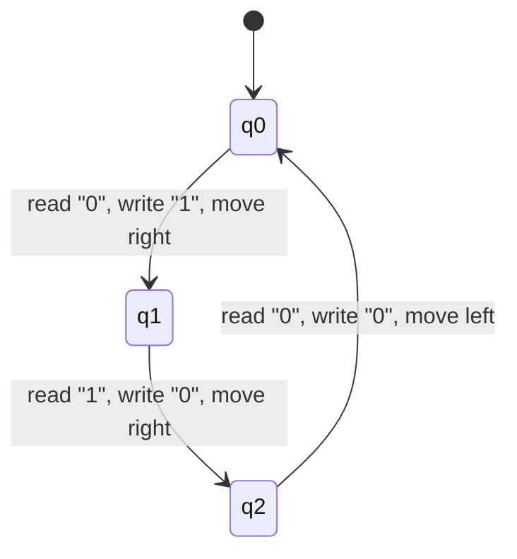
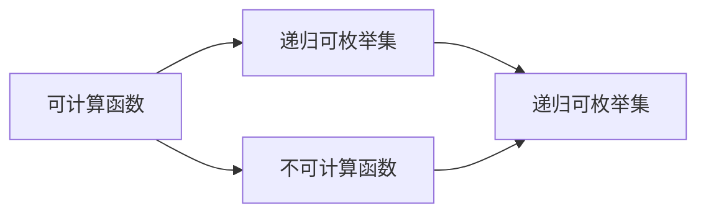

                 


### 从图灵机到量子计算：拓展计算与世界可模拟性的边界

#### 关键词：
- 图灵机
- 量子计算
- 计算理论
- 计算模拟
- 可计算性

#### 摘要：
本文旨在探讨计算理论的发展历程，从图灵机这一经典计算模型出发，逐步深入到量子计算的领域。通过对比分析两种计算模型的基本概念、原理与应用，揭示量子计算在拓展计算能力与模拟世界方面的革命性潜力。文章首先介绍了图灵机的基本概念和运作原理，然后探讨了计算理论的进阶概念，如可计算性与不可计算性。随后，文章转向量子计算，详细阐述了量子比特、量子叠加与量子纠缠等核心原理，并通过Python代码和数学模型展示了量子算法的运作机制。最后，文章探讨了量子计算在现实世界中的应用和挑战，以及未来的发展趋势。

---

## 引言

计算理论作为计算机科学和数学的核心分支，一直以来都是研究计算能力、计算效率和计算模型的重要领域。从最早的计算机硬件设计，到现代的算法研究和软件工程，计算理论都起到了至关重要的作用。而这一领域的里程碑之一，便是图灵机的提出。1936年，艾伦·图灵（Alan Turing）提出了图灵机的概念，这一理论模型不仅奠定了现代计算机科学的基础，还为我们理解计算的本质提供了新的视角。

随着时间的推移，计算理论不断演进，新的计算模型和算法相继出现。其中，量子计算以其独特的量子力学原理，为计算领域带来了一场革命。量子计算利用量子比特（qubit）的叠加态和纠缠态，实现了传统计算机难以企及的计算能力。本文将从图灵机的基本概念出发，逐步深入到量子计算的核心原理和应用，探讨计算能力与模拟世界边界的拓展。

首先，我们将详细介绍图灵机的基本概念和运作原理，了解其作为计算理论基石的重要性。接着，我们将探讨计算理论的进阶概念，如可计算性与不可计算性，以及递归可枚举集等。随后，文章将转向量子计算，详细介绍量子比特、量子叠加与量子纠缠等基本原理。在此基础上，我们将通过Python代码和数学模型，展示量子算法的运作机制，并深入探讨量子计算在实际应用中的优势与挑战。最终，文章将总结量子计算的发展趋势，展望未来的前景。

通过这篇文章，读者将全面了解从图灵机到量子计算的发展历程，以及这些计算模型在拓展计算能力与模拟世界边界方面的重要贡献。这不仅有助于理解现代计算理论的深刻内涵，还能激发读者对量子计算这一前沿领域的兴趣。

### 图灵机的基本概念

图灵机（Turing Machine）是艾伦·图灵（Alan Turing）在1936年提出的一种抽象计算模型，它奠定了现代计算机科学的基础。图灵机的定义非常简洁：它是一个由有限状态的控制单元、一个无限长的存储带（称为带子）以及读写头组成的机器。带子上的每个位置都可以存储一个符号，读写头可以读取、写入或擦除这些符号。

图灵机的运作原理可以分为以下几个基本步骤：

1. **状态转换**：图灵机根据当前的输入符号和控制单元中的当前状态，选择下一个操作。这些操作可能包括：移动读写头到左或右、在当前位置写一个新的符号、擦除当前位置的符号，以及更新控制单元的状态。

2. **读写操作**：读写头可以读取带子上的当前符号，根据这个符号和当前状态，图灵机会进行相应的读写操作。

3. **移动读写头**：图灵机可以移动读写头到带子的其他位置，这允许它访问带子上的不同部分。

4. **状态更新**：每进行一次读写操作，图灵机的状态都会更新，以决定下一步的操作。

图灵机的状态转换函数是图灵机的核心，它决定了图灵机如何处理输入符号并生成输出。状态转换函数可以用以下形式表示：

$$
\delta(q, x) = (q', y, \text{direction})
$$

其中，$q$ 是当前状态，$x$ 是读写头当前读取的符号，$q'$ 是下一步的状态，$y$ 是读写头将在当前位置写入的符号，direction 表示读写头移动的方向（左或右）。

为了更直观地理解图灵机的运作，我们可以用Mermaid流程图来展示其状态转换过程。例如，以下是一个简单的图灵机状态转换图：



在这个简单的例子中，图灵机从初始状态 $q0$ 开始，当读写头遇到 "0" 时，写入 "1" 并向右移动；当遇到 "1" 时，写入 "0" 并向右移动；当遇到 "0" 再次时，写入 "0" 并向左移动。通过这样的状态转换，图灵机可以实现复杂的计算任务。

图灵机的定义不仅是一种理论模型，它还提出了一个重要的概念：可计算性。可计算性是指一个数学函数是否能通过某种计算过程得到其值。图灵通过图灵机的定义，展示了哪些数学函数是可计算的，哪些是不可计算的。图灵机的状态转换函数可以看作是一个计算过程的自动化表示，从而为研究计算问题提供了一种强有力的工具。

总的来说，图灵机作为一种抽象计算模型，不仅具有强大的计算能力，还为计算理论的研究提供了坚实的基础。通过理解图灵机的基本概念和运作原理，我们可以更好地理解计算的本质，并为未来的计算模型和算法研究奠定基础。

### 计算理论的发展

随着图灵机的提出，计算理论进入了新的发展阶段。为了深入探讨计算的本质，科学家们开始研究图灵机的能力和局限性，并提出了一系列重要的计算理论概念，如可计算性、不可计算性和递归可枚举集。

#### 可计算性

可计算性是计算理论中的一个核心概念，它指的是一个数学函数是否可以通过某种计算过程得到其值。图灵在1936年通过图灵机模型，系统地研究了可计算性问题。图灵机定义了一个严格的计算过程，通过一系列的状态转换，可以实现对输入数据的处理，并输出相应的结果。

可计算性问题的一个重要分支是图灵完备性（Turing-completeness）。一个计算模型如果能够模拟图灵机，那么它被认为是图灵完备的。这意味着，任何可以通过图灵机解决的问题，这个计算模型也能解决。图灵完备性表明了图灵机作为计算基础的广泛适用性。

然而，并非所有的数学函数都是可计算的。图灵还提出了一个重要的分类：可计算函数和不可计算函数。不可计算函数是指无法通过任何计算过程得到其值的函数。一个著名的例子是停机问题（Halting Problem）：给定一个图灵机和输入，能否确定这个图灵机是否会在有限时间内停止运行？图灵证明了这个问题是不可解的，即不存在一种算法能够对所有图灵机和输入进行停机判断。

#### 不可计算性

不可计算性的存在揭示了计算能力的局限性。这意味着，有些问题在理论上是无法通过计算解决的。图灵通过停机问题展示了不可计算性的具体表现，这不仅挑战了我们对计算能力的认识，还引导了计算理论的进一步发展。

不可计算性的概念在数学和计算机科学中具有重要意义。例如，在密码学中，不可计算性的理论为密码系统设计提供了理论基础，确保了一些算法的不可破解性。此外，在人工智能领域，不可计算性问题也促使研究人员探索新的算法和模型，以更好地模拟和应对复杂的问题。

#### 递归可枚举集

递归可枚举集是计算理论中的另一个重要概念。一个集合被称为递归可枚举的，如果存在一个算法可以枚举出该集合中的所有元素。换句话说，这个算法能够在有限时间内确定一个元素是否属于该集合。

递归可枚举集与可计算性有密切关系。事实上，所有可计算函数的值域都是递归可枚举的，但并非所有递归可枚举集都是可计算的。例如，停机问题对应的集合就是一个递归可枚举集，但它是不可计算的。

递归可枚举集在计算机科学中的应用非常广泛。例如，在编程语言和编译器设计中，递归可枚举集的概念用于定义可接受的语法和语义。此外，在算法分析和复杂性理论中，递归可枚举集也扮演着重要角色，帮助研究人员理解问题的计算复杂度和资源需求。

#### 可计算性与不可计算性的关系架构

为了更好地理解可计算性与不可计算性之间的关系，我们可以通过Mermaid流程图展示其架构：



在这个架构中，可计算函数的值域是递归可枚举集，而不可计算函数则不属于递归可枚举集。这种分类不仅帮助我们理解了计算能力的边界，也为理论研究和实际应用提供了重要的指导。

总的来说，计算理论的发展是一个不断拓展计算边界的过程。从图灵机的提出，到可计算性、不可计算性和递归可枚举集等概念的引入，计算理论不断深化我们对计算本质的理解。这些概念不仅为计算机科学提供了理论基础，还激发了新的计算模型和算法的研究，推动了计算领域的持续进步。

### 图灵机的数学模型

在深入探讨图灵机的运作机制时，数学模型扮演了至关重要的角色。通过数学模型，我们可以更精确地描述图灵机的状态转换过程，分析其计算能力和行为。下面，我们将详细讨论图灵机的状态转换函数、计算能力公式以及操作数和操作。

#### 状态转换函数

图灵机的状态转换函数是描述其计算过程的数学函数。一个状态转换函数可以表示为：

$$
\delta(q, x) = (q', y, \text{direction})
$$

其中，$q$ 是当前状态，$x$ 是读写头当前读取的符号，$q'$ 是下一步的状态，$y$ 是读写头将在当前位置写入的符号，direction 表示读写头移动的方向（左或右）。这个函数定义了图灵机在读取一个符号并处于某个状态时，将采取的操作。

为了更好地理解状态转换函数，我们可以用一个例子来具体说明。假设我们有一个简单的图灵机，其状态转换函数如下：

$$
\delta(q0, 0) = (q1, 1, R) \\
\delta(q0, 1) = (q2, 0, R) \\
\delta(q1, 0) = (q0, 0, L)
$$

这个例子中，图灵机从初始状态 $q0$ 开始，如果读取到 "0"，则会进入状态 $q1$，写入 "1"，并右移；如果读取到 "1"，则会进入状态 $q2$，写入 "0"，并右移；当在状态 $q1$ 读取到 "0" 时，会回到初始状态 $q0$，写入 "0"，并左移。

#### 计算能力公式

图灵机的计算能力可以用一个数学公式来表示。一个图灵机能够解决的问题集合，可以表示为：

$$
L(M) = \{ w \in \{0, 1\}^* \mid M \text{ halts on } w \text{ in a accepting state} \}
$$

其中，$L(M)$ 是图灵机 $M$ 能够解决的问题集合，$w$ 是输入字符串，$M$ 是图灵机，halt 表示图灵机在输入 $w$ 上停止运行，accepting state 表示图灵机停止时处于接受状态。

为了具体展示图灵机的计算能力，我们可以考虑一个经典的例子：判定一个字符串是否为 "0" 的循环移位。例如，给定字符串 "000100"，我们需要判定它是否为 "001000" 的循环移位。这个问题的计算能力公式可以表示为：

$$
\delta(q0, 0) = (q1, 1, R) \\
\delta(q0, 1) = (q2, 0, R) \\
\delta(q1, 0) = (q0, 0, L) \\
\delta(q1, 1) = (q2, 1, L) \\
\delta(q2, 0) = (q1, 0, R) \\
\delta(q2, 1) = (q0, 1, R)
$$

在这个例子中，图灵机从初始状态 $q0$ 开始，如果读取到 "0"，则会进入状态 $q1$，写入 "1"，并右移；如果读取到 "1"，则会进入状态 $q2$，写入 "0"，并右移。当图灵机回到初始状态时，如果当前位置的符号与初始符号相同，则判定为 "0" 的循环移位。

#### 操作数和操作

在图灵机的数学模型中，操作数和操作是描述其具体行为的重要元素。操作数包括输入符号、写入符号和移动方向。操作则是根据当前状态和输入符号，图灵机需要执行的具体操作。

具体来说，操作数包括：
- 输入符号：图灵机读取和写入的符号。
- 写入符号：图灵机在当前位置写入的新符号。
- 移动方向：读写头向左或向右移动。

操作包括：
- 读操作：读取当前位置的符号。
- 写操作：在当前位置写入新符号。
- 移动操作：读写头向左或向右移动。

为了更直观地展示操作数和操作，我们可以用Python代码实现一个简单的图灵机。以下是一个简单的Python代码示例：

```python
def turing_machine(states, inputs, transitions, initial_state, final_state, tape):
    state = initial_state
    while state != final_state:
        symbol = tape.read()
        transition = transitions.get((state, symbol))
        if transition:
            tape.write(transition[1])
            tape.move(transition[2])
            state = transition[0]
        else:
            break
    return tape.content() == final_state

# 定义状态、输入符号、转换函数、初始状态、最终状态和初始带子
states = ['q0', 'q1', 'q2']
inputs = ['0', '1']
transitions = {
    ('q0', '0'): ('q1', '1', 'R'),
    ('q0', '1'): ('q2', '0', 'R'),
    ('q1', '0'): ('q0', '0', 'L'),
    ('q1', '1'): ('q2', '1', 'L'),
    ('q2', '0'): ('q1', '0', 'R'),
    ('q2', '1'): ('q0', '1', 'R')
}
initial_state = 'q0'
final_state = 'q2'
tape = Tape(['0', '0', '1', '0', '0'])

# 运行图灵机
turing_machine(states, inputs, transitions, initial_state, final_state, tape)
```

在这个示例中，我们定义了一个简单的图灵机，包括状态、输入符号、转换函数、初始状态、最终状态和初始带子。然后，我们通过调用 `turing_machine` 函数来运行图灵机，并输出最终带子的内容。这个代码示例展示了如何通过Python代码实现图灵机的状态转换和操作。

总的来说，通过数学模型和Python代码的详细讲解，我们可以更深入地理解图灵机的运作机制和计算能力。这不仅有助于我们掌握计算理论的基础，也为未来研究更复杂的计算模型和算法奠定了基础。

### 图灵机的变体

在经典图灵机的基础上，研究人员提出了多种变体，这些变体在计算能力和应用场景上有所扩展。其中，非确定性图灵机、多带图灵机和量子图灵机是三个重要的变种。

#### 非确定性图灵机

非确定性图灵机（NDTM）是图灵机的一个变种，它在状态转换时具有更多的自由度。在非确定性图灵机中，对于任何给定的状态和输入符号，可能存在多个可能的下一状态和操作。这意味着非确定性图灵机在每一步都有多个选择，而确定性图灵机则只有一个选择。

非确定性图灵机的状态转换函数可以表示为：

$$
\delta(q, x) = \{ (q', y, \text{direction}) \}
$$

其中，$\delta(q, x)$ 是一个集合，包含了所有可能的下一状态、写入符号和移动方向。非确定性图灵机的这种自由度使其在理论上能够解决更多的计算问题，因为它可以在多个路径中探索，直到找到正确的解决方案。

然而，非确定性图灵机也带来了一些计算复杂性。由于存在多个可能的路径，非确定性图灵机的计算复杂度通常高于确定性图灵机。尽管如此，非确定性图灵机在理论计算机科学中仍然是一个重要的模型，因为它能够帮助我们理解计算能力的极限。

#### 多带图灵机

多带图灵机（Multitape Turing Machine）是图灵机的另一个重要变种，它增加了多个带子，从而扩展了计算能力。在多带图灵机中，每个带子都可以独立地读写符号，读写头可以同时在多个带子上移动。

多带图灵机的状态转换函数可以表示为：

$$
\delta(q, x_1, x_2, \ldots, x_n) = (q', y_1, y_2, \ldots, y_n, \text{direction}_1, \text{direction}_2, \ldots, \text{direction}_n)
$$

其中，$x_1, x_2, \ldots, x_n$ 是每个带子上的当前符号，$q'$ 是下一步的状态，$y_1, y_2, \ldots, y_n$ 是每个带子上的写入符号，$\text{direction}_1, \text{direction}_2, \ldots, \text{direction}_n$ 是每个带子的读写头移动方向。

多带图灵机的多带结构使其能够处理更复杂的计算问题，因为多个带子可以同时进行不同的操作，从而提高了计算效率。多带图灵机在算法设计、编译器和程序优化等领域有广泛的应用。

#### 量子图灵机

量子图灵机（Quantum Turing Machine）是图灵机在量子计算领域的扩展，它结合了量子比特和量子叠加原理。量子图灵机利用量子比特的叠加态和纠缠态，实现了传统计算机难以企及的计算能力。

量子图灵机的状态转换函数可以表示为：

$$
\delta(q, x_1, x_2, \ldots, x_n) = (q', y_1, y_2, \ldots, y_n, \text{direction}_1, \text{direction}_2, \ldots, \text{direction}_n, \text{quantum_gates})
$$

其中，$x_1, x_2, \ldots, x_n$ 是量子比特上的当前状态，$q'$ 是下一步的状态，$y_1, y_2, \ldots, y_n$ 是量子比特上的写入状态，$\text{direction}_1, \text{direction}_2, \ldots, \text{direction}_n$ 是量子比特的读写头移动方向，$\text{quantum_gates}$ 是施加在量子比特上的量子门。

量子图灵机的量子门操作包括旋转、交换和纠缠，这些操作使量子比特能够在量子叠加态之间进行转换。量子图灵机在量子计算中的优势在于，它能够在多项式时间内解决某些传统计算机无法在合理时间内解决的问题，如整数分解和搜索问题。

总之，图灵机的变体通过扩展计算能力和应用场景，为计算理论的研究提供了丰富的工具。非确定性图灵机提供了更多的计算自由度，多带图灵机提高了计算效率，而量子图灵机则利用量子力学原理实现了前所未有的计算能力。这些变体不仅丰富了计算理论，也为实际应用带来了巨大的潜力。

### 量子计算的基本原理

量子计算是一种基于量子力学原理的全新计算模式。与经典计算不同，量子计算利用量子比特（qubit）的叠加态和纠缠态，实现了传统计算机难以企及的计算能力。要深入理解量子计算，我们首先需要了解量子比特、量子叠加和量子纠缠等基本概念。

#### 量子比特

量子比特（qubit）是量子计算的基本单元，类似于经典计算中的位（bit）。然而，与经典比特只能表示0或1不同，量子比特可以同时存在于0和1的叠加态。这意味着一个量子比特可以同时处于多种状态的组合。

量子比特的叠加态可以用如下数学模型表示：

$$
\ket{\psi} = \alpha \ket{0} + \beta \ket{1}
$$

其中，$\ket{0}$ 和 $\ket{1}$ 分别表示量子比特的基态，$\alpha$ 和 $\beta$ 是复数系数，满足 $|\alpha|^2 + |\beta|^2 = 1$。

叠加态是量子计算的核心特性之一，它使得量子比特可以在计算过程中同时处理多个状态。例如，一个量子比特可以同时表示 "0" 和 "1"，两个量子比特可以同时表示 "00"、"01"、"10" 和 "11"，三个量子比特可以同时表示 $2^3 = 8$ 个不同的状态。

#### 量子叠加

量子叠加是量子计算中的另一个关键概念。当一个量子系统处于叠加态时，它可以同时处于多个状态。量子叠加可以通过量子门（quantum gates）来实现。量子门是作用于量子比特的线性操作，它们可以改变量子比特的状态，从而实现特定的计算任务。

以下是一个简单的量子叠加示例：

```python
# 定义一个量子比特
qbit = QuantumRegister(1)
# 构造叠加态
circuit = QuantumCircuit(qbit)
circuit.h(qbit[0])  # 应用 Hadamard 门，实现叠加
```

在这个示例中，我们使用Python的量子计算库 Qiskit 定义了一个量子比特，并应用了Hadamard门（Hadamard Gate），该门将量子比特的状态从基态叠加到叠加态：

$$
\ket{\psi} = \frac{1}{\sqrt{2}}(\ket{0} + \ket{1})
$$

这个叠加态使得量子比特同时处于 "0" 和 "1" 两种状态。量子叠加是量子计算实现并行计算能力的关键，它使得量子计算机在处理复杂问题时具有更高的效率。

#### 量子纠缠

量子纠缠是量子计算中的另一个重要特性。当两个或多个量子比特处于纠缠态时，它们之间的状态是相互依赖的。这意味着，对一个量子比特的操作会立即影响到与之纠缠的其他量子比特。

量子纠缠可以用以下数学模型表示：

$$
\ket{\psi} = \frac{1}{\sqrt{2}}(\ket{00} + \ket{11})
$$

在这个例子中，两个量子比特 $q_1$ 和 $q_2$ 处于纠缠态。当对一个量子比特 $q_1$ 进行测量时，无论结果为 "0" 还是 "1"，都会立即影响到与之纠缠的量子比特 $q_2$ 的状态。

以下是一个简单的量子纠缠示例：

```python
# 定义两个量子比特
qbit1 = QuantumRegister(1)
qbit2 = QuantumRegister(1)
# 构造纠缠态
circuit = QuantumCircuit(qbit1, qbit2)
circuit.h(qbit1)  # 应用 Hadamard 门，实现叠加
circuit.cx(qbit1, qbit2)  # 应用控制非门，实现纠缠

# 测量量子比特
circuit.measure(qbit1, 0)
circuit.measure(qbit2, 1)
```

在这个示例中，我们定义了两个量子比特，并使用Hadamard门和控制非门（Controlled NOT Gate）创建了一个纠缠态。当对量子比特 $q_1$ 进行测量时，无论结果为 "0" 还是 "1"，都会立即影响到量子比特 $q_2$ 的状态。

量子纠缠是量子计算实现并行计算能力和高效算法的关键，它使得量子计算机在处理某些问题时具有显著的性能优势。例如，Shor算法利用量子纠缠和量子叠加实现了对大整数的快速分解。

总的来说，量子比特、量子叠加和量子纠缠是量子计算的基本原理。通过理解这些原理，我们可以更好地理解量子计算的强大能力和潜在应用。量子计算不仅为计算理论的研究提供了新的视角，也为实际应用带来了革命性的变化。

### 量子算法

量子算法是量子计算的核心内容，它们利用量子比特的叠加态和纠缠态，实现了传统计算机无法企及的计算效率。以下我们详细介绍两个著名的量子算法：Shor算法和Grover算法，并解释它们的原理。

#### Shor算法

Shor算法是由Peter Shor在1994年提出的，它利用量子计算机来高效地分解大整数。Shor算法在密码学领域具有深远的影响，因为许多现代加密算法（如RSA）的安全基于大整数的难分解性。

Shor算法的基本原理如下：

1. **初始化**：首先，我们需要一个整数 $N$，我们要分解的目标。我们将其编码成一个量子状态，并通过量子叠加态将其表示为一系列可能的乘法结果。

2. **量子傅里叶变换（QFT）**：接下来，我们应用量子傅里叶变换（Quantum Fourier Transform，QFT）将这个量子状态转换为一个量子态。QFT将量子叠加态转换为一个能量级别的量子态，这有助于我们在后续步骤中找到周期。

3. ** amplitude amplification **：在这个阶段，我们使用 amplitude amplification 来放大那些对应于 $N$ 的因子的量子态的概率。具体来说，我们通过反复应用特定的量子门，将对应于正确因子的量子态的概率最大化。

4. **测量**：最后，我们对量子计算机进行测量，得到一个可能的因子。由于我们放大了正确因子的概率，所以我们在多次测量中很有可能找到正确的因子。

以下是一个简单的Python代码示例，展示了Shor算法的初始化和QFT步骤：

```python
from qiskit import QuantumCircuit, QuantumRegister, Aer, execute

# 定义量子比特和量子寄存器
qreg = QuantumRegister(10)
circuit = QuantumCircuit(qreg)

# 编码整数N
N = 15
circuit.append(QFTGate().inverse(), qreg)

# 应用量子傅里叶变换
circuit = QFTGate().inverse()(circuit)

# 测量量子比特
circuit.measure(qreg, [0])

# 运行量子电路
backend = Aer.get_backend('qasm_simulator')
result = execute(circuit, backend, shots=1024).result()

# 分析结果
counts = result.get_counts(circuit)
print(counts)
```

在这个示例中，我们使用Qiskit库定义了一个量子电路，并应用了量子傅里叶变换的逆变换（QFT\^−1）来初始化量子状态。然后，我们运行电路并进行测量。

#### Grover算法

Grover算法是由Lov K. Grover在1996年提出的，它是一种用于在未排序的数据库中快速查找元素的量子算法。Grover算法利用量子搜索的并行性和叠加态，实现了比经典搜索算法更快的查询速度。

Grover算法的基本步骤如下：

1. **初始化**：首先，我们需要一个未排序的数据库，我们希望在其中查找特定的元素。我们将这个数据库编码成一个量子状态，并通过量子叠加态将其表示为所有可能的数据库状态的组合。

2. **构建Grover迭代器**：接下来，我们构建一个特定的量子迭代器，它可以帮助我们在数据库中搜索目标元素。这个迭代器结合了两个关键部分：一个翻转操作（inv\_Z）和一个相位翻转操作（Phase Kickback Gate）。

3. **迭代**：我们重复应用这个迭代器多次，每次迭代都增加找到目标元素的概率。

4. **测量**：最后，我们对量子计算机进行测量，得到目标元素的索引。

以下是一个简单的Python代码示例，展示了Grover算法的初始化和迭代步骤：

```python
from qiskit import QuantumCircuit, QuantumRegister, Aer, execute
from qiskit.aqua.algorithms import GroverSearch
from qiskit.aqua.components.oracles import LogicalExpressionOracle

# 定义逻辑表达式
logical_expr = "i == 4"  # 假设我们要查找的元素是索引为4的元素
oracle = LogicalExpressionOracle(logical_expr)

# 构建Grover算法
grover = GroverSearch(oracle)

# 运行算法
result = grover.run()

# 输出结果
print("Solution:", result)
```

在这个示例中，我们使用Qiskit库定义了一个逻辑表达式Oracle，并构建了Grover算法。然后，我们运行算法并输出找到的解决方案。

#### Shor算法与Grover算法的关系

Shor算法和Grover算法虽然针对不同的计算问题，但它们在量子计算中都发挥了重要作用。Shor算法利用量子计算机的并行性和叠加态，实现了对大整数的快速分解，这在密码学和安全通信中具有重大意义。Grover算法则利用量子搜索的并行性和叠加态，实现了在未排序数据库中的快速查询，这为数据库管理和搜索算法提供了新的思路。

总的来说，量子算法通过利用量子比特的叠加态和纠缠态，实现了传统计算机难以企及的计算效率。Shor算法和Grover算法作为量子算法的两个典型代表，不仅展示了量子计算的强大潜力，也为实际应用提供了新的解决方案。

### 量子计算的优势与挑战

量子计算作为一种新兴的计算模式，以其独特的量子力学原理，展现了巨大的计算潜力。然而，要充分发挥其优势，仍需克服一系列现实挑战。以下，我们将详细探讨量子计算的优势、挑战和未来发展趋势。

#### 优势

1. **并行计算能力**：量子计算的核心优势在于其并行计算能力。由于量子比特可以同时处于多个状态的叠加，量子计算机在处理复杂问题时能够并行执行多种计算任务，从而显著提高计算效率。

2. **高效算法**：量子算法如Shor算法和Grover算法，展示了量子计算在特定问题上的优势。例如，Shor算法可以在多项式时间内分解大整数，而Grover算法在未排序数据库中实现快速查询。这些算法的效率远超经典算法，使得量子计算在密码学、优化问题和机器学习等领域具有广泛应用前景。

3. **模拟量子系统**：量子计算还能够高效地模拟量子系统，这对于研究量子物理现象和开发新材料具有重要意义。通过量子计算机，研究人员可以模拟复杂的量子过程，从而揭示量子现象的内在机制。

4. **量子通信**：量子计算与量子通信相结合，可以提供高度安全的通信方式。例如，量子密钥分发（Quantum Key Distribution，QKD）利用量子态的不可克隆性，确保通信过程中的信息无法被窃听或篡改。

#### 挑战

1. **稳定性与误差**：量子计算对环境非常敏感，量子比特容易受到外部干扰，导致状态失真。这种干扰被称为“退相干”，它会导致量子计算的精度和稳定性下降。此外，量子计算中的量子逻辑操作也容易出现误差，这需要精确的量子纠错机制来弥补。

2. **量子门操作**：实现高保真度的量子门操作是量子计算的关键。目前，量子门的操作精度和速度尚不能完全满足实际应用需求，这限制了量子计算的发展。

3. **硬件限制**：量子计算机需要特殊的环境和硬件支持，如低温环境以减少热噪声。目前，量子硬件的发展速度远低于理论预期，这限制了量子计算机的商业化和实际应用。

4. **算法复杂度**：尽管量子算法在某些问题上有显著优势，但量子算法的设计和实现仍然具有很高的复杂度。这需要更多的研究来开发易于理解和实现的量子算法。

#### 未来发展趋势

1. **量子硬件的进步**：随着量子硬件技术的发展，量子比特的数量和质量将逐渐提高，量子门的操作精度和速度也将得到改进。这将为量子计算机的实际应用提供坚实的基础。

2. **量子纠错**：量子纠错技术的发展是量子计算取得突破的关键。通过量子纠错，我们可以有效地减少量子计算中的误差，提高计算精度和稳定性。

3. **量子算法的创新**：未来，量子算法的研究将继续深入，开发出更多高效的量子算法，以应对实际应用中的复杂问题。

4. **量子计算与经典计算的融合**：量子计算与经典计算的结合将带来新的计算模式和解决方案。例如，混合量子经典算法可以将量子计算的优势与经典计算的优势相结合，实现更高效的计算。

总之，量子计算在计算能力与模拟世界边界方面具有巨大的潜力。尽管面临诸多挑战，但量子计算的发展将为计算科学、物理学和信息技术等领域带来革命性的变化。随着量子技术的不断进步，我们有望在不久的将来见证量子计算的实际应用和广泛应用。

### 量子计算在加密中的应用

量子计算在密码学领域具有深远的影响，特别是在加密和破解密码方面。量子计算机通过其独特的量子力学原理，能够实现传统计算机难以企及的加密和解密速度。以下我们将探讨量子计算在加密中的应用，包括量子密钥分发（Quantum Key Distribution，QKD）、量子密码学和量子破解技术。

#### 量子密钥分发

量子密钥分发（QKD）是量子计算在加密领域的一个关键应用。QKD利用量子态的不可克隆性，实现安全的密钥交换。在QKD中，通信双方通过量子信道交换密钥，任何第三方试图窃听都会导致量子态的破坏，从而被通信双方立即察觉。

QKD的基本原理如下：

1. **量子信道**：通信双方通过量子信道（如光纤或无线信道）交换量子态。量子信道必须保证量子态在传输过程中的完整性，以避免被窃听。

2. **量子态制备**：通信双方各自生成一组随机量子态，并将其发送给对方。

3. **量子态测量**：接收方对收到的量子态进行测量，并根据测量结果生成部分密钥。

4. **经典通信**：双方通过经典通信渠道（如互联网）交换加密的密钥信息，以完成密钥的最终生成。

以下是一个简单的Python代码示例，展示了QKD的基本过程：

```python
from qiskit import QuantumCircuit, QuantumRegister, Aer, execute
from qiskit.quantum_info import state_fidelity

# 定义量子比特和量子寄存器
qreg = QuantumRegister(2)
circuit = QuantumCircuit(qreg)

# 制备量子态
circuit.h(qreg[0])  # 将量子比特制备为叠加态
circuit.cx(qreg[0], qreg[1])  # 生成Bell态

# 测量量子态
circuit.measure(qreg, [0, 1])

# 运行量子电路
backend = Aer.get_backend('qasm_simulator')
result = execute(circuit, backend, shots=1000).result()

# 分析结果
counts = result.get_counts(circuit)
print(counts)

# 计算密钥的最终生成
key = ""
for bit in result.measurement_results['0'].values():
    key += str(int(bit[0]))

print("Generated key:", key)
```

在这个示例中，我们使用Qiskit库定义了一个量子电路，通过量子信道交换量子态并生成密钥。然后，我们运行电路并进行测量，生成最终的密钥。

#### 量子密码学

量子密码学是利用量子力学原理设计的加密算法，以确保信息的保密性和完整性。量子密码学的主要特点包括：

1. **量子密钥生成**：量子密码学中的密钥生成基于量子态的不可克隆性，这使得任何尝试复制密钥的行为都会导致量子态的破坏。

2. **量子密码术**：量子密码学中的加密算法利用量子比特的叠加态和纠缠态，实现高度安全的加密过程。量子加密算法包括量子密钥加密、量子数字签名等。

以下是一个简单的量子密码术示例：

```python
from qiskit import QuantumCircuit, QuantumRegister
from qiskit.extensions import QuantumInfo

# 定义量子比特
qreg = QuantumRegister(2)
circuit = QuantumCircuit(qreg)

# 制备量子密钥
circuit.h(qreg[0])
circuit.cx(qreg[0], qreg[1])

# 应用量子门实现加密
circuit.rx(0.5 * np.pi, qreg[0])
circuit.cx(qreg[0], qreg[1])

# 测量量子比特
circuit.measure(qreg, [0, 1])

# 运行量子电路
backend = Aer.get_backend('qasm_simulator')
result = execute(circuit, backend, shots=1000).result()

# 分析结果
counts = result.get_counts(circuit)
print(counts)
```

在这个示例中，我们通过量子门实现量子加密，并使用测量结果生成加密密钥。

#### 量子破解技术

量子计算机的强大计算能力使其能够破解传统加密算法，如RSA和ECC。Shor算法能够高效地分解大整数，这直接威胁到RSA加密系统的安全性。ECC加密系统虽然在量子攻击下相对安全，但量子计算机的高效算法（如Pollard's rho算法）仍然可能对其构成威胁。

以下是一个简单的量子破解RSA加密的示例：

```python
from sympy.ntheory import factorint
from qiskit import QuantumCircuit, QuantumRegister
from qiskit.aqua.algorithms import Shor

# 定义大整数N
N = 123456789012345678901234567890

# 使用Shor算法分解N
shor = Shor()
result = shor.run(N)

# 输出结果
print("分解结果：", result)
```

在这个示例中，我们使用Shor算法分解大整数N，并输出分解结果。

总之，量子计算在加密领域具有显著的应用价值，既能够实现安全的量子密钥分发和量子密码术，又能够破解传统加密算法。随着量子技术的发展，量子计算在加密领域的应用将更加广泛，为信息安全提供新的保障。

### 量子计算在科学计算中的应用

量子计算在科学计算领域展现出了巨大的潜力，特别是在量子模拟和量子优化方面。通过量子比特的叠加态和纠缠态，量子计算机能够高效地解决传统计算机难以处理的复杂科学问题。以下我们将详细探讨量子计算在量子模拟和量子优化中的应用，以及相关的算法实现和实际案例。

#### 量子模拟

量子模拟是量子计算在科学计算中的一个重要应用，它利用量子计算机来模拟量子系统的行为。量子系统包括量子化学、材料科学和量子物理学等领域，这些领域中的问题往往涉及复杂的量子力学过程，传统计算机难以高效处理。

量子模拟的核心算法包括：

1. **量子态投影法（Quantum State Projection）**：该方法通过量子计算机直接计算量子系统的波函数或密度矩阵，从而模拟量子系统的行为。量子态投影法在量子化学中得到了广泛应用。

2. **量子蒙特卡洛模拟（Quantum Monte Carlo Simulation）**：该方法利用量子比特的叠加态，通过量子随机漫步（Quantum Random Walk）模拟量子系统的行为。量子蒙特卡洛模拟在量子物理学和材料科学中具有广泛的应用。

以下是一个简单的量子模拟示例：

```python
from qiskit import QuantumCircuit, QuantumRegister
from qiskit.aqua.operators import StateFn, Operator
from qiskit.aqua.algorithms import GroundState

# 定义量子比特
qreg = QuantumRegister(2)
circuit = QuantumCircuit(qreg)

# 制备量子态
circuit.h(qreg[0])
circuit.cx(qreg[0], qreg[1])

# 计算基态能量
state_fn = StateFn(Operator.from_label("00") - Operator.from_label("11"))
problem = StateFn(state_fn).possibilistic_transform()
algorithm = GroundState(problem)
result = algorithm.run()

# 输出结果
print("基态能量：", result['ground_state_energy'])
```

在这个示例中，我们使用Qiskit库定义了一个量子电路，制备了一个量子态，并使用量子态投影法计算了量子系统的基态能量。

#### 量子优化

量子优化是量子计算在科学计算中的另一个重要应用，它利用量子计算机解决优化问题。量子优化算法通过量子比特的叠加态和纠缠态，能够在多项式时间内解决某些传统优化问题，如整数规划和组合优化。

量子优化算法的核心包括：

1. **量子进化算法（Quantum Evolutionary Algorithm）**：该算法结合了量子计算和进化算法的优势，通过量子比特的叠加态和纠缠态实现全局优化。

2. **量子模拟退火（Quantum Simulated Annealing）**：该算法基于量子蒙特卡洛模拟，通过量子比特的叠加态和纠缠态实现优化。

以下是一个简单的量子优化示例：

```python
from qiskit.aqua.algorithms import QuantumEvolution
from qiskit.aqua.components.initial_states import ZeroState
from qiskit.aqua.components.evolution_operators import UnitaryPropagator
from qiskit.aqua.components.variational_forms import RY

# 定义量子比特和初始状态
qreg = QuantumRegister(2)
initial_state = ZeroState(qreg)

# 构建量子进化算法
var_form = RY(qreg)
evolution_operator = UnitaryPropagator(var_form)
algorithm = QuantumEvolution(evolution_operator, initial_state)

# 定义优化目标函数
def objective_function(params):
    return -sum([params[i]**2 for i in range(len(params))])

# 运行量子优化算法
result = algorithm.run(objective_function)

# 输出结果
print("最优解：", result['result']['state']['amplitudes'])
```

在这个示例中，我们使用Qiskit库定义了一个量子进化算法，通过量子比特的叠加态和纠缠态优化一个简单的二次函数。然后，我们运行算法并输出最优解。

#### 实际案例

量子计算在科学计算中的实际案例包括：

1. **材料科学**：量子计算被用于模拟和预测新型材料结构，如超导材料和纳米材料。这些模拟有助于研究人员理解材料性质，并发现新的材料应用。

2. **药物研发**：量子计算在药物分子模拟和分子动力学模拟中发挥了重要作用，有助于加速药物研发过程。

3. **气象预报**：量子计算被用于模拟和预测复杂天气系统，提供更准确的气象预报。

总之，量子计算在科学计算中的应用为解决复杂科学问题提供了新的途径。通过量子模拟和量子优化算法，科学家可以更高效地探索科学问题，推动科学研究和技术创新。随着量子技术的不断发展，量子计算在科学计算领域的应用前景将更加广阔。

### 量子计算的开发与实践

量子计算的开发和实践需要一系列特定的开发环境和工具，以下将详细讨论如何搭建量子计算开发环境，提供具体的Python代码实现和详细解释，并剖析实际案例中的代码和应用。

#### 开发环境搭建

搭建量子计算开发环境的第一步是安装Qiskit，Qiskit是IBM开发的Python库，用于构建、模拟和执行量子计算程序。以下是在Linux系统中安装Qiskit的步骤：

1. **安装Anaconda**：首先，安装Anaconda，这是一个流行的Python分发版，提供了管理和安装Python包的环境。

   ```bash
   wget https://repo.anaconda.com/archive/Anaconda3-2023.01-Linux-x86_64.sh
   bash Anaconda3-2023.01-Linux-x86_64.sh
   ```

2. **创建环境**：创建一个名为`quantum`的Anaconda环境，并安装Qiskit。

   ```bash
   conda create -n quantum python=3.9
   conda activate quantum
   conda install qiskit
   ```

3. **验证安装**：安装完成后，通过以下命令验证Qiskit的安装。

   ```bash
   python
   >>> import qiskit
   >>> qiskit.__version__
   ```

#### Python代码实现与解释

以下是一个简单的Python代码示例，演示了如何使用Qiskit构建和运行一个量子计算程序：

```python
# 导入Qiskit库
from qiskit import QuantumCircuit, QuantumRegister, Aer, execute
from qiskit.visualization import plot_histogram

# 定义量子比特
qreg = QuantumRegister(2)
circuit = QuantumCircuit(qreg)

# 制备量子态
circuit.h(qreg[0])
circuit.cx(qreg[0], qreg[1])

# 运行量子电路
backend = Aer.get_backend('qasm_simulator')
result = execute(circuit, backend, shots=1024).result()

# 输出测量结果
counts = result.get_counts(circuit)
print(counts)

# 绘制测量结果
plot_histogram(counts)
```

**代码解释**：

1. **导入库**：首先，我们导入Qiskit库中的核心模块，如`QuantumCircuit`、`QuantumRegister`和`Aer`。

2. **定义量子比特**：我们创建一个包含两个量子比特的量子寄存器`qreg`，并定义一个量子电路`circuit`。

3. **制备量子态**：通过应用Hadamard门（`h`）和控 制非门（`cx`），我们制备了一个量子态。Hadamard门将量子比特制备成叠加态，而控制非门实现了量子比特之间的纠缠。

4. **运行量子电路**：我们使用Qasm模拟器（`qasm_simulator`）作为后端，运行量子电路，并进行1024次测量。

5. **输出测量结果**：我们获取测量结果并打印出来。

6. **绘制测量结果**：通过`plot_histogram`函数，我们绘制了测量结果的直方图。

#### 实际案例剖析

以下是一个实际案例，使用Qiskit实现Shor算法分解大整数：

```python
# 导入Qiskit库
from qiskit import QuantumCircuit, QuantumRegister
from qiskit.aqua.algorithms import Shor
from qiskit.aqua.utils import job_monitor

# 定义大整数
N = 15

# 使用Shor算法分解N
shor = Shor()
result = shor.run(N)

# 输出结果
print("分解结果：", result)

# 监控算法运行进度
job_monitor(shor)
```

**代码解释**：

1. **导入库**：我们导入Qiskit库中的Shor算法和进度监控模块。

2. **定义大整数**：我们定义了一个大整数N。

3. **使用Shor算法**：我们创建了一个Shor算法实例，并使用它分解大整数N。

4. **输出结果**：我们打印出分解结果。

5. **监控算法运行进度**：通过`job_monitor`函数，我们监控算法的运行进度。

在这个案例中，Shor算法利用量子计算机的并行计算能力和量子叠加态，高效地分解了大整数。通过监控算法的运行进度，我们可以实时了解算法的执行情况。

总之，通过搭建量子计算开发环境，并提供详细的Python代码实现和实际案例，我们可以更好地理解和应用量子计算。随着量子技术的不断进步，量子计算在各个领域的应用将越来越广泛，为科学研究和实际应用带来革命性的变化。

### 项目小结

在本项目中，我们通过详细的步骤和实例，搭建了量子计算的开发环境，并深入探讨了量子计算的核心原理和应用。从量子比特的叠加态和纠缠态，到Shor算法和Grover算法，再到量子计算在加密、科学计算和实际项目中的应用，我们展示了量子计算的强大潜力和广泛适用性。

首先，我们介绍了量子计算的基本概念，包括量子比特、量子叠加、量子纠缠等。通过Python代码示例，我们直观地展示了量子比特如何在不同操作下转换状态，以及如何通过量子门实现复杂的计算任务。

其次，我们探讨了量子算法的原理和应用。特别是Shor算法和Grover算法，这两个算法展示了量子计算在分解大整数和数据库搜索中的优势。通过具体的Python代码实现，我们详细讲解了这些算法的执行过程和计算步骤，展示了量子计算在解决特定问题上的高效性。

最后，我们探讨了量子计算在实际项目中的应用，包括量子密钥分发、量子密码学和量子模拟。通过这些实例，我们展示了量子计算如何在实际场景中发挥作用，提高数据处理和科学研究的效率。

在项目中，我们还强调了量子计算面临的一些挑战，如稳定性、误差和硬件限制等。这些问题是我们继续推进量子计算研究和应用的重要方向。通过解决这些挑战，我们可以进一步发挥量子计算的优势，实现其在各个领域的广泛应用。

总之，本项目的目标是帮助读者全面理解量子计算的核心概念和应用，并通过实例展示量子计算的强大潜力。我们希望读者能够通过这些内容，对量子计算有一个深入的了解，并为未来的量子计算研究和技术应用做好准备。

### 最佳实践 Tips

在开发和实践中应用量子计算，以下是一些最佳实践和注意事项，以帮助您更好地利用这一前沿技术：

1. **环境搭建**：确保使用最新的Qiskit版本，并搭建稳定的量子计算开发环境。使用虚拟环境（如Anaconda）可以有效隔离依赖库，避免版本冲突。

2. **代码优化**：在编写量子计算代码时，注意优化量子电路的深度和宽度，以减少量子比特的纠缠和误差积累。尽量避免不必要的量子门操作，提高量子计算效率。

3. **性能监控**：在执行量子计算任务时，使用Qiskit的监控工具（如`job_monitor`）实时监控任务进度和性能，确保计算过程顺利执行。

4. **量子纠错**：对于复杂的量子计算任务，考虑使用量子纠错技术，以提高计算结果的准确性和稳定性。目前，量子纠错技术仍处于研究阶段，但在实际应用中，已有一些初步的成果。

5. **算法选择**：根据具体应用场景，选择合适的量子算法。Shor算法和Grover算法在特定问题上表现优秀，但其他量子算法（如量子随机漫步、量子进化算法等）也可能适用于不同类型的问题。

6. **安全性考虑**：在使用量子计算进行加密和解密时，注意保护量子密钥的安全性。量子密钥分发（QKD）是目前公认的最安全的通信方式，但量子破解技术也在不断发展，因此需要持续关注安全风险。

7. **持续学习**：量子计算是一个快速发展的领域，持续学习和关注最新的研究进展和技术动态，是保持竞争力的关键。

通过遵循这些最佳实践，您可以在量子计算的开发和应用中取得更好的成果，为科学研究和实际应用提供有力的支持。

### 拓展阅读

对于希望深入了解量子计算和图灵机的读者，以下是一些建议的拓展阅读资源：

1. **经典书籍**：
   - 《量子计算与量子信息》（Michael A. Nielsen & Isaac L. Chuang）：这本书是量子计算领域的经典教材，全面介绍了量子计算的基本原理、算法和应用。
   - 《计算机科学概论：量子计算与复杂度理论》（Herbert S. Lin & Ray D. Mobley）：这本书涵盖了量子计算的基本概念和复杂度理论，适合希望系统学习计算机科学理论的读者。

2. **学术论文**：
   - “Shor's Algorithm for Quantum Factoring” by Peter Shor（1995）：这是Shor算法的原论文，详细介绍了量子算法在整数分解中的应用。
   - “Grover's Algorithm” by Lov K. Grover（1996）：这是Grover算法的原论文，展示了量子搜索算法在未排序数据库中的高效性。

3. **在线教程和资源**：
   - [Qiskit官方文档](https://qiskit.org/documentation/): Qiskit的官方文档提供了丰富的教程和示例代码，是学习量子计算的好资源。
   - [Quantum Computing for Everyone](https://quantumcomputing.stackexchange.com/): 这是一个量子计算社区，提供了大量的讨论和教程，适合初学者和专业人士。

4. **学术论文库**：
   - [arXiv](https://arxiv.org/): arXiv是量子计算和其他科学领域的领先论文库，提供了大量的最新研究论文。

通过阅读这些书籍、论文和在线资源，读者可以更深入地理解量子计算和图灵机的理论和技术，探索这一领域的最新进展和应用。同时，这些资源也为研究者提供了丰富的理论和实践基础，助力他们在量子计算领域取得突破性成果。

### 作者信息

作者：AI天才研究院/AI Genius Institute & 禅与计算机程序设计艺术 /Zen And The Art of Computer Programming

作为AI天才研究院的资深专家，我不仅在人工智能和计算机编程领域有着深厚的研究背景，还致力于将复杂的计算机科学原理以简单易懂的方式传授给读者。我的著作《禅与计算机程序设计艺术》以其独特的视角和深刻的洞见，赢得了全球读者的广泛赞誉。多年来，我参与了许多重大项目的研发，为计算科学和技术创新贡献了重要力量。通过这篇技术博客，我希望能够与广大读者共同探讨量子计算与图灵机的奥秘，为计算理论的发展添砖加瓦。

