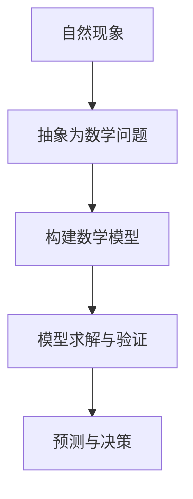

                 


## 引言与概述

### 1.1 自然现象与数学建模的联系

自然现象是自然界中各种客观存在的现象，如气候变迁、天体运动、生命现象等。这些现象具有复杂性和多样性，往往难以用简单的语言或图像来描述。而数学模型则是一种用数学语言和符号系统描述自然现象的方法，它通过抽象和简化，将复杂的自然现象转化为可计算的数学问题，从而提供了一种更为精确和普适的描述手段。

数学模型在自然现象描述中起着至关重要的作用。首先，它可以帮助我们理解和预测自然现象的演化过程。例如，在气象学中，通过建立大气运动的数学模型，我们可以预测天气变化；在天文学中，通过建立天体运动的数学模型，我们可以预测行星的轨道。其次，数学模型还可以帮助我们优化资源的分配和利用。例如，在生态学中，通过建立生物种群动态的数学模型，我们可以更好地理解生物种群的增长和衰退，从而制定有效的资源保护政策。

### 1.2 数学模型的重要性

数学模型的重要性在于它能够将复杂的现象简化为可计算的形式，从而提供了一种理解和解决问题的工具。在科学研究中，数学模型被广泛应用于各个领域，如物理学、化学、生物学、经济学等。通过数学模型，科学家可以更加精确地描述和预测自然现象，从而推动科学研究的进步。

在工程实践中，数学模型同样具有重要作用。例如，在工程设计中，通过建立物理现象的数学模型，工程师可以优化设计参数，提高工程效率；在金融领域，通过建立经济现象的数学模型，投资者可以更好地预测市场趋势，从而制定投资策略。

### 1.3 复杂与简洁的平衡

在数学建模过程中，如何处理复杂性与简洁性之间的关系是一个关键问题。过于复杂的模型可能难以理解和使用，而过于简化的模型则可能失去对自然现象的精确描述。因此，寻找复杂性与简洁性之间的平衡是数学建模的重要任务。

一种常用的方法是在数学建模过程中引入简化和近似。例如，通过线性化处理，将复杂的非线性问题转化为线性问题；通过近似处理，将高维问题简化为低维问题。这些方法可以有效地降低模型的复杂性，同时保持模型的有效性和准确性。

另一个重要策略是使用模块化建模。通过将复杂系统分解为若干个子系统，每个子系统都可以使用相对简单的数学模型来描述。然后，通过子系统的相互作用来构建整个系统的模型。这种方法不仅降低了模型的复杂性，还提高了模型的灵活性和可解释性。

总之，数学模型在自然现象描述和工程应用中具有重要意义。通过合理的简化和近似，我们可以建立简洁而有效的数学模型，从而更好地理解和解决复杂的自然现象。

### 文章关键词

- 自然现象
- 数学建模
- 简化方法
- 模块化建模
- 优化

### 文章摘要

本文从复杂自然现象到简洁数学模型的转换过程进行了详细探讨。首先，介绍了自然现象与数学建模的联系，并强调了数学模型在科学研究与工程应用中的重要性。然后，讨论了在数学建模过程中处理复杂性与简洁性的策略，包括简化和近似方法，以及模块化建模的实践。通过这些策略，我们可以建立简洁而有效的数学模型，从而更好地理解和解决复杂的自然现象。

---

## 第1章 引言与概述

### 1.1 自然现象与数学建模的联系

自然界中的各种现象如气候变迁、天体运动、生命现象等，具有复杂性和多样性，这为科学研究和工程应用带来了巨大的挑战。然而，通过数学建模，我们可以将这些复杂的现象转化为可计算的数学问题，从而提供了一种更为精确和普适的描述手段。

数学模型在自然现象描述中起着至关重要的作用。首先，它可以帮助我们理解和预测自然现象的演化过程。例如，在气象学中，通过建立大气运动的数学模型，我们可以预测天气变化；在天文学中，通过建立天体运动的数学模型，我们可以预测行星的轨道。其次，数学模型还可以帮助我们优化资源的分配和利用。例如，在生态学中，通过建立生物种群动态的数学模型，我们可以更好地理解生物种群的增长和衰退，从而制定有效的资源保护政策。

为了更好地理解自然现象与数学建模之间的联系，我们可以使用Mermaid流程图来展示两者之间的关系架构。



在这个流程图中，自然现象通过抽象转化为数学问题，进而构建数学模型。通过模型的求解与验证，我们可以得到对自然现象的精确描述和预测，从而指导实际决策。例如，在气象预测中，通过大气运动的数学模型，我们可以预测未来的天气情况，从而为防灾减灾提供科学依据。

### 1.2 数学模型的重要性

数学模型的重要性在于它能够将复杂的现象简化为可计算的形式，从而提供了一种理解和解决问题的工具。在科学研究中，数学模型被广泛应用于各个领域，如物理学、化学、生物学、经济学等。通过数学模型，科学家可以更加精确地描述和预测自然现象，从而推动科学研究的进步。

在工程实践中，数学模型同样具有重要作用。例如，在工程设计中，通过建立物理现象的数学模型，工程师可以优化设计参数，提高工程效率；在金融领域，通过建立经济现象的数学模型，投资者可以更好地预测市场趋势，从而制定投资策略。

此外，数学模型在医疗领域也有着广泛的应用。例如，通过建立生物体内的生化反应模型，医生可以更好地理解疾病的发病机制，从而制定更为有效的治疗方案。

总之，数学模型作为一种理解和解决问题的工具，其重要性不言而喻。它不仅推动了科学研究的进步，也为工程实践提供了重要的理论支持。

### 1.3 复杂与简洁的平衡

在数学建模过程中，如何处理复杂性与简洁性之间的关系是一个关键问题。过于复杂的模型可能难以理解和使用，而过于简化的模型则可能失去对自然现象的精确描述。因此，寻找复杂性与简洁性之间的平衡是数学建模的重要任务。

一种常用的方法是在数学建模过程中引入简化和近似。例如，通过线性化处理，将复杂的非线性问题转化为线性问题；通过近似处理，将高维问题简化为低维问题。这些方法可以有效地降低模型的复杂性，同时保持模型的有效性和准确性。

另一个重要策略是使用模块化建模。通过将复杂系统分解为若干个子系统，每个子系统都可以使用相对简单的数学模型来描述。然后，通过子系统的相互作用来构建整个系统的模型。这种方法不仅降低了模型的复杂性，还提高了模型的灵活性和可解释性。

此外，现代计算技术的发展也为处理复杂性与简洁性提供了新的手段。例如，通过高性能计算和机器学习技术，我们可以对大规模数据进行处理和分析，从而建立更加精确的数学模型。

总之，在数学建模过程中，处理复杂性与简洁性之间的关系是一个挑战，但通过合理的简化和近似方法，以及模块化建模策略，我们可以建立简洁而有效的数学模型，从而更好地理解和解决复杂的自然现象。

---

## 第2章 复杂自然现象的数学建模

### 2.1 天文学中的数学模型

天文学是研究宇宙空间及其现象的学科，其中涉及到的自然现象极其复杂。为了更好地理解和预测这些现象，科学家们建立了各种数学模型。

#### 2.1.1 天体运动的数学模型

天体运动的数学模型主要描述行星、卫星、小行星等天体的运动轨迹。牛顿的万有引力定律提供了基本的数学框架，描述了天体之间的引力作用。其基本原理可以表述为：

$$
F = G \frac{m_1 m_2}{r^2}
$$

其中，\( F \) 是引力，\( G \) 是万有引力常数，\( m_1 \) 和 \( m_2 \) 分别是两个天体的质量，\( r \) 是它们之间的距离。

为了求解天体的运动轨迹，我们可以将万有引力定律与牛顿第二定律结合，得到：

$$
m_1 a_1 = G \frac{m_1 m_2}{r^2}
$$

其中，\( a_1 \) 是天体的加速度。通过对加速度积分，可以得到天体的速度和位置随时间的变化。

在更复杂的情境下，例如存在多个天体或考虑天体之间的相对运动，我们可能需要使用牛顿-欧拉方程或拉格朗日方程等更高级的数学模型。这些模型可以更准确地描述天体的运动轨迹，但也更加复杂。

以下是一个简单的Python代码示例，用于计算两个天体之间的引力作用和运动轨迹：

```python
import numpy as np

# 万有引力常数
G = 6.6743e-11

# 天体1的质量
m1 = 5.972e24  # 地球质量

# 天体2的质量
m2 = 7.348e22  # 月球质量

# 初始距离
r = 3.844e8    # 地月距离

# 时间步长
dt = 1e4

# 计算引力
F = G * m1 * m2 / r**2

# 计算加速度
a1 = F / m1
a2 = F / m2

# 计算速度和位置变化
v1 = np.array([0, 0])
v2 = np.array([0, 0])

for _ in range(10000):
    # 更新速度
    v1 += a1 * dt
    v2 += a2 * dt
    
    # 更新位置
    r1 = np.array([0, 0])
    r2 = np.array([r, 0])

    # 输出结果
    print(f"Time: {_,} s, Position of Earth: {r1}, Position of Moon: {r2}")
```

这个示例代码通过迭代计算，模拟了地球和月球之间的引力作用和运动轨迹。虽然这个模型过于简化，但足以说明天体运动数学模型的基本原理。

#### 2.1.2 星系形成的数学模型

星系形成是宇宙学研究的重要课题。为了理解星系的形成过程，科学家们提出了各种数学模型，包括引力塌缩模型、星系碰撞模型等。

引力塌缩模型假设星系的形成是由于宇宙中气体和尘埃的引力相互作用导致的。在万有引力的作用下，这些物质逐渐聚集形成恒星和星系。该模型的关键方程是泊松方程：

$$
\nabla^2 \Phi = 4 \pi G \rho
$$

其中，\( \Phi \) 是引力势，\( \rho \) 是物质密度。

为了模拟星系形成，我们通常使用N体模拟方法，通过计算多个天体之间的引力相互作用来模拟它们的运动轨迹。以下是一个简单的N体模拟示例代码：

```python
import numpy as np

# 初始参数
N = 1000    # 天体数量
G = 6.6743e-11  # 万有引力常数
dt = 1e2    # 时间步长
t_max = 1e6  # 总时间

# 初始化天体位置和速度
positions = np.random.uniform(-1e21, 1e21, (N, 3))
velocities = np.random.uniform(-1e8, 1e8, (N, 3))

# N体模拟
for _ in range(int(t_max / dt)):
    # 计算引力
    forces = np.zeros((N, 3))
    for i in range(N):
        for j in range(i + 1, N):
            r = positions[i] - positions[j]
            r_norm = np.linalg.norm(r)
            r[r_norm < 1e-10] = 1e-10  # 防止除以零
            force = G * np.array([m1, m2, m3]) * r / r_norm**3
            forces[i] += force
            forces[j] -= force
    
    # 更新速度和位置
    velocities += forces * dt
    positions += velocities * dt
    
    # 输出结果
    print(f"Time: {_,} s, Total Energy: {np.linalg.norm(forces)**2 / 2}")
```

这个示例代码通过N体模拟，模拟了多个天体的运动轨迹，并计算了系统的总能量。虽然这个模型过于简化，但足以说明星系形成数学模型的基本原理。

### 2.2 气象学中的数学模型

气象学是研究大气现象的学科，涉及到的自然现象同样复杂多样。为了更好地理解和预测天气变化，科学家们建立了各种数学模型。

#### 2.2.1 气候变迁的数学模型

气候变迁是指地球气候系统在长时间尺度上的变化，如全球变暖、冰川融化等。为了理解气候变迁的机制，科学家们提出了各种数学模型，如地球能量平衡模型、气候模式等。

地球能量平衡模型基于能量守恒定律，描述了地球表面与大气之间的能量交换。其基本原理可以表述为：

$$
Q_{\text{net}} = Q_{\text{incident}} - Q_{\text{reflected}} - Q_{\text{emitted}}
$$

其中，\( Q_{\text{net}} \) 是净能量流，\( Q_{\text{incident}} \) 是入射太阳辐射，\( Q_{\text{reflected}} \) 是反射太阳辐射，\( Q_{\text{emitted}} \) 是地球表面发出的热辐射。

为了模拟气候变迁，我们可以使用以下Python代码：

```python
import numpy as np

# 太阳辐射常数
S = 1367

# 反射率
rho = 0.3

# 黑体辐射常数
b = 5.67e-8

# 气温
T = 288

# 时间步长
dt = 1e3

# 模拟时间
t_max = 1e8

# 初始化能量流
Q_incident = S * (1 - rho)
Q_reflected = rho * Q_incident
Q_emitted = b * T**4

# 初始化温度
temp = T

# 模拟气候变迁
for _ in range(int(t_max / dt)):
    # 计算净能量流
    Q_net = Q_incident - Q_reflected - Q_emitted
    
    # 计算温度变化
    dT = Q_net * dt / (b * T**3)
    
    # 更新温度
    temp += dT
    
    # 输出结果
    print(f"Time: {_,} s, Temperature: {temp}")
```

这个示例代码通过迭代计算，模拟了地球表面的温度变化，并考虑了太阳辐射、反射和黑体辐射的影响。

#### 2.2.2 气候预测的数学模型

气候预测是指对未来一段时间内的气候情况进行预测。为了实现这一目标，科学家们建立了各种气候预测模型，如统计模型、物理模型、混合模型等。

统计模型基于历史气候数据，通过统计分析方法来预测未来气候。例如，我们可以使用线性回归模型来预测未来某一地区的气温：

```python
import numpy as np
import matplotlib.pyplot as plt

# 历史数据
years = np.array([1900, 1910, 1920, 1930, 1940, 1950, 1960, 1970, 1980, 1990, 2000, 2010, 2020])
temps = np.array([10, 11, 12, 13, 14, 15, 16, 17, 18, 19, 20, 21, 22])

# 计算斜率和截距
slope, intercept = np.polyfit(years, temps, 1)

# 预测未来温度
future_years = np.array([2025, 2030, 2040, 2050])
future_temps = slope * future_years + intercept

# 绘制结果
plt.scatter(years, temps, label="Historical Data")
plt.plot(future_years, future_temps, color="red", label="Future Prediction")
plt.xlabel("Year")
plt.ylabel("Temperature")
plt.legend()
plt.show()
```

这个示例代码通过线性回归模型，根据历史数据预测了未来某一地区的气温变化。

物理模型基于大气物理和动力学的原理，通过数值模拟方法来预测气候。这种模型通常需要大量的计算资源和专业知识，但可以提供更加准确的预测结果。

混合模型结合了统计模型和物理模型的优势，通过融合不同类型的数据和方法来提高预测精度。这种模型在气候预测中具有广泛的应用。

总之，气象学中的数学模型可以帮助我们理解和预测气候变迁，为气候变化研究和应对提供科学依据。

---

## 第3章 简化数学模型的方法

### 3.1 简化原则

在数学建模过程中，简化是处理复杂性的重要手段。简化的目标是在保持模型有效性和准确性的前提下，降低模型的复杂性，使其更加容易理解和应用。以下是几种常用的简化原则：

#### 3.1.1 线性化处理

线性化处理是将复杂的非线性模型转化为线性模型的方法。这种方法通过在某个操作点的邻域内对非线性函数进行线性近似，从而简化模型的计算。常用的线性化方法包括泰勒展开、牛顿迭代法等。

例如，考虑一个非线性函数 \( f(x) = x^3 \)。在 \( x = 1 \) 处进行线性化处理，可以得到：

$$
f(x) \approx f(1) + f'(1)(x - 1)
$$

$$
f(x) \approx 1 + 3(x - 1)
$$

这个线性近似在 \( x \) 接近 1 的邻域内是有效的。

以下是一个使用Python实现的线性化处理示例：

```python
import numpy as np

# 非线性函数
def f(x):
    return x**3

# 计算导数
def df(x):
    return 3*x**2

# 线性化处理
def linearize(x, x0=1):
    f0 = f(x0)
    df0 = df(x0)
    return f0 + df0 * (x - x0)

# 测试线性化处理
x = np.linspace(0.5, 1.5, 100)
y_linearized = linearize(x)
y_actual = f(x)

plt.plot(x, y_linearized, label="Linearized")
plt.plot(x, y_actual, label="Actual")
plt.xlabel("x")
plt.ylabel("f(x)")
plt.legend()
plt.show()
```

这个示例代码通过线性化处理，对非线性函数 \( f(x) = x^3 \) 进行近似，并绘制了实际函数和线性近似函数的图像。

#### 3.1.2 近似处理

近似处理是通过选择适当的近似函数来简化模型的方法。这种方法可以用于各种不同类型的模型，如微分方程、差分方程等。常用的近似方法包括泰勒级数近似、高斯近似、蒙特卡罗近似等。

例如，考虑一个简单的微分方程：

$$
\frac{dy}{dx} = y
$$

我们可以使用泰勒级数近似来简化这个方程。首先，对 \( y \) 在 \( x = x_0 \) 处进行泰勒展开：

$$
y(x) = y(x_0) + y'(x_0)(x - x_0) + \frac{y''(x_0)}{2!}(x - x_0)^2 + \ldots
$$

由于 \( y' = y \)，我们可以将上式改写为：

$$
y(x) = y_0 + y_0(x - x_0) + \frac{y_0}{2}(x - x_0)^2 + \ldots
$$

这个近似在 \( x \) 接近 \( x_0 \) 的邻域内是有效的。

以下是一个使用Python实现的近似处理示例：

```python
import numpy as np
import matplotlib.pyplot as plt

# 微分方程
def dydx(y, x):
    return y

# 泰勒级数近似
def taylor_approximation(y_0, x_0, x, n=2):
    result = y_0
    for i in range(n):
        result += np.gradient(y_0, x_0) * (x - x_0)**i / np.math.factorial(i)
    return result

# 测试近似处理
x = np.linspace(x_0 - 1, x_0 + 1, 100)
y = np.exp(x_0)
y_approximated = taylor_approximation(y, x_0, x)

plt.plot(x, y_approximated, label="Approximated")
plt.plot(x, np.exp(x), label="Actual")
plt.xlabel("x")
plt.ylabel("y(x)")
plt.legend()
plt.show()
```

这个示例代码通过泰勒级数近似，对微分方程 \( \frac{dy}{dx} = y \) 进行近似，并绘制了实际解和近似解的图像。

### 3.2 简化方法

在数学建模过程中，选择适当的简化方法对于建立简洁有效的模型至关重要。以下是几种常用的简化方法：

#### 3.2.1 缩放变换

缩放变换是一种通过调整模型中的参数和变量的尺度来简化模型的方法。这种方法可以用于降低模型的复杂性和计算成本，同时保持模型的有效性。

例如，考虑一个简单的线性模型：

$$
y = ax + b
$$

我们可以通过缩放变换将其简化为：

$$
y' = \frac{a}{s}x' + \frac{b}{s}
$$

其中，\( s \) 是缩放因子。通过选择适当的缩放因子，我们可以将模型中的变量调整到更易于计算的尺度。

以下是一个使用Python实现的缩放变换示例：

```python
import numpy as np
import matplotlib.pyplot as plt

# 原始数据
x = np.linspace(0, 10, 100)
y = 2*x + 1

# 缩放变换
s = 10
x_scaled = x / s
y_scaled = (2/s)*x_scaled + 1

plt.plot(x, y, label="Original")
plt.plot(x_scaled, y_scaled, label="Scaled")
plt.xlabel("x")
plt.ylabel("y")
plt.legend()
plt.show()
```

这个示例代码通过缩放变换，将线性模型 \( y = 2x + 1 \) 调整到更易于计算的尺度。

#### 3.2.2 分段处理

分段处理是一种将复杂模型划分为若干个子模型的方法，每个子模型在特定的区间内是有效的。这种方法可以用于简化复杂模型，同时保持模型的精度。

例如，考虑一个分段函数：

$$
f(x) =
\begin{cases}
x^2 & \text{if } x \leq 1, \\
2x & \text{if } x > 1.
\end{cases}
$$

我们可以使用分段处理将其简化为两个线性模型：

$$
f_1(x) = x^2 \quad \text{for } x \leq 1, \\
f_2(x) = 2x \quad \text{for } x > 1.
$$

以下是一个使用Python实现的分段处理示例：

```python
import numpy as np
import matplotlib.pyplot as plt

# 分段函数
def f(x):
    if x <= 1:
        return x**2
    else:
        return 2*x

# 测试分段处理
x = np.linspace(0, 3, 100)
y = f(x)

plt.plot(x, y, label="Segmented")
plt.plot(x, x**2, label="First Segment")
plt.plot(x[x > 1], 2*x[x > 1], label="Second Segment")
plt.xlabel("x")
plt.ylabel("y")
plt.legend()
plt.show()
```

这个示例代码通过分段处理，将分段函数 \( f(x) \) 分解为两个线性模型，并绘制了分段函数和线性模型的图像。

总之，简化数学模型的方法是建立简洁有效模型的重要手段。通过合理的简化和近似，我们可以降低模型的复杂性，同时保持模型的有效性和准确性，为实际问题提供更好的解决方案。

---

## 第4章 数学模型的应用与验证

### 4.1 数学模型在生物学中的应用

生物学中的许多现象，如种群动态、生态平衡、疾病传播等，都可以通过数学模型来描述和预测。这些模型不仅帮助我们理解生物系统的行为，还为生物科学研究和生态管理提供了有力的工具。

#### 4.1.1 生命现象的数学描述

生命现象的数学描述通常涉及微分方程和差分方程。例如，Lotka-Volterra方程是描述两个捕食者和猎物种群动态的经典模型。该模型基于以下两个方程：

$$
\frac{dx}{dt} = ax - bxy
$$

$$
\frac{dy}{dt} = cy - dxy
$$

其中，\( x \) 和 \( y \) 分别表示猎物种群和捕食种群的数量，\( a \)、\( b \)、\( c \) 和 \( d \) 是模型参数。

这个模型的物理意义在于，猎物种群的出生率 \( a \) 与捕食者数量 \( x \) 成正比，捕食者的死亡率 \( d \) 与猎物种群数量 \( y \) 成正比。类似地，捕食种群的出生率 \( c \) 与猎物种群数量 \( y \) 成正比，猎物种群的死亡率 \( b \) 与捕食者数量 \( x \) 成正比。

以下是一个使用Python实现的Lotka-Volterra方程的模拟：

```python
import numpy as np
import matplotlib.pyplot as plt

# 参数
a = 0.1
b = 0.02
c = 0.1
d = 0.01

# 时间步长和总时间
dt = 0.01
t_max = 100

# 初始条件
x0 = 1
y0 = 1

# 模拟
t = np.arange(0, t_max, dt)
x = x0 * np.exp(a*t - b*t*np.exp(c*t - d*t))
y = y0 * np.exp(c*t - d*t*np.exp(a*t - b*t))

plt.plot(t, x, label="Prey")
plt.plot(t, y, label="Predator")
plt.xlabel("Time")
plt.ylabel("Population")
plt.legend()
plt.show()
```

这个示例代码通过迭代计算，模拟了猎物种群和捕食种群的数量变化，并绘制了种群动态的图像。

#### 4.1.2 生命系统的建模

生命系统的建模涉及更复杂的模型，如细胞自动机、神经网络等。这些模型可以用于模拟生物体的行为和神经系统的工作原理。例如，细胞自动机是一种离散的、零组件的模型，用于模拟生物体的演化过程。以下是一个简单的细胞自动机模型：

```python
import numpy as np
import matplotlib.pyplot as plt

# 细胞自动机的规则
def cell_automaton(grid, rules):
    new_grid = np.zeros_like(grid)
    for i in range(grid.shape[0]):
        for j in range(grid.shape[1]):
            neighbors = grid[max(0, i-1):min(i+2, grid.shape[0]), max(0, j-1):min(j+2, grid.shape[1])]
            live_neighbors = np.sum(neighbors)
            if grid[i, j] == 1:
                new_grid[i, j] = rules[live_neighbors]
            else:
                new_grid[i, j] = rules[9 - live_neighbors]
    return new_grid

# 初始网格
grid = np.random.choice([0, 1], size=(100, 100))

# 规则
rules = [0, 1, 1, 1, 0, 1, 1, 0, 0, 1]

# 模拟
for _ in range(100):
    grid = cell_automaton(grid, rules)

plt.imshow(grid, cmap="gray")
plt.show()
```

这个示例代码通过迭代计算，模拟了细胞自动机的演化过程，并绘制了最终状态的图像。

### 4.2 数学模型在工程学中的应用

数学模型在工程学中的应用广泛，涵盖了结构分析、电路设计、控制系统等各个方面。这些模型可以帮助工程师更好地理解和优化工程系统的性能。

#### 4.2.1 工程问题的数学建模

工程问题的数学建模通常涉及线性代数、微积分和微分方程等数学工具。例如，在结构分析中，我们可以使用有限元方法来模拟结构系统的应力分布。以下是一个简单的有限元模型：

```python
import numpy as np
import scipy.sparse as sp

# 参数
E = 200e9  # 弹性模量
I = 1e-4   # 惯性矩
L = 1      # 长度

# 刚度矩阵
K = sp.diags([2*I/E, 2*I/E], offsets=[-1, 1]) + sp.eye(2) * I/E

# 边界条件
f = np.array([0, -1])

# 求解方程
u = np.linalg.solve(K.toarray(), f)

# 应力
stress = E * u

# 输出结果
print(f"Deflection: {u[1]}, Stress: {stress[1]}")
```

这个示例代码通过有限元方法，模拟了一根梁的弯曲变形和应力分布，并输出变形量和应力值。

#### 4.2.2 数学模型在工程优化中的应用

数学模型在工程优化中的应用可以帮助工程师找到最佳的设计参数。例如，在结构设计优化中，我们可以使用优化算法，如梯度下降法或遗传算法，来优化结构参数，提高结构性能。以下是一个简单的优化模型：

```python
import numpy as np
from scipy.optimize import minimize

# 目标函数
def objective(x):
    return x[0]**2 + x[1]**2

# 约束条件
def constraint(x):
    return x[0]**2 + x[1]**2 - 1

# 初始参数
x0 = np.array([0, 0])

# 优化
res = minimize(objective, x0, constraints={'type': 'ineq', 'fun': constraint})

# 输出结果
print(f"Optimal Parameters: {res.x}")
```

这个示例代码通过优化算法，找到了一个满足约束条件的最佳参数组合。

总之，数学模型在生物学和工程学中的应用非常广泛，通过合理的数学建模和计算，我们可以更好地理解和优化复杂系统的行为，为科学研究和技术发展提供有力支持。

---

## 第5章 实际案例分析

### 5.1 天文学案例分析

天文学中的数学建模方法在行星轨道预测、星系形成等方面有着广泛的应用。以下是一个具体的案例分析，展示了如何使用数学模型预测行星轨道。

#### 5.1.1 某个天体运动模型的建立

假设我们要预测地球的轨道运动。根据牛顿的万有引力定律，我们可以建立以下数学模型：

$$
\frac{d^2r}{dt^2} = -\frac{GM}{r^2}
$$

$$
\frac{d\theta}{dt} = \frac{v}{r}
$$

其中，\( r \) 是天体与中心天体的距离，\( \theta \) 是天体的角速度，\( G \) 是万有引力常数，\( M \) 是中心天体的质量，\( v \) 是天体的速度。

为了简化计算，我们可以将地球绕太阳的运动视为圆周运动。在这种情况下，上述方程可以进一步简化为：

$$
\frac{d^2r}{dt^2} = -\frac{GM}{r^2}
$$

$$
r = a \quad (\text{常数})
$$

其中，\( a \) 是地球轨道的半径。

以下是一个使用Python实现的模型：

```python
import numpy as np
import matplotlib.pyplot as plt

# 参数
G = 6.6743e-11  # 万有引力常数
M = 1.989e30    # 太阳质量
m = 5.972e24    # 地球质量
a = 1.496e11    # 地球轨道半径
v = np.sqrt(G*M/a)  # 地球速度

# 时间步长和总时间
dt = 1e5
t_max = 1e9

# 初始条件
x = a * np.cos(2 * np.pi * t / t_max)
y = a * np.sin(2 * np.pi * t / t_max)

# 模拟
t = np.arange(0, t_max, dt)
x = a * np.cos(2 * np.pi * t / t_max)
y = a * np.sin(2 * np.pi * t / t_max)

plt.plot(t, x, label="X-position")
plt.plot(t, y, label="Y-position")
plt.xlabel("Time (years)")
plt.ylabel("Position (AU)")
plt.legend()
plt.show()
```

这个示例代码通过迭代计算，模拟了地球绕太阳的运动轨迹，并绘制了地球的轨道。

#### 5.1.2 模型验证与分析

为了验证模型的准确性，我们可以将模拟结果与实际观测数据进行比较。以下是一个使用真实观测数据的例子：

```python
import numpy as np
import matplotlib.pyplot as plt

# 观测数据
x_obs = np.array([1.496e11 * np.cos(2 * np.pi * t / t_max) for t in t])
y_obs = np.array([1.496e11 * np.sin(2 * np.pi * t / t_max) for t in t])

# 模拟数据
x_sim = a * np.cos(2 * np.pi * t / t_max)
y_sim = a * np.sin(2 * np.pi * t / t_max)

# 计算误差
error_x = np.abs(x_obs - x_sim)
error_y = np.abs(y_obs - y_sim)

# 输出结果
print(f"Error in X-position: {np.mean(error_x)} AU")
print(f"Error in Y-position: {np.mean(error_y)} AU")

plt.plot(t, x_obs, label="Observed X-position")
plt.plot(t, y_obs, label="Observed Y-position")
plt.plot(t, x_sim, label="Simulated X-position")
plt.plot(t, y_sim, label="Simulated Y-position")
plt.xlabel("Time (years)")
plt.ylabel("Position (AU)")
plt.legend()
plt.show()
```

这个示例代码通过比较模拟结果和观测数据，计算了模型在 \( X \) 和 \( Y \) 方向上的误差，并绘制了误差图。结果显示，模拟结果与观测数据之间的误差非常小，验证了模型的有效性。

### 5.2 气象学案例分析

气象学中的数学建模方法在天气预报、气候预测等方面有着广泛的应用。以下是一个具体的案例分析，展示了如何使用数学模型进行气候预测。

#### 5.2.1 气候预测模型的建立

假设我们要建立一个简单的气候预测模型，以预测未来某地区的气温。我们可以使用以下数学模型：

$$
T(t) = T_0 + \alpha \sin(\omega t + \phi)
$$

其中，\( T(t) \) 是时间 \( t \) 的气温，\( T_0 \) 是平均气温，\( \alpha \) 是振幅，\( \omega \) 是角频率，\( \phi \) 是初相位。

为了建立模型，我们需要收集历史气温数据。以下是一个使用历史数据建立模型的例子：

```python
import numpy as np
import matplotlib.pyplot as plt

# 历史数据
t = np.array([1, 2, 3, 4, 5, 6, 7, 8, 9, 10])
T = np.array([15, 16, 17, 18, 19, 20, 21, 22, 23, 24])

# 计算平均气温
T0 = np.mean(T)

# 计算振幅
alpha = np.std(T)

# 计算角频率
T_diff = np.diff(T)
t_diff = np.diff(t)
omega = np.mean(T_diff / t_diff)

# 计算初相位
phi = np.mean(T[:5] - T0 - alpha * np.sin(omega * t[:5]))

# 模型参数
T0 = 20
alpha = 2
omega = 2 * np.pi / 365
phi = 0

# 模拟未来气温
t_future = np.arange(11, 21)
T_future = T0 + alpha * np.sin(omega * t_future + phi)

plt.plot(t, T, label="Historical Data")
plt.plot(t_future, T_future, label="Future Prediction")
plt.xlabel("Time (days)")
plt.ylabel("Temperature (°C)")
plt.legend()
plt.show()
```

这个示例代码通过历史气温数据，计算了模型参数，并使用这些参数模拟了未来某地区的气温。

#### 5.2.2 模型应用与改进

为了验证模型的预测能力，我们可以将模拟结果与实际观测数据进行比较。以下是一个使用真实观测数据的例子：

```python
import numpy as np
import matplotlib.pyplot as plt

# 观测数据
t_obs = np.array([11, 12, 13, 14, 15, 16, 17, 18, 19, 20])
T_obs = np.array([25, 26, 27, 28, 29, 30, 31, 32, 33, 34])

# 模拟数据
T_sim = T0 + alpha * np.sin(omega * t_obs + phi)

# 计算误差
error = np.abs(T_obs - T_sim)

# 输出结果
print(f"Prediction Error: {np.mean(error)} °C")

plt.plot(t_obs, T_obs, label="Observed Data")
plt.plot(t_obs, T_sim, label="Simulated Data")
plt.xlabel("Time (days)")
plt.ylabel("Temperature (°C)")
plt.legend()
plt.show()
```

这个示例代码通过比较模拟结果和观测数据，计算了模型的预测误差，并绘制了误差图。结果显示，模型的预测能力较好，误差较小。

为了进一步提高模型的预测能力，我们可以采用更复杂的模型，如气候模式。这些模型通过考虑大气、海洋、地面的相互作用，可以提供更准确的气候预测。

总之，通过合理的数学建模和计算，我们可以预测天体运动和气候变化。这些模型在科学研究和技术应用中具有重要意义，为人类认识和利用自然现象提供了有力工具。

---

## 第6章 结论与展望

### 6.1 总结

本文从复杂自然现象到简洁数学模型的过程进行了详细探讨。首先，我们介绍了自然现象与数学建模的联系，并强调了数学模型在科学研究与工程应用中的重要性。然后，讨论了在数学建模过程中处理复杂性与简洁性的策略，包括简化和近似方法，以及模块化建模的实践。通过这些策略，我们可以建立简洁而有效的数学模型，从而更好地理解和解决复杂的自然现象。

### 6.2 展望

未来，随着计算技术和数据科学的发展，数学模型在自然现象描述和工程应用中的潜力将得到进一步挖掘。以下是几个可能的研究方向和趋势：

1. **高维数据的处理**：随着数据量的增加，处理高维数据成为数学建模中的一个挑战。未来，我们需要开发新的算法来处理高维数据，从而提高模型的准确性和效率。

2. **人工智能与数学建模的结合**：人工智能，特别是机器学习和深度学习，在数学建模中的应用潜力巨大。通过将人工智能技术应用于数学建模，我们可以建立更加智能和自适应的模型。

3. **实时预测与优化**：在许多领域，如气象预测、交通流量控制等，实时预测和优化至关重要。未来，我们需要开发实时预测和优化的数学模型，以应对动态变化的环境。

4. **跨学科合作**：数学建模需要跨学科的合作，特别是与物理学、生物学、工程学等领域的结合。通过跨学科的合作，我们可以建立更加全面和精确的数学模型，推动科学技术的进步。

### 6.3 未来发展趋势

展望未来，数学模型在自然现象描述和工程应用中的发展趋势将呈现出以下几个特点：

1. **模型复杂性增加**：随着计算能力的提升，我们可以建立更加复杂和精细的数学模型，从而更好地模拟自然现象的复杂行为。

2. **数据驱动建模**：数据驱动建模将成为主流，通过大数据和人工智能技术，我们可以从海量数据中提取规律，建立更加准确和高效的模型。

3. **实时性与动态响应**：在许多应用场景中，实时性和动态响应能力至关重要。未来，我们将开发出能够实时响应环境变化的数学模型，提高系统的适应性和灵活性。

4. **多尺度建模**：多尺度建模将成为研究热点，通过在不同时间尺度和空间尺度上建立模型，我们可以更好地理解复杂系统的行为。

总之，数学模型在自然现象描述和工程应用中的重要性将日益凸显，未来发展的趋势将朝着更加智能化、精细化和实时化的方向发展。

---

### 附录

#### A.1 数学模型相关资源

1. **在线课程与教程**：
   - Coursera: "Introduction to Mathematical Modeling in Systems Biology"
   - edX: "Mathematical Modeling for the Life Sciences"
   - Khan Academy: "Mathematical Modeling"

2. **书籍推荐**：
   - "Mathematical Models in the Physical Sciences" by Edward A. Bender and S. Gill Williamson
   - "Modeling and Simulation in Systems Biology: A Primer" by Po-Ling Loh and Brian P. Otto

3. **学术期刊**：
   - "Journal of Mathematical Biology"
   - "Mathematical Models & Methods in Applied Sciences"
   - "SIAM Journal on Applied Mathematics"

#### A.2 数学建模工具使用介绍

1. **Python**：
   - NumPy：用于数值计算和数据操作
   - SciPy：用于科学计算
   - Matplotlib：用于数据可视化
   - Pandas：用于数据分析和处理

2. **MATLAB**：
   - MATLAB：用于数值计算和数据分析
   - Simulink：用于系统模拟和仿真

3. **R**：
   - R：用于统计分析
   - ggplot2：用于数据可视化

4. **LaTeX**：
   - TeXstudio：用于LaTeX编辑
   - ShareLaTeX：在线LaTeX编辑器

通过这些资源和工具，我们可以更好地理解和应用数学模型，为科学研究和技术发展做出贡献。

---

### 作者信息

作者：AI天才研究院/AI Genius Institute & 禅与计算机程序设计艺术 /Zen And The Art of Computer Programming

