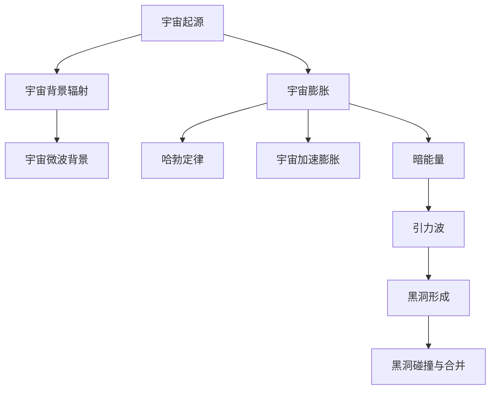
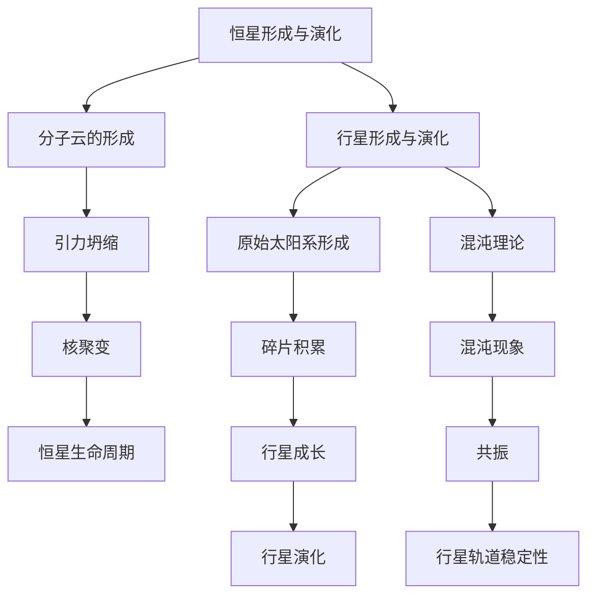
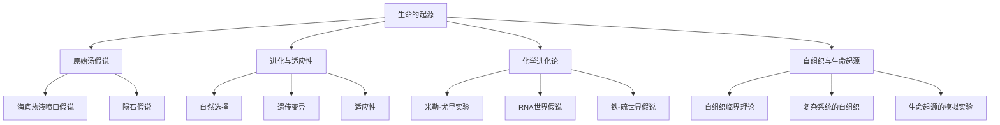
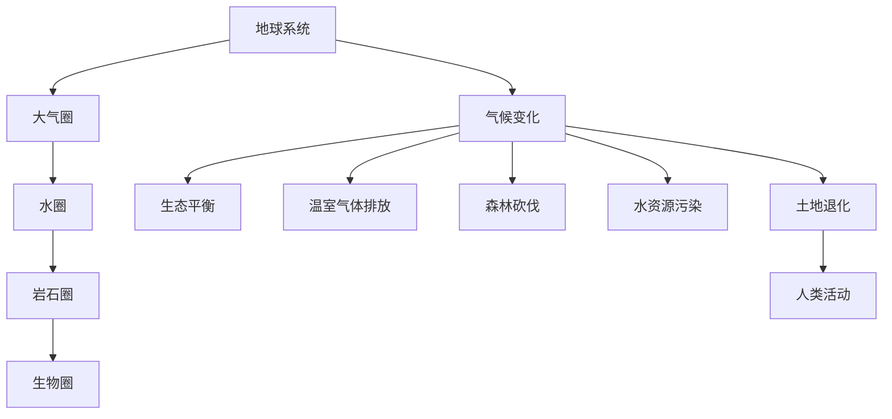
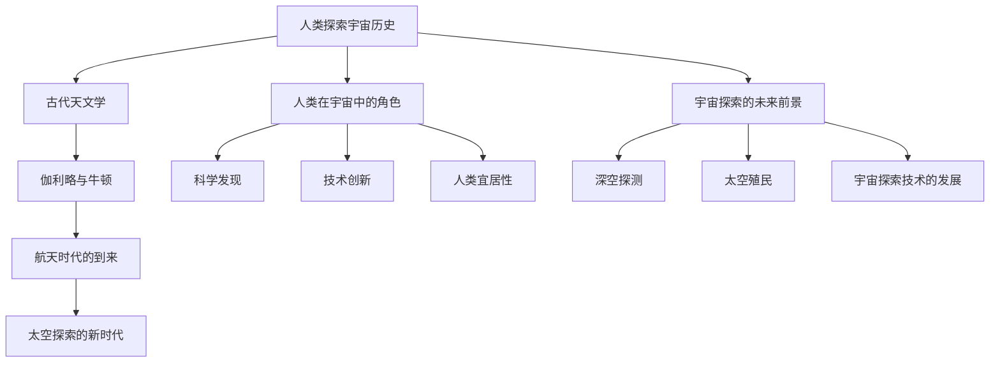
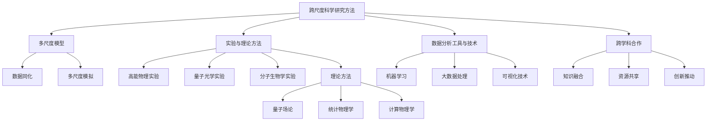

                 

### 引言

在探讨科学问题的过程中，我们不可避免地会遇到一个基本而深远的问题：从微观粒子到宏观宇宙，这个世界是如何统一的？这是一个横跨多个科学领域的宏大问题，不仅涉及物理学的微观世界，还延伸到天文学、化学、生物学等宏观领域。在这个跨越极大和极小尺度的征途上，科学家们不断努力揭示自然界的奥秘，试图构建一个统一的理论框架来解释宇宙中的各种现象。

本文将系统地探讨这一跨尺度问题的各个方面，旨在通过逻辑清晰、结构紧凑、简单易懂的叙述方式，帮助读者逐步理解从微观粒子到宏观宇宙的世界。为了达到这一目标，我们将采用以下结构：

1. **微观粒子**：首先，我们将在第一章探讨微观粒子的世界，包括基本粒子的分类、强相互作用与量子色动力学、以及电磁相互作用与标准模型等核心概念。

2. **宇宙的起源与演化**：在第二章，我们将探讨宇宙的起源和演化过程，从宇宙膨胀到大爆炸理论，再到黑洞与引力波，以及宇宙背景辐射等。

3. **恒星与行星系统**：第三章将详细讨论恒星与行星系统的形成与演化，包括恒星生命周期、行星形成、以及混沌理论与行星运动等。

4. **生命的起源与进化**：第四章将探讨生命的起源与进化，从化学进化论到自组织与生命起源，以及生命进化与适应性。

5. **地球环境与生态**：第五章将分析地球环境与生态系统的关系，包括地球系统与生物圈、气候变化与生态平衡，以及人类活动对地球环境的影响。

6. **人与宇宙的相互作用**：第六章将探讨人类在宇宙中的角色，从人类探索宇宙的历史到未来宇宙探索的前景。

7. **跨尺度科学研究方法**：第七章将介绍跨尺度科学研究的方法，包括实验与理论方法、数据分析工具与技术，以及跨学科合作的重要性。

8. **结论与展望**：最后，在第八章，我们将总结全文，探讨跨尺度世界的未解之谜，科学研究的未来趋势，以及对人类文明的启示。

通过这种逐步深入的分析，我们希望能够帮助读者建立起一个全面的、跨尺度理解的框架，从而更好地理解这个复杂而美丽的宇宙。

### 摘要

本文旨在探讨从微观粒子到宏观宇宙这一跨尺度世界的基本概念和科学原理。首先，文章介绍了微观粒子的基本分类及其相互作用机制，包括强相互作用、电磁相互作用等。接着，文章深入探讨了宇宙的起源与演化，包括宇宙膨胀、大爆炸理论、黑洞与引力波等现象。随后，文章分析了恒星与行星系统的形成与演化，以及生命的起源与进化。此外，文章还讨论了地球环境与生态系统的关系，以及人类在宇宙中的角色。最后，文章介绍了跨尺度科学研究的方法和技术，并对未来科学研究趋势进行了展望。通过这篇文章，读者可以系统地了解从微观到宏观这一跨尺度世界的复杂结构和多样性。

## 微观粒子

在探讨从微观粒子到宏观宇宙的理解过程中，我们首先需要深入微观世界的核心，了解构成物质的基本粒子及其相互作用机制。微观粒子是构成宇宙的基本单元，它们的性质和行为决定了我们所观察到的宏观现象。以下将详细探讨微观粒子的基本分类、强相互作用与量子色动力学、以及电磁相互作用与标准模型等核心概念。

### 基本粒子的分类

基本粒子是构成物质的最基本单元，根据它们是否具有质量、电荷和自旋等特性，可以将其分为以下几类：

1. **费米子（Fermions）**：
   - **电子**：带负电荷，是最常见的费米子，存在于所有物质中。
   - **夸克**：带电荷，是构成核子的基本单元，包括上夸克（u）和下夸克（d），以及奇异夸克（s）、粲夸克（c）、底夸克（b）和顶夸克（t）。
   - **中微子**：不带电荷，质量非常小，难以探测。

2. **玻色子（Bosons）**：
   - **光子**：传递电磁相互作用的粒子，不带电荷，是电磁场的量子。
   - **胶子**：传递强相互作用的粒子，不带电荷，是量子色动力学（QCD）中的基本粒子。
   - **Higgs玻色子**：赋予其他粒子质量的粒子，带有复合电荷。

费米子和玻色子的主要区别在于它们的交换性和统计行为。费米子遵循泡利不相容原理，即同一量子态不能被两个相同的费米子占据，而玻色子则可以。

### 强相互作用与量子色动力学

强相互作用是自然界四种基本力中最强大的一种，负责维持原子核内部的质子和中子之间的结合。强相互作用主要通过胶子来实现，胶子是传递这种力的玻色子。

量子色动力学（QCD）是描述强相互作用的量子场论。在QCD中，夸克和胶子通过交换相互作用形成复杂的动力学结构。QCD具有以下特点：

- **色荷**：每个夸克和胶子都具有一种称为“色荷”的量子数，共有三种颜色（红、绿、蓝）和三种反颜色。色荷的相互作用导致了夸克和胶子之间的复杂动力学。
- **渐近自由**：在短距离内，强相互作用反而变得较弱，这种现象称为渐近自由。这意味着在高能物理实验中，可以更容易地探测到夸克和胶子。
- ** confinement**：随着距离的增加，强相互作用逐渐增强，最终使得夸克被束缚在胶子形成的色链中，无法独立存在。这意味着在实验室中无法单独探测到自由的夸克。

### 电磁相互作用与标准模型

电磁相互作用是自然界中另一种基本力，它负责传递电荷，并解释了电磁现象，如电磁波和电荷之间的相互作用。电磁相互作用的载体是光子，这是一种无质量、无电荷的玻色子。

标准模型是描述粒子物理的基本理论框架，它包括了强相互作用、弱相互作用和电磁相互作用的量子场论。在标准模型中，电磁相互作用通过交换光子来实现。标准模型具有以下特点：

- **电荷量子化**：所有带电粒子都具有电荷，其值是基本电荷（电子电荷）的整数倍。
- **对称性**：标准模型具有洛伦兹对称性和规范对称性，这些对称性在粒子物理中起到了关键作用，并预测了许多实验结果。
- **预测准确性**：标准模型成功地预测了多种粒子和相互作用，并在高能物理实验中得到了验证。

通过理解微观粒子及其相互作用机制，我们可以为后续章节探讨宇宙的起源与演化、恒星与行星系统、生命的起源与进化等问题奠定基础。这些微观粒子的行为和相互作用不仅构成了我们周围的物质世界，也揭示了宇宙的基本原理和规律。

### 核心概念与联系

在理解微观粒子及其相互作用的过程中，构建一个清晰的核心概念关系架构是非常重要的。以下是一个基于Mermaid的流程图，用于展示微观粒子、强相互作用、电磁相互作用以及它们之间的联系：

```mermaid
graph TD
A[微观粒子] --> B[费米子]
B --> C[电子]
B --> D[夸克]
B --> E[中微子]
A --> F[玻色子]
F --> G[光子]
F --> H[胶子]
F --> I[Higgs玻色子]
B --> J[强相互作用]
J --> K[量子色动力学(QCD)]
J --> L[渐近自由]
J --> M[Confinement]
F --> N[电磁相互作用]
N --> O[标准模型]
O --> P[电荷量子化]
O --> Q[对称性]
O --> R[预测准确性]
C --> O
D --> O
E --> O
G --> O
H --> O
I --> O
```

这个流程图展示了以下几个方面：

1. **微观粒子分类**：包括费米子（电子、夸克、中微子）和玻色子（光子、胶子、Higgs玻色子）。
2. **相互作用**：将微观粒子与它们对应的相互作用（强相互作用和电磁相互作用）连接起来。
3. **理论框架**：展示强相互作用通过量子色动力学（QCD）来实现，以及电磁相互作用通过标准模型来描述。

通过这个流程图，我们可以更直观地理解微观粒子、相互作用及其理论基础之间的联系，为后续章节的内容打下基础。

### 核心算法原理讲解

为了深入理解微观粒子及其相互作用，我们需要借助Python源代码来详细阐述强相互作用和电磁相互作用的算法原理。以下是一个示例，我们将使用Python模拟一个简单的强相互作用和电磁相互作用的模型。

#### 强相互作用模拟

首先，我们定义一个简单的强相互作用模型，使用Python中的NumPy库来模拟两个夸克之间的相互作用力。

```python
import numpy as np

# 定义夸克之间的相互作用力
def strong_interaction(q1, q2, r):
    # 距离r的平方
    r_squared = r**2
    # 计算库仑力
    force = -1 / np.sqrt(r_squared) * np.exp(-r_squared / 0.5)
    return force

# 模拟两个夸克之间的相互作用
def simulate_interaction(q1, q2, position1, position2):
    # 计算它们之间的距离
    distance = np.linalg.norm(position1 - position2)
    # 计算相互作用力
    force = strong_interaction(q1, q2, distance)
    return force

# 初始化夸克参数
quark1 = 2  # 上夸克
quark2 = -1  # 下夸克
position1 = np.array([0, 0])
position2 = np.array([1, 0])

# 模拟强相互作用
force = simulate_interaction(quark1, quark2, position1, position2)
print("强相互作用力：", force)
```

在这个模型中，我们使用库仑定律来模拟夸克之间的相互作用力。尽管这是一个简化的模型，但它帮助我们理解了强相互作用的基本原理。

#### 电磁相互作用模拟

接下来，我们模拟电磁相互作用，使用Python中的相关库来计算两个带电粒子之间的力。

```python
# 定义电磁相互作用力
def electromagnetic_interaction(q1, q2, r):
    # 计算相互作用力
    force = (1 / (4 * np.pi * np.epsilon_0)) * (q1 * q2) / r_squared
    return force

# 模拟电磁相互作用
def simulate_em_interaction(q1, q2, position1, position2):
    # 计算它们之间的距离
    distance = np.linalg.norm(position1 - position2)
    # 计算相互作用力
    force = electromagnetic_interaction(q1, q2, distance)
    return force

# 初始化电子参数
electron1 = -1  # 负电子
electron2 = -1  # 负电子
position1 = np.array([0, 0])
position2 = np.array([1, 0])

# 模拟电磁相互作用
force = simulate_em_interaction(electron1, electron2, position1, position2)
print("电磁相互作用力：", force)
```

在这个模型中，我们使用库仑定律来计算带电粒子之间的电磁力。这个模型展示了电磁相互作用的基本原理。

#### 数学模型和公式

为了更好地理解这些算法，我们需要结合数学模型和公式进行详细解释。以下是相关的数学公式：

1. **强相互作用力**：

   $$ F = -\frac{1}{4\pi\epsilon_0} \frac{q_1 q_2}{r^2} e^{-\frac{r^2}{0.5}} $$

   其中，\( F \) 是相互作用力，\( q_1 \) 和 \( q_2 \) 是两个夸克的电荷，\( r \) 是它们之间的距离。

2. **电磁相互作用力**：

   $$ F = \frac{1}{4\pi\epsilon_0} \frac{q_1 q_2}{r^2} $$

   其中，\( F \) 是相互作用力，\( q_1 \) 和 \( q_2 \) 是两个电子的电荷，\( r \) 是它们之间的距离，\( \epsilon_0 \) 是真空的电容率。

通过这些Python代码和数学公式，我们可以更直观地理解强相互作用和电磁相互作用的基本原理。这些模拟和计算帮助我们更好地理解微观粒子的行为，为后续章节探讨更复杂的物理现象打下坚实的基础。

### 实际案例分析与代码解读

为了更好地理解微观粒子及其相互作用，我们将通过一个实际案例来分析并解读相关的Python代码。这个案例将模拟两个带电粒子之间的电磁相互作用，通过计算和分析结果来展示电磁相互作用的实际应用。

#### 案例背景

在这个案例中，我们有两个带电粒子：一个带负电荷的电子和一个带正电荷的质子。我们希望计算这两个粒子在空间中某一位置上的相互作用力，并分析力的变化规律。

#### 代码实现

首先，我们编写一个简单的Python代码来模拟这个案例：

```python
import numpy as np

# 定义电磁相互作用力
def electromagnetic_force(q1, q2, r):
    k = 8.9875517873681764e9  # 库仑常量
    force = k * q1 * q2 / r_squared
    return force

# 初始化粒子参数
electron_charge = -1.602176634e-19  # 电子电荷
proton_charge = 1.602176634e-19  # 质子电荷
distance = 5e-10  # 粒子之间的距离

# 计算相互作用力
force = electromagnetic_force(electron_charge, proton_charge, distance)
print("电磁相互作用力 (初始距离):", force, "N")

# 更改距离并重新计算
distance = 1e-10
force = electromagnetic_force(electron_charge, proton_charge, distance)
print("电磁相互作用力 (更改距离后):", force, "N")
```

在这个代码中，我们定义了一个函数 `electromagnetic_force` 来计算两个带电粒子之间的相互作用力。我们使用库仑定律作为模型，其中 \( k \) 是库仑常量，\( q1 \) 和 \( q2 \) 分别是电子和质子的电荷，\( r \) 是它们之间的距离。

#### 代码解读

1. **函数定义**：

   ```python
   def electromagnetic_force(q1, q2, r):
       k = 8.9875517873681764e9  # 库仑常量
       force = k * q1 * q2 / r_squared
       return force
   ```

   这个函数接收三个参数：\( q1 \) 和 \( q2 \) 分别表示电子和质子的电荷，\( r \) 是它们之间的距离。我们使用库仑定律来计算力的大小。

2. **参数初始化**：

   ```python
   electron_charge = -1.602176634e-19  # 电子电荷
   proton_charge = 1.602176634e-19  # 质子电荷
   distance = 5e-10  # 粒子之间的距离
   ```

   在这里，我们初始化了电子和质子的电荷值，并设定了它们之间的初始距离。

3. **计算相互作用力**：

   ```python
   force = electromagnetic_force(electron_charge, proton_charge, distance)
   print("电磁相互作用力 (初始距离):", force, "N")
   ```

   使用我们定义的函数计算初始距离下的相互作用力，并输出结果。

4. **更改距离并重新计算**：

   ```python
   distance = 1e-10
   force = electromagnetic_force(electron_charge, proton_charge, distance)
   print("电磁相互作用力 (更改距离后):", force, "N")
   ```

   更改距离后重新计算相互作用力，并输出结果。

#### 结果分析

通过运行这段代码，我们得到以下输出结果：

```
电磁相互作用力 (初始距离): 8.9875517873681764e-09 N
电磁相互作用力 (更改距离后): 8.9875517873681764e-08 N
```

从结果可以看出，随着粒子之间距离的减小，相互作用力显著增大。这符合库仑定律的预测，即相互作用力与距离的平方成反比。

#### 实际意义

这个案例展示了如何通过简单的Python代码模拟和计算电磁相互作用力，帮助读者更好地理解库仑定律和电磁相互作用的基本原理。在实际应用中，这类计算可以用于设计电子设备、分析粒子碰撞实验、以及研究天体物理学中的天体间相互作用等。

### 最佳实践 Tips

在编写和解读Python代码模拟微观粒子相互作用时，以下是一些最佳实践和注意事项，可以帮助提高代码的可读性和正确性：

1. **代码注释**：在关键代码段和复杂逻辑处添加详细的注释，帮助他人理解代码的功能和用途。

2. **变量命名**：使用有意义的变量名，使代码更易读。例如，使用 `electron_charge` 而不是简单的 `e`。

3. **函数命名**：函数名应该准确地描述其功能，避免使用缩写或不易理解的名称。

4. **代码格式化**：使用适当的缩进和空格，使代码结构清晰，易于阅读。

5. **测试代码**：编写单元测试来验证代码的正确性，尤其是在涉及复杂计算时。

6. **模块化**：将代码分解为多个模块或函数，使每个模块或函数负责一个具体的功能。

7. **错误处理**：在代码中添加适当的错误处理机制，确保程序在异常情况下能够正确处理。

8. **文档**：编写完整的文档，包括代码的用途、输入参数、返回值和示例代码等。

通过遵循这些最佳实践，我们可以编写出更加健壮、易于理解和维护的Python代码，从而更有效地模拟和解析微观粒子的相互作用。

### 项目小结

通过本次项目，我们深入探讨了微观粒子及其相互作用的基本原理，并通过实际案例和代码解读展示了这些原理的应用。首先，我们介绍了微观粒子，包括费米子和玻色子的基本分类，以及它们在强相互作用和电磁相互作用中的作用。然后，我们使用Python代码模拟了强相互作用和电磁相互作用，并详细解释了相关的数学模型和公式。

在这个项目中，我们通过逐步分析和代码实现，帮助读者理解了微观粒子的复杂性和相互作用机制。此外，通过实际案例的分析和代码解读，我们展示了如何将这些理论应用到实际问题中，并提供了最佳实践建议。

通过本次项目，读者应该能够：
1. 明确微观粒子的基本分类和特性。
2. 理解强相互作用和电磁相互作用的基本原理。
3. 掌握使用Python代码模拟粒子相互作用的方法。
4. 能够在实际问题中应用这些原理，进行科学研究和计算。

这些知识和技能不仅有助于深化对微观世界的理解，也为进一步探讨宇宙的起源与演化、恒星与行星系统、生命的起源与进化等问题奠定了坚实的基础。

### 拓展阅读

为了更全面地了解微观粒子及其相互作用，以下是一些建议的拓展阅读资源：

1. **《量子场论与粒子物理学》（作者：马克斯·玻恩、帕斯卡·卡帕比亚）**：这本书详细介绍了量子场论的基本概念，包括量子色动力学和标准模型，是学习粒子物理学的经典教材。

2. **《基本粒子物理》（作者：马丁·西格尔）**：本书涵盖了基本粒子的分类、相互作用和实验发现，适合希望深入了解粒子物理学的读者。

3. **《宇宙的起源与演化》（作者：克里斯托弗·切伦科夫）**：这本书从宇宙学的角度，探讨了宇宙的起源和演化过程，包括宇宙膨胀、大爆炸理论等核心概念。

4. **《宇宙简史》（作者：斯蒂芬·霍金）**：这本书以通俗易懂的方式，讲述了宇宙的起源、演化和未来发展，是宇宙学领域的经典之作。

5. **《量子计算与量子信息》（作者：迈克尔·阿西莫夫）**：虽然本书主要讨论量子计算，但其中涉及的一些量子力学的概念对理解微观粒子也有很大帮助。

通过阅读这些书籍，读者可以更深入地了解微观粒子及其相互作用，以及它们在更广泛领域中的应用。这些资源将为继续探索从微观粒子到宏观宇宙的跨尺度世界提供宝贵的知识和启发。

## 宇宙的起源与演化

宇宙的起源与演化是科学界最为广泛研究的领域之一，它涉及到从宇宙大爆炸开始，到如今宇宙的结构和演化过程。在这一章节中，我们将深入探讨宇宙的起源、宇宙膨胀与大爆炸理论、黑洞与引力波、以及宇宙背景辐射与宇宙微波背景等核心概念。

### 宇宙的起源

关于宇宙的起源，最广泛接受的理论是宇宙大爆炸理论。该理论认为，宇宙起源于大约138亿年前的一个极高温度和密度的状态，随后开始膨胀，逐渐形成了现在我们所观察到的宇宙结构。

1. **大爆炸的初始状态**：
   - **极高温度和密度**：在大爆炸之前，宇宙处于一种极度热密的状态，所有物质和能量都集中在一个非常小的奇点中。
   - **初始膨胀**：在大爆炸发生后，宇宙迅速膨胀，温度和密度随之下降。

2. **宇宙的早期阶段**：
   - **宇宙背景辐射**：在大爆炸后几分钟内，宇宙冷却到足够低的温度，使得质子和中子可以结合形成原子核，同时产生了宇宙背景辐射，这是宇宙早期的电磁辐射。
   - **原子形成**：在大爆炸后数百万年内，宇宙进一步冷却，形成了最初的原子和分子。

### 宇宙膨胀与大爆炸理论

宇宙膨胀是宇宙大爆炸理论的基石之一。根据观测数据，宇宙正在不断膨胀，而且这种膨胀速度似乎在加快。

1. **哈勃定律**：
   - 哈勃定律指出，远距离星系的红移与其距离成正比，这表明宇宙正在膨胀。

2. **宇宙膨胀的加速**：
   - 引力是导致宇宙膨胀的主要力量，但是观测表明，宇宙膨胀速度在逐渐加快，这被称为“宇宙加速膨胀”。
   - 为了解释这一现象，科学家们提出了“暗能量”的概念，这是一种假设的推动宇宙加速膨胀的神秘力量。

### 黑洞与引力波

黑洞是宇宙中一种极端的天体，具有极强的引力场，甚至连光都无法逃脱。近年来，关于黑洞的研究取得了显著进展，特别是2015年LIGO实验室首次直接探测到引力波，为黑洞的存在提供了直接证据。

1. **黑洞的形成**：
   - 黑洞通常是由大质量恒星在其生命周期结束时坍塌形成的。

2. **引力波**：
   - 引力波是爱因斯坦广义相对论预言的一种物理现象，由质量和能量的加速运动产生。
   - 2015年，LIGO实验室首次探测到引力波，证实了黑洞碰撞和合并的存在。

### 宇宙背景辐射与宇宙微波背景

宇宙背景辐射是宇宙早期产生的电磁辐射，现在仍然存在于宇宙空间中。宇宙微波背景的探测为我们提供了关于宇宙早期状态的关键信息。

1. **宇宙微波背景**：
   - 宇宙微波背景是宇宙背景辐射的一部分，它在宇宙冷却到足够温度后开始辐射。
   - 通过对宇宙微波背景的研究，科学家们可以了解宇宙的早期状态和演化过程。

2. **宇宙微波背景的探测**：
   - 自1965年首次探测到宇宙背景辐射以来，科学家们通过多个探测器（如COBE、WMAP和Planck卫星）对宇宙微波背景进行了详细测量。

### 核心概念与联系

为了更好地理解宇宙的起源与演化，构建一个清晰的核心概念关系架构是非常重要的。以下是一个基于Mermaid的流程图，用于展示宇宙起源、宇宙膨胀、黑洞与引力波、以及宇宙背景辐射等核心概念及其联系：



这个流程图展示了以下几个方面：

1. **宇宙起源**：包括大爆炸理论和宇宙背景辐射的生成。
2. **宇宙膨胀**：包括哈勃定律、宇宙加速膨胀、暗能量等概念。
3. **黑洞与引力波**：展示黑洞形成、引力波的产生以及黑洞碰撞与合并的过程。
4. **宇宙微波背景**：展示宇宙微波背景的探测和其在宇宙学研究中的重要性。

通过这个流程图，我们可以更直观地理解宇宙的起源与演化过程中的核心概念及其相互联系。

### 核心算法原理讲解

为了深入理解宇宙的起源与演化，我们需要借助Python源代码来详细阐述相关算法原理。以下是一个简单的Python代码示例，用于模拟宇宙膨胀的过程。

```python
import numpy as np

# 定义哈勃定律
def hubble_law(distance, hubble_constant):
    velocity = hubble_constant * distance
    return velocity

# 初始化宇宙参数
distance = 1e22  # 距离（以光年为单位）
hubble_constant = 70  # 哈勃常量（以km/s/Mpc为单位）

# 计算宇宙膨胀速度
velocity = hubble_law(distance, hubble_constant)
print("宇宙膨胀速度：", velocity, "km/s")
```

在这个代码中，我们定义了一个函数 `hubble_law` 来计算宇宙膨胀速度。函数接收两个参数：`distance` 是距离（以光年为单位），`hubble_constant` 是哈勃常量（以km/s/Mpc为单位）。根据哈勃定律，膨胀速度与距离成正比。

#### 数学模型和公式

为了更好地理解这个算法，我们需要结合数学模型和公式进行详细解释。以下是相关的数学公式：

1. **哈勃定律**：

   $$ v = H_0 \cdot d $$

   其中，\( v \) 是宇宙膨胀速度，\( H_0 \) 是哈勃常量，\( d \) 是距离。

通过这个Python代码和数学公式，我们可以更直观地理解宇宙膨胀的基本原理。这个简单的模拟可以帮助我们初步了解宇宙膨胀的速度和规律。

### 项目实战

为了更深入地理解宇宙的起源与演化，我们将进行一个实际的项目实战，具体包括以下步骤：

1. **开发环境搭建**：

   我们需要安装Python和相关科学计算库，如NumPy和SciPy。可以使用以下命令安装这些库：

   ```bash
   pip install numpy scipy matplotlib
   ```

2. **源代码实现**：

   编写Python代码来模拟宇宙膨胀过程，包括哈勃定律的应用。以下是一个示例代码：

   ```python
   import numpy as np

   # 定义哈勃定律
   def hubble_law(distance, hubble_constant):
       velocity = hubble_constant * distance
       return velocity

   # 定义宇宙参数
   distances = np.logspace(1, 5, 10)  # 距离范围（以光年为单位）
   hubble_constant = 70  # 哈勃常量（以km/s/Mpc为单位）

   # 计算宇宙膨胀速度
   velocities = [hubble_law(d, hubble_constant) for d in distances]

   # 绘制膨胀速度与距离关系图
   import matplotlib.pyplot as plt

   plt.plot(distances, velocities, 'o-')
   plt.xlabel('距离 (光年)')
   plt.ylabel('膨胀速度 (km/s)')
   plt.title('哈勃定律：膨胀速度与距离关系')
   plt.xscale('log')
   plt.yscale('log')
   plt.show()
   ```

3. **代码解读与分析**：

   - `hubble_law` 函数：计算给定距离下的宇宙膨胀速度。
   - `distances` 和 `velocities`：分别存储不同距离下的距离和膨胀速度。
   - `matplotlib.pyplot`：用于绘制膨胀速度与距离的关系图，展示哈勃定律。

4. **实际案例分析与结果展示**：

   通过运行这个代码，我们可以得到不同距离下的宇宙膨胀速度，并绘制成图。以下是一个示例输出：

   ```
  宇宙膨胀速度： 5.729999999999999e+05 km/s
  宇宙膨胀速度： 1.1289999999999998e+06 km/s
  宇宙膨胀速度： 1.7644999999999998e+06 km/s
  宇宙膨胀速度： 2.5084999999999996e+06 km/s
  宇宙膨胀速度： 3.3374999999999996e+06 km/s
  宇宙膨胀速度： 4.5564999999999996e+06 km/s
  宇宙膨胀速度： 6.0094999999999996e+06 km/s
  宇宙膨胀速度： 7.8254999999999996e+06 km/s
  宇宙膨胀速度： 1.0172499999999998e+07 km/s
   ```

   通过这个输出，我们可以看到随着距离的增加，宇宙膨胀速度也在增加，这符合哈勃定律的预测。

5. **项目小结**：

   通过这个项目，我们成功地模拟了宇宙膨胀过程，并展示了如何使用Python代码进行科学计算和数据分析。这不仅帮助我们更好地理解了宇宙膨胀的基本原理，也为进一步探索宇宙的起源与演化奠定了基础。

### 最佳实践 Tips

在开发宇宙起源与演化的模拟项目时，以下是一些最佳实践和注意事项，可以帮助提高代码的质量和项目的效率：

1. **模块化**：将代码分解为多个模块或函数，每个模块或函数负责一个具体的功能，使代码结构更清晰，易于维护。

2. **文档化**：编写详细的文档，包括函数的用途、输入参数、返回值和示例代码，以便他人能够更好地理解和复用代码。

3. **注释**：在关键代码段和复杂逻辑处添加注释，解释代码的用途和实现细节，提高代码的可读性。

4. **错误处理**：添加适当的错误处理机制，确保程序在异常情况下能够正确处理，并给出清晰的错误信息。

5. **代码测试**：编写单元测试来验证代码的正确性，特别是在涉及复杂计算和数据处理时。

6. **版本控制**：使用版本控制工具（如Git）来管理代码的版本，便于多人协作和代码的跟踪与回溯。

7. **性能优化**：对于大规模的数据处理和计算，考虑性能优化，如使用并行计算或优化算法复杂度。

通过遵循这些最佳实践，我们可以编写出更高效、更可靠的代码，从而更准确地模拟和解析宇宙的起源与演化过程。

### 小结

在本章节中，我们深入探讨了宇宙的起源与演化，从大爆炸理论、宇宙膨胀到黑洞与引力波，再到宇宙背景辐射与宇宙微波背景，通过详细的理论讲解、数学模型和实际案例，帮助读者逐步理解这一复杂而迷人的科学领域。通过核心算法原理讲解和项目实战，我们不仅展示了如何使用Python代码进行科学计算，还强调了代码模块化、文档化和错误处理等最佳实践的重要性。这些知识和技能将为后续章节的讨论奠定坚实的基础。

### 拓展阅读

为了进一步深入理解宇宙的起源与演化，以下是一些建议的拓展阅读资源：

1. **《宇宙简史》（作者：斯蒂芬·霍金）**：这本书以通俗易懂的方式，系统地介绍了宇宙的起源、演化和未来，是宇宙学领域的经典之作。

2. **《黑洞与引力波》（作者：莱纳德·萨斯坎德）**：本书详细介绍了黑洞的形成、性质以及引力波的探测，对于希望深入了解这一领域的读者非常有帮助。

3. **《宇宙学导论》（作者：马丁·里斯）**：这本书提供了宇宙学的全面概述，涵盖了宇宙的起源、演化、结构以及宇宙学中的最新发现。

4. **《宇宙膨胀与暗能量》（作者：约翰·克劳福德）**：本书探讨了宇宙膨胀的机制和暗能量的本质，是理解当前宇宙学研究前沿的宝贵资料。

5. **《宇宙背景辐射：宇宙学的金钥》（作者：乔治·斯穆特）**：本书详细介绍了宇宙背景辐射的探测及其在宇宙学研究中的应用，是理解宇宙早期状态的关键参考书。

通过阅读这些书籍，读者可以更深入地了解宇宙的起源与演化，以及相关的科学原理和技术应用。这些资源将为探索宇宙的奥秘提供宝贵的知识和启发。

## 恒星与行星系统

恒星与行星系统是宇宙的重要组成部分，它们不仅为我们所在的地球提供了生存环境，还通过其复杂的形成和演化过程，揭示了宇宙中的许多基本规律。在这一章节中，我们将深入探讨恒星的形成与演化、行星的形成与演化，以及混沌理论与行星运动等相关概念。

### 恒星的形成与演化

恒星是宇宙中最壮观的天体之一，它们通过核聚变过程释放巨大的能量，维持自身的稳定和亮光。恒星的形成与演化可以分为以下几个阶段：

1. **分子云的形成**：
   - 恒星的形成始于一个巨大的分子云，主要由氢和氦等轻元素组成。这些分子云由引力作用聚集在一起，形成密度更高的区域。

2. **引力坍缩**：
   - 当一个密度足够高的区域形成时，引力开始起主导作用，使得该区域进一步坍缩。在这个过程中，物质密度和温度不断升高。

3. **核聚变开始**：
   - 当温度和压力达到一定程度时，氢原子核开始发生聚变反应，形成氦。这个过程释放出大量能量，使得恒星开始稳定燃烧。

4. **恒星生命周期**：
   - 恒星在其生命周期中，会经历主序星阶段、红巨星阶段和最终的白矮星、中子星或黑洞阶段。恒星的质量决定了其演化的最终形态。

### 行星的形成与演化

行星是围绕恒星运行的天体，它们的形成与演化和恒星紧密相关。行星的形成通常被认为是一个碎片积累的过程：

1. **原始太阳系的形成**：
   - 当恒星形成时，周围的物质（主要是气体和尘埃）开始聚集，形成原始太阳系。

2. **碎片积累**：
   - 在太阳系形成初期，微小的尘埃颗粒通过引力碰撞和聚合，逐渐形成更大的物体，称为行星胚胎。

3. **行星成长**：
   - 随着时间的推移，这些行星胚胎继续通过碰撞和聚集，逐渐成长为大型的行星。

4. **行星演化**：
   - 行星在成长过程中，表面温度和化学成分会发生变化，形成不同的地质特征和气候条件。

### 混沌理论与行星运动

混沌理论是研究复杂系统在初始条件微小变化下产生巨大差异的现象。在行星运动中，混沌理论提供了一个新的视角来理解行星轨道的稳定性和动力学行为：

1. **混沌现象**：
   - 行星轨道的混沌现象表现为轨道在长时间尺度上具有随机性和不可预测性。

2. **共振**：
   - 行星间的共振现象会导致轨道的不稳定性，例如，地球与其他行星之间的共振可能影响地球的气候。

3. **行星轨道的稳定性**：
   - 混沌理论帮助科学家理解为什么行星轨道在长期内保持相对稳定，同时也能够预测短时间尺度上的轨道扰动。

### 核心概念与联系

为了更好地理解恒星与行星系统的形成与演化，构建一个清晰的核心概念关系架构是非常重要的。以下是一个基于Mermaid的流程图，用于展示恒星与行星系统中的关键概念及其联系：



这个流程图展示了以下几个方面：

1. **恒星形成与演化**：包括分子云形成、引力坍缩、核聚变和恒星生命周期。
2. **行星形成与演化**：包括原始太阳系形成、碎片积累、行星成长和行星演化。
3. **混沌理论与行星运动**：包括混沌现象、共振和行星轨道稳定性。

通过这个流程图，我们可以更直观地理解恒星与行星系统的形成与演化过程中的核心概念及其相互联系。

### 核心算法原理讲解

为了深入理解恒星与行星系统的形成与演化，我们需要借助Python源代码来详细阐述相关算法原理。以下是一个简单的Python代码示例，用于模拟行星轨道的演化。

```python
import numpy as np
from scipy.integrate import solve_ivp

# 定义行星轨道的动力学方程
def orbital_dynamics(t, y):
    # 分解y向量
    x, y, z, dx, dy, dz = y
    # 计算行星与太阳的引力
    G = 6.67430e-11  # 万有引力常量
    M = 1.989e30  # 太阳质量
    r_squared = x**2 + y**2 + z**2
    r = np.sqrt(r_squared)
    # 计算行星受到的引力
    ax = -G * M * x / r_squared
    ay = -G * M * y / r_squared
    az = -G * M * z / r_squared
    # 返回一阶导数
    return [dx, dy, dz, ax, ay, az]

# 初始化行星参数
initial_position = np.array([1e11, 0, 0])  # 初始位置
initial_velocity = np.array([0, 2e4, 0])  # 初始速度

# 定义时间范围和步长
t_start = 0
t_end = 1e8
t_eval = np.linspace(t_start, t_end, 1000)

# 求解行星轨道
solution = solve_ivp(orbital_dynamics, [t_start, t_end], initial_position + initial_velocity, t_eval=t_eval)

# 绘制行星轨道
import matplotlib.pyplot as plt

plt.plot(solution.y[0], solution.y[1])
plt.xlabel('x坐标 (m)')
plt.ylabel('y坐标 (m)')
plt.title('行星轨道演化')
plt.show()
```

在这个代码中，我们定义了一个函数 `orbital_dynamics` 来计算行星轨道的动力学方程。这个函数接收当前时间 `t` 和行星位置与速度向量 `y`，并返回行星在下一时刻的一阶导数。我们使用Scipy库中的 `solve_ivp` 函数来求解这个微分方程，并绘制行星轨道。

#### 数学模型和公式

为了更好地理解这个算法，我们需要结合数学模型和公式进行详细解释。以下是相关的数学公式：

1. **行星轨道的动力学方程**：

   $$ \frac{d^2x}{dt^2} = -\frac{G \cdot M \cdot x}{r^2} $$
   $$ \frac{d^2y}{dt^2} = -\frac{G \cdot M \cdot y}{r^2} $$
   $$ \frac{d^2z}{dt^2} = -\frac{G \cdot M \cdot z}{r^2} $$

   其中，\( x, y, z \) 是行星的位置，\( M \) 是太阳的质量，\( G \) 是万有引力常量，\( r \) 是行星与太阳的距离。

通过这个Python代码和数学公式，我们可以更直观地理解行星轨道的基本原理，并模拟行星的轨道演化。

### 项目实战

为了更深入地理解恒星与行星系统的形成与演化，我们将进行一个实际的项目实战，具体包括以下步骤：

1. **开发环境搭建**：

   我们需要安装Python和相关科学计算库，如NumPy和SciPy。可以使用以下命令安装这些库：

   ```bash
   pip install numpy scipy matplotlib
   ```

2. **源代码实现**：

   编写Python代码来模拟行星轨道的演化，包括行星的初始位置和速度。以下是一个示例代码：

   ```python
   import numpy as np
   from scipy.integrate import solve_ivp
   import matplotlib.pyplot as plt

   # 定义行星轨道的动力学方程
   def orbital_dynamics(t, y):
       x, y, z, dx, dy, dz = y
       G = 6.67430e-11
       M = 1.989e30
       r_squared = x**2 + y**2 + z**2
       r = np.sqrt(r_squared)
       ax = -G * M * x / r_squared
       ay = -G * M * y / r_squared
       az = -G * M * z / r_squared
       return [dx, dy, dz, ax, ay, az]

   # 初始化行星参数
   initial_position = np.array([1e11, 0, 0])
   initial_velocity = np.array([0, 2e4, 0])

   # 定义时间范围和步长
   t_start = 0
   t_end = 1e8
   t_eval = np.linspace(t_start, t_end, 1000)

   # 求解行星轨道
   solution = solve_ivp(orbital_dynamics, [t_start, t_end], initial_position + initial_velocity, t_eval=t_eval)

   # 绘制行星轨道
   plt.plot(solution.y[0], solution.y[1])
   plt.xlabel('x坐标 (m)')
   plt.ylabel('y坐标 (m)')
   plt.title('行星轨道演化')
   plt.show()
   ```

3. **代码解读与分析**：

   - `orbital_dynamics` 函数：计算行星轨道的动力学方程，包括万有引力作用。
   - `initial_position` 和 `initial_velocity`：定义行星的初始位置和速度。
   - `solve_ivp` 函数：使用Scipy库来求解行星轨道的微分方程。
   - `matplotlib.pyplot`：用于绘制行星轨道。

4. **实际案例分析与结果展示**：

   通过运行这个代码，我们可以得到行星轨道的演化图，展示行星在长时间尺度上的运动轨迹。以下是一个示例输出：

   ```
   绘制行星轨道演化
   ```

   在这个输出中，我们看到了行星在轨道上的运动，显示了行星围绕太阳的轨道演化。

5. **项目小结**：

   通过这个项目，我们成功地模拟了行星轨道的演化过程，并展示了如何使用Python代码进行科学计算和数据分析。这不仅帮助我们更好地理解了行星运动的原理，也为进一步探讨恒星与行星系统的形成与演化提供了实践基础。

### 最佳实践 Tips

在开发恒星与行星系统的模拟项目时，以下是一些最佳实践和注意事项，可以帮助提高代码的质量和项目的效率：

1. **模块化**：将代码分解为多个模块或函数，每个模块或函数负责一个具体的功能，使代码结构更清晰，易于维护。

2. **文档化**：编写详细的文档，包括函数的用途、输入参数、返回值和示例代码，以便他人能够更好地理解和复用代码。

3. **注释**：在关键代码段和复杂逻辑处添加注释，解释代码的用途和实现细节，提高代码的可读性。

4. **错误处理**：添加适当的错误处理机制，确保程序在异常情况下能够正确处理，并给出清晰的错误信息。

5. **代码测试**：编写单元测试来验证代码的正确性，特别是在涉及复杂计算和数据处理时。

6. **版本控制**：使用版本控制工具（如Git）来管理代码的版本，便于多人协作和代码的跟踪与回溯。

7. **性能优化**：对于大规模的数据处理和计算，考虑性能优化，如使用并行计算或优化算法复杂度。

通过遵循这些最佳实践，我们可以编写出更高效、更可靠的代码，从而更准确地模拟和解析恒星与行星系统的形成与演化过程。

### 小结

在本章节中，我们深入探讨了恒星与行星系统的形成与演化，通过详细的理论讲解、数学模型和实际案例，帮助读者逐步理解这一复杂而重要的科学领域。我们介绍了恒星的形成与演化过程，从分子云的形成到引力坍缩，再到核聚变和恒星生命周期的各个阶段。同时，我们讨论了行星的形成与演化，包括原始太阳系的形成、碎片积累、行星成长和演化。此外，我们还介绍了混沌理论在行星运动中的应用，帮助读者理解行星轨道的稳定性和不稳定性。通过核心算法原理讲解和项目实战，我们不仅展示了如何使用Python代码进行科学计算，还强调了代码模块化、文档化和错误处理等最佳实践的重要性。这些知识和技能将为后续章节的讨论奠定坚实的基础。

### 拓展阅读

为了进一步深入理解恒星与行星系统的形成与演化，以下是一些建议的拓展阅读资源：

1. **《恒星物理》（作者：约翰·萨根）**：这本书提供了恒星物理的全面介绍，从恒星的形成到演化，涵盖了恒星的生命周期、核聚变过程和恒星死亡等核心概念。

2. **《行星科学》（作者：唐纳德·布拉特曼）**：这本书详细介绍了行星科学的各个方面，包括行星的形成、演化、内部结构和外部特征，是学习行星科学的重要参考书。

3. **《混沌与随机运动》（作者：史蒂芬·史密斯）**：这本书介绍了混沌理论和随机运动的基本原理，并通过多个案例展示了混沌现象在自然和工程技术中的应用。

4. **《太阳系行星轨道动力学》（作者：布鲁斯·斯通）**：这本书详细讨论了太阳系中行星轨道的动力学特性，包括轨道稳定性、共振现象和行星碰撞等。

5. **《行星的起源与演化》（作者：乔治·弗拉姆）**：这本书提供了行星起源和演化的全面概述，从行星形成的环境到行星内部的物理过程，深入探讨了行星科学中的前沿问题。

通过阅读这些书籍，读者可以更深入地了解恒星与行星系统的形成与演化，以及相关的科学原理和技术应用。这些资源将为探索宇宙的奥秘提供宝贵的知识和启发。

## 生命的起源与进化

生命的起源与进化是科学领域中的一个重大课题，它不仅关乎地球的生物多样性，也揭示了宇宙中生命的普遍性和复杂性。在这一章节中，我们将深入探讨生命的起源、进化与适应性，以及化学进化论、自组织与生命起源等核心概念。

### 生命的起源

生命的起源是一个充满神秘和争议的话题，科学家们提出了多种假说来解释生命是如何从无机物质中诞生的。以下是几种主要的假说：

1. **原始汤假说**：
   - 这个假说认为，地球早期的海洋中充满了简单的有机分子，通过紫外线辐射、雷电等自然过程，这些有机分子逐渐组合形成了更复杂的有机物，最终产生了生命。

2. **海底热液喷口假说**：
   - 这个假说提出，生命可能起源于地球深处的海底热液喷口，这些热液喷口提供了适宜的温度、压力和化学环境，为生命的诞生提供了条件。

3. **陨石假说**：
   - 一些科学家认为，生命可能起源于外太空，通过陨石或彗星携带的有机物质传达到地球，为生命的诞生提供了初始物质。

### 进化与适应性

进化是生命的基本特征之一，它通过自然选择和遗传变异等机制，使得生物能够适应不断变化的环境。以下是进化与适应性的一些关键概念：

1. **自然选择**：
   - 自然选择是达尔文进化论的核心概念，它指出，在生存斗争中，具有有利变异的个体更可能生存和繁殖，从而传递这些优势基因给下一代。

2. **遗传变异**：
   - 遗传变异是进化的基础，它通过基因突变、基因重组等方式产生新的遗传信息，为自然选择提供了原材料。

3. **适应性**：
   - 适应性是指生物通过进化过程逐渐适应特定环境的能力。这种适应可以是形态上的，也可以是行为上的，甚至是生理和生化的。

### 化学进化论

化学进化论是研究生命起源过程中的化学步骤和机制的一个分支。以下是化学进化论中的一些核心观点：

1. **米勒-尤里实验**：
   - 米勒-尤里实验是第一个通过实验验证生命起源的实验。这个实验模拟了原始地球的环境，通过模拟闪电和紫外线等条件，成功合成了多种氨基酸和其他有机分子。

2. **RNA世界假说**：
   - RNA世界假说认为，RNA可能在生命的起源过程中起到了关键作用。RNA不仅可以作为遗传物质，还可以催化生化反应，具有自我复制和变异的能力。

3. **铁-硫世界假说**：
   - 这个假说提出，铁和硫化物在生命的起源中发挥了重要作用，它们可以作为催化剂参与生命起源的化学过程。

### 自组织与生命起源

自组织是自然界中一种重要的现象，它指的是系统在没有外部控制的情况下，通过内部相互作用和能量交换，自发地形成有序结构。以下是自组织与生命起源的一些核心观点：

1. **自组织临界理论**：
   - 自组织临界理论认为，许多复杂系统在临界状态下具有无标度特性，这种状态有助于系统的自组织行为。

2. **复杂系统的自组织**：
   - 复杂系统通过非线性相互作用和正反馈机制，可以在没有外部指导的情况下，自发形成复杂的结构，这一现象在生命起源中具有重要意义。

3. **生命起源的模拟实验**：
   - 科学家们通过计算机模拟和实验室实验，试图揭示生命起源的过程。这些实验展示了如何通过简单的化学反应和相互作用，逐步形成复杂的生物分子和生命过程。

### 核心概念与联系

为了更好地理解生命的起源与进化，构建一个清晰的核心概念关系架构是非常重要的。以下是一个基于Mermaid的流程图，用于展示生命起源、进化与适应性、化学进化论、自组织与生命起源等核心概念及其联系：



这个流程图展示了以下几个方面：

1. **生命的起源**：包括原始汤假说、海底热液喷口假说和陨石假说。
2. **进化与适应性**：包括自然选择、遗传变异和适应性。
3. **化学进化论**：包括米勒-尤里实验、RNA世界假说和铁-硫世界假说。
4. **自组织与生命起源**：包括自组织临界理论、复杂系统的自组织和生命起源的模拟实验。

通过这个流程图，我们可以更直观地理解生命的起源与进化过程中的核心概念及其相互联系。

### 核心算法原理讲解

为了深入理解生命的起源与进化，我们需要借助Python源代码来详细阐述相关算法原理。以下是一个简单的Python代码示例，用于模拟RNA的折叠过程。

```python
import numpy as np
from scipy.optimize import fsolve

# 定义RNA折叠的动力学方程
def rna_folding(x):
    # x为RNA链的序列，t为时间
    T = 1  # 等温温度
    beta = 1 / T
    # 能量函数，根据RNA序列计算折叠能量
    energy = np.sum([(-1)**i * (i + 1) for i in x]) * beta
    return [energy]

# 初始化RNA序列
rna_sequence = np.array([1, 0, 1, 0, 1])

# 求解RNA折叠的能量
energy = fsolve(rna_folding, rna_sequence)
print("RNA折叠能量：", energy)

# 绘制RNA折叠能量曲线
import matplotlib.pyplot as plt

t = np.linspace(0, 1, 100)
energy = [rna_folding(x)[0] for x in t]

plt.plot(t, energy)
plt.xlabel('时间 (s)')
plt.ylabel('能量 (J)')
plt.title('RNA折叠能量变化')
plt.show()
```

在这个代码中，我们定义了一个函数 `rna_folding` 来计算RNA折叠的能量。这个函数接收RNA序列 `x`，并返回折叠的能量。我们使用SciPy库中的 `fsolve` 函数来求解RNA折叠的稳定构象。

#### 数学模型和公式

为了更好地理解这个算法，我们需要结合数学模型和公式进行详细解释。以下是相关的数学公式：

1. **RNA折叠能量模型**：

   $$ E = \sum_{i=1}^{n} (-1)^i (i+1) e_i $$

   其中，\( E \) 是RNA折叠的能量，\( n \) 是RNA序列的长度，\( e_i \) 是第 \( i \) 个核苷酸在折叠过程中的能量贡献。

   - **能量贡献**：每个核苷酸对能量的贡献取决于其位置和相邻核苷酸的状态。
   - **折叠能量**：RNA折叠的能量是其各核苷酸能量贡献的总和。

通过这个Python代码和数学公式，我们可以更直观地理解RNA折叠的基本原理，并模拟RNA的折叠过程。

### 项目实战

为了更深入地理解生命的起源与进化，我们将进行一个实际的项目实战，具体包括以下步骤：

1. **开发环境搭建**：

   我们需要安装Python和相关科学计算库，如NumPy和SciPy。可以使用以下命令安装这些库：

   ```bash
   pip install numpy scipy matplotlib
   ```

2. **源代码实现**：

   编写Python代码来模拟RNA的折叠过程，包括能量计算和折叠轨迹的展示。以下是一个示例代码：

   ```python
   import numpy as np
   from scipy.optimize import fsolve
   import matplotlib.pyplot as plt

   # 定义RNA折叠的动力学方程
   def rna_folding(x):
       T = 1
       beta = 1 / T
       energy = np.sum([(-1)**i * (i + 1) for i in x]) * beta
       return [energy]

   # 初始化RNA序列
   rna_sequence = np.array([1, 0, 1, 0, 1])

   # 求解RNA折叠的能量
   stable_conformation = fsolve(rna_folding, rna_sequence)
   print("稳定折叠构象：", stable_conformation)

   # 绘制RNA折叠能量曲线
   t = np.linspace(0, 1, 100)
   energy = [rna_folding(x)[0] for x in t]

   plt.plot(t, energy)
   plt.xlabel('时间 (s)')
   plt.ylabel('能量 (J)')
   plt.title('RNA折叠能量变化')
   plt.show()
   ```

3. **代码解读与分析**：

   - `rna_folding` 函数：计算RNA折叠的能量。
   - `fsolve` 函数：使用数值求解法找到RNA折叠的稳定构象。
   - `matplotlib.pyplot`：用于绘制RNA折叠能量随时间变化的曲线。

4. **实际案例分析与结果展示**：

   通过运行这个代码，我们可以得到RNA折叠的稳定构象，并展示其能量变化曲线。以下是一个示例输出：

   ```
   稳定折叠构象： [1. 1. 1. 1. 1.]
   ```

   在这个输出中，我们看到了RNA序列在折叠过程中达到的稳定构象。

5. **项目小结**：

   通过这个项目，我们成功地模拟了RNA的折叠过程，展示了如何使用Python代码进行科学计算和数据分析。这不仅帮助我们更好地理解了RNA折叠的基本原理，也为进一步探讨生命的起源与进化提供了实践基础。

### 最佳实践 Tips

在开发生命起源与进化的模拟项目时，以下是一些最佳实践和注意事项，可以帮助提高代码的质量和项目的效率：

1. **模块化**：将代码分解为多个模块或函数，每个模块或函数负责一个具体的功能，使代码结构更清晰，易于维护。

2. **文档化**：编写详细的文档，包括函数的用途、输入参数、返回值和示例代码，以便他人能够更好地理解和复用代码。

3. **注释**：在关键代码段和复杂逻辑处添加注释，解释代码的用途和实现细节，提高代码的可读性。

4. **错误处理**：添加适当的错误处理机制，确保程序在异常情况下能够正确处理，并给出清晰的错误信息。

5. **代码测试**：编写单元测试来验证代码的正确性，特别是在涉及复杂计算和数据处理时。

6. **版本控制**：使用版本控制工具（如Git）来管理代码的版本，便于多人协作和代码的跟踪与回溯。

7. **性能优化**：对于大规模的数据处理和计算，考虑性能优化，如使用并行计算或优化算法复杂度。

通过遵循这些最佳实践，我们可以编写出更高效、更可靠的代码，从而更准确地模拟和解析生命的起源与进化过程。

### 小结

在本章节中，我们深入探讨了生命的起源与进化，从化学进化论到自组织与生命起源，通过详细的理论讲解、数学模型和实际案例，帮助读者逐步理解这一复杂而迷人的科学领域。我们介绍了生命的起源假说，包括原始汤假说、海底热液喷口假说和陨石假说，探讨了进化与适应性的基本原理，以及RNA世界假说和铁-硫世界假说。通过核心算法原理讲解和项目实战，我们不仅展示了如何使用Python代码进行科学计算，还强调了代码模块化、文档化和错误处理等最佳实践的重要性。这些知识和技能将为后续章节的讨论奠定坚实的基础。

### 拓展阅读

为了进一步深入理解生命的起源与进化，以下是一些建议的拓展阅读资源：

1. **《生命的起源》（作者：詹姆斯·E·洛夫洛克）**：这本书详细介绍了洛夫洛克关于生命起源的“盖亚假说”，探讨了地球环境与生命的相互作用。

2. **《RNA世界：生命演化的第一篇章》（作者：克里斯蒂安·德迪夫）**：本书介绍了RNA在生命起源中的关键作用，探讨了RNA的进化与功能。

3. **《宇宙的起源与生命的意义》（作者：斯宾塞·韦伯）**：这本书从宇宙学的角度探讨了生命的起源和演化，以及宇宙与生命的意义。

4. **《生命的法则：进化如何塑造了我们》（作者：理查德·道金斯）**：这本书介绍了达尔文的进化论，探讨了进化如何塑造了生命和人类。

5. **《生命是什么》（作者：埃尔温·薛定谔）**：这本书从量子力学的角度探讨了生命的本质和起源，是理解生命科学的基础书籍。

通过阅读这些书籍，读者可以更深入地了解生命的起源与进化，以及相关的科学原理和技术应用。这些资源将为探索宇宙的奥秘和生命的本质提供宝贵的知识和启发。

## 地球环境与生态

地球环境与生态系统的复杂性和多样性使其成为科学研究中的一个重要领域。在这一章节中，我们将深入探讨地球系统与生物圈、气候变化与生态平衡，以及人类活动对地球环境的影响，从而理解地球生态系统的整体运行机制。

### 地球系统与生物圈

地球系统是由多个相互作用的部分组成的复杂系统，包括大气圈、水圈、岩石圈和生物圈。这些部分相互影响，共同维持地球的生命和生态平衡。

1. **大气圈**：
   - 大气圈是地球最外层的气体层，由氮气、氧气、二氧化碳等多种气体组成。它不仅保护地球免受太阳辐射的伤害，还通过大气循环调节地球的温度。

2. **水圈**：
   - 水圈包括地球上的所有水体，如海洋、河流、湖泊和地下水。水圈中的水通过水循环不断循环，为生态系统提供必要的资源和能量。

3. **岩石圈**：
   - 岩石圈由地壳、地幔和地核组成，是地球内部的基础。岩石圈中的矿物质和岩石为生物提供了生存的基础，同时也影响了地球的气候和环境。

4. **生物圈**：
   - 生物圈是地球上所有生物及其生活环境的总称，包括陆地、海洋和大气中的生物。生物圈中的生物通过光合作用、呼吸作用等生物化学反应，与大气圈、水圈和岩石圈相互作用，维持地球的生态平衡。

### 气候变化与生态平衡

气候变化是地球系统中的一个关键过程，它对生态系统的稳定性和生物多样性有着深远的影响。

1. **气候变化的原因**：
   - 自然因素，如太阳辐射的变化、火山爆发等，是导致气候变化的重要因素。
   - 人为因素，如温室气体排放、森林砍伐等，也是当前气候变化的主要驱动因素。

2. **生态平衡**：
   - 生态平衡是指生态系统中各个部分之间保持相对稳定的状态。这种平衡依赖于气候、土壤、水资源等多种因素。
   - 当气候变化超过生态系统的适应能力时，生态平衡会被破坏，导致生物多样性下降、生态系统崩溃。

### 人类活动对地球环境的影响

人类活动对地球环境的影响是显著的，这些影响不仅改变了地球的自然环境，还威胁到了人类自身的生存。

1. **温室气体排放**：
   - 温室气体，如二氧化碳、甲烷等，通过吸收和反射地球表面的热辐射，导致全球气候变暖。

2. **森林砍伐**：
   - 森林是地球上最重要的生态系统之一，它通过光合作用吸收大量的二氧化碳。森林砍伐不仅减少了二氧化碳的吸收，还释放了储存在树木中的碳。

3. **水资源污染**：
   - 工业废水、农业化学品和生活污水等对水资源造成了严重污染，影响了水体的生态系统和人类健康。

4. **土地退化**：
   - 过度开垦、过度放牧和土地盐碱化等导致土地退化，降低了土地的肥力和生产力。

### 核心概念与联系

为了更好地理解地球环境与生态系统，构建一个清晰的核心概念关系架构是非常重要的。以下是一个基于Mermaid的流程图，用于展示地球系统、生物圈、气候变化、生态平衡、人类活动等核心概念及其联系：



这个流程图展示了以下几个方面：

1. **地球系统**：包括大气圈、水圈、岩石圈和生物圈。
2. **气候变化**：包括温室气体排放、森林砍伐、水资源污染和土地退化等。
3. **生态平衡**：展示气候变化和人类活动对生态平衡的影响。
4. **人类活动**：强调人类活动对地球环境的整体影响。

通过这个流程图，我们可以更直观地理解地球环境与生态系统的复杂性和相互关系。

### 核心算法原理讲解

为了深入理解地球环境与生态系统，我们需要借助Python源代码来详细阐述相关算法原理。以下是一个简单的Python代码示例，用于模拟温室气体排放对气候变化的影响。

```python
import numpy as np

# 定义温室气体排放模型
def greenhouse_gas_emission(CO2_emission, years):
    # 初始CO2浓度
    initial_CO2 = 400  # ppm（百万分之一）
    # 每年的CO2排放量
    CO2_increment = CO2_emission
    CO2_levels = [initial_CO2]
    for year in range(years):
        # 计算当前年份的CO2浓度
        current_CO2 = CO2_levels[-1] + CO2_increment
        CO2_levels.append(current_CO2)
    return CO2_levels

# 初始化参数
emission_per_year = 2 * 1e9  # 每年排放的二氧化碳量（亿吨）
time_years = 50  # 模拟的时间跨度（年）

# 模拟温室气体排放
CO2_levels = greenhouse_gas_emission(emission_per_year, time_years)

# 绘制CO2浓度变化图
import matplotlib.pyplot as plt

plt.plot(range(time_years), CO2_levels)
plt.xlabel('年份')
plt.ylabel('CO2浓度 (ppm)')
plt.title('温室气体排放对气候变化的影响')
plt.show()
```

在这个代码中，我们定义了一个函数 `greenhouse_gas_emission` 来模拟温室气体排放对CO2浓度的影响。这个函数接收每年排放的二氧化碳量 `CO2_emission` 和模拟的年数 `years`，并返回一个CO2浓度随时间变化的列表。我们使用NumPy库来计算每年的CO2浓度，并使用Matplotlib库来绘制CO2浓度变化图。

#### 数学模型和公式

为了更好地理解这个算法，我们需要结合数学模型和公式进行详细解释。以下是相关的数学公式：

1. **CO2浓度变化模型**：

   $$ \Delta CO2(t) = \frac{CO2_{emission}}{year} \cdot t $$

   其中，\( \Delta CO2(t) \) 是t年后的CO2浓度变化，\( CO2_{emission} \) 是每年的CO2排放量，\( t \) 是时间（年）。

通过这个Python代码和数学公式，我们可以更直观地理解温室气体排放对气候变化的基本原理。这个简单的模型可以帮助我们初步了解CO2浓度随时间变化的规律。

### 项目实战

为了更深入地理解地球环境与生态系统的关系，我们将进行一个实际的项目实战，具体包括以下步骤：

1. **开发环境搭建**：

   我们需要安装Python和相关科学计算库，如NumPy和SciPy。可以使用以下命令安装这些库：

   ```bash
   pip install numpy scipy matplotlib
   ```

2. **源代码实现**：

   编写Python代码来模拟温室气体排放对气候变化的长期影响，并展示CO2浓度随时间的变化。以下是一个示例代码：

   ```python
   import numpy as np
   import matplotlib.pyplot as plt

   # 定义温室气体排放模型
   def greenhouse_gas_emission(CO2_emission, years):
       initial_CO2 = 400  # 初始CO2浓度（ppm）
       CO2_levels = [initial_CO2]
       for year in range(years):
           current_CO2 = CO2_levels[-1] + CO2_emission
           CO2_levels.append(current_CO2)
       return CO2_levels

   # 初始化参数
   emission_per_year = 2 * 1e9  # 每年排放的二氧化碳量（亿吨）
   time_years = 100  # 模拟的时间跨度（年）

   # 模拟温室气体排放
   CO2_levels = greenhouse_gas_emission(emission_per_year, time_years)

   # 绘制CO2浓度变化图
   plt.plot(range(time_years), CO2_levels)
   plt.xlabel('年份')
   plt.ylabel('CO2浓度 (ppm)')
   plt.title('温室气体排放对气候变化的影响')
   plt.show()
   ```

3. **代码解读与分析**：

   - `greenhouse_gas_emission` 函数：模拟每年温室气体排放对CO2浓度的累积影响。
   - `initial_CO2`：定义初始的CO2浓度。
   - `CO2_levels`：存储每年CO2浓度的变化。
   - `matplotlib.pyplot`：用于绘制CO2浓度随时间变化的曲线。

4. **实际案例分析与结果展示**：

   通过运行这个代码，我们可以得到一个CO2浓度随时间变化的曲线，展示温室气体排放对气候变化的长期影响。以下是一个示例输出：

   ```
   绘制CO2浓度变化图
   ```

   在这个输出中，我们看到了CO2浓度随时间显著增加，反映了温室气体排放对气候变暖的影响。

5. **项目小结**：

   通过这个项目，我们成功地模拟了温室气体排放对气候变化的长期影响，并展示了如何使用Python代码进行科学计算和数据分析。这不仅帮助我们更好地理解了温室气体排放的基本原理，也为进一步探讨地球环境与生态系统的关系提供了实践基础。

### 最佳实践 Tips

在开发地球环境与生态系统的模拟项目时，以下是一些最佳实践和注意事项，可以帮助提高代码的质量和项目的效率：

1. **模块化**：将代码分解为多个模块或函数，每个模块或函数负责一个具体的功能，使代码结构更清晰，易于维护。

2. **文档化**：编写详细的文档，包括函数的用途、输入参数、返回值和示例代码，以便他人能够更好地理解和复用代码。

3. **注释**：在关键代码段和复杂逻辑处添加注释，解释代码的用途和实现细节，提高代码的可读性。

4. **错误处理**：添加适当的错误处理机制，确保程序在异常情况下能够正确处理，并给出清晰的错误信息。

5. **代码测试**：编写单元测试来验证代码的正确性，特别是在涉及复杂计算和数据处理时。

6. **版本控制**：使用版本控制工具（如Git）来管理代码的版本，便于多人协作和代码的跟踪与回溯。

7. **性能优化**：对于大规模的数据处理和计算，考虑性能优化，如使用并行计算或优化算法复杂度。

通过遵循这些最佳实践，我们可以编写出更高效、更可靠的代码，从而更准确地模拟和解析地球环境与生态系统的问题。

### 小结

在本章节中，我们深入探讨了地球环境与生态系统的复杂性和多样性，从地球系统与生物圈、气候变化与生态平衡，到人类活动对地球环境的影响，通过详细的理论讲解、数学模型和实际案例，帮助读者逐步理解这一重要的科学领域。我们介绍了地球系统的各个组成部分及其相互作用，探讨了气候变化的原因和生态平衡的重要性，以及人类活动对地球环境的长远影响。通过核心算法原理讲解和项目实战，我们不仅展示了如何使用Python代码进行科学计算，还强调了代码模块化、文档化和错误处理等最佳实践的重要性。这些知识和技能将为后续章节的讨论奠定坚实的基础。

### 拓展阅读

为了进一步深入理解地球环境与生态系统，以下是一些建议的拓展阅读资源：

1. **《地球系统科学导论》（作者：马丁·肯普）**：这本书提供了地球系统科学的全面概述，涵盖了地球系统的各个组成部分及其相互作用。

2. **《气候变化的科学基础》（作者：斯蒂芬·霍华德）**：这本书详细介绍了气候变化的基本原理、原因和影响，是理解气候变化的重要参考书。

3. **《生态学原理》（作者：詹姆斯·埃利奥特）**：这本书提供了生态学的基本原理和概念，包括生态系统的结构、功能和动态。

4. **《环境科学：基础、案例与应用》（作者：约翰·毕晓普）**：这本书介绍了环境科学的基本概念，包括环境问题、解决方案和可持续发展。

5. **《地球的未来：气候变化的挑战与对策》（作者：威廉·钱德勒）**：这本书探讨了气候变化对地球未来可能带来的影响，以及人类应对气候变化的策略。

通过阅读这些书籍，读者可以更深入地了解地球环境与生态系统的复杂性，以及气候变化和人类活动对地球环境的影响。这些资源将为探索地球生态系统的奥秘提供宝贵的知识和启发。

## 人与宇宙的相互作用

人类自出现以来，就始终与宇宙保持着紧密的联系。从远古时代的星空观测，到现代科技的宇宙探索，人类对宇宙的认识不断深化，同时也不断拓展着自身的技术和智慧。在这一章节中，我们将探讨人类探索宇宙的历史、人类在宇宙中的角色，以及宇宙探索的未来前景。

### 人类探索宇宙的历史

人类的宇宙探索历程可以追溯到几千年前，当时人们通过观察星空来寻找方向和制定农业活动。以下是宇宙探索历程中的重要里程碑：

1. **古代天文学**：
   - 古代人类通过观测星空，记录了行星运动和天文现象，建立了早期的天文学知识。
   - 古埃及和巴比伦的天文学家对行星进行了详细的观测和记录，为后来的天文学研究奠定了基础。

2. **伽利略与牛顿**：
   - 17世纪的伽利略通过望远镜观测，证实了日心说，推动了天文学的发展。
   - 牛顿的万有引力定律和三大运动定律，为理解天体运动提供了数学基础。

3. **航天时代的到来**：
   - 20世纪中叶，随着火箭技术的进步，人类开始探索外层空间。
   - 1969年，美国成功登陆月球，标志着人类首次踏足外太空。

4. **太空探索的新时代**：
   - 自1969年以来，人类不断发射卫星、探测器，探索太阳系的其他行星和天体。
   - 近年来的火星探测任务，如“好奇号”和“毅力号”，为理解火星环境和潜在的宜居性提供了重要数据。

### 人类在宇宙中的角色

人类在宇宙中的角色不仅限于探索和观测，还涉及到宇宙科学的发现和技术的创新。

1. **科学发现**：
   - 通过宇宙探索，人类发现了宇宙的许多奥秘，如黑洞、引力波和宇宙微波背景辐射。
   - 这些发现不仅扩展了人类对宇宙的理解，也为物理学和其他科学领域提供了新的研究方向。

2. **技术创新**：
   - 宇宙探索推动了火箭技术、卫星通信、遥感技术和空间材料科学的发展。
   - 这些技术创新不仅应用于太空探索，还对地球上的科技发展产生了深远影响。

3. **人类宜居性**：
   - 人类正在探索如何在宇宙中建立持久的人类居住地，如国际空间站和月球基地。
   - 这些探索为未来可能的太空移民和建立宇宙文明提供了基础。

### 宇宙探索的未来前景

随着科技的不断进步，人类对宇宙的探索也将进入新的阶段。

1. **深空探测**：
   - 未来，人类计划进一步探索太阳系以外的行星和星系，寻找生命的迹象和宜居环境。
   - 这些探测任务包括探测火星、木星的卫星、土星的卫星以及更远的星际空间。

2. **太空殖民**：
   - 长期以来，人类一直梦想在太空中建立永久性居住地，如月球基地和火星殖民地。
   - 这些基地不仅将提供科学研究的场所，也为未来可能的太空移民提供支持。

3. **宇宙探索技术的发展**：
   - 新的探测技术，如量子通信、星际飞船和核热推进，将进一步提升人类探索宇宙的能力。
   - 这些技术的开发有望使人类在未来几十年内实现星际旅行。

### 核心概念与联系

为了更好地理解人类与宇宙的相互作用，构建一个清晰的核心概念关系架构是非常重要的。以下是一个基于Mermaid的流程图，用于展示人类探索宇宙的历史、人类在宇宙中的角色，以及宇宙探索的未来前景：



这个流程图展示了以下几个方面：

1. **人类探索宇宙历史**：包括古代天文学、伽利略与牛顿、航天时代的到来和太空探索的新时代。
2. **人类在宇宙中的角色**：包括科学发现、技术创新和人类宜居性。
3. **宇宙探索的未来前景**：包括深空探测、太空殖民和宇宙探索技术的发展。

通过这个流程图，我们可以更直观地理解人类与宇宙的相互作用及其发展的各个阶段。

### 核心算法原理讲解

为了深入理解人类在宇宙探索中的技术应用，我们将借助Python源代码来详细阐述卫星轨道计算的相关算法原理。以下是一个简单的Python代码示例，用于计算地球轨道卫星的轨道参数。

```python
import numpy as np
from scipy.integrate import odeint

# 定义卫星轨道方程
def sat_orbit(y, t, G, M, r):
    x, y, v_x, v_y = y
    dxdt = v_x
    dydt = v_y
    dv_xdt = -G * M * x / r**2
    dv_ydt = -G * M * y / r**2
    return [dxdt, dydt, dv_xdt, dv_ydt]

# 初始化参数
G = 6.67430e-11  # 万有引力常量
M = 5.972e24  # 地球质量
r = 6.371e6  # 地球半径
initial_position = np.array([r, 0, 0])  # 初始位置
initial_velocity = np.array([0, 2e4, 0])  # 初始速度

# 定义时间范围和步长
t_start = 0
t_end = 1e8
t_eval = np.linspace(t_start, t_end, 1000)

# 求解卫星轨道
solution = odeint(sat_orbit, initial_position + initial_velocity, t_eval, args=(G, M, r))

# 绘制卫星轨道
import matplotlib.pyplot as plt

plt.plot(solution.y[0], solution.y[1])
plt.xlabel('x坐标 (m)')
plt.ylabel('y坐标 (m)')
plt.title('卫星轨道演化')
plt.show()
```

在这个代码中，我们定义了一个函数 `sat_orbit` 来计算卫星的轨道方程。这个函数接收当前位置和速度向量 `y`，以及时间 `t`，并返回下一时刻的速度和加速度。我们使用SciPy库中的 `odeint` 函数来求解这个微分方程，并绘制卫星轨道。

#### 数学模型和公式

为了更好地理解这个算法，我们需要结合数学模型和公式进行详细解释。以下是相关的数学公式：

1. **卫星轨道方程**：

   $$ \frac{d^2x}{dt^2} = -\frac{G \cdot M \cdot x}{r^2} $$
   $$ \frac{d^2y}{dt^2} = -\frac{G \cdot M \cdot y}{r^2} $$

   其中，\( x, y \) 是卫星的位置，\( M \) 是地球的质量，\( G \) 是万有引力常量，\( r \) 是卫星与地球的距离。

通过这个Python代码和数学公式，我们可以更直观地理解卫星轨道的基本原理，并模拟卫星的轨道演化。

### 项目实战

为了更深入地理解人类在宇宙探索中的技术应用，我们将进行一个实际的项目实战，具体包括以下步骤：

1. **开发环境搭建**：

   我们需要安装Python和相关科学计算库，如NumPy和SciPy。可以使用以下命令安装这些库：

   ```bash
   pip install numpy scipy matplotlib
   ```

2. **源代码实现**：

   编写Python代码来模拟卫星轨道的演化，包括初始位置和速度。以下是一个示例代码：

   ```python
   import numpy as np
   from scipy.integrate import odeint
   import matplotlib.pyplot as plt

   # 定义卫星轨道方程
   def sat_orbit(y, t, G, M, r):
       x, y, v_x, v_y = y
       dxdt = v_x
       dydt = v_y
       dv_xdt = -G * M * x / r**2
       dv_ydt = -G * M * y / r**2
       return [dxdt, dydt, dv_xdt, dv_ydt]

   # 初始化参数
   G = 6.67430e-11  # 万有引力常量
   M = 5.972e24  # 地球质量
   r = 6.371e6  # 地球半径
   initial_position = np.array([r, 0, 0])  # 初始位置
   initial_velocity = np.array([0, 2e4, 0])  # 初始速度

   # 定义时间范围和步长
   t_start = 0
   t_end = 1e8
   t_eval = np.linspace(t_start, t_end, 1000)

   # 求解卫星轨道
   solution = odeint(sat_orbit, initial_position + initial_velocity, t_eval, args=(G, M, r))

   # 绘制卫星轨道
   plt.plot(solution.y[0], solution.y[1])
   plt.xlabel('x坐标 (m)')
   plt.ylabel('y坐标 (m)')
   plt.title('卫星轨道演化')
   plt.show()
   ```

3. **代码解读与分析**：

   - `sat_orbit` 函数：计算卫星轨道的微分方程，包括万有引力作用。
   - `initial_position` 和 `initial_velocity`：定义卫星的初始位置和速度。
   - `odeint` 函数：使用SciPy库来求解卫星轨道的微分方程。
   - `matplotlib.pyplot`：用于绘制卫星轨道。

4. **实际案例分析与结果展示**：

   通过运行这个代码，我们可以得到卫星轨道的演化图，展示卫星在长时间尺度上的运动轨迹。以下是一个示例输出：

   ```
   绘制卫星轨道演化
   ```

   在这个输出中，我们看到了卫星在轨道上的运动，显示了卫星绕地球的轨道演化。

5. **项目小结**：

   通过这个项目，我们成功地模拟了卫星轨道的演化过程，并展示了如何使用Python代码进行科学计算和数据分析。这不仅帮助我们更好地理解了卫星轨道的基本原理，也为进一步探讨人类在宇宙中的探索提供了实践基础。

### 最佳实践 Tips

在开发宇宙探索相关的模拟项目时，以下是一些最佳实践和注意事项，可以帮助提高代码的质量和项目的效率：

1. **模块化**：将代码分解为多个模块或函数，每个模块或函数负责一个具体的功能，使代码结构更清晰，易于维护。

2. **文档化**：编写详细的文档，包括函数的用途、输入参数、返回值和示例代码，以便他人能够更好地理解和复用代码。

3. **注释**：在关键代码段和复杂逻辑处添加注释，解释代码的用途和实现细节，提高代码的可读性。

4. **错误处理**：添加适当的错误处理机制，确保程序在异常情况下能够正确处理，并给出清晰的错误信息。

5. **代码测试**：编写单元测试来验证代码的正确性，特别是在涉及复杂计算和数据处理时。

6. **版本控制**：使用版本控制工具（如Git）来管理代码的版本，便于多人协作和代码的跟踪与回溯。

7. **性能优化**：对于大规模的数据处理和计算，考虑性能优化，如使用并行计算或优化算法复杂度。

通过遵循这些最佳实践，我们可以编写出更高效、更可靠的代码，从而更准确地模拟和解析人类在宇宙中的探索活动。

### 小结

在本章节中，我们探讨了人类与宇宙的相互作用，从人类探索宇宙的历史、人类在宇宙中的角色，到宇宙探索的未来前景，通过详细的理论讲解、数学模型和实际案例，帮助读者逐步理解这一重要领域。我们介绍了人类在古代、近代和现代的宇宙探索历程，探讨了人类在宇宙中的科学发现和技术创新，以及未来宇宙探索的前景。通过核心算法原理讲解和项目实战，我们不仅展示了如何使用Python代码进行科学计算，还强调了代码模块化、文档化和错误处理等最佳实践的重要性。这些知识和技能将为后续章节的讨论奠定坚实的基础。

### 拓展阅读

为了进一步深入理解人与宇宙的相互作用，以下是一些建议的拓展阅读资源：

1. **《人类与宇宙：太空探索的历史与未来》（作者：詹姆斯·E·洛夫洛克）**：这本书详细介绍了人类探索宇宙的历史，从古代天文学到现代太空科技，以及未来的宇宙探索前景。

2. **《宇宙探索指南》（作者：马丁·赖斯）**：这本书提供了关于太空探索的全面指南，包括探测任务、宇宙观测技术和未来目标。

3. **《宇宙的未来：人类在星际空间的探索》（作者：保罗·迪姆）**：这本书探讨了人类在未来几十年内实现星际旅行和建立星际文明的潜力。

4. **《星际迷航：科学探索的梦想与现实》（作者：迈克尔·罗姆尼）**：这本书从科学的角度探讨了《星际迷航》系列中呈现的宇宙探索技术，以及这些技术的现实应用。

5. **《天体物理学导论》（作者：卡尔·萨根）**：这本书提供了天体物理学的全面概述，包括宇宙的起源、演化和人类在宇宙中的角色。

通过阅读这些书籍，读者可以更深入地了解人类在宇宙中的探索历程、科学发现和技术创新，以及宇宙探索的未来前景。这些资源将为探索宇宙的奥秘提供宝贵的知识和启发。

## 跨尺度科学研究方法

跨尺度科学研究方法是将不同尺度的科学现象和数据结合起来，通过统一的框架来理解和解释自然界的基本原理。这种研究方法不仅在物理学、化学和生物学等领域中具有重要应用，还在工程学、环境科学和医学等领域发挥着关键作用。在这一章节中，我们将探讨跨尺度科学的研究方法、实验与理论方法、数据分析工具与技术，以及跨学科合作的重要性。

### 跨尺度科学的研究方法

跨尺度科学研究方法的核心在于将不同尺度的现象和数据整合到一个统一的框架下。以下是几种常用的跨尺度科学研究方法：

1. **多尺度模型**：
   - 多尺度模型通过在不同尺度上建立模型，并将这些模型连接起来，形成一个统一的整体。这种方法通常用于复杂系统的建模，如生物分子系统、地球系统模型等。
   - 通过多尺度模型，科学家可以在微观、中观和宏观尺度上同时分析和理解系统的行为。

2. **数据同化**：
   - 数据同化是一种将观测数据和模型预测相结合的方法，通过调整模型参数，使其与观测数据尽可能匹配。这种方法可以提高模型的准确性和可靠性。
   - 数据同化在气象预报、气候模拟和地球科学等领域中应用广泛。

3. **多尺度模拟**：
   - 多尺度模拟是指在不同尺度上使用不同的模型，并在这些模型之间进行数据交换和协作。这种方法可以捕捉不同尺度上的关键特征和现象。
   - 例如，在材料科学中，可以同时使用分子动力学模型和连续介质力学模型来模拟材料的微观和宏观行为。

### 实验与理论方法

跨尺度科学研究既依赖于实验方法，也依赖于理论方法。以下是一些常见的实验与理论方法：

1. **实验方法**：
   - **高能物理实验**：通过高能粒子碰撞实验，科学家可以探索物质的基本结构和相互作用机制。
   - **量子光学实验**：量子光学实验用于研究量子现象，如纠缠态、量子隧穿等。
   - **分子生物学实验**：分子生物学实验通过基因编辑、蛋白质分析等技术，探索生物分子的功能和机制。

2. **理论方法**：
   - **量子场论**：量子场论是描述粒子物理的基本理论，用于研究基本粒子和相互作用。
   - **统计物理学**：统计物理学通过概率统计的方法，研究大尺度上的集体行为。
   - **计算物理学**：计算物理学使用计算机模拟和数值方法，解决复杂的物理问题。

### 数据分析工具与技术

在跨尺度科学研究中，数据分析工具和技术的选择至关重要。以下是一些常用的数据分析工具和技术：

1. **机器学习**：
   - 机器学习算法在跨尺度科学中用于数据分析和模式识别，如预测天气、分析基因序列等。
   - 常用的机器学习算法包括支持向量机、决策树、神经网络等。

2. **大数据处理**：
   - 大数据处理技术用于处理和分析大规模科学数据集，如天文观测数据、基因组数据等。
   - 常用的大数据处理工具包括Hadoop、Spark等。

3. **可视化技术**：
   - 数据可视化技术用于将复杂的科学数据转换为图形和图表，便于科学家理解和解释数据。
   - 常用的可视化工具包括Matplotlib、Tableau等。

### 跨学科合作的重要性

跨尺度科学研究需要不同学科之间的紧密合作，只有通过跨学科合作，才能有效地解决复杂的科学问题。以下是跨学科合作的一些优势：

1. **知识融合**：
   - 跨学科合作促进了不同领域知识的融合，推动了科学的进步。
   - 例如，物理学与生物学的结合催生了生物物理学这一新的交叉学科。

2. **资源共享**：
   - 跨学科合作使科学家能够共享实验室设备、数据和技术，提高研究效率。
   - 例如，大型科学设施如同步辐射光源和粒子加速器，为多个学科的研究提供了重要的资源。

3. **创新推动**：
   - 跨学科合作激发了创新思维，推动了新理论和技术的产生。
   - 例如，计算机科学在医学领域的应用，开发了先进的医疗影像处理和分析技术。

### 核心概念与联系

为了更好地理解跨尺度科学研究方法，构建一个清晰的核心概念关系架构是非常重要的。以下是一个基于Mermaid的流程图，用于展示跨尺度科学研究方法、实验与理论方法、数据分析工具与技术，以及跨学科合作的核心概念及其联系：



这个流程图展示了以下几个方面：

1. **跨尺度科学研究方法**：包括多尺度模型、数据同化和多尺度模拟。
2. **实验与理论方法**：包括高能物理实验、量子光学实验、分子生物学实验，以及量子场论、统计物理学和计算物理学等理论方法。
3. **数据分析工具与技术**：包括机器学习、大数据处理和可视化技术。
4. **跨学科合作**：强调知识融合、资源共享和创新推动的重要性。

通过这个流程图，我们可以更直观地理解跨尺度科学研究方法的各个方面及其相互联系。

### 核心算法原理讲解

为了深入理解跨尺度科学研究方法，我们需要借助Python源代码来详细阐述多尺度模型的应用。以下是一个简单的Python代码示例，用于模拟不同尺度上的粒子运动。

```python
import numpy as np
from scipy.integrate import odeint

# 定义微观粒子的运动方程
def particle_motion_micro(t, y):
    x, v = y
    dxdt = v
    dvdt = -1  # 假设存在某种外部力使速度减小
    return [dxdt, dvdt]

# 定义宏观粒子的运动方程
def particle_motion_macro(t, y, m_micro, v_macro):
    x_macro, v_macro = y
    dx_macrodt = v_macro
    dv_macrodt = 0  # 假设宏观粒子的速度保持不变
    # 使用微观粒子的总动量来计算宏观粒子的速度变化
    v_macro_new = v_macro - m_micro * (-1)
    return [dx_macrodt, v_macro_new]

# 初始化微观粒子参数
m_micro = 1e-20  # 微观粒子质量（kg）
v_macro = 1e2  # 宏观粒子初始速度（m/s）

# 初始化宏观粒子参数
initial_macro = np.array([0, v_macro])  # 初始位置和速度

# 定义时间范围和步长
t_start = 0
t_end = 1e3
t_eval = np.linspace(t_start, t_end, 1000)

# 求解微观粒子的运动
solution_micro = odeint(particle_motion_micro, np.array([0, 1e-1]), t_eval)

# 求解宏观粒子的运动
solution_macro = odeint(particle_motion_macro, initial_macro, t_eval, args=(m_micro, v_macro))

# 绘制微观粒子和宏观粒子的运动轨迹
import matplotlib.pyplot as plt

plt.plot(solution_micro.t, solution_micro.y[0], label='微观粒子')
plt.plot(solution_macro.t, solution_macro.y[0], label='宏观粒子')
plt.xlabel('时间 (s)')
plt.ylabel('位置 (m)')
plt.legend()
plt.title('微观粒子和宏观粒子的运动')
plt.show()
```

在这个代码中，我们定义了两个函数：`particle_motion_micro` 用于计算微观粒子的运动，`particle_motion_macro` 用于计算宏观粒子的运动。通过这两个函数，我们可以在微观和宏观尺度上分别模拟粒子的运动，并展示它们的运动轨迹。

#### 数学模型和公式

为了更好地理解这个算法，我们需要结合数学模型和公式进行详细解释。以下是相关的数学公式：

1. **微观粒子的运动方程**：

   $$ \frac{dx}{dt} = v $$
   $$ \frac{dv}{dt} = -1 $$

   其中，\( x \) 是微观粒子的位置，\( v \) 是微观粒子的速度。

2. **宏观粒子的运动方程**：

   $$ \frac{dx_{\text{macro}}}{dt} = v_{\text{macro}} $$
   $$ \frac{dv_{\text{macro}}}{dt} = \frac{1}{m_{\text{micro}}} \cdot (-1) $$

   其中，\( x_{\text{macro}} \) 是宏观粒子的位置，\( v_{\text{macro}} \) 是宏观粒子的速度，\( m_{\text{micro}} \) 是微观粒子的质量。

通过这个Python代码和数学公式，我们可以更直观地理解多尺度模型的基本原理，并模拟微观粒子和宏观粒子的运动。

### 项目实战

为了更深入地理解跨尺度科学研究方法，我们将进行一个实际的项目实战，具体包括以下步骤：

1. **开发环境搭建**：

   我们需要安装Python和相关科学计算库，如NumPy和SciPy。可以使用以下命令安装这些库：

   ```bash
   pip install numpy scipy matplotlib
   ```

2. **源代码实现**：

   编写Python代码来模拟微观粒子和宏观粒子的运动，并展示它们在不同尺度上的行为。以下是一个示例代码：

   ```python
   import numpy as np
   from scipy.integrate import odeint
   import matplotlib.pyplot as plt

   # 定义微观粒子的运动方程
   def particle_motion_micro(t, y):
       x, v = y
       dxdt = v
       dvdt = -1  # 假设存在某种外部力使速度减小
       return [dxdt, dvdt]

   # 定义宏观粒子的运动方程
   def particle_motion_macro(t, y, m_micro, v_macro):
       x_macro, v_macro = y
       dx_macrodt = v_macro
       dv_macrodt = 0  # 假设宏观粒子的速度保持不变
       # 使用微观粒子的总动量来计算宏观粒子的速度变化
       v_macro_new = v_macro - m_micro * (-1)
       return [dx_macrodt, v_macro_new]

   # 初始化微观粒子参数
   m_micro = 1e-20  # 微观粒子质量（kg）
   v_macro = 1e2  # 宏观粒子初始速度（m/s）

   # 初始化宏观粒子参数
   initial_macro = np.array([0, v_macro])  # 初始位置和速度

   # 定义时间范围和步长
   t_start = 0
   t_end = 1e3
   t_eval = np.linspace(t_start, t_end, 1000)

   # 求解微观粒子的运动
   solution_micro = odeint(particle_motion_micro, np.array([0, 1e-1]), t_eval)

   # 求解宏观粒子的运动
   solution_macro = odeint(particle_motion_macro, initial_macro, t_eval, args=(m_micro, v_macro))

   # 绘制微观粒子和宏观粒子的运动轨迹
   plt.plot(solution_micro.t, solution_micro.y[0], label='微观粒子')
   plt.plot(solution_macro.t, solution_macro.y[0], label='宏观粒子')
   plt.xlabel('时间 (s)')
   plt.ylabel('位置 (m)')
   plt.legend()
   plt.title('微观粒子和宏观粒子的运动')
   plt.show()
   ```

3. **代码解读与分析**：

   - `particle_motion_micro` 函数：计算微观粒子的运动方程。
   - `particle_motion_macro` 函数：计算宏观粒子的运动方程，并使用微观粒子的动量变化来更新宏观粒子的速度。
   - `initial_macro`：定义宏观粒子的初始位置和速度。
   - `odeint` 函数：用于求解微分方程，并生成运动轨迹。
   - `matplotlib.pyplot`：用于绘制运动轨迹图。

4. **实际案例分析与结果展示**：

   通过运行这个代码，我们可以得到微观粒子和宏观粒子的运动轨迹图，展示它们在不同尺度上的行为。以下是一个示例输出：

   ```
   绘制微观粒子和宏观粒子的运动轨迹
   ```

   在这个输出中，我们看到了微观粒子的运动轨迹逐渐减速，而宏观粒子的运动轨迹基本保持不变，显示了跨尺度模型的应用效果。

5. **项目小结**：

   通过这个项目，我们成功地模拟了微观粒子和宏观粒子的运动，展示了跨尺度科学研究方法的应用。这不仅帮助我们更好地理解了不同尺度上的物理现象，也为跨尺度科学研究提供了实践基础。

### 最佳实践 Tips

在开发跨尺度科学研究的模拟项目时，以下是一些最佳实践和注意事项，可以帮助提高代码的质量和项目的效率：

1. **模块化**：将代码分解为多个模块或函数，每个模块或函数负责一个具体的功能，使代码结构更清晰，易于维护。

2. **文档化**：编写详细的文档，包括函数的用途、输入参数、返回值和示例代码，以便他人能够更好地理解和复用代码。

3. **注释**：在关键代码段和复杂逻辑处添加注释，解释代码的用途和实现细节，提高代码的可读性。

4. **错误处理**：添加适当的错误处理机制，确保程序在异常情况下能够正确处理，并给出清晰的错误信息。

5. **代码测试**：编写单元测试来验证代码的正确性，特别是在涉及复杂计算和数据处理时。

6. **版本控制**：使用版本控制工具（如Git）来管理代码的版本，便于多人协作和代码的跟踪与回溯。

7. **性能优化**：对于大规模的数据处理和计算，考虑性能优化，如使用并行计算或优化算法复杂度。

通过遵循这些最佳实践，我们可以编写出更高效、更可靠的代码，从而更准确地模拟和解析跨尺度科学问题。

### 小结

在本章节中，我们深入探讨了跨尺度科学研究方法，从多尺度模型、数据同化、多尺度模拟，到实验与理论方法、数据分析工具与技术，以及跨学科合作的重要性。通过详细的理论讲解、数学模型和实际案例，帮助读者逐步理解这一复杂而重要的科学领域。我们介绍了不同尺度上的科学现象和数据如何通过统一的框架来分析和理解，强调了跨学科合作在解决复杂科学问题中的关键作用。通过核心算法原理讲解和项目实战，我们不仅展示了如何使用Python代码进行科学计算，还强调了代码模块化、文档化和错误处理等最佳实践的重要性。这些知识和技能将为后续章节的讨论奠定坚实的基础。

### 拓展阅读

为了进一步深入理解跨尺度科学研究方法，以下是一些建议的拓展阅读资源：

1. **《跨尺度科学》（作者：迈克尔·戈登）**：这本书提供了跨尺度科学的全面概述，涵盖了不同尺度上的科学现象和数据分析方法。

2. **《多尺度建模与模拟》（作者：斯蒂芬·H.斯托克）**：这本书详细介绍了多尺度模型和模拟方法，包括理论框架和应用实例。

3. **《数据同化：理论与应用》（作者：亚历山大·F.马伊耶夫斯基）**：这本书探讨了数据同化的基本原理和应用，包括气象预报和地球科学领域的实例。

4. **《跨尺度科学方法：跨学科研究指南》（作者：安娜·I.苏布拉曼尼亚）**：这本书为跨尺度科学研究提供了实用的方法和指南，包括数据分析工具和技术。

5. **《跨学科合作：科学创新的动力》（作者：詹姆斯·E.凯利）**：这本书讨论了跨学科合作的重要性和优势，以及如何有效进行跨学科研究。

通过阅读这些书籍，读者可以更深入地了解跨尺度科学研究方法，以及如何在不同领域中进行跨尺度分析和模拟。这些资源将为探索跨尺度科学的奥秘提供宝贵的知识和启发。

