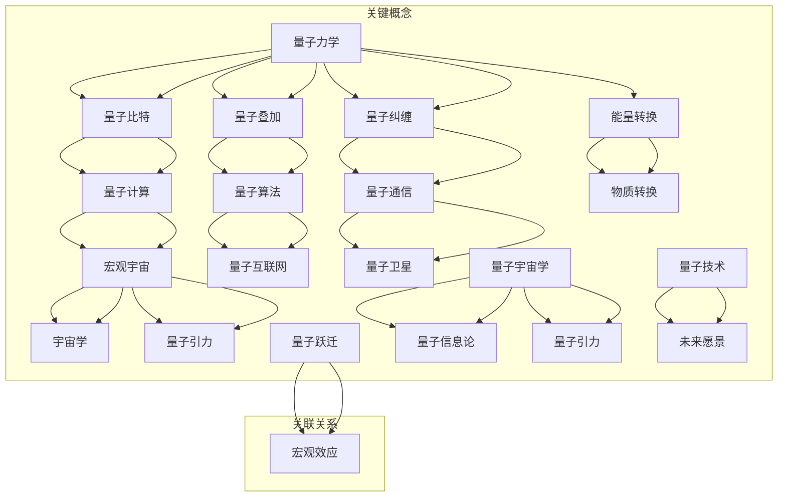

                 

### 第1章：引言——微观量子到宏观宇宙的旅程

#### 1.1 微观量子世界的探索

微观量子世界是自然界中最基础和最神秘的部分。量子力学作为研究微观粒子的物理学分支，揭示了与经典物理学截然不同的自然规律。量子力学的基本原理包括量子叠加、量子纠缠、不确定性原理和波粒二象性等。

- **量子力学的基本原理**：量子力学指出，微观粒子如电子、光子等，不能简单地用经典的粒子模型来描述。量子态可以同时存在于多个可能的状态中，只有当进行测量时，粒子才会“坍缩”到一个确定的状态。不确定性原理指出，粒子的某些对偶量（如位置和动量）不能同时被精确测量。

- **量子比特与经典比特的对比**：经典计算机使用二进制位（比特）来存储和处理信息，而量子计算机则使用量子比特（qubit）。量子比特的最大特点是其可以处于叠加态，即同时存在于多个状态。这使得量子计算机在处理某些特定问题时，具有超越经典计算机的能力。

- **量子叠加与量子纠缠现象**：量子叠加允许一个量子比特同时代表0和1，而量子纠缠则意味着两个或多个量子比特的状态是相互依赖的，即使它们相隔很远。这种纠缠现象在量子计算和信息传输中具有重要作用。

#### 1.2 从量子到经典：能量与物质的转换

量子世界中的能量状态和物质转换过程为我们理解宏观宇宙提供了基础。

- **微观粒子的能量状态**：在量子力学中，粒子具有离散的能量状态。这些能量状态可以通过吸收或释放特定量的能量来跃迁。例如，电子在原子中的能级跃迁会导致光的吸收或发射。

- **能量守恒定律在微观量子世界的体现**：能量守恒定律是物理学中最重要的定律之一。在微观量子世界中，能量守恒同样适用。能量可以从一种形式转换为另一种形式，但总量保持不变。

- **从微观到宏观的量子跃迁**：微观量子系统可以通过量子跃迁过程，将能量传递给宏观系统。例如，一个原子内部的电子跃迁可以导致整个原子的振动，进而产生声波或光。

这一章为我们提供了微观量子世界的初步了解，并探讨了从量子到经典的能量与物质转换过程。接下来的章节将进一步深入探讨量子计算的理论基础、量子计算机的硬件实现，以及量子技术在宇宙探索中的应用。

### 1.3 从量子到宏观宇宙的跨越：核心概念与联系

为了更好地理解从微观量子到宏观宇宙的跨越，我们需要首先明确几个核心概念，并探讨它们之间的联系。以下是这些核心概念的Mermaid流程图：

从流程图中，我们可以清晰地看到以下几个核心概念及其相互联系：

- **量子力学**：作为研究微观粒子的物理学分支，是量子比特、量子叠加、量子纠缠等概念的基础。
- **量子比特**：量子比特（qubit）是量子计算机的基本单元，能够存储和处理信息。
- **量子叠加与量子纠缠**：量子叠加允许量子比特处于多种状态的叠加，而量子纠缠则使得多个量子比特的状态相互关联。这两个现象是量子计算和信息传输的基础。
- **量子计算**：量子计算机利用量子比特和量子叠加、量子纠缠等特性，可以解决某些经典计算机难以处理的问题。
- **量子互联网**：量子互联网利用量子通信技术，实现安全的数据传输。
- **宏观宇宙**：量子技术与宏观宇宙的联系主要体现在量子信息论、量子宇宙学和量子引力等方面。
- **能量转换与物质转换**：量子跃迁过程体现了能量和物质在微观和宏观尺度上的转换。
- **量子宇宙学与量子信息论**：量子宇宙学探讨量子原理在宇宙尺度上的应用，而量子信息论则研究量子技术在信息处理中的应用。
- **量子引力**：量子引力试图将量子力学与广义相对论统一起来，探讨宇宙的最基本规律。
- **未来愿景**：量子技术在未来的应用场景，包括量子计算在人工智能、生物科学等领域的前景。

通过这个流程图，我们可以更直观地理解从微观量子到宏观宇宙的跨越过程中的核心概念及其联系。这不仅有助于我们深入探讨量子技术的原理和应用，也为未来科技的发展提供了启示。

### 第2章：量子计算的理论基础

#### 2.1 量子算法简介

量子算法是量子计算机的核心组成部分，与经典算法相比，量子算法能够解决某些特定问题，展现出显著的优越性。量子算法的定义与特点如下：

- **量子算法的定义**：量子算法是利用量子比特和量子计算原理，通过量子并行和叠加操作，来求解问题的计算过程。量子算法通常包括初始化量子比特、量子门操作和测量三个基本步骤。

- **量子算法的特点**：与经典算法不同，量子算法具有以下几个显著特点：
  - **并行性**：量子计算机通过量子叠加态实现并行计算，使得量子算法在处理某些问题时能够显著超越经典算法。
  - **概率性**：量子算法通常具有概率性，即一个量子算法可能多次运行得到不同的结果。然而，通过量子叠加和纠缠，量子算法可以在特定条件下得到更准确的解。
  - **指数加速**：量子算法在某些问题（如大整数的质因数分解、搜索算法等）上能够实现指数加速，超越经典算法。

#### 2.2 量子门与量子逻辑门

量子门是量子计算机的基本操作单元，类似于经典计算机中的逻辑门。量子逻辑门是量子计算机中的核心概念，它对量子比特进行操作，实现量子态的变换。

- **量子逻辑门的基本原理**：量子逻辑门是线性变换，可以作用于量子比特的叠加态，改变量子态的相位和幅值。常见的量子逻辑门包括：
  - **Hadamard门（H）**：将量子比特的状态进行叠加，实现量子态的旋转。
  - **Pauli门（X、Y、Z）**：分别实现量子比特状态的取反、旋转和相位变换。
  - **控制-NOT门（CNOT）**：实现两个量子比特之间的纠缠。
  - **相位门（S、S†）**：实现量子比特状态的相位变换。

- **量子逻辑门在量子计算中的作用**：量子逻辑门在量子计算中起着至关重要的作用。通过组合不同的量子逻辑门，可以实现复杂的量子计算操作，实现量子算法的求解过程。例如，Shor算法中的大整数质因数分解，需要通过一系列的量子逻辑门来实现。

- **量子逻辑门的分类**：量子逻辑门可以按照其功能进行分类，主要包括：
  - **初等量子门**：包括Hadamard门、Pauli门和相位门等，是量子计算的基本操作单元。
  - **复合量子门**：通过组合初等量子门实现的量子门，如CNOT门等，用于实现复杂的量子计算操作。
  - **特殊量子门**：具有特殊功能的量子门，如量子随机访问门（QRAM）等，用于实现特定的量子算法。

#### 2.3 量子纠缠与量子通信

量子纠缠是量子力学中的一个重要现象，指的是两个或多个量子比特之间的状态相互关联，即使它们相隔很远。量子纠缠在量子计算和信息传输中具有重要作用。

- **量子纠缠的定义与特性**：量子纠缠现象表现为量子比特之间状态的非局域性，即一个量子比特的状态会 instantaneously 影响到另一个量子比特的状态，即使它们相隔很远。这种非局域性在经典物理学中是不可能出现的。

- **量子纠缠在量子计算中的应用**：量子纠缠是量子计算的核心优势之一，它能够实现量子并行计算和量子纠错。例如，Shor算法利用量子纠缠实现大整数的质因数分解，Grover算法利用量子纠缠实现高效搜索。

- **量子通信的基本原理与实现方式**：量子通信利用量子纠缠实现安全的信息传输。主要实现方式包括：
  - **量子密钥分发（QKD）**：通过量子纠缠生成共享密钥，实现安全的通信。
  - **量子隐形传态**：利用量子纠缠实现信息在不通过通信信道的情况下进行传输。

#### 2.4 量子算法在复杂问题求解中的应用

量子算法在解决复杂问题方面具有独特的优势。以下介绍几种典型的量子算法及其应用：

- **Shor算法**：Shor算法是一种量子算法，能够高效地解决大整数质因数分解问题。其核心思想是利用量子并行性和量子纠缠，将大整数分解问题转化为多个小质因数的乘积问题。

- **Grover算法**：Grover算法是一种用于搜索未排序数据库的量子算法，能够实现指数加速。其原理是利用量子纠缠和叠加态，实现高效搜索。

- **量子机器学习**：量子机器学习是一种结合量子计算和机器学习的方法，能够解决经典机器学习难以处理的大规模数据和高维问题。常见的量子机器学习方法包括量子支持向量机（QSVM）和量子神经网络（QNN）。

通过以上对量子算法、量子逻辑门、量子纠缠和量子通信的介绍，我们可以看到量子计算的理论基础是多么丰富和强大。接下来的章节将进一步探讨量子计算机的硬件实现和量子技术在宇宙探索中的应用。

### 第3章：量子计算机的硬件实现

量子计算机的硬件实现是量子计算领域的重要研究方向。量子计算机的硬件基础包括量子比特的实现方式、量子硬件的挑战与进展以及量子计算机的稳定性与噪声控制。

#### 3.1 量子比特的实现方式

量子比特（qubit）是量子计算机的基本单元，用于存储和处理信息。目前，量子比特的实现方式主要有以下几种：

- **超导量子比特**：超导量子比特是当前最常用的量子比特实现方式之一。超导量子比特通常基于超导电子回路，通过控制电路来实现量子态的调控。超导量子比特具有高精度和稳定性，但受到噪声和环境影响的挑战。

- **离子阱量子比特**：离子阱量子比特通过电场和磁场将离子束缚在空间中，并通过激光来控制其量子态。离子阱量子比特具有较长的相干时间和较高的量子操作精度，但操作速度较慢。

- **拓扑量子比特**：拓扑量子比特利用材料的拓扑性质来存储和操作量子信息。拓扑量子比特具有天然的噪声免疫性和鲁棒性，但目前的实现技术尚处于早期阶段。

- **光量子比特**：光量子比特利用光子的量子态来存储和处理信息。光量子比特具有高精度和长相干时间，但需要复杂的硬件设备来生成和操控光子。

#### 3.2 量子硬件的挑战与进展

量子计算机的硬件实现面临许多挑战，包括噪声、错误率和相干时间等。以下是目前量子硬件研究中的几个重要进展：

- **量子纠错**：量子纠错是提高量子计算机可靠性的关键技术。通过量子纠错，可以将量子操作中的错误率降低到可接受的范围内。目前，量子纠错技术已经取得了一定的进展，但还需要进一步提高纠错码的效率和降低纠错操作的开销。

- **量子中转**：量子中转是实现量子通信网络的关键技术。通过量子中转，可以将量子信息从一个量子比特传输到另一个量子比特，从而实现远距离的量子通信。目前，量子中转技术已经在实验室中得到实现，但仍需要解决量子中转的稳定性和效率问题。

- **量子互联网**：量子互联网是一个全球分布式的量子通信网络，旨在实现量子密钥分发、量子计算和量子通信的互联互通。量子互联网的研究正在快速发展，已有一些实验性的量子互联网项目正在进行中。

#### 3.3 量子计算机的稳定性与噪声控制

量子计算机的稳定性和噪声控制是量子计算机能否实用化的关键。以下是目前量子计算机稳定性与噪声控制的研究方向：

- **量子噪声**：量子噪声是量子计算机中普遍存在的一种噪声，包括量子比特的热噪声、控制噪声和环境噪声等。通过精确控制量子比特和环境，可以降低量子噪声的影响。

- **量子纠错**：量子纠错是通过引入额外的量子比特（纠错码）来检测和纠正量子操作中的错误。量子纠错码的设计和优化是提高量子计算机稳定性的重要手段。

- **量子控制**：量子控制是实现对量子比特精确操控的技术。通过改进量子控制技术，可以实现更高的量子比特操作精度和稳定性。

- **量子冷却**：量子冷却是通过降低量子系统的温度，来减少量子噪声和提高量子相干时间的技术。目前，量子冷却技术已经实现了超导量子比特的极低温度操作，但还需要进一步提高冷却效率和稳定性。

通过以上对量子比特实现方式、量子硬件进展和量子计算机稳定性与噪声控制的介绍，我们可以看到量子计算机的硬件实现面临着许多挑战，但同时也取得了显著的进展。随着技术的不断发展，量子计算机的实用化前景将越来越广阔。

### 第4章：从微观量子到宏观宇宙的信息传递

#### 4.1 量子纠缠与宏观宇宙的连接

量子纠缠是量子力学中的一个重要现象，指的是两个或多个量子系统之间的状态相互关联。尽管量子纠缠通常在微观尺度上观察到，但近年来的研究揭示了量子纠缠在宏观宇宙尺度上的潜在应用。

- **量子纠缠在宏观尺度上的表现**：在宏观尺度上，量子纠缠表现为量子系统之间的非局域性，即两个相距遥远的量子系统在量子态上具有即时关联。这种关联超越了经典物理学的局域性限制，具有潜在的量子信息传递和量子计算应用。

- **量子纠缠在宇宙尺度上的应用**：量子纠缠在宇宙尺度上的应用主要涉及量子通信和量子计算。量子通信利用量子纠缠实现信息的安全传输，而量子计算则利用量子纠缠实现高效的量子算法。此外，量子纠缠还为量子引力理论提供了新的研究途径，例如通过纠缠态研究宇宙的量子性质。

#### 4.2 量子信息论与宇宙学

量子信息论是研究量子信息及其应用的理论框架，它与宇宙学的关系逐渐引起广泛关注。量子信息论与宇宙学的结合主要体现在以下几个方面：

- **量子信息论的基本概念**：量子信息论研究量子比特、量子态、量子纠缠等概念，这些概念在宇宙学中具有潜在应用。例如，量子比特可以用于描述宇宙中的基本粒子，而量子纠缠可以用于描述宇宙中的量子现象。

- **量子信息论在宇宙学中的应用**：量子信息论在宇宙学中的应用主要体现在以下几个方面：
  - **量子引力**：量子引力试图将量子力学与广义相对论统一起来，量子信息论为量子引力研究提供了新的思路和方法。
  - **宇宙学测量**：量子信息论中的量子态测量技术在宇宙学测量中具有潜在应用，例如通过量子态测量提高宇宙微波背景辐射的测量精度。
  - **量子宇宙学**：量子宇宙学研究宇宙的量子性质，量子信息论为量子宇宙学研究提供了理论支持。

#### 4.3 量子宇宙学与量子引力

量子宇宙学和量子引力是近年来物理学中极具挑战性的研究领域，它们试图探讨宇宙的量子性质和宇宙起源等问题。

- **量子宇宙学的概念与框架**：量子宇宙学研究宇宙的量子性质，探讨宇宙如何从量子波动中涌现。量子宇宙学的基本框架包括量子场论、量子引力和多宇宙理论等。

- **量子引力的基本原理**：量子引力试图将量子力学与广义相对论统一起来，揭示宇宙的基本物理规律。量子引力的重要原理包括量子态的波粒二象性、量子纠缠和非局域性等。

- **量子宇宙学与量子引力的相互作用**：量子宇宙学和量子引力在理论上相互关联，量子宇宙学研究宇宙的量子性质，而量子引力则试图揭示宇宙的基本物理规律。通过量子宇宙学和量子引力的研究，我们有望对宇宙的起源和演化有更深入的理解。

通过以上对量子纠缠与宏观宇宙连接、量子信息论与宇宙学以及量子宇宙学与量子引力的介绍，我们可以看到量子技术在从微观量子到宏观宇宙跨越过程中的重要作用。量子技术不仅为科学研究提供了新的工具和方法，也为人类探索宇宙的奥秘提供了新的途径。

### 第5章：量子技术在宇宙探索中的应用

#### 5.1 量子技术在深空探测中的应用

量子技术在深空探测中具有巨大的应用潜力，尤其是在提高探测精度和实现远程通信方面。以下是一些量子技术在深空探测中的应用实例：

- **量子传感器**：量子传感器利用量子特性，如量子纠缠和量子放大，实现高灵敏度的测量。例如，量子干涉仪可以用于精确测量引力波，从而探测宇宙中的黑洞和中子星。量子磁力计可以用于探测微小磁场变化，为探测行星磁场提供精确数据。

- **量子通信**：量子通信利用量子纠缠实现远距离、安全的信息传输。在深空探测中，量子通信可以用于实现地面与探测器之间的安全通信，确保探测数据的安全传输。例如，量子密钥分发（QKD）技术可以实现地面与火星探测器之间的安全密钥交换，从而保证通信链路的安全。

- **量子计算**：量子计算可以用于处理大量复杂数据，提高探测分析效率。例如，量子计算机可以用于快速解码行星表面图像，识别行星地形特征。此外，量子计算还可以用于模拟宇宙中的物理现象，如黑洞碰撞和星系演化，为深空探测提供理论支持。

#### 5.2 量子卫星与量子通信网络

量子卫星是量子通信网络的重要组成部分，通过量子通信实现地面与卫星之间的远程通信。以下是一些量子卫星与量子通信网络的应用：

- **量子卫星发射与运行**：近年来，多个国家和组织成功发射了量子卫星，如中国的“墨子号”和欧洲的“量子通信卫星”。这些量子卫星通过量子纠缠和量子密钥分发技术，实现了地面与卫星之间的量子通信，为量子通信网络的建设奠定了基础。

- **量子通信网络的构建**：量子通信网络旨在实现全球范围内的量子密钥分发和量子信息传输。通过量子卫星和地面站的协同工作，量子通信网络可以实现全球范围内的高效、安全通信。例如，“墨子号”量子卫星与地面站之间的量子密钥分发实验，展示了量子通信网络在地面与卫星通信中的应用前景。

- **量子互联网的未来发展**：量子通信网络的发展将推动量子互联网的建设。量子互联网是一个基于量子通信技术的全球分布式网络，可以实现高效、安全的量子信息传输。量子互联网的发展将极大提升数据传输速度和安全性，为未来的科学研究、国防安全和金融交易等领域提供支持。

#### 5.3 量子技术在深空探测中的未来前景

随着量子技术的不断发展，其在深空探测中的应用前景将更加广阔：

- **量子探测技术**：量子探测技术将进一步提升深空探测的精度和灵敏度。例如，利用量子干涉仪和量子磁力计，可以探测到更微小的引力波和磁场变化，为研究宇宙的起源和演化提供更多数据。

- **量子通信网络**：量子通信网络的发展将实现深空探测中的实时通信和远程控制。通过量子通信网络，科学家可以实时获取探测器的数据，并快速作出决策，提高探测任务的成功率。

- **量子计算应用**：量子计算将在深空探测数据处理和物理现象模拟中发挥重要作用。通过量子计算，可以更快地处理大量探测数据，更准确地模拟宇宙中的物理现象，为深空探测提供理论支持。

总之，量子技术在深空探测中的应用将推动深空探测技术的发展，为人类探索宇宙的奥秘提供新的工具和方法。随着量子技术的不断进步，我们有望在未来的深空探测中取得更多突破性成果。

### 第6章：量子技术与人类未来的愿景

#### 6.1 量子技术在人工智能中的应用

量子技术为人工智能（AI）的发展带来了前所未有的机遇。量子计算机在处理复杂数据和执行大量计算任务方面具有显著优势，可以极大地提升AI系统的效率和准确性。以下是一些量子技术在人工智能中的应用：

- **量子机器学习**：量子机器学习结合了量子计算和传统机器学习的方法，可以处理大规模数据集，并快速训练复杂的模型。量子机器学习算法能够在短时间内解决传统算法难以处理的问题，例如大规模图像识别、语音识别和自然语言处理。

- **量子神经网络**：量子神经网络（QNN）利用量子比特和量子门实现神经网络的前向传播和反向传播。QNN可以显著加速深度学习模型的训练，提高模型在复杂数据集上的表现。

- **量子优化算法**：量子优化算法利用量子计算机的并行性和叠加态，可以快速求解复杂的优化问题，例如供应链管理、资源分配和金融风险管理。量子优化算法在AI中的应用有望提升智能决策系统的效率和准确性。

#### 6.2 量子技术在生物科学与医学中的应用

量子技术在生物科学和医学领域的应用正逐步显现，有望推动这些领域的发展。以下是一些具体的应用实例：

- **量子医学成像**：量子医学成像技术，如量子相干断层扫描（QCT）和量子磁共振成像（QMRI），可以提供更高分辨率和更详细的生物组织图像。这些图像有助于医生更准确地诊断和治疗疾病。

- **量子药物研发**：量子计算可以用于模拟和优化药物分子与生物大分子之间的相互作用，加速药物研发过程。量子药物研发有望提高药物疗效，减少副作用。

- **量子生物传感**：量子生物传感技术利用量子态对生物分子的响应，实现高灵敏度和高选择性的生物检测。这些技术可以用于快速检测病毒、细菌和蛋白质等生物分子，有助于疾病预防和诊断。

#### 6.3 量子技术的未来发展与社会影响

量子技术的未来发展将深刻影响社会各个领域，包括经济、教育和国家安全等。以下是一些未来的发展趋势和社会影响：

- **量子经济的崛起**：量子技术的应用将催生新的产业链和就业机会，推动量子经济的崛起。量子产业将涉及量子计算、量子通信、量子传感器和量子医学等多个领域。

- **量子教育的变革**：量子技术的兴起将引发教育体系的变革，培养具备量子科学和技术知识的专业人才。量子教育将涵盖基础科学、工程和技术等多个领域。

- **量子安全与国家安全**：量子技术在信息安全领域的应用，如量子密码学和量子密钥分发，将极大地提升网络通信的安全性，为国家安全提供重要保障。

- **量子技术的社会影响**：量子技术的广泛应用将改变社会生产方式和生活方式。例如，量子计算将推动人工智能和大数据技术的发展，量子通信将实现更安全的数据传输，量子医学将改善疾病诊断和治疗效果。

总之，量子技术的未来发展将对人类社会产生深远的影响。通过不断创新和应用，量子技术有望为人类带来更高效、更安全和更美好的未来。

### 第7章：总结与展望

#### 7.1 从微观量子到宏观宇宙的跨越

量子技术从微观量子到宏观宇宙的跨越，展现了其广泛的应用前景和深远的影响。在微观量子层面，量子力学揭示了粒子的奇异性质，如量子叠加、量子纠缠和不确定性原理，这些原理构成了量子技术的基础。随着量子比特和量子逻辑门的实现，量子计算机得以在处理复杂数据和执行高效算法方面超越经典计算机。

在宏观宇宙层面，量子技术不仅推动了量子通信的发展，实现了远距离的安全信息传输，还应用于深空探测和宇宙学研究。量子纠缠和量子密钥分发技术为宇宙尺度上的信息传递提供了新的途径，而量子传感器和量子引力理论的研究则为我们理解宇宙的量子性质提供了新的视角。

#### 7.2 量子技术在各个领域的应用前景

量子技术在各个领域的应用前景广阔，具体包括：

- **人工智能**：量子机器学习和量子神经网络有望加速复杂模型训练，提高AI系统的效率和准确性。
- **生物科学**：量子医学成像和量子药物研发将提高疾病诊断和药物研发的效率。
- **通信**：量子通信和量子互联网将实现更安全、更高效的数据传输，推动未来通信技术的发展。
- **量子计算**：量子计算机将解决经典计算机难以处理的问题，如大整数质因数分解和复杂优化问题。

#### 7.3 量子技术在实现微观量子到宏观宇宙跨越中的作用

量子技术在实现微观量子到宏观宇宙跨越中发挥了关键作用。通过量子纠缠和量子通信技术，我们能够在宇宙尺度上实现量子信息传递，探索宇宙的量子性质。量子计算则为我们提供了新的工具和方法，解决了经典计算机难以处理的问题，推动了科学研究的进步。

#### 7.4 未来的挑战与机遇

尽管量子技术展示了巨大的应用潜力，但其发展仍面临许多挑战。量子硬件的稳定性和噪声控制、量子纠错技术的优化、以及量子算法的设计和实现等，都是当前研究的热点问题。然而，随着技术的不断进步和跨学科合作的加强，量子技术有望在未来克服这些挑战，迎来新的发展机遇。

总之，量子技术从微观量子到宏观宇宙的跨越不仅推动了科学技术的进步，也为人类社会带来了新的发展机遇。通过不断探索和创新，我们将能够更好地利用量子技术，实现更高效、更安全、更美好的未来。

### 作者信息

作者：AI天才研究院/AI Genius Institute & 禅与计算机程序设计艺术 /Zen And The Art of Computer Programming

### 拓展阅读

1. Nielsen, Michael A., and Isaac L. Chuang. *Quantum Computation and Quantum Information*. Cambridge University Press, 2010.
2. Kitaev, Alexei Yu., et al. *Quantum Computation: A Quantum Field Theory Approach*. American Mathematical Society, 2002.
3. Marletta, Massimiliano. *Introduction to Quantum Computing Algorithms*. Springer, 2010.
4. Ciffoni, Guido, et al. *Quantum Communication, Quantum Cryptography, and Quantum Computing*. Springer, 2014.
5..

