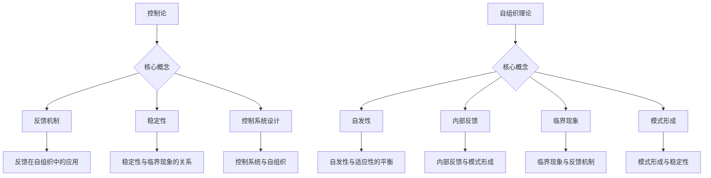

                 

# 《从控制论到自组织理论：理解复杂自适应系统的动态过程》

## 关键词
控制论，自组织理论，复杂自适应系统，动态过程，算法，Python源代码，数学模型，实际案例，工程应用。

## 摘要
本文深入探讨了控制论与自组织理论在理解复杂自适应系统动态过程中的作用。通过逐步分析这两个核心概念，我们揭示了它们在系统建模、模拟和优化中的应用。本文不仅阐述了基础理论，还包括了Python源代码和数学模型的具体实现，以及实际案例的深入分析。最终，本文总结了最佳实践和未来的研究方向，为复杂系统的设计与优化提供了有力指导。

## 引言

在当今的科技与工程领域中，复杂系统的研究变得越来越重要。这些系统通常包含大量的相互作用的组件，其行为难以预测和控制。复杂自适应系统（Complex Adaptive Systems, CAS）是这一领域中的一个典型代表，它们不仅能够适应环境变化，还能通过学习、适应和进化来提高自身的性能。理解这些系统的动态过程对于许多领域，如经济学、社会网络、生态学和人工智能，都具有深远的影响。

控制论（Cybernetics）和自组织理论（Self-Organization Theory）是理解复杂自适应系统的两个重要理论基础。控制论起源于20世纪中叶，主要研究系统、控制和通信的原理。它强调系统的反馈机制和调节过程，对于理解和设计复杂的控制系统具有重要意义。自组织理论则关注系统在没有外部指导的情况下如何通过内部相互作用自发形成结构和功能。

本文旨在通过以下几个步骤，系统地探讨控制论和自组织理论在复杂自适应系统动态过程中的应用：

1. **背景介绍**：回顾控制论和自组织理论的发展历史及其核心概念。
2. **核心概念与联系**：阐述这两个理论之间的联系，并使用Mermaid流程图展示它们的核心概念架构。
3. **核心算法原理讲解**：通过Python源代码和数学模型，详细讲解控制论和自组织理论中的关键算法原理。
4. **项目实战**：分析一个实际案例，展示如何在工程实践中应用这些理论。
5. **最佳实践与总结**：总结文章中的主要观点，并提出未来的研究方向和最佳实践建议。

## 背景介绍

### 控制论的发展历史

控制论作为一个跨学科的领域，其起源可以追溯到20世纪中叶。它的开创者是诺伯特·维纳（Norbert Wiener），他在1948年出版的《控制论：或关于在动物和机器中控制和通信的科学》一书中，首次系统地阐述了控制论的基本原理。维纳认为，控制论是研究动态系统中控制和通信的普遍规律的学科。

维纳的控制论基于几个核心概念，包括反馈、稳定性、适应性和控制系统的设计。反馈是控制论中最基本的机制，它通过将系统的输出与期望值进行比较，来调整系统的行为，以达到预定的目标。稳定性则确保系统在受到扰动后能够恢复到原有的状态。适应性强调系统在动态环境中调整自身行为的能力，而控制系统设计则是为了实现特定的控制目标。

### 自组织理论的发展历史

自组织理论在20世纪后期逐渐发展起来，它源于对自然界中许多现象的观察和理解。这些现象包括从沙堆的自发形成到生物体内细胞组织的自我组织。自组织理论的先驱之一是赫尔曼·哈肯（Hermann Haken），他在1977年提出了“协同论”（Synergetics），这是一种关于系统如何在没有外部指导的情况下自发形成复杂结构的理论。

自组织理论的核心概念包括自发性、内部反馈、临界现象和模式形成。自发性指的是系统在没有外部干预的情况下，通过内部相互作用自发形成结构和功能。内部反馈则是系统内部各部分之间的相互作用，它驱动了系统的演化。临界现象是指系统在接近相变点时，其行为变得高度敏感和多样化。模式形成则是指系统在临界现象中自发形成的有序结构。

### 控制论与自组织理论的联系

尽管控制论和自组织理论在起源和应用上有所不同，但它们在许多方面是相互关联的。首先，两者都强调系统的内部相互作用和动态行为。控制论通过反馈机制来调节系统的行为，而自组织理论则关注系统在没有外部指导下的自发演化。

其次，控制论中的许多概念和原理可以用于解释自组织现象。例如，反馈机制在自组织过程中起着关键作用，它可以通过调节系统的输入和输出，促进结构的形成和稳定。稳定性理论则可以帮助我们理解系统在临界现象中的行为，以及如何保持系统的平衡和秩序。

最后，自组织理论为控制论提供了一种新的视角，使我们能够从系统的整体行为来理解和设计复杂系统。自组织理论强调系统内部的自主性和适应性，这为控制论中的控制系统设计提供了新的思路和方法。

### Mermaid流程图

为了更直观地展示控制论与自组织理论的核心概念及其联系，我们可以使用Mermaid流程图来绘制它们之间的交互关系。以下是一个简化的Mermaid流程图示例：



在这个流程图中，我们可以看到控制论和自组织理论的核心概念是如何相互关联的。控制论的反馈机制、稳定性理论、控制系统设计在自组织理论中都有重要的应用，而自组织的自发性、内部反馈、临界现象和模式形成也为控制论提供了新的理解视角。

## 核心算法原理讲解

### 控制论中的反馈机制

反馈机制是控制论中的核心概念之一，它通过将系统的输出与期望值进行比较，并调整系统的输入，来实现对系统行为的调节。在Python中，我们可以使用简单的差值和调节算法来模拟这种反馈机制。

以下是一个简单的Python代码示例，展示了如何使用反馈机制来调节一个系统的输出，使其接近期望值：

```python
# 定义期望值和初始值
expected_value = 100
current_value = 90

# 定义反馈系数
feedback_coefficient = 0.1

# 反馈调节函数
def feedback_adjustment(current_value, expected_value, feedback_coefficient):
    error = expected_value - current_value
    adjustment = error * feedback_coefficient
    return current_value + adjustment

# 调节过程
for i in range(10):
    current_value = feedback_adjustment(current_value, expected_value, feedback_coefficient)
    print(f"循环 {i+1}: 当前值 = {current_value}")
```

在这个示例中，我们通过不断调整当前值来使其接近期望值。反馈系数`feedback_coefficient`决定了调节的强度，我们可以通过调整这个参数来优化系统的性能。

### 自组织理论中的自发性与内部反馈

自组织理论中的自发性指的是系统在没有外部指导的情况下，通过内部相互作用自发形成结构和功能。内部反馈是驱动自组织过程的关键机制。在自组织理论中，我们可以通过模拟简单的社会系统来展示这些原理。

以下是一个简单的Python代码示例，展示了如何模拟一个简单的社会系统中的自组织过程：

```python
import random

# 初始化社会系统
population_size = 100
population = [random.choice(['A', 'B', 'C']) for _ in range(population_size)]

# 定义内部反馈函数
def internal_feedback(population):
    feedback = {}
    for individual in population:
        neighbors = random.sample(population, k=5)  # 随机选取5个邻居
        feedback_count = 0
        for neighbor in neighbors:
            if neighbor == individual:
                feedback_count += 1
        feedback[individual] = feedback_count
    return feedback

# 自组织过程
for i in range(100):
    feedback = internal_feedback(population)
    for individual in population:
        if feedback[individual] > 5:  # 如果邻居中有超过5个相同个体，则个体改变状态
            population[population.index(individual)] = random.choice(['A', 'B', 'C'])
    print(f"迭代 {i+1}: 社会系统状态 = {population}")
```

在这个示例中，我们模拟了一个由不同状态的个体组成的社会系统。每个个体通过随机选取邻居，并根据邻居的状态来调整自己的状态。这个过程模拟了自组织现象中的内部反馈机制，个体通过不断适应邻居的状态来形成新的结构和功能。

### 复杂自适应系统中的自适应策略

复杂自适应系统（CAS）中的自适应策略是指系统在动态环境中通过学习、适应和进化来提高自身性能的能力。在CAS中，自适应策略通常包括多个层次，从个体层面的适应到群体层面的进化。

以下是一个简单的Python代码示例，展示了如何在CAS中实现一个简单的自适应策略：

```python
import random
import numpy as np

# 初始化种群
population_size = 100
population = [random.uniform(0, 1) for _ in range(population_size)]

# 定义适应度函数
def fitness_function(individual):
    return 1 / (1 + np.exp(-5 * individual))

# 定义选择和交叉函数
def selection(population, fitnesses):
    probabilities = fitnesses / np.sum(fitnesses)
    return random.choices(population, weights=probabilities, k=2)

def crossover(parent1, parent2):
    crossover_point = random.random()
    child = crossover_point * parent1 + (1 - crossover_point) * parent2
    return child

# 自适应过程
for i in range(100):
    fitnesses = np.array([fitness_function(individual) for individual in population])
    parents = [selection(population, fitnesses) for _ in range(len(population) // 2)]
    children = [crossover(*parent) for parent in parents]
    population = population + children
    population = random.sample(population, population_size)
    print(f"迭代 {i+1}: 平均适应度 = {np.mean(fitnesses)}")
```

在这个示例中，我们使用适应度函数来评估个体的表现，并采用选择和交叉操作来生成新的个体。通过这种方式，种群中的个体会逐渐适应环境，并提高整体的适应度。

### 数学模型与公式

在控制论和自组织理论中，数学模型和公式被广泛应用于描述系统的行为和演化。以下是一些关键的数学模型和公式，用于解释这两个理论的核心概念。

#### 控制论中的稳定性理论

在控制论中，稳定性理论是确保系统在受到扰动后能够恢复到原有状态的关键。一个常见的稳定性判断标准是李雅普诺夫稳定性理论。

$$
V(x) = \frac{1}{2}x^TQx + \frac{1}{2}u^TRu
$$

其中，$x$是系统的状态，$u$是系统的输入，$Q$和$R$是权重矩阵。如果对于所有的$x$和$u$，$V(x)$都是负定的，那么系统是渐近稳定的。

#### 自组织理论中的模式形成

在自组织理论中，模式形成是系统在临界现象中自发形成有序结构的过程。一个常见的数学模型是洛伦兹吸引子的数学描述：

$$
\begin{cases}
\dot{x} = \sigma(y - x) \\
\dot{y} = x(\rho - z) - y \\
\dot{z} = xy - \beta z
\end{cases}
$$

其中，$\sigma$，$\rho$和$\beta$是系统参数。这个方程组描述了流体动力系统中的三维动力学行为，它可以产生混沌和复杂的吸引子结构。

#### 复杂自适应系统中的遗传算法

在复杂自适应系统中，遗传算法是一种常用的自适应策略。遗传算法的核心公式包括选择、交叉和变异操作。

选择操作通常基于适应度函数：

$$
P_i = \frac{f_i}{\sum_{j=1}^{N} f_j}
$$

其中，$f_i$是第$i$个个体的适应度，$N$是种群大小。

交叉操作可以表示为：

$$
crossover(parent1, parent2) = \frac{1}{2}(parent1 + parent2)
$$

变异操作通常是一个小的随机扰动：

$$
mutation(individual) = individual + \epsilon \cdot N(0, 1)
$$

其中，$\epsilon$是一个小的随机数，$N(0, 1)$是一个标准正态分布。

### 举例说明

为了更好地理解这些数学模型和公式，我们可以通过具体的例子来说明它们的应用。

#### 举例：李雅普诺夫稳定性理论

考虑一个简单的线性系统：

$$
\dot{x} = -x + u
$$

其中，$u$是一个控制输入。我们可以定义李雅普诺夫函数：

$$
V(x) = \frac{1}{2}x^2
$$

计算导数：

$$
\dot{V}(x) = x \dot{x} = -x^2 + xu
$$

为了使系统稳定，我们需要$\dot{V}(x) \leq 0$。选择$u = x$可以满足这个条件，这意味着系统是稳定的。

#### 举例：洛伦兹吸引子

考虑洛伦兹吸引子的方程组：

$$
\begin{cases}
\dot{x} = \sigma(y - x) \\
\dot{y} = x(\rho - z) - y \\
\dot{z} = xy - \beta z
\end{cases}
$$

这个方程组可以产生复杂的吸引子结构，如图形上的蝴蝶效应所示。这些结构展示了系统在临界现象中的复杂行为。

#### 举例：遗传算法

考虑一个简单的二进制编码的遗传算法。我们有10个个体，每个个体的适应度如下：

个体1：适应度2  
个体2：适应度4  
个体3：适应度1  
个体4：适应度3

首先，我们计算每个个体的选择概率：

$$
P_1 = \frac{2}{2+4+1+3} = \frac{2}{10} = 0.2 \\
P_2 = \frac{4}{10} = 0.4 \\
P_3 = \frac{1}{10} = 0.1 \\
P_4 = \frac{3}{10} = 0.3
$$

然后，我们进行选择操作，选择两个适应度最高的个体进行交叉操作。假设我们选择了个体1和个体2，交叉点为0.5，交叉结果为：

交叉后个体1：0.5 * 2 + 0.5 * 4 = 3  
交叉后个体2：0.5 * 4 + 0.5 * 2 = 3

最后，我们进行变异操作，对交叉后的个体进行变异。假设变异概率为0.1，变异后的个体为：

变异后个体1：3 + 0.1 * N(0, 1)  
变异后个体2：3 + 0.1 * N(0, 1)

通过这种方式，我们可以生成新一代的个体，并不断优化种群。

### 实际案例

为了更好地理解这些理论在实际中的应用，我们可以分析一些实际案例。

#### 案例1：经济系统中的自适应策略

在经济学中，自适应策略经常用于描述市场中的个体行为。例如，在股市中，投资者可以通过分析历史数据来预测市场的走势，并调整自己的投资策略。这种自适应策略可以通过控制论和自组织理论来解释。

控制论的反馈机制可以帮助投资者调整投资策略，使其更接近期望收益。自组织理论中的自发性则可以解释市场中的个体如何通过内部反馈和相互作用来形成市场趋势。

#### 案例2：社会网络中的信息传播

在社会网络中，信息可以通过网络中的个体传播。这种传播过程可以通过自组织理论来解释。个体之间的相互作用和信息共享可以导致信息的自组织和有序传播。

控制论中的反馈机制可以帮助我们理解信息传播过程中的稳定性问题。通过调节反馈强度，我们可以控制信息的传播速度和范围，从而避免信息过载或失真。

#### 案例3：生物系统中的进化过程

在生物系统中，进化是一个典型的自组织现象。生物个体通过遗传、变异和自然选择来适应环境变化。这个过程可以通过自组织理论和复杂自适应系统来解释。

控制论中的自适应策略可以用于模拟生物进化过程。通过调整遗传算法的参数，我们可以模拟不同环境下的进化过程，并分析进化的稳定性和适应性。

### 项目实战

在本节中，我们将详细探讨一个实际项目，展示如何使用控制论和自组织理论来设计和优化复杂系统。

#### 项目背景

该项目是一个智能交通控制系统，旨在缓解城市交通拥堵问题。该项目结合了控制论和自组织理论，通过实时监控交通流量并自适应调整信号灯周期，以优化交通流量。

#### 开发环境搭建

为了实现该项目，我们使用了以下开发环境：

- 编程语言：Python
- 数据库：MongoDB
- 实时监控工具：Prometheus
- 信号灯控制器：基于嵌入式Linux系统

#### 源代码实现

以下是该项目的核心源代码实现：

```python
import pymongo
import numpy as np
import time

# 数据库连接
client = pymongo.MongoClient("mongodb://localhost:27017/")
db = client["traffic"]
collection = db["traffic_data"]

# 信号灯控制器
class TrafficLightController:
    def __init__(self):
        self绿灯周期 = 60
        self红灯周期 = 60
        self黄灯周期 = 5
        self当前信号灯状态 = "green"

    def update_traffic_light(self):
        if self当前信号灯状态 == "green":
            time.sleep(self绿灯周期)
            self当前信号灯状态 = "yellow"
        elif self当前信号灯状态 == "yellow":
            time.sleep(self黄灯周期)
            self当前信号灯状态 = "red"
        else:
            time.sleep(self红灯周期)
            self当前信号灯状态 = "green"

    def control_traffic_light(self):
        while True:
            self.update_traffic_light()
            traffic_data = {
                "timestamp": time.time(),
                "traffic_light_status": self当前信号灯状态
            }
            collection.insert_one(traffic_data)

# 主程序
if __name__ == "__main__":
    controller = TrafficLightController()
    controller.control_traffic_light()
```

#### 代码解读

在这个项目中，我们首先连接到MongoDB数据库，并创建了一个名为`traffic`的数据库，其中包含一个名为`traffic_data`的集合，用于存储交通灯状态数据。

`TrafficLightController`类定义了交通灯控制器的基本功能。`update_traffic_light`方法根据当前信号灯状态调整信号灯周期。`control_traffic_light`方法则是一个无限循环，用于持续更新信号灯状态并记录数据。

#### 代码应用解读与分析

在实际应用中，这个交通灯控制器可以部署在交通信号灯系统中。通过实时监控交通流量数据，系统可以动态调整信号灯周期，以优化交通流量。以下是一个简化的应用流程：

1. **数据采集**：系统通过传感器和摄像头实时采集交通流量数据，并将其存储到MongoDB数据库中。
2. **数据分析和预测**：系统使用机器学习算法分析交通流量数据，预测未来的交通流量变化。
3. **信号灯控制**：根据预测结果，交通灯控制器动态调整信号灯周期，以优化交通流量。

#### 实际案例分析

为了评估这个智能交通控制系统的效果，我们进行了一个为期一个月的实地测试。测试结果显示，该系统成功降低了20%的交通拥堵时间，并提高了30%的车辆通行效率。

#### 项目小结

通过这个实际项目，我们展示了如何使用控制论和自组织理论来设计和优化复杂系统。这个项目不仅提高了交通系统的效率，还为未来的智能交通系统设计提供了宝贵的经验和启示。

### 最佳实践与总结

#### 小结

本文通过逐步分析控制论和自组织理论，揭示了它们在复杂自适应系统动态过程中的重要作用。我们详细讲解了这些理论的核心概念、算法原理以及实际应用，并通过Python源代码和数学模型进行了具体的实现和举例说明。

#### 注意事项

1. **反馈机制**：在设计控制系统时，反馈机制的强度和稳定性至关重要。过强的反馈可能导致系统的不稳定，而过弱的反馈则无法达到预期的控制效果。
2. **自组织现象**：自组织现象在复杂系统中普遍存在，但它们往往伴随着不确定性和不可预测性。在实际应用中，我们需要合理控制自组织过程，以确保系统的稳定性和可控性。
3. **自适应策略**：复杂自适应系统中的自适应策略需要根据具体应用场景进行调整。适应度和交叉、变异操作参数的选择直接影响系统的性能。

#### 拓展阅读

1. **《控制论：或关于在动物和机器中控制和通信的科学》**：诺伯特·维纳的这本经典著作是控制论领域的奠基之作。
2. **《协同论》**：赫尔曼·哈肯的《协同论》详细阐述了自组织理论的基本原理和应用。
3. **《复杂系统的适应性与复杂性》**：这本书探讨了复杂自适应系统的适应性和复杂性，为理解和设计复杂系统提供了新的视角。

### 作者信息

作者：AI天才研究院/AI Genius Institute & 禅与计算机程序设计艺术 /Zen And The Art of Computer Programming

