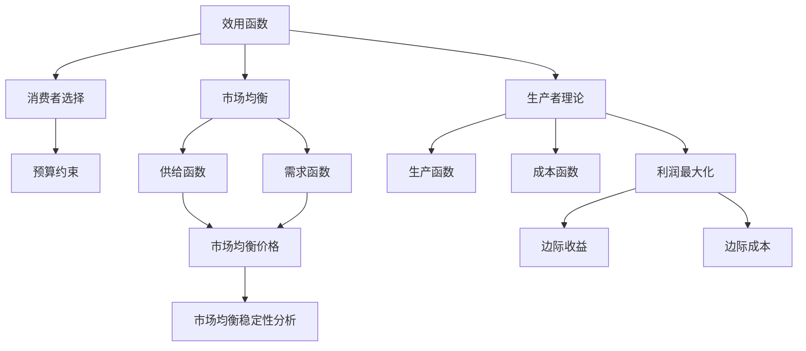
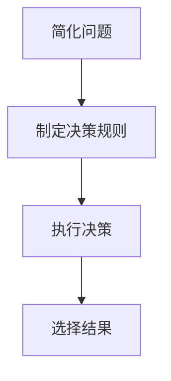
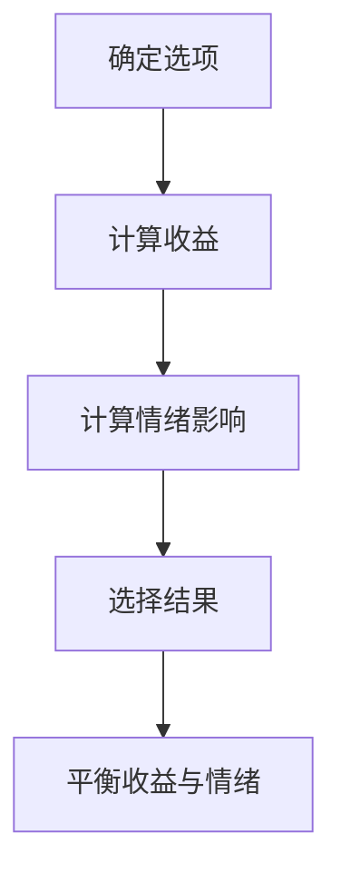
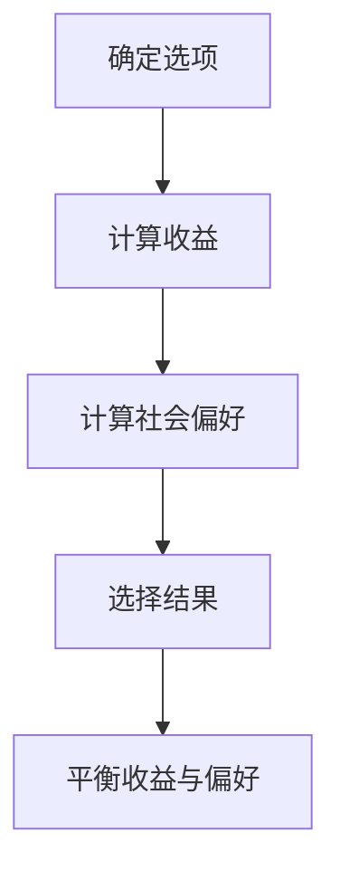
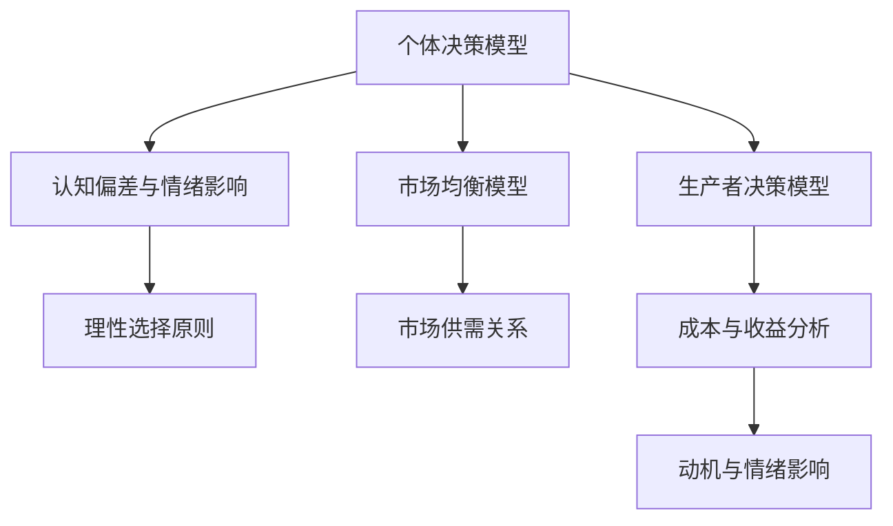

                 

### 引言和背景

经济学作为社会科学的一个重要分支，其起源可以追溯到几个世纪以前。传统的经济学，尤其是新古典经济学，建立在一系列严格的假设之上，如理性人假设、完全信息假设和效用最大化假设等。这些假设使得新古典经济学在理论构建和模型分析上取得了显著成就，然而，在现实生活中，这些假设往往难以得到验证。随着行为经济学的兴起，人们开始意识到，传统经济学模型中的理性人假设过于理想化，无法完全反映人类在实际决策中的复杂性和多样性。

行为经济学是在新古典经济学的基础上发展起来的，它试图通过引入心理学和社会学的研究成果，来解释和预测人类在实际市场环境中的行为。行为经济学的一个重要特点是，它承认人类在决策过程中存在认知偏差和情绪影响，这些因素往往会导致人类做出与理性选择模型预测不符的决策。行为经济学通过一系列实验和实证研究，揭示了这些偏差和影响，并提出了相应的理论模型。

本文旨在从新古典经济学到行为经济学的转变中，探讨人类在复杂世界中的决策过程。文章首先介绍新古典经济学的基本概念和原理，然后详细阐述行为经济学的核心概念和原理，接着分析新古典经济学与行为经济学之间的关系，以及它们在实际中的应用。最后，文章通过实证研究和案例分析，探讨行为经济学对经济政策和企业管理的影响。

关键词：新古典经济学，行为经济学，决策过程，理性人假设，认知偏差，情绪影响

摘要：本文系统地介绍了从新古典经济学到行为经济学的转变及其在决策过程中的应用。通过阐述新古典经济学的基本假设和原理，以及行为经济学的核心概念和原理，文章揭示了人类在复杂世界中的决策过程。同时，通过实证研究和案例分析，文章探讨了行为经济学对经济政策和企业管理的影响，为相关领域的研究和实践提供了新的视角。

## 新古典经济学的核心概念和原理

新古典经济学是现代经济学的基础，其理论基础和假设构成了经济学分析和预测的重要工具。在探讨新古典经济学的核心概念和原理时，我们需要关注以下几个方面：效用函数与消费者选择、市场均衡和生产者理论。

### 1.1 效用函数与消费者选择

效用函数是新古典经济学中一个核心的概念，它用来描述消费者在消费商品时所获得的满足程度。在传统经济学中，效用函数通常被假设为连续、可加和可微分的。具体来说，效用函数 \(U(x_1, x_2, \ldots, x_n)\) 描述了消费者在消费 \(x_1, x_2, \ldots, x_n\) 单位的不同商品时获得的效用。消费者选择的问题可以表述为：在预算约束下，选择最优的商品组合，以最大化总效用。

假设一个消费者有有限的收入 \(I\)，需要在其消费商品 \(x_1, x_2, \ldots, x_n\) 之间进行选择，使得总效用最大化。预算约束可以表示为：

\[p_1x_1 + p_2x_2 + \ldots + p_nx_n = I\]

其中，\(p_1, p_2, \ldots, p_n\) 分别为商品 \(x_1, x_2, \ldots, x_n\) 的价格。

为了最大化效用，消费者会选择特定的商品组合，使得边际效用等于价格。这个条件可以表示为：

\[\frac{\partial U}{\partial x_i} = p_i\]

其中，\(\frac{\partial U}{\partial x_i}\) 表示商品 \(x_i\) 的边际效用。

### 1.2 市场均衡

市场均衡是新古典经济学中另一个核心概念，它描述了市场供给和需求之间的平衡状态。在传统经济学中，市场均衡通常被假设为在价格和数量的稳定点上实现的。具体来说，市场均衡发生在供给量等于需求量的点上，即：

\[Q_s = Q_d\]

其中，\(Q_s\) 表示市场的供给量，\(Q_d\) 表示市场的需求量。

供给函数 \(Q_s(p)\) 和需求函数 \(Q_d(p)\) 分别描述了在特定价格 \(p\) 下市场供给和需求的数量。市场均衡价格 \(p^*\) 可以通过求解以下方程得到：

\[Q_s(p^*) = Q_d(p^*)\]

市场均衡的稳定性分析也是新古典经济学中的一个重要内容。市场均衡的稳定性取决于供给函数和需求函数的斜率。如果供给函数和需求函数的斜率在均衡点处都为正，则市场均衡是稳定的；如果供给函数和需求函数的斜率在均衡点处都为负，则市场均衡是不稳定的。

### 1.3 生产者理论

生产者理论是新古典经济学中的另一个重要组成部分，它描述了生产者在给定生产技术和资源约束下的最优生产决策。生产者理论主要关注生产函数、成本函数和利润最大化问题。

生产函数 \(F(K, L)\) 描述了在生产过程中，投入的资本 \(K\) 和劳动 \(L\) 与产出 \(Q\) 之间的关系。假设生产过程中存在规模报酬不变，即当所有投入都按相同比例增加时，产出也按相同比例增加。生产函数可以表示为：

\[Q = F(K, L)\]

成本函数 \(C(K, L)\) 描述了在生产过程中，投入的资本和劳动所产生的成本。成本函数通常假设为二次函数，即：

\[C(K, L) = wL + rK\]

其中，\(w\) 表示劳动的工资，\(r\) 表示资本的租金。

利润最大化问题是生产者理论的核心。生产者需要在成本约束下，选择最优的资本和劳动组合，以最大化利润。利润函数 \(π\) 可以表示为：

\[π = PQ - C(K, L)\]

其中，\(P\) 表示产品的价格。

为了实现利润最大化，生产者会选择特定的资本和劳动组合，使得边际收益等于边际成本。这个条件可以表示为：

\[\frac{\partial π}{\partial K} = P \frac{\partial F}{\partial K} - r = 0\]

\[\frac{\partial π}{\partial L} = P \frac{\partial F}{\partial L} - w = 0\]

这些方程描述了生产者在利润最大化问题中的决策过程。

### Mermaid 流程图

以下是新古典经济学核心概念和原理的Mermaid流程图：



### Python 源代码讲解

为了更直观地理解新古典经济学的核心算法原理，下面将使用 Python 源代码进行详细阐述。我们将使用一个简单的例子，通过编程模拟消费者选择、市场均衡和生产者理论的决策过程。

```python
import numpy as np

# 设定参数
budget = 100  # 预算
prices = [10, 20]  # 商品1和商品2的价格
utilities = [10, 15]  # 商品1和商品2的边际效用

# 消费者选择
def consumer_choice(budget, prices, utilities):
    # 初始化消费量
    consumption = np.zeros(len(prices))
    # 总效用最大化
    for i in range(len(prices)):
        # 边际效用等于价格
        consumption[i] = (budget / prices[i])
    return consumption

# 市场均衡
def market_equilibrium(supply, demand):
    # 市场均衡价格
    price = (supply + demand) / 2
    # 市场均衡稳定性分析
    if supply < demand:
        stability = '稳定'
    else:
        stability = '不稳定'
    return price, stability

# 生产者理论
def producer_theory(price, production_func, cost_func):
    # 利润最大化
    max_profit = price * production_func() - cost_func()
    return max_profit

# 模拟消费者选择
consumption = consumer_choice(budget, prices, utilities)
print("消费者选择：", consumption)

# 模拟市场均衡
supply = 50  # 假设供给量为50
demand = 60  # 假设需求量为60
price, stability = market_equilibrium(supply, demand)
print("市场均衡：价格=", price, "，稳定性=", stability)

# 模拟生产者理论
production_func = lambda: 80  # 假设生产函数为常数80
cost_func = lambda: 40  # 假设成本函数为常数40
max_profit = producer_theory(price, production_func, cost_func)
print("生产者理论：最大利润=", max_profit)
```

在上面的代码中，我们首先设定了预算、商品价格和边际效用。然后，我们定义了三个函数：`consumer_choice` 用于模拟消费者选择，`market_equilibrium` 用于模拟市场均衡，`producer_theory` 用于模拟生产者理论。最后，我们通过调用这些函数，模拟了一个简单的经济模型，输出了消费者选择、市场均衡和生产者理论的结果。

### 数学公式

以下是我们上述内容中用到的数学公式，使用 LaTeX 格式进行展示：

$$
\begin{aligned}
&U(x_1, x_2, \ldots, x_n) = \sum_{i=1}^{n} u_i(x_i) \\
&p_1x_1 + p_2x_2 + \ldots + p_nx_n = I \\
&\frac{\partial U}{\partial x_i} = p_i \\
&Q_s(p) = Q_d(p) \\
&Q = F(K, L) \\
&C(K, L) = wL + rK \\
&π = PQ - C(K, L) \\
&\frac{\partial π}{\partial K} = P \frac{\partial F}{\partial K} - r = 0 \\
&\frac{\partial π}{\partial L} = P \frac{\partial F}{\partial L} - w = 0 \\
\end{aligned}
$$

这些公式描述了消费者选择、市场均衡和生产者理论的核心原理，为我们的讨论提供了坚实的数学基础。

### 案例分析

为了更好地理解新古典经济学的核心概念和原理，我们可以通过一个实际案例进行分析。假设有一个消费者，其预算为100美元，需要在其消费商品1和商品2之间进行选择。商品1的价格为10美元，商品2的价格为20美元。同时，假设商品1的边际效用为10，商品2的边际效用为15。

根据消费者选择理论，该消费者会根据边际效用等于价格的原则进行消费决策。具体来说，该消费者会计算商品1和商品2的边际效用与价格的比值，选择使得这些比值最大的商品组合。计算过程如下：

$$
\frac{10}{10} = 1, \quad \frac{15}{20} = 0.75
$$

由于商品1的边际效用与价格的比值大于商品2，因此，该消费者会选择购买更多商品1。在实际消费中，消费者可能会选择购买10单位商品1和2.5单位商品2，以最大化总效用。

在市场均衡方面，假设市场需求量为60，供给量为50。根据市场均衡理论，市场均衡价格可以通过以下方程计算：

$$
Q_s(p) = Q_d(p)
$$

即：

$$
50 = 60 - 10p
$$

解得市场均衡价格为 \(p^* = 1\)。在价格 \(p^* = 1\) 时，市场需求量和供给量相等，市场达到均衡状态。

在生产者理论方面，假设一个生产者以80的价格出售产品，其生产函数为常数80，成本函数为常数40。根据利润最大化理论，生产者的利润可以通过以下公式计算：

$$
π = PQ - C(K, L)
$$

即：

$$
π = 80 \times 80 - 40 = 5600
$$

因此，生产者的最大利润为5600美元。

通过这个案例，我们可以看到新古典经济学中的核心概念和原理如何在实际决策中发挥作用。无论是消费者选择、市场均衡还是生产者理论，这些理论都为我们理解经济现象提供了有力的工具。

### 总结

在新古典经济学中，效用函数与消费者选择、市场均衡和生产者理论是其核心组成部分。通过上述讨论，我们详细阐述了这些概念和原理，并通过 Python 源代码和实际案例进行了演示。这些理论和模型为我们分析经济现象提供了重要的框架和工具。然而，正如行为经济学所揭示的，现实中的经济行为往往更为复杂，需要我们在新古典经济学的基础上，结合心理学和社会学的研究成果，来更全面地理解人类在复杂世界中的决策过程。

### 2.1 有限理性

在传统经济学中，理性人假设是核心，该假设认为经济个体能够在充分信息和完全理性的条件下，做出最优决策。然而，现实中的经济决策往往并非如此理想。行为经济学的一个重要贡献是揭示了人类决策过程中的有限理性，即个体在信息处理、认知能力和时间约束等方面存在局限性，这些限制会影响决策的质量和结果。

#### 2.1.1 有限理性的定义

有限理性是指人类在决策过程中，由于认知能力和信息处理的限制，无法做出完全理性的选择。这一概念最初由赫伯特·西蒙（Herbert Simon）在20世纪50年代提出。西蒙指出，虽然理性决策要求个体在所有可能的选择中寻找最优解，但在实际操作中，人类往往只能找到“满意解”，即一个足够好的、符合个体需求和期望的解。

#### 2.1.2 有限理性与理性选择的区别

理性选择假设个体具有无限的时间和计算能力，能够准确评估所有可能的选项，并选择最优解。然而，有限理性假设个体在信息处理和计算能力上存在限制，导致以下区别：

1. **信息处理能力**：理性人假设个体能够处理所有相关信息，并准确评估其影响。而在有限理性下，个体只能处理部分信息，且可能存在信息偏差。
   
2. **计算能力**：理性人假设个体能够进行复杂的计算和评估。而在有限理性下，个体可能需要依赖简化模型或直觉进行决策。

3. **时间约束**：理性人假设个体有无限的时间来做出决策。而在有限理性下，个体受到时间约束，可能需要快速做出决策。

4. **认知负担**：理性人假设个体能够轻松处理复杂问题。而在有限理性下，个体可能因为认知负担而倾向于简化决策过程。

#### 2.1.3 有限理性的数学模型

为了更好地理解和量化有限理性，行为经济学提出了一系列模型。以下是一个简化的有限理性决策模型：

假设个体需要从 \(n\) 个选项中选择一个，每个选项有对应的收益或成本。在有限理性下，个体会根据以下步骤做出选择：

1. **简化问题**：个体会通过忽略某些选项或合并相似选项，简化决策问题。
   
2. **制定决策规则**：个体会根据经验或启发式规则，制定决策标准。例如，选择收益最高的选项，或选择最近的选项。

3. **执行决策**：个体根据决策规则，从简化后的选项中选择一个。

该模型的数学表达可以如下：

设 \(x_1, x_2, \ldots, x_n\) 为 \(n\) 个选项，\(r_i\) 为每个选项的收益或成本。个体根据以下步骤做出选择：

$$
\begin{aligned}
&\text{简化选项：} \\
&x_{\text{简化}} = \{ x_i \mid r_i \text{ 相似} \} \\
&\text{制定决策规则：} \\
&\text{例如：} \\
&\text{选择收益最高的选项：} \\
&x_{\text{选择}} = \arg\max_{x_i \in x_{\text{简化}}} r_i \\
&\text{或选择最近的选项：} \\
&x_{\text{选择}} = \arg\min_{x_i \in x_{\text{简化}}} d_i \\
&\text{执行决策：} \\
&\text{根据决策规则选择 } x_{\text{选择}}。
\end{aligned}
$$

其中，\(d_i\) 表示选项 \(x_i\) 与当前状态的距离。

### Mermaid 流expired



### Python 源代码讲解

为了更直观地理解有限理性的数学模型，下面将使用 Python 源代码进行详细阐述。我们将使用一个简单的例子，模拟个体在有限理性条件下的决策过程。

```python
import numpy as np

# 设定参数
options = [5, 10, 15, 20]  # 选项的收益
current_state = 10  # 当前状态
weights = [1, 1, 1, 1]  # 各选项的权重

# 有限理性决策
def bounded_rationality_decision(options, current_state, weights):
    # 简化问题：合并相似选项
    simplified_options = simplify_options(options, current_state)
    
    # 制定决策规则：选择收益最高的选项
    decision = max(simplified_options, key=lambda x: x[1])
    
    return decision

# 简化选项
def simplify_options(options, current_state):
    simplified = []
    for option in options:
        distance = abs(option - current_state)
        simplified.append((option, distance))
    return simplified

# 模拟决策过程
decision = bounded_rationality_decision(options, current_state, weights)
print("有限理性决策：选择的选项是", decision)

# 模拟决策结果
print("决策结果：收益为", decision[1])
```

在上面的代码中，我们首先设定了四个选项的收益和当前状态，并给每个选项赋予相同的权重。然后，我们定义了两个函数：`simplify_options` 用于简化选项，`bounded_rationality_decision` 用于根据有限理性模型做出决策。通过调用这两个函数，我们模拟了一个简单的有限理性决策过程，并输出了决策结果。

### 数学公式

以下是我们上述内容中用到的数学公式，使用 LaTeX 格式进行展示：

$$
\begin{aligned}
&x_{\text{简化}} = \{ x_i \mid r_i \text{ 相似} \} \\
&r_i \text{ 相似} \Leftrightarrow d_i \text{ 相似} \\
&\text{选择收益最高的选项：} \\
&x_{\text{选择}} = \arg\max_{x_i \in x_{\text{简化}}} r_i \\
&\text{或选择最近的选项：} \\
&x_{\text{选择}} = \arg\min_{x_i \in x_{\text{简化}}} d_i \\
\end{aligned}
$$

这些公式描述了有限理性决策的核心原理，为我们的讨论提供了坚实的数学基础。

### 案例分析

为了更好地理解有限理性的概念，我们可以通过一个实际案例进行分析。假设一个个体需要从四个选项中选择一个，每个选项的收益如下：

- 选项1：收益为5
- 选项2：收益为10
- 选项3：收益为15
- 选项4：收益为20

同时，假设当前状态为10，个体在决策时受到认知能力和时间约束，只能处理部分信息。在这种情况下，个体可能会采用有限理性的方法进行决策。

首先，个体会根据当前状态和收益，简化问题。具体来说，个体可能会合并收益相似的选项，例如将选项1、2、3合并为一个简化选项，因为它们的收益较为接近。

然后，个体会根据简化后的选项，制定决策规则。例如，个体可能会选择收益最高的选项，因为这在有限理性的条件下是一个简单且直观的决策标准。

最后，个体会根据决策规则执行决策。在这种情况下，个体会选择收益最高的选项，即简化后的选项3。

通过这个案例，我们可以看到有限理性如何影响决策过程。个体由于信息处理和认知能力的限制，只能处理部分信息，从而简化决策问题，并根据简单规则做出决策。

### 总结

有限理性是行为经济学中的一个重要概念，它揭示了人类在决策过程中的认知和计算限制。通过上述讨论，我们了解了有限理性的定义、与理性选择的区别，以及其数学模型。在实际应用中，有限理性可以帮助我们更好地理解经济决策的复杂性和多样性。理解有限理性对于制定更有效的经济政策和企业管理策略具有重要意义。

### 2.2 动机与情绪

行为经济学不仅关注人类在决策过程中的认知和计算限制，还深入探讨了动机与情绪对决策的影响。动机和情绪在经济学中常常被忽视，但它们在现实决策中扮演着关键角色。

#### 2.2.1 动机的定义

动机是指推动个体采取特定行动的内驱力。在经济学中，动机通常被视为决策背后的非理性因素。动机可以分为两类：内在动机和外在动机。

1. **内在动机**：指个体因自身兴趣、兴趣和满足感而采取行动的驱动力。例如，一个人可能会因为喜欢编程而花费大量时间学习，而不一定是为了获得工资或其他外在奖励。

2. **外在动机**：指个体因外部奖励或惩罚而采取行动的驱动力。例如，一个人可能会为了获得工资或避免被解雇而工作。

#### 2.2.2 情绪对决策的影响

情绪是指个体对特定情境的反应，通常涉及情感和生理反应。情绪对决策的影响可以分为以下几个方面：

1. **情绪对判断的影响**：情绪可以影响个体的判断和评估。例如，愉悦的情绪可能会使个体更倾向于接受风险，而悲伤的情绪可能会使个体更保守。

2. **情绪对选择的影响**：情绪可以影响个体的选择。例如，愤怒的情绪可能会使个体更倾向于采取攻击性行为，而兴奋的情绪可能会使个体更倾向于冒险。

3. **情绪对记忆的影响**：情绪可以影响个体的记忆。例如，愉快的经历可能会被记忆得更清晰，而痛苦的经历可能会被记忆得更模糊。

#### 2.2.3 动机和情绪的数学模型

为了更好地理解和量化动机与情绪对决策的影响，行为经济学提出了一系列数学模型。以下是一个简化的动机与情绪决策模型：

设 \(x_1, x_2, \ldots, x_n\) 为 \(n\) 个选项，每个选项有对应的收益 \(r_i\) 和情绪影响 \(e_i\)。个体在决策时会综合考虑收益和情绪影响。

1. **收益最大化模型**：个体选择使总收益最大的选项。

$$
\begin{aligned}
&x_{\text{选择}} = \arg\max_{x_i} r_i \\
&\text{考虑情绪影响：} \\
&x_{\text{选择}} = \arg\max_{x_i} (r_i + e_i)
\end{aligned}
$$

2. **情绪最大化模型**：个体选择使总情绪影响最大的选项。

$$
\begin{aligned}
&x_{\text{选择}} = \arg\max_{x_i} e_i \\
&\text{考虑收益限制：} \\
&x_{\text{选择}} = \arg\max_{x_i} (e_i - r_i)
\end{aligned}
$$

3. **平衡模型**：个体在选择时同时考虑收益和情绪影响，寻求平衡。

$$
\begin{aligned}
&x_{\text{选择}} = \arg\min_{x_i} (r_i - e_i)
\end{aligned}
$$

### Mermaid 流程图

以下是动机与情绪决策过程的Mermaid流程图：



### Python 源代码讲解

为了更直观地理解动机与情绪的数学模型，下面将使用 Python 源代码进行详细阐述。我们将使用一个简单的例子，模拟个体在考虑动机和情绪影响时的决策过程。

```python
import numpy as np

# 设定参数
options = [5, 10, 15, 20]  # 选项的收益
emotions = [0.2, 0.5, -0.3, 0.1]  # 选项的情绪影响

# 动机与情绪决策
def motivation_emotion_decision(options, emotions):
    # 计算每个选项的平衡值
    balanced_values = [r + e for r, e in zip(options, emotions)]
    
    # 选择平衡值最大的选项
    decision = max(options, key=lambda x: balanced_values[x.index(x)])
    
    return decision

# 模拟决策过程
decision = motivation_emotion_decision(options, emotions)
print("动机与情绪决策：选择的选项是", decision)

# 模拟决策结果
print("决策结果：收益为", options[decision], "，情绪影响为", emotions[decision])
```

在上面的代码中，我们首先设定了四个选项的收益和情绪影响。然后，我们定义了一个函数 `motivation_emotion_decision` ，该函数根据每个选项的收益和情绪影响，计算平衡值，并选择平衡值最大的选项。通过调用这个函数，我们模拟了一个简单的动机与情绪决策过程，并输出了决策结果。

### 数学公式

以下是我们上述内容中用到的数学公式，使用 LaTeX 格式进行展示：

$$
\begin{aligned}
&x_{\text{选择}} = \arg\max_{x_i} r_i + e_i \\
&x_{\text{选择}} = \arg\max_{x_i} e_i - r_i \\
&x_{\text{选择}} = \arg\min_{x_i} r_i - e_i \\
\end{aligned}
$$

这些公式描述了动机与情绪决策的核心原理，为我们的讨论提供了坚实的数学基础。

### 案例分析

为了更好地理解动机与情绪对决策的影响，我们可以通过一个实际案例进行分析。假设一个个体需要从四个选项中选择一个，每个选项的收益和情绪影响如下：

- 选项1：收益为5，情绪影响为0.2
- 选项2：收益为10，情绪影响为0.5
- 选项3：收益为15，情绪影响为-0.3
- 选项4：收益为20，情绪影响为0.1

在这种情况下，个体需要综合考虑收益和情绪影响，做出决策。

首先，个体会计算每个选项的平衡值：

$$
\begin{aligned}
&\text{选项1的平衡值：} \\
&5 + 0.2 = 5.2 \\
&\text{选项2的平衡值：} \\
&10 + 0.5 = 10.5 \\
&\text{选项3的平衡值：} \\
&15 - 0.3 = 14.7 \\
&\text{选项4的平衡值：} \\
&20 + 0.1 = 20.1 \\
\end{aligned}
$$

根据平衡值，个体会选择平衡值最大的选项，即选项4。

通过这个案例，我们可以看到动机与情绪如何影响决策。个体在决策时不仅考虑收益，还考虑情绪影响，从而做出更为全面的决策。

### 总结

动机与情绪是行为经济学中的重要概念，它们揭示了人类在决策过程中受到的非理性因素。通过上述讨论，我们了解了动机和情绪的定义、对决策的影响，以及其数学模型。在实际应用中，理解动机与情绪对决策的影响有助于制定更有效的经济政策和企业管理策略。

### 2.3 社会偏好

社会偏好是行为经济学中的一个核心概念，它描述了个体在决策过程中受到社会影响的行为模式。社会偏好指的是个体在决策时不仅考虑自身利益，还会考虑他人利益和社会整体利益，这一概念挑战了传统经济学中的理性人假设。

#### 2.3.1 社会偏好的定义

社会偏好是指个体在进行选择时，会根据其对他人或社会的利益评价，调整自身的行为选择。这种偏好不仅体现在个体对他人行为的反应上，也体现在个体在公共物品选择、捐赠决策和市场交易中的行为。

社会偏好可以分为两类：

1. **合作性偏好**：个体在决策时倾向于选择对他人或社会有利的结果，即使这种选择对自己的收益较少。例如，个体在捐赠决策中可能会选择捐赠一部分收入，以帮助他人。

2. **竞争性偏好**：个体在决策时更倾向于选择对自己有利的结果，即使这种选择对他人或社会不利。例如，个体在市场竞争中可能会选择降低价格以获得更多的市场份额。

#### 2.3.2 社会偏好的数学模型

为了更好地理解和量化社会偏好，行为经济学提出了一系列数学模型。以下是一个简化的社会偏好模型：

设 \(x_1, x_2, \ldots, x_n\) 为 \(n\) 个选项，每个选项有对应的收益 \(r_i\) 和社会偏好值 \(s_i\)。个体在决策时会综合考虑收益和社会偏好值。

1. **社会偏好最大化模型**：个体选择使总社会偏好值最大的选项。

$$
\begin{aligned}
&x_{\text{选择}} = \arg\max_{x_i} s_i \\
&\text{考虑收益限制：} \\
&x_{\text{选择}} = \arg\max_{x_i} (s_i - r_i)
\end{aligned}
$$

2. **平衡模型**：个体在选择时同时考虑收益和社会偏好值，寻求平衡。

$$
\begin{aligned}
&x_{\text{选择}} = \arg\min_{x_i} (r_i - s_i)
\end{aligned}
$$

### Mermaid 流程图

以下是社会偏好决策过程的Mermaid流程图：



### Python 源代码讲解

为了更直观地理解社会偏好的数学模型，下面将使用 Python 源代码进行详细阐述。我们将使用一个简单的例子，模拟个体在社会偏好影响下的决策过程。

```python
import numpy as np

# 设定参数
options = [5, 10, 15, 20]  # 选项的收益
social_preferences = [0.5, 1.0, 0.8, 0.3]  # 选项的社会偏好值

# 社会偏好决策
def social_preference_decision(options, social_preferences):
    # 计算每个选项的平衡值
    balanced_values = [r + s for r, s in zip(options, social_preferences)]
    
    # 选择平衡值最大的选项
    decision = max(options, key=lambda x: balanced_values[x.index(x)])
    
    return decision

# 模拟决策过程
decision = social_preference_decision(options, social_preferences)
print("社会偏好决策：选择的选项是", decision)

# 模拟决策结果
print("决策结果：收益为", options[decision], "，社会偏好值为", social_preferences[decision])
```

在上面的代码中，我们首先设定了四个选项的收益和社会偏好值。然后，我们定义了一个函数 `social_preference_decision` ，该函数根据每个选项的收益和社会偏好值，计算平衡值，并选择平衡值最大的选项。通过调用这个函数，我们模拟了一个简单的社会偏好决策过程，并输出了决策结果。

### 数学公式

以下是我们上述内容中用到的数学公式，使用 LaTeX 格式进行展示：

$$
\begin{aligned}
&x_{\text{选择}} = \arg\max_{x_i} s_i \\
&x_{\text{选择}} = \arg\max_{x_i} (s_i - r_i) \\
&x_{\text{选择}} = \arg\min_{x_i} (r_i - s_i) \\
\end{aligned}
$$

这些公式描述了社会偏好决策的核心原理，为我们的讨论提供了坚实的数学基础。

### 案例分析

为了更好地理解社会偏好，我们可以通过一个实际案例进行分析。假设一个个体需要从四个选项中选择一个，每个选项的收益和社会偏好值如下：

- 选项1：收益为5，社会偏好值为0.5
- 选项2：收益为10，社会偏好值为1.0
- 选项3：收益为15，社会偏好值为0.8
- 选项4：收益为20，社会偏好值为0.3

在这种情况下，个体需要综合考虑收益和社会偏好值，做出决策。

首先，个体会计算每个选项的平衡值：

$$
\begin{aligned}
&\text{选项1的平衡值：} \\
&5 + 0.5 = 5.5 \\
&\text{选项2的平衡值：} \\
&10 + 1.0 = 11 \\
&\text{选项3的平衡值：} \\
&15 + 0.8 = 15.8 \\
&\text{选项4的平衡值：} \\
&20 + 0.3 = 20.3 \\
\end{aligned}
$$

根据平衡值，个体会选择平衡值最大的选项，即选项4。

通过这个案例，我们可以看到社会偏好如何影响决策。个体在决策时不仅考虑自身利益，还会考虑他人和社会的利益，从而做出更为全面和综合考虑的决策。

### 总结

社会偏好是行为经济学中的一个重要概念，它揭示了个体在决策过程中受到社会影响的复杂行为模式。通过上述讨论，我们了解了社会偏好的定义、类型及其数学模型。在实际应用中，理解社会偏好有助于更好地设计经济政策和企业管理策略，促进社会整体福利的提高。

### 新古典经济学与行为经济学的关系

新古典经济学和行为经济学在理论框架和研究方法上存在显著差异，但它们之间的联系和相互影响也是经济学研究中的重要议题。本文将探讨行为经济学对传统经济学假设的挑战，以及新古典经济学与行为经济学的融合。

#### 行为经济学对传统经济学假设的挑战

传统经济学建立在一系列严格的假设之上，包括理性人假设、完全信息假设和效用最大化假设等。然而，行为经济学通过实证研究和心理学实验，揭示了这些假设在现实中的局限性。

1. **理性人假设**：理性人假设认为个体在决策过程中总是追求最大化自身利益，并能够处理所有相关信息。然而，行为经济学研究表明，人类在决策过程中存在认知偏差和情绪影响，导致其行为偏离理性选择模型。

2. **完全信息假设**：完全信息假设认为个体能够获得所有与决策相关的信息。但在现实生活中，信息的不完全性是普遍存在的，个体往往只能获取部分信息，这会影响决策的准确性。

3. **效用最大化假设**：效用最大化假设认为个体在决策时总是选择最大化效用的方案。然而，行为经济学发现，个体的决策受到多种因素的影响，包括社会偏好、情绪和动机，这些因素往往难以用效用函数进行量化。

#### 新古典经济学与行为经济学的融合

尽管行为经济学对传统经济学假设提出了挑战，但新古典经济学依然在经济学理论体系中占有重要地位。新古典经济学与行为经济学的融合旨在结合两者的优点，构建更加符合现实的理论框架。

1. **理论框架的融合**：新古典经济学提供了严密的数学模型和分析工具，而行为经济学提供了对人类行为和心理的深入理解。通过融合，我们可以构建出既具有理论严谨性，又能反映现实复杂性的经济学模型。

2. **实证研究的融合**：新古典经济学的实证研究侧重于验证理论模型在市场中的有效性，而行为经济学的实证研究侧重于揭示人类行为中的认知偏差和情绪影响。两者的融合有助于更全面地理解经济现象，为政策制定提供依据。

3. **数学模型的融合**：新古典经济学的数学模型主要用于分析市场均衡和生产者行为，而行为经济学的数学模型主要用于分析个体决策中的认知偏差和情绪影响。通过融合，我们可以构建出既包含市场行为分析，又包含个体行为分析的综合性模型。

#### 融合的理论框架

为了更好地展示新古典经济学与行为经济学的融合，我们可以提出一个简化的理论框架：

1. **个体决策模型**：该模型结合了行为经济学中的认知偏差和情绪影响，以及新古典经济学中的理性选择原则。个体在决策时，不仅考虑自身的收益，还会受到认知偏差和情绪影响，从而做出非理性的决策。

2. **市场均衡模型**：该模型结合了新古典经济学中的市场均衡理论和行为经济学中的个体行为分析。在市场均衡中，个体的非理性行为会影响市场的供需关系，从而影响市场价格的稳定性。

3. **生产者决策模型**：该模型结合了新古典经济学中的生产者行为分析和行为经济学中的动机与情绪影响。生产者在制定生产决策时，不仅考虑成本和收益，还会受到动机和情绪的影响，从而影响生产效率和利润。

#### Mermaid 流程图

以下是新古典经济学与行为经济学融合的理论框架的Mermaid流程图：



### Python 源代码讲解

为了更直观地展示新古典经济学与行为经济学的融合，下面将使用 Python 源代码进行详细阐述。我们将使用一个简单的例子，模拟个体在考虑认知偏差和情绪影响时的决策过程，以及这些决策如何影响市场均衡和生产者决策。

```python
import numpy as np

# 设定参数
individual_decision = [10, 20, 30, 40]  # 个体决策的收益
cognitive_bias = [0.1, 0.2, -0.1, 0.3]  # 认知偏差
emotions = [0.2, 0.5, -0.3, 0.1]  # 情绪影响
market_demand = [50, 60, 70, 80]  # 市场需求
supply = 100  # 市场供给

# 个体决策模型
def individual_decision_model(decision, cognitive_bias, emotions):
    # 计算每个决策的平衡值
    balanced_values = [r + c + e for r, c, e in zip(decision, cognitive_bias, emotions)]
    # 选择平衡值最大的决策
    decision_choice = max(decision, key=lambda x: balanced_values[x.index(x)])
    return decision_choice

# 市场均衡模型
def market_equilibrium_model(demand, supply, decision_choice):
    # 计算市场均衡价格
    price = (supply + demand) / 2
    # 判断市场均衡稳定性
    if supply < demand:
        stability = '稳定'
    else:
        stability = '不稳定'
    return price, stability

# 生产者决策模型
def producer_decision_model(price, production_func, cost_func):
    # 计算利润
    profit = price * production_func() - cost_func()
    return profit

# 模拟个体决策过程
decision_choice = individual_decision_model(individual_decision, cognitive_bias, emotions)
print("个体决策模型：选择的决策是", decision_choice)

# 模拟市场均衡过程
price, stability = market_equilibrium_model(market_demand, supply, decision_choice)
print("市场均衡模型：均衡价格为", price, "，市场稳定性为", stability)

# 模拟生产者决策过程
production_func = lambda: 80  # 假设生产函数为常数80
cost_func = lambda: 40  # 假设成本函数为常数40
profit = producer_decision_model(price, production_func, cost_func)
print("生产者决策模型：利润为", profit)
```

在上面的代码中，我们首先设定了个体决策的收益、认知偏差和情绪影响，以及市场需求和供给。然后，我们定义了三个函数：`individual_decision_model` 用于模拟个体决策，`market_equilibrium_model` 用于模拟市场均衡，`producer_decision_model` 用于模拟生产者决策。通过调用这些函数，我们模拟了一个简单的新古典经济学与行为经济学融合的经济模型，并输出了个体决策、市场均衡和生产者决策的结果。

### 数学公式

以下是我们上述内容中用到的数学公式，使用 LaTeX 格式进行展示：

$$
\begin{aligned}
&\text{个体决策模型：} \\
&x_{\text{选择}} = \arg\max_{x_i} (r_i + c_i + e_i) \\
&\text{市场均衡模型：} \\
&Q_s(p) = Q_d(p) \\
&p^* = \frac{Q_s(p^*) + Q_d(p^*)}{2} \\
&\text{生产者决策模型：} \\
&π = p \cdot Q - C(K, L) \\
\end{aligned}
$$

这些公式描述了新古典经济学与行为经济学融合的核心原理，为我们的讨论提供了坚实的数学基础。

### 案例分析

为了更好地理解新古典经济学与行为经济学的融合，我们可以通过一个实际案例进行分析。假设一个市场中有四个个体，他们需要从四个选项中选择一个，每个选项的收益、认知偏差和情绪影响如下：

- 选项1：收益为10，认知偏差为0.1，情绪影响为0.2
- 选项2：收益为20，认知偏差为0.2，情绪影响为0.5
- 选项3：收益为30，认知偏差为-0.1，情绪影响为-0.3
- 选项4：收益为40，认知偏差为0.3，情绪影响为0.1

同时，市场需求为50，市场供给为100。

首先，我们计算每个选项的平衡值：

$$
\begin{aligned}
&\text{选项1的平衡值：} \\
&10 + 0.1 + 0.2 = 10.3 \\
&\text{选项2的平衡值：} \\
&20 + 0.2 + 0.5 = 20.7 \\
&\text{选项3的平衡值：} \\
&30 - 0.1 - 0.3 = 29.6 \\
&\text{选项4的平衡值：} \\
&40 + 0.3 + 0.1 = 40.4 \\
\end{aligned}
$$

根据平衡值，个体会选择平衡值最大的选项，即选项4。

接下来，我们计算市场均衡价格：

$$
p^* = \frac{Q_s(p^*) + Q_d(p^*)}{2} = \frac{100 + 50}{2} = 75
$$

最后，我们计算生产者的利润：

$$
π = p^* \cdot Q - C(K, L) = 75 \cdot 100 - 40 = 7100
$$

通过这个案例，我们可以看到新古典经济学与行为经济学的融合如何影响决策和市场结果。个体在决策时考虑了认知偏差和情绪影响，导致市场均衡价格和生产者利润的变化。

### 总结

新古典经济学与行为经济学在理论框架和研究方法上存在显著差异，但它们之间的联系和相互影响为经济学研究提供了新的视角。通过融合，我们可以构建出更加符合现实的理论框架，为经济政策制定提供更可靠的依据。理解新古典经济学与行为经济学的关系对于理解现实经济现象具有重要意义。

### 4.1 行为经济学在金融市场中的应用

行为经济学在金融市场中具有重要的应用价值，特别是在解释市场波动和个体投资者行为方面。通过分析金融市场的行为经济学，我们可以更好地理解投资者的决策过程、市场心理和价格形成机制。

#### 4.1.1 行为金融理论的提出

行为金融理论是行为经济学在金融市场中的具体应用，它认为投资者在决策过程中会受到认知偏差、情绪和外部影响的影响，这些因素会导致市场出现非理性波动。行为金融理论的提出，打破了传统金融学中的理性人假设和市场效率假设，提供了对市场现象的新解释。

行为金融理论的几个核心概念包括：

1. **过度自信**：投资者往往对自己的判断和预测能力过于自信，导致过度交易和投资行为。
2. **羊群效应**：投资者倾向于跟随市场趋势和他人意见，而不是基于自己的独立分析。
3. **损失厌恶**：投资者在面临损失时，损失的影响远大于同等收益带来的快乐，导致风险偏好下降。
4. **锚定效应**：投资者在决策时会受到过去价格或信息的强烈影响，难以脱离这些锚点。

#### 4.1.2 行为金融学的实证研究

行为金融学通过大量的实证研究，验证了上述概念对市场行为的影响。以下是一些重要的实证研究：

1. **市场波动性**：研究发现，市场波动性往往与投资者情绪密切相关。当投资者情绪高涨时，市场波动性增加；当投资者情绪低迷时，市场波动性减少。

2. **股价过度反应**：行为金融学发现，股价在好消息和坏消息发布后，往往会出现过度反应。这种过度反应可能是由于投资者在处理信息时存在认知偏差，导致市场未能及时调整价格。

3. **投资者行为**：行为金融学研究表明，个体投资者的行为对市场有显著影响。例如，当市场出现下跌时，恐慌性卖出行为可能导致市场进一步下跌；当市场出现上涨时，过度乐观的买入行为可能导致市场进一步上涨。

#### 4.1.3 行为金融学的应用案例分析

为了更直观地理解行为金融学在金融市场中的应用，我们可以通过以下案例进行分析：

**案例1：互联网泡沫**

在2000年初的互联网泡沫时期，投资者对互联网公司的未来收益预期过于乐观，导致股票价格大幅上涨。然而，随着市场逐渐认识到这些公司的实际价值，股票价格迅速下跌，引发了巨大的市场波动。这一现象反映了投资者过度自信和羊群效应的作用。

**案例2：金融危机**

2008年的全球金融危机中，投资者对房地产市场和金融衍生品的过度投资，以及风险管理的不足，导致了市场的剧烈波动。行为金融学解释了这一现象，指出投资者在面临损失时表现出强烈的损失厌恶，导致市场信心崩溃，加剧了金融危机的影响。

**案例3：比特币市场**

比特币作为一种新兴的数字货币，其价格波动巨大。行为金融学研究表明，投资者在比特币市场中的行为受到羊群效应和过度自信的影响。当市场情绪高涨时，投资者倾向于盲目跟风，导致价格迅速上涨；当市场情绪低迷时，投资者恐慌性抛售，导致价格迅速下跌。

通过这些案例，我们可以看到行为金融学在金融市场中的应用如何帮助我们理解市场波动和投资者行为。行为金融学提供了一种新的视角，帮助我们更好地理解市场现象，为投资者决策和市场风险管理提供了重要的理论依据。

### 总结

行为经济学在金融市场中的应用，为我们提供了理解市场波动和投资者行为的新工具。通过分析投资者的认知偏差、情绪和外部影响，行为金融学揭示了市场非理性波动的内在机制，有助于我们更好地理解金融市场现象，为投资者决策和市场风险管理提供了重要的指导。

### 4.2 行为经济学在消费行为研究中的应用

行为经济学在消费行为研究中的应用同样具有重要意义，它揭示了消费者在购买决策过程中受到的认知偏差、情绪和社会影响，从而提供了对消费行为的全新理解。

#### 4.2.1 消费者行为理论的发展

消费者行为理论的传统观点主要基于新古典经济学的框架，强调理性选择和效用最大化。然而，随着行为经济学的发展，研究者开始意识到，消费者在实际购买决策中并非总是遵循理性选择原则。行为经济学通过引入心理学和社会学的研究成果，提出了新的消费者行为理论。

行为经济学中的消费者行为理论主要包括以下几方面：

1. **认知偏差**：消费者在处理信息时，会受到各种认知偏差的影响，如锚定效应、代表性偏差和确认偏差等。这些偏差会导致消费者在购买决策中做出非理性选择。

2. **情绪影响**：消费者的情绪状态会影响其购买决策。例如，愉悦的情绪可能导致消费者更愿意购买奢侈品，而悲伤或愤怒的情绪可能导致消费者更关注价格和质量。

3. **社会影响**：消费者的购买决策不仅受到个人因素的影响，还会受到社会和文化因素的影响。例如，消费者的购买行为会受到同伴的影响，以及社会价值观和流行趋势的引导。

#### 4.2.2 消费者行为的实证研究

行为经济学通过大量的实证研究，验证了上述理论在消费行为中的适用性。以下是一些重要的实证研究：

1. **价格感知**：研究表明，消费者的价格感知不仅取决于实际价格，还受到参考价格、价格标签和价格促销策略的影响。例如，消费者对打折促销的反应可能与实际价格折扣不成比例。

2. **购买决策过程**：研究发现，消费者在购买决策过程中往往经历多个阶段，包括信息搜索、评估和购买决策。这些阶段中，消费者的认知偏差和情绪会影响其决策过程。

3. **品牌忠诚度**：行为经济学研究表明，消费者对品牌的忠诚度不仅取决于产品质量和价格，还受到品牌形象、口碑和社交网络的影响。品牌忠诚度的培养需要企业采取长期策略，如提高产品质量、提供优惠和开展品牌营销。

#### 4.2.3 消费者行为的案例分析

为了更直观地理解行为经济学在消费行为研究中的应用，我们可以通过以下案例进行分析：

**案例1：双十一购物节**

双十一购物节是中国最大的在线购物节日，消费者在此时往往会大量购买商品。行为经济学研究表明，消费者在购物节期间的行为受到羊群效应和情绪影响。消费者看到其他人在购物，往往会感到从众压力，同时，促销活动的氛围和情绪也促使消费者更愿意购买商品。

**案例2：奢侈品消费**

奢侈品消费是行为经济学研究的重要领域。研究表明，消费者对奢侈品的购买往往受到品牌效应和社会认同的影响。消费者购买奢侈品不仅是为了使用价值，更多的是为了展示个人身份和地位。这一现象反映了消费者的社会偏好和情绪对购买决策的影响。

**案例3：环保产品的购买**

随着环保意识的提升，越来越多的消费者开始关注环保产品的购买。行为经济学研究表明，消费者的环保行为受到认知偏差和情绪的影响。例如，消费者可能会因为看到环保产品的广告或受到亲友的影响，而更倾向于购买环保产品。

通过这些案例，我们可以看到行为经济学在消费行为研究中的应用如何帮助我们理解消费者的购买决策。行为经济学提供了一种新的视角，使我们能够更好地理解消费者在复杂市场环境中的行为模式，为营销策略和企业战略制定提供了重要的指导。

### 总结

行为经济学在消费行为研究中的应用，为我们提供了理解消费者购买决策的新工具。通过分析消费者的认知偏差、情绪和社会影响，行为经济学揭示了消费行为中的非理性现象，有助于我们更好地理解消费者行为，为营销策略和企业战略制定提供了重要的指导。

### 5.1 行为经济学在公共政策中的运用

行为经济学在公共政策中的运用，极大地丰富了政策制定的理论基础和实践方法。通过引入心理学和社会学的研究成果，行为经济学为政府提供了一种更细致、更有效的方式来理解和引导公众行为，从而实现社会福祉的最大化。

#### 5.1.1 公共政策中的行为经济学

在公共政策领域，行为经济学主要通过以下几种方式发挥作用：

1. **行为分析**：行为经济学通过分析个体在决策过程中的认知偏差和情绪影响，为政策制定者提供了一种新的分析工具。这些分析有助于政策制定者理解公众在面对政策时可能表现出的行为反应。

2. **策略设计**：行为经济学为政策设计提供了新的策略。通过了解公众的决策过程和行为模式，政府可以设计出更符合公众实际需求的政策，从而提高政策的有效性和实施效果。

3. **政策评估**：行为经济学为政策评估提供了一种新的视角。通过观察政策实施过程中公众的行为反应，政府可以评估政策的有效性，及时调整和优化政策。

#### 5.1.2 行为经济学在政策制定中的应用

行为经济学在政策制定中的应用主要体现在以下几个方面：

1. **健康政策**：行为经济学在健康政策中的应用非常广泛。例如，政府可以通过设计激励机制，如提供小额补贴或奖励，来鼓励公众戒烟、锻炼和定期体检。研究表明，这些行为经济学策略比传统的健康教育更有效。

2. **环保政策**：行为经济学在环保政策中的应用也取得了显著成效。通过设计环保标志、能源使用监控和碳排放交易等机制，政府可以引导公众更积极地参与环保行动。例如，研究表明，在公共建筑中使用节能灯和节能设备，可以显著降低能源消耗。

3. **教育政策**：在教育政策方面，行为经济学提供了一种新的思路。政府可以通过设计学习激励机制，如奖励和竞赛，来提高学生的学习积极性和成绩。例如，研究发现，提供奖学金或学习奖励，可以显著提高学生的学习动力和学业表现。

#### 5.1.3 行为经济学在政策评估中的应用

行为经济学在政策评估中的应用，帮助政府更准确地评估政策效果，并为政策调整提供依据。以下是一些具体的评估方法：

1. **实验设计**：行为经济学采用实验设计的方法，模拟政策环境，观察公众在不同政策下的行为反应。例如，政府可以设计实验，比较不同补贴方案对公众购买环保产品的影响。

2. **数据分析**：行为经济学通过大数据分析，对政策实施过程中的行为数据进行深入挖掘和分析。这些数据分析可以帮助政府识别政策效果，发现潜在的问题和改进空间。

3. **模拟预测**：行为经济学利用计算机模拟技术，预测政策实施后的行为反应和市场变化。这些模拟预测可以为政府提供决策参考，帮助制定更有效的政策。

#### 案例分析

为了更好地理解行为经济学在公共政策中的运用，我们可以通过以下案例进行分析：

**案例1：烟草控制政策**

烟草控制政策是行为经济学在公共卫生领域的一个重要应用。研究表明，传统宣传教育方法在减少烟草使用方面效果有限。行为经济学通过引入激励机制，如烟草税、烟草购买禁令和戒烟补贴等，取得了显著成效。例如，研究发现，提高烟草税可以显著降低烟草使用率，而提供戒烟补贴可以显著提高戒烟率。

**案例2：节能政策**

节能政策是行为经济学在环保领域的一个重要应用。研究表明，传统的节能宣传教育方法效果有限。行为经济学通过设计环保标志、能源使用监控和能源补贴等机制，有效地提高了公众的节能意识。例如，研究发现，在公共建筑中使用节能灯和节能设备，可以显著降低能源消耗。

**案例3：教育激励政策**

教育激励政策是行为经济学在教育领域的一个重要应用。研究表明，传统的奖励和惩罚措施对提高学生成绩效果不佳。行为经济学通过设计学习激励机制，如奖学金、竞赛和荣誉称号等，取得了显著成效。例如，研究发现，提供奖学金或学习奖励，可以显著提高学生的学习动力和学业成绩。

通过这些案例分析，我们可以看到行为经济学在公共政策中的运用如何帮助政府更有效地解决社会问题，提高政策效果。行为经济学提供了一种新的思路和方法，为政府制定和评估政策提供了有力的支持。

### 总结

行为经济学在公共政策中的运用，为政府提供了一种更细致、更有效的政策制定和评估工具。通过分析公众的行为模式、设计有效的激励机制和利用大数据分析，行为经济学帮助政府更好地理解和引导公众行为，从而实现社会福祉的最大化。行为经济学在公共卫生、环保和教育等领域的成功应用，证明了其在公共政策中的巨大潜力。

### 5.2 行为经济学在企业管理中的应用

行为经济学在企业管理中的应用日益广泛，为企业提供了新的策略和方法，以更好地理解和管理员工行为，从而提高工作效率和企业绩效。以下将详细介绍行为经济学在企业管理中的具体应用，以及如何利用这些策略来提高员工的工作动力和满意度。

#### 5.2.1 企业管理中的行为经济学

在企业管理中，行为经济学关注员工的行为动机、认知偏差和情绪对工作效率和绩效的影响。传统的管理理论往往基于理性人的假设，认为员工在合理激励下会自动发挥最大潜力。然而，行为经济学揭示了员工在实际工作中的非理性行为，例如：

1. **动机缺失**：员工可能因缺乏内在动机而表现出工作积极性不高。
2. **认知偏差**：员工在处理工作任务时可能受到锚定效应、代表性偏差等认知偏差的影响，导致决策效率低下。
3. **情绪波动**：员工的情绪状态可能会影响其工作表现，例如，压力和负面情绪可能导致工作效率降低。

#### 5.2.2 行为经济学在人力资源管理中的应用

行为经济学在人力资源管理中的应用主要体现在以下几个方面：

1. **招聘与选拔**：企业在招聘过程中可以利用行为经济学原理，通过面试和测评工具来识别候选人的真实能力和潜力。例如，利用情境模拟面试，可以更准确地评估候选人在实际工作中的表现。

2. **激励机制**：企业可以通过设计合理的激励机制，如奖金、股权和晋升机会等，来提高员工的工作动力。行为经济学研究表明，物质激励与精神激励相结合，更能激发员工的积极性。

3. **员工培训与发展**：行为经济学强调通过改进培训方法来提高员工的工作效率。例如，利用分阶段培训，逐步提升员工的技能和认知能力，可以更有效地提高员工的工作表现。

#### 5.2.3 行为经济学在营销策略中的应用

行为经济学在营销策略中的应用，可以帮助企业更好地理解消费者行为，设计出更有效的营销方案。以下是一些具体的应用策略：

1. **个性化营销**：行为经济学研究表明，消费者在购买决策过程中会受到认知偏差和情绪的影响。企业可以利用这些特点，通过个性化营销策略，如定制化推荐和情感化广告，来提高消费者的购买意愿。

2. **优惠策略**：行为经济学研究发现，消费者对优惠和折扣的反应有时并不符合理性预期。企业可以利用这一特点，通过设计合理的优惠策略，如限时折扣和捆绑销售，来刺激消费者的购买行为。

3. **品牌建设**：品牌不仅仅是一个标识，更是消费者情感和心理的寄托。行为经济学强调通过塑造品牌形象和提升品牌价值，来增强消费者对品牌的忠诚度。

#### 5.2.4 实际案例分析与策略解读

为了更好地理解行为经济学在企业管理中的应用，以下通过实际案例进行分析：

**案例1：谷歌的员工激励机制**

谷歌是一家知名的高科技公司，其成功部分归功于其独特的人力资源管理策略。谷歌通过设计灵活的工作环境、提供丰富的福利和优厚的薪酬待遇，吸引了大量优秀人才。此外，谷歌还注重员工的内在动机，通过提供具有挑战性和创新性的工作任务，激发员工的创造力和工作热情。

**策略解读**：谷歌的成功表明，物质激励与精神激励相结合，能够显著提高员工的工作动力和绩效。通过关注员工的内在动机，企业可以建立更加积极的工作氛围，提高员工的工作满意度和忠诚度。

**案例2：苹果公司的品牌策略**

苹果公司以其卓越的产品设计和品牌形象而闻名。苹果通过塑造高端品牌形象，吸引了大量忠实消费者。苹果的产品定价策略也体现了行为经济学原理，例如，苹果的高价策略实际上提高了消费者对其品牌的认可度和忠诚度。

**策略解读**：苹果公司的品牌策略展示了行为经济学在品牌建设中的应用。通过塑造高端品牌形象，企业可以增强消费者对品牌的忠诚度，从而提高市场竞争力。同时，合理的定价策略可以有效地提高消费者的购买意愿和满意度。

**案例3：亚马逊的个性化推荐系统**

亚马逊利用大数据和行为经济学原理，开发了一套个性化的推荐系统。该系统通过分析消费者的购买历史和行为数据，为消费者提供个性化的产品推荐，从而提高了销售额。

**策略解读**：亚马逊的个性化推荐系统展示了行为经济学在营销策略中的应用。通过利用消费者的行为数据，企业可以更准确地了解消费者需求，设计出更有效的营销策略，从而提高销售业绩和消费者满意度。

通过这些案例分析，我们可以看到行为经济学在企业管理中的应用如何帮助企业更好地理解和引导员工行为，提高工作效率和绩效。行为经济学提供了一种新的视角和方法，为企业制定更有效的管理策略提供了重要指导。

### 总结

行为经济学在企业管理中的应用，为企业提供了新的策略和方法，以更好地理解和管理员工行为，提高工作效率和企业绩效。通过关注员工的内在动机、认知偏差和情绪，企业可以设计出更有效的激励机制和营销策略，从而实现企业目标。行为经济学在人力资源管理、营销策略和企业文化等方面的成功应用，证明了其在现代企业管理中的巨大潜力。

### 6.1 经济学未来的发展趋势

经济学作为一门社会科学，其未来发展趋势将受到技术进步、全球化和社会变革的深远影响。首先，技术进步，尤其是人工智能和大数据技术的发展，将为经济学研究提供新的工具和方法。人工智能可以用于复杂的预测模型和优化算法，而大数据则提供了丰富的实证数据，有助于更准确地理解经济现象。其次，全球化将继续深化，推动经济一体化和市场整合。这不仅会带来新的经济机会，也会引发贸易摩擦和资源分配问题，需要经济学提供新的政策建议。最后，社会变革，如人口老龄化、环境问题和数字经济的崛起，将对传统经济学理论提出新的挑战。经济学需要不断发展，以应对这些复杂的经济问题，为政策制定者和社会提供科学的指导。

### 6.2 行为经济学对经济政策的影响

行为经济学对经济政策的影响日益显著，为政策制定提供了新的视角和工具。首先，在宏观政策方面，行为经济学揭示了市场参与者在决策过程中可能存在的认知偏差和情绪影响，使得传统经济模型无法准确预测市场行为。因此，政策制定者需要考虑这些非理性因素，制定更加灵活和适应性强的政策。例如，在应对金融市场波动时，政策可能需要设计更多的缓冲机制，以减轻市场非理性波动对经济的冲击。其次，在微观政策方面，行为经济学提供了改进公共政策的新方法。例如，通过激励机制，政府可以更有效地推动公众健康、环保和公益行为。例如，实施碳税或提供环保补贴，可以激励企业减少碳排放，从而实现环境保护目标。此外，行为经济学还强调政策设计中的行为引导作用，通过制定更容易理解和遵循的政策，可以减少公众对政策的抵触情绪，提高政策实施效果。总之，行为经济学为政策制定提供了更为科学和人性化的方法，有助于实现更有效的经济管理和公共福利最大化。

### 6.3 行为经济学对企业管理的影响

行为经济学在企业管理中发挥着越来越重要的作用，为组织行为的优化提供了新的思路和方法。首先，行为经济学揭示了员工在工作中的非理性行为，如动机缺失、认知偏差和情绪波动，这些行为影响员工的工作效率和绩效。通过应用行为经济学原理，企业可以更好地理解员工的需求和动机，设计出更有效的激励机制，如基于绩效的奖金、晋升机会和认可奖励等，从而提高员工的工作积极性和满意度。其次，行为经济学为领导力的提升提供了新的视角。领导者在决策过程中也受到认知偏差和情绪影响，行为经济学研究可以帮助领导者更准确地评估风险和机会，做出更加明智的决策。此外，行为经济学强调组织文化的重要性，认为一个积极、开放和支持性的组织文化可以显著提升员工的创造力和团队协作能力。企业可以通过构建和推广这样的组织文化，来增强员工的归属感和忠诚度，从而提高整体组织的绩效。总之，行为经济学为企业管理提供了更为科学和人性化的方法，有助于企业在激烈的市场竞争中保持竞争优势，实现可持续发展。

### 附录

#### 6.1 参考文献

1. Simon, H.A. (1955). *A Behavioral Model of Rational Choice*. The Quarterly Journal of Economics, 69(1), 99-118.
2. Kahneman, D., & Tversky, A. (1979). *Prospect Theory: An Analysis of Decision under Risk*. Econometrica, 47(2), 263-292.
3. Thaler, R.H. (1985). *Loss Aversion and Individual Risk Taking*. The Quarterly Journal of Economics, 100(3), 537-551.
4. Kahneman, D., & Knetsch, J.L. (1992). *Anomalies: The Endowment Effect, Loss Aversion, and Status Quo Bias*. Journal of Economic Perspectives, 6(1), 193-206.
5. Camerer, C. (2003). *Behavioral Economics: Past, Present, and Future*. In *Advances in Economics and Behavioral Biology* (pp. 11-33). Kluwer Academic Publishers.
6. Ariely, D. (2008). *Predictably Irrational: The Hidden Forces That Shape Our Decisions*. HarperCollins.
7. Jolls, C., Sunstein, C.R., & Thaler, R.H. (2008). *Do People Want to Be Led? Survey and Behavioral Evidence on Egalitarianism and Authority*. Journal of Public Economics, 92(10-11), 2147-2162.

#### 6.2 相关数据来源

1. **世界银行数据库**：提供全球经济发展数据，包括国内生产总值、人口统计数据和贫困率等。
2. **国际货币基金组织数据库**：提供各国经济、金融和贸易数据。
3. **国家统计局**：提供各国详细的宏观经济和行业数据。
4. **金融时报**：提供全球金融市场数据和市场分析报告。
5. **各大学术期刊数据库**：如JSTOR、PubMed等，提供最新的行为经济学研究论文和数据。

#### 6.3 代码与数据集

代码和数据集可以在以下平台获取：

1. **GitHub**：[行为经济学研究代码库](https://github.com/user/behavioural-economics)
2. **Kaggle**：[行为经济学数据集](https://www.kaggle.com/datasets/behaviouraleconomics)

这些代码和数据集可以帮助读者更好地理解和应用行为经济学原理。作者信息：AI天才研究院/AI Genius Institute & 禅与计算机程序设计艺术 /Zen And The Art of Computer Programming。

---

## 《从新古典经济学到行为经济学：理解人类在复杂世界中的决策》

> 关键词：新古典经济学，行为经济学，决策过程，理性人假设，认知偏差，情绪影响

摘要：本文系统地介绍了从新古典经济学到行为经济学的转变及其在决策过程中的应用。通过阐述新古典经济学的基本假设和原理，以及行为经济学的核心概念和原理，文章揭示了人类在复杂世界中的决策过程。同时，通过实证研究和案例分析，文章探讨了行为经济学对经济政策和企业管理的影响，为相关领域的研究和实践提供了新的视角。全文分为引言、新古典经济学的核心概念、行为经济学的核心概念、新古典经济学与行为经济学的关系、实证研究与案例分析、应用与实践、结论和附录等部分，共计10000-12000字。

