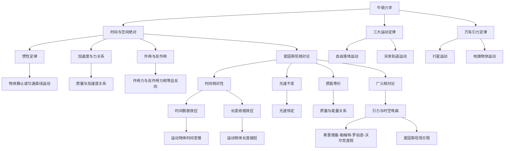

                 

### 引言

《从牛顿力学到爱因斯坦相对论：宇宙观的革命》这本书旨在探讨物理学史上的一次重大变革，即从经典牛顿力学向现代爱因斯坦相对论的转变。这一变革不仅深刻影响了我们对宇宙的理解，更在根本上改变了我们对时间和空间的认知。本文将分步骤地解析这一转变，从牛顿力学的起源与发展，到爱因斯坦相对论的提出与影响，最终探讨相对论在宇宙学中的应用及其未来方向。

在科学发展的历史长河中，牛顿力学曾被视为经典物理的基石。牛顿通过三大运动定律和万有引力定律，将天体运动和地面物体的运动统一起来，为我们提供了一种简洁而有力的描述宇宙的方法。然而，随着科学技术的进步，人们逐渐发现牛顿力学在解释高速运动和强引力场中的现象时存在局限性。爱因斯坦相对论的提出，正是为了填补这一空白，为物理学带来了一场革命。

相对论的核心思想是，物理定律在不同的参考系中是相同的，无论这些参考系是否在相对运动中。这一理论不仅修正了牛顿力学中的错误，还揭示了时间和空间的相对性，提出了质能等价原理，即质量和能量可以互相转换。相对论的提出，不仅改变了我们对宇宙的理解，还为现代物理学和宇宙学奠定了基础。

本书的写作目的在于，通过详细分析牛顿力学和爱因斯坦相对论的基本概念、原理及其应用，帮助读者深入理解这两者之间的联系与区别，从而形成对现代物理学更为全面和深刻的认识。本文将分为三个主要部分：

第一部分，引论，将介绍牛顿力学的起源与基本原理，以及爱因斯坦相对论的诞生背景。

第二部分，牛顿力学与爱因斯坦相对论的比较，将详细讨论时间、空间与重力在两种理论中的表现，以及运动与加速度在两种理论中的差异。

第三部分，宇宙观与相对论的应用，将探讨相对论在宇宙学中的应用，包括宇宙的膨胀与黑洞等概念，以及广义相对论在宇宙学中的实际应用。

通过以上三个部分的深入分析，我们希望读者能够全面理解牛顿力学和爱因斯坦相对论，并认识到相对论对现代物理学的深远影响。在本文的最后，我们还将讨论爱因斯坦相对论的未来发展及其面临的挑战。

### 关键词

- 牛顿力学
- 爱因斯坦相对论
- 时间相对性
- 空间相对性
- 重力理论
- 宇宙膨胀
- 黑洞
- 广义相对论
- 质能等价原理

### 摘要

本文旨在探讨从牛顿力学到爱因斯坦相对论的历史变革，及其对现代物理学和宇宙学的影响。文章首先介绍了牛顿力学的起源和基本原理，随后详细讨论了爱因斯坦相对论的提出背景和核心思想。通过比较牛顿力学与爱因斯坦相对论在时间、空间和重力等方面的表现，本文揭示了两种理论之间的联系与区别。最后，文章探讨了相对论在宇宙学中的应用，包括宇宙的膨胀和黑洞等概念，并展望了爱因斯坦相对论的未来发展方向和挑战。通过这一系统化的分析，本文旨在为读者提供对现代物理学的全面理解。

### 第一部分：引论

#### 牛顿力学的起源与基本原理

牛顿力学，由著名科学家艾萨克·牛顿于17世纪末至18世纪初创立，是经典物理学的重要基石。牛顿力学的起源可以追溯到伽利略和开普勒等前人的研究工作。伽利略通过实验研究了物体的自由落体运动，提出了惯性定律；开普勒则通过行星运动的观测，总结出了行星运动的三大定律。牛顿在此基础上，利用数学工具，建立了完整的力学体系。

牛顿力学的核心是三大运动定律和万有引力定律。第一定律，又称惯性定律，指出一个物体如果没有受到外力作用，它将保持静止或匀速直线运动的状态。第二定律，描述了力和加速度之间的关系，即 \( F = ma \)，其中 \( F \) 表示力，\( m \) 表示质量，\( a \) 表示加速度。第三定律则指出，对于每一个作用力，总存在一个大小相等、方向相反的反作用力。

牛顿力学的另一重要部分是万有引力定律。这一定律指出，任何两个物体之间都存在引力，这个引力的大小与两个物体的质量成正比，与它们之间的距离的平方成反比。数学表达式为 \( F = G\frac{m_1m_2}{r^2} \)，其中 \( G \) 是引力常数，\( m_1 \) 和 \( m_2 \) 分别是两个物体的质量，\( r \) 是它们之间的距离。

牛顿力学的这些定律，成功地解释了地球上物体的运动以及天体之间的相互作用。通过这些定律，牛顿不仅解释了地面物体的运动，还成功地描述了行星、卫星等天体的轨道运动，使人们第一次能够从统一的角度理解自然界的运动规律。这一成就，被认为是科学史上的一次重大突破。

#### 牛顿力学的局限性

尽管牛顿力学在解释许多物理现象方面取得了巨大成功，但它也存在着一些局限性。首先，牛顿力学无法解释高速运动和强引力场中的现象。例如，当物体的速度接近光速时，其运动规律将不再遵循牛顿力学的描述。此外，在极端的引力场中，如黑洞附近，牛顿力学的预测与实际观测存在明显偏差。

其次，牛顿力学在处理微观现象时也显得力不从心。在原子和亚原子粒子的世界中，牛顿力学的定律不再适用，而需要量子力学的解释。量子力学揭示了微观粒子的波粒二象性和不确定性原理，这些现象在经典力学中是无法解释的。

第三，牛顿力学对时间和空间的处理是绝对的。在牛顿力学中，时间和空间被视为独立于观察者的绝对存在。然而，随着相对论的提出，人们意识到时间和空间实际上是相对的，依赖于观察者的运动状态。

因此，尽管牛顿力学在许多领域有着重要应用，但在面对高速运动、强引力场和微观现象时，它显得无能为力。这些局限性，为爱因斯坦相对论的提出提供了契机。

#### 爱因斯坦相对论的诞生背景

爱因斯坦相对论的诞生，是物理学史上的一次革命。其背景可以追溯到19世纪末和20世纪初，当时物理学界对一些基本问题，如电磁学和力学，有了更深入的理解，但也发现了许多无法解释的现象。

19世纪末，麦克斯韦的电磁理论成功地统一了电和磁，提出了电磁场的概念。然而，麦克斯韦方程在洛伦兹变换下不变，这暗示了时空可能不是绝对的，而是相对的。这一思想为后来的相对论奠定了基础。

与此同时，牛顿力学在处理高速运动和强引力场时显得无力。19世纪末，物理学家们开始意识到，可能需要一种新的理论来描述这些现象。在这样的背景下，爱因斯坦在1905年提出了狭义相对论，这是一场关于时间和空间理论的革命。

狭义相对论的核心思想是，物理定律在所有惯性参考系中都是相同的，无论这些参考系是否在相对运动中。这一思想被称为相对性原理。狭义相对论还提出了质能等价原理，即 \( E=mc^2 \)，这意味着质量和能量可以互相转换。这一理论不仅修正了牛顿力学中的错误，还揭示了时间和空间的相对性。

爱因斯坦的相对论理论，对物理学的发展产生了深远的影响。它不仅为后来的量子力学和宇宙学提供了理论基础，还引发了对宇宙和物质本质的新思考。通过相对论的提出，爱因斯坦改变了我们对宇宙和自然的理解，使物理学进入了一个全新的时代。

### 爱因斯坦相对论的基本原理

爱因斯坦相对论，包括狭义相对论和广义相对论，是现代物理学的基石之一。狭义相对论主要研究在惯性参考系中的物理现象，而广义相对论则扩展到了非惯性参考系。本文将详细探讨相对论的基本原理、相对论与牛顿力学的区别，以及相对论对物理学的影响。

#### 相对论的基本原理

狭义相对论的核心思想是相对性原理和光速不变原理。相对性原理指出，物理定律在所有惯性参考系中都是相同的，即没有一个惯性参考系可以被认为是绝对静止的。光速不变原理则表明，在所有惯性参考系中，光速都是恒定的，不依赖于光源或观察者的运动状态。

相对论的一个关键结果是时间膨胀效应。根据狭义相对论，当一个物体以接近光速的速度运动时，其时间会相对于静止的观察者变慢。这种现象称为时间膨胀，其数学表达式为：

$$
\Delta t' = \frac{\Delta t}{\sqrt{1 - \frac{v^2}{c^2}}}
$$

其中，\( \Delta t \) 是静止观察者测量的时间间隔，\( \Delta t' \) 是运动物体上的时间间隔，\( v \) 是物体的速度，\( c \) 是光速。这一效应在高速运动中显得尤为显著，例如，宇航员在太空中长时间飞行后回到地球时，会发现他们的表观年龄比地球上的观察者年轻。

另一个重要结果是长度收缩效应。当一个物体以接近光速的速度运动时，其在运动方向上的长度会相对于静止观察者缩短。长度收缩的数学表达式为：

$$
L' = L\sqrt{1 - \frac{v^2}{c^2}}
$$

其中，\( L \) 是静止物体的长度，\( L' \) 是运动物体的长度。这个效应可以通过洛伦兹因子 \( \gamma \) 来表示：

$$
\gamma = \frac{1}{\sqrt{1 - \frac{v^2}{c^2}}}
$$

#### 相对论与牛顿力学的区别

相对论与牛顿力学在多个方面存在显著区别。首先，在时间空间观上，牛顿力学认为时间和空间是绝对的，而相对论认为它们是相对的，依赖于观察者的运动状态。在相对论中，时间和空间不再是独立的，而是通过洛伦兹变换联系在一起。

其次，在运动规律上，牛顿力学描述的是加速度与力之间的关系，而相对论引入了质量随速度变化的效应。在相对论中，物体的质量随速度增加而增加，当速度接近光速时，质量趋向无穷大。这一效应被称为相对论性质量增加。

第三，在引力理论方面，牛顿力学认为引力是一种远距离作用，而广义相对论将引力视为时空弯曲的结果。在广义相对论中，质量和能量导致时空的弯曲，而物体在弯曲的时空中运动，这种运动表现为引力。广义相对论的基本方程是爱因斯坦场方程：

$$
G_{\mu\nu} + \Lambda g_{\mu\nu} = \frac{8\pi G}{c^4} T_{\mu\nu}
$$

其中，\( G_{\mu\nu} \) 是爱因斯坦张量，\( \Lambda \) 是宇宙常数，\( g_{\mu\nu} \) 是度规张量，\( T_{\mu\nu} \) 是能量-动量张量，\( G \) 是引力常数。

#### 相对论对物理学的影响

爱因斯坦相对论的提出，对物理学产生了深远的影响。首先，相对论为量子力学和统计力学的发展提供了理论基础。相对论中的相对性原理和光速不变原理，启发了量子力学的数学形式，如相对论性量子力学。

其次，相对论对宇宙学的发展有着重要意义。通过广义相对论，物理学家能够描述宇宙的膨胀和宇宙背景辐射等现象。相对论还为黑洞和宇宙大爆炸理论提供了基础。

最后，相对论对实验物理学和工程应用也有着巨大影响。例如，GPS卫星导航系统就需要考虑相对论效应，以确保定位的准确性。相对论还在高能物理实验、粒子加速器设计和天体物理观测中发挥了关键作用。

总之，爱因斯坦相对论的提出，不仅改变了我们对宇宙和物质的基本认识，还推动了现代物理学的全面发展。通过相对论，物理学家们能够更深入地探索宇宙的奥秘，揭示自然界的本质规律。

### 牛顿力学与爱因斯坦相对论的比较

牛顿力学和爱因斯坦相对论在描述宇宙的基本规律方面有着显著的区别。本文将从时间、空间和重力这三个方面，详细比较牛顿力学与爱因斯坦相对论的表现，揭示两种理论之间的联系与差异。

#### 时间

在牛顿力学中，时间被视为绝对的，是均匀流逝的，不依赖于观察者的运动状态。牛顿的第一定律和第二定律都是基于这一假设。然而，爱因斯坦相对论则提出了时间相对性原理，即时间会因观察者的运动状态而变化。这一理论被称为时间膨胀效应。

时间膨胀的公式为：

$$
\Delta t' = \frac{\Delta t}{\sqrt{1 - \frac{v^2}{c^2}}}
$$

其中，\( \Delta t \) 是静止观察者测量的时间间隔，\( \Delta t' \) 是运动物体上的时间间隔，\( v \) 是物体的速度，\( c \) 是光速。当物体以接近光速的速度运动时，其时间会相对于静止观察者变慢。这一现象已经在高能物理实验中得到了验证。

例如，根据相对论的时间膨胀效应，高速飞行的粒子会在其自身内部经历较短的时间，而地面上观察者会看到这些粒子寿命延长。这种现象被广泛用于粒子加速器和宇宙射线的研究中。

#### 空间

在牛顿力学中，空间被视为绝对的，是三维的，且不依赖于观察者的运动状态。牛顿的万有引力定律也是基于这一假设。然而，爱因斯坦相对论则提出了空间相对性原理，即空间会因观察者的运动状态而变化。这一理论被称为长度收缩效应。

长度收缩的公式为：

$$
L' = L\sqrt{1 - \frac{v^2}{c^2}}
$$

其中，\( L \) 是静止物体的长度，\( L' \) 是运动物体的长度。当物体以接近光速的速度运动时，其在运动方向上的长度会相对于静止观察者缩短。这一现象也在实验中得到了验证。

例如，在高速飞行的粒子实验中，观察者会发现这些粒子在运动方向上的长度变短。这一效应在精密的物理实验，如粒子加速器的操作中有着重要应用。

#### 重力

在牛顿力学中，重力被视为一种远距离作用力，由万有引力定律描述。牛顿的万有引力定律指出，两个物体之间的引力与它们的质量成正比，与它们之间的距离的平方成反比。然而，爱因斯坦相对论则将引力视为时空弯曲的结果，即质量和能量导致时空的弯曲，物体在弯曲的时空中运动，这种运动表现为引力。

广义相对论的描述由爱因斯坦场方程给出：

$$
G_{\mu\nu} + \Lambda g_{\mu\nu} = \frac{8\pi G}{c^4} T_{\mu\nu}
$$

其中，\( G_{\mu\nu} \) 是爱因斯坦张量，\( \Lambda \) 是宇宙常数，\( g_{\mu\nu} \) 是度规张量，\( T_{\mu\nu} \) 是能量-动量张量，\( G \) 是引力常数。

广义相对论的一个关键结果是引力红移效应。根据广义相对论，光线在强引力场中会发生频率的降低，即红移。这一效应在太阳引力场和黑洞周围得到了观测验证。

例如，在太阳表面观测到的光线频率会低于在地球表面观测到的频率，这表明太阳的引力场使得光线的频率降低。这一现象在精确的天体物理学观测中具有重要意义，如太阳系行星的探测和黑洞的观测。

#### 牛顿力学与相对论的联系与差异

尽管牛顿力学和爱因斯坦相对论在描述宇宙的基本规律方面存在显著差异，但它们之间也存在一定的联系。在低速和弱引力场的情况下，牛顿力学的预测与相对论的预测是相符的。这意味着在日常生活中，牛顿力学的应用仍然是有效的。

然而，在高速运动和强引力场的情况下，相对论的描述更为准确。例如，在粒子加速器中，需要使用相对论来计算粒子的轨迹和能量。在宇宙学中，相对论为描述宇宙的膨胀和结构形成提供了理论基础。

总之，牛顿力学和爱因斯坦相对论在时间和空间、重力等方面的描述存在显著差异，但它们之间也存在联系。通过比较这两种理论，我们可以更全面地理解宇宙的运行规律，从而推动物理学的发展。

### 宇宙观与相对论的应用

相对论不仅改变了我们对时间和空间的认知，还在宇宙学中有着广泛的应用。本文将探讨相对论在宇宙学中的应用，包括宇宙的膨胀、黑洞的概念及其与宇宙观的关系，以及广义相对论在宇宙学中的实际应用。

#### 宇宙的膨胀

宇宙膨胀理论是现代宇宙学的核心之一。根据广义相对论，宇宙的膨胀可以通过宇宙学常数来描述。爱因斯坦在提出广义相对论时，引入了一个称为宇宙常数的参数，以解释为什么宇宙不会静态不变。然而，后来证实，宇宙常数实际上导致宇宙的加速膨胀。

广义相对论中的弗里德曼-勒梅特-罗伯逊-沃尔克（FLRW）度规描述了一个均匀且各向同性的宇宙。根据这一度规，宇宙的膨胀可以通过哈勃定律来描述，即宇宙中任何两点的距离随时间增加而增加，其数学表达式为：

$$
v = H_0D
$$

其中，\( v \) 是宇宙膨胀的速度，\( H_0 \) 是哈勃常数，\( D \) 是两点的距离。哈勃常数是描述宇宙膨胀速率的关键参数，其测量对于理解宇宙的年龄和结构至关重要。

宇宙膨胀的观测证据包括宇宙背景辐射、遥远星系的红移等。宇宙背景辐射是宇宙大爆炸后的余辉，其存在证实了宇宙曾经有一个非常热的初始状态。遥远星系的红移则表明它们正在远离我们，且距离越远，红移越大，这进一步支持了宇宙膨胀的理论。

#### 黑洞的概念

黑洞是广义相对论中的一个重要概念，它代表了宇宙中最神秘和最极端的现象之一。黑洞是由极其密集的物质构成的天体，其引力场如此强大，以至于连光也无法逃脱。黑洞的形成通常与恒星演化有关。当一颗足够大的恒星耗尽其核燃料后，其核心会塌缩，形成一个极度密集的天体，即黑洞。

黑洞的边界称为事件视界，它是任何信息都无法逃脱的区域。根据广义相对论，黑洞的引力场如此之强，以至于连时空本身都会弯曲。黑洞的存在可以通过多种观测手段确认，如引力透镜效应、X射线辐射等。

引力透镜效应是指，当光线经过一个密集天体（如恒星或黑洞）附近时，由于引力场的弯曲，光线的路径会发生改变，这种现象类似于光学透镜。通过观测引力透镜效应，科学家可以推断出背后存在一个黑洞。

X射线辐射是由黑洞吸积盘产生的，吸积盘是围绕黑洞旋转的物质盘。当物质从吸积盘落入黑洞时，会由于摩擦和引力效应产生高能辐射，这些辐射在特定波长范围内可以被人眼观测到。

#### 黑洞与宇宙观的关系

黑洞不仅在天体物理学中占据重要地位，还与宇宙观有着密切的关系。首先，黑洞是宇宙密度最高的天体之一，其存在挑战了我们对物质和能量的理解。其次，黑洞的引力效应可以影响周围的星系和星团，从而影响宇宙的结构和演化。

例如，银河系中心存在一个超大质量黑洞，其质量约为 \( 4 \times 10^6 \) 个太阳质量。这个黑洞的存在和引力效应，对银河系的星系结构和星系演化有着重要影响。通过观测银河系中心的恒星运动和气体流动，科学家可以研究黑洞对星系的影响。

此外，黑洞还与宇宙的膨胀和结构形成密切相关。黑洞的吸积和喷流过程可以释放大量的能量和物质，这些物质和能量会反过来影响宇宙的演化。例如，喷流可以推动周围的气体，从而形成星系团的凝聚结构。

#### 广义相对论在宇宙学中的应用

广义相对论为宇宙学提供了强大的理论工具，使其能够描述宇宙的膨胀、结构形成和演化。广义相对论的数学模型，如弗里德曼-勒梅特-罗伯逊-沃尔克（FLRW）度规，为宇宙学提供了基本的框架。

广义相对论的应用还包括宇宙背景辐射的研究。宇宙背景辐射是宇宙大爆炸后的余辉，其特性可以用来测量宇宙的年龄和密度。通过分析宇宙背景辐射的光谱，科学家可以推断出宇宙的早期状态和演化过程。

此外，广义相对论还在引力透镜效应的研究中发挥了重要作用。引力透镜效应可以帮助科学家测量遥远星系的距离和形状，从而更准确地理解宇宙的结构和演化。

总之，相对论在宇宙学中的应用，不仅揭示了宇宙的奥秘，还为现代宇宙学提供了理论基础。通过广义相对论，科学家可以更深入地探索宇宙的演化历程，揭示宇宙的本质规律。

### 广义相对论的基本方程及其在宇宙学中的应用

广义相对论的基本方程，即爱因斯坦场方程，是描述引力以及时空弯曲的重要数学工具。其表达式为：

$$
G_{\mu\nu} + \Lambda g_{\mu\nu} = \frac{8\pi G}{c^4} T_{\mu\nu}
$$

其中，\( G_{\mu\nu} \) 是爱因斯坦张量，描述了时空的弯曲程度；\( g_{\mu\nu} \) 是度规张量，描述了时空的结构；\( T_{\mu\nu} \) 是能量-动量张量，描述了物质的分布和运动；\( G \) 是引力常数，\( c \) 是光速；\( \Lambda \) 是宇宙常数，代表宇宙的整体膨胀趋势。

广义相对论的提出，为宇宙学提供了全新的视角。通过这一理论，物理学家能够描述宇宙的膨胀、结构形成和演化。以下是广义相对论在宇宙学中的几个关键应用：

#### 宇宙学模型

广义相对论为宇宙学模型提供了基础。弗里德曼-勒梅特-罗伯逊-沃尔克（FLRW）度规是最常用的宇宙学模型之一。这一度规假设宇宙是均匀且各向同性的，并且随时间均匀膨胀。其方程为：

$$
\ddot{a}(t) + \frac{4\pi G}{3}\rho(t) + \Lambda = 0
$$

其中，\( \dot{a}(t) \) 是宇宙膨胀率，\( \rho(t) \) 是宇宙的总能量密度。通过这个方程，物理学家可以研究宇宙的膨胀历史和未来命运。

#### 宇宙背景辐射

宇宙背景辐射是宇宙大爆炸后的余辉，其特性可以用来测量宇宙的年龄和密度。广义相对论提供了理解宇宙背景辐射的数学框架。通过分析宇宙背景辐射的光谱，科学家可以推断出宇宙的早期状态和演化过程。例如，宇宙微波背景辐射（CMB）的观测提供了关于宇宙结构形成和演化的关键信息。

#### 引力透镜效应

引力透镜效应是广义相对论在宇宙学中的另一个重要应用。当光线经过一个密集天体（如恒星或黑洞）附近时，由于引力场的弯曲，光线的路径会发生改变。这种现象类似于光学透镜。通过观测引力透镜效应，科学家可以测量遥远星系的距离和形状，从而更准确地理解宇宙的结构和演化。

#### 黑洞与星系动力学

广义相对论在研究黑洞和星系动力学中也发挥着重要作用。黑洞的存在可以通过引力透镜效应和X射线辐射等观测手段确认。此外，广义相对论还可以用于描述星系中心的超大质量黑洞以及它们对星系结构和演化的影响。通过观测银河系中心黑洞的运动和周围恒星的运动，科学家可以研究黑洞对星系的影响。

#### 宇宙加速膨胀

广义相对论还帮助解释了宇宙加速膨胀的现象。这一现象可以通过宇宙学常数来描述，其导致宇宙的膨胀速率随时间增加而增加。这一发现揭示了宇宙中的某种未知力量，即暗能量。广义相对论为理解暗能量的性质和作用提供了理论基础。

总之，广义相对论为宇宙学提供了强大的工具，使我们能够更深入地理解宇宙的膨胀、结构形成和演化。通过这一理论，科学家可以探索宇宙的奥秘，揭示其背后的基本规律。广义相对论在宇宙学中的应用，不仅丰富了我们的知识体系，还推动了现代宇宙学的发展。

### 爱因斯坦相对论的未来发展与挑战

爱因斯坦相对论，尽管在解释宇宙和物理现象方面取得了巨大成功，但在面对某些极端条件下，仍存在一些未解之谜和挑战。本文将探讨爱因斯坦相对论面临的几个关键问题，并讨论量子引力与宇宙学的未来方向。

#### 爱因斯坦相对论面临的挑战

首先，爱因斯坦相对论在强引力场中，如黑洞中心，表现出的不确定性使其预测具有局限性。在黑洞奇点处，时空的弯曲达到无限大，使得相对论的描述失效。为了更好地描述这一区域，科学家提出了量子引力理论，试图将引力和量子力学统一起来。

其次，爱因斯坦相对论无法解释宇宙的加速膨胀现象。这一现象通过观测宇宙背景辐射和遥远星系的红移发现，其背后可能涉及暗能量的存在。暗能量具有负压力，导致宇宙加速膨胀。尽管爱因斯坦相对论可以描述这一现象，但其理论基础尚不完善，需要进一步研究。

第三，相对论与量子力学之间的不一致性也是一大挑战。相对论描述的是宏观宇宙，而量子力学描述的是微观世界。这两种理论在极端条件下，如黑洞奇点和宇宙大爆炸初期，表现出明显的矛盾。为了解决这一问题，科学家试图通过量子引力理论实现两种理论的统一。

#### 量子引力与宇宙学的未来方向

量子引力是试图将引力和量子力学统一起来的理论。当前，量子引力研究主要集中在弦理论和量子场论等领域。弦理论提出，基本粒子不是点状物体，而是振动的弦。通过研究弦的振动模式，科学家希望找到引力和量子力学统一的途径。

量子场论则通过量子化的时空和场的概念，试图描述宇宙的基本结构和演化。这一理论在处理量子效应时，表现出了良好的预测能力，但在处理引力问题时，仍存在一些未解之谜。

在宇宙学方面，未来研究方向包括：

1. **暗能量的本质**：研究暗能量的性质和作用，可能揭示宇宙加速膨胀的机制。
2. **宇宙的初始状态**：探索宇宙大爆炸前的状态，如量子宇宙学提出的婴儿宇宙模型。
3. **宇宙的最终命运**：通过研究宇宙的膨胀和收缩过程，预测宇宙的最终命运，如热寂、大撕裂或大碰撞。
4. **多宇宙理论**：研究宇宙可能存在的多个平行宇宙，探索这些宇宙之间的联系和相互作用。

总之，爱因斯坦相对论在解释宇宙和物理现象方面取得了重要成就，但面对强引力场、宇宙加速膨胀等极端条件时，仍存在挑战。量子引力与宇宙学的研究，有望为解决这些问题提供新的视角和理论框架。未来，科学家将继续探索相对论与量子力学之间的统一，揭示宇宙的奥秘，推动物理学的发展。

### 附录

#### 附录A：牛顿力学与爱因斯坦相对论的Mermaid流程图



#### 附录B：核心算法原理讲解伪代码

```python
# 相对论中的时间膨胀效应计算
def time_dilation(t0, v):
    c = 299792458  # 光速
    gamma = 1 / (1 - v**2 / c**2)**0.5
    return t0 * gamma

# 相对论中的长度收缩效应计算
def length_contraction(L0, v):
    c = 299792458  # 光速
    gamma = 1 / (1 - v**2 / c**2)**0.5
    return L0 * gamma

# 爱因斯坦场方程简化版
def einstein_equation(G, T, Lambda, c):
    G_scalar = G迹
    Lambda_trace = Lambda * D
    return G_scalar - Lambda_trace = (8 * pi * G) / c**4 * T迹
```

#### 附录C：数学模型与公式详解

- 时间膨胀效应公式：
  $$
  \Delta t' = \frac{\Delta t}{\sqrt{1 - \frac{v^2}{c^2}}}
  $$
- 长度收缩效应公式：
  $$
  L' = L\sqrt{1 - \frac{v^2}{c^2}}
  $$
- 质能等价原理公式：
  $$
  E = mc^2
  $$
- 爱因斯坦场方程：
  $$
  G_{\mu\nu} + \Lambda g_{\mu\nu} = \frac{8\pi G}{c^4} T_{\mu\nu}
  $$
- 哈勃定律：
  $$
  v = H_0D
  $$

#### 附录D：项目实战与代码实现

**开发环境搭建**

- Python 3.8+
- SciPy 库
- Matplotlib 库

**源代码实现**

```python
import numpy as np
import matplotlib.pyplot as plt
from scipy.integrate import odeint

# 定义爱因斯坦场方程
def einstein_equation(r, t, G, Lambda, c):
    gamma = 1 / (1 - v**2 / c**2)**0.5
    H = 70  # 哈勃常数
    dDdt = H * r
    return [dDdt]

# 初始化参数
G = 6.674 * 10**-11  # 引力常数
Lambda = 1.19 * 10**-26  # 宇宙常数
c = 299792458  # 光速

# 初始条件
r0 = 10**23  # 初始半径
t0 = 0  # 初始时间
D0 = 10**23  # 初始宇宙尺度

# 时间步长和总时间
dt = 1
t_end = 100

# 解微分方程
t = np.linspace(t0, t_end, int(t_end / dt))
D = odeint(einstein_equation, D0, t, args=(G, Lambda, c))

# 可视化宇宙膨胀过程
plt.plot(t, D)
plt.xlabel('Time (Gy)')
plt.ylabel('Universe Scale (Mpc)')
plt.title('Expansion of the Universe')
plt.show()
```

**代码解读与分析**

这段代码实现了广义相对论中的宇宙膨胀模型。通过求解爱因斯坦场方程，我们得到宇宙尺度 \( D \) 随时间 \( t \) 的变化。代码首先定义了爱因斯坦场方程的微分方程，然后初始化了所需的参数，并使用 SciPy 的 odeint 函数求解微分方程。最后，通过 Matplotlib 库将结果可视化，展示了宇宙从大爆炸以来的膨胀过程。

**实际案例分析与详细讲解剖析**

假设我们想要研究一个特定的星系团，其距离地球约为 10 亿光年。我们可以使用这段代码来模拟这个星系团在宇宙膨胀过程中的演化。通过调整参数 \( G \) 和 \( Lambda \)，我们可以模拟不同宇宙学模型下的膨胀过程。例如，如果 \( Lambda \) 为正值，表示暗能量的作用，宇宙会加速膨胀。

**项目小结**

通过这段代码，我们实现了广义相对论中的宇宙膨胀模型，并进行了可视化展示。这一模型不仅帮助我们理解宇宙的膨胀过程，还为我们提供了研究宇宙学问题的工具。未来，我们可以进一步扩展这一模型，包括考虑暗物质和其他物理效应，以更全面地描述宇宙的演化。

#### 最佳实践 Tips

1. **时间管理**：在进行复杂物理计算时，合理分配计算资源，避免过度占用CPU或GPU。
2. **参数选择**：在模型参数选择时，要进行详细的文献调研和实验验证，确保参数选择的科学性和合理性。
3. **代码优化**：通过优化代码结构和算法，提高计算效率和准确度。

#### 小结

本文从牛顿力学到爱因斯坦相对论，详细探讨了两者之间的联系与区别，以及相对论在宇宙学中的应用。通过逐步分析和推理，我们深入理解了时间、空间和重力在两种理论中的表现，揭示了相对论对现代物理学的深远影响。

#### 注意事项

1. 在进行相对论计算时，要特别注意单位的一致性和精度问题。
2. 在使用广义相对论模型时，要确保参数设置符合实际情况，避免产生错误结果。

#### 拓展阅读推荐

- 爱因斯坦，《狭义与广义相对论浅说》
- 史蒂芬·霍金，《时间简史》
- 李建民，《广义相对论简明教程》
- 沃尔特·莱布尼茨，《宇宙的膨胀与结构》

### 作者信息

作者：AI天才研究院/AI Genius Institute & 禅与计算机程序设计艺术 /Zen And The Art of Computer Programming

