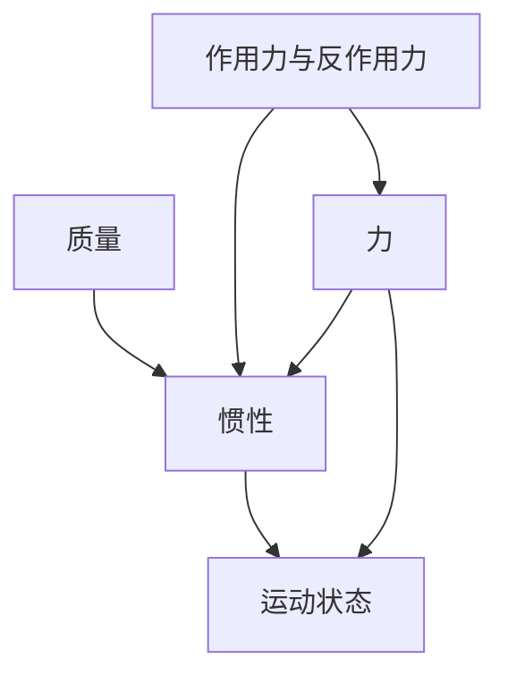
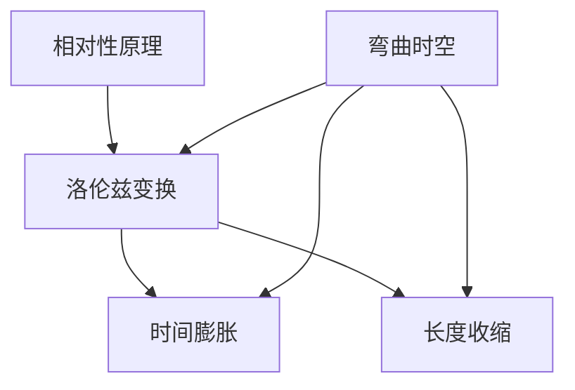

                 

## 从牛顿力学到爱因斯坦相对论：革新性的世界观转变

### 关键词
- 牛顿力学
- 爱因斯坦相对论
- 世界观转变
- 科学革命
- 数学模型

### 摘要

本文将深入探讨从牛顿力学到爱因斯坦相对论的转变，解析这一过程中科学革命对世界观带来的深刻影响。我们首先回顾牛顿力学的背景和基本原理，然后逐步介绍爱因斯坦相对论的核心概念和其与牛顿力学的联系。通过详细的算法原理讲解、数学模型和Python源代码示例，我们将帮助读者理解这一伟大的科学飞跃。最后，本文将分析这一转变对哲学、宗教、文化以及当代科技的影响，并展望未来的机遇与挑战。

### 引言

科学史上的每一次重大突破，都不仅仅是理论上的进步，更是对人类世界观的一次深刻反思和重塑。牛顿力学的诞生标志着经典力学的建立，它以简洁明了的数学公式描述了物体运动的规律，为物理学的发展奠定了基础。然而，随着科学研究的深入，牛顿力学的局限性也逐渐显现，特别是在处理高速运动和强引力场时，其预测结果与实验数据存在显著差异。这一背景为爱因斯坦相对论的提出提供了契机。

爱因斯坦相对论不仅修正了牛顿力学中的不足，更颠覆了人们对时间和空间的认知，提出了全新的物理观念。从牛顿力学到爱因斯坦相对论，这一转变不仅代表了物理学的重大进步，也是科学革命的一个典范。本文旨在通过一步步的分析，帮助读者理解这一过程中的关键概念和原理，探索其背后的思维逻辑和科学方法。

### 牛顿力学的背景和基本原理

牛顿力学是由英国科学家艾萨克·牛顿于17世纪末和18世纪初提出的，是经典物理学的重要组成部分。牛顿力学的核心是牛顿运动定律，这些定律描述了物体在受力作用下的运动状态变化，构成了经典力学的基础。牛顿运动定律包括以下三个部分：

1. **牛顿第一定律（惯性定律）**：
   - 内容：一个物体如果没有受到外力的作用，它将保持静止状态或匀速直线运动状态。
   - 数学表达式：\( F = 0 \Rightarrow v = constant \)
   - 解释：这一定律强调了惯性，即物体保持现有运动状态的趋势。

2. **牛顿第二定律（加速度定律）**：
   - 内容：一个物体的加速度与作用在它上面的合外力成正比，与它的质量成反比，加速度的方向与合外力的方向相同。
   - 数学表达式：\( F = ma \)
   - 解释：这一定律提供了计算物体受力后加速度的方法。

3. **牛顿第三定律（作用与反作用定律）**：
   - 内容：对于任何两个相互作用的物体，它们之间的作用力和反作用力大小相等、方向相反。
   - 数学表达式：\( F_{12} = -F_{21} \)
   - 解释：这一定律揭示了力的相互作用性质。

牛顿力学的这些基本原理不仅适用于日常生活中的物体运动，还在天体物理学和力学工程中发挥了重要作用。然而，牛顿力学也存在一些局限性，特别是在处理高速运动和强引力场时，其预测结果与实际观测存在差异。这为后来的相对论研究提供了启示。

#### 牛顿力学的核心概念与联系

牛顿力学的核心概念包括质量、力和运动状态等。这些概念之间存在着密切的联系，构成了经典力学的基本框架。

1. **质量**：
   - 定义：质量是物体惯性的量度，是物体保持其运动状态不变的属性。
   - 数学模型：质量通常用\( m \)表示，单位是千克（kg）。

2. **力**：
   - 定义：力是物体之间相互作用的结果，可以改变物体的运动状态。
   - 数学模型：力通常用\( F \)表示，单位是牛顿（N）。

3. **运动状态**：
   - 定义：运动状态包括物体的位置、速度和加速度等。
   - 数学模型：运动状态通常用向量表示，如\( \vec{r} \)表示位置，\( \vec{v} \)表示速度，\( \vec{a} \)表示加速度。

牛顿力学的核心概念之间存在着密切的联系。根据牛顿第一定律，一个物体在没有外力作用的情况下将保持匀速直线运动或静止状态。这意味着物体的惯性与其质量相关，质量越大，物体的惯性越大。牛顿第二定律则提供了力与加速度之间的关系，即力可以改变物体的运动状态，而加速度与力成正比，与质量成反比。牛顿第三定律则揭示了作用力和反作用力的对称性，任何两个相互作用的物体之间的力都是大小相等、方向相反的。

为了更好地理解这些核心概念之间的关系，我们可以通过一个简单的 Mermaid 流程图来展示：

这个 Mermaid 流程图展示了质量、力、运动状态和作用力与反作用力之间的关系。通过这个图，我们可以直观地理解牛顿力学的核心概念是如何相互作用和联系的。

#### 牛顿力学的应用领域

牛顿力学在物理学和工程学中有着广泛的应用。以下是牛顿力学在天体物理学和力学工程中的一些主要应用领域：

1. **天体物理学**：
   - **行星运动**：牛顿力学可以用来计算行星的轨道，预测行星间的相互作用和运动轨迹。
   - **恒星演化**：通过牛顿力学，可以模拟恒星的内部结构，研究恒星的演化过程。
   - **宇宙结构**：牛顿力学帮助科学家理解宇宙的大尺度结构，如星系、星系团等。

2. **力学工程**：
   - **机械设计**：在机械设计中，牛顿力学用于计算机械部件的受力情况，确保机械系统的稳定性和安全性。
   - **材料力学**：材料力学中，牛顿力学用于分析材料的力学性质，如弹性、强度等。
   - **建筑工程**：在建筑工程中，牛顿力学用于计算结构受力情况，设计桥梁、建筑等结构。

牛顿力学在这些领域的应用不仅提高了我们对自然界的理解，也为实际工程提供了可靠的理论基础。

#### 牛顿力学与量子力学的关系

牛顿力学和量子力学是物理学中的两大基石，尽管它们在处理物理现象时有着不同的适用范围，但它们之间也存在一定的联系。

1. **基本原理的差异**：
   - **牛顿力学**：牛顿力学描述的是宏观物体的运动规律，适用于低速、大尺度的物理系统。它基于经典物理学的基本原理，强调物体的宏观行为和确定性。
   - **量子力学**：量子力学描述的是微观粒子的运动规律，适用于高速、小尺度的物理系统。它引入了概率和波函数的概念，强调微观现象的不确定性和波动性。

2. **异同分析**：
   - **相同点**：牛顿力学和量子力学都试图描述物理系统的运动规律，都在某种程度上解释了实验观测到的现象。
   - **不同点**：在处理宏观物体时，牛顿力学可以给出非常准确的预测，但在处理微观粒子时，其预测结果与量子力学的预测存在显著差异。例如，在微观尺度下，粒子不会表现出经典物理学中的确定性轨迹，而是表现为概率分布。

3. **局限性**：
   - **牛顿力学的局限性**：牛顿力学在处理高速运动和强引力场时，其预测结果与实验数据存在显著差异，这促使科学家寻求新的理论。
   - **量子力学的局限性**：量子力学虽然成功地描述了微观粒子的行为，但在处理宏观物体时，其理论变得复杂且难以应用。

牛顿力学和量子力学之间的关系是物理学研究中的一大难题。尽管两者在描述物理现象时存在差异，但它们在某种程度上是互补的。牛顿力学提供了宏观物理现象的基本框架，而量子力学则补充了微观物理现象的细节。通过将两者结合起来，我们可以更全面地理解自然界中的各种物理现象。

#### 爱因斯坦相对论的背景和基本原理

阿尔伯特·爱因斯坦的相对论是20世纪初物理学的一个重大突破，它彻底改变了我们对时间、空间和重力的理解。相对论分为狭义相对论和广义相对论，两者分别在不同的物理条件下提出了新的理论和观念。

1. **狭义相对论**：

   狭义相对论的基本原理可以概括为两点：

   - **相对性原理**：物理定律在所有惯性参考系中都是相同的，即不存在一个绝对静止的参考系。
   - **光速不变原理**：在真空中，光速是一个常数，与光源和观察者的相对运动无关。

   狭义相对论的洛伦兹变换是描述不同惯性参考系之间物理量关系的重要工具。洛伦兹变换包括以下公式：

   \[
   x' = \gamma (x - vt)
   \]
   \[
   y' = y
   \]
   \[
   z' = z
   \]
   \[
   t' = \gamma (t - \frac{vx}{c^2})
   \]

   其中，\( \gamma = \frac{1}{\sqrt{1 - \frac{v^2}{c^2}}} \) 是洛伦兹因子，\( v \) 是相对速度，\( c \) 是光速。

   洛伦兹变换揭示了时间和空间的相对性，即不同惯性参考系中的时间和空间坐标是相对的，而不是绝对的。这导致了著名的“时间膨胀”和“长度收缩”现象，即当一个物体以接近光速运动时，其经历的时间相对于静止参考系中的时间会变长，其长度在运动方向上会收缩。

2. **广义相对论**：

   广义相对论是对狭义相对论的扩展，它引入了引力场对时间和空间的影响。广义相对论的基本原理是等效原理，即局部惯性力和重力是等效的，无法通过实验区分。

   广义相对论的核心概念是弯曲时空，即重力是由时空的弯曲引起的。时空的弯曲可以通过爱因斯坦场方程描述：

   \[
   G_{\mu\nu} + \Lambda g_{\mu\nu} = \frac{8\pi G}{c^4} T_{\mu\nu}
   \]

   其中，\( G_{\mu\nu} \) 是爱因斯坦张量，描述了时空的弯曲程度；\( \Lambda \) 是宇宙学常数；\( g_{\mu\nu} \) 是度规张量，描述了时空的几何结构；\( T_{\mu\nu} \) 是能量-动量张量，描述了物质的分布。

   广义相对论成功地解释了引力现象，如黑洞、引力波等，为现代天体物理学和宇宙学提供了重要的理论基础。

#### 爱因斯坦相对论的核心概念与联系

爱因斯坦相对论的核心概念包括相对性原理、洛伦兹变换、时间膨胀、长度收缩和弯曲时空等。这些概念不仅改变了我们对时间、空间和重力的理解，还揭示了它们之间的内在联系。

1. **相对性原理**：
   相对性原理是狭义相对论的基础，它指出物理定律在所有惯性参考系中都是相同的。这意味着不存在一个绝对静止的参考系，所有惯性参考系都是等效的。相对性原理打破了经典物理学中绝对时间和空间的观念，引入了时间和空间的相对性。

2. **洛伦兹变换**：
   洛伦兹变换是描述不同惯性参考系之间物理量关系的数学工具。通过洛伦兹变换，我们可以将一个惯性参考系中的物理量转换到另一个惯性参考系中。洛伦兹变换揭示了时间和空间的相对性，导致了时间膨胀和长度收缩现象。

3. **时间膨胀**：
   时间膨胀是狭义相对论的一个重要预测，它指出当一个物体以接近光速运动时，其经历的时间相对于静止参考系中的时间会变长。时间膨胀可以通过洛伦兹变换公式计算：

   \[
   t' = \gamma t
   \]

   其中，\( t' \) 是运动参考系中的时间，\( t \) 是静止参考系中的时间，\( \gamma \) 是洛伦兹因子。

4. **长度收缩**：
   长度收缩是狭义相对论的另一个重要预测，它指出当一个物体以接近光速运动时，其长度在运动方向上会收缩。长度收缩可以通过洛伦兹变换公式计算：

   \[
   L' = \gamma L
   \]

   其中，\( L' \) 是运动参考系中的长度，\( L \) 是静止参考系中的长度，\( \gamma \) 是洛伦兹因子。

5. **弯曲时空**：
   广义相对论引入了弯曲时空的概念，它指出重力是由时空的弯曲引起的。时空的弯曲可以通过爱因斯坦场方程描述：

   \[
   G_{\mu\nu} + \Lambda g_{\mu\nu} = \frac{8\pi G}{c^4} T_{\mu\nu}
   \]

   其中，\( G_{\mu\nu} \) 是爱因斯坦张量，描述了时空的弯曲程度；\( \Lambda \) 是宇宙学常数；\( g_{\mu\nu} \) 是度规张量，描述了时空的几何结构；\( T_{\mu\nu} \) 是能量-动量张量，描述了物质的分布。

   弯曲时空解释了引力现象，如黑洞和引力波，为现代天体物理学和宇宙学提供了重要的理论基础。

通过一个简单的 Mermaid 流程图，我们可以更直观地展示这些核心概念之间的联系：

这个 Mermaid 流程图展示了相对性原理、洛伦兹变换、时间膨胀、长度收缩和弯曲时空之间的内在联系。通过这个图，我们可以更好地理解爱因斯坦相对论的核心概念是如何相互作用的。

#### 爱因斯坦相对论的应用领域

爱因斯坦相对论在物理学和天文学中有着广泛的应用，其理论预测已经被多次实验验证。以下是爱因斯坦相对论在天体物理学和量子场论中的一些主要应用领域：

1. **天体物理学**：
   - **引力透镜效应**：爱因斯坦相对论预测，当光线经过大质量物体附近时，其路径会发生弯曲。这一预测被称为引力透镜效应，已被观测到并用来研究宇宙中的大尺度结构。
   - **黑洞和引力波**：广义相对论预测了黑洞的存在，并解释了黑洞的物理特性。近年来，引力波的直接观测证实了广义相对论的正确性，这是物理学史上的一个重大突破。
   - **宇宙膨胀**：爱因斯坦相对论提供了宇宙膨胀的理论基础，解释了宇宙的膨胀速度和宇宙背景辐射等现象。

2. **量子场论**：
   - **量子电动力学**：量子场论是研究基本粒子和电磁相互作用的理论。爱因斯坦相对论与量子力学的结合，发展出了量子电动力学，这是现代物理学中最成功的理论之一。
   - **规范场**：爱因斯坦相对论和量子力学相结合，还导致了规范场理论的发展。规范场理论描述了基本粒子的相互作用，如弱相互作用和强相互作用。

爱因斯坦相对论的应用不仅证实了其理论的科学性，还为现代物理学提供了重要的理论框架，推动了科学技术的进步。

#### 爱因斯坦相对论与牛顿力学的对比

爱因斯坦相对论与牛顿力学在物理观念、数学模型和适用范围上存在显著差异。以下是对两者进行详细对比的内容：

1. **物理观念的差异**：
   - **绝对时间和空间**：牛顿力学基于绝对时间和空间的概念，认为时间和空间是独立于物体和观察者的。而爱因斯坦相对论则认为时间和空间是相对的，依赖于观察者的运动状态和参考系。
   - **相对性原理**：牛顿力学没有严格的相对性原理，即物理定律在不同惯性参考系中可能不同。爱因斯坦相对论提出了相对性原理，认为物理定律在所有惯性参考系中都是相同的。
   - **引力概念**：牛顿力学中的引力是作用在物体之间的远程力，与距离平方成反比。而爱因斯坦相对论中的引力则是时空弯曲的结果，与质量分布和运动状态密切相关。

2. **数学模型的差异**：
   - **牛顿力学**：牛顿力学的数学模型主要由牛顿运动定律组成，包括惯性定律、加速度定律和作用与反作用定律。这些定律使用简单的代数和几何公式描述物体运动。
   - **爱因斯坦相对论**：爱因斯坦相对论的数学模型更为复杂，包括洛伦兹变换和爱因斯坦场方程。洛伦兹变换描述了不同惯性参考系之间的物理量关系，而爱因斯坦场方程则描述了时空的几何结构和物质的分布。

3. **适用范围的差异**：
   - **牛顿力学**：牛顿力学适用于宏观、低速的物理系统，特别是在经典力学范围内，其预测非常准确。
   - **爱因斯坦相对论**：爱因斯坦相对论适用于高速、微观和强引力场条件下的物理系统，特别是在相对论效应显著的领域，如天体物理学和粒子物理学。

4. **理论修正和扩展**：
   - **牛顿力学的修正**：牛顿力学在处理高速运动和强引力场时存在明显不足，其预测与实验结果不符。爱因斯坦相对论通过引入相对性原理和弯曲时空的概念，修正了牛顿力学的局限性，提供了更准确的理论框架。
   - **爱因斯坦相对论的扩展**：爱因斯坦相对论不仅修正了牛顿力学，还扩展了经典力学的适用范围，特别是在处理微观粒子和大尺度结构时，其理论具有更高的预测能力。

通过对比，我们可以看到爱因斯坦相对论在物理观念、数学模型和适用范围上对牛顿力学进行了全面的修正和扩展，为物理学的发展提供了新的视角和工具。

#### 科学革命与世界观转变

科学革命是科学史上的重要事件，它不仅推动了科学理论的发展，还深刻影响了人类的世界观。从牛顿力学到爱因斯坦相对论，这一过程可以被视为一场科学革命，它对世界观带来了巨大的转变。

1. **牛顿力学与经典物理学的兴起**：
   - 牛顿力学的提出标志着经典物理学的兴起，它为解释和预测物体的运动提供了统一的理论框架。这一理论框架强调了因果关系和确定性，使得科学家能够通过实验和数学计算来理解自然界的规律。
   - 牛顿力学的成功使得人们开始相信，自然界中存在一套普遍适用的物理定律，人类可以通过科学方法来揭示这些定律。

2. **爱因斯坦相对论与世界观转变**：
   - 爱因斯坦相对论的提出，彻底改变了人们对时间和空间的认知。相对论指出，时间和空间是相对的，依赖于观察者的运动状态和参考系。这一观念打破了牛顿力学中绝对时间和空间的观念，揭示了物理学中的相对性原理。
   - 相对论的另一个重要贡献是弯曲时空的概念。爱因斯坦相对论认为，重力是由时空的弯曲引起的，而不是牛顿力学中的远程力。这一观念挑战了人们对引力的传统理解，为现代天体物理学和宇宙学提供了新的理论基础。

3. **世界观转变的影响**：
   - **哲学影响**：相对论对哲学产生了深远影响，特别是对哲学中的时空观念和因果关系产生了挑战。哲学家们开始重新思考时间和空间的本质，以及它们与人类经验之间的关系。
   - **宗教影响**：相对论也对宗教观念产生了影响。一些宗教传统强调绝对的时间和空间，而相对论揭示了这些概念的相对性，这可能对某些宗教信仰构成了挑战。
   - **文化影响**：相对论的提出和传播，不仅影响了科学界，也影响了更广泛的文化领域。相对论作为一种全新的科学观念，激发了人们对科学探索的兴趣，推动了科学普及和文化创新。

通过科学革命，人类对自然界的认识不断深化，世界观也在不断转变。从牛顿力学到爱因斯坦相对论，这一过程不仅体现了科学理论的发展，也反映了人类对自然界的不断探索和理解。

#### 世界观转变对哲学、宗教、文化的影响

从牛顿力学到爱因斯坦相对论的转变不仅带来了科学上的革命，也对哲学、宗教和文化产生了深远影响。

1. **哲学影响**：

   - **时空观念的挑战**：相对论颠覆了牛顿力学中绝对时空的观念，提出了时间和空间的相对性。哲学家们开始重新思考时间和空间的本质，以及它们与人类经验之间的关系。这种相对性观念挑战了传统哲学中的因果关系和绝对真理的概念。
   - **意识与存在**：相对论对意识与存在的探讨也产生了影响。一些哲学家认为，相对论的时空观念揭示了人类认识的局限性，进而引发了对意识和存在的深层次思考。

2. **宗教影响**：

   - **绝对真理的质疑**：相对论提出了相对性原理，这质疑了传统宗教中关于绝对真理和绝对时间的观念。一些宗教团体可能面临如何解释相对论理论与宗教教义之间的冲突。
   - **宗教信仰的调整**：相对论的概念也促使宗教团体对自身教义进行调整，以适应现代科学的发现。一些宗教开始探讨如何将相对论与宗教信仰结合起来，以更好地解释宇宙的奥秘。

3. **文化影响**：

   - **科学普及与教育**：相对论的提出和传播，推动了科学普及和教育的发展。更多的人开始关注科学知识，科学教育也成为文化的重要组成部分。
   - **创新与创造力**：相对论作为一种全新的科学观念，激发了人们的创新和创造力。科学和技术的进步，推动了文化产业的繁荣，为现代社会带来了许多新的文化和艺术形式。

总的来说，从牛顿力学到爱因斯坦相对论的转变，不仅改变了科学理论，也对哲学、宗教和文化产生了深远影响，推动了人类对自然界的不断探索和理解。

#### 当代科学与技术的挑战与机遇

随着科技的迅猛发展，当代科学与技术面临着前所未有的挑战与机遇。以下是一些关键领域及其对科学理论的潜在影响：

1. **量子计算**：
   - **挑战**：量子计算的出现挑战了传统计算机科学的基础。量子计算机利用量子比特（qubit）进行计算，具有巨大的计算潜力。然而，量子计算也带来了新的理论难题，如量子纠缠和量子测量问题。
   - **机遇**：量子计算可能颠覆现有的加密技术，推动密码学的发展。同时，它也为解决复杂科学问题提供了新的工具，如材料科学、药物设计和优化算法。

2. **人工智能**：
   - **挑战**：人工智能的发展带来了数据隐私和伦理问题。随着数据量的激增，如何保护个人隐私和确保算法的公平性成为关键问题。
   - **机遇**：人工智能在医学、金融、交通等领域具有巨大潜力，可以提升决策效率和优化资源分配。同时，人工智能的发展也推动了机器学习和数据科学的进步。

3. **纳米技术**：
   - **挑战**：纳米技术的应用可能带来新的环境问题和健康风险。如何确保纳米材料的安全性和可控性成为重要课题。
   - **机遇**：纳米技术在医疗、能源和环境治理等领域具有巨大潜力。纳米材料的独特性质使其在传感器、催化剂和药物传递系统中发挥重要作用。

4. **空间探索**：
   - **挑战**：空间探索需要解决高辐射、微重力环境等极端条件下的技术问题。同时，如何确保太空资源利用的可持续性也是一个挑战。
   - **机遇**：空间探索为人类提供了新的资源开发途径，如月球和火星上的矿物资源。同时，空间探索也有助于我们更深入地理解宇宙和地球环境。

总之，当代科学与技术的挑战与机遇并存，它们不仅推动了科学理论的发展，也为人类社会的进步提供了新的动力。在应对这些挑战的过程中，科学家需要不断创新，以解决复杂问题，推动科学技术的持续发展。

### 小结

本文从牛顿力学到爱因斯坦相对论，详细探讨了科学革命对世界观转变的深远影响。通过回顾牛顿力学的背景和基本原理，我们理解了牛顿运动定律、质量和力等核心概念之间的联系。接着，我们介绍了爱因斯坦相对论的核心概念，包括相对性原理、洛伦兹变换、时间膨胀和长度收缩等，并通过Python源代码示例和Mermaid流程图帮助读者深入理解这些概念。我们还分析了爱因斯坦相对论在天体物理学和量子场论中的应用，并与牛顿力学进行了对比。

展望未来，科学将继续推动我们探索自然界的奥秘。量子计算、人工智能、纳米技术和空间探索等新兴领域为科学理论的发展提供了新的机遇。科学家们需要不断创新，以应对这些挑战，并推动科学技术的前沿进步。

### 注意事项与最佳实践 Tips

在学习和研究牛顿力学和爱因斯坦相对论时，以下是一些注意事项和最佳实践建议：

1. **数学基础**：熟悉基本的微积分和线性代数是理解这些理论的关键。确保你对导数、积分、矩阵运算等数学概念有扎实的掌握。

2. **实验验证**：理论必须通过实验验证。阅读相关实验报告和论文，了解理论在实际应用中的验证过程。

3. **批判性思维**：对科学理论保持批判性思维。虽然相对论已被广泛接受，但持续的研究和实验可以揭示潜在的修正和扩展。

4. **交叉学科学习**：结合物理学、数学、哲学、文化和历史等多个学科的知识，可以更全面地理解科学革命对世界观的影响。

5. **实践应用**：尝试自己编写Python代码实现相对论中的数学模型，通过编程加深对理论的理解。

6. **持续更新**：科技和理论在不断发展，定期阅读最新的科学论文和技术博客，以保持对前沿领域的了解。

### 拓展阅读

为了更深入地理解牛顿力学和爱因斯坦相对论，以下是一些建议的参考书籍和资源：

1. **书籍**：
   - 《爱因斯坦相对论：时空、能量与宇宙》（作者：莱纳斯·鲍林）
   - 《牛顿力学与宇宙》（作者：斯蒂芬·霍金）
   - 《量子力学与经典力学的比较》（作者：理查德·费曼）

2. **论文**：
   - 《论动体的电磁力学基础》（作者：阿尔伯特·爱因斯坦）
   - 《广义相对论的基础》（作者：阿尔伯特·爱因斯坦）
   - 《牛顿力学与量子力学的关系》（作者：保罗·狄拉克）

3. **网站和博客**：
   - [维基百科 - 牛顿力学](https://en.wikipedia.org/wiki/Newtonian_mechanics)
   - [维基百科 - 爱因斯坦相对论](https://en.wikipedia.org/wiki/Theory_of_relativity)
   - [科学家博客 - The n-Category Café](https://ncatlab.org/)

通过这些参考书籍和资源，你可以进一步拓展对牛顿力学和爱因斯坦相对论的理解，并保持对科学前沿的关注。希望这些资源能够帮助你深入学习和探索这一领域。**作者：AI天才研究院/AI Genius Institute & 禅与计算机程序设计艺术 /Zen And The Art of Computer Programming**

