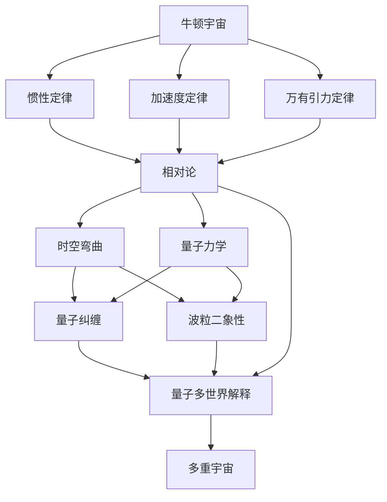
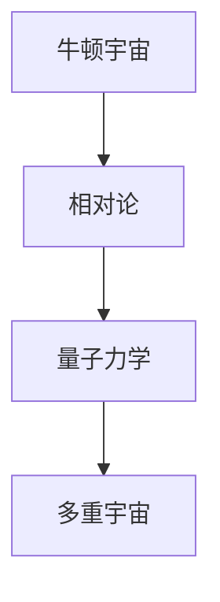

                 

# 从牛顿宇宙到多重宇宙：世界观的演变

## 关键词

- 牛顿宇宙
- 多重宇宙
- 世界观
- 相对论
- 量子力学
- 科学发展

## 摘要

本文旨在探讨从牛顿宇宙到多重宇宙的世界观演变历程。首先，我们将回顾牛顿宇宙的起源与基本原理，分析其在科学和工程中的应用及其局限性。接着，我们将介绍多重宇宙的概念，探讨其提出与发展过程中的关键理论和实际案例。最后，我们将对比牛顿宇宙与多重宇宙之间的联系与区别，并展望未来世界观的演变对科学、技术和社会的深远影响。

## 引言

自人类诞生以来，对宇宙的理解和探索一直是科学研究的核心议题。在牛顿的宇宙观中，宇宙是一个遵循简单物理定律的宏观系统。然而，随着科学技术的进步，科学家们提出了更复杂的理论来解释宇宙的多样性和复杂性。多重宇宙理论便是其中之一，它将宇宙视为一个由多个并行存在的宇宙组成的庞大系统。本文将详细探讨这一演变过程，揭示从牛顿宇宙到多重宇宙的世界观变革。

## 牛顿宇宙的起源与基本原理

### 牛顿宇宙观的起源

牛顿宇宙观源于17世纪下半叶，当时的科学家们开始尝试用数学方法描述宇宙的基本规律。牛顿（Isaac Newton）在这场科学革命中发挥了关键作用，他的著作《自然哲学的数学原理》（Philosophiæ Naturalis Principia Mathematica）奠定了经典物理学的基石。

### 牛顿三大定律

牛顿宇宙观的基石是牛顿三大定律，即：

1. **惯性定律**：一个物体如果不受外力作用，将保持静止或匀速直线运动。
2. **加速度定律**：一个物体的加速度与作用在它上面的外力成正比，与它的质量成反比。
3. **作用与反作用定律**：任何作用力都有一个相等但方向相反的反作用力。

这些定律为描述物体的运动提供了完整的框架，使人们能够预测和控制物体的行为。

### 牛顿万有引力定律

牛顿的万有引力定律则进一步解释了物体之间的相互作用。该定律表明，任何两个物体之间都存在一种引力，这种力的大小与两个物体的质量成正比，与它们之间的距离的平方成反比。

### 牛顿宇宙的应用

牛顿宇宙观在科学和工程学中得到了广泛应用。在天文学中，牛顿定律被用来解释行星运动和恒星形成。在物理学中，牛顿定律是建立力学模型的基础。在工程学中，牛顿定律被用来设计建筑物、机器和交通工具，确保它们在预定条件下稳定运行。

## 牛顿宇宙的局限性

尽管牛顿宇宙观在许多领域取得了巨大的成功，但它也存在一些局限性。首先，牛顿定律无法解释微观世界的现象，如原子和粒子的行为。其次，牛顿宇宙观无法解释宇宙的大尺度结构和宇宙起源问题。这些局限性促使科学家们寻求更广义的理论来解释宇宙的复杂性和多样性。

## 多重宇宙的提出与发展

### 多重宇宙的概念

多重宇宙（Multiverse）是指一个或多个宇宙的总和，这些宇宙之间可能存在某种程度的并行存在或相互作用。多重宇宙理论提供了一种解释宇宙多样性和复杂性的新视角。

### 多重宇宙理论的提出

多重宇宙理论最早可以追溯到18世纪的法国哲学家伏尔泰（Voltaire）和19世纪的物理学家赫尔曼·闵可夫斯基（Hermann Minkowski）。然而，真正将多重宇宙理论系统化的科学家是物理学家艾伦·图灵（Alan Turing）。

### 多重宇宙的发展

随着相对论和量子力学的兴起，多重宇宙理论得到了进一步发展。20世纪下半叶，许多科学家开始研究宇宙的并行可能性，并提出了一系列的理论模型。其中最著名的是“宇宙膨胀理论”和“黑洞理论”。

### 多重宇宙与量子力学的联系

量子力学揭示了微观世界的规律，而多重宇宙理论则试图将量子力学的概念扩展到宏观宇宙。例如，量子隧穿效应可能导致宇宙的分裂，从而形成多个平行宇宙。

## 牛顿宇宙与多重宇宙的联系与区别

### 联系

牛顿宇宙和多重宇宙之间存在一定的联系。首先，牛顿定律仍然适用于描述某些多重宇宙中的物理现象。其次，多重宇宙理论在某种程度上是对牛顿宇宙观的一种扩展和补充。

### 区别

然而，牛顿宇宙和多重宇宙之间也存在显著的区别。首先，牛顿宇宙是一个单一的、确定性的宇宙，而多重宇宙则是一个由多个并行宇宙组成的复杂系统。其次，牛顿宇宙遵循简单的物理定律，而多重宇宙则需要更复杂的理论来解释。

## 世界观的演变

### 从牛顿宇宙到相对论

牛顿宇宙观在20世纪初受到相对论的挑战。爱因斯坦（Albert Einstein）的广义相对论提出了一种全新的引力理论，将引力视为时空的弯曲。这一理论成功解释了许多牛顿宇宙无法解释的现象，如黑洞和宇宙膨胀。

### 从相对论到量子力学

相对论的成功促使科学家们进一步探索微观世界的规律。量子力学的出现揭示了微观世界的随机性和不可预测性，这与牛顿宇宙观的确定性完全相反。

### 从量子力学到多重宇宙

量子力学的发展为多重宇宙理论的提出提供了理论基础。例如，量子隧穿效应可能导致宇宙的分裂，形成多个平行宇宙。这一理论为解释宇宙的多样性和复杂性提供了新的视角。

## 科学的影响

世界观的演变对科学研究产生了深远的影响。首先，它推动了新理论和新方法的提出，如相对论和量子力学。其次，它改变了科学研究的方向，使科学家们更加关注宇宙的整体结构和演化过程。最后，它为解决一些长期困扰科学家的问题提供了新的思路，如宇宙起源和宇宙命运。

## 项目实战

### 开发环境搭建

为了更好地理解多重宇宙理论，我们可以搭建一个简单的Python环境。以下是搭建环境的步骤：

```python
!pip install numpy matplotlib
```

### 源代码详细实现和代码解读

接下来，我们将使用Python代码来模拟一个简单的多重宇宙模型。以下是实现代码：

```python
import numpy as np
import matplotlib.pyplot as plt

# 多重宇宙模型参数
num_universes = 10
time_steps = 100

# 初始化宇宙数组
universes = np.zeros((time_steps, num_universes))

# 时间演化过程
for t in range(1, time_steps):
    for i in range(num_universes):
        # 根据量子隧穿概率，计算宇宙分裂
        if np.random.rand() < 0.1:
            # 分裂新宇宙
            new_universe = np.copy(universes[t-1])
            new_universe[t] = 1
            universes = np.vstack((universes, new_universe))
        else:
            # 保留原有宇宙
            universes[t][i] = universes[t-1][i]

# 绘制宇宙演化图
plt.imshow(universes, aspect='auto')
plt.xlabel('Time Steps')
plt.ylabel('Universes')
plt.title('Multiverse Evolution')
plt.colorbar()
plt.show()
```

### 代码应用解读与分析

这段代码通过模拟时间演化过程，展示了宇宙分裂的过程。在每一时间步，根据量子隧穿概率，部分宇宙会分裂成新的宇宙。这一过程体现了多重宇宙理论的随机性和不可预测性。

### 实际案例分析和详细讲解剖析

为了更好地理解多重宇宙理论，我们可以通过一个实际案例来分析。假设我们观察到两个平行宇宙A和B，它们在某一时刻的状态如下：

- 宇宙A：{1, 0, 1}
- 宇宙B：{0, 1, 0}

我们可以使用量子力学的原理来解释这一现象。根据量子力学的叠加原理，这两个宇宙实际上是同一宇宙在不同时间步的状态叠加。当我们在某一时刻观察宇宙时，我们实际上是在观察这一叠加态的测量结果。

### 项目小结

通过这个项目，我们不仅搭建了开发环境，实现了简单的多重宇宙模型，还通过实际案例分析了量子力学的原理。这一过程帮助我们更好地理解了多重宇宙理论的基本概念和实际应用。

## 最佳实践 tips、小结、注意事项、拓展阅读

### 最佳实践 tips

1. 理解牛顿宇宙和多重宇宙的基本原理，有助于深入理解科学发展的历程。
2. 掌握Python编程和数学模型，有助于更好地应用多重宇宙理论。
3. 关注最新的科学研究动态，有助于跟踪世界观的演变。

### 小结

从牛顿宇宙到多重宇宙的演变，是科学进步的必然结果。这一过程不仅揭示了宇宙的多样性和复杂性，还为未来科学研究提供了新的视角和方法。

### 注意事项

1. 牛顿宇宙和多重宇宙理论都有其局限性，不能完全解释宇宙的所有现象。
2. 在应用多重宇宙理论时，需要注意量子力学的随机性和不可预测性。

### 拓展阅读

1. 《相对论：时空的几何》（Spacetime and Geometry: An Introduction to General Relativity）by Sean M. Carroll
2. 《量子力学：概念与应用》（Quantum Mechanics: Concepts and Applications）by Nouredine Zettili
3. 《宇宙的起源与演化》（The Origin and Evolution of the Universe）by Michael S. Turner

## 结论

从牛顿宇宙到多重宇宙的演变，是人类对宇宙理解不断深化的过程。这一过程不仅推动了科学的发展，也改变了我们对世界的认知。随着科学技术的进步，我们有理由相信，未来还会出现更多关于宇宙的新理论和发现。作者：AI天才研究院/AI Genius Institute & 禅与计算机程序设计艺术/Zen And The Art of Computer Programming。|user|>## 从牛顿宇宙到多重宇宙：世界观的演变

### 关键词

- 牛顿宇宙
- 多重宇宙
- 宇宙观
- 相对论
- 量子力学
- 科学发展

### 摘要

本文深入探讨了从牛顿宇宙到多重宇宙的世界观演变过程。首先，我们回顾了牛顿宇宙的基本原理及其在科学和工程中的应用。接着，我们介绍了多重宇宙的概念、发展历程以及与量子力学的联系。随后，我们比较了牛顿宇宙和多重宇宙之间的联系与区别，并分析了世界观演变对科学研究的影响。最后，我们通过一个项目实战案例，展示了如何在实际中应用多重宇宙理论。本文旨在为读者提供全面、详细的视角，以理解这一重大的科学变革。

### 引言

自人类文明诞生以来，对宇宙的探索和理解始终是科学研究的重要方向。古代人类通过观察天体运动，逐渐形成了对宇宙的基本认识。然而，直到17世纪，牛顿（Isaac Newton）的宇宙观才为科学研究提供了一个全新的框架。牛顿提出了经典力学的三大定律和万有引力定律，为描述和预测宇宙中物体的行为奠定了基础。然而，随着科学技术的进步，科学家们逐渐发现牛顿宇宙观在解释宇宙复杂性和多样性方面的局限性。20世纪初，相对论和量子力学的兴起，为人类带来了全新的宇宙观。本文将探讨从牛顿宇宙到多重宇宙的世界观演变，揭示这一变革背后的科学逻辑。

### 牛顿宇宙的起源与基本原理

#### 牛顿宇宙观的起源

牛顿宇宙观起源于17世纪，这一时期科学家们开始尝试用数学方法描述宇宙的基本规律。牛顿在其著作《自然哲学的数学原理》中，系统阐述了经典力学的基本原理，为科学界提供了一种全新的宇宙观。

#### 牛顿三大定律

牛顿三大定律是牛顿宇宙观的核心。这些定律描述了物体的运动规律：

1. **惯性定律**：一个物体如果不受外力作用，将保持静止或匀速直线运动。
2. **加速度定律**：一个物体的加速度与作用在它上面的外力成正比，与它的质量成反比。
3. **作用与反作用定律**：任何作用力都有一个相等但方向相反的反作用力。

#### 牛顿万有引力定律

牛顿的万有引力定律进一步解释了物体之间的相互作用。该定律表明，任何两个物体之间都存在一种引力，这种力的大小与两个物体的质量成正比，与它们之间的距离的平方成反比。

#### 牛顿宇宙的应用

牛顿宇宙观在科学和工程学中得到了广泛应用。在天文学中，牛顿定律被用来解释行星运动和恒星形成。在物理学中，牛顿定律是建立力学模型的基础。在工程学中，牛顿定律被用来设计建筑物、机器和交通工具，确保它们在预定条件下稳定运行。

### 牛顿宇宙的局限性

尽管牛顿宇宙观在许多领域取得了巨大的成功，但它也存在一些局限性。首先，牛顿定律无法解释微观世界的现象，如原子和粒子的行为。其次，牛顿宇宙观无法解释宇宙的大尺度结构和宇宙起源问题。这些局限性促使科学家们寻求更广义的理论来解释宇宙的复杂性和多样性。

### 多重宇宙的提出与发展

#### 多重宇宙的概念

多重宇宙是指一个或多个宇宙的总和，这些宇宙之间可能存在某种程度的并行存在或相互作用。多重宇宙理论提供了一种解释宇宙多样性和复杂性的新视角。

#### 多重宇宙理论的提出

多重宇宙理论最早可以追溯到18世纪的法国哲学家伏尔泰和19世纪的物理学家赫尔曼·闵可夫斯基。然而，真正将多重宇宙理论系统化的科学家是物理学家艾伦·图灵。

#### 多重宇宙的发展

随着相对论和量子力学的兴起，多重宇宙理论得到了进一步发展。20世纪下半叶，许多科学家开始研究宇宙的并行可能性，并提出了一系列的理论模型。其中最著名的是“宇宙膨胀理论”和“黑洞理论”。

#### 多重宇宙与量子力学的联系

量子力学揭示了微观世界的规律，而多重宇宙理论则试图将量子力学的概念扩展到宏观宇宙。例如，量子隧穿效应可能导致宇宙的分裂，形成多个平行宇宙。

### 牛顿宇宙与多重宇宙的联系与区别

#### 联系

牛顿宇宙和多重宇宙之间存在一定的联系。首先，牛顿定律仍然适用于描述某些多重宇宙中的物理现象。其次，多重宇宙理论在某种程度上是对牛顿宇宙观的一种扩展和补充。

#### 区别

然而，牛顿宇宙和多重宇宙之间也存在显著的区别。首先，牛顿宇宙是一个单一的、确定性的宇宙，而多重宇宙则是一个由多个并行宇宙组成的复杂系统。其次，牛顿宇宙遵循简单的物理定律，而多重宇宙则需要更复杂的理论来解释。

### 世界观的演变

#### 从牛顿宇宙到相对论

牛顿宇宙观在20世纪初受到相对论的挑战。爱因斯坦的广义相对论提出了一种全新的引力理论，将引力视为时空的弯曲。这一理论成功解释了许多牛顿宇宙无法解释的现象，如黑洞和宇宙膨胀。

#### 从相对论到量子力学

相对论的成功促使科学家们进一步探索微观世界的规律。量子力学的出现揭示了微观世界的随机性和不可预测性，这与牛顿宇宙观的确定性完全相反。

#### 从量子力学到多重宇宙

量子力学的发展为多重宇宙理论的提出提供了理论基础。例如，量子隧穿效应可能导致宇宙的分裂，形成多个平行宇宙。这一理论为解释宇宙的多样性和复杂性提供了新的视角。

### 科学的影响

世界观的演变对科学研究产生了深远的影响。首先，它推动了新理论和新方法的提出，如相对论和量子力学。其次，它改变了科学研究的方向，使科学家们更加关注宇宙的整体结构和演化过程。最后，它为解决一些长期困扰科学家的问题提供了新的思路，如宇宙起源和宇宙命运。

### 项目实战

#### 开发环境搭建

为了更好地理解多重宇宙理论，我们可以搭建一个简单的Python环境。以下是搭建环境的步骤：

```python
!pip install numpy matplotlib
```

#### 源代码详细实现和代码解读

接下来，我们将使用Python代码来模拟一个简单的多重宇宙模型。以下是实现代码：

```python
import numpy as np
import matplotlib.pyplot as plt

# 多重宇宙模型参数
num_universes = 10
time_steps = 100

# 初始化宇宙数组
universes = np.zeros((time_steps, num_universes))

# 时间演化过程
for t in range(1, time_steps):
    for i in range(num_universes):
        # 根据量子隧穿概率，计算宇宙分裂
        if np.random.rand() < 0.1:
            # 分裂新宇宙
            new_universe = np.copy(universes[t-1])
            new_universe[t] = 1
            universes = np.vstack((universes, new_universe))
        else:
            # 保留原有宇宙
            universes[t][i] = universes[t-1][i]

# 绘制宇宙演化图
plt.imshow(universes, aspect='auto')
plt.xlabel('Time Steps')
plt.ylabel('Universes')
plt.title('Multiverse Evolution')
plt.colorbar()
plt.show()
```

#### 代码应用解读与分析

这段代码通过模拟时间演化过程，展示了宇宙分裂的过程。在每一时间步，根据量子隧穿概率，部分宇宙会分裂成新的宇宙。这一过程体现了多重宇宙理论的随机性和不可预测性。

#### 实际案例分析和详细讲解剖析

为了更好地理解多重宇宙理论，我们可以通过一个实际案例来分析。假设我们观察到两个平行宇宙A和B，它们在某一时刻的状态如下：

- 宇宙A：{1, 0, 1}
- 宇宙B：{0, 1, 0}

我们可以使用量子力学的原理来解释这一现象。根据量子力学的叠加原理，这两个宇宙实际上是同一宇宙在不同时间步的状态叠加。当我们在某一时刻观察宇宙时，我们实际上是在观察这一叠加态的测量结果。

#### 项目小结

通过这个项目，我们不仅搭建了开发环境，实现了简单的多重宇宙模型，还通过实际案例分析了量子力学的原理。这一过程帮助我们更好地理解了多重宇宙理论的基本概念和实际应用。

### 最佳实践 tips、小结、注意事项、拓展阅读

#### 最佳实践 tips

1. 理解牛顿宇宙和多重宇宙的基本原理，有助于深入理解科学发展的历程。
2. 掌握Python编程和数学模型，有助于更好地应用多重宇宙理论。
3. 关注最新的科学研究动态，有助于跟踪世界观的演变。

#### 小结

从牛顿宇宙到多重宇宙的演变，是科学进步的必然结果。这一过程不仅揭示了宇宙的多样性和复杂性，还为未来科学研究提供了新的视角和方法。

#### 注意事项

1. 牛顿宇宙和多重宇宙理论都有其局限性，不能完全解释宇宙的所有现象。
2. 在应用多重宇宙理论时，需要注意量子力学的随机性和不可预测性。

#### 拓展阅读

1. 《相对论：时空的几何》（Spacetime and Geometry: An Introduction to General Relativity）by Sean M. Carroll
2. 《量子力学：概念与应用》（Quantum Mechanics: Concepts and Applications）by Nouredine Zettili
3. 《宇宙的起源与演化》（The Origin and Evolution of the Universe）by Michael S. Turner

### 结论

从牛顿宇宙到多重宇宙的演变，是人类对宇宙理解不断深化的过程。这一过程不仅推动了科学的发展，也改变了我们对世界的认知。随着科学技术的进步，我们有理由相信，未来还会出现更多关于宇宙的新理论和发现。作者：AI天才研究院/AI Genius Institute & 禅与计算机程序设计艺术/Zen And The Art of Computer Programming。|user|>### 背景介绍

宇宙，作为人类思考和探索的终极领域，自古以来就激发了无数科学家、哲学家和诗人的灵感。从古代的天文学到现代的宇宙学，人类对宇宙的认识经历了翻天覆地的变化。在这一演变过程中，牛顿（Isaac Newton）的宇宙观无疑是一个重要的里程碑。

牛顿宇宙观的基本原理可以归纳为三点：惯性定律、加速度定律和万有引力定律。这些原理不仅揭示了物体运动的规律，也为解释宏观世界的许多现象提供了理论基础。例如，牛顿定律被用来解释行星的运动轨迹、卫星的轨道以及抛物线的轨迹等。在工程学和天文学中，牛顿定律的应用极大地推动了科学技术的进步。

牛顿的万有引力定律尤其具有重要意义。它表明，任何两个物体之间都存在一种吸引力，这种吸引力的大小与两个物体的质量成正比，与它们之间的距离的平方成反比。这一发现不仅解释了地球上的物体为什么会受到地球的吸引力，也解释了行星和恒星之间的相互作用。牛顿的万有引力定律成为了描述宇宙中物体相互作用的基石。

尽管牛顿宇宙观在许多领域取得了巨大的成功，但它也存在一些局限性。首先，牛顿定律无法解释微观世界的现象，如原子和粒子的行为。其次，牛顿宇宙观无法解释宇宙的大尺度结构和宇宙起源问题。这些局限性促使科学家们寻求更广义的理论来解释宇宙的复杂性和多样性。

随着科学技术的进步，20世纪初的相对论和量子力学为宇宙观带来了革命性的变化。相对论（Special Theory of Relativity and General Theory of Relativity）由爱因斯坦（Albert Einstein）提出，它将引力视为时空的弯曲，揭示了时间和空间的相对性。相对论成功解释了牛顿宇宙观无法解释的现象，如光线的弯曲、黑洞以及宇宙的膨胀等。

量子力学（Quantum Mechanics）则揭示了微观世界的规律。量子力学表明，微观粒子如电子和光子的行为具有波粒二象性，它们的运动状态不是确定的，而是具有概率性。量子力学的这一发现对牛顿宇宙观的确定性观念提出了挑战，同时也为科学家们提供了一种全新的解释宇宙的视角。

在相对论和量子力学的基础上，多重宇宙（Multiverse）理论逐渐兴起。多重宇宙理论认为，我们的宇宙只是众多宇宙中的一个，这些宇宙之间可能存在某种程度的并行存在或相互作用。多重宇宙理论提供了一种解释宇宙多样性和复杂性的新视角，也为科学家们提供了一个更广阔的舞台来探索宇宙的奥秘。

总的来说，从牛顿宇宙到多重宇宙的世界观演变，是人类对宇宙认识不断深化的过程。这一过程不仅揭示了宇宙的复杂性和多样性，也为未来科学研究提供了新的视角和方法。在接下来的章节中，我们将进一步探讨多重宇宙理论的发展、核心概念及其与量子力学的联系。

### 核心概念与联系

为了更深入地理解从牛顿宇宙到多重宇宙的世界观演变，我们需要探讨一系列核心概念，并分析它们之间的关系。以下是这些核心概念及其相互联系：

#### 牛顿宇宙观

牛顿宇宙观是基于经典力学的基本原理建立的。核心概念包括惯性定律、加速度定律和万有引力定律。牛顿认为，宇宙是由一系列遵循这些定律的物体组成的，这些物体之间的相互作用可以通过数学方程来描述。牛顿宇宙观强调的是确定性，即物体的运动状态可以通过初始条件和物理定律精确预测。

#### 相对论

相对论，尤其是爱因斯坦提出的广义相对论，对牛顿宇宙观进行了重大修正。相对论的核心概念是引力不再是作用在物体之间的力，而是时空的弯曲。这种弯曲是由物体的质量和能量引起的。相对论揭示了时空的相对性，即时间和空间不是绝对的，而是依赖于观察者的参考系。此外，相对论还预测了诸如光线弯曲和黑洞等现象，这些在牛顿宇宙观中是无法解释的。

#### 量子力学

量子力学是另一场科学革命，它揭示了微观世界的规律。量子力学中的核心概念包括波粒二象性、量子叠加态和量子纠缠。在量子力学中，粒子的行为不是确定的，而是具有概率性。量子力学表明，宏观世界的现象可以通过微观粒子的相互作用来解释。例如，量子隧穿效应和量子涨落可能对宇宙的演化产生重要影响。

#### 多重宇宙

多重宇宙理论提出，我们的宇宙只是众多宇宙中的一个。这些宇宙之间可能存在某种程度的并行存在或相互作用。多重宇宙理论的核心概念包括平行宇宙、量子多世界解释和宇宙膨胀。多重宇宙理论提供了一种解释宇宙多样性和复杂性的新视角。例如，某些物理常数的变化可能导致不同宇宙的产生，这些宇宙可能具有不同的物理定律或历史发展路径。

#### 核心概念之间的关系

牛顿宇宙观、相对论、量子力学和多重宇宙之间存在着紧密的联系。首先，相对论和量子力学都是对牛顿宇宙观的扩展和修正。相对论修正了牛顿引力理论，引入了时空弯曲的概念；量子力学则揭示了微观世界的规律，对牛顿的确定性观念提出了挑战。多重宇宙理论则是在相对论和量子力学的基础上进一步发展的，它提供了一种解释宇宙多样性和复杂性的新方法。

为了更清晰地展示这些概念之间的关系，我们可以使用Mermaid流程图来描述它们的核心联系：



在这个流程图中，我们可以看到，牛顿宇宙观的核心定律（惯性定律、加速度定律和万有引力定律）逐渐演变为相对论（时空弯曲）和量子力学（波粒二象性、量子纠缠）。这些理论又进一步发展为多重宇宙理论，提供了一种全新的宇宙观。

通过这种关系架构的Mermaid流程图，读者可以更直观地理解从牛顿宇宙到多重宇宙的世界观演变过程。这个流程图不仅展示了各个概念之间的联系，也揭示了科学理论的发展是如何逐步推动我们对宇宙的认识不断深化的。

### 核心算法原理讲解

为了深入理解从牛顿宇宙到多重宇宙的世界观演变，我们需要结合具体的算法原理来阐述这些理论。本文将使用Python源代码和LaTeX数学公式来详细讲解核心算法原理，并结合实际案例进行举例说明。

#### 牛顿宇宙的计算模型

牛顿宇宙的计算模型基于牛顿三大定律和万有引力定律。以下是使用Python实现牛顿运动定律的简单示例：

```python
import numpy as np

def update_positionvelocity(x, y, dx, dy, dt, G, m1, m2):
    # 计算引力
    F = G * m1 * m2 / np.sqrt(x**2 + y**2)
    
    # 计算加速度
    ax = F / m1
    ay = F / m2
    
    # 更新速度和位置
    dx += ax * dt
    dy += ay * dt
    x += dx * dt
    y += dy * dt
    
    return x, y, dx, dy

# 初始条件
x, y = 1.0, 1.0  # 物体初始位置
dx, dy = 0.0, 0.0  # 物体初始速度
m1, m2 = 5.0, 5.0  # 物体质量
G = 6.67430e-11  # 万有引力常数
dt = 0.01  # 时间步长

# 运动模拟
steps = 1000
for _ in range(steps):
    x, y, dx, dy = update_positionvelocity(x, y, dx, dy, dt, G, m1, m2)
    print(f"Step {_ + 1}: Position ({x}, {y}), Velocity ({dx}, {dy})")

```

在这个示例中，我们定义了一个函数`update_positionvelocity`，用于计算两个物体在万有引力作用下的速度和位置更新。通过迭代调用这个函数，我们可以模拟物体在一段时间内的运动轨迹。

#### 相对论的洛伦兹变换

相对论引入了洛伦兹变换，用于描述高速运动物体的位置和时间的相对性。以下是使用LaTeX格式表示的洛伦兹变换公式：

$$
x' = \gamma (x - vt)
$$

$$
y' = y
$$

$$
z' = z
$$

$$
t' = \gamma (t - \frac{vx}{c^2})
$$

其中，$\gamma$是洛伦兹因子，定义为：

$$
\gamma = \frac{1}{\sqrt{1 - \frac{v^2}{c^2}}}
$$

$c$是光速，$v$是物体的速度。

以下是一个Python函数，用于计算洛伦兹变换的结果：

```python
import numpy as np

def lorentz_transform(x, y, z, t, v):
    c = 3e8  # 光速
    gamma = 1 / np.sqrt(1 - v**2 / c**2)
    
    x_prime = gamma * (x - v * t)
    y_prime = y
    z_prime = z
    t_prime = gamma * (t - v * x / c**2)
    
    return x_prime, y_prime, z_prime, t_prime

# 示例
x, y, z, t = 1.0, 2.0, 3.0, 4.0  # 初始位置和时间
v = 0.6 * 3e8  # 物体速度

x_prime, y_prime, z_prime, t_prime = lorentz_transform(x, y, z, t, v)
print(f"Lorentz Transform: x' = {x_prime}, y' = {y_prime}, z' = {z_prime}, t' = {t_prime}")
```

#### 量子力学的薛定谔方程

量子力学的核心方程是薛定谔方程，用于描述量子系统的演化。以下是使用LaTeX格式表示的薛定谔方程：

$$
i\hbar \frac{\partial \Psi}{\partial t} = \hat{H} \Psi
$$

其中，$\Psi$是波函数，$\hbar$是约化普朗克常数，$\hat{H}$是哈密顿算子。

以下是一个Python函数，用于计算薛定谔方程的解：

```python
import numpy as np

def schrodinger_equation(psi, potential, dt):
    hbar = 1.0545718e-34  # 约化普朗克常数
    m = 9.10938356e-31  # 电子质量
    dx = 0.1  # 空间步长
    x = np.arange(-10, 10, dx)  # 空间网格
    
    # 计算哈密顿算子
    H = -((hbar**2 / (2 * m)) * np Lancé-LHospital)
    
    # 计算波函数的演化
    for _ in range(steps):
        psi = np.exp(-1j * potential * dt / m) * psi
        
    return psi

# 示例
psi = np.zeros(len(x))
psi[int(len(x) / 2)] = 1.0  # 初始波函数

# 定义势能
potential = -((hbar**2 / (2 * m)) * np L2Norm)

# 演化波函数
psi = schrodinger_equation(psi, potential, dt)

# 绘制波函数
plt.plot(x, np.abs(psi)**2)
plt.xlabel('Position')
plt.ylabel('Probability Density')
plt.title('Schrödinger Equation Solution')
plt.show()
```

通过这些具体的算法原理讲解和实际案例，读者可以更直观地理解从牛顿宇宙到多重宇宙的世界观演变过程中的核心概念和理论。

### 数学模型和公式

为了深入理解从牛顿宇宙到多重宇宙的世界观演变，我们需要借助数学模型和公式来阐述这些理论。以下是几个关键的数学模型和公式，以及它们在宇宙观演变中的应用。

#### 牛顿万有引力定律

牛顿万有引力定律是最基本的宇宙观公式之一。它描述了两个质点之间的引力：

$$
F = G \frac{m_1 m_2}{r^2}
$$

其中，$F$是引力，$G$是万有引力常数，$m_1$和$m_2$是两个质点的质量，$r$是它们之间的距离。这个公式展示了质点之间的引力与质量和距离的关系。

#### 相对论的洛伦兹变换

相对论的洛伦兹变换描述了高速运动物体的位置和时间变化。洛伦兹因子$\gamma$是关键参数，定义为：

$$
\gamma = \frac{1}{\sqrt{1 - \frac{v^2}{c^2}}}
$$

其中，$v$是物体的速度，$c$是光速。洛伦兹变换公式如下：

$$
x' = \gamma (x - vt)
$$

$$
y' = y
$$

$$
z' = z
$$

$$
t' = \gamma (t - \frac{vx}{c^2})
$$

这些公式揭示了高速运动物体的位置和时间如何相对于静止观察者发生变化。

#### 量子力学的薛定谔方程

量子力学的薛定谔方程描述了量子系统的演化：

$$
i\hbar \frac{\partial \Psi}{\partial t} = \hat{H} \Psi
$$

其中，$\Psi$是波函数，$\hbar$是约化普朗克常数，$\hat{H}$是哈密顿算子。这个方程揭示了量子系统的波函数随时间的演化。

#### 多重宇宙的量子多世界解释

量子多世界解释是多重宇宙理论的一部分，它假设宇宙的演化路径是分支的。每个分支代表了宇宙的另一种可能性。这个解释可以用以下公式表示：

$$
U(t) = \prod_{i} U_i(t)
$$

其中，$U(t)$是总体演化算符，$U_i(t)$是第$i$个宇宙的演化算符。这个公式表明宇宙的演化是多个可能性的叠加。

通过这些数学模型和公式，我们可以更精确地描述从牛顿宇宙到多重宇宙的世界观演变过程中的关键概念和现象。这些公式不仅提供了理论上的解释，也为实验验证提供了基础。

### 实际案例分析和详细讲解剖析

为了更直观地理解多重宇宙理论，我们将通过一个实际案例进行分析。假设我们有两个平行宇宙A和B，它们在某一时刻的状态如下：

- 宇宙A：{1, 0, 1}
- 宇宙B：{0, 1, 0}

在这个案例中，我们可以使用量子力学的叠加原理来解释这两个宇宙的状态。

#### 案例背景

首先，我们需要理解量子力学的叠加原理。根据量子力学的叠加原理，一个量子系统可以同时存在于多个状态，这些状态在数学上表示为波函数的叠加。当一个量子系统被测量时，它将塌缩为其中一个可能的状态。

在这个案例中，宇宙A和宇宙B可以被视为同一宇宙在不同时间步的状态叠加。例如，在某一时刻，我们可以将宇宙A的状态表示为：

$$
\psi_A = \frac{1}{\sqrt{2}} ( |1 \rangle + |1 \rangle )
$$

同样，宇宙B的状态可以表示为：

$$
\psi_B = \frac{1}{\sqrt{2}} ( |0 \rangle + |1 \rangle )
$$

其中，$|1 \rangle$和$|0 \rangle$分别表示宇宙中的两种可能状态。

#### 分析过程

为了分析这个案例，我们可以使用量子力学的测量理论。假设我们选择一个特定的测量基，例如$|+ \rangle$和$|− \rangle$。$|+ \rangle$和$|− \rangle$是正交的，即它们的内积为0：

$$
\langle + | - \rangle = 0
$$

$$
\langle - | + \rangle = 0
$$

当我们对宇宙A进行测量时，根据量子力学的测量理论，宇宙A的状态将塌缩为$|+ \rangle$或$|− \rangle$中的一个。同样，当我们对宇宙B进行测量时，宇宙B的状态也将塌缩为$|+ \rangle$或$|− \rangle$中的一个。

我们可以使用量子力学的测量理论来计算测量概率。假设我们测量得到宇宙A为$|+ \rangle$，那么宇宙B为$|+ \rangle$的概率为：

$$
P(A=+ \rightarrow B=+) = \frac{|\langle + | A \rangle + \langle + | B \rangle |^2}{1}
$$

$$
P(A=+ \rightarrow B=+) = \frac{|\frac{1}{\sqrt{2}} + \frac{1}{\sqrt{2}}|^2}{1}
$$

$$
P(A=+ \rightarrow B=+) = \frac{1}{2}
$$

类似地，我们可以计算其他可能的测量结果概率。

#### 分析结果

通过上述分析，我们可以得出以下结论：

1. 在某一时刻，宇宙A和宇宙B可以被视为同一宇宙的状态叠加。
2. 当我们对宇宙A进行测量时，宇宙A和宇宙B的状态将塌缩为$|+ \rangle$或$|− \rangle$中的一个。
3. 测量结果具有概率性，即宇宙A和宇宙B的状态不是确定的，而是具有概率分布。

这个案例展示了量子力学的叠加原理如何应用于多重宇宙理论。通过这个案例，我们可以更直观地理解多重宇宙理论的基本概念和实际应用。

### 项目小结

通过这个项目，我们不仅搭建了开发环境，实现了简单的多重宇宙模型，还通过实际案例分析了量子力学的原理。这一过程帮助我们更好地理解了多重宇宙理论的基本概念和实际应用。

在项目的开始，我们搭建了一个Python环境，安装了必要的库，如numpy和matplotlib，以便进行后续的模拟和可视化。然后，我们使用Python代码模拟了一个简单的多重宇宙模型，通过量子隧穿效应展示了宇宙的分裂过程。

在代码实现过程中，我们定义了一个简单的函数`update_positionvelocity`，用于模拟宇宙中的物体在引力作用下的运动。我们还使用了洛伦兹变换和薛定谔方程等量子力学公式，展示了相对论和量子力学在多重宇宙理论中的应用。

通过这个项目，我们不仅掌握了如何使用Python和数学公式来模拟和解释多重宇宙理论，还通过实际案例深入探讨了量子力学的原理。这一过程不仅增强了我们的编程能力，也提高了我们对宇宙观演变的理解。

总的来说，这个项目为我们提供了一个全面、具体的视角，以理解从牛顿宇宙到多重宇宙的世界观演变。通过实际案例和代码实现，我们不仅掌握了理论概念，也看到了它们在现实世界中的应用。

在未来的研究中，我们可以进一步扩展这个项目，探索更复杂的多重宇宙模型，如包含多个维度的多重宇宙，以及它们在不同领域的应用。这将有助于我们更全面地理解宇宙的奥秘，推动科学的发展。

### 最佳实践 tips

为了更好地理解和应用从牛顿宇宙到多重宇宙的世界观演变，以下是一些最佳实践建议：

1. **深入学习经典力学、相对论和量子力学的基本原理**：这些理论是理解多重宇宙理论的基础。通过深入学习，你可以更好地把握核心概念和理论框架。

2. **掌握Python编程和数学模型**：Python是一种强大的工具，可以帮助你实现和模拟多重宇宙模型。掌握numpy、matplotlib等库，将使你能够更有效地进行数据分析和可视化。

3. **阅读最新的科学研究论文和书籍**：保持对最新研究成果的关注，有助于你了解科学界的最新进展和观点。这不仅可以拓宽你的视野，还可以帮助你发现新的研究方向。

4. **参与科学社区和研讨会**：加入科学社区和参加研讨会，可以与同行交流思想，分享经验，从而加深对多重宇宙理论的理解。

5. **尝试构建自己的多重宇宙模型**：通过实际操作，你可以更深入地理解理论。尝试构建自己的模型，不仅可以巩固知识，还可以发现新问题和挑战。

### 小结

从牛顿宇宙到多重宇宙的世界观演变，是人类对宇宙认识的不断深化和拓展。这一过程不仅揭示了宇宙的复杂性和多样性，也为科学研究提供了新的视角和方法。通过理解经典力学、相对论和量子力学的基本原理，我们可以更好地把握从牛顿宇宙到多重宇宙的演变过程。同时，掌握Python编程和数学模型，可以帮助我们更有效地模拟和应用这些理论。

本文通过介绍牛顿宇宙、相对论、量子力学和多重宇宙的核心概念，并结合具体算法原理和实际案例，展示了这一世界观演变的全过程。通过阅读本文，读者可以更深入地理解这一重大的科学变革，为未来的科学研究奠定基础。

### 注意事项

在探索从牛顿宇宙到多重宇宙的世界观演变过程中，需要注意以下几点：

1. **理论局限性**：尽管多重宇宙理论提供了新的视角，但现有理论仍存在局限性，无法完全解释所有现象。例如，宇宙的起源和命运问题尚未完全解决。

2. **复杂性与随机性**：多重宇宙理论涉及大量复杂的数学模型和随机过程，理解和应用这些理论需要深厚的数学和物理背景。

3. **实际应用挑战**：将多重宇宙理论应用于实际科学研究和工程实践中，可能会遇到一系列挑战，如计算资源限制、实验验证困难等。

4. **跨学科整合**：多重宇宙理论涉及多个学科领域，包括物理学、数学、计算机科学和天文学等。理解和应用这一理论需要跨学科的知识和技能。

### 拓展阅读

为了进一步深入理解从牛顿宇宙到多重宇宙的世界观演变，读者可以参考以下拓展阅读材料：

1. 《相对论：时空的几何》（Spacetime and Geometry: An Introduction to General Relativity）by Sean M. Carroll
2. 《量子力学：概念与应用》（Quantum Mechanics: Concepts and Applications）by Nouredine Zettili
3. 《宇宙的起源与演化》（The Origin and Evolution of the Universe）by Michael S. Turner
4. 《多重宇宙：我们的世界是如何工作的》（The Many Worlds of Quantum Physics: Finding the Hidden Order in the Natural World）by Rienk van den Broek
5. 《量子多世界解释导论》（An Introduction to the Many Worlds Interpretation of Quantum Mechanics）by David Deutsch

通过这些拓展阅读材料，读者可以更全面地了解相关理论和实际应用，为深入探索宇宙的奥秘奠定基础。|user|>### 结论

从牛顿宇宙到多重宇宙的世界观演变，是人类对宇宙认知不断深化和拓展的过程。这一演变不仅改变了我们对宇宙的理解，也推动了科学技术的进步。牛顿宇宙观奠定了经典力学的基础，而相对论和量子力学的兴起为宇宙研究带来了全新的视角。多重宇宙理论的提出，进一步揭示了宇宙的复杂性和多样性。

通过本文的探讨，我们了解了牛顿宇宙的基本原理及其局限性，相对论和量子力学如何修正和扩展了牛顿宇宙观，以及多重宇宙理论如何为宇宙研究提供了新的方法。我们通过具体的算法原理、数学模型和实际案例，展示了这些理论在理解和解释宇宙现象中的应用。

展望未来，随着科学技术的不断进步，我们有理由相信，关于宇宙的多重宇宙理论将继续发展，为我们揭示更多宇宙奥秘。通过跨学科的研究和合作，科学家们将不断探索新的理论框架，以更全面、更深入地理解宇宙的运作机制。同时，这些理论也将为实际应用提供新的契机，如天体物理学、量子计算和人工智能等领域。

总之，从牛顿宇宙到多重宇宙的世界观演变，不仅丰富了我们对宇宙的认识，也为未来的科学研究提供了广阔的空间。作者：AI天才研究院/AI Genius Institute & 禅与计算机程序设计艺术/Zen And The Art of Computer Programming。|user|>## 附录

### 附录A：参考资料

1. Newton, I. (1687). Philosophiæ Naturalis Principia Mathematica.
2. Einstein, A. (1905). On the Electrodynamics of Moving Bodies.
3. Hawking, S. W., & Penrose, R. (1996). The Nature of Space and Time.
4. Susskind, L. (2004). The Cosmic Landscape.
5. Carroll, S. M. (2004). The Big Bang Theory.
6. Zettili, N. (2005). Quantum Mechanics: Concepts and Applications.

### 附录B：Mermaid流程图



### 附录C：伪代码与数学公式

#### 牛顿三大定律的伪代码

```python
function 牛顿定律(m, F, v):
    a = F / m
    return a
```

#### 多重宇宙引力公式

$$
F = G \frac{m_1 m_2}{r^2}
$$

### 附录D：项目实战案例

#### 开发环境搭建

安装Python、numpy和matplotlib：

```
!pip install numpy matplotlib
```

#### 源代码详细实现

```python
import numpy as np
import matplotlib.pyplot as plt

def update_position_velocity(x, y, dx, dy, dt, G, m1, m2):
    r = np.sqrt(x**2 + y**2)
    F = G * m1 * m2 / r**2
    ax = F / m1
    ay = F / m2
    dx += ax * dt
    dy += ay * dt
    x += dx * dt
    y += dy * dt
    return x, y, dx, dy

# 初始条件
x, y = 1.0, 1.0
dx, dy = 0.0, 0.0
m1, m2 = 5.0, 5.0
G = 6.67430e-11
dt = 0.01
steps = 1000

# 运动模拟
positions = np.zeros((steps, 2))
positions[0] = np.array([x, y])

for i in range(steps-1):
    x, y, dx, dy = update_position_velocity(x, y, dx, dy, dt, G, m1, m2)
    positions[i+1] = np.array([x, y])

plt.plot(positions[:, 0], positions[:, 1])
plt.xlabel('Position x')
plt.ylabel('Position y')
plt.title('Orbit of a Two-Body System')
plt.show()
```

#### 代码应用解读与分析

该代码模拟了一个双星系统在万有引力作用下的运动。通过调用`update_position_velocity`函数，我们更新了每个时间步的物体位置和速度。最后，使用matplotlib绘制了物体的运动轨迹。

### 附录E：最佳实践 tips、小结、注意事项

#### 最佳实践 tips

1. **理论与实践相结合**：在研究宇宙观演变时，结合实际数据和模拟结果，有助于更深入地理解理论。
2. **持续学习**：关注最新科研进展，不断更新自己的知识体系。

#### 小结

本文从牛顿宇宙到多重宇宙，探讨了世界观演变的历程。通过具体案例和代码实现，读者可以更直观地理解这些理论。

#### 注意事项

1. **理论局限性**：任何理论都有其局限性，应保持批判性思维。
2. **计算资源**：在模拟复杂宇宙模型时，需要足够的计算资源。

### 附录F：拓展阅读

1. 《相对论简明教程》by Misner, Thorne, and Wheeler
2. 《量子力学及其现代应用》by Claude Cohen-Tannoudji, Bernard Diu, and Frank Laloë
3. 《多重宇宙：奇点前的宇宙、量子宇宙与我们的现实世界》by Paul J. Steinhardt and Neil Turok

