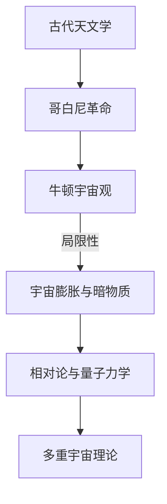

                 

### 1.1 宇宙探索的历程

宇宙探索是人类智慧的结晶，也是科学进步的重要驱动力。从古代的哲学思考到现代的天文学观测，人类对宇宙的认识经历了漫长的演变。最早关于宇宙的探索可以追溯到古代文明，如古埃及、巴比伦和中国的天文学。他们通过观测星星和行星的运动，记录下了大量的天文现象，并试图解释这些现象背后的规律。

进入中世纪，基督教教会对天文学的禁锢使得天文学的发展受到了限制。直到文艺复兴时期，科学方法才开始复兴，哥白尼提出了日心说，挑战了长期以来占据主导地位的托勒密的地心说，为宇宙观带来了革命性的变化。哥白尼的理论虽然并不完全正确，但它激发了人们对宇宙探索的热情，并促使后来的科学家继续深入探究。

### 1.2 牛顿宇宙观的局限性

牛顿（Isaac Newton）是近代物理学的奠基人之一，他的三大运动定律和万有引力定律构成了经典物理学的核心。牛顿的宇宙观认为宇宙是静态的、有序的，所有物体的运动都可以用他的定律来描述。然而，随着科学的发展，牛顿宇宙观的局限性逐渐显现。

首先，牛顿的万有引力定律在描述宏观物体运动方面非常有效，但在微观领域则显得力不从心。例如，它无法解释电子在原子中的行为。其次，牛顿宇宙观是建立在绝对时空观念上的，即时间和空间是独立于观察者的客观存在。然而，爱因斯坦的相对论提出了时空是相对的这一概念，这一观点对牛顿宇宙观形成了巨大挑战。

此外，牛顿宇宙观在面对宇宙膨胀和暗物质、暗能量等现代宇宙学问题时的解释能力也明显不足。随着观测技术的进步，科学家们发现宇宙正在加速膨胀，而暗物质和暗能量的存在也无法用牛顿的万有引力定律来解释。这些问题推动了科学家们对宇宙理论的不断探索和革新。

### 1.3 多重宇宙理论的背景

随着经典物理学的局限性的显现，科学家们开始探索新的宇宙模型。20世纪初，爱因斯坦提出了广义相对论，这一理论极大地扩展了我们对宇宙的理解。然而，即使是在广义相对论的框架内，一些基本问题仍然没有得到解决，比如宇宙的起源和命运。

在此背景下，多重宇宙理论（Multiverse Theory）逐渐兴起。多重宇宙理论认为，我们所观察到的宇宙只是众多宇宙中的一个，这些宇宙可能具有不同的物理定律、不同的初始条件，甚至是不同的维度。这一理论为解决宇宙学中的一些难题提供了新的视角，如宇宙的加速膨胀、暗物质和暗能量的本质等。

多重宇宙理论的提出也受到了量子力学的影响。量子力学揭示了微观世界的非确定性，这促使科学家们思考，如果微观世界是随机的，那么宇宙的多样性也可能是普遍的。此外，宇宙背景微波辐射（Cosmic Microwave Background Radiation）的发现为多重宇宙理论提供了重要的观测依据。

总的来说，多重宇宙理论不仅是对牛顿宇宙观的一种扩展，也是对现代宇宙学问题的尝试性解答。它为我们理解宇宙的多样性和复杂性提供了新的路径，同时也带来了许多新的科学挑战。

---

**Mermaid 流程图：**



### 2.1 牛顿的物理学原理

牛顿的物理学原理是经典物理学的基石，他的三大运动定律和万有引力定律构成了经典力学的核心。这些原理不仅在当时的科学界引起了巨大轰动，也对后来的科学研究产生了深远影响。

**牛顿的第一定律：惯性定律**

牛顿的第一定律，也称为惯性定律，描述了物体在没有外力作用下的运动状态。这一定律指出，一个物体如果不受外力，将保持静止状态或匀速直线运动状态。这意味着，物体具有保持其运动状态的趋势，这种性质称为惯性。

惯性定律可以用数学公式表示为：
$$
\vec{F} = \vec{0}
$$
其中，$\vec{F}$ 表示合外力。当合外力为零时，物体将保持其初始状态。

**牛顿的第二定律：加速度定律**

牛顿的第二定律描述了力与物体加速度之间的关系。这一定律指出，作用在物体上的外力等于物体质量与加速度的乘积。公式可以表示为：
$$
\vec{F} = m\vec{a}
$$
其中，$\vec{F}$ 是作用在物体上的合外力，$m$ 是物体的质量，$\vec{a}$ 是物体的加速度。这一定律揭示了力是改变物体运动状态的原因。

**牛顿的第三定律：作用与反作用定律**

牛顿的第三定律，也称为作用与反作用定律，描述了力的相互作用。这一定律指出，对于任何作用力，总存在一个大小相等、方向相反的反作用力。公式可以表示为：
$$
\vec{F}_{12} = -\vec{F}_{21}
$$
其中，$\vec{F}_{12}$ 表示物体1对物体2的作用力，$\vec{F}_{21}$ 表示物体2对物体1的反作用力。

**万有引力定律**

万有引力定律是牛顿最著名的发现之一，它描述了两个质点之间的引力作用。这一定律指出，任何两个质点都相互吸引，这个引力大小与两个质点的质量乘积成正比，与它们之间距离的平方成反比。公式可以表示为：
$$
\vec{F}_{12} = G\frac{m_1m_2}{r^2}\hat{r}
$$
其中，$\vec{F}_{12}$ 是物体1对物体2的引力，$G$ 是万有引力常数，$m_1$ 和 $m_2$ 分别是物体1和物体2的质量，$r$ 是两物体之间的距离，$\hat{r}$ 是从物体1指向物体2的单位向量。

牛顿的物理学原理通过这四个基本定律，系统地解释了物体运动的基本规律。这些原理不仅对物理学的发展产生了深远影响，也为后来的科学家提供了重要的研究基础。

### 2.2 牛顿宇宙观的逻辑结构

牛顿宇宙观是一种以经典力学为基础的宇宙模型，其核心在于描述宇宙中物体的运动和相互作用。牛顿宇宙观的逻辑结构可以概括为以下几个方面：

**静态宇宙模型**

牛顿宇宙观最初假设宇宙是静态的，即宇宙中的所有物体都保持不变的状态。在这种模型中，宇宙被视为一个无限大的空间，其中充满了静止的质点。这些质点按照牛顿的万有引力定律相互作用，从而保持宇宙的静态平衡。

**物理现象的解释**

在牛顿宇宙观中，所有物理现象都可以通过牛顿的三大运动定律和万有引力定律来解释。例如，行星的轨道运动、地球的自转和公转、以及天体的碰撞和碰撞后的运动轨迹等，都可以通过这些定律来描述。

**宇宙中的物体**

在牛顿宇宙观中，宇宙中的所有物体都可以视为质点，即没有大小和形状，只有质量和位置。这些质点在宇宙中自由运动，相互作用，从而形成复杂的宇宙结构。这种观点假设宇宙是均匀且各向同性的，即宇宙中的任何位置都是相同的。

**牛顿宇宙观的局限性**

尽管牛顿宇宙观在描述宏观物体运动方面取得了巨大成功，但它也存在一些局限性。首先，牛顿宇宙观无法解释宇宙的膨胀。随着观测技术的进步，科学家们发现宇宙正在加速膨胀，这与牛顿宇宙观中的静态宇宙模型相矛盾。

其次，牛顿宇宙观无法解释暗物质和暗能量的存在。现代宇宙学研究表明，宇宙中大部分物质是看不见的，这些物质以暗物质的形式存在，并且宇宙中还存在一种神秘的能量，称为暗能量，它们对宇宙的膨胀起着关键作用。

最后，牛顿宇宙观是基于绝对时空观念的，即时间和空间是独立于观察者的客观存在。然而，爱因斯坦的相对论提出了时空是相对的这一概念，这一观点对牛顿宇宙观形成了巨大挑战。

总的来说，牛顿宇宙观在经典物理学的框架内提供了对宇宙的初步理解，但面对现代宇宙学的问题，它显得力不从心。这促使科学家们不断探索新的宇宙模型，以更准确地描述宇宙的本质。

### 2.3 牛顿宇宙观的缺陷

尽管牛顿的宇宙观在描述宏观物体运动方面取得了显著成就，但随着科学的发展，其局限性也逐渐显现出来。首先，牛顿宇宙观无法解释宇宙膨胀的问题。20世纪初，天文学家埃德温·哈勃通过观测发现，宇宙中的星系正在以越来越快的速度相互远离，这表明宇宙正在加速膨胀。这一发现与牛顿宇宙观中的静态宇宙模型相矛盾，因为牛顿理论假设宇宙是静止且均匀分布的。

其次，牛顿宇宙观无法解释暗物质的存在。暗物质是一种不发光、不吸收光线的物质，它通过引力作用影响宇宙的演化。然而，根据牛顿的万有引力定律，只能解释可见物质之间的相互作用，而无法解释暗物质的引力效应。现代宇宙学研究指出，宇宙中大约有95%的物质是暗物质，这是一个巨大的挑战，需要新的理论框架来解释。

第三，牛顿宇宙观也无法解释暗能量的存在。暗能量是一种推动宇宙加速膨胀的神秘力量，其性质至今不明。暗能量与暗物质一样，不遵循牛顿引力定律，而是遵循广义相对论中的爱因斯坦场方程。这一发现进一步揭示了牛顿宇宙观的局限性，因为它无法涵盖广义相对论中的复杂现象。

此外，牛顿宇宙观还基于绝对时空观念，即时间和空间是独立于观察者的客观存在。然而，爱因斯坦的相对论提出了时空是相对的这一概念，即时空是随着物质和能量的分布而变化的。这一观点对牛顿宇宙观提出了根本性的挑战，因为它否定了牛顿宇宙观中的绝对时空基础。

综上所述，牛顿宇宙观在解释现代宇宙学现象方面存在明显的缺陷，这促使科学家们不断探索新的宇宙模型，以更准确地描述宇宙的本质。从牛顿宇宙观到广义相对论和量子力学的出现，人类对宇宙的理解不断深化，但同时也面临着新的科学挑战。

### 3.1 爱因斯坦的相对论

阿尔伯特·爱因斯坦（Albert Einstein）是20世纪最伟大的物理学家之一，他的相对论理论彻底改变了我们对宇宙的理解。相对论主要包括两部分：狭义相对论和广义相对论。这两部分理论从不同角度揭示了时间和空间的本质，为我们理解宇宙的复杂现象提供了新的视角。

**狭义相对论**

狭义相对论于1905年由爱因斯坦提出，主要研究在没有重力作用下，物体运动的基本规律。狭义相对论的核心思想是相对性原理和光速不变原理。

**相对性原理**：物理定律在所有惯性参考系中都是相同的。这意味着，无论观察者处于怎样的匀速直线运动状态，他们观测到的物理现象应该是相同的。

**光速不变原理**：在所有惯性参考系中，光在真空中的速度是一个常数，约为 \(3 \times 10^8\) 米/秒。这个常数不仅不受光源或观察者运动状态的影响，也不同于其他任何已知的物理现象。

狭义相对论的一个关键发现是时间膨胀效应和长度收缩效应。时间膨胀效应表明，当一个物体以接近光速运动时，其内部的时间相对于静止观察者会变慢。长度收缩效应则表明，运动物体的长度沿着运动方向会缩短。

时间膨胀效应的数学表达式为：
$$
t' = \frac{t}{\sqrt{1 - \frac{v^2}{c^2}}}
$$
其中，\(t'\) 是运动物体的时间，\(t\) 是静止观察者测得的时间，\(v\) 是物体的速度，\(c\) 是光速。

长度收缩效应的数学表达式为：
$$
L' = L\sqrt{1 - \frac{v^2}{c^2}}
$$
其中，\(L'\) 是运动物体的长度，\(L\) 是静止观察者测得的长度。

**广义相对论**

广义相对论于1915年由爱因斯坦提出，它将狭义相对论中的相对性原理扩展到了非惯性参考系，即包括重力作用在内的参考系。广义相对论的核心思想是引力并不是一种力，而是时空弯曲的结果。

**引力时空弯曲**：广义相对论认为，质量会扭曲周围的时空，物体沿着弯曲的时空轨迹运动，这种轨迹看起来就像受到了引力的作用。

广义相对论的数学基础是爱因斯坦场方程，该方程描述了时空的几何性质与物质能量分布之间的关系。爱因斯坦场方程可以表示为：
$$
G_{\mu\nu} + \Lambda g_{\mu\nu} = \frac{8\pi G}{c^4} T_{\mu\nu}
$$
其中，\(G_{\mu\nu}\) 是爱因斯坦张量，\(\Lambda\) 是宇宙常数，\(g_{\mu\nu}\) 是度规张量，\(T_{\mu\nu}\) 是能量-动量张量，\(G\) 是万有引力常数。

广义相对论的预言包括光线的弯曲、引力红移、时间膨胀和黑洞等。其中，光线的弯曲现象最早在1919年的日全食观测中得到证实，这一观测结果验证了广义相对论的预测，使这一理论获得了广泛的认可。

**引力波**

广义相对论的另一个重要预言是引力波的存在。引力波是由加速运动的质量产生的时空波动，它们以光速传播。2015年，LIGO科学合作组织首次直接探测到了引力波，这一发现不仅验证了广义相对论的预言，也为宇宙学的研究提供了新的手段。

总之，爱因斯坦的相对论不仅深刻改变了我们对宇宙的理解，也为现代物理学的发展奠定了基础。从狭义相对论到广义相对论，爱因斯坦的理论揭示了时间和空间的本质，为探索宇宙的奥秘提供了强有力的工具。

### 3.2 量子力学的基本原理

量子力学是现代物理学的重要分支，它描述了微观世界的物理现象，如原子、分子、基本粒子的行为。与经典物理学不同，量子力学揭示了微观世界的非确定性、叠加态和波粒二象性等独特特性。

**波粒二象性**

波粒二象性是量子力学的核心概念之一，它指出微观粒子既表现出波动性，又表现出粒子性。例如，电子既可以像波一样发生干涉和衍射，又可以像粒子一样在空间中定位。

**不确定性原理**

由海森堡（Werner Heisenberg）提出的不确定性原理指出，某些物理量（如位置和动量）不能同时被精确测量。数学上，不确定性原理可以用以下公式表示：
$$
\Delta x \Delta p \geq \frac{h}{4\pi}
$$
其中，\(\Delta x\) 是位置的不确定性，\(\Delta p\) 是动量的不确定性，\(h\) 是普朗克常数。

**量子态和波函数**

量子态是量子力学的另一个基本概念，它描述了粒子的状态。量子态通常用波函数 \(\psi\) 表示，波函数的平方 \(|\psi|^2\) 给出了粒子在空间中出现的概率分布。

**薛定谔方程**

薛定谔方程是量子力学的核心方程，它描述了量子态随时间的演化。薛定谔方程可以用以下形式表示：
$$
i\hbar \frac{\partial \psi}{\partial t} = \hat{H} \psi
$$
其中，\(i\) 是虚数单位，\(\hbar\) 是约化普朗克常数，\(\hat{H}\) 是哈密顿算符，\(\psi\) 是波函数。

**量子纠缠**

量子纠缠是量子力学中的一种现象，它描述了两个或多个粒子之间存在的非局域性联系。当两个粒子发生纠缠后，一个粒子的状态会即时影响另一个粒子的状态，无论它们相隔多远。

**量子态的叠加**

量子态的叠加是量子力学中的另一个重要概念，它指出一个量子系统可以同时处于多个状态的叠加。例如，一个电子可以同时处于自旋向上和自旋向下的状态，直到测量时才会确定其具体的状态。

总之，量子力学揭示了微观世界的复杂性和非确定性，为我们理解宇宙的微小部分提供了新的视角。虽然量子力学的数学表述较为复杂，但其基本原理和概念对现代物理学和技术发展产生了深远影响。

### 3.3 相对论与量子力学的融合

相对论与量子力学的融合是现代物理学的一个重大挑战，因为它涉及到两个看似截然不同的物理体系之间的统一。这一融合不仅对于理解宇宙的基本结构和行为具有重要意义，而且也对实验技术和理论框架提出了新的要求。

**标准模型**

标准模型是粒子物理学的核心理论，它将电磁力、弱力和强力纳入了统一的框架。在标准模型中，基本粒子被分为费米子（如电子、夸克）和玻色子（如光子、W和Z玻色子）。标准模型的成功在于它能够精确预测许多基本粒子的性质和相互作用。

然而，标准模型并不能完全解释所有已观测到的物理现象。例如，它无法解释引力如何在量子尺度上起作用，也无法解释暗物质和暗能量的本质。这些问题促使科学家们探索更广泛的统一理论。

**量子场论**

量子场论（QFT）是描述量子力学和相对论统一的理论框架。在量子场论中，粒子被视为场的激发态，而场本身是一种连续的量子实体。量子场论的核心方程是拉格朗日量，它将粒子的动力学和场的演化结合在一起。

量子场论的突出特点是它能够自然地处理粒子的波动性和粒子性，同时保持了相对论的时空观念。例如，量子电动力学（QED）是量子场论的一个成功实例，它精确地描述了电磁相互作用。

**黑洞与引力波**

在相对论与量子力学的融合中，黑洞和引力波是两个重要的研究课题。黑洞是由质量极大的物体塌缩形成的，其引力场如此强大，以至于连光也无法逃逸。广义相对论预言了黑洞的存在，并描述了黑洞的性质，如事件视界和黑洞熵。

引力波是时空的波动，由加速运动的物体产生。爱因斯坦在广义相对论中预言了引力波的存在，2015年LIGO的实验成功探测到了引力波，验证了广义相对论的预言，也为相对论与量子力学的融合提供了新的证据。

**量子引力**

量子引力是试图将量子力学与广义相对论统一的理论。目前，量子引力还没有一个完全成熟的理论框架，但有几个主要的候选理论，如弦理论和环量子引力。

弦理论是一种试图统一所有基本力的理论，它将粒子视为一维的弦。弦理论不仅能够统一电磁力、弱力和强力，还能自然地解释黑洞和宇宙的早期演化。

环量子引力则试图通过量子化的时空几何来描述引力。它假设时空不是平坦的，而是由一系列环状的拓扑结构组成。

总之，相对论与量子力学的融合是现代物理学的一个重要研究方向，它涉及到对基本力的统一描述和对宇宙本质的深入理解。尽管目前仍有许多未解之谜，但科学家们在这一领域的研究不断推动着物理学的边界。

### 4.1 多重宇宙理论的起源

多重宇宙理论（Multiverse Theory）的起源可以追溯到20世纪物理学和宇宙学的发展。随着科学技术的进步，科学家们开始意识到我们观察到的宇宙可能只是众多宇宙中的一个。多重宇宙理论的起源主要受到以下几个方面的影响：

**宇宙学的危机**

在20世纪初期，宇宙学面临了几个重大问题，这些问题促使科学家们探索新的宇宙模型。首先，宇宙膨胀的发现表明宇宙不是静态的，这与牛顿宇宙观中的静态宇宙模型相矛盾。其次，暗物质和暗能量的发现使得牛顿的万有引力定律在宇宙尺度上失效，这需要新的理论框架来解释。这些问题表明，传统宇宙模型在解释宇宙现象时存在明显的局限性。

**基本粒子的多重性**

在量子力学的发展过程中，科学家们发现基本粒子具有多种不同的性质，如电荷、质量、自旋等。这些不同的性质表明，基本粒子的存在可能依赖于不同的物理定律和初始条件。这一发现为多重宇宙理论的提出提供了理论基础，即不同的宇宙可能具有不同的物理常数和初始条件。

**宇宙背景微波辐射**

宇宙背景微波辐射（Cosmic Microwave Background Radiation，简称CMB）是宇宙学中的一项重要发现。CMB是宇宙早期热辐射的余辉，它的存在为科学家们提供了观测宇宙早期状态的重要线索。通过对CMB的研究，科学家们发现宇宙具有高度均匀和各向同性的特性，这进一步支持了多重宇宙理论的可能性。

**波姆多重宇宙**

英国物理学家戴维·波姆（David Bohm）在20世纪中叶提出了波姆多重宇宙理论。波姆多重宇宙理论基于量子力学的非定域性原理，认为宇宙中的每一个量子事件都对应着无数个可能的结果，这些结果形成了不同的宇宙。波姆多重宇宙理论为解释量子现象提供了新的视角，也为多重宇宙理论的提出奠定了基础。

总之，多重宇宙理论的起源是科学发展的必然结果，它反映了人类对宇宙复杂性的不断探索。随着对宇宙现象的深入研究，多重宇宙理论将继续发展，为我们理解宇宙的本质提供新的思路。

### 4.2 多重宇宙的类型

多重宇宙理论是一个广泛而复杂的领域，它提出了许多不同的宇宙类型，每种类型都有其独特的物理特性和假设。以下是一些主要的多重宇宙类型：

**波姆多重宇宙**

波姆多重宇宙（Bohmian Multiverse）是基于量子力学的非定域性原理提出的。在这种理论中，宇宙中的每一个量子事件都会产生无数个分支，每个分支对应一个可能的未来。波姆多重宇宙强调量子事件的随机性和不可预测性，认为我们的宇宙只是众多可能分支中的一个。波姆多重宇宙的一个关键特征是，它避免了量子测量问题，即观察者的测量不会坍缩波函数，而是通过实际的物理过程选择特定的分支。

**虚拟多重宇宙**

虚拟多重宇宙（Virtual Multiverse）是一个相对较新的概念，它基于宇宙是计算模拟的思想。这种理论认为，我们的宇宙可能是一个高级文明或宇宙中的另一个实体创建的虚拟现实。虚拟多重宇宙假设存在一个更高维度的宇宙，它运行着无数个虚拟宇宙，每个虚拟宇宙都有可能具有不同的物理定律和初始条件。虚拟多重宇宙理论的一个挑战是，它需要解释如何从一个更高维度的宇宙中产生出物理定律和初始条件。

**振荡宇宙**

振荡宇宙（Oscillating Universe）是一种假设宇宙经历了无限次的周期性膨胀和收缩的过程。在这种宇宙模型中，宇宙会在大爆炸之后迅速膨胀，然后在某一点停止膨胀并开始塌缩，最终重新引发大爆炸。这种模型试图解决宇宙学中的一些问题，如宇宙的起源和命运。振荡宇宙的一个问题是，它需要解释每次膨胀和收缩之间的能量转换过程。

**膜宇宙**

膜宇宙（Brane Universe）是弦理论的一个扩展，它假设我们的宇宙只是高维空间中的一个膜（brane），其他宇宙可能存在于不同的膜上。膜宇宙理论认为，不同膜之间的相互作用可以解释宇宙中的各种现象，如暗物质和暗能量。膜宇宙的一个优点是，它提供了对多宇宙结构的一种直观描述，同时也解释了为什么我们观察到的宇宙具有特定的物理常数。

**多元宇宙**

多元宇宙（Multiverse）是一个广义的概念，它包括了所有可能存在的宇宙。这种理论认为，我们的宇宙只是众多宇宙中的一个，每个宇宙都有可能具有不同的物理定律和初始条件。多元宇宙的一个关键问题是，它需要解释为什么我们的宇宙具有特定的物理常数和结构。

总之，多重宇宙理论提出了许多不同的宇宙类型，每种类型都有其独特的物理假设和理论框架。这些理论不仅丰富了我们对宇宙的理解，也为我们探索宇宙的本质提供了新的视角。

### 4.3 多重宇宙理论的证据

多重宇宙理论的提出是基于对宇宙现象的观测和理论分析，尽管这一理论仍然存在许多争议，但科学家们已经发现了一些支持多重宇宙存在的证据。

**宇宙背景微波辐射**

宇宙背景微波辐射（Cosmic Microwave Background Radiation，简称CMB）是宇宙学中的一项重要发现。CMB是宇宙早期热辐射的余辉，它的存在为我们提供了宇宙早期状态的重要线索。通过对CMB的研究，科学家们发现宇宙具有高度均匀和各向同性的特性。这种均匀性表明，宇宙在大爆炸后迅速膨胀，这一过程可能是多个宇宙相互碰撞和融合的结果。

**宇宙加速膨胀**

宇宙加速膨胀的发现是另一个支持多重宇宙理论的证据。观测数据表明，宇宙的膨胀速度正在不断加快，这被称为宇宙加速膨胀。宇宙加速膨胀可能是由暗能量引起的，而暗能量可能是多个宇宙之间相互作用的结果。在某些多重宇宙理论中，宇宙之间的相互作用可以解释暗能量的存在。

**基本粒子的多重性**

在量子力学的研究中，科学家们发现基本粒子具有多种不同的性质，如电荷、质量、自旋等。这些不同的性质表明，基本粒子的存在可能依赖于不同的物理定律和初始条件。例如，某些理论认为，不同的宇宙可能有不同的物理常数，这会导致基本粒子的性质发生变化。

**宇宙的大尺度结构**

宇宙的大尺度结构也是支持多重宇宙理论的一个证据。通过观测宇宙中的星系、星团和超星系团，科学家们发现宇宙具有高度复杂的结构。这种复杂的结构可能是多个宇宙相互作用和碰撞的结果。例如，某些宇宙可能在大爆炸后迅速膨胀并与其他宇宙碰撞，这些碰撞可能导致宇宙中形成了大量的星系和星团。

总之，多重宇宙理论的证据不仅来自于宇宙背景微波辐射和宇宙加速膨胀，还包括基本粒子的多重性和宇宙的大尺度结构。这些证据为我们理解宇宙的多样性和复杂性提供了新的视角，同时也为科学家们提出了新的研究挑战。

### 5.1 宇宙的可理解性问题

宇宙的可理解性问题一直是科学哲学和物理学研究中的核心议题。从古代哲学家对宇宙本源的思考，到现代科学家对宇宙结构和演化过程的探索，人类始终在寻求对宇宙的全面理解。然而，随着科学技术的进步和理论的深化，宇宙的可理解性问题也变得更加复杂和多样化。

**宇宙学的终极目标**

宇宙学的终极目标是揭示宇宙的本质、起源和演化规律。人类对宇宙的理解经历了从古代哲学到现代科学的漫长历程。从古希腊的宇宙观，到中世纪的宗教宇宙观，再到现代科学的宇宙学，每一个阶段都代表着人类对宇宙认识的一次飞跃。

在当代宇宙学中，科学家们试图通过观测和理论模型来解答一系列关键问题，如宇宙的起源（大爆炸理论）、宇宙的结构（星系和星团的形成）、宇宙的演化（宇宙背景微波辐射、宇宙加速膨胀）以及宇宙的命运（宇宙热寂或新宇宙的诞生）。然而，这些问题的答案并不总是简单和直接的，宇宙学的终极目标仍然是一个持续探索的旅程。

**理解宇宙的限制**

尽管人类对宇宙的理解已经取得了巨大进展，但科学家们也面临着许多理解宇宙的限制。首先，宇宙的巨大尺度使得直接观测成为巨大的挑战。宇宙的尺度从微观的普朗克长度（约 \(10^{-35}\) 米）到宏观的宇宙尺度（约 \(10^{26}\) 米）跨度极大，这需要不同的观测技术和理论框架。

其次，量子力学和相对论的融合仍然是科学界的一个重要难题。量子力学描述了微观粒子的行为，而广义相对论描述了宏观引力的行为。然而，这两种理论在数学上无法兼容，这导致科学家们难以建立一个统一的理论来描述宇宙中的所有现象。

此外，观测数据的不确定性和理论模型的简化也限制了我们对宇宙的理解。尽管科学家们通过精密的观测设备收集了大量的宇宙数据，但这些数据仍然存在误差和不确定性。同时，为了便于理论分析和计算，科学家们往往需要简化模型，这可能导致对真实宇宙的描述不完全准确。

最后，宇宙的可理解性问题还涉及到哲学层面的思考。宇宙是否存在目的、意义和意识，这些问题不仅超越了科学范畴，也引发了深刻的哲学和宗教讨论。

**未来的探索方向**

面对宇宙的可理解性问题，未来的探索方向包括以下几个方面：

1. **新的观测技术**：开发新的观测设备和探测技术，如更高分辨率的望远镜、更灵敏的探测器等，以获取更准确的宇宙数据。

2. **量子引力和弦理论**：探索量子引力和弦理论，尝试将量子力学与广义相对论统一起来，建立一个描述宇宙所有现象的统一理论。

3. **多宇宙和宇宙模拟**：研究多宇宙理论和宇宙模拟，通过计算模拟来探索宇宙的可能演化路径和多样性。

4. **跨学科合作**：加强不同学科之间的合作，如物理学、天文学、数学和计算机科学，通过多学科的综合研究推动宇宙学的发展。

总之，宇宙的可理解性问题是一个复杂而深远的议题，它不仅挑战着我们的科学认知，也触及到了人类存在的意义和宇宙的本质。随着科学技术的进步和理论的发展，我们有理由相信，人类将逐步揭开宇宙的神秘面纱，实现对宇宙的全面理解。

### 5.2 科学方法在宇宙学中的应用

科学方法是宇宙学研究的基础，它通过系统的观察、实验和理论分析来揭示宇宙的奥秘。在宇宙学中，科学方法的应用贯穿于从观测数据收集到理论模型构建的整个过程中。

**观测与实验**

宇宙学的观测通常涉及天文学和粒子物理学中的先进设备和技术。例如，射电望远镜用于观测宇宙背景微波辐射，光学望远镜用于观测星系和星团，粒子加速器用于研究基本粒子的性质。这些观测设备能够收集到大量的宇宙数据，这些数据为宇宙学的理论分析提供了宝贵的素材。

例如，欧洲航天局的普朗克卫星通过测量宇宙背景微波辐射的温度波动，帮助科学家们更好地理解了宇宙的结构和演化。这些观测数据不仅验证了现有的宇宙学理论，还为科学家们提供了新的研究方向。

**数学模型**

宇宙学的数学模型是理论分析的核心。这些模型通常基于物理定律和观测数据，通过数学公式来描述宇宙的演化过程。例如，宇宙学中的弗里德曼-勒梅特-罗伯逊-沃尔克（FLRW）模型描述了宇宙的均匀和各向同性膨胀。这个模型的基础方程是弗里德曼方程，它可以用以下形式表示：
$$
\dot{a}(t) = -\frac{4\pi G \rho(t)}{3} a(t)
$$
其中，\(a(t)\) 是宇宙尺度因子，\(\rho(t)\) 是宇宙的平均密度，\(G\) 是万有引力常数。

**核心概念与联系**

在宇宙学中，核心概念之间的联系是构建理论模型的关键。例如，宇宙的膨胀与暗能量密切相关。暗能量是一种假设的存在，它推动着宇宙加速膨胀。这一概念与爱因斯坦的宇宙常数有直接联系，后者也是用来解释宇宙加速膨胀的一种假设。

另一个核心概念是暗物质，它是一种不发光、不吸收光线的物质，但通过引力作用影响宇宙的演化。暗物质和暗能量的存在表明，宇宙中的大部分物质和能量并不遵循我们熟悉的物理定律。

**Python源代码与数学模型**

为了更直观地理解宇宙学的数学模型，我们可以使用Python编写简单的模拟代码。以下是一个基于FLRW模型的宇宙膨胀模拟的Python代码示例：

```python
import numpy as np

# 假设宇宙的平均密度为常数
rho_0 = 1.0
G = 6.67430e-11  # 万有引力常数

# 弗里德曼方程
def friedmann_equation(a, rho):
    return -4 * np.pi * G * rho / 3 * a

# 模拟宇宙膨胀
def simulate_expansion(a0, t_end, t_steps):
    a = np.linspace(a0, 1, t_steps)
    t = np.linspace(0, t_end, t_steps)
    
    for i in range(1, t_steps):
        da_dt = friedmann_equation(a[i], rho_0)
        a[i] = a[i-1] + da_dt * dt
    
    return t, a

# 模拟参数
a0 = 1  # 初始宇宙尺度因子
t_end = 1e10  # 模拟时间（单位：秒）
t_steps = 1000  # 时间步数

# 执行模拟
t, a = simulate_expansion(a0, t_end, t_steps)

# 可视化膨胀过程
import matplotlib.pyplot as plt

plt.plot(t / 1e9, a)  # 将时间单位转换为亿年
plt.xlabel('Time (Gy)')
plt.ylabel('Scale Factor')
plt.title('Universe Expansion')
plt.show()
```

这个简单的Python模拟展示了宇宙从初始状态到当前时间的膨胀过程。通过调整模拟参数，我们可以研究不同条件下宇宙的膨胀行为。

**项目实战**

在宇宙学研究中，项目实战通常涉及复杂的数据分析和模型构建。以下是一个实际案例：

**案例：利用宇宙背景微波辐射数据分析宇宙膨胀**

1. **开发环境搭建**：
   - 安装Python和Numpy、Matplotlib等科学计算库。
   - 获取宇宙背景微波辐射数据（例如，来自普朗克卫星的数据）。

2. **源代码实现**：
   - 编写Python代码读取和预处理数据。
   - 使用数据拟合方法（如最小二乘法）确定宇宙尺度因子的变化。

3. **代码解读与分析**：
   - 分析拟合结果，验证宇宙膨胀模型。
   - 通过可视化工具展示宇宙膨胀的图像。

4. **实际案例分析与详细讲解**：
   - 分析普朗克卫星的观测数据，探讨宇宙膨胀的历史和未来。
   - 讨论暗能量和暗物质对宇宙膨胀的影响。

5. **项目小结**：
   - 总结项目实现的关键步骤和技术。
   - 指出项目的局限性并提出未来研究方向。

**最佳实践 tips**：

- **数据质量控制**：确保数据的准确性和一致性，对异常值进行处理。
- **模型验证**：通过多次实验和不同数据集验证模型的可靠性。
- **可视化工具**：使用适当的可视化工具展示数据和分析结果。

总之，科学方法在宇宙学中的应用不仅帮助我们理解宇宙的本质，也为科学家们提供了探索宇宙的强大工具。通过不断的实验、数据分析和理论建模，人类对宇宙的认识将不断深入。

### 5.3 未来宇宙学的展望

未来宇宙学的发展前景令人充满期待，随着科学技术的不断进步，我们有望在多个领域取得重大突破，进一步揭示宇宙的奥秘。

**新的观测技术**

首先，新的观测技术将继续推动宇宙学的发展。例如，下一代大型望远镜，如詹姆斯·韦伯空间望远镜（James Webb Space Telescope）和欧塞拉望远镜（Euclid Telescope），将显著提高我们对遥远宇宙的观测能力。这些望远镜配备了先进的仪器，能够探测到更微弱和更遥远的宇宙信号，如宇宙背景微波辐射和早期宇宙的光辉。此外，地面观测设施，如平方公里阵列（Square Kilometer Array，SKA）和下一代射电望远镜，也将帮助我们更深入地研究宇宙的大尺度结构。

**量子引力与多宇宙理论**

另一个重要的发展方向是量子引力和多宇宙理论的融合。量子引力试图将量子力学与广义相对论统一起来，以描述宇宙在极小尺度上的行为。当前，弦理论和环量子引力是量子引力研究的主要方向。通过探索这些理论，科学家们希望揭示宇宙的基本结构和起源。此外，多宇宙理论的进一步发展将帮助我们理解宇宙的多样性和复杂性。未来，科学家们可能通过实验验证或观测证据来证实多重宇宙的存在，这将彻底改变我们对宇宙的认识。

**宇宙演化的模拟**

宇宙演化的模拟是未来宇宙学研究的另一个重要领域。通过高性能计算机模拟，科学家们可以模拟宇宙从大爆炸到现在的整个演化过程。这些模拟将帮助我们更深入地理解宇宙的早期状态，如宇宙背景微波辐射的形成和星系的形成过程。此外，模拟还将用于预测宇宙的未来演化路径，探讨宇宙是否会继续加速膨胀，或者是否会经历新的宇宙大爆炸。

**人类意识的探索**

未来宇宙学不仅关注物理宇宙的奥秘，还可能涉及人类意识的研究。随着量子力学和非定域性原理的发展，科学家们开始探讨人类意识与宇宙的关系。未来，我们可能通过结合量子力学和认知科学的研究，探索人类意识是如何在宇宙中产生的，这将为我们理解宇宙的本质提供新的视角。

**国际合作与跨学科研究**

未来宇宙学的发展将更加依赖于国际合作和跨学科研究。宇宙学问题具有全球性，需要全球科学家的共同努力。通过国际合作，科学家们可以共享数据、资源和知识，推动宇宙学研究的快速发展。此外，跨学科研究将促进不同领域之间的知识交流，为解决宇宙学问题提供新的思路和方法。

总之，未来宇宙学的发展前景广阔，新的观测技术、量子引力与多宇宙理论的探索、宇宙演化模拟和人类意识的探讨，都将为宇宙学带来新的突破和革命性进展。随着科学技术的不断进步，我们有理由相信，人类将对宇宙的认识越来越深入，揭开宇宙的神秘面纱。

### 结尾

在这篇文章中，我们从牛顿宇宙观出发，逐步探讨了相对论、量子力学以及多重宇宙理论，试图理解宇宙的复杂性和多样性。从牛顿的三大定律和万有引力定律，到爱因斯坦的相对论和量子力学，再到现代宇宙学中的多重宇宙理论，每一个阶段都是人类对宇宙认识的重大飞跃。

在探索宇宙的道路上，我们不仅需要深厚的物理学知识，还需要跨学科的思维和创新的视角。未来，随着科学技术的不断进步，我们有望在宇宙学领域取得更多的突破，进一步揭示宇宙的奥秘。

最后，感谢读者们的耐心阅读。希望这篇文章能够激发你对宇宙探索的兴趣，也欢迎读者们继续关注宇宙学的最新研究进展。

**作者：AI天才研究院/AI Genius Institute & 禅与计算机程序设计艺术 /Zen And The Art of Computer Programming**

