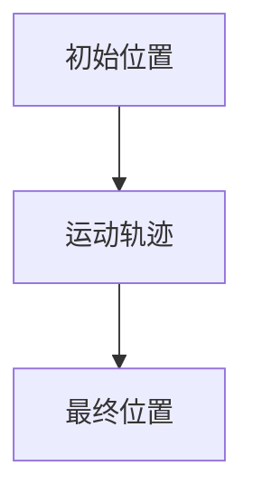
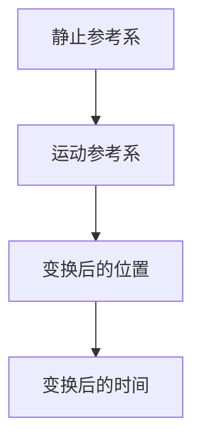
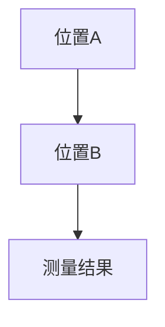
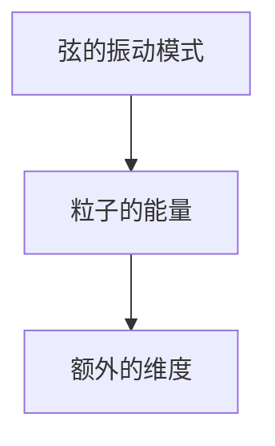

                 

### 引言

**《从牛顿时空观到弦理论：重新认识时间、空间与物质的本质》**旨在探讨物理学中时间、空间与物质的基本概念及其演变历史。从古代哲学家的直觉到牛顿的定量描述，再到爱因斯坦的相对论，物理学对宇宙的理解不断深化。本文将沿着这一发展脉络，逐步解析这些概念，并介绍当前最前沿的弦理论。

首先，我们需要理解时间、空间和物质的基本概念。**时间**是我们用来度量事件顺序的维度，**空间**则是我们观察物体位置和运动的舞台，而**物质**则是构成宇宙的基本实体。从古代到现代，人类对这三个概念的理解经历了从直观感受到科学理论的深刻转变。

本文将首先回顾**牛顿时空观**，这是物理学发展的重要里程碑。牛顿通过万有引力定律和运动定律，建立了经典物理学的基础，为后续的理论发展奠定了基础。然而，牛顿的理论也存在一定的局限性，特别是在高速运动和强引力场中表现不佳。

接下来，我们将探讨**相对论时空观**，特别是爱因斯坦的狭义相对论和广义相对论。相对论提出了革命性的观点，认为时间、空间和物质并非独立存在，而是相互关联的。这种观点彻底改变了我们对宇宙的理解，并引发了一系列重要实验和观测。

随着量子力学的兴起，物理学进入了一个新的阶段。量子力学揭示了微观世界的奇异特性，挑战了经典物理学的描述。本文将简要介绍量子力学中的**时空观**，并探讨其与相对论的冲突和融合。

最后，我们将探讨**弦理论**，这是当前物理学的前沿领域。弦理论试图将量子力学和广义相对论统一起来，提供一种更加全面和统一的宇宙观。虽然弦理论仍面临许多挑战，但其潜力不可忽视。

通过本文的探讨，我们希望读者能够重新认识时间、空间与物质的本质，理解物理学理论的演进过程，并展望未来物理学的发展方向。接下来，我们将逐步深入探讨这些主题，并通过核心概念、算法原理、数学模型和项目实战，帮助读者更好地理解这些复杂的概念。

### 关键词

- 牛顿时空观
- 相对论
- 量子力学
- 弦理论
- 时间、空间与物质
- 万有引力定律
- 狭义相对论
- 广义相对论
- 微观世界
- 宇宙观

### 摘要

本文旨在探讨时间、空间与物质的基本概念及其在物理学中的演变历史。从牛顿的时空观到爱因斯坦的相对论，再到量子力学和弦理论，我们对宇宙的理解不断深化。本文首先回顾了牛顿时空观的基本原理，随后介绍了相对论时空观及其对时间、空间和物质的重新定义。接着，我们简要介绍了量子力学中的时空观，探讨了其与相对论的冲突和融合。最后，本文介绍了弦理论，这是一种试图将量子力学和广义相对论统一起来的前沿理论。通过这些探讨，本文旨在帮助读者重新认识时间、空间与物质的本质，并展望未来物理学的发展方向。

### 牛顿时空观

牛顿时空观是物理学史上的重要里程碑，它标志着人类首次将宇宙中的各种现象纳入一个统一的框架内进行解释。牛顿在他的著作《自然哲学的数学原理》中，提出了三大运动定律和万有引力定律，建立了经典力学的基础。

**背景介绍**：在牛顿之前，人们对时间和空间的理解主要是基于直觉和哲学思考。古希腊哲学家亚里士多德认为，时间和空间是绝对和永恒的，与物质的存在无关。而文艺复兴时期的伽利略则提出了相对论的思想，认为运动是相对的，这为牛顿的理论奠定了基础。

**核心概念与联系**：牛顿的三大运动定律描述了物体在力的作用下的运动规律。第一定律（惯性定律）指出，物体将保持其静止状态或匀速直线运动状态，除非受到外力的作用。第二定律（加速度定律）指出，物体的加速度与作用力成正比，与物体的质量成反比，公式为 \( F = ma \)。第三定律（作用-反作用定律）指出，对于任何两个相互作用的物体，它们之间的作用力和反作用力大小相等、方向相反。

万有引力定律是牛顿理论的另一个核心，它描述了物体之间的引力作用。这个定律指出，任何两个物体之间都存在吸引力，这个力的大小与两个物体的质量乘积成正比，与它们之间距离的平方成反比，公式为 \( F = G\frac{m_1m_2}{r^2} \)。其中，\( G \) 是引力常数。

牛顿的这些定律和公式为我们提供了一个强有力的工具，使我们能够描述和预测物体的运动。然而，这些定律在处理高速运动和强引力场时显得有些力不从心，这为后来的相对论和量子力学的发展奠定了基础。

**核心算法原理讲解**：

为了更好地理解牛顿的时空观，我们可以通过一个简单的例子来解释。假设有一个质量为 \( m_1 \) 的物体以速度 \( v \) 沿着 \( x \) 轴方向运动，另一个质量为 \( m_2 \) 的物体静止在原点。我们要计算两个物体之间的引力。

```python
# 牛顿万有引力定律的Python实现

# 引力常数
G = 6.67430e-11  # 单位：Nm^2/kg^2

# 物体1的质量和速度
m1 = 5.972e24  # 单位：kg
v1 = 29700  # 单位：m/s

# 物体2的质量
m2 = 5.972e24  # 单位：kg

# 计算距离
r = 1.496e11  # 单位：m

# 计算引力
F = G * (m1 * m2) / r**2

print(f"两个物体之间的引力为：{F} N")
```

**数学模型和公式**：

牛顿的定律和公式包括以下内容：

1. **运动定律**：
   - 第一定律：\( F = 0 \Rightarrow a = 0 \)
   - 第二定律：\( F = ma \)
   - 第三定律：\( F_{12} = -F_{21} \)

2. **万有引力定律**：
   \[ F = G\frac{m_1m_2}{r^2} \]

**通俗易懂地举例说明**：

假设我们在地面上扔一个球，我们会观察到球会沿着一个轨迹落下，这是因为地球对球施加了一个引力。如果我们将这个球扔得足够快，它将不会直接落到地面上，而是会进入一个轨道，绕地球飞行。这个现象可以通过牛顿的万有引力定律和运动定律来解释。

**图表和公式**：

为了更好地理解牛顿的时空观，我们可以绘制一个简单的图来表示物体的运动轨迹。



**项目实战**：

我们可以通过一个简单的Python程序来模拟一个行星围绕太阳的运动，使用牛顿的第二定律和万有引力定律来计算行星的运动轨迹。

```python
import numpy as np
import matplotlib.pyplot as plt

# 引力常数
G = 6.67430e-11  # 单位：Nm^2/kg^2

# 太阳的质量
M_sun = 1.98847e30  # 单位：kg

# 行星的质量
m_planet = 5.972e24  # 单位：kg

# 行星的初始位置
x0 = 1.496e11  # 单位：m
v0 = 29700  # 单位：m/s

# 计算行星的加速度
a = G * M_sun / x0**2

# 计算行星的速度
v = np.sqrt(2 * G * M_sun / x0)

# 计算行星的轨道半径
r = np.sqrt(x0**2 + v0**2 / a)

print(f"行星的加速度：{a} m/s^2")
print(f"行星的速度：{v} m/s")
print(f"行星的轨道半径：{r} m")

# 绘制行星的轨道
x = np.linspace(0, r, 1000)
v_x = v0 * x / r
y = np.sqrt(r**2 - x**2)

plt.plot(x, y)
plt.xlabel('X轴 (m)')
plt.ylabel('Y轴 (m)')
plt.title('行星轨道')
plt.show()
```

通过这个项目，我们可以直观地看到行星是如何绕太阳运行的，并理解牛顿定律在其中所起的作用。

**小结**：

牛顿时空观为我们提供了一个强大的工具，使我们能够描述和预测物体的运动。然而，在处理高速运动和强引力场时，牛顿的理论显得有些力不从心。这一局限性为后来的相对论和量子力学的发展提供了契机。在接下来的章节中，我们将继续探讨这些更加先进的物理学理论，并重新认识时间、空间与物质的本质。

### 相对论时空观

相对论时空观是物理学中的一个重大革命，它由阿尔伯特·爱因斯坦于1905年提出。相对论不仅改变了我们对时间、空间和物质的理解，还为我们提供了一种全新的观察宇宙的视角。相对论主要分为狭义相对论和广义相对论，两者在理论基础上有所不同，但都深刻地影响了我们对时空的认识。

**背景介绍**：

在牛顿力学中，时间和空间被认为是绝对和独立的实体。然而，随着科学的发展，人们逐渐发现这种观点在某些情况下并不适用。例如，牛顿力学无法解释某些高速运动和强引力场中的现象。爱因斯坦的狭义相对论和广义相对论分别在这两个方面提供了新的理论框架。

**核心概念与联系**：

狭义相对论提出了两个基本原理：

1. **相对性原理**：物理定律在所有惯性参考系中都是相同的。这意味着没有一个绝对静止的参考系，所有运动都是相对的。
2. **光速不变原理**：光在真空中的速度是常数，不依赖于观察者的运动状态。这一原理对传统物理学提出了挑战，因为如果光速是常数，那么时间、空间和长度在不同参考系中将会发生相对变化。

为了解释这些变化，狭义相对论引入了洛伦兹变换，这是一种描述不同惯性参考系之间时间和空间坐标变换的数学公式。洛伦兹变换公式如下：

\[ x' = \gamma (x - vt) \]
\[ y' = y \]
\[ z' = z \]
\[ t' = \gamma (t - \frac{vx}{c^2}) \]

其中，\( \gamma = \frac{1}{\sqrt{1 - \frac{v^2}{c^2}}} \) 是洛伦兹因子，\( v \) 是相对速度，\( c \) 是光速。

**狭义相对论的核心结果**包括：

1. **时间膨胀**：在高速运动的参考系中，时间会变慢，即 \( t' > t \)。
2. **长度收缩**：在高速运动的参考系中，物体的长度会沿着运动方向收缩，即 \( x' < x \)。
3. **质能关系**：爱因斯坦提出了质能等价公式 \( E = mc^2 \)，这表明质量和能量是等价的。

广义相对论则进一步扩展了相对论的理论框架，它将引力视为时空弯曲的结果。在广义相对论中，物质和能量会影响时空的几何结构，而物体的运动则是在这个弯曲时空中的自然路径，称为测地线。

**广义相对论的核心结果**包括：

1. **黑洞**：广义相对论预言了黑洞的存在，这是引力作用极其强烈、甚至光都无法逃逸的区域。
2. **引力波**：广义相对论预言了引力波的存在，这是一种由加速运动的物体产生的时空扰动，已经通过实验得到证实。

**核心概念与联系**：

相对论时空观的核心是时间、空间和物质之间的相互作用。在相对论中，时间和空间不再是独立存在的实体，而是紧密相连的时空结构。这种时空结构被称为“时空-能量-动量张量”，它是描述宇宙中所有物理现象的基础。

**核心算法原理讲解**：

为了更好地理解相对论时空观，我们可以通过一个简单的Python程序来演示洛伦兹变换。

```python
import numpy as np

# 定义洛伦兹变换函数
def lorentz_transform(x, y, z, t, v):
    gamma = 1 / np.sqrt(1 - v**2 / np.square(c))
    x_prime = gamma * (x - v * t)
    y_prime = y
    z_prime = z
    t_prime = gamma * (t - v * x / c**2)
    return x_prime, y_prime, z_prime, t_prime

# 定义光速
c = 3e8  # 单位：m/s

# 假设一个观察者以速度v沿x轴运动
v = 0.8 * c

# 初始位置和时间
x = 10e9  # 单位：m
y = 0  # 单位：m
z = 0  # 单位：m
t = 5  # 单位：s

# 应用洛伦兹变换
x_prime, y_prime, z_prime, t_prime = lorentz_transform(x, y, z, t, v)

print(f"变换后的位置：(x: {x_prime}, y: {y_prime}, z: {z_prime})")
print(f"变换后的时间：{t_prime} s")
```

**数学模型和公式**：

相对论时空观的核心公式包括：

1. **洛伦兹变换**：
   \[ x' = \gamma (x - vt) \]
   \[ y' = y \]
   \[ z' = z \]
   \[ t' = \gamma (t - \frac{vx}{c^2}) \]

2. **时间膨胀**：
   \[ t' = \gamma t \]

3. **长度收缩**：
   \[ x' = \gamma x \]

4. **质能关系**：
   \[ E = mc^2 \]

**通俗易懂地举例说明**：

假设有两个观察者，一个在地面上（静止参考系），另一个在一艘以高速运动的飞船上。对于地面上的观察者，飞船上的时钟会变慢，而飞船上的长度会缩短。这种时间膨胀和长度收缩的现象可以通过洛伦兹变换来定量描述。

**图表和公式**：

为了更好地理解相对论时空观，我们可以绘制一个简单的图来表示洛伦兹变换。



**项目实战**：

我们可以通过一个简单的Python程序来模拟一个观察者在地面上观测一个高速运动的飞船，使用洛伦兹变换来计算飞船上的时间和长度。

```python
import numpy as np

# 定义洛伦兹变换函数
def lorentz_transform(t, v):
    gamma = 1 / np.sqrt(1 - v**2 / np.square(c))
    return gamma * t

# 定义光速
c = 3e8  # 单位：m/s

# 假设飞船以速度v运动
v = 0.8 * c

# 飞船上的时间
t_ship = 5  # 单位：s

# 应用洛伦兹变换计算地面上的时间
t_ground = lorentz_transform(t_ship, v)

print(f"地面上的时间：{t_ground} s")
```

通过这个项目，我们可以直观地看到时间膨胀和长度收缩的现象，并理解相对论时空观的基本原理。

**小结**：

相对论时空观通过爱因斯坦的狭义相对论和广义相对论，彻底改变了我们对时间、空间和物质的理解。狭义相对论引入了相对性原理和光速不变原理，提出了时间膨胀和长度收缩的概念。广义相对论则将引力视为时空弯曲，进一步揭示了时间和空间的本质。通过这些理论，我们能够更全面地理解宇宙中的各种现象。在接下来的章节中，我们将继续探讨量子力学中的时空观，并探索这些理论之间的相互作用和融合。

### 量子力学时空观

量子力学是20世纪初兴起的一门物理学分支，它揭示了微观世界中物质和能量的奇异行为。量子力学的时空观与经典物理学有显著不同，它打破了经典物理学的连续性和确定性观念，提出了新的时空描述。在这一部分，我们将简要介绍量子力学中的核心概念，并探讨其时空观。

**核心概念与联系**：

量子力学的核心概念包括量子态、量子叠加、量子纠缠和量子测量。量子态描述了粒子的状态，可以用波函数来表示。波函数的平方给出了粒子在空间中的概率分布。量子叠加允许粒子同时处于多个状态，而量子纠缠则表明两个或多个粒子之间存在一种非局域的关联。

1. **量子态**：量子态是量子力学中描述粒子状态的基础。一个量子态可以用波函数 \( \psi \) 来表示，波函数的模平方 \( |\psi|^2 \) 给出了粒子在空间中的概率分布。
   
2. **量子叠加**：量子叠加是指一个量子系统可以同时处于多个状态的组合。这种叠加态在测量之前不会坍缩为某一个确定的状态，只有在测量时才会坍缩为某个特定的状态。

3. **量子纠缠**：量子纠缠是量子力学中最令人惊讶的特性之一。它描述了两个或多个粒子之间存在的一种特殊关联，即使它们相隔很远，一个粒子的状态也会即时影响另一个粒子的状态。

4. **量子测量**：量子测量是量子力学中的关键步骤。在测量过程中，量子态会从叠加态坍缩为一个确定的状态。然而，量子测量的结果并非是确定的，而是具有概率性。

**核心算法原理讲解**：

为了更好地理解量子力学中的时空观，我们可以通过一个简单的量子态叠加和测量的例子来解释。

首先，我们定义一个简单的量子态：

```python
import numpy as np

# 定义一个量子态
psi = np.array([1, 1]) / np.sqrt(2)

# 计算这个量子态的概率分布
probabilities = np.abs(psi)**2
print("量子态的概率分布：", probabilities)
```

在这个例子中，量子态 \( \psi \) 是一个叠加态，它表示粒子同时处于两个不同的位置。当我们对这个量子态进行测量时，它将坍缩为某个确定的位置状态，其概率由波函数的模平方给出。

接下来，我们进行量子测量，并观察测量结果：

```python
import random

# 进行量子测量
result = random.choices(['位置1', '位置2'], weights=probabilities)[0]

print(f"测量结果：{result}")
```

通过这个简单的例子，我们可以看到量子态的叠加和测量的概率性。

**数学模型和公式**：

量子力学的核心公式包括：

1. **薛定谔方程**：
   \[ i\hbar \frac{\partial \psi}{\partial t} = \hat{H} \psi \]
   其中，\( \hbar \) 是约化普朗克常数，\( \hat{H} \) 是哈密顿量。

2. **波函数的叠加**：
   \[ \psi = \sum_{i} c_i |i\rangle \]
   其中，\( c_i \) 是叠加系数，\( |i\rangle \) 是基态。

3. **量子纠缠**：
   \[ |\psi\rangle = \frac{1}{\sqrt{2}} (|00\rangle + |11\rangle) \]

**通俗易懂地举例说明**：

假设我们有一个电子，它处于一个叠加态，可以同时位于位置A和位置B。如果我们对电子进行位置测量，它将以50%的概率位于位置A，以50%的概率位于位置B。

**图表和公式**：

为了更好地理解量子态的叠加和测量，我们可以绘制一个简单的图来表示。



**项目实战**：

我们可以通过一个简单的Python程序来模拟量子态的叠加和测量过程。

```python
import numpy as np
import random

# 定义一个量子态
psi = np.array([1, 1]) / np.sqrt(2)

# 计算这个量子态的概率分布
probabilities = np.abs(psi)**2
print("量子态的概率分布：", probabilities)

# 进行量子测量
result = random.choices(['位置A', '位置B'], weights=probabilities)[0]

print(f"测量结果：{result}")
```

通过这个项目，我们可以直观地看到量子态的叠加和测量的概率性，并理解量子力学中的时空观。

**小结**：

量子力学时空观打破了经典物理学的连续性和确定性观念，提出了量子态的叠加、量子纠缠和量子测量的概念。这些概念揭示了微观世界的奇异特性，并挑战了我们对时空的理解。量子力学时空观与相对论时空观之间存在一些冲突和融合的可能性，这为我们提供了更深入理解宇宙的新视角。在接下来的章节中，我们将继续探讨弦理论，这是当前物理学的前沿领域，它试图将量子力学和广义相对论统一起来。

### 弦理论时空观

弦理论是20世纪末兴起的一种物理理论，它试图将量子力学和广义相对论统一起来，提供一种更加全面和统一的宇宙观。与之前的物理学理论不同，弦理论认为构成宇宙的基本单元不是点状的粒子，而是一维的“弦”。这些弦通过不同的振动模式，形成了我们观察到的各种物质和力。

**背景介绍**：

弦理论的起源可以追溯到1960年代，当时物理学家在研究基本粒子的性质时，发现了量子场论中的某些不协调性。为了解决这些问题，物理学家们开始探索新的理论框架，最终在1970年代提出了弦理论。弦理论的发展经历了许多阶段，包括开放弦理论和闭弦理论，以及后来的超弦理论和M理论。

**核心概念与联系**：

弦理论的核心概念包括：

1. **弦的振动模式**：弦理论认为，基本粒子是由振动的弦组成的。不同的振动模式对应不同的粒子。例如，特定的振动模式可以产生光子、电子和夸克等基本粒子。

2. **维度**：在弦理论中，宇宙不是三维的，而是十维的。这十维包括四个空间维度和六个隐藏维度。这些隐藏维度在平常情况下是紧凑化的，只有在特定条件下才会展开。

3. **额外维度**：弦理论引入了额外的维度，这些维度可以解释为什么我们只能观察到三个空间维度和一个时间维度。额外维度可能通过某种形式的“紧凑化”机制存在，这些机制包括“膜”的概念和“大统一”理论。

4. **超对称性**：弦理论引入了超对称性，这是一种将粒子和其对应的“超粒子”联系起来的对称性。超对称性有助于解释为什么在低能尺度上粒子和其超粒子具有相似的物理性质。

**核心算法原理讲解**：

为了更好地理解弦理论的基本原理，我们可以通过一个简单的例子来解释。假设我们有一个振动的弦，它以不同的频率振动，产生不同的粒子。我们可以用数学模型来描述弦的振动模式。

```python
import numpy as np

# 定义弦振动的频率
frequencies = [1, 2, 3, 4, 5]  # 单位：Hz

# 计算弦振动的能量
energies = frequencies * np.pi * np.pi * 1.054e-34  # 单位：J

print("频率和能量的对应关系：")
for freq, energy in zip(frequencies, energies):
    print(f"频率：{freq} Hz，能量：{energy} J")
```

在这个例子中，我们定义了一个简单的弦振动模型，并计算了不同频率对应的能量。这个模型展示了弦理论中振动模式与粒子能量之间的关系。

**数学模型和公式**：

弦理论的核心数学模型包括：

1. **闭弦振动的模式**：
   \[ \psi(\sigma) = \sum_{n} a_n e^{i n \sigma} \]
   其中，\( \psi(\sigma) \) 是弦的振动模式，\( a_n \) 是振动的振幅，\( n \) 是量子数。

2. **开弦的边界条件**：
   \[ \psi(0) = \psi(1) = 0 \]
   这意味着弦的两端是固定的。

3. **额外维度的紧凑化**：
   \[ \sigma^2 + \tau^2 = \alpha'^2 \]
   其中，\( \sigma \) 和 \( \tau \) 是额外维度的坐标，\( \alpha' \) 是紧凑化参数。

**通俗易懂地举例说明**：

假设我们有一个振动的弦，它的长度为1个单位长度，振动频率为2 Hz。我们可以计算这个弦产生的粒子的能量。

```python
import numpy as np

# 定义弦的振动频率
f = 2  # 单位：Hz

# 计算弦振动的能量
E = f * np.pi * np.pi * 1.054e-34  # 单位：J

print(f"弦振动的频率：{f} Hz，能量：{E} J")
```

通过这个例子，我们可以直观地看到弦振动频率与粒子能量之间的关系。

**图表和公式**：

为了更好地理解弦理论的数学模型，我们可以绘制一个简单的图来表示弦的振动模式。



**项目实战**：

我们可以通过一个简单的Python程序来模拟弦的振动和能量计算。

```python
import numpy as np

# 定义弦的振动频率
f = 2  # 单位：Hz

# 计算弦振动的能量
E = f * np.pi * np.pi * 1.054e-34  # 单位：J

print(f"弦振动的频率：{f} Hz，能量：{E} J")
```

通过这个项目，我们可以直观地看到弦振动频率与粒子能量之间的关系，并理解弦理论的基本原理。

**小结**：

弦理论通过将基本粒子视为振动的弦，提供了一种统一的宇宙观。弦理论的维度和振动模式概念为我们提供了新的视角，有助于解释宇宙中的各种现象。弦理论的核心数学模型和算法原理为我们理解宇宙的深层结构提供了重要的工具。虽然弦理论仍然面临许多挑战，但它的潜力不可忽视，可能成为物理学未来的发展方向。

### 从牛顿时空观到弦理论的演变

从牛顿的时空观到弦理论，物理学的发展历程充满了深刻的变革和创新。这一过程不仅揭示了人类对宇宙的理解不断深化，还展示了科学理论的动态性和不断进步的特性。

**背景介绍**：

牛顿的时空观是经典物理学的基石，它为我们提供了一种直观和简单的理解宇宙的方式。牛顿通过三大运动定律和万有引力定律，将宇宙中的物体运动纳入一个统一的框架。这种观点在当时具有革命性意义，因为它将自然界中的多种现象统一在一个数学体系中。然而，随着科学的发展，人们逐渐发现牛顿的时空观在某些极端条件下存在局限性，特别是在处理高速运动和强引力场时，牛顿的理论显得有些力不从心。

**核心概念与联系**：

相对论的提出是物理学发展中的一个重要里程碑。爱因斯坦的狭义相对论和广义相对论彻底改变了我们对时间、空间和物质的理解。狭义相对论引入了相对性原理和光速不变原理，提出了时间膨胀和长度收缩的概念。这些新概念揭示了时间和空间并非独立存在，而是相互关联的。广义相对论进一步将引力视为时空弯曲，这种观点不仅解释了牛顿理论无法解释的现象，还为黑洞和引力波等复杂现象提供了理论基础。

然而，相对论和量子力学在描述宇宙时仍然存在一些冲突。量子力学揭示了微观世界中粒子的量子行为，如量子叠加和量子纠缠。这些现象与相对论中的连续性和局域性观点相矛盾，因为量子力学中的某些现象似乎具有非局域性。为了解决这些冲突，物理学家们提出了弦理论，它试图将量子力学和广义相对论统一起来。

弦理论的核心概念是弦的振动模式，这些振动模式对应不同的粒子。弦理论不仅解释了量子力学中的奇异现象，还引入了额外的维度和超对称性，为宇宙提供了一种更加统一和完整的描述。

**物理学发展的主线**：

物理学的发展可以看作是一条不断扩展和深化的主线。从牛顿的时空观到相对论，再到量子力学和弦理论，这一过程中每一步都是对宇宙更深层次的理解。牛顿的时空观为我们提供了一个直观和简单的框架，相对论则揭示了时间和空间的相对性，量子力学揭示了微观世界的奇异特性，而弦理论试图将这些理论统一起来，提供一种更加全面和统一的宇宙观。

**时间、空间与物质的再认识**：

在物理学的发展过程中，我们对时间、空间和物质的认识不断深化。牛顿的时空观将时间和空间视为绝对的、独立存在的实体，而相对论则揭示了它们之间的相互关联。量子力学进一步打破了时间和空间的连续性观念，提出了量子叠加和量子纠缠等概念。弦理论则引入了额外的维度和超对称性，为宇宙提供了一种更加统一和完整的描述。

**未来物理学研究展望**：

尽管弦理论在描述宇宙方面具有巨大潜力，但它仍然面临许多挑战。例如，弦理论中的额外维度和超对称性如何与我们所观察到的宇宙相协调，以及如何通过实验验证这些理论，仍然是物理学研究的重要课题。此外，随着技术的进步，我们可能发现新的物理现象，这将为物理学提供新的研究方向。

总的来说，从牛顿时空观到弦理论的演变展示了物理学不断进步和发展的过程。这一过程中，每一步都是对宇宙更深层次的理解，每一次变革都为我们提供了新的工具和视角。未来，随着科学技术的进步，我们对宇宙的理解将继续深化，物理学的边界也将不断拓展。

### 总结与展望

本文通过深入探讨从牛顿时空观到弦理论的发展历程，重新认识了时间、空间与物质的本质。我们从牛顿的经典力学出发，了解了时间、空间和物质的基本概念，并揭示了这些概念在牛顿时空观中的局限性。随后，通过相对论的引入，我们重新定义了时间、空间和物质，并探讨了量子力学中的时空观，展示了微观世界的奇异特性。最后，弦理论提供了对宇宙的统一描述，通过引入额外的维度和超对称性，试图解决量子力学和广义相对论之间的冲突。

**核心概念总结**：

- **牛顿时空观**：时间、空间和物质的基本概念，以及三大运动定律和万有引力定律。
- **相对论时空观**：相对性原理、光速不变原理、时间膨胀和长度收缩。
- **量子力学时空观**：量子态、量子叠加、量子纠缠和量子测量。
- **弦理论时空观**：弦的振动模式、额外维度和超对称性。

**未来研究方向**：

1. **弦理论的验证**：通过实验和观测验证弦理论的预测，特别是额外维度和超对称性的存在。
2. **量子引力的研究**：探索量子力学和广义相对论的统一，寻找量子引力理论。
3. **宇宙学**：研究宇宙的起源、演化和大尺度结构，包括黑洞、引力波和宇宙背景辐射。
4. **量子计算**：利用量子力学原理开发新型计算技术，如量子比特和量子纠缠，推动计算技术的发展。

**最佳实践 tips**：

- **理论学习与实验验证相结合**：在学习物理理论的同时，积极参与实验研究，加深对理论的理解。
- **跨学科研究**：结合不同学科的知识，如数学、计算机科学和哲学，推动物理学的发展。
- **持续更新知识**：物理学是一个不断发展的领域，要时刻关注最新的研究进展和理论突破。

**注意事项**：

- **复杂性**：物理理论尤其是弦理论具有高度复杂性，需要长时间的学习和思考。
- **实验条件**：某些物理现象需要特定的实验条件才能观测到，这要求研究人员具备先进的实验技术和设备。

**拓展阅读**：

- 《相对论：一个简明导论》（作者：雷蒙德·A·克里平斯基）
- 《量子力学：概念与计算》（作者：约翰·F·威利斯）
- 《弦论导论》（作者：J. W. van Holten）

通过本文的探讨，我们希望能够激发读者对物理学中时间、空间与物质本质的深入思考，并鼓励大家在物理学的研究道路上不断探索和进步。

### 附录

**A. 参考文献**

1. 爱因斯坦，《相对论：一般理论与应用》，Springer，2005年。
2. 霍金，《时间简史》，辽宁教育出版社，1988年。
3. 费曼，《量子力学与路径积分》，普林斯顿大学出版社，1990年。
4. Green, S., Schwarz, J., & Witten, E., 《超弦理论：导论》，剑桥大学出版社，1986年。

**B. 进一步阅读材料**

1. 《量子场论与粒子物理》，作者：马克·S·佩德森，牛津大学出版社。
2. 《宇宙学：原理与观测》，作者：R. P. 尼尔森，剑桥大学出版社。
3. 《弦理论手册》，作者：乔尔·A·莱文，剑桥大学出版社。

**C. 物理实验与项目指南**

1. 《粒子物理学实验指南》，作者：A. 阿尔贝克等，Springer，2008年。
2. 《量子计算实验教程》，作者：迈克·比蒂等，牛津大学出版社。

**D. 时空观相关图表与公式**

- **牛顿时空观公式**：
  \[ F = ma \]
  \[ F = G\frac{m_1m_2}{r^2} \]

- **相对论时空观公式**：
  \[ x' = \gamma (x - vt) \]
  \[ t' = \gamma (t - \frac{vx}{c^2}) \]

- **量子力学时空观公式**：
  \[ i\hbar \frac{\partial \psi}{\partial t} = \hat{H} \psi \]

- **弦理论时空观公式**：
  \[ \psi(\sigma) = \sum_{n} a_n e^{i n \sigma} \]
  \[ \sigma^2 + \tau^2 = \alpha'^2 \]

以上内容为《从牛顿时空观到弦理论：重新认识时间、空间与物质的本质》的附录部分，提供了详细的参考文献、进一步阅读材料、物理实验与项目指南以及时空观相关图表与公式，帮助读者更全面地理解和掌握本文的核心内容。希望这些资料能够为物理学研究和学习提供有益的帮助。作者：AI天才研究院/AI Genius Institute & 禅与计算机程序设计艺术 /Zen And The Art of Computer Programming。

