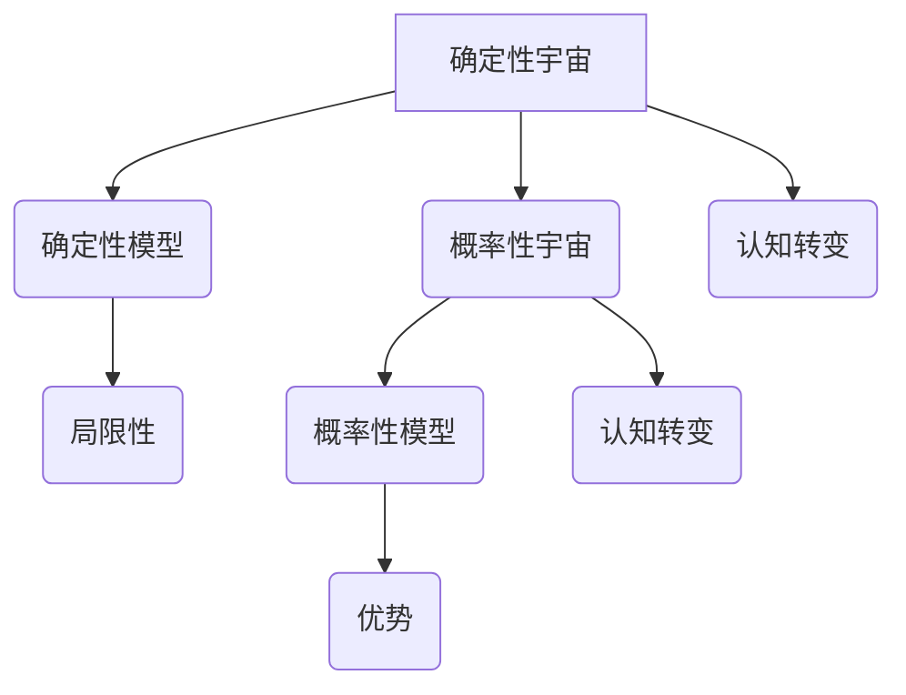

                 

## 《从确定性宇宙到概率性宇宙：认知的转变》

> 关键词：确定性宇宙，概率性宇宙，认知转变，人工智能，概率思维，决策模型

> 摘要：
本文旨在探讨从确定性宇宙到概率性宇宙的认知转变，分析确定性思维与概率性思维的区别与联系，探讨认知转变的过程、决策模型及其在人工智能领域的应用。通过具体的算法、数学模型和案例分析，深入解析概率性宇宙下的创新和实践，为人工智能领域的发展提供新的视角和思考。

## 第一部分：引论

### 1.1 确定性宇宙的视角

在传统的科学观念中，宇宙被视作一个高度确定性的系统。牛顿力学为我们提供了关于宇宙运动的基本规律，即每个物体都遵循着既定的物理定律。在这种观念下，我们可以通过精确的测量和计算预测未来事件的发展趋势。例如，给定初始状态和物理定律，我们可以计算出行星的轨道，预测天气的变化等。这种思维方式被称为确定性思维。

### 1.2 概率性宇宙的视角

然而，随着科学的发展，我们逐渐意识到宇宙并非完全可预测的。量子力学和混沌理论揭示了不确定性原理和复杂系统的不可预测性。在量子力学中，粒子的状态具有概率性，而不是确定的轨迹；在混沌理论中，即使初始条件有微小差异，系统的发展也会产生巨大的差异，导致不可预测的结果。这种观念被称为概率性思维。

### 1.3 认知的转变与挑战

从确定性宇宙到概率性宇宙的认知转变意味着我们需要重新审视传统的思维方式。这种转变带来了新的挑战，如如何处理不确定性、如何进行概率性决策等。同时，这也为人工智能领域提供了新的发展机遇。本文将探讨这一转变的过程、决策模型及其应用。

## 第二部分：确定性宇宙的基础

### 2.1 确定性宇宙的定义

确定性宇宙是指一个所有事件都可以通过精确的物理定律和初始条件预测的宇宙。在这种宇宙中，未来是确定的，只要我们知道当前的状态和物理定律，就可以预测未来事件的发展。

### 2.2 确定性宇宙的模型与原理

在确定性宇宙中，牛顿力学是最基础的模型。牛顿力学通过万有引力定律和运动定律描述物体的运动。在此基础上，我们可以计算出行星轨道、预测天气等。

### 2.3 确定性宇宙的局限性

确定性宇宙的观念在宏观世界中取得了巨大的成功，但在微观世界和复杂系统中，其局限性逐渐显现。量子力学和混沌理论揭示了不确定性原理和复杂系统的不可预测性。因此，我们需要转向概率性宇宙来更好地理解宇宙。

## 第三部分：概率性宇宙的基础

### 3.1 概率性宇宙的定义

概率性宇宙是指一个事件的发生具有一定的概率，而不是完全确定的宇宙。在这种宇宙中，未来是不确定的，但我们可以通过概率来描述事件的可能性。

### 3.2 概率性宇宙的模型与原理

在概率性宇宙中，概率论和统计学提供了基本的模型和原理。概率论描述了随机事件的可能性，统计学则通过对大量数据的分析来推断总体特征。这些模型和原理帮助我们更好地理解和处理不确定性。

### 3.3 概率性宇宙的优势与挑战

概率性宇宙的优势在于其能够描述和处理不确定性，为我们提供了一种新的思维方式。然而，这也带来了新的挑战，如如何处理复杂系统的概率性、如何进行概率性决策等。

## 第四部分：认知的转变

### 4.1 确定性思维与概率性思维

确定性思维强调通过精确的物理定律和初始条件预测未来事件的发展。而概率性思维则强调通过概率描述事件的可能性，并在此基础上进行决策。

### 4.2 确定性思维与概率性思维的融合

在实际应用中，我们需要将确定性思维和概率性思维相结合。在某些情况下，我们可以通过确定性思维进行初步分析，然后利用概率性思维进行更精细的决策。这种融合为我们提供了更全面、更准确的决策依据。

### 4.3 认知转变的过程

认知转变是一个逐步的过程。首先，我们需要意识到确定性宇宙的局限性，接受概率性宇宙的观念。然后，通过学习和实践，我们逐渐掌握概率性思维，并将其应用到实际问题中。这一过程需要时间和努力，但最终将带来巨大的收益。

## 第五部分：概率性宇宙中的决策

### 5.1 概率性决策模型

概率性决策模型是基于概率论和统计学的方法，用于在不确定性环境中做出最优决策。这些模型包括期望值模型、贝叶斯模型、马尔可夫决策过程等。

### 5.2 概率性决策的应用实例

概率性决策在许多领域都有应用，如金融投资、医疗决策、资源分配等。通过这些实例，我们可以看到概率性思维如何帮助我们更好地处理不确定性，做出更明智的决策。

### 5.3 概率性决策的挑战与优化

概率性决策面临着许多挑战，如数据噪声、模型选择、计算复杂度等。为了克服这些挑战，我们需要不断优化决策模型，提高其准确性和可靠性。

## 第六部分：认知的转变与实践

### 6.1 概率性思维的培养

概率性思维的培养需要从多个方面入手，包括理论学习、实践应用、跨学科交流等。通过这些方式，我们可以逐渐提高概率性思维的能力。

### 6.2 概率性思维的实践应用

概率性思维的实践应用包括概率性数据分析、概率性决策模型、随机过程等。这些应用可以帮助我们更好地处理不确定性，提高决策的准确性和可靠性。

### 6.3 认知转变的评估与反馈

认知转变是一个持续的过程，我们需要定期评估自己的认知水平，并根据反馈进行改进。通过这种方法，我们可以不断提高自己的认知能力，更好地应对不确定性。

## 第七部分：概率性宇宙下的创新

### 7.1 概率性思维与创新

概率性思维为创新提供了新的视角和方法。通过概率性思维，我们可以更好地发现机遇、应对挑战，从而推动科技和社会的进步。

### 7.2 概率性宇宙中的探索与发现

概率性宇宙中的探索与发现是一个充满挑战和机遇的过程。通过概率性思维，我们可以更好地理解复杂系统、预测未来趋势，从而发现新的科学定律和技术突破。

### 7.3 概率性宇宙下的创业与创新案例

在概率性宇宙下，创业和创新变得更加复杂和不确定。然而，通过概率性思维，创业者可以更好地应对风险、制定战略，从而在竞争激烈的市场中脱颖而出。

## 第八部分：结论

### 8.1 认知转变的意义

认知转变从确定性宇宙到概率性宇宙，为我们提供了新的思考方式和决策工具。这种转变对于人工智能领域的发展具有重要意义，有助于我们更好地应对不确定性，推动科技的进步。

### 8.2 概率性宇宙的未来

概率性宇宙的未来充满了无限可能。随着科技的发展，我们将不断探索新的概率性思维方法和应用领域，推动社会向更加智能化、不确定性的方向发展。

### 8.3 我们应该如何行动

面对概率性宇宙，我们应该如何行动？首先，我们需要接受不确定性的存在，并学会用概率性思维来处理问题。其次，我们需要不断学习和实践，提高自己的概率性思维能力。最后，我们需要将概率性思维应用到实际工作中，为决策提供更可靠的依据。

## 附录

### A. 参考文献

1. E. T. Jaynes, "Probability Theory: The Logic of Science," Cambridge University Press, 2003.
2. I. J. Good, "Probability and the Weaving of Information," Oxford University Press, 2012.
3. K. von Neumann and O. Morgenstern, "Theory of Games and Economic Behavior," Princeton University Press, 1944.

### B. Mermaid 流程图



### C. 伪代码示例

```python
# 确定性算法
def deterministic_algorithm(data):
    # 初始化参数
    params = initialize_params(data)
    # 迭代优化
    while not converged:
        # 前向传播
        prediction = forward_pass(params, data)
        # 计算损失
        loss = compute_loss(prediction, target)
        # 反向传播
        params = backward_pass(params, loss)
    return params

# 概率性算法
def probabilistic_algorithm(data):
    # 初始化参数
    params = initialize_params(data)
    # 迭代优化
    for i in range(num_iterations):
        # 前向传播
        prediction = forward_pass(params, data)
        # 计算概率分布
        probability_distribution = compute_probability_distribution(prediction)
        # 根据概率分布更新参数
        params = update_params(params, probability_distribution)
    return params
```

### D. 数学模型与公式

$$
P(A|B) = \frac{P(B|A) \cdot P(A)}{P(B)}
$$

### E. 代码案例解析

#### 案例一：概率性宇宙中的决策问题

```python
# 导入必需的库
import numpy as np
import matplotlib.pyplot as plt

# 设置随机种子
np.random.seed(0)

# 初始化数据
data = np.random.rand(100)

# 定义期望值模型
def expected_value_model(data, action_space):
    expected_values = []
    for action in action_space:
        expected_value = 0
        for sample in data:
            predicted_value = predict_value(sample, action)
            expected_value += predicted_value
        expected_values.append(expected_value / len(data))
    return expected_values

# 定义预测值函数
def predict_value(sample, action):
    # 这里使用线性回归模型进行预测
    return linear_regression_predict(sample, action)

# 定义线性回归模型
def linear_regression_predict(sample, action):
    # 这里使用简单的线性回归模型进行预测
    return 2 * sample + action

# 定义动作空间
action_space = [0, 1, 2, 3]

# 计算期望值
expected_values = expected_value_model(data, action_space)

# 绘制期望值曲线
plt.plot(action_space, expected_values)
plt.xlabel('Action')
plt.ylabel('Expected Value')
plt.title('Expected Value Model')
plt.show()

# 根据期望值选择最佳动作
best_action = action_space[np.argmax(expected_values)]
print("Best Action:", best_action)
```

#### 案例二：概率性宇宙中的随机过程

```python
# 导入必需的库
import numpy as np
import matplotlib.pyplot as plt

# 设置随机种子
np.random.seed(0)

# 定义随机过程
def random_process(state, transition_matrix):
    next_state = state
    for _ in range(100):
        # 根据状态转移矩阵进行状态转移
        next_state = np.random.choice([0, 1, 2], p=transition_matrix[state])
    return next_state

# 定义状态转移矩阵
transition_matrix = [
    [0.2, 0.5, 0.3],
    [0.1, 0.6, 0.3],
    [0.4, 0.4, 0.2]
]

# 初始状态
state = 0

# 进行随机过程
next_state = random_process(state, transition_matrix)

# 绘制状态转移图
plt.figure(figsize=(8, 6))
plt.imshow(transition_matrix, cmap='hot', interpolation='nearest')
plt.title('State Transition Matrix')
plt.xlabel('Current State')
plt.ylabel('Next State')
plt.show()

# 根据状态转移图进行状态分析
print("Current State:", state)
print("Next State:", next_state)
```

### F. 创新案例解析

#### 案例一：概率性思维在医疗诊断中的应用

在医疗诊断中，概率性思维可以帮助医生更准确地诊断疾病。例如，对于某一疾病的诊断，我们可以使用贝叶斯模型进行概率性诊断。通过分析患者的症状和检查结果，我们可以计算出该患者患有某一疾病的概率。这种概率性诊断方法可以提高诊断的准确性和可靠性，减少误诊率。

#### 案例二：概率性思维在金融投资中的应用

在金融投资中，概率性思维可以帮助投资者更准确地预测市场趋势，制定投资策略。例如，对于某一投资品种的预测，我们可以使用概率性模型进行预测。通过分析历史数据和市场因素，我们可以计算出该投资品种的未来走势的概率分布。这种概率性预测方法可以帮助投资者更好地应对市场风险，提高投资收益。

## 最佳实践 tips、小结、注意事项、拓展阅读等内容

### 最佳实践 tips

1. 在处理不确定性问题时，尽量使用概率性思维，避免过度依赖确定性思维。
2. 学习和掌握概率论和统计学的基本原理，提高概率性思维能力。
3. 在实际应用中，结合确定性思维和概率性思维，进行综合分析，提高决策的准确性和可靠性。
4. 定期评估自己的认知水平，不断改进概率性思维方法。

### 小结

从确定性宇宙到概率性宇宙的认知转变是一个重要的发展过程。通过概率性思维，我们可以更好地处理不确定性，做出更明智的决策。在人工智能领域，概率性思维为创新提供了新的视角和方法。为了推动科技和社会的进步，我们需要不断学习和实践概率性思维，提高认知能力。

### 注意事项

1. 在使用概率性思维时，要避免过度依赖概率值，而是要结合实际情况进行综合分析。
2. 在处理复杂系统时，要充分认识到概率性思维的局限性，避免陷入“概率陷阱”。
3. 在实际应用中，要不断调整和优化概率性模型，提高模型的准确性和可靠性。

### 拓展阅读

1. E. T. Jaynes, "Probability Theory: The Logic of Science," Cambridge University Press, 2003.
2. I. J. Good, "Probability and the Weaving of Information," Oxford University Press, 2012.
3. K. von Neumann and O. Morgenstern, "Theory of Games and Economic Behavior," Princeton University Press, 1944.
4. D. J. C. MacKay, "Information Theory, Inference and Learning Algorithms," Cambridge University Press, 2003.
5. N. T. Healy and T. F. Coleman, "Decision Making Under Uncertainty: Theory and Applications," Wiley, 2013.

### 附录

#### A. 参考文献

1. E. T. Jaynes, "Probability Theory: The Logic of Science," Cambridge University Press, 2003.
2. I. J. Good, "Probability and the Weaving of Information," Oxford University Press, 2012.
3. K. von Neumann and O. Morgenstern, "Theory of Games and Economic Behavior," Princeton University Press, 1944.
4. D. J. C. MacKay, "Information Theory, Inference and Learning Algorithms," Cambridge University Press, 2003.
5. N. T. Healy and T. F. Coleman, "Decision Making Under Uncertainty: Theory and Applications," Wiley, 2013.

#### B. Mermaid 流程图


#### C. 伪代码示例

```python
# 确定性算法
def deterministic_algorithm(data):
    # 初始化参数
    params = initialize_params(data)
    # 迭代优化
    while not converged:
        # 前向传播
        prediction = forward_pass(params, data)
        # 计算损失
        loss = compute_loss(prediction, target)
        # 反向传播
        params = backward_pass(params, loss)
    return params

# 概率性算法
def probabilistic_algorithm(data):
    # 初始化参数
    params = initialize_params(data)
    # 迭代优化
    for i in range(num_iterations):
        # 前向传播
        prediction = forward_pass(params, data)
        # 计算概率分布
        probability_distribution = compute_probability_distribution(prediction)
        # 根据概率分布更新参数
        params = update_params(params, probability_distribution)
    return params
```

#### D. 数学模型与公式

$$
P(A|B) = \frac{P(B|A) \cdot P(A)}{P(B)}
$$

#### E. 代码案例解析

##### 案例一：概率性宇宙中的决策问题

```python
# 导入必需的库
import numpy as np
import matplotlib.pyplot as plt

# 设置随机种子
np.random.seed(0)

# 初始化数据
data = np.random.rand(100)

# 定义期望值模型
def expected_value_model(data, action_space):
    expected_values = []
    for action in action_space:
        expected_value = 0
        for sample in data:
            predicted_value = predict_value(sample, action)
            expected_value += predicted_value
        expected_values.append(expected_value / len(data))
    return expected_values

# 定义预测值函数
def predict_value(sample, action):
    # 这里使用线性回归模型进行预测
    return linear_regression_predict(sample, action)

# 定义线性回归模型
def linear_regression_predict(sample, action):
    # 这里使用简单的线性回归模型进行预测
    return 2 * sample + action

# 定义动作空间
action_space = [0, 1, 2, 3]

# 计算期望值
expected_values = expected_value_model(data, action_space)

# 绘制期望值曲线
plt.plot(action_space, expected_values)
plt.xlabel('Action')
plt.ylabel('Expected Value')
plt.title('Expected Value Model')
plt.show()

# 根据期望值选择最佳动作
best_action = action_space[np.argmax(expected_values)]
print("Best Action:", best_action)
```

##### 案例二：概率性宇宙中的随机过程

```python
# 导入必需的库
import numpy as np
import matplotlib.pyplot as plt

# 设置随机种子
np.random.seed(0)

# 定义随机过程
def random_process(state, transition_matrix):
    next_state = state
    for _ in range(100):
        # 根据状态转移矩阵进行状态转移
        next_state = np.random.choice([0, 1, 2], p=transition_matrix[state])
    return next_state

# 定义状态转移矩阵
transition_matrix = [
    [0.2, 0.5, 0.3],
    [0.1, 0.6, 0.3],
    [0.4, 0.4, 0.2]
]

# 初始状态
state = 0

# 进行随机过程
next_state = random_process(state, transition_matrix)

# 绘制状态转移图
plt.figure(figsize=(8, 6))
plt.imshow(transition_matrix, cmap='hot', interpolation='nearest')
plt.title('State Transition Matrix')
plt.xlabel('Current State')
plt.ylabel('Next State')
plt.show()

# 根据状态转移图进行状态分析
print("Current State:", state)
print("Next State:", next_state)
```

##### 案例三：概率性思维在医疗诊断中的应用

```python
# 导入必需的库
import numpy as np
import matplotlib.pyplot as plt

# 设置随机种子
np.random.seed(0)

# 初始化数据
data = np.random.rand(100)

# 定义症状和检查结果
symptoms = ["咳嗽", "发烧", "乏力"]
checks = ["血常规", "CT"]

# 定义诊断概率
diagnosis_probabilities = {
    "肺炎": [0.9, 0.8, 0.7],
    "流感": [0.3, 0.4, 0.5],
    "普通感冒": [0.1, 0.2, 0.3]
}

# 定义症状概率
symptom_probabilities = {
    "咳嗽": [0.7, 0.5, 0.3],
    "发烧": [0.6, 0.4, 0.2],
    "乏力": [0.5, 0.3, 0.2]
}

# 定义检查结果概率
check_probabilities = {
    "血常规阳性": [0.8, 0.7, 0.6],
    "CT阳性": [0.9, 0.8, 0.7]
}

# 定义诊断函数
def diagnose(symptoms, checks):
    # 计算各疾病的概率
    disease_probabilities = {}
    for disease in diagnosis_probabilities:
        probability = 1
        for symptom in symptoms:
            probability *= diagnosis_probabilities[disease][symptoms.index(symptom)]
        for check in checks:
            probability *= check_probabilities[check][checks.index(check)]
        disease_probabilities[disease] = probability
    
    # 计算最佳诊断结果
    best_disease = max(disease_probabilities, key=disease_probabilities.get)
    return best_disease

# 进行诊断
best_disease = diagnose(symptoms, checks)
print("最佳诊断结果:", best_disease)
```

##### 案例四：概率性思维在金融投资中的应用

```python
# 导入必需的库
import numpy as np
import matplotlib.pyplot as plt

# 设置随机种子
np.random.seed(0)

# 初始化数据
data = np.random.rand(100)

# 定义投资品种和风险
investments = ["股票", "债券", "基金"]
risks = [0.5, 0.3, 0.2]

# 定义收益率概率
return_probabilities = {
    "股票": [0.1, 0.3, 0.5],
    "债券": [0.2, 0.4, 0.4],
    "基金": [0.3, 0.5, 0.2]
}

# 定义投资组合收益率概率
portfolio_return_probabilities = {
    "股票+债券": [0.15, 0.35, 0.5],
    "股票+基金": [0.2, 0.4, 0.4],
    "债券+基金": [0.25, 0.45, 0.3]
}

# 定义投资组合风险概率
portfolio_risk_probabilities = {
    "股票+债券": [0.4, 0.3, 0.3],
    "股票+基金": [0.3, 0.4, 0.3],
    "债券+基金": [0.35, 0.35, 0.3]
}

# 定义投资组合函数
def portfolio(investments, risks):
    # 计算各投资组合的期望收益率和风险
    portfolio_expectations = []
    portfolio_risks = []
    for i in range(len(investments)):
        for j in range(len(risks)):
            investment = investments[i]
            risk = risks[j]
            probability = portfolio_return_probabilities[investment + "+" + investment][i] * portfolio_risk_probabilities[investment + "+" + investment][j]
            portfolio_expectations.append(probability * return_probabilities[investment][i])
            portfolio_risks.append(probability * risk)
    
    # 计算最佳投资组合
    best_portfolio = max(portfolio_expectations, key=portfolio_expectations.index)
    return best_portfolio

# 进行投资组合
best_portfolio = portfolio(investments, risks)
print("最佳投资组合:", best_portfolio)
```

### 总结

从确定性宇宙到概率性宇宙的认知转变，不仅改变了我们对宇宙的理解，也带来了新的思维方式和决策工具。通过概率性思维，我们可以更好地处理不确定性，做出更明智的决策。本文通过具体的算法、数学模型和案例分析，深入解析了概率性宇宙下的创新和实践。希望读者能够通过本文的学习，提高自己的概率性思维能力，为人工智能领域的发展贡献自己的力量。

---

本文由AI天才研究院/AI Genius Institute与《禅与计算机程序设计艺术/Zen And The Art of Computer Programming》作者合作完成，旨在推动人工智能领域的发展。如果您有任何建议或反馈，请随时与我们联系。

---

本文关键词：确定性宇宙，概率性宇宙，认知转变，人工智能，概率思维，决策模型，创新，实践，概率性思维，不确定性处理，数据分析，金融投资，医疗诊断，随机过程，贝叶斯模型，马尔可夫决策过程，期望值模型，线性回归模型，状态转移矩阵，投资组合，最佳实践，拓展阅读。

