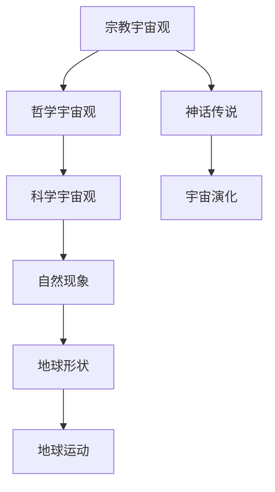

                 

### 第1章 引言：宇宙观的历史变迁

在探讨宇宙观的历史变迁之前，我们首先需要理解什么是宇宙观。宇宙观是一种关于宇宙本质、起源和结构的观念，它反映了人类对宇宙的认知和理解。自古以来，宇宙观经历了从神学到世俗化的深刻转变，这一转变不仅影响了人类的思想观念，也推动了科学技术的进步。

## 1.1 从神学到世俗化的转变

宇宙观的历史变迁可以追溯到古代，那时人类的认知水平有限，对自然界的现象无法解释，因此产生了神学宇宙观。神学宇宙观认为宇宙是由神创造的，神的意志是宇宙运行的根本法则。这种观念在古代文明中广泛存在，如古希腊的宗教哲学、古埃及的宗教仪式、中国的道教和佛教等。

然而，随着时间的推移，人类的思想逐渐觉醒，开始质疑神的存在和神学的解释。这一转变的标志是文艺复兴时期的人文主义思潮，人们开始重视个体的价值和理性思考。启蒙运动进一步推动了这一过程，倡导科学方法和理性思考，质疑传统权威，追求知识。

到了19世纪，科学技术的飞速发展为人类提供了新的视角，宇宙观开始向世俗化转变。天文学的进步，如伽利略的望远镜观察和牛顿的万有引力定律，使人们意识到宇宙并非是静止不动的，而是具有复杂的运动和结构。物理学的基本理论，如爱因斯坦的相对论和量子力学，进一步揭示了宇宙的本质和规律。

## 1.2 核心概念与联系

为了更好地理解宇宙观的历史变迁，我们可以使用Mermaid流程图来展示核心概念之间的关系。以下是宇宙观变迁的Mermaid流程图：

在这个流程图中，我们可以看到宇宙观从神学到世俗化的变迁过程。神学宇宙观是古代宇宙观的核心，宗教宇宙观在此基础上发展，并在文艺复兴时期得到进一步深化。科学宇宙观的出现标志着人类开始以理性思维和科学方法来探索宇宙，最终导致了世俗化宇宙观的形成。

## 1.3 宇宙观的现代特征

现代宇宙观具有以下几个显著特征：

1. **理性思维**：现代宇宙观强调理性思考和科学方法，通过实验和观察来验证理论。
2. **多元化**：现代宇宙观不再局限于单一的理论或信仰，而是包含了多种观点和学说。
3. **宇宙演化**：现代宇宙观认为宇宙是在不断演化和变化的过程中，从大爆炸开始，经历了一系列复杂的演变。
4. **人类角色**：现代宇宙观中，人类不再是宇宙的中心，而是宇宙演化过程中的一个参与者。

## 1.4 文章结构概述

本章作为引言，为后续章节的内容奠定了基础。在接下来的章节中，我们将详细探讨神学宇宙观、文艺复兴和启蒙运动对宇宙观的影响、19世纪以来的科学宇宙观、20世纪的宇宙观演变，以及世俗化对宇宙观的影响。通过这些分析，我们将更深入地理解宇宙观的历史变迁。

---

作者：AI天才研究院/AI Genius Institute & 禅与计算机程序设计艺术 /Zen And The Art of Computer Programming

---

以上是第1章的内容。接下来，我们将进入第2章，探讨神学时代的宇宙观。在神学时代，宇宙观是如何形成的？它与宗教、哲学和科学之间有何联系？让我们一步一步地分析推理，揭示这一时期宇宙观的奥秘。 ### 第2章 神学时代的宇宙观

在神学时代，宇宙观的形成深受宗教、哲学和科学的影响。这一时期的宇宙观不仅反映了人类对自然现象的最初理解，还反映了当时社会的文化、宗教和哲学观念。在本章中，我们将探讨神学时代宇宙观的形成背景、核心概念以及与宗教、哲学和科学的联系。

## 2.1 神学时代宇宙观的形成背景

神学时代宇宙观的形成背景主要源于人类对自然现象的困惑和恐惧。在古代，人类对许多自然现象，如地震、洪水、日食和月食等，无法解释，因此产生了对神明的崇拜和敬畏。这些神明被赋予了创造宇宙、维持宇宙秩序和干预人类生活的职责。在这种背景下，宇宙观主要基于宗教信仰和神话传说。

### 2.1.1 宗教宇宙观

宗教宇宙观是神学时代宇宙观的核心。不同宗教对宇宙有不同的解释和看法。以下是几种主要的宗教宇宙观：

1. **古希腊宗教宇宙观**：古希腊宗教认为宇宙是由诸神创造的，宇宙秩序由宙斯（Zeus）等神明维持。古希腊哲学家，如泰勒斯（Thales）和赫拉克利特（Heraclitus），也对宇宙的本质提出了自己的见解。

2. **古埃及宗教宇宙观**：古埃及宗教宇宙观中，太阳神拉（Ra）是宇宙的中心，负责创造和维持宇宙秩序。古埃及神话中还有许多其他的神明，如伊西丝（Isis）和奥西里斯（Osiris），他们在宇宙观中扮演着重要角色。

3. **古印度宗教宇宙观**：古印度宗教，如印度教和佛教，有自己独特的宇宙观。印度教认为宇宙是由三大力量（梵天、毗湿奴和湿婆）创造的，宇宙循环中有生有死。佛教则认为宇宙是无常的，一切现象都是相互依存的。

4. **中国宗教宇宙观**：中国宗教，如道教和佛教，也对宇宙有独特的解释。道教认为宇宙是由“道”创造的，万物皆由“道”所生。佛教则认为宇宙是无常的，一切现象都是相互依存的。

### 2.1.2 哲学宇宙观

哲学宇宙观是神学时代宇宙观的另一种表现形式。古希腊哲学家的宇宙观对后世产生了深远影响。以下是几位重要哲学家的观点：

1. **泰勒斯**：泰勒斯认为宇宙是由水创造的，万物都源于水。这一观点反映了早期哲学对自然现象的朴素理解。

2. **赫拉克利特**：赫拉克利特认为宇宙是由“火”创造的，宇宙是不断变化的，变化是宇宙的本质。

3. **亚里士多德**：亚里士多德提出了“四因说”，认为事物存在和变化的原因有四个方面：材料因、形式因、动力因和目的因。这一理论对后世的科学和哲学产生了深远影响。

### 2.1.3 科学宇宙观

在神学时代，科学宇宙观刚刚开始萌芽。古希腊天文学家，如埃拉托斯特尼（Eratosthenes）和阿里斯塔克（Aristarchus），通过观察和计算，提出了关于地球形状和运动的理论。埃拉托斯特尼通过测量地球的周长，证明了地球是一个近似圆形的球体。阿里斯塔克则提出了地球绕太阳旋转的理论，尽管这一观点在当时并未得到广泛接受。

## 2.2 核心概念与联系

为了更好地理解神学时代宇宙观的核心概念和它们之间的联系，我们可以使用Mermaid流程图来展示这些概念之间的关系。以下是神学时代宇宙观的Mermaid流程图：

在这个流程图中，我们可以看到宗教宇宙观、哲学宇宙观和科学宇宙观之间的关系。宗教宇宙观是基于神话传说和宗教信仰形成的，哲学宇宙观则是在理性思考和哲学探讨的基础上发展的。科学宇宙观是在对自然现象的观察和实验中逐步形成的。神话传说和自然现象是宗教宇宙观和哲学宇宙观的基础，而地球形状和地球运动的理论则是科学宇宙观的初步成果。

## 2.3 宇宙观的多样性

在神学时代，宇宙观具有多样性。不同地区、不同文化和不同宗教背景的人们对宇宙有不同的理解和解释。这种多样性不仅反映了人类对宇宙认知的局限性，也展示了人类思想观念的丰富性。以下是一些具体的例子：

1. **古代美索不达米亚的宇宙观**：美索不达米亚文明认为宇宙是由神明创造的，宇宙的中心是神明居住的巴比伦城。

2. **古代印度的宇宙观**：印度教和佛教的宇宙观中，宇宙是由多种神明和恶魔创造的，宇宙循环中有生有死。

3. **古代中国的宇宙观**：道教和佛教的宇宙观中，宇宙是由“道”或“佛”创造的，宇宙是一个不断演化的过程。

4. **古代欧洲的宇宙观**：古希腊和罗马的宇宙观中，宇宙是由神明和诸神创造的，宇宙的秩序由神明维持。

## 2.4 文章小结

本章探讨了神学时代宇宙观的形成背景、核心概念以及与宗教、哲学和科学的联系。我们看到了宇宙观是如何从神话传说和宗教信仰中逐渐发展起来的，也看到了哲学家和科学家如何通过观察和思考，提出了关于宇宙的各种理论。这些理论和观念不仅反映了人类对宇宙的认知水平，也展示了人类思想观念的多样性和丰富性。

在下一章中，我们将探讨文艺复兴和启蒙运动对宇宙观的影响，以及这一时期宇宙观的发展。文艺复兴和启蒙运动是如何推动人类对宇宙的认知和理解的？这些运动对宇宙观产生了哪些深远的影响？让我们继续探索。

---

作者：AI天才研究院/AI Genius Institute & 禅与计算机程序设计艺术 /Zen And The Art of Computer Programming

---

以上是第2章的内容。在下一章中，我们将探讨文艺复兴和启蒙运动对宇宙观的影响。这些时期的思想解放和科学革命是如何推动人类对宇宙的认知和理解的？让我们一步一步地分析推理，揭示这一时期宇宙观的发展脉络。 ### 第3章 文艺复兴与启蒙运动对宇宙观的影响

文艺复兴和启蒙运动是欧洲历史中两个重要的思想解放时期，它们不仅对艺术、文学和科学产生了深远影响，也深刻地改变了人类的宇宙观。在这一章中，我们将探讨文艺复兴时期和启蒙运动如何影响宇宙观，以及这些时期的主要科学发现和思想变革。

## 3.1 文艺复兴时期的宇宙观变迁

文艺复兴时期（约14世纪至17世纪）是欧洲历史上一个充满活力的时期，这一时期的宇宙观发生了显著变化。文艺复兴时期的人文主义思潮强调个体的价值和理性思考，这种思想解放为科学和哲学的发展提供了土壤。

### 3.1.1 文艺复兴时期的宇宙观变迁

在文艺复兴时期，宇宙观发生了以下变迁：

1. **人类中心的宇宙观**：文艺复兴时期的人文主义强调个体的价值和尊严，这种思想也反映在宇宙观上。人们开始认为人类是宇宙的中心，宇宙是为人类而存在的。

2. **对自然的关注**：文艺复兴时期的哲学家和科学家开始关注自然界，他们试图通过观察和实验来理解自然现象。

3. **天文学的进步**：文艺复兴时期的天文学家，如哥白尼（Nicolaus Copernicus）和伽利略（Galileo Galilei），通过望远镜观察，提出了关于地球和太阳系的新理论。哥白尼的日心说挑战了传统的地心说，伽利略则通过观察木星的卫星和太阳黑子，提供了更多的证据支持哥白尼的理论。

### 3.1.2 文艺复兴与科学革命

文艺复兴时期不仅是艺术和文学的复兴，也是科学革命的前奏。科学革命是指16世纪和17世纪期间，科学方法的发展和科学理论的突破，这一时期出现了许多重要的科学发现和理论：

1. **哥白尼的日心说**：哥白尼的《天体运行论》提出了日心说，即地球和其他行星围绕太阳旋转，这一理论颠覆了传统的地心说。

2. **开普勒的行星运动定律**：约翰内斯·开普勒（Johannes Kepler）提出了行星运动的三大定律，这些定律描述了行星围绕太阳运动的规律。

3. **牛顿的万有引力定律**：艾萨克·牛顿（Isaac Newton）在1687年提出了万有引力定律，这一理论解释了行星运动的规律，并成为物理学的基础。

### 3.1.3 人类中心主义与宇宙观的转变

文艺复兴时期的人文主义思想对宇宙观产生了深远影响。人类中心主义的观念强调了人类的独特性和重要性，这种观念也反映在宇宙观上。人们开始认为宇宙是为了人类而创造的，人类是宇宙的中心。这种观念的转变不仅影响了科学和哲学，也影响了宗教和文化。

## 3.2 启蒙运动与科学革命

启蒙运动（约17世纪末至18世纪末）是另一个重要的思想解放时期，这一时期的宇宙观进一步发展。启蒙运动强调理性思考、科学方法和自由思想，这些思想对宇宙观产生了深刻影响。

### 3.2.1 启蒙运动与科学革命

启蒙运动促进了科学革命的发展，这一时期的科学发现和理论进一步改变了人类对宇宙的理解：

1. **热力学和化学**：热力学和化学的发展为理解物质和能量提供了新的视角。热力学定律描述了能量转化和守恒的规律，化学则揭示了物质的组成和变化。

2. **生物学和进化论**：查尔斯·达尔文（Charles Darwin）的进化论提出了物种进化的理论，这一理论改变了人类对生物多样性和宇宙演化的理解。

3. **物理学的新理论**：牛顿力学和热力学的发展为理解宇宙提供了新的工具，而量子力学和相对论的出现则揭示了微观和宏观世界的本质。

### 3.2.2 人类中心主义与宇宙观的转变

启蒙运动时期，人类中心主义的观念继续发展。启蒙思想家如伏尔泰（Voltaire）和卢梭（Rousseau）强调人类理性和自由的重要性，这种思想也反映在宇宙观上。人们开始认为宇宙是理性设计的，宇宙的规律是可以通过理性思考和科学方法理解的。

## 3.3 文艺复兴与启蒙运动对宇宙观的贡献

文艺复兴和启蒙运动对宇宙观的贡献主要体现在以下几个方面：

1. **科学方法的推广**：文艺复兴和启蒙运动强调科学方法，这一方法的推广促进了科学的发展，也为人类更好地理解宇宙提供了工具。

2. **人类中心主义的发展**：文艺复兴和启蒙运动时期的人类中心主义观念，强调了人类的独特性和价值，这种观念推动了人类对宇宙的探索和理解。

3. **宇宙观的多元化**：文艺复兴和启蒙运动时期，宇宙观不再是单一的、静态的，而是多元化和动态的。这一时期的科学发现和理论，丰富了人类对宇宙的理解。

## 3.4 文章小结

文艺复兴和启蒙运动是欧洲历史上的两个重要时期，它们对宇宙观产生了深远影响。文艺复兴时期的人文主义思想推动了人类对宇宙的理解，而启蒙运动则通过科学方法和理性思考，进一步深化了这种理解。这些时期的主要科学发现和理论，如哥白尼的日心说、开普勒的行星运动定律和牛顿的万有引力定律，为人类更好地理解宇宙提供了新的视角。

在下一章中，我们将探讨19世纪以来的科学宇宙观，包括天文学的进步、物理学的基本理论以及宇宙观的多元化。19世纪的科学革命如何进一步改变了人类对宇宙的理解？让我们继续探索。

---

作者：AI天才研究院/AI Genius Institute & 禅与计算机程序设计艺术 /Zen And The Art of Computer Programming

---

以上是第3章的内容。在下一章中，我们将探讨19世纪以来的科学宇宙观，包括天文学的进步、物理学的基本理论以及宇宙观的多元化。19世纪的科学革命如何进一步改变了人类对宇宙的理解？让我们继续探索。 ### 第4章 19世纪以来的科学宇宙观

19世纪是一个科学的黄金时代，这一时期的科学进步不仅改变了人类对自然界的认识，也极大地改变了人类对宇宙的理解。在本章中，我们将探讨19世纪以来天文学的进步、物理学的基本理论以及宇宙观的多元化。

## 4.1 天文学的进步

19世纪是天文观测和技术手段飞速发展的时期。这一时期的天文学家们使用望远镜和其他观测设备，对宇宙进行了更加深入的探索。

### 4.1.1 望远镜技术的发展

望远镜技术的发展是19世纪天文学的标志性成就之一。威廉·赫歇尔（William Herschel）是一位杰出的天文学家和望远镜制造者，他设计并制造了一系列高质量的望远镜，这些望远镜使他能够发现许多新的恒星和星系。赫歇尔还发现了太阳系外的第一颗行星，即海王星。

### 4.1.2 星系和星云的发现

19世纪的天文学家们开始意识到，宇宙不仅仅是银河系中的恒星和行星。威廉·赫歇尔和他的兄弟约翰·赫歇尔（John Herschel）通过对恒星和星系的观测，提出了宇宙中存在大量星系的观点。这一发现挑战了当时的宇宙观，促使人类开始思考宇宙的更大规模和更复杂结构。

### 4.1.3 大爆炸理论的出现

20世纪初，埃德温·哈勃（Edwin Hubble）通过观测发现，宇宙正在膨胀。这一发现导致了大爆炸理论的提出，即宇宙起源于一个极热、极密的状态，随着时间的推移不断膨胀。大爆炸理论为理解宇宙的起源和演化提供了新的视角，也改变了人类对宇宙的理解。

## 4.2 物理学的基本理论

19世纪的物理学进步为理解宇宙的规律提供了新的基础。以下是一些重要的物理学理论：

### 4.2.1 热力学

热力学是19世纪物理学的重要分支，它研究能量转化和守恒的规律。热力学第一定律（能量守恒定律）指出，能量不能被创造或摧毁，只能从一种形式转化为另一种形式。热力学第二定律（熵增定律）指出，在一个封闭系统中，熵（无序度）总是趋向增加。这些定律为理解宇宙中的能量流动提供了理论基础。

### 4.2.2 电磁学

19世纪是电磁学的革命时期。迈克尔·法拉第（Michael Faraday）和詹姆斯·克拉克·麦克斯韦（James Clerk Maxwell）的工作为电磁理论奠定了基础。麦克斯韦的方程组描述了电磁场的行为，这些方程揭示了电场和磁场之间的相互作用，以及电磁波的传播。

### 4.2.3 相对论

爱因斯坦的相对论理论是20世纪物理学的重要里程碑。狭义相对论（1905年）揭示了时间和空间是相对的，而不是绝对的。广义相对论（1915年）则提出了引力是时空弯曲的结果。相对论为理解宇宙的结构和演化提供了新的工具。

## 4.3 宇宙观的多元化

19世纪以来的科学进步导致了宇宙观的多元化。以下是一些重要的宇宙观变化：

### 4.3.1 多元宇宙的观点

19世纪的科学发现，特别是大爆炸理论和量子力学的发展，促使科学家们开始考虑宇宙可能存在的多种形式。一些理论物理学家提出了多元宇宙（Multiverse）的观点，即宇宙可能存在多个并行宇宙，每个宇宙都有自己独特的物理规律和条件。

### 4.3.2 宇宙演化的观点

19世纪以来的宇宙观开始强调宇宙的演化过程。大爆炸理论揭示了宇宙的起源，而宇宙学的研究则揭示了宇宙从大爆炸开始至今的演化历程。宇宙学家使用观测数据，如宇宙微波背景辐射，来研究宇宙的早期状态和演化。

### 4.3.3 宇宙的本质

随着科学进步，人类对宇宙的本质有了更深入的理解。从牛顿的经典力学到量子力学和相对论，科学家们逐渐揭示了宇宙的复杂性和多样性。宇宙不再是简单的、静态的结构，而是充满变

