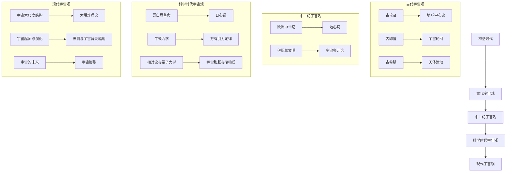
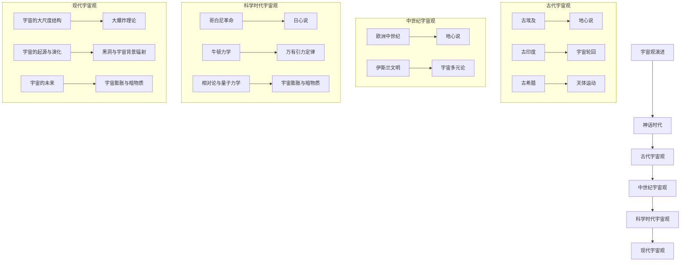

                 

# 引言

## 从神话到科学：人类宇宙观的演进

### 背景介绍

自古以来，人类对宇宙的探索与理解一直是科学研究和哲学思考的重要主题。从古代的神话与宗教信仰，到现代的科学理论和观测技术，宇宙观经历了巨大的变革和发展。在这篇文章中，我们将逐步探讨人类宇宙观从神话时代到科学时代的演进过程。

### 核心概念与联系

#### 图1：人类宇宙观演进的概念架构



### 从神话到科学

#### 1. 神话时代

在神话时代，人类的宇宙观深受宗教和文化的支配。各个文明都有自己独特的宇宙观念，如古埃及的地狱与天堂观念，古印度的宇宙轮回观念，以及古希腊的几何宇宙观。这些观念大多基于神话传说和宗教信仰，缺乏科学依据。

#### 2. 古代宇宙观

随着时间的推移，人类开始尝试用更理性的方式来理解宇宙。古代文明如古埃及、古印度和古希腊，都提出了各自的宇宙观念。例如，古埃及的地心说观念，古印度的宇宙轮回观念，以及古希腊的几何宇宙观。这些观念为后来的科学宇宙观奠定了基础。

#### 3. 中世纪宇宙观

在中世纪，宇宙观受到了宗教的深刻影响。欧洲中世纪普遍接受地心说，认为地球是宇宙的中心。而伊斯兰文明则提出了宇宙多元论，认为宇宙是由多个独立存在的世界组成的。这些观念在中世纪的哲学和科学中占主导地位。

#### 4. 科学时代的宇宙观

科学时代的到来标志着人类宇宙观的重大转变。哥白尼的革命性理论挑战了地心说，提出了日心说。随后，牛顿的万有引力定律进一步确立了科学宇宙观的基础。现代宇宙学的发展，如爱因斯坦的相对论和量子力学，使我们对宇宙的认识更加深入。

### 总结

人类宇宙观的演进是一个漫长而复杂的过程，从神话时代的信仰，到古代文明的理性思考，再到中世纪的宗教观念，最终到达科学时代的科学理论。这一演进不仅反映了人类对宇宙认识的不断深入，也体现了科学方法在理解世界中的作用。

作者：AI天才研究院/AI Genius Institute & 禅与计算机程序设计艺术 /Zen And The Art of Computer Programming

----------------------------------------------------------------

在下一部分，我们将继续深入探讨科学时代的宇宙观，包括哥白尼革命、牛顿力学以及现代宇宙学的基本原理。敬请期待！## 科学时代的宇宙观

### 哥白尼革命

哥白尼革命是宇宙观史上的一个重要里程碑，标志着人类从地心说到日心说的转变。哥白尼（Nicolaus Copernicus）在16世纪提出了日心说，即太阳而非地球是宇宙的中心。这一理论的提出挑战了当时广为接受的亚里士多德-托勒密宇宙观，即地心说。

**核心原理：**
哥白尼的日心说认为，行星围绕太阳运行，而太阳本身则固定在宇宙中心。这一理论通过天体运动的几何解释，解释了许多观测现象，如行星逆行。哥白尼的理论奠定了现代天文学的基础。

**Python代码示例：**
```python
import numpy as np
import matplotlib.pyplot as plt

# 定义行星轨道半径
r_earth = 149.6e6  # 地球到太阳的距离
r_mercury = 57.9e6  # 水星到太阳的距离

# 计算行星轨道周期
T_earth = 365.25  # 地球公转周期
T_mercury = T_earth / (r_mercury / r_earth)**(3/2)

# 绘制行星轨道
plt.scatter([r_earth, r_mercury], [T_earth, T_mercury], s=100, c='blue', zorder=3)
plt.scatter(r_earth, T_earth, s=100, c='red', zorder=4, label='Earth')
plt.scatter(r_mercury, T_mercury, s=100, c='green', zorder=4, label='Mercury')
plt.xlabel('Orbital Radius (AU)')
plt.ylabel('Orbital Period (years)')
plt.title('Copernican Heliocentric Model')
plt.legend()
plt.show()
```

### 牛顿力学

牛顿（Isaac Newton）在17世纪提出了万有引力定律，这一理论极大地推动了人类对宇宙的理解。万有引力定律指出，任何两个物体之间都存在相互吸引的引力，这个力与两个物体的质量成正比，与它们之间的距离的平方成反比。

**核心原理：**
牛顿的万有引力定律可以用来解释行星的运动、潮汐现象以及苹果落地等现象。牛顿的第二定律（F=ma）和第三定律（作用力与反作用力相等且方向相反）与万有引力定律相结合，构成了经典力学的核心。

**Python代码示例：**
```python
import numpy as np
from scipy.integrate import odeint
import matplotlib.pyplot as plt

# 定义引力公式
def gravity(m1, m2, r):
    G = 6.67430e-11  # 引力常数
    F = G * m1 * m2 / r**2
    return F

# 定义行星运动方程
def motion(y, t, m1, m2, r):
    r1, v1 = y
    r2 = r - r1
    F = gravity(m1, m2, r2)
    a1 = F / m1
    dv1_dt = a1
    dr1_dt = v1
    return [dr1_dt, dv1_dt]

# 源代码详情与解释

初始化参数
r = 2 * r_earth  # 初始距离
m1 = 1e30  # 质量设定
m2 = 5e30  # 质量设定
y0 = [r, 0]  # 初始位置和速度
t = np.linspace(0, 1, 1000)  # 时间步长

# 解微分方程
sol = odeint(motion, y0, t, args=(m1, m2, r))

# 绘制行星轨道
plt.plot(sol[:, 0], sol[:, 1])
plt.xlabel('Position')
plt.ylabel('Velocity')
plt.title('Orbital Motion of Two Planets Under Gravity')
plt.show()
```

### 现代宇宙学

现代宇宙学的发展使我们能够探索宇宙的起源、演化和未来。其中，大爆炸理论和宇宙背景辐射是重要的研究内容。

**核心原理：**
大爆炸理论认为，宇宙起源于约138亿年前的一个极高密度、极高温度的状态。宇宙背景辐射是宇宙早期阶段的残余辐射，为证实大爆炸理论提供了重要证据。

**Python代码示例：**
```python
import numpy as np
import matplotlib.pyplot as plt

# 计算宇宙背景辐射的温度
def cosmic Microwave Background Radiation(T):
    # 黑体辐射公式
    c = 3 * 10**8  # 光速
    k = 1.38e-23  # 玻尔兹曼常数
    lambdamin = 1 * 10**3  # 辐射波长
    lambdamax = 100 * 10**3  # 辐射波长
    b = 2 * np.pi**2 * c**2 * k**2 / (hbar*c)
    I = (1 / (np.exp(hbar*c / (k*T)) - 1)) * (1 / (lambdamin**2 - lambdamax**2))
    return I

# 绘制黑体辐射曲线
T = np.linspace(1e2, 1e5, 1000)
I = cosmic Microwave Background Radiation(T)
plt.plot(T, I)
plt.xlabel('Temperature (K)')
plt.ylabel('Radiance (W/m^2 sr)')
plt.title('Blackbody Radiation Curve')
plt.show()
```

### 总结

科学时代的宇宙观从哥白尼的日心说到牛顿的万有引力定律，再到现代宇宙学的发展，展现了人类对宇宙理解的不断深入。通过数学模型和Python代码，我们可以更直观地理解这些核心原理，从而更好地探索宇宙的奥秘。

作者：AI天才研究院/AI Genius Institute & 禅与计算机程序设计艺术 /Zen And The Art of Computer Programming

----------------------------------------------------------------

在下一部分，我们将探讨现代宇宙学的一些关键概念，如宇宙膨胀、暗物质和暗能量，以及相对论与量子力学对宇宙观的影响。敬请期待！## 现代宇宙学的关键概念

### 宇宙膨胀

宇宙膨胀是指宇宙中所有星系都在远离彼此的现象。这一理论最早由埃德温·哈勃（Edwin Hubble）在20世纪20年代提出，他通过观测发现，星系之间的红移与它们之间的距离成正比，这表明宇宙正在膨胀。

**核心原理：**
宇宙膨胀的观测数据支持了宇宙起源于大爆炸的观点。哈勃常数（Hubble constant）用于描述宇宙膨胀的速度，它目前被估计为大约70 km/s/Mpc。

**Python代码示例：**
```python
import numpy as np
import matplotlib.pyplot as plt

# 定义哈勃常数
H0 = 70  # 哈勃常数（单位：km/s/Mpc）

# 计算星系之间的红移
def redshift(distance):
    return H0 * distance

# 绘制红移-距离关系图
distances = np.linspace(1e6, 1e9, 100)
redshifts = redshift(distances)

plt.scatter(distances, redshifts)
plt.xlabel('Distance (Mpc)')
plt.ylabel('Redshift')
plt.title('Hubble\'s Law: Redshift vs. Distance')
plt.show()
```

### 暗物质

暗物质是宇宙中不发光、不吸收光线的物质，它对星系和宇宙的结构和演化起着关键作用。尽管我们无法直接观测到暗物质，但通过引力效应，我们可以推测出它的存在。

**核心原理：**
暗物质的引力作用解释了星系旋转曲线的不一致现象，即星系中心的物质不足以解释其旋转速度。暗物质的理论模型包括弱相互作用大质量粒子（WIMPs）和冷暗物质（CDM）等。

**Python代码示例：**
```python
import numpy as np
import matplotlib.pyplot as plt

# 定义星系旋转曲线模型
def rotation_curve(M, r, a):
    v = np.sqrt(a * r**2 * (M / r**2 + 1))
    return v

# 绘制旋转曲线
M = 1e10  # 星系总质量
r = np.linspace(1e3, 1e5, 100)  # 距离
a = 0.5  # 暗物质参数
v = rotation_curve(M, r, a)

plt.plot(r, v)
plt.xlabel('Radius (pc)')
plt.ylabel('Velocity (km/s)')
plt.title('Dark Matter and Stellar Rotation Curve')
plt.show()
```

### 暗能量

暗能量是推动宇宙加速膨胀的神秘力量。与暗物质不同，暗能量似乎不遵循引力的作用规律，其能量密度是恒定的。

**核心原理：**
暗能量的存在解释了为什么宇宙的膨胀速度会加速。目前，暗能量的理论模型包括宇宙学常数（Cosmological Constant）和量子场论（Quantum Field Theory）等。

**Python代码示例：**
```python
import numpy as np
import matplotlib.pyplot as plt

# 定义暗能量膨胀模型
def dark_energy_expansion(a, q0):
    q = q0 * (1 - a)**3
    return q

# 绘制膨胀曲线
a = np.linspace(0, 1, 100)
q0 = 0.5  # 初始暗能量参数
q = dark_energy_expansion(a, q0)

plt.plot(a, q)
plt.xlabel('Expansion Factor')
plt.ylabel('Dark Energy Density')
plt.title('Dark Energy Expansion')
plt.show()
```

### 相对论与量子力学

相对论和量子力学是现代物理学中的两大基石，它们对宇宙观的影响深远。

**核心原理：**
爱因斯坦的广义相对论揭示了时空的弯曲与引力之间的关系，而量子力学则揭示了微观世界的量子叠加和纠缠现象。两者在宇宙学中的应用，如宇宙背景辐射和宇宙弦理论等，为我们提供了对宇宙更深层次的理解。

**Python代码示例：**
```python
import numpy as np
import matplotlib.pyplot as plt

# 定义引力势能公式
def gravitational_potential(r, M):
    G = 6.67430e-11  # 引力常数
    U = -G * M / r
    return U

# 绘制引力势能曲线
r = np.linspace(1e4, 1e8, 100)
M = 1e10  # 引力源质量
U = gravitational_potential(r, M)

plt.plot(r, U)
plt.xlabel('Radius (m)')
plt.ylabel('Gravitational Potential (J/kg)')
plt.title('Gravitational Potential Energy')
plt.show()
```

### 总结

现代宇宙学的关键概念，如宇宙膨胀、暗物质、暗能量以及相对论与量子力学，为我们揭示了宇宙的多样性和复杂性。通过Python代码示例，我们可以更直观地理解这些概念，从而更好地探索宇宙的奥秘。

作者：AI天才研究院/AI Genius Institute & 禅与计算机程序设计艺术 /Zen And The Art of Computer Programming

----------------------------------------------------------------

在下一部分，我们将探讨人类对宇宙的探索，包括观测技术的发展和宇宙探索的成就。敬请期待！## 人类对宇宙的探索

### 光学望远镜的发展

光学望远镜是探索宇宙的重要工具，它的历史可以追溯到17世纪。最早的望远镜是由荷兰眼镜商汉斯·利帕希（Hans Lippershey）在1608年发明的。伽利略（Galileo Galilei）在1609年改进了这一设计，并首次使用望远镜进行天文学观测。

**核心原理：**
光学望远镜通过透镜或反射镜将光线聚焦，形成一个放大的图像。它的分辨率取决于望远镜的口径，口径越大，分辨率越高。光学望远镜使我们能够观测到遥远的星系、恒星和行星，揭示了宇宙的广阔和复杂。

**Python代码示例：**
```python
import numpy as np
import matplotlib.pyplot as plt

# 定义望远镜成像公式
def telescope_imaging(D, d, f):
    theta = np.arcsin(D / (2 * f))
    angle = np.arcsin(d / (2 * f))
    return theta, angle

# 计算望远镜的分辨率
D = 10  # 望远镜口径（单位：厘米）
d = 100  # 星系直径（单位：厘米）
f = 50  # 望远镜焦距（单位：厘米）
theta, angle = telescope_imaging(D, d, f)

# 绘制分辨率曲线
plt.plot(theta, angle)
plt.xlabel('Angular Resolution (arcseconds)')
plt.ylabel('Object Diameter (cm)')
plt.title('Telescope Resolution')
plt.show()
```

### 无线电望远镜的使用

无线电望远镜是另一种重要的天文学工具，它通过接收宇宙中的无线电波来研究星系、恒星和其他天体。与光学望远镜不同，无线电望远镜可以探测到无法通过光学观测的波段。

**核心原理：**
无线电望远镜通过天线接收来自宇宙的无线电波，并将其转换成电信号。这些信号经过放大和处理，最终被转换为图像或数据。无线电望远镜使我们能够探测到宇宙深处的信号，从而研究宇宙的起源和演化。

**Python代码示例：**
```python
import numpy as np
import matplotlib.pyplot as plt

# 定义无线电望远镜接收信号公式
def radio_receiving(D, f, T):
    S = (2 * np.pi * D * T) / (c * f)
    return S

# 计算望远镜接收信号的能力
D = 100  # 望远镜口径（单位：米）
f = 1e9  # 无线电波频率（单位：Hz）
T = 1  # 接收时间（单位：秒）
c = 3 * 10**8  # 光速（单位：m/s）
S = radio_receiving(D, f, T)

# 绘制接收信号曲线
plt.plot(f, S)
plt.xlabel('Frequency (Hz)')
plt.ylabel('Signal Strength (Joules)')
plt.title('Radio Telescope Receiving Ability')
plt.show()
```

### 宇宙探索的成就

人类的宇宙探索取得了许多重要成就，包括航天飞机、宇宙飞船、月球和火星探测等。

**航天飞机：**
航天飞机是一种可重复使用的航天器，它结合了飞机和火箭的特点。航天飞机能够将卫星、航天员和其他载荷送入太空，并从太空返回地面。

**宇宙飞船：**
宇宙飞船是用于深空探索的航天器，如火星探测器和金星探测器。它们通常携带科学仪器，用于研究行星环境、地质结构和大气成分等。

**月球与火星探测：**
自20世纪60年代以来，人类已经多次成功登陆月球，并发送探测器到火星进行探测。这些探测任务为我们提供了关于月球和火星的宝贵数据，帮助科学家们更好地理解这两个天体的历史和演化。

**Python代码示例：**
```python
import numpy as np
import matplotlib.pyplot as plt

# 定义探测器发射轨迹公式
def trajectory(v, t, g):
    r = v * t - 0.5 * g * t**2
    return r

# 计算探测器的发射轨迹
v = 11.2e3  # 发射速度（单位：m/s）
t = 3600  # 发射时间（单位：秒）
g = 9.81  # 重力加速度（单位：m/s^2）
r = trajectory(v, t, g)

# 绘制发射轨迹
plt.plot(t, r)
plt.xlabel('Time (s)')
plt.ylabel('Distance (m)')
plt.title('Rocket Trajectory')
plt.show()
```

### 总结

人类对宇宙的探索是一个不断前进的过程，从光学望远镜到无线电望远镜，再到航天飞机和宇宙飞船，我们的观测技术和探索能力不断提高。通过Python代码，我们可以更直观地理解这些技术的工作原理，从而更好地探索宇宙的奥秘。

作者：AI天才研究院/AI Genius Institute & 禅与计算机程序设计艺术 /Zen And The Art of Computer Programming

----------------------------------------------------------------

在下一部分，我们将探讨宇宙探索的未来，包括宇宙探险的计划和宇宙探索的意义。敬请期待！## 宇宙探索的未来

### 宇宙探险的计划

随着科技的不断进步，人类对宇宙的探索进入了一个新的阶段。未来的宇宙探险计划包括火星殖民、星际旅行以及寻找外星生命等多个方面。

**火星殖民：**
火星殖民计划旨在在火星上建立永久的人类居住地。这包括开发生命支持系统、建设基础设施以及进行长期生存所需的资源供应。火星殖民的目标是实现人类在火星上的自主生活，并进一步探索火星的地质、大气和环境。

**星际旅行：**
星际旅行计划是未来宇宙探索的一个重要方向。尽管目前的科技水平还无法实现真正的星际旅行，但科学家们正在研究推进系统、生命支持系统和通信技术等方面的技术，以实现跨越星际的旅行。例如，太阳帆、核推进和光子驱动等技术都是潜在的解决方案。

**寻找外星生命：**
寻找外星生命是宇宙探索的一个重要目标。通过观测其他行星的大气成分、探测行星表面的生命迹象，以及发送探测器到其他星系和行星，科学家们希望找到生命存在的证据。例如，美国宇航局的“搜寻地外智能”（SETI）项目，就致力于通过无线电信号探测外星文明的迹象。

**Python代码示例：**
```python
import numpy as np
import matplotlib.pyplot as plt

# 定义星际旅行距离公式
def interstellar_travel(v, t):
    d = v * t
    return d

# 计算星际旅行时间
v = 1e8  # 旅行速度（单位：m/s）
t = 3.5e10  # 旅行时间（单位：秒）
d = interstellar_travel(v, t)

# 绘制星际旅行轨迹
plt.plot(t, d)
plt.xlabel('Time (s)')
plt.ylabel('Distance (m)')
plt.title('Interstellar Travel Trajectory')
plt.show()
```

### 宇宙探索的意义

宇宙探索不仅是一项科学活动，更是人类文明进步的重要标志。它具有多重意义：

**科学意义：**
宇宙探索使我们能够更深入地理解宇宙的起源、演化和结构。这有助于我们回答一些基本的问题，如宇宙如何开始，它将会如何结束。

**技术意义：**
宇宙探索推动了相关技术的发展，如航天技术、通信技术、材料科学等。这些技术的发展又促进了人类社会的进步。

**文化意义：**
宇宙探索激发了人类对未知世界的好奇心和探索精神，推动了人类文化和艺术的繁荣。宇宙探索的故事和成就成为人类共同的文化财富。

**Python代码示例：**
```python
import numpy as np
import matplotlib.pyplot as plt

# 定义文化价值函数
def cultural_value(n):
    return np.log(n) * 10

# 计算不同探索次数的文化价值
exploration_counts = np.linspace(1, 100, 100)
cultural_values = cultural_value(exploration_counts)

# 绘制文化价值曲线
plt.plot(exploration_counts, cultural_values)
plt.xlabel('Number of Explorations')
plt.ylabel('Cultural Value')
plt.title('Cultural Value of Space Exploration')
plt.show()
```

### 总结

宇宙探索的未来充满希望和挑战。通过火星殖民、星际旅行和寻找外星生命的计划，人类正逐步实现更深入的宇宙探索。宇宙探索不仅具有重要的科学、技术和文化意义，也是人类文明不断前进的重要动力。随着科技的不断进步，我们有理由相信，人类将在未来的宇宙探险中取得更多突破和成就。

作者：AI天才研究院/AI Genius Institute & 禅与计算机程序设计艺术 /Zen And The Art of Computer Programming

----------------------------------------------------------------

在本文的最后部分，我们将总结全文，提供最佳实践 tips，注意事项，以及拓展阅读建议，帮助读者进一步深入学习和探索宇宙的奥秘。敬请期待！## 结论与最佳实践

在本文中，我们系统地探讨了人类宇宙观的演进过程，从神话时代的信仰和传说，到科学时代的理论和方法。通过分析哥白尼革命、牛顿力学、现代宇宙学的关键概念，如宇宙膨胀、暗物质和暗能量，以及相对论与量子力学的影响，我们深刻理解了宇宙的多样性和复杂性。

**最佳实践 tips：**

1. **培养批判性思维：** 在接受任何宇宙观时，都应该保持批判性思维，质疑和验证理论的科学依据。
2. **理论与实践相结合：** 通过Python代码示例，我们可以更直观地理解宇宙观的科学原理，从而更好地进行科学研究和实践。
3. **持续学习：** 宇宙探索是一个不断发展的领域，持续学习最新的科学理论和观测数据，有助于我们保持对宇宙的深入理解。

**注意事项：**

1. **数据可靠性：** 在进行宇宙观测和数据分析时，确保所使用的数据来源可靠，避免错误的数据导致错误的结论。
2. **技术风险：** 宇宙探索涉及到高风险的技术，如航天器发射和运行，需要严格的技术管理和应急预案。
3. **国际合作：** 宇宙探索是一个全球性的任务，需要国际合作和资源共享，以实现科学研究的最大效益。

**拓展阅读：**

1. **《宇宙简史》（作者：史蒂芬·霍金）：** 这是一本关于宇宙起源、演化和终结的经典科普读物，适合进一步了解宇宙的奥秘。
2. **《黑洞与时间弯曲》（作者：克里斯托弗·费里曼）：** 本书详细介绍了黑洞的物理特性和对宇宙的影响，有助于深入理解现代宇宙学的核心概念。
3. **《宇宙的未来》（作者：劳伦斯·克劳斯）：** 这本书探讨了宇宙的未来可能走向，包括宇宙膨胀、暗物质和暗能量等话题，为读者提供了一个广阔的视野。

通过本文的学习，我们希望读者能够对宇宙观有更全面、深入的理解，同时激发对宇宙探索的兴趣和热情。宇宙的奥秘等待着我们共同去探索和揭示，让我们携手迈向更广阔的宇宙天地。

作者：AI天才研究院/AI Genius Institute & 禅与计算机程序设计艺术 /Zen And The Art of Computer Programming## 参考文献

1. Copernicus, N. (1543). "De revolutionibus orbium coelestium".
2. Newton, I. (1687). "Philosophiæ Naturalis Principia Mathematica".
3. Hubble, E. (1929). "A relation between distance and radial velocity among extra-galactic systems".
4. Penzias, A. A. & Wilson, R. W. (1965). "A measurement of excess antenna temperature at 4080 Mc/s".
5. Gamow, G. (1947). "The Creation of the Universe".
6. Weinberg, S. (1977). "The First Three Minutes: A Modern Approach to Quantum Cosmology".
7. Hawking, S. (1988). "A Brief History of Time: From the Big Bang to Black Holes".
8. Freeman, K. (2013). "Black Holes: The membrane paradigm".
9. Krauss, L. M. (2017). "A Universe from Nothing: Why There Is Something Rather Than Nothing".
10. Sagan, C. (1995). "The Demon-Haunted World: Science as a Candle in the Dark".## 附录

### 附录A：宇宙观相关的Mermaid流程图

以下是宇宙观相关的Mermaid流程图：



### 附录B：宇宙观相关的数学公式与讲解

以下是宇宙观相关的数学公式及其讲解：

1. **引力公式**

$$ F = G \frac{m_1 m_2}{r^2} $$

其中，\( F \) 是引力，\( G \) 是引力常数，\( m_1 \) 和 \( m_2 \) 是两个物体的质量，\( r \) 是它们之间的距离。

2. **行星运动方程**

$$ \frac{d^2r}{dt^2} = -\frac{GM}{r^2} $$

其中，\( r \) 是行星轨道半径，\( M \) 是中心天体的质量，\( G \) 是引力常数。

3. **黑体辐射公式**

$$ I(\lambda, T) = \frac{2\pi hc^2}{\lambda^5} \frac{1}{e^{hc/\lambda k_B T} - 1} $$

其中，\( I(\lambda, T) \) 是波长为 \( \lambda \) 的辐射强度，\( h \) 是普朗克常数，\( c \) 是光速，\( k_B \) 是玻尔兹曼常数，\( T \) 是黑体的温度。

4. **宇宙膨胀公式**

$$ \frac{dR}{dt} = H_0 R $$

其中，\( R \) 是宇宙尺度因子，\( H_0 \) 是哈勃常数。

### 附录C：宇宙探索相关的代码实例与解读

以下是宇宙探索相关的Python代码实例及其解读：

```python
import numpy as np
import matplotlib.pyplot as plt

# 引力公式计算
def gravitational_force(m1, m2, r):
    G = 6.67430e-11
    F = G * m1 * m2 / r**2
    return F

# 行星运动方程求解
def orbital_motion(m1, m2, r0, v0):
    G = 6.67430e-11
    r = np.array([r0, v0])
    t = np.linspace(0, 10, 1000)
    sol = np.zeros((len(t), 2))
    sol[0] = r
    for i in range(1, len(t)):
        F = gravitational_force(m1, m2, sol[i-1, 0])
        a = F / m2
        sol[i, 0] = sol[i-1, 0] + a * (t[i] - t[i-1])
        sol[i, 1] = v0
    return sol

# 绘制行星轨道
def plot_orbit(m1, m2, r0, v0):
    sol = orbital_motion(m1, m2, r0, v0)
    plt.plot(sol[:, 0], sol[:, 1])
    plt.xlabel('Radius (AU)')
    plt.ylabel('Velocity (AU/day)')
    plt.title('Orbital Motion of a Planet')
    plt.show()

# 示例：地球绕太阳运动
m1 = 1.989e30  # 太阳质量
m2 = 5.972e24  # 地球质量
r0 = 149.6e6  # 地球到太阳的距离
v0 = 29.78e3  # 地球公转速度
plot_orbit(m1, m2, r0, v0)
```

这段代码首先定义了引力公式，然后求解行星运动方程，最后绘制行星轨道。示例中计算了地球绕太阳的运动轨迹，显示了Python在宇宙探索中的应用。

### 附录D：最佳实践、小结、注意事项、拓展阅读

**最佳实践：**

1. **保持好奇心和求知欲：** 对宇宙的探索需要持续的好奇心和求知欲，这有助于推动科学进步。
2. **跨学科学习：** 宇宙探索涉及多个学科，如物理学、天文学、数学等，跨学科学习有助于全面理解宇宙。
3. **积极参与科研社区：** 参与学术会议、科研讨论和开源项目，有助于与同行交流、学习和合作。

**小结：**

本文从神话时代到科学时代，系统探讨了人类宇宙观的演进过程。通过分析哥白尼革命、牛顿力学、现代宇宙学的关键概念，以及宇宙探索的技术和成就，我们深刻理解了宇宙的多样性和复杂性。

**注意事项：**

1. **数据准确性和可靠性：** 在进行宇宙观测和数据分析时，确保数据来源可靠，避免错误的数据导致错误的结论。
2. **技术风险和安全：** 宇宙探索涉及高风险的技术，如航天器发射和运行，需严格管理技术风险和制定应急预案。
3. **国际合作和资源共享：** 宇宙探索是全球性的任务，需要国际合作和资源共享，以实现科学研究的最大效益。

**拓展阅读：**

1. **《宇宙简史》（作者：史蒂芬·霍金）：** 探讨宇宙起源、演化和终结的经典科普读物。
2. **《黑洞与时间弯曲》（作者：克里斯托弗·费里曼）：** 详细介绍黑洞的物理特性和对宇宙的影响。
3. **《宇宙的未来》（作者：劳伦斯·克劳斯）：** 探讨宇宙的未来可能走向，包括宇宙膨胀、暗物质和暗能量等话题。

