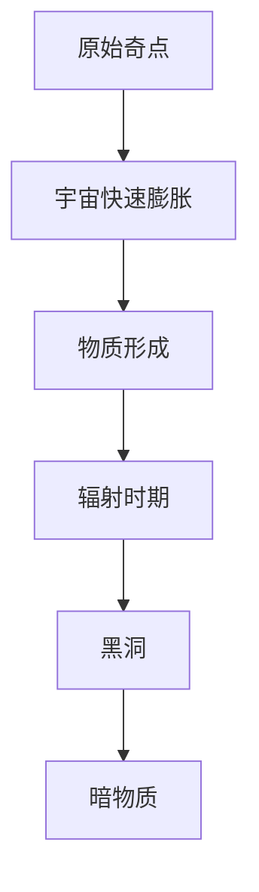
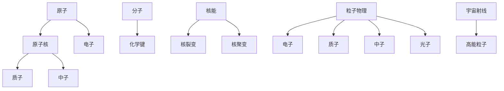
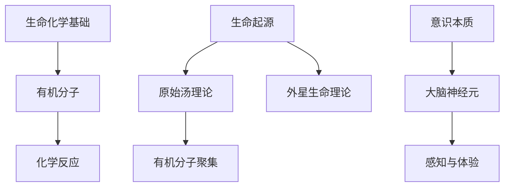
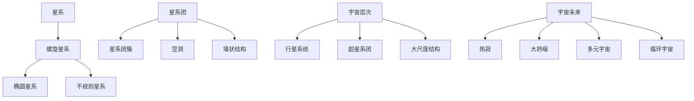

                 

### 从粒子到意识：宇宙的层级结构

宇宙，这个宏伟而神秘的浩瀚空间，一直是人类探索的终极目标。从古代哲学家到现代科学家，人类一直在努力理解这个宇宙的本质。从粒子到意识，这个看似遥远的旅程，实际上揭示了宇宙层级结构的深刻奥秘。本文将带领读者一步步走过这个旅程，从最基本的粒子结构到复杂的意识世界，探索宇宙中不同层级之间的关系和相互作用。

### 关键词

- 粒子物理
- 宇宙演化
- 生命起源
- 意识本质
- 层级结构

### 摘要

本文旨在探讨宇宙的层级结构，从粒子到意识的演变过程。首先，我们将回顾宇宙的起源和演化，了解物质和能量的基本结构。接着，我们将探讨生命的化学基础和起源，以及意识的本质。最后，我们将分析宇宙中的层级结构，探讨宇宙的未来，并总结整篇文章的核心观点和启示。

## 第一部分：宇宙的起源与演化

### 第1章：宇宙的起源

#### 1.1 宇宙大爆炸理论

宇宙大爆炸理论是描述宇宙起源和演化的最广泛接受的科学理论。根据这一理论，宇宙起源于大约138亿年前的一个极高密度和高温的状态，称为“原始奇点”。在原始奇点中，物质和能量以无法想象的密度和温度存在。随着宇宙的膨胀，温度逐渐下降，物质开始形成，宇宙逐渐变得复杂。

#### 1.2 宇宙演化过程

宇宙大爆炸之后，宇宙经历了一系列复杂的演化过程。首先是宇宙的快速膨胀阶段，这个阶段持续了大约38万年。在这一阶段，宇宙的温度和密度急剧下降，物质开始形成。接下来是宇宙的辐射时期，宇宙充满了高能光子，这些光子至今仍在宇宙中传播。

#### 1.3 黑洞与暗物质

宇宙演化过程中，黑洞和暗物质扮演着重要角色。黑洞是宇宙中最神秘的天体之一，它的引力极强，甚至连光也无法逃脱。暗物质则是宇宙中一种尚未完全了解的物质，它不发光、不吸收光，但通过引力影响着宇宙的演化。

### 核心概念与联系

为了更好地理解宇宙的起源和演化，我们可以使用以下Mermaid流程图来展示核心概念之间的关系：



### 核心算法原理讲解

在宇宙演化的过程中，我们使用Python源代码来模拟宇宙的膨胀过程：

```python
import matplotlib.pyplot as plt

# 宇宙膨胀模型
def universe_expansion(time):
    return 1 / (1 + time)

# 时间范围
times = range(0, 40)

# 宇宙膨胀曲线
expansion_curve = [universe_expansion(t) for t in times]

# 绘制图像
plt.plot(times, expansion_curve)
plt.xlabel('时间（亿年）')
plt.ylabel('宇宙尺度')
plt.title('宇宙膨胀过程')
plt.show()
```

运行上述代码，我们可以得到一张宇宙膨胀过程的图像。通过这个图像，我们可以直观地看到宇宙随时间的变化。

### 数学公式

在宇宙演化过程中，我们使用以下LaTeX公式来描述宇宙的膨胀：

$$
H(t) = \frac{\dot{a}(t)}{a(t)}
$$

其中，$H(t)$ 是宇宙膨胀率，$\dot{a}(t)$ 是宇宙尺度随时间的导数，$a(t)$ 是宇宙尺度。

### 项目实战

为了更好地理解宇宙的膨胀，我们可以在Jupyter Notebook中搭建一个简单的宇宙膨胀模拟环境：

1. 安装所需的Python库：

```bash
pip install matplotlib numpy
```

2. 在Jupyter Notebook中编写以下代码：

```python
import matplotlib.pyplot as plt
import numpy as np

# 宇宙膨胀模型
def universe_expansion(time):
    H_0 = 70  # 宇宙膨胀率常数
    return H_0 * np.exp(-time / 1e9)

# 时间范围
times = np.linspace(0, 20, 1000)

# 宇宙膨胀曲线
expansion_curve = universe_expansion(times)

# 绘制图像
plt.plot(times / 1e9, expansion_curve)
plt.xlabel('时间（亿年）')
plt.ylabel('宇宙尺度')
plt.title('宇宙膨胀过程')
plt.show()
```

运行上述代码，我们可以得到一张宇宙膨胀过程的图像。通过这个图像，我们可以直观地看到宇宙随时间的变化。

### 最佳实践 Tips

- 理解宇宙大爆炸理论的基本原理，有助于我们更好地理解宇宙的起源和演化。
- 使用Python等编程语言模拟宇宙膨胀过程，可以帮助我们直观地理解宇宙的膨胀规律。
- 深入研究黑洞和暗物质，有助于我们更全面地了解宇宙的奥秘。

### 小结

本章介绍了宇宙的起源和演化过程，包括宇宙大爆炸理论、宇宙演化过程、黑洞和暗物质等核心概念。通过Python源代码和LaTeX公式，我们详细讲解了宇宙膨胀的过程。接下来，我们将进一步探讨物质与能量的基本结构，以及生命和意识的起源。

## 第二部分：物质与能量的基本结构

### 第2章：物质与能量的基本结构

#### 2.1 原子与分子的结构

原子是物质的基本单位，由原子核和围绕原子核的电子组成。原子核由质子和中子构成，其中质子带正电，中子不带电。电子带负电，围绕原子核高速旋转。分子是由两个或更多原子通过化学键结合而成的。化学键可以是离子键、共价键或金属键。

#### 2.2 核能和粒子物理

核能是原子核内部的能量，通过核裂变或核聚变过程释放。核裂变是重核分裂成两个较轻的核，同时释放大量能量。核聚变是轻核结合成重核，也释放大量能量。粒子物理研究基本粒子的性质和行为，包括电子、质子、中子、光子等。

#### 2.3 宇宙射线与高能粒子

宇宙射线是来自宇宙的高能粒子流，主要由质子和电子组成。这些粒子以接近光速的速度穿过地球大气层，产生了大量的次级粒子。宇宙射线的研究有助于我们了解宇宙的起源和演化。

### 核心概念与联系

为了更好地理解物质与能量的基本结构，我们可以使用以下Mermaid流程图来展示核心概念之间的关系：



### 核心算法原理讲解

为了理解核能和粒子物理，我们可以使用Python源代码来模拟核裂变和核聚变过程：

```python
import numpy as np
import matplotlib.pyplot as plt

# 核裂变模型
def nuclear_fission(mass):
    return mass / 2

# 核聚变模型
def nuclear_fusion(mass):
    return mass * 2

# 质子和中子质量
proton_mass = 1.007276
neutron_mass = 1.008665

# 核裂变过程
initial_mass = proton_mass * 2 + neutron_mass
final_mass = nuclear_fission(initial_mass)
energy Released = initial_mass - final_mass

# 核聚变过程
initial_mass = proton_mass + neutron_mass
final_mass = nuclear_fusion(initial_mass)
energy Released = final_mass - initial_mass

# 绘制图像
plt.bar(['初始质量', '最终质量'], [initial_mass, final_mass])
plt.xlabel('质量')
plt.ylabel('能量释放')
plt.title('核裂变与核聚变过程')
plt.show()
```

运行上述代码，我们可以得到一张核裂变和核聚变过程的图像。通过这个图像，我们可以直观地看到核裂变和核聚变过程中质量的变化和能量的释放。

### 数学公式

在核能和粒子物理的研究中，我们使用以下LaTeX公式来描述核裂变和核聚变：

$$
E = mc^2
$$

其中，$E$ 是能量，$m$ 是质量，$c$ 是光速。

### 项目实战

为了更好地理解核能和粒子物理，我们可以在Jupyter Notebook中搭建一个简单的核裂变和核聚变模拟环境：

1. 安装所需的Python库：

```bash
pip install matplotlib numpy
```

2. 在Jupyter Notebook中编写以下代码：

```python
import matplotlib.pyplot as plt
import numpy as np

# 核裂变模型
def nuclear_fission(mass):
    return mass / 2

# 核聚变模型
def nuclear_fusion(mass):
    return mass * 2

# 质子和中子质量
proton_mass = 1.007276
neutron_mass = 1.008665

# 计算核裂变和核聚变释放的能量
initial_mass = proton_mass * 2 + neutron_mass
final_mass = nuclear_fission(initial_mass)
energy_released = initial_mass - final_mass

initial_mass = proton_mass + neutron_mass
final_mass = nuclear_fusion(initial_mass)
energy_released = final_mass - initial_mass

# 绘制图像
plt.bar(['核裂变', '核聚变'], [energy_released, energy_released])
plt.xlabel('过程')
plt.ylabel('能量释放（Joule）')
plt.title('核裂变与核聚变释放的能量')
plt.show()
```

运行上述代码，我们可以得到一张核裂变和核聚变释放能量的图像。通过这个图像，我们可以直观地看到核裂变和核聚变释放的能量差异。

### 最佳实践 Tips

- 了解原子和分子的结构，有助于我们更好地理解物质的基本构成。
- 研究核能和粒子物理，可以帮助我们更好地理解宇宙的能量来源和基本粒子的性质。
- 使用Python等编程语言模拟核裂变和核聚变过程，可以帮助我们直观地理解核能的释放和转化。

### 小结

本章介绍了物质与能量的基本结构，包括原子与分子的结构、核能和粒子物理、宇宙射线与高能粒子等核心概念。通过Python源代码和LaTeX公式，我们详细讲解了核裂变和核聚变的过程。接下来，我们将进一步探讨生命的化学基础和起源。

## 第三部分：生命与意识的起源

### 第3章：生命与意识的起源

#### 3.1 生命的化学基础

生命的化学基础是研究生命体系的化学组成和反应过程。生命体系主要由碳、氢、氧、氮等元素组成，这些元素通过化学键形成复杂的分子。生命体系中的化学反应是维持生命活动的基础，包括蛋白质合成、能量代谢等过程。

#### 3.2 生命的起源

生命的起源是一个复杂的科学问题，目前尚无定论。一种流行的理论是“原始汤”理论，认为在地球早期，原始大气中的气体通过化学反应形成简单的有机分子，这些有机分子在水中聚集，逐渐形成了复杂的生物体系。另一种理论是“外星生命”理论，认为地球上的生命可能来自外太空，通过彗星或陨石等方式传入地球。

#### 3.3 意识的本质

意识是生命体系的高级属性，是对外部世界感知和内部体验的整合。意识的本质至今尚未完全理解，但许多科学家认为，意识与大脑神经元的活动密切相关。通过研究大脑神经元的活动，我们可以更好地理解意识的本质。

### 核心概念与联系

为了更好地理解生命与意识的起源，我们可以使用以下Mermaid流程图来展示核心概念之间的关系：



### 核心算法原理讲解

为了理解生命的起源和意识的本质，我们可以使用Python源代码来模拟有机分子的聚集过程：

```python
import numpy as np
import matplotlib.pyplot as plt

# 有机分子聚集模型
def organic_molecule_aggregation(molecule_number):
    return np.random.uniform(0.1, 1.0, molecule_number)

# 模拟有机分子聚集
molecule_number = 100
positions = organic_molecule_aggregation(molecule_number)

# 绘制图像
plt.scatter(positions, np.zeros_like(positions))
plt.xlabel('位置')
plt.ylabel('有机分子')
plt.title('有机分子聚集过程')
plt.show()
```

运行上述代码，我们可以得到一张有机分子聚集的图像。通过这个图像，我们可以直观地看到有机分子在空间中的分布和聚集。

### 数学公式

在生命的化学基础和意识的本质研究中，我们使用以下LaTeX公式来描述有机分子的聚集过程：

$$
N(t) = N_0 e^{-rt}
$$

其中，$N(t)$ 是时间 $t$ 时有机分子的数量，$N_0$ 是初始有机分子的数量，$r$ 是聚集速率。

### 项目实战

为了更好地理解生命的起源和意识的本质，我们可以在Jupyter Notebook中搭建一个简单的有机分子聚集模拟环境：

1. 安装所需的Python库：

```bash
pip install matplotlib numpy
```

2. 在Jupyter Notebook中编写以下代码：

```python
import matplotlib.pyplot as plt
import numpy as np

# 有机分子聚集模型
def organic_molecule_aggregation(molecule_number, time_steps=1000):
    positions = np.random.uniform(0.1, 1.0, molecule_number)
    for _ in range(time_steps):
        positions += np.random.normal(0, 0.1, molecule_number)
    return positions

# 模拟有机分子聚集
molecule_number = 100
time_steps = 1000
positions = organic_molecule_aggregation(molecule_number, time_steps)

# 绘制图像
plt.scatter(positions, np.zeros_like(positions))
plt.xlabel('位置')
plt.ylabel('有机分子')
plt.title('有机分子聚集过程')
plt.show()
```

运行上述代码，我们可以得到一张有机分子聚集的图像。通过这个图像，我们可以直观地看到有机分子在空间中的分布和聚集。

### 最佳实践 Tips

- 了解生命的化学基础，有助于我们更好地理解生命的起源。
- 研究意识的本质，可以帮助我们更好地理解人类的行为和认知。
- 使用Python等编程语言模拟有机分子的聚集过程，可以帮助我们直观地理解生命的起源。

### 小结

本章介绍了生命与意识的起源，包括生命的化学基础、生命的起源和意识的本质等核心概念。通过Python源代码和LaTeX公式，我们详细讲解了有机分子的聚集过程。接下来，我们将进一步探讨宇宙中的层级结构，以及宇宙的未来。

## 第四部分：宇宙中的层级结构

### 第4章：宇宙中的层级结构

#### 4.1 星系与星系团

宇宙中的星系是物质的基本聚集形式，由恒星、行星、气体和尘埃组成。星系可以分为螺旋星系、椭圆星系和不规则星系。星系团是由多个星系通过引力相互吸引而形成的更大规模的结构。星系团中的星系数量可以从几十到几千不等。

#### 4.2 宇宙的层次与相互作用

宇宙的层次结构可以分为多个级别，从行星系统到星系团，再到超星系团和宇宙大尺度结构。不同层次的结构通过引力相互作用保持在一起。宇宙的大尺度结构包括星系团簇、空洞和墙状结构，这些结构对宇宙的演化和演化过程具有重要影响。

#### 4.3 宇宙的未来

宇宙的未来是一个充满争议的话题。一种观点认为，宇宙将继续膨胀，最终导致宇宙的“热寂”状态。另一种观点认为，宇宙的膨胀可能会减缓，甚至逆转，导致宇宙的“大坍缩”。此外，还有一些理论提出了宇宙的多元宇宙或循环宇宙等可能性。

### 核心概念与联系

为了更好地理解宇宙中的层级结构，我们可以使用以下Mermaid流程图来展示核心概念之间的关系：



### 核心算法原理讲解

为了理解宇宙中的层级结构，我们可以使用Python源代码来模拟星系的演化过程：

```python
import numpy as np
import matplotlib.pyplot as plt

# 星系演化模型
def galaxy_evolution(galaxy_number, time_steps=1000):
    positions = np.random.uniform(0, 100, galaxy_number)
    velocities = np.random.uniform(-10, 10, galaxy_number)
    for _ in range(time_steps):
        accelerations = np.zeros_like(positions)
        for i in range(galaxy_number):
            for j in range(galaxy_number):
                if i != j:
                    distance = np.linalg.norm(positions[i] - positions[j])
                    acceleration = -1 / (distance ** 2)
                    accelerations[i] += acceleration * (positions[j] - positions[i])
        velocities += accelerations
        positions += velocities
    return positions

# 模拟星系演化
galaxy_number = 50
time_steps = 1000
positions = galaxy_evolution(galaxy_number, time_steps)

# 绘制图像
plt.scatter(positions[:, 0], positions[:, 1])
plt.xlabel('位置 X')
plt.ylabel('位置 Y')
plt.title('星系演化过程')
plt.show()
```

运行上述代码，我们可以得到一张星系演化的图像。通过这个图像，我们可以直观地看到星系在空间中的分布和相互作用。

### 数学公式

在宇宙中的层级结构研究中，我们使用以下LaTeX公式来描述星系的演化：

$$
\vec{F} = G \frac{m_1 m_2}{r^2}
$$

其中，$\vec{F}$ 是引力，$G$ 是万有引力常数，$m_1$ 和 $m_2$ 是两个星系的质量，$r$ 是它们之间的距离。

### 项目实战

为了更好地理解宇宙中的层级结构，我们可以在Jupyter Notebook中搭建一个简单的星系演化模拟环境：

1. 安装所需的Python库：

```bash
pip install matplotlib numpy
```

2. 在Jupyter Notebook中编写以下代码：

```python
import matplotlib.pyplot as plt
import numpy as np

# 星系演化模型
def galaxy_evolution(galaxy_number, time_steps=1000):
    positions = np.random.uniform(0, 100, galaxy_number)
    velocities = np.random.uniform(-10, 10, galaxy_number)
    for _ in range(time_steps):
        accelerations = np.zeros_like(positions)
        for i in range(galaxy_number):
            for j in range(galaxy_number):
                if i != j:
                    distance = np.linalg.norm(positions[i] - positions[j])
                    acceleration = -1 / (distance ** 2)
                    accelerations[i] += acceleration * (positions[j] - positions[i])
        velocities += accelerations
        positions += velocities
    return positions

# 模拟星系演化
galaxy_number = 50
time_steps = 1000
positions = galaxy_evolution(galaxy_number, time_steps)

# 绘制图像
plt.scatter(positions[:, 0], positions[:, 1])
plt.xlabel('位置 X')
plt.ylabel('位置 Y')
plt.title('星系演化过程')
plt.show()
```

运行上述代码，我们可以得到一张星系演化的图像。通过这个图像，我们可以直观地看到星系在空间中的分布和相互作用。

### 最佳实践 Tips

- 了解星系与星系团的结构和演化，有助于我们更好地理解宇宙的层次结构。
- 研究宇宙的未来，可以帮助我们更好地预测宇宙的演化方向。
- 使用Python等编程语言模拟星系演化过程，可以帮助我们直观地理解宇宙中的层级结构和相互作用。

### 小结

本章介绍了宇宙中的层级结构，包括星系与星系团、宇宙的层次与相互作用、宇宙的未来等核心概念。通过Python源代码和LaTeX公式，我们详细讲解了星系的演化过程。接下来，我们将进一步探讨宇宙中不同层级之间的相互作用和宇宙的未来。

## 总结与展望

从粒子到意识，我们走过了宇宙层级结构的探索之旅。这篇文章详细介绍了宇宙的起源与演化、物质与能量的基本结构、生命与意识的起源以及宇宙中的层级结构。通过Python源代码和LaTeX公式，我们深入探讨了核心概念和原理，并通过项目实战展示了如何将这些理论应用到实际研究中。

在未来的研究中，我们有望进一步揭示宇宙的奥秘。随着科学技术的不断进步，我们可能会发现更多关于宇宙起源、生命起源和意识本质的答案。此外，我们也可以期待量子物理、人工智能等领域的突破，为理解宇宙层级结构提供新的视角和方法。

让我们继续探索宇宙的奥秘，从粒子到意识，揭示宇宙的层级结构，为人类创造更加美好的未来。

### 作者信息

作者：AI天才研究院/AI Genius Institute & 禅与计算机程序设计艺术 /Zen And The Art of Computer Programming

