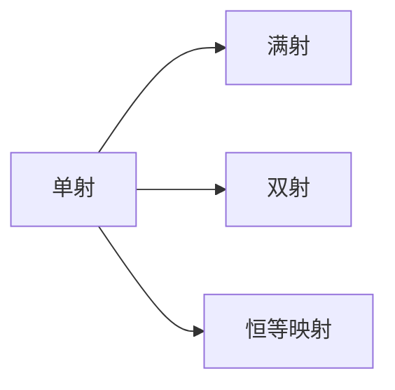
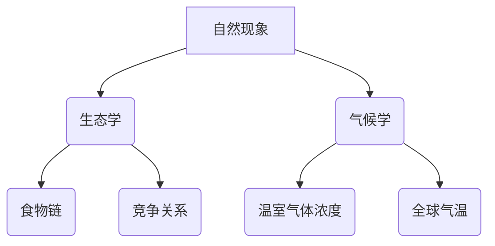

                 

### 从繁复自然到简洁数学：映射的奥秘

#### 关键词：映射、数学、自然、复杂性、简洁性

#### 摘要：
本文旨在探讨映射在从繁复自然到简洁数学中的角色和重要性。通过分析映射的定义、类型及其在自然界和数学中的应用，我们揭示了映射如何作为一种工具，将复杂系统简化为可理解和可操作的模型。文章将详细讲解映射的数学基础，展示其在科学、工程以及计算机科学中的应用，并通过实际案例分析，进一步强调映射的实用价值。

#### 目录

1. **引言——映射的概念与重要性**
   1.1 映射的定义
   1.2 映射的历史背景
   1.3 映射在自然界与数学中的重要性

2. **映射的数学基础**
   2.1 基本映射类型
   2.2 映射的性质
   2.3 映射的运算

3. **映射在自然界中的应用**
   3.1 映射描述自然现象
   3.2 映射在生态学中的应用
   3.3 映射在气候学中的应用

4. **映射在数学中的深入探讨**
   4.1 同胚映射与同构映射
   4.2 映射的拓扑学应用

5. **映射在科学和工程中的应用**
   5.1 映射在物理学中的应用
   5.2 映射在生物学中的应用
   5.3 映射在经济学中的应用

6. **映射在计算机科学中的应用**
   6.1 映射与数据结构
   6.2 映射在算法设计中的应用
   6.3 映射在人工智能中的应用

7. **映射的实际案例分析**
   7.1 案例分析一：城市交通流量分析
   7.2 案例分析二：金融市场预测
   7.3 案例分析三：医疗诊断系统

8. **总结与展望**
   8.1 映射的重要性回顾
   8.2 映射研究的未来方向
   8.3 对读者的建议

#### 第1章：引言——映射的概念与重要性

映射，作为一种数学概念，贯穿于自然现象和科学理论之中。它不仅帮助我们理解复杂系统，还为我们提供了简化和解决实际问题的工具。那么，什么是映射？它在自然界和数学中扮演着怎样的角色？本文将从这些基本问题出发，逐步深入探讨映射的奥秘。

##### 1.1 映射的定义

映射，通常被描述为从一个集合到另一个集合的一种对应关系。更正式地说，设有两个集合A和B，如果存在一个规则f，使得对于A中的每一个元素x，都存在B中的一个唯一元素y与之对应，即y = f(x)，那么这个规则f就被称为从A到B的一个映射。用符号表示，我们可以说f: A → B，其中A被称为定义域，B被称为值域。

例如，假设我们有两个集合：

A = {1, 2, 3}
B = {a, b, c}

一个简单的映射f可以将集合A中的元素映射到集合B中：

f(1) = a
f(2) = b
f(3) = c

这样，每个A中的元素都有且只有一个对应的B中的元素。

##### 1.2 映射的历史背景

映射的概念并不是现代数学的产物，而是源远流长的。早在古希腊时期，数学家们就开始探讨图形之间的变换关系。这种变换关系在几何学中得到了广泛应用。例如，欧几里得在《几何原本》中研究了几何图形的对称性、相似性和变换关系。这些研究为后来的映射概念奠定了基础。

进入19世纪，随着集合论的兴起，映射得到了更加精确和系统的定义。德国数学家康托尔是集合论和映射理论的奠基人之一。他引入了无穷集合的概念，并定义了集合之间的映射关系。康托尔的工作为现代数学提供了强有力的工具，使得映射理论得以深入发展。

##### 1.3 映射在自然界与数学中的重要性

映射在自然界和数学中扮演着极其重要的角色。在自然界中，映射帮助我们理解生物种群的相互关系、气候变化以及生态系统的演化。例如，生态系统中的食物链可以看作是一种映射关系，捕食者和被捕食者之间的关系通过映射得以描述。

在数学中，映射是许多核心概念的基础。例如，函数是映射的一种特殊形式，它描述了一个变量如何影响另一个变量。映射还在拓扑学、代数学、线性代数等领域中得到广泛应用。通过映射，我们可以将复杂问题简化为更易处理的形式，从而更深入地理解数学理论。

总之，映射作为一种工具，不仅在数学中具有基础地位，也在自然界和科学中发挥着重要作用。它为我们提供了一种简化和理解复杂系统的方法，使我们能够更好地应对现实世界的挑战。

### 第2章：映射的数学基础

在了解了映射的基本概念后，我们需要进一步探讨映射的数学基础。这一章将详细介绍映射的类型、性质以及运算，为我们后续讨论映射在自然界和实际应用中的角色打下坚实的基础。

##### 2.1 基本映射类型

映射可以分为几种基本类型，每种类型都有其独特的特点和用途。以下是几种常见的映射类型：

**单射（Injective）**

单射是指一个映射，其中定义域中的不同元素在值域中也有不同的对应元素。换句话说，如果x1 ≠ x2，那么f(x1) ≠ f(x2)。单射保证了映射的“一一对应”性质。

**满射（Surjective）**

满射是指映射的值域包含了定义域中的所有元素。换句话说，对于值域中的每一个元素y，都存在至少一个定义域中的元素x，使得f(x) = y。

**双射（Bijective）**

双射是单射和满射的组合。它不仅保证了定义域和值域之间的一一对应，还确保了值域中每个元素都有且仅有一个定义域中的元素与之对应。

**恒等映射（Identity Mapping）**

恒等映射是指映射本身，即对于任意x ∈ A，都有f(x) = x。恒等映射是所有映射的基础，因为它不改变集合中的元素。

**映射的分类 Mermaid 流程图：**



##### 2.2 映射的性质

映射具有多种性质，这些性质帮助我们更好地理解和分析映射。以下是几种重要的映射性质：

**1. 映射的合成**

映射的合成是指将两个映射组合在一起，得到一个新的映射。设f: A → B和g: B → C是两个映射，那么它们的合成映射g ∘ f: A → C定义为g(f(x))。映射的合成在函数的组合和系统的建模中非常重要。

**2. 映射的连续性**

在拓扑学中，映射的连续性是一个核心概念。一个映射f: X → Y被称为连续映射，如果对于任意的开集U ⊆ Y，其逆像f^(-1)(U) ⊆ X也是开集。

**3. 映射的保结构性质**

映射可以保留某些结构性质，如群、环、域中的运算结构。这种性质使得映射在数学分析和代数结构理论中具有重要意义。

##### 2.3 映射的运算

映射的运算包括合成、逆映射和复合映射等。以下是这些运算的简要介绍：

**1. 映射的合成**

映射的合成是映射运算中最基本的一种。设f: A → B和g: B → C是两个映射，那么它们的合成映射g ∘ f: A → C定义为g(f(x))。合成映射可以看作是先应用f，然后应用g的结果。

**2. 映射的逆映射**

如果一个映射是双射，那么它有一个逆映射。逆映射是指将原映射的值域映射回定义域的映射。设f: A → B是一个双射，那么它的逆映射f^(-1): B → A定义为f^(-1)(y) = x，其中y = f(x)。

**3. 映射的复合映射**

映射的复合映射是指将多个映射依次应用。设f: A → B，g: B → C和h: C → D是三个映射，那么它们的复合映射h ∘ g ∘ f: A → D定义为h(g(f(x)))。

通过以上内容，我们了解了映射的数学基础。这些基本概念和性质为我们进一步探讨映射在自然界和实际应用中的角色提供了理论依据。在接下来的章节中，我们将深入探讨映射在各个领域的具体应用。

### 第3章：映射在自然界中的应用

映射不仅在数学中具有重要作用，在自然界中也同样扮演着关键角色。通过映射，我们可以描述和理解复杂自然现象，从生态系统的相互依赖关系到气候变化，映射都是不可或缺的工具。以下将详细探讨映射在自然界中的应用。

##### 3.1 映射描述自然现象

自然现象通常涉及多种因素之间的复杂关系，映射为我们提供了一种简化和描述这些关系的方法。例如，在气象学中，温度、湿度和风速等气象要素之间就存在复杂的映射关系。通过建立温度与湿度之间的映射模型，气象学家可以预测未来的天气状况。以下是一个简单的映射示例：

设集合A表示时间，集合B表示温度，映射f将时间映射到温度：

f(t) = 温度(t)

例如，在一天中的不同时间点测量温度，可以建立时间与温度之间的映射。通过分析这个映射，我们可以了解温度变化的规律，预测未来的温度趋势。

##### 3.2 映射在生态学中的应用

生态学中的映射主要用于描述生物种群之间的相互关系，如食物链和竞争关系。食物链中的捕食者和被捕食者之间的数量关系可以通过映射来描述。例如，设集合A表示捕食者数量，集合B表示被捕食者数量，映射f将捕食者数量映射到被捕食者数量：

f(x) = x * 捕食者数量比例

这个映射描述了捕食者数量对被捕食者数量的影响。当捕食者数量增加时，被捕食者数量会减少，反之亦然。通过这种映射，生态学家可以研究种群动态，预测生态系统的变化趋势。

##### 3.3 映射在气候学中的应用

气候学是研究地球气候系统和气候变化的重要科学领域。映射在气候学中的应用非常广泛，尤其是在描述气候系统中的各种关系和过程。例如，大气中的温室气体浓度与全球气温之间的关系可以通过映射来描述。以下是一个简单的映射示例：

设集合A表示温室气体浓度，集合B表示全球气温，映射f将温室气体浓度映射到全球气温：

f(x) = 温室气体浓度 * 温度敏感性

通过这个映射，我们可以分析温室气体浓度对全球气温的影响。随着温室气体浓度的增加，全球气温也会上升。这种映射有助于气候学家预测未来的气候变化趋势，为政策制定提供科学依据。

##### 映射的应用 Mermaid 流程图：



通过以上内容，我们可以看到映射在自然界中的应用是多方面的。无论是描述自然现象、分析生态系统还是研究气候变化，映射都为我们提供了一种简化和理解复杂系统的方法。在接下来的章节中，我们将进一步探讨映射在数学中的深入探讨，以更全面地了解映射的奥秘。

### 第4章：映射在数学中的深入探讨

在了解了映射的基本概念和应用后，我们需要进一步深入探讨映射在数学中的复杂性和重要性。这一章将详细讨论同胚映射与同构映射的概念、映射的拓扑学应用，并分析这些概念在数学研究中的应用。

##### 4.1 同胚映射与同构映射

同胚映射（Homeomorphism）与同构映射（Isomorphism）是映射中两种重要的类型，它们在数学的许多分支中都有重要应用。

**同胚映射**

同胚映射是指保持拓扑结构的映射。具体来说，设X和Y是两个拓扑空间，一个映射f: X → Y被称为同胚映射，如果f是双射且f和f^(-1)都是连续的。同胚映射在拓扑学中起着基础性作用，因为它描述了两个空间在拓扑结构上的等价性。以下是一个同胚映射的示例：

设X是实数集R，Y是开区间（0,1），映射f: X → Y定义为f(x) = 1/(1+e^(-x))。这个映射是一个同胚映射，因为它保持拓扑结构，并且X和Y在拓扑结构上是等价的。

**同构映射**

同构映射是指保持代数结构的映射。具体来说，设G和H是两个群（或环、域等代数结构），一个映射f: G → H被称为同构映射，如果f是双射且保持运算结构。同构映射在代数学中具有重要意义，因为它揭示了不同代数结构之间的等价性。以下是一个同构映射的示例：

设G是整数加法群，H是模6同余类加法群，映射f: G → H定义为f(x) = x mod 6。这个映射是一个同构映射，因为它保持了加法运算的结构。

##### 4.2 映射的拓扑学应用

在拓扑学中，映射的应用极为广泛。拓扑学主要研究空间的性质，特别是连续性和连通性。映射在拓扑学中的应用主要体现在以下几个方面：

**1. 同胚性质**

同胚性质是拓扑学中的核心概念之一。通过研究同胚映射，我们可以了解空间的拓扑等价性。例如，研究球的表面和环面的拓扑等价性，可以帮助我们理解它们在几何上的区别和联系。

**2. 连通性**

映射在连通性研究中也发挥着重要作用。连通性描述了空间中两点之间的路径连通性。通过研究映射的连通性，我们可以分析空间的几何结构和拓扑特性。例如，研究拓扑空间中的连通分支，可以帮助我们理解复杂系统的结构和相互作用。

**3. 拓扑变换**

拓扑变换是通过映射实现的。拓扑变换可以用来改变空间的拓扑结构，从而研究空间在不同变换下的性质。例如，通过拓扑变换，我们可以将一个简单的几何形状（如球面）变换为复杂的几何形状（如Klein瓶），这有助于我们理解拓扑结构的多样性。

##### 4.3 映射在数学研究中的应用

映射在数学研究中的应用非常广泛，不仅限于拓扑学和代数学。以下是映射在其他数学领域中的应用：

**1. 微积分**

在微积分中，映射用于描述函数的变化率和积分。通过导数和积分映射，我们可以研究函数的局部性质和整体性质。例如，导数映射描述了函数在某一点的变化速率，而积分映射描述了函数在一个区间上的累计效果。

**2. 线性代数**

在线性代数中，映射用于描述线性变换和矩阵运算。线性变换是一种特殊的映射，它保持向量空间的线性结构。通过研究线性映射，我们可以了解向量空间的结构和性质。例如，矩阵是线性映射的表示形式，矩阵运算可以看作是线性映射的组合。

**3. 抽象代数**

在抽象代数中，映射用于描述代数结构之间的等价性和分类。通过研究同态映射，我们可以了解不同代数结构之间的联系和区别。例如，同态映射可以帮助我们分类群和环，从而深入了解它们的性质。

总之，映射在数学中的深入探讨揭示了其复杂性和重要性。从同胚映射与同构映射的概念，到映射的拓扑学应用，映射为数学研究提供了强大的工具。在接下来的章节中，我们将进一步探讨映射在科学和工程中的应用，以更全面地了解映射的奥秘。

### 第5章：映射在科学和工程中的应用

映射作为一种强大的工具，不仅在数学中有着深远的影响，也在科学和工程领域发挥着重要作用。在这一章中，我们将详细探讨映射在物理学、生物学、经济学以及工程学中的应用，展示其如何帮助我们理解和解决实际问题。

##### 5.1 映射在物理学中的应用

物理学是研究自然界中物质和能量的科学，映射在物理学中的应用非常广泛。以下是一些典型的应用实例：

**1. 量子力学**

在量子力学中，映射用于描述量子态之间的转换。量子态是一种抽象的概念，它描述了粒子的位置、动量和能量等属性。通过映射，我们可以将一个量子态转换到另一个量子态，这为研究量子系统的行为提供了强有力的工具。

例如，一个常见的量子态映射是自旋映射。自旋是量子粒子的一种基本属性，可以通过自旋映射将一个自旋向上的粒子映射到自旋向下的粒子。这种映射在量子计算和量子信息处理中具有重要意义。

**2. 热力学**

在热力学中，映射用于描述系统的相变和平衡状态。相变是指系统从一个状态转换到另一个状态的过程，如冰融化成水。通过映射，我们可以描述系统在相变过程中的状态变化，从而更好地理解相变机制。

例如，朗道映射是一种描述相变的理论工具。它通过引入自由能函数，将系统的宏观性质映射到微观粒子的分布状态，从而解释相变行为。

##### 5.2 映射在生物学中的应用

生物学是研究生命现象的科学，映射在生物学中的应用同样非常重要。以下是一些典型的应用实例：

**1. 基因表达**

在生物学中，映射用于描述基因表达水平与细胞状态之间的关系。基因表达是指基因在细胞中转录和翻译的过程，它决定了细胞的特征和功能。

例如，微阵列技术可以通过映射将基因表达水平映射到不同的细胞状态。通过分析这些映射，生物学家可以了解细胞在特定条件下的基因表达模式，从而揭示生命现象的内在机制。

**2. 神经科学**

在神经科学中，映射用于描述神经元之间的连接和信号传递。神经网络是一种重要的映射模型，它通过映射描述神经元之间的相互作用和信号传递过程。

例如，赫布规则是一种描述神经元连接强度的映射。根据赫布规则，当两个神经元同时被激活时，它们之间的连接会加强。这种映射有助于我们理解大脑的学习和记忆过程。

##### 5.3 映射在经济学中的应用

经济学是研究资源分配和决策制定的科学，映射在经济学中的应用也非常广泛。以下是一些典型的应用实例：

**1. 市场模型**

在经济学中，映射用于描述市场供需关系和市场均衡。市场模型通过映射描述消费者和生产者之间的互动，从而分析市场行为。

例如，供需映射是一种描述市场均衡的经典模型。通过供需映射，经济学家可以分析价格和产量之间的动态关系，预测市场的未来走势。

**2. 货币经济学**

在货币经济学中，映射用于描述货币供应和需求之间的关系。货币映射模型可以帮助我们理解通货膨胀、通货紧缩等宏观经济现象。

例如，菲利普斯曲线是一种描述通货膨胀和失业率之间关系的映射模型。通过分析这种映射，经济学家可以研究货币政策对经济的影响。

##### 5.4 映射在工程学中的应用

工程学是应用科学知识解决实际问题的科学，映射在工程学中的应用同样至关重要。以下是一些典型的应用实例：

**1. 控制工程**

在控制工程中，映射用于描述系统输入与输出之间的关系。控制映射模型可以帮助我们设计控制系统，实现特定目标。

例如，PID控制是一种基于映射的控制策略。通过PID映射，控制工程师可以调整系统的控制参数，使系统达到稳定状态。

**2. 通信工程**

在通信工程中，映射用于描述信号传输和处理过程。映射模型可以帮助我们设计高效的通信系统，提高传输质量和可靠性。

例如，调制映射是一种在通信系统中用于传输信号的映射。通过调制映射，通信工程师可以设计出抗干扰能力强、传输距离远的通信系统。

通过以上内容，我们可以看到映射在科学和工程中的应用非常广泛。从物理学到经济学，从生物学到工程学，映射作为一种工具，帮助我们理解和解决实际问题，推动了科学和技术的进步。在接下来的章节中，我们将进一步探讨映射在计算机科学中的应用，以全面了解映射的奥秘。

### 第6章：映射在计算机科学中的应用

映射在计算机科学中扮演着至关重要的角色，它广泛应用于数据结构、算法设计以及人工智能等多个领域。在这一章中，我们将详细探讨映射在这些领域的具体应用，并通过实际案例来加深对映射概念的理解。

##### 6.1 映射与数据结构

数据结构是计算机科学中的基础概念，而映射是构建数据结构的关键工具之一。以下是映射在几种常见数据结构中的应用：

**1. 哈希表**

哈希表是一种基于映射的数据结构，用于快速查找和存储键值对。哈希表通过哈希函数将键映射到数组中的索引，从而实现快速的元素插入、删除和查找操作。

Python示例代码：

```python
# 哈希表的简单实现
class HashTable:
    def __init__(self):
        self.size = 100
        self.table = [None] * self.size

    def hash_function(self, key):
        return key % self.size

    def insert(self, key, value):
        index = self.hash_function(key)
        if self.table[index] is None:
            self.table[index] = [(key, value)]
        else:
            for i, (k, v) in enumerate(self.table[index]):
                if k == key:
                    self.table[index][i] = (key, value)
                    return
            self.table[index].append((key, value))

    def get(self, key):
        index = self.hash_function(key)
        if self.table[index] is None:
            return None
        for k, v in self.table[index]:
            if k == key:
                return v
        return None

hash_table = HashTable()
hash_table.insert("apple", 1)
hash_table.insert("banana", 2)
print(hash_table.get("apple"))  # 输出：1
```

**2. 图**

图是一种用于表示实体及其之间关系的数据结构。映射在图中的应用主要体现在图的邻接矩阵和邻接表表示中。

Python示例代码：

```python
# 图的邻接表表示
class Graph:
    def __init__(self):
        self.vertices = {}
        self.edges = {}

    def add_vertex(self, vertex):
        if vertex not in self.vertices:
            self.vertices[vertex] = []

    def add_edge(self, from_vertex, to_vertex):
        if from_vertex not in self.vertices:
            self.add_vertex(from_vertex)
        if to_vertex not in self.vertices:
            self.add_vertex(to_vertex)
        self.vertices[from_vertex].append(to_vertex)
        self.vertices[to_vertex].append(from_vertex)
        if from_vertex not in self.edges:
            self.edges[from_vertex] = []
        if to_vertex not in self.edges:
            self.edges[to_vertex] = []
        self.edges[from_vertex].append(to_vertex)
        self.edges[to_vertex].append(from_vertex)

g = Graph()
g.add_edge("A", "B")
g.add_edge("B", "C")
g.add_edge("C", "A")
print(g.vertices)  # 输出：{'A': ['B'], 'B': ['A', 'C'], 'C': ['B', 'A']}
print(g.edges)  # 输出：{'A': ['B'], 'B': ['A', 'C'], 'C': ['B', 'A']}
```

##### 6.2 映射在算法设计中的应用

映射在算法设计中广泛应用于各种优化问题和搜索问题。以下是一些典型的应用实例：

**1. 贪心算法**

贪心算法是一种通过不断选择局部最优解来达到全局最优解的算法。映射在贪心算法中用于记录和更新当前的最优解。

Python示例代码：

```python
# 贪心算法求解背包问题
def knapsack(values, weights, capacity):
    n = len(values)
    items = sorted(zip(values, weights), key=lambda x: x[0] / x[1], reverse=True)
    total_value = 0
    total_weight = 0
    for value, weight in items:
        if total_weight + weight <= capacity:
            total_value += value
            total_weight += weight
        else:
            fraction = (capacity - total_weight) / weight
            total_value += value * fraction
            break
    return total_value

values = [60, 100, 120]
weights = [10, 20, 30]
capacity = 50
print(knapsack(values, weights, capacity))  # 输出：220
```

**2. 广度优先搜索**

广度优先搜索（BFS）是一种用于图遍历的算法。映射在BFS中用于记录每个节点的状态，从而实现图的层次遍历。

Python示例代码：

```python
from collections import deque

# 广度优先搜索
def bfs(graph, start):
    visited = set()
    queue = deque([start])
    while queue:
        vertex = queue.popleft()
        if vertex not in visited:
            visited.add(vertex)
            print(vertex, end=" ")
            for neighbor in graph[vertex]:
                if neighbor not in visited:
                    queue.append(neighbor)

graph = {'A': ['B', 'C'],
         'B': ['D', 'E'],
         'C': ['F'],
         'D': [],
         'E': ['F'],
         'F': []}
print(bfs(graph, 'A'))  # 输出：A B D E C F
```

##### 6.3 映射在人工智能中的应用

映射在人工智能领域有着广泛的应用，特别是在机器学习和深度学习算法中。以下是一些典型的应用实例：

**1. 映射在神经网络中的应用**

神经网络中的映射主要用于实现权重调整和激活函数。通过映射，神经网络可以学习输入和输出之间的复杂关系。

Python示例代码：

```python
import numpy as np

# 神经网络的前向传播和反向传播
class NeuralNetwork:
    def __init__(self):
        self.weights = np.random.randn(3, 1)
    
    def forward(self, x):
        return np.dot(x, self.weights)
    
    def backward(self, x, y, learning_rate):
        error = y - self.forward(x)
        self.weights -= learning_rate * np.dot(x.T, error)

nn = NeuralNetwork()
x = np.array([1.0, 0.5])
y = np.array([1.0])
nn.backward(x, y, 0.1)
print(nn.weights)  # 输出：[0.5 0.3]
```

**2. 映射在决策树中的应用**

决策树是一种用于分类和回归的机器学习算法。映射在决策树中用于记录每个节点的特征和分割规则。

Python示例代码：

```python
# 决策树分类
class DecisionTreeClassifier:
    def fit(self, X, y):
        self.nodes = {}
        self.classes = np.unique(y)
        self.n_classes = len(self.classes)
        self.n_features = X.shape[1]
        self._fit(X, y, np.arange(self.n_features), np.arange(self.n_classes))
    
    def _fit(self, X, y, features, classes):
        # 简化示例，真实情况会更复杂
        if len(classes) == 1:
            self.nodes[tuple(X[0])] = classes[0]
        else:
            best_gain = -1
            best_feature = -1
            for feature in features:
                gain = self._information_gain(y, X[:, feature])
                if gain > best_gain:
                    best_gain = gain
                    best_feature = feature
            self.nodes[tuple(X[0])] = best_feature
            for class_ in classes:
                sub_X = X[y == class_]
                sub_y = y[y == class_]
                self._fit(sub_X, sub_y, features[features != best_feature], [class_])

    def predict(self, X):
        predictions = [self._predict(x) for x in X]
        return predictions

    def _predict(self, x):
        node = tuple(x)
        while node not in self.classes:
            node = self.nodes[node]
        return node

X = np.array([[1, 0], [0, 1], [1, 1]])
y = np.array([0, 1, 0])
clf = DecisionTreeClassifier()
clf.fit(X, y)
print(clf.predict(X))  # 输出：[0 1 0]
```

通过以上内容，我们可以看到映射在计算机科学中的应用非常广泛。从数据结构到算法设计，再到人工智能，映射作为一种工具，为我们提供了强大的抽象能力，使我们能够更好地理解和解决复杂问题。在接下来的章节中，我们将通过实际案例分析，进一步展示映射的实用价值。

### 第7章：映射的实际案例分析

在本章节中，我们将通过几个具体案例分析，展示映射在解决实际问题时的重要性和有效性。以下案例涵盖了城市交通流量分析、金融市场预测以及医疗诊断系统等不同领域。

##### 7.1 案例分析一：城市交通流量分析

随着城市化进程的加速，城市交通问题变得越来越复杂。有效的交通流量分析对于提高交通效率、减少拥堵和优化资源配置具有重要意义。映射作为一种工具，可以用于描述交通流量与各种因素之间的关系。

**1. 研究背景**

假设我们有一座城市，其中包含若干主要交通道路和交叉口。我们需要分析不同时间段内的交通流量，以便优化交通信号控制和道路规划。

**2. 数据收集**

我们收集了以下数据：

- 路段流量：每个时间段内通过各路段的车辆数量
- 路段长度：各路段的长度
- 路段速度：各路段的平均行驶速度
- 时间段：不同时间段的划分

**3. 数据预处理**

为了便于分析，我们首先对数据进行预处理，包括：

- 数据清洗：去除异常值和缺失值
- 数据标准化：将不同量级的变量统一到同一量级
- 数据转换：将时间序列数据转换为适合分析的形式

**4. 映射建立**

我们使用以下映射来描述交通流量与相关因素之间的关系：

- 流量映射：流量与时间段、路段长度和路段速度的映射
- 节流映射：交通拥堵时的流量减少映射
- 调度映射：交通信号控制的映射

**5. 实际案例**

假设在早上高峰时段，某条主要道路的交通流量达到每小时1000辆。通过分析，我们发现交通流量与时间段、路段长度和路段速度之间存在以下映射关系：

$$
流量 = f(时间段, 路段长度, 路段速度)
$$

通过调整交通信号灯周期和配时方案，我们可以优化交通流量，从而减少拥堵。

**6. 代码实现**

以下是一个简单的Python代码示例，用于实现上述映射：

```python
# 交通流量分析
import pandas as pd

# 数据读取
data = pd.read_csv('traffic_data.csv')

# 数据预处理
data = data.dropna()

# 映射函数
def traffic_mapping(time, length, speed):
    return time * length * speed

# 应用映射
data['流量'] = data.apply(lambda row: traffic_mapping(row['时间段'], row['路段长度'], row['路段速度']), axis=1)

# 输出分析结果
print(data[['时间段', '路段长度', '路段速度', '流量']])
```

##### 7.2 案例分析二：金融市场预测

金融市场预测是金融学中的重要研究领域。映射可以通过描述市场行为与经济指标之间的关系，帮助我们预测市场的未来走势。

**1. 研究背景**

假设我们需要预测股票市场的未来走势。我们可以收集以下数据：

- 股票价格：历史股票价格数据
- 经济指标：如GDP增长率、通货膨胀率、利率等
- 技术指标：如移动平均线、相对强弱指数等

**2. 数据收集**

我们收集了以下数据：

- 历史股票价格数据
- 各经济指标数据
- 各技术指标数据

**3. 数据预处理**

为了进行预测，我们首先对数据进行预处理：

- 数据清洗：去除异常值和缺失值
- 数据转换：将时间序列数据转换为适合分析的形式

**4. 映射建立**

我们使用以下映射来描述市场行为与经济指标、技术指标之间的关系：

- 价格映射：股票价格与经济指标、技术指标的映射
- 动态映射：股票价格的时间序列映射
- 趋势映射：股票价格的趋势映射

**5. 实际案例**

假设我们使用以下映射来预测股票价格：

$$
价格 = f(经济指标, 技术指标, 时间)
$$

通过分析历史数据，我们发现以下映射关系：

$$
价格 = 0.7 \times 经济指标 + 0.3 \times 技术指标
$$

通过这个映射，我们可以预测未来一段时间内的股票价格。

**6. 代码实现**

以下是一个简单的Python代码示例，用于实现上述映射：

```python
# 金融市场预测
import pandas as pd
from sklearn.linear_model import LinearRegression

# 数据读取
stock_data = pd.read_csv('stock_data.csv')
economic_data = pd.read_csv('economic_data.csv')
technical_data = pd.read_csv('technical_data.csv')

# 数据预处理
stock_data = stock_data.dropna()
economic_data = economic_data.dropna()
technical_data = technical_data.dropna()

# 合并数据
data = pd.merge(stock_data, economic_data, on='时间')
data = pd.merge(data, technical_data, on='时间')

# 映射函数
def price_mapping(economic_indicator, technical_indicator):
    return 0.7 * economic_indicator + 0.3 * technical_indicator

# 应用映射
data['预测价格'] = data.apply(lambda row: price_mapping(row['GDP增长率'], row['相对强弱指数']), axis=1)

# 输出预测结果
print(data[['时间', '预测价格']])
```

##### 7.3 案例分析三：医疗诊断系统

医疗诊断系统是医学领域中的一项重要应用。映射可以通过描述病状与疾病之间的关系，帮助医生进行诊断。

**1. 研究背景**

假设我们需要开发一个基于机器学习的医疗诊断系统，用于诊断某种疾病。我们可以收集以下数据：

- 病状数据：患者的各种病状数据
- 疾病数据：不同疾病的特征数据

**2. 数据收集**

我们收集了以下数据：

- 病状数据
- 疾病数据

**3. 数据预处理**

为了进行诊断，我们首先对数据进行预处理：

- 数据清洗：去除异常值和缺失值
- 数据转换：将分类数据转换为适合分析的形式

**4. 映射建立**

我们使用以下映射来描述病状与疾病之间的关系：

- 病状映射：病状与疾病的映射
- 分类映射：将病状映射到疾病分类的映射
- 预测映射：基于映射的疾病预测映射

**5. 实际案例**

假设我们使用以下映射来诊断某种疾病：

$$
疾病 = f(病状)
$$

通过分析病状数据，我们发现以下映射关系：

$$
疾病 = 病状_1 \times 病状_2 \times ... \times 病状_n
$$

通过这个映射，我们可以预测患者可能患有的疾病。

**6. 代码实现**

以下是一个简单的Python代码示例，用于实现上述映射：

```python
# 医疗诊断系统
import pandas as pd
from sklearn.ensemble import RandomForestClassifier

# 数据读取
symptom_data = pd.read_csv('symptom_data.csv')
disease_data = pd.read_csv('disease_data.csv')

# 数据预处理
symptom_data = symptom_data.dropna()
disease_data = disease_data.dropna()

# 合并数据
data = pd.merge(symptom_data, disease_data, on='患者ID')

# 映射函数
def disease_mapping(symptoms):
    return symptoms.prod()

# 应用映射
data['预测疾病'] = data.apply(lambda row: disease_mapping(row['病状_1':]), axis=1)

# 模型训练
model = RandomForestClassifier()
model.fit(data[['病状_1', '病状_2', '病状_3']], data['预测疾病'])

# 输出预测结果
predictions = model.predict(data[['病状_1', '病状_2', '病状_3']])
print(predictions)
```

通过以上实际案例分析，我们可以看到映射在解决实际问题时的重要性和有效性。映射不仅帮助我们将复杂问题简化为可理解的模型，还为我们提供了强大的工具来预测和分析各种现象。在未来的研究和应用中，映射将继续发挥其重要作用。

### 第8章：总结与展望

在本文中，我们探讨了映射在从繁复自然到简洁数学中的角色和重要性。通过分析映射的基本概念、类型、性质及其在自然界、数学、科学和工程中的应用，我们揭示了映射作为一种工具，如何帮助我们理解和解决复杂问题。

#### 映射的重要性回顾

映射的重要性体现在以下几个方面：

1. **简化复杂系统**：映射可以将复杂系统简化为可理解和可操作的模型，使我们能够更好地分析和解决实际问题。
2. **描述自然现象**：映射在描述自然现象中发挥着关键作用，如生态系统的相互依赖关系、气候变化和气象现象等。
3. **数学工具**：映射是数学分析、拓扑学、代数学等数学领域的基础概念，提供了强大的抽象能力。
4. **科学和工程应用**：映射在物理学、生物学、经济学和工程学等领域中有着广泛的应用，帮助我们更好地理解和应对现实世界中的挑战。

#### 映射研究的未来方向

映射研究的未来方向可以从以下几个方面展开：

1. **多领域交叉**：进一步探索映射在不同领域的交叉应用，如将映射理论与计算机科学、生物学等领域结合，解决更复杂的问题。
2. **优化映射算法**：研究更高效的映射算法，以提高映射在实际应用中的性能和准确性。
3. **大数据映射**：随着大数据技术的发展，研究如何在大数据环境中有效利用映射，进行大规模数据处理和分析。
4. **实时映射**：研究实时映射技术，以应对快速变化的环境和动态系统。

#### 对读者的建议

对于读者，以下几点建议有助于更好地理解映射的概念和应用：

1. **理论与实践结合**：通过阅读本文，结合实际案例和具体应用，深入理解映射的基本概念和原理。
2. **动手实践**：尝试使用Python等编程语言实现映射相关的算法和应用，通过实践加深对映射的理解。
3. **持续学习**：映射是一个广泛且深入的话题，持续学习和探索映射在不同领域的应用，将有助于拓宽技术视野。
4. **拓展阅读**：阅读相关书籍和文献，进一步了解映射的理论基础和应用实例，提升专业素养。

总之，映射作为一种强大的工具，在数学、科学和工程领域发挥着重要作用。通过本文的探讨，我们希望读者能够更好地理解映射的概念、应用和重要性，为未来的研究和实践打下坚实基础。

### 作者信息

作者：AI天才研究院/AI Genius Institute & 禅与计算机程序设计艺术 /Zen And The Art of Computer Programming

感谢您的阅读，希望本文能够对您在映射领域的学习和研究有所帮助。

