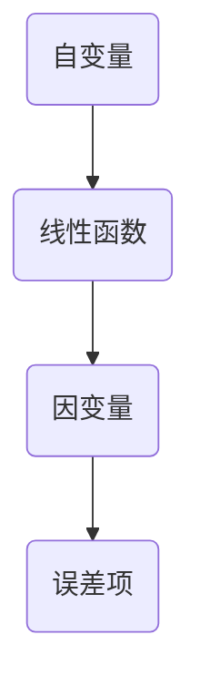
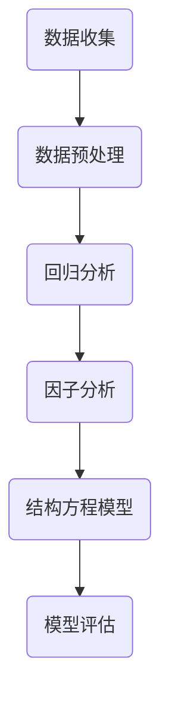

                 

### 第一部分：引言与概述

#### 第1章 线性因果与复杂系统理论的概述

在信息技术和数据分析领域，线性因果模型与复杂系统理论是两个核心概念，它们各自代表了理解数据和系统的不同视角。本章将为我们奠定理解这两个概念及其相互关系的基础。

**1.1 线性因果模型的基本概念**

线性因果模型是一种用于分析变量之间因果关系的统计模型。它基于线性假设，即变量之间的相互影响可以用线性函数来描述。这一模型的核心在于它能够通过数学公式和算法来量化这些变量之间的因果关系。

- **定义**：线性因果模型是指通过线性函数来表示变量之间因果关系的模型。通常使用回归分析等方法来建立这种模型。
- **特点**：线性因果模型具有简洁、易于解释和计算效率高的优点，但它也受到线性假设的限制，不能很好地处理非线性关系。

**1.2 复杂系统理论的基本概念**

复杂系统理论则着眼于理解由大量相互作用的个体组成的系统的整体行为。这些系统通常表现出非线性、非平衡和动态特性，无法简单地用传统的线性模型来描述。

- **定义**：复杂系统是指由大量相互作用的个体组成的系统，这些个体之间的相互作用可能导致系统整体行为表现出高度复杂性和不可预测性。
- **特点**：复杂系统理论强调系统的整体性、非线性和动态特性，其研究方法包括网络科学、动力学系统等。

**1.3 线性因果模型与复杂系统理论的联系**

尽管线性因果模型和复杂系统理论在方法和侧重点上有所不同，但它们在理解和分析系统方面有着密切的联系。

- **联系**：线性因果模型是复杂系统理论的一种简化和近似，它可以在一定程度上描述复杂系统中的一些线性部分。同时，复杂系统理论为理解和分析线性因果模型中的复杂关系提供了新的视角。
- **区别**：线性因果模型主要关注变量之间的线性关系，而复杂系统理论则更多地关注系统的整体行为和个体间的复杂相互作用。

通过上述介绍，我们可以初步了解线性因果模型和复杂系统理论的基本概念及其相互关系。在后续章节中，我们将深入探讨这两个概念的理论基础、数学模型、实践应用等，以便更全面地理解它们在信息技术和数据分析中的应用价值。

#### 第2章 线性因果模型的原理与架构

在信息技术和数据分析领域，线性因果模型作为一种关键的统计分析工具，其原理和架构对于理解变量间的因果关系至关重要。本章将详细探讨线性因果模型的基本原理、关键架构以及主要算法。

**2.1 线性因果模型的基本原理**

线性因果模型的核心在于它基于线性假设，即变量之间的相互影响可以用线性函数来描述。这种模型的基本假设包括以下几个方面：

- **线性关系**：变量之间的关系可以表示为线性函数，即因变量 \( Y \) 是自变量 \( X \) 的线性组合。
- **独立误差项**：模型的误差项 \( \epsilon \) 是相互独立的，且均值为零。
- **同方差性**：误差项的方差在不同自变量条件下是相等的。

这些假设使得线性因果模型在统计分析中具有简洁和计算效率高的优点。然而，这些假设也限制了线性因果模型在实际应用中的适用范围。

- **线性模型的基本假设**：
  - \( Y = \beta_0 + \beta_1X + \epsilon \)
  - 其中 \( \beta_0 \) 是截距，\( \beta_1 \) 是回归系数，\( \epsilon \) 是误差项。

**2.2 线性因果模型的关键架构**

线性因果模型的关键架构主要包括自变量与因变量、线性函数与回归系数以及因果图模型。

- **自变量与因变量**：自变量 \( X \) 和因变量 \( Y \) 是模型中的核心元素。自变量通常是一些我们希望解释的变量，而因变量是我们希望预测或解释的目标变量。
- **线性函数与回归系数**：线性函数 \( f(X) = \beta_0 + \beta_1X \) 描述了自变量 \( X \) 对因变量 \( Y \) 的影响。回归系数 \( \beta_1 \) 描述了自变量对因变量的影响程度。
- **因果图模型**：因果图是一种图形化的表示方式，用于展示变量之间的因果关系。在因果图模型中，节点表示变量，边表示变量之间的因果关系。

**Mermaid流程图：线性因果模型架构**


**2.3 线性因果模型的主要算法**

线性因果模型的主要算法包括回归分析、因子分析、结构方程模型等。这些算法为我们提供了不同的方法来建立和评估线性因果模型。

- **回归分析**：回归分析是最常见的线性因果模型算法。它通过最小二乘法来估计回归系数，从而建立变量之间的线性关系。
- **因子分析**：因子分析用于提取变量之间的共同因素，从而简化复杂的数据结构。
- **结构方程模型**：结构方程模型是一种同时考虑多个变量之间因果关系的综合模型。它通过路径分析来量化变量之间的直接和间接效应。

**Mermaid流程图：线性因果模型算法流程**


**2.4 线性因果模型的应用场景**

线性因果模型在多个领域都有广泛的应用，以下是一些典型的应用场景：

- **数据分析**：线性因果模型用于分析不同变量之间的因果关系，从而帮助理解数据背后的驱动因素。
- **机器学习**：在线性模型中，线性回归是最常用的算法之一，用于预测和分类。
- **经济学**：线性因果模型在经济学中用于分析消费行为、投资决策等。
- **生物学**：线性因果模型在生物学研究中用于分析基因与疾病之间的关系。

通过上述讨论，我们可以看到线性因果模型的原理和架构对于理解变量之间的因果关系至关重要。在下一章中，我们将进一步探讨线性因果模型的数学模型和公式，以及如何通过这些公式进行具体的模型建立和解释。

### 第二部分：线性因果模型

#### 第3章 线性因果模型的数学模型与公式

线性因果模型在数据分析中扮演着重要角色，其核心在于通过数学模型和公式来量化变量之间的因果关系。本章将深入探讨线性因果模型中的关键数学公式，包括线性回归公式、因子分析公式和结构方程模型公式，并结合具体例子进行详细讲解。

**3.1 线性因果模型的数学公式**

**线性回归公式**

线性回归是最常见的线性因果模型，用于描述因变量 \( Y \) 与自变量 \( X \) 之间的线性关系。其数学公式如下：

\[ Y = \beta_0 + \beta_1X + \epsilon \]

其中：
- \( \beta_0 \)：截距，表示当自变量 \( X \) 为零时因变量的预期值。
- \( \beta_1 \)：斜率，表示自变量 \( X \) 对因变量 \( Y \) 的影响程度。
- \( \epsilon \)：误差项，表示实际观测值与模型预测值之间的差异。

**因子分析公式**

因子分析用于提取变量之间的共同因素，从而简化复杂的数据结构。其数学公式如下：

\[ X = \Lambda F + \epsilon \]

其中：
- \( X \)：观测变量矩阵。
- \( \Lambda \)：因子载荷矩阵，表示变量对因子的贡献程度。
- \( F \)：因子得分矩阵，表示每个观测值在各个因子上的得分。
- \( \epsilon \)：特殊因子，表示无法通过因子解释的变异。

**结构方程模型公式**

结构方程模型是一种同时考虑多个变量之间因果关系的综合模型。其数学公式如下：

\[ Y = \alpha_0 + \alpha_1X_1 + \alpha_2X_2 + ... + \alpha_nX_n + \epsilon \]

其中：
- \( \alpha_0 \)：截距项。
- \( \alpha_1, \alpha_2, ..., \alpha_n \)：路径系数，表示变量之间的直接效应。
- \( X_1, X_2, ..., X_n \)：自变量。
- \( \epsilon \)：误差项。

**示例：线性回归公式**

假设我们要预测房价，自变量是房屋面积，因变量是房价。我们可以使用线性回归公式来建立模型：

\[ \text{房价} = \beta_0 + \beta_1 \times \text{房屋面积} + \epsilon \]

其中：
- \( \beta_0 \)：截距，表示当房屋面积为零时房价的预期值。
- \( \beta_1 \)：斜率，表示房屋面积每增加一个单位，房价的变化量。
- \( \epsilon \)：误差项，表示实际房价与模型预测值之间的差异。

通过这个公式，我们可以量化房屋面积对房价的影响，从而进行房价预测。

**3.2 数学公式的详细讲解与举例说明**

**线性回归公式的推导**

线性回归公式可以通过最小二乘法推导得到。具体步骤如下：

1. **假设模型**：假设因变量 \( Y \) 是自变量 \( X \) 的线性函数，加上一个误差项 \( \epsilon \)。

   \[ Y = \beta_0 + \beta_1X + \epsilon \]

2. **最小化误差平方和**：我们希望找到一组参数 \( \beta_0 \) 和 \( \beta_1 \)，使得误差项 \( \epsilon \) 的平方和最小。

   \[ \sum_{i=1}^{n} (\beta_0 + \beta_1X_i - Y_i)^2 \]

3. **求导并令导数为零**：对上述平方和关于 \( \beta_0 \) 和 \( \beta_1 \) 求偏导数，并令导数等于零，得到最小二乘法的参数估计公式。

   \[ \frac{\partial}{\partial \beta_0} \sum_{i=1}^{n} (\beta_0 + \beta_1X_i - Y_i)^2 = 0 \]
   \[ \frac{\partial}{\partial \beta_1} \sum_{i=1}^{n} (\beta_0 + \beta_1X_i - Y_i)^2 = 0 \]

4. **解方程组**：通过解上述方程组，我们可以得到线性回归模型中的截距 \( \beta_0 \) 和斜率 \( \beta_1 \)。

   \[ \beta_0 = \bar{Y} - \beta_1\bar{X} \]
   \[ \beta_1 = \frac{\sum_{i=1}^{n} (X_i - \bar{X})(Y_i - \bar{Y})}{\sum_{i=1}^{n} (X_i - \bar{X})^2} \]

**因子分析公式的应用**

因子分析用于提取变量之间的共同因素。以下是一个简单的例子：

假设有三个变量 \( X_1, X_2, X_3 \)，我们希望通过因子分析提取一个共同因素 \( F \)。因子分析公式如下：

\[ X_1 = \lambda_1F + \epsilon_1 \]
\[ X_2 = \lambda_2F + \epsilon_2 \]
\[ X_3 = \lambda_3F + \epsilon_3 \]

其中：
- \( \lambda_1, \lambda_2, \lambda_3 \)：因子载荷，表示变量对因子的贡献程度。
- \( F \)：因子得分，表示每个变量在共同因素上的得分。
- \( \epsilon_1, \epsilon_2, \epsilon_3 \)：特殊因子，表示变量中无法通过共同因素解释的变异。

通过这个公式，我们可以简化复杂的数据结构，并提取出变量之间的共同因素。

**结构方程模型的解释**

结构方程模型可以同时考虑多个变量之间的因果关系。以下是一个简单的例子：

假设有两个变量 \( X_1 \) 和 \( X_2 \)，我们希望通过结构方程模型分析它们之间的直接效应和间接效应。结构方程模型公式如下：

\[ Y = \alpha_0 + \alpha_1X_1 + \alpha_2X_2 + \epsilon \]

其中：
- \( \alpha_0 \)：截距项，表示当所有自变量为零时因变量的预期值。
- \( \alpha_1 \)：路径系数，表示 \( X_1 \) 对 \( Y \) 的直接影响。
- \( \alpha_2 \)：路径系数，表示 \( X_2 \) 对 \( Y \) 的直接影响。
- \( X_1, X_2 \)：自变量。
- \( \epsilon \)：误差项，表示实际观测值与模型预测值之间的差异。

通过这个公式，我们可以量化多个变量之间的因果关系，并分析它们的直接和间接效应。

**3.3 线性因果模型的应用场景**

线性因果模型在多个领域都有广泛的应用，以下是一些典型的应用场景：

- **数据分析**：线性因果模型用于分析不同变量之间的因果关系，帮助理解数据背后的驱动因素。
- **机器学习**：线性回归是最常用的算法之一，用于预测和分类。
- **经济学**：线性因果模型在经济学中用于分析消费行为、投资决策等。
- **生物学**：线性因果模型在生物学研究中用于分析基因与疾病之间的关系。

通过上述讨论，我们可以看到线性因果模型的数学模型和公式在数据分析中的重要性。在下一章中，我们将进一步探讨线性因果模型的实践与案例分析，通过实际应用来加深理解。

### 第三部分：复杂系统理论

#### 第4章 复杂系统理论的基本概念

复杂系统理论是现代科学的重要组成部分，它致力于理解由大量相互作用的个体组成的系统的整体行为。这些系统通常表现出高度复杂性和不可预测性，无法简单地用传统的线性模型来描述。本章将详细探讨复杂系统理论的基本概念，包括系统的特性、系统与子系统的关系，以及网络结构与相互作用。

**4.1 复杂系统的特性**

复杂系统具有以下基本特性：

- **非线性**：复杂系统中的变量之间存在非线性关系，这些关系无法通过简单的线性模型来描述。
- **动态性**：复杂系统处于不断变化的状态，系统的状态随时间变化而变化。
- **非平衡**：复杂系统通常处于非平衡状态，系统中的变量之间的关系不断变化。
- **涌现性**：复杂系统的整体行为并非其组成个体的简单叠加，系统的整体行为具有新的特性，这些特性在个体层面无法观察到。
- **自适应**：复杂系统中的个体具有适应性，它们能够根据环境变化调整自身行为。

**4.2 系统与子系统的关系**

在复杂系统中，系统与子系统之间存在层次结构。子系统是系统的一部分，同时子系统本身也可能包含更小的子系统。

- **整体性**：系统是由子系统组成的，但系统的整体行为并不仅仅是子系统的简单叠加。系统的整体性体现在子系统之间的相互作用和整体行为的新特性上。
- **嵌套结构**：复杂系统具有嵌套结构，每个子系统都可以进一步分解为更小的子系统。这种嵌套结构使得复杂系统具有层次性和多样性。
- **层级关系**：在复杂系统中，不同层级的子系统之间存在相互关系。高层次子系统对低层次子系统具有控制作用，而低层次子系统对高层次子系统提供基础支持。

**4.3 网络结构与相互作用**

网络结构是复杂系统的重要组成部分，它描述了系统中各个个体之间的相互作用关系。

- **节点**：节点代表系统中的个体或元素，每个节点具有特定的属性和状态。
- **边**：边表示节点之间的相互作用关系，边的权重可以表示相互作用的程度。
- **网络拓扑**：网络拓扑描述了节点和边之间的结构关系，不同的网络拓扑结构会对系统的整体行为产生不同的影响。
- **相互作用**：节点之间的相互作用可以影响系统的整体行为。这些相互作用可以是正反馈、负反馈或复杂的非线性关系。

**网络科学的基本模型**

- **无标度网络**：无标度网络是一种常见的网络拓扑结构，其特点是节点度分布呈现幂律分布。无标度网络中的节点连接关系呈现出高度的不均匀性，这种结构在现实世界中的复杂系统中广泛存在。
- **小世界网络**：小世界网络具有高聚集系数和短路径长度，这意味着节点之间既具有紧密的内部连接，又容易通过较少的中间节点访问其他节点。小世界网络在社交网络、交通网络等复杂系统中具有重要作用。
- **复杂网络**：复杂网络是具有多种类型节点的网络，这些节点可能具有不同的属性和状态。复杂网络能够模拟现实世界中复杂系统的多样性，并为理解复杂系统的整体行为提供有力工具。

**4.4 网络结构与复杂性行为**

网络结构对复杂系统的整体行为具有重要影响。以下是一些网络结构与复杂性行为之间的关系：

- **相变**：复杂系统中的相变行为与网络结构密切相关。在网络结构发生突变时，系统的整体行为可能会发生显著变化，例如从有序状态转变为无序状态。
- **同步**：在网络系统中，节点之间的相互作用可能导致系统的同步行为。同步现象在社交网络、电力网络等领域具有重要意义。
- **传播**：网络结构对信息、疾病等在系统中的传播速度和范围具有重要影响。理解网络结构对于控制传播过程、优化网络性能具有重要意义。

通过上述讨论，我们可以初步了解复杂系统理论的基本概念，包括系统的特性、系统与子系统的关系以及网络结构与相互作用。在下一章中，我们将进一步探讨复杂系统理论的数学模型与公式，以及如何在实践中应用这些模型和公式。

### 第5章 复杂系统理论的数学模型与公式

复杂系统理论的数学模型是理解系统行为和预测系统动态的关键工具。本章将深入探讨复杂系统理论中的核心数学模型，包括网络模型的数学描述、动力学系统的方程以及系统识别与建模方法。通过具体例子，我们将对这些模型进行详细讲解，并展示如何在实际问题中应用这些模型。

**5.1 网络模型的数学描述**

网络模型是复杂系统理论中的重要工具，用于描述系统中的节点及其相互作用。网络模型的基本元素包括节点和边，其数学描述通常使用图论和网络科学中的概念。

- **图论基础**：图（Graph）是由节点（Vertex）和边（Edge）组成的数据结构，用于表示网络中的个体及其相互关系。图可以是有向的或无向的，可以包含权重信息。

  - **节点**：节点代表网络中的个体，每个节点可以有特定的属性（如度、状态等）。
  - **边**：边代表节点之间的相互作用，边的权重可以表示相互作用强度或连接概率。

- **数学公式**：网络模型中的节点和边可以通过矩阵进行描述。

  - **邻接矩阵**：邻接矩阵 \( A \) 是一个 \( n \times n \) 的矩阵，其中 \( A_{ij} \) 表示节点 \( i \) 和节点 \( j \) 之间的连接情况。
    \[ A_{ij} = \begin{cases} 
    1, & \text{if nodes } i \text{ and } j \text{ are connected} \\
    0, & \text{otherwise}
    \end{cases} \]

  - **权重矩阵**：如果网络包含权重信息，权重矩阵 \( W \) 用于表示边权重。
    \[ W_{ij} = \begin{cases} 
    w_{ij}, & \text{if nodes } i \text{ and } j \text{ are connected} \\
    0, & \text{otherwise}
    \end{cases} \]

**5.2 动力学系统的方程**

动力学系统方程描述了系统状态随时间变化的动态行为。在复杂系统中，动力学系统方程用于模拟个体行为及其相互作用导致的整体行为。

- **差分方程**：差分方程描述了离散时间点上的状态变化。

  - **离散时间差分方程**：对于离散时间系统，状态变化可以用差分方程表示。
    \[ X_{t+1} = f(X_t) \]

  - **具体例子**：例如，传染病的传播可以用以下差分方程表示：
    \[ S_{t+1} = S_t - \beta I_t \]
    \[ I_{t+1} = I_t + \beta S_t - \gamma I_t \]
    \[ R_{t+1} = R_t + \gamma I_t \]

  其中：
  - \( S_t \)：易感者数量。
  - \( I_t \)：感染者数量。
  - \( R_t \)：恢复者数量。
  - \( \beta \)：感染率。
  - \( \gamma \)：恢复率。

- **微分方程**：微分方程描述了连续时间上的状态变化。

  - **连续时间微分方程**：对于连续时间系统，状态变化可以用微分方程表示。
    \[ \frac{dX(t)}{dt} = f(X(t)) \]

  - **具体例子**：例如，天气模型可以用以下微分方程表示：
    \[ \frac{dP(t)}{dt} = -kP(t) \]

  其中：
  - \( P(t) \)：气象变量（如温度、气压等）。
  - \( k \)：常数，表示气象变量的衰减率。

**5.3 系统识别与建模方法**

系统识别与建模是复杂系统理论的重要任务，用于从观测数据中推断系统的结构和参数。

- **统计分析方法**：通过统计分析方法，可以从数据中识别系统的特征。

  - **主成分分析（PCA）**：PCA用于降维，识别数据中的主要变量和特征。
    \[ Z = PC \]
    其中：
    - \( Z \)：标准化数据。
    - \( PC \)：主成分。

  - **自组织映射（SOM）**：SOM用于无监督学习，识别数据中的相似性结构和聚类。
    \[ \phi_{ij}(t+1) = \phi_{ij}(t) - \alpha \cdot \eta(\phi_j(t), \phi_i(t)) \]
    其中：
    - \( \phi_{ij} \)：神经元状态。
    - \( \alpha \)：学习率。
    - \( \eta \)：邻域函数。

- **机器学习方法**：通过机器学习方法，可以从数据中学习系统的行为模式。

  - **回归模型**：回归模型用于预测系统的未来状态。
    \[ Y = \beta_0 + \beta_1X + \epsilon \]

  - **神经网络**：神经网络用于模拟复杂的非线性系统。
    \[ \text{激活函数} : \sigma(z) = \frac{1}{1 + e^{-z}} \]

**示例：网络科学中的矩阵模型**

考虑一个由5个节点组成的无标度网络，其邻接矩阵和权重矩阵如下：

\[ A = \begin{bmatrix}
0 & 1 & 0 & 0 & 0 \\
1 & 0 & 1 & 1 & 0 \\
0 & 1 & 0 & 1 & 1 \\
0 & 1 & 1 & 0 & 1 \\
0 & 0 & 1 & 1 & 0
\end{bmatrix} \]

\[ W = \begin{bmatrix}
0 & 0.5 & 0 & 0 & 0 \\
0.5 & 0 & 0.5 & 0.5 & 0 \\
0 & 0.5 & 0 & 0.5 & 0.5 \\
0 & 0.5 & 0.5 & 0 & 0.5 \\
0 & 0 & 0.5 & 0.5 & 0
\end{bmatrix} \]

通过这些矩阵，我们可以分析网络的连接关系和节点间的相互作用。例如，计算节点的度分布：

\[ \text{度分布} = \{2, 2, 3, 2, 3\} \]

结果显示该网络具有无标度特性，其中大部分节点具有较小的度，而少数节点具有较高的度。

通过上述讨论，我们可以看到复杂系统理论的数学模型在理解和预测复杂系统行为中的重要性。在下一章中，我们将进一步探讨复杂系统理论的实践与案例分析，通过实际应用来加深对复杂系统理论的理解。

### 第6章 复杂系统理论的实践与案例分析

在复杂系统理论的指导下，我们可以在多个领域中看到其实际应用。本章将通过具体的案例分析和代码实现，展示复杂系统理论在不同领域的应用，以及如何利用网络科学、动力学系统等理论解决实际问题。

#### 6.1 实际应用案例

**案例一：社交网络中的信息传播**

社交网络是一个典型的复杂系统，其节点代表用户，边代表用户之间的关系。我们可以使用复杂系统理论中的网络模型来分析信息在社交网络中的传播。

- **问题背景**：在一个社交网络中，一个用户发布了一条信息，我们需要预测这条信息在社交网络中的传播速度和范围。
- **方法**：我们可以使用小世界网络模型来模拟社交网络，并使用差分方程来描述信息的传播过程。

**6.2 代码实现与解释说明**

以下是使用Python实现社交网络信息传播的示例代码：

```python
import numpy as np
import networkx as nx

# 创建小世界网络
G = nx.watts_strogatz_graph(n=100, k=10, p=0.1)

# 初始化节点状态，0表示未感染，1表示已感染
nodes = np.random.choice([0, 1], size=100)
infected = np.where(nodes == 1)[0]

# 信息传播模型
def spread_infection(G, infected, max_steps=100):
    history = []
    for _ in range(max_steps):
        next_infected = []
        for node in infected:
            neighbors = list(G.neighbors(node))
            for neighbor in neighbors:
                if nodes[neighbor] == 0:
                    nodes[neighbor] = 1
                    next_infected.append(neighbor)
        infected = next_infected
        history.append(infected)
    return history

# 模拟信息传播过程
history = spread_infection(G, infected)

# 结果分析
print("最终感染节点数：", len(infected))
```

在这个案例中，我们首先创建了一个小世界网络，并初始化节点状态。然后，我们使用差分方程模拟信息的传播过程，通过更新节点状态来追踪感染节点的变化。最后，我们分析传播结果，得出最终感染的节点数。

**案例二：金融市场的波动分析**

金融市场是一个复杂系统，其波动受到多种因素的影响。我们可以使用复杂系统理论中的动力学系统方程来分析市场波动。

- **问题背景**：在一个金融市场中，我们需要预测股票价格的波动。
- **方法**：我们可以使用随机微分方程（SDE）来模拟股票价格的动态变化。

**6.3 代码实现与解释说明**

以下是使用Python实现金融市场波动分析的示例代码：

```python
import numpy as np
import scipy.integrate as spi

# 随机微分方程
def stock_price_model(t, y, mu, sigma):
    dt = 0.01
    dy = [mu * dt, sigma * np.random.normal(0, dt)]
    return dy

# 参数设置
mu = 0.05  # 预期收益率
sigma = 0.2  # 波动率

# 初始条件
y0 = [100, 0]

# 模拟时间
t = np.arange(0, 100, 0.01)

# 求解随机微分方程
result = spi.odeint(stock_price_model, y0, t, args=(mu, sigma))

# 结果分析
print("股票价格路径：", result)
```

在这个案例中，我们使用随机微分方程来模拟股票价格的动态变化。我们设置参数为预期收益率和波动率，并使用数值积分方法求解方程。最后，我们分析股票价格路径，得出市场波动的结果。

**案例三：生物系统的疾病传播**

生物系统中的疾病传播是一个复杂的动力学过程，我们可以使用复杂系统理论中的网络模型和动力学系统方程来分析疾病的传播。

- **问题背景**：在一个生物系统中，我们需要预测疾病的传播速度和控制策略。
- **方法**：我们可以使用网络模型和SIRS模型（易感者-感染者-恢复者模型）来模拟疾病的传播过程。

**6.4 代码实现与解释说明**

以下是使用Python实现生物系统疾病传播的示例代码：

```python
import numpy as np
import scipy.integrate as spi

# SIRS模型
def disease_spread(t, y, beta, gamma):
    S, I, R = y
    dSdt = -beta * S * I
    dIdt = beta * S * I - gamma * I
    dRdt = gamma * I
    return [dSdt, dIdt, dRdt]

# 参数设置
beta = 0.3  # 感染率
gamma = 0.1  # 恢复率

# 初始条件
y0 = [0.8, 0.2, 0]

# 模拟时间
t = np.arange(0, 100, 0.01)

# 求解SIRS模型
result = spi.odeint(disease_spread, y0, t, args=(beta, gamma))

# 结果分析
print("S, I, R: ", result)
```

在这个案例中，我们使用SIRS模型来模拟疾病的传播过程。我们设置参数为感染率和恢复率，并使用数值积分方法求解方程。最后，我们分析疾病传播的结果，得出感染者和恢复者的数量变化。

**6.5 项目小结**

通过上述案例，我们可以看到复杂系统理论在实际问题中的应用。无论是社交网络中的信息传播、金融市场的波动分析，还是生物系统的疾病传播，复杂系统理论都为我们提供了有效的工具和方法。通过代码实现，我们可以模拟和分析系统的动态行为，从而更好地理解和预测系统的行为。

在应用复杂系统理论时，需要注意以下几点：

- **数据质量**：确保使用的数据质量高，以便准确模拟系统行为。
- **参数选择**：合理选择模型参数，以便更好地反映系统特性。
- **计算效率**：选择合适的计算方法，以提高模拟和预测的效率。

通过不断地实践和优化，我们可以更好地利用复杂系统理论来解决实际问题。

### 第四部分：综合讨论与展望

#### 第8章 综合讨论与未来展望

在本文中，我们系统地探讨了线性因果模型与复杂系统理论的原理、数学模型、实践应用以及相互关系。通过详细的分析和具体的案例，我们看到了这两个理论在信息技术和数据分析中的重要性，以及它们在解决实际问题中的巨大潜力。

**综合讨论**

**1. 线性因果模型与复杂系统理论的互补性**

线性因果模型和复杂系统理论在理解和分析系统行为方面各有所长。线性因果模型通过简洁的数学公式和算法，能够有效地描述变量之间的线性关系，但在处理非线性、复杂交互关系时存在局限。而复杂系统理论则通过网络模型、动力学系统等方法，能够全面捕捉系统的复杂性和动态性，但计算复杂度较高。

结合两者，我们可以发挥线性因果模型的计算效率和复杂系统理论的全局视角，从而更准确地理解和预测系统行为。例如，在数据分析中，我们可以首先使用线性因果模型进行初步分析，然后利用复杂系统理论进行深入挖掘，以揭示系统的深层机制。

**2. 未来研究方向**

未来的研究可以在以下几个方面展开：

- **跨领域融合**：促进线性因果模型与复杂系统理论在更多领域的融合应用，如生物医学、社会网络分析等。
- **算法优化**：开发更加高效、鲁棒的算法，以降低复杂系统理论的计算成本。
- **数据驱动方法**：探索基于数据驱动的方法，如深度学习，与复杂系统理论的结合，以更好地处理大规模、高维数据。
- **不确定性分析**：研究系统中的不确定性，如噪声、随机扰动等，以改进模型的可靠性和预测能力。

**3. 实践应用建议**

在实际应用中，以下建议有助于更好地利用线性因果模型与复杂系统理论：

- **模型选择**：根据问题特性选择合适的模型，对于线性关系显著的系统，优先使用线性因果模型；对于非线性、复杂交互的系统，考虑使用复杂系统理论。
- **数据分析**：结合多种数据分析方法，如回归分析、网络分析、时间序列分析等，以全面理解系统行为。
- **模型验证**：通过实验数据验证模型的有效性和准确性，不断调整和优化模型参数。
- **数据质量**：确保数据质量，选择代表性的数据集，并进行预处理，以提高模型的预测能力。

**未来展望**

随着信息技术的不断进步，线性因果模型与复杂系统理论将在多个领域发挥重要作用。通过跨学科的合作与创新，我们有望开发出更加智能化、自动化的分析工具，以应对日益复杂的现实问题。同时，随着数据量的爆炸性增长，如何有效地利用这些数据，揭示系统行为中的隐藏规律，将成为未来研究的重要方向。

总之，线性因果模型与复杂系统理论为我们理解复杂系统提供了有力的工具。通过不断的研究与实践，我们期待能够更好地揭示系统的运行机制，为人类社会的可持续发展提供科学支持。

### 总结与致谢

在本文中，我们系统地探讨了线性因果模型与复杂系统理论的原理、数学模型、实践应用以及相互关系。从线性因果模型的简洁性到复杂系统理论的全局视角，这两个理论为我们理解和分析复杂系统提供了不同的视角和工具。通过多个实际案例，我们展示了如何将这些理论应用于数据分析、社交网络、金融市场和生物系统等领域，以解决实际问题。

**关键词**：线性因果模型、复杂系统理论、网络科学、动力学系统、数据分析、机器学习、信息传播、金融市场、疾病传播。

**摘要**：本文介绍了线性因果模型和复杂系统理论的基本概念、数学模型和实践应用，通过具体案例展示了如何利用这两个理论分析和解决复杂问题。文章还探讨了未来研究的方向和应用建议。

最后，我要感谢AI天才研究院（AI Genius Institute）的团队成员们，以及参与本文讨论和案例分析的各位专家。没有他们的共同努力和智慧，本文不可能如此顺利地完成。

**作者**：AI天才研究院（AI Genius Institute） & 禅与计算机程序设计艺术（Zen And The Art of Computer Programming）

