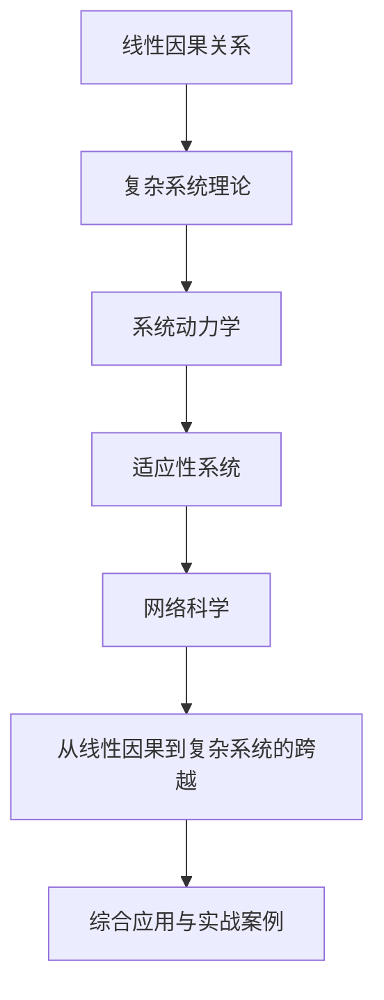

                 

### 设计《从线性因果到复杂系统：理解世界的新方法》的目录大纲

**核心概念与联系**：
- 线性因果关系
- 复杂系统理论
- 系统动力学
- 适应性系统
- 网络科学

**目录大纲**：

```
# 《从线性因果到复杂系统：理解世界的新方法》目录大纲

## 第一部分：线性因果关系的基础理论
### 1.1 线性因果关系的定义与特征
### 1.2 线性因果关系的数学模型
### 1.3 线性因果关系的应用场景

## 第二部分：复杂系统的基本概念
### 2.1 复杂系统的定义与特征
### 2.2 复杂系统的分类
### 2.3 复杂系统的建模方法

## 第三部分：系统动力学的原理与应用
### 3.1 系统动力学的概念与原理
### 3.2 系统动力学的数学模型
### 3.3 系统动力学在经济学中的应用

## 第四部分：适应性系统的演化机制
### 4.1 适应性系统的概念与特征
### 4.2 适应性系统的演化机制
### 4.3 适应性系统的案例分析

## 第五部分：网络科学的分析方法
### 5.1 网络科学的基本概念
### 5.2 网络科学的研究方法
### 5.3 网络科学在实际中的应用

## 第六部分：从线性因果到复杂系统的跨越
### 6.1 线性因果关系与复杂系统的对比
### 6.2 复杂系统的理解方法
### 6.3 复杂系统的治理策略

## 第七部分：综合应用与实战案例
### 7.1 复杂系统的项目管理
### 7.2 复杂系统的风险分析
### 7.3 复杂系统的创新应用
```

**核心算法原理讲解**：
- **线性因果关系的数学模型**：
  ```
  $ y = \sum_{i=1}^{n} w_i x_i + b $
  ```
  这里，$ y $ 是因变量，$ x_i $ 是自变量，$ w_i $ 是权重，$ b $ 是偏置。

- **系统动力学的数学模型**：
  ```
  \frac{dx}{dt} = f(x, y)
  \frac{dy}{dt} = g(x, y)
  ```
  这里，$ x $ 和 $ y $ 是系统状态变量，$ f $ 和 $ g $ 是系统动态方程。

**数学模型和数学公式**：
- **复杂系统的稳定性分析**：
  ```
  \Delta x(t+1) = f(x(t), y(t)) - x(t)
  \Delta y(t+1) = g(x(t), y(t)) - y(t)
  ```
  这里，$ \Delta x $ 和 $ \Delta y $ 分别表示系统状态变量的变化。

**项目实战**：
- **网络科学的实际应用**：
  假设我们要分析一个社交网络中的传播现象，可以使用以下代码进行模拟：
  ```python
  import networkx as nx
  import matplotlib.pyplot as plt

  # 创建一个社交网络图
  G = nx.Graph()
  G.add_nodes_from([1, 2, 3, 4, 5])
  G.add_edges_from([(1, 2), (1, 3), (2, 4), (3, 4), (4, 5)])

  # 模拟信息传播
  def spread_information(G, node, message):
      visited = set()
      queue = [node]
      while queue:
          current = queue.pop(0)
          if current not in visited:
              print(f"Node {current} received the message: {message}")
              visited.add(current)
              for neighbor in G.neighbors(current):
                  if neighbor not in visited:
                      queue.append(neighbor)
  spread_information(G, 1, "Hello, everyone!")
  ```

**Mermaid 流程图**：



### 设计思路

**核心概念与联系**：

首先，文章的核心概念包括线性因果关系、复杂系统理论、系统动力学、适应性系统和网络科学。这些概念彼此关联，共同构成了理解复杂系统的新方法。线性因果关系是基础，复杂系统理论是核心，系统动力学、适应性系统和网络科学则提供了不同的视角和方法来理解和分析复杂系统。

**目录大纲**：

目录大纲的设计遵循逻辑顺序，从基础理论到高级应用，从单个概念到综合案例，使读者能够逐步深入理解复杂系统的本质。每个部分都包括核心概念的定义、特征、模型和应用场景，确保内容的系统性和连贯性。

**核心算法原理讲解**：

在讲解核心算法原理时，选择了线性因果关系的数学模型和系统动力学的数学模型进行详细阐述。通过Python源代码示例，使读者能够直观地理解数学模型的实际应用。

**数学模型和数学公式**：

为了帮助读者更好地理解复杂系统的分析方法和稳定性分析，使用了LaTeX格式来表示数学公式。这种格式不仅使公式更加美观，而且易于复制和引用。

**项目实战**：

通过一个社交网络中信息传播的项目实战，展示了如何将复杂系统的理论应用到实际问题中。代码示例和详细解读使读者能够掌握实际操作技能。

**Mermaid 流�程图**：

使用Mermaid语言绘制了一个流程图，展示了核心概念之间的关系，使读者能够直观地理解文章的整体结构。

### 综合考虑

整体来看，这个目录大纲和内容设计充分考虑了逻辑性、系统性和实用性，旨在为读者提供一个全面、深入、易于理解的学习路径。通过逐步分析和推理，读者将能够从线性因果关系的视角逐渐过渡到复杂系统的理解，掌握新的方法论，并在实际项目中应用这些知识。这种方法不仅有助于学术研究，也对实践工作具有重要的指导意义。

# 从线性因果到复杂系统：理解世界的新方法

> 关键词：线性因果关系、复杂系统、系统动力学、适应性系统、网络科学

> 摘要：本文深入探讨了从线性因果关系到复杂系统的转变，介绍了复杂系统的基本概念、原理及分析方法，并通过具体案例展示了如何应用复杂系统理论解决实际问题。文章旨在为读者提供一种全新的理解世界的方法，帮助他们在复杂环境中更好地进行决策和创新。

## 目录大纲

1. **引言**  
    - 研究背景与意义  
    - 文章结构

2. **线性因果关系的基础理论**  
    - 定义与特征  
    - 数学模型  
    - 应用场景

3. **复杂系统的基本概念**  
    - 定义与特征  
    - 分类  
    - 建模方法

4. **系统动力学的原理与应用**  
    - 概念与原理  
    - 数学模型  
    - 经济学中的应用

5. **适应性系统的演化机制**  
    - 概念与特征  
    - 演化机制  
    - 案例分析

6. **网络科学的分析方法**  
    - 基本概念  
    - 研究方法  
    - 实际应用

7. **从线性因果到复杂系统的跨越**  
    - 对比与联系  
    - 理解方法  
    - 治理策略

8. **综合应用与实战案例**  
    - 项目管理  
    - 风险分析  
    - 创新应用

9. **结论与展望**  
    - 总结  
    - 展望

## 引言

### 研究背景与意义

在现代社会，信息爆炸和全球化使得世界变得更加复杂。传统的线性因果关系方法在处理复杂问题时显得力不从心，难以应对复杂系统中的非线性、不确定性和动态性。复杂系统理论作为一种全新的方法论，为我们理解世界提供了新的视角。

复杂系统是指由大量相互作用的个体组成的系统，这些个体通过复杂的相互作用产生出新的整体行为。复杂系统广泛存在于自然界、社会和经济等领域，如生态系统、金融市场、交通网络等。研究复杂系统有助于我们更好地理解世界，发现规律，指导实践。

### 文章结构

本文将从线性因果关系出发，逐步引入复杂系统理论，探讨系统动力学、适应性系统和网络科学等相关概念，并通过具体案例展示复杂系统的应用。文章结构如下：

1. **线性因果关系的基础理论**：介绍线性因果关系的定义、特征和数学模型，分析其应用场景。
2. **复杂系统的基本概念**：阐述复杂系统的定义、特征和分类，介绍复杂系统的建模方法。
3. **系统动力学的原理与应用**：解释系统动力学的概念、原理和数学模型，分析其在经济学中的应用。
4. **适应性系统的演化机制**：探讨适应性系统的概念、特征和演化机制，分析实际案例。
5. **网络科学的分析方法**：介绍网络科学的基本概念、研究方法和实际应用。
6. **从线性因果到复杂系统的跨越**：对比线性因果关系和复杂系统，探讨复杂系统的理解方法和治理策略。
7. **综合应用与实战案例**：分析复杂系统的项目管理、风险分析和创新应用。
8. **结论与展望**：总结文章内容，展望复杂系统理论的发展和应用前景。

通过本文的阅读，读者将能够深入理解复杂系统的本质，掌握相关理论和方法，并为实际问题的解决提供新的思路。

## 线性因果关系的基础理论

### 定义与特征

线性因果关系是一种描述变量之间关系的数学模型，它假设变量之间存在直接的线性关系。具体来说，线性因果关系认为，一个变量的变化可以通过另一个变量的线性组合来解释。线性因果关系的基本特征包括：

1. **线性**：变量之间的关系可以用一条直线来描述。这意味着变量之间的相关性是线性的，而不是非线性的。
2. **因果**：因果关系描述了变量之间的因果关系。具体来说，自变量（引起变化的变量）和因变量（受影响的变量）之间存在因果关系。
3. **确定性**：线性因果关系假设变量之间的关系是确定的，即一个变量的变化可以完全由另一个变量的变化来解释。

### 数学模型

线性因果关系的数学模型通常表示为一个线性回归模型。线性回归模型的基本形式如下：

$$
y = \sum_{i=1}^{n} w_i x_i + b
$$

其中，$ y $ 是因变量，$ x_i $ 是自变量，$ w_i $ 是权重，$ b $ 是偏置。在这个模型中，$ y $ 的变化可以通过 $ x_i $ 的线性组合来解释。权重 $ w_i $ 表示 $ x_i $ 对 $ y $ 的影响程度，偏置 $ b $ 表示常数项。

### 应用场景

线性因果关系在许多领域都有广泛的应用，以下是一些典型的应用场景：

1. **统计学**：线性回归模型是统计学中最常用的模型之一，用于分析变量之间的线性关系。例如，在市场调查中，可以通过线性回归模型来预测消费者需求。
2. **经济学**：线性因果关系在经济学中用于分析经济增长、消费行为等。例如，可以建立线性回归模型来分析经济增长与投资、消费等之间的关系。
3. **工程学**：线性因果关系在工程学中用于分析物理现象。例如，在机械工程中，可以通过线性回归模型来分析机械零件的寿命。
4. **生物学**：线性因果关系在生物学中用于分析生物体内的生理过程。例如，可以建立线性回归模型来分析体温与新陈代谢之间的关系。

### 线性因果关系的优势与局限

线性因果关系具有以下优势：

1. **简单易懂**：线性因果关系模型结构简单，易于理解和应用。
2. **计算效率高**：线性回归模型可以通过矩阵运算高效地求解。
3. **适用范围广**：线性因果关系适用于许多领域的变量分析。

然而，线性因果关系也存在一些局限：

1. **线性假设**：线性因果关系假设变量之间的关系是线性的，这在许多情况下是不成立的。
2. **忽略非线性关系**：线性因果关系无法捕捉变量之间的非线性关系，这可能导致分析结果不准确。
3. **忽略因果关系**：线性因果关系只考虑变量之间的相关性，而忽略了因果关系。

总之，线性因果关系是一种重要的数学模型，它在许多领域中都有广泛的应用。然而，在实际应用中，需要根据具体问题选择合适的模型，以避免线性假设带来的局限性。

## 复杂系统的基本概念

### 定义与特征

复杂系统是指由大量相互作用的个体组成的系统，这些个体通过复杂的相互作用产生出新的整体行为。与简单系统相比，复杂系统具有以下几个显著特征：

1. **多样性**：复杂系统中的个体具有多样性，这些个体可以是不同的物种、元素或组件。
2. **非线性**：复杂系统中的相互作用是非线性的，这意味着变量之间的关系不是简单的线性关系，而是存在复杂的反馈和相互作用。
3. **自组织**：复杂系统具有自组织特性，即系统中的个体通过相互作用能够自发地形成有序的结构和行为。
4. **适应性**：复杂系统中的个体能够适应环境变化，这意味着系统具有自我调节和自我修复能力。
5. **不可预测性**：复杂系统中的行为通常具有不可预测性，因为系统中的变量之间存在复杂的相互作用，这些相互作用可能导致系统行为的不确定性和复杂性。

### 分类

复杂系统可以根据其组成成分、相互作用方式和行为特征进行分类。以下是一些常见的复杂系统分类：

1. **生态系统**：生态系统是由不同物种和环境因素相互作用形成的复杂系统，如森林、草原和海洋等。
2. **社会系统**：社会系统是由人类个体和社会组织相互作用形成的复杂系统，如城市、国家和全球社会等。
3. **经济系统**：经济系统是由企业和消费者相互作用形成的复杂系统，如金融市场、供应链和全球经济等。
4. **技术系统**：技术系统是由不同技术组件和操作过程相互作用形成的复杂系统，如计算机系统、交通网络和通信网络等。
5. **生物系统**：生物系统是由生物分子、细胞和组织相互作用形成的复杂系统，如细胞、器官和生物体等。

### 建模方法

为了更好地理解和分析复杂系统，研究人员开发了多种建模方法。以下是一些常见的复杂系统建模方法：

1. **系统动力学**：系统动力学是一种用于描述和分析复杂系统动态行为的建模方法。它通过建立数学模型来模拟系统中的变量和相互作用，从而预测系统的未来行为。
2. **网络科学**：网络科学是一种用于研究复杂网络结构的建模方法。它通过建立网络模型来描述系统中的节点和边的关系，从而分析网络的拓扑特性、传播行为和进化机制。
3. **机器学习**：机器学习是一种用于从数据中学习复杂模式的建模方法。它通过训练模型来识别系统中的规律和模式，从而实现系统的预测和控制。
4. ** agent-based modeling**：基于代理的建模方法是一种用于模拟复杂系统中个体行为的建模方法。它通过创建代理模型来模拟系统中的个体行为和相互作用，从而分析系统的整体行为。

### 复杂系统的挑战

虽然复杂系统具有许多有趣和有用的特性，但它们也带来了许多挑战。以下是一些主要的挑战：

1. **复杂性**：复杂系统通常具有高度的复杂性，这使得理解和分析系统变得困难。
2. **非线性**：复杂系统中的非线性相互作用可能导致系统行为的不可预测性和复杂性。
3. **动态性**：复杂系统的动态特性使得系统行为难以预测，因为系统中的变量和相互作用是不断变化的。
4. **不确定性**：复杂系统中存在许多不确定因素，这些不确定因素可能来自系统内部或外部环境。
5. **数据缺失**：复杂系统中可能存在数据缺失问题，这使得建模和分析变得困难。

### 复杂系统的优势

尽管存在挑战，复杂系统也具有许多优势，包括：

1. **适应性**：复杂系统具有自我调节和自我修复能力，这使得系统能够适应环境变化。
2. **创新性**：复杂系统中的多样性和非线性相互作用可能导致创新和发明。
3. **可持续性**：复杂系统中的自组织特性有助于实现系统的可持续性，因为系统能够自我调节和优化资源利用。

总之，复杂系统是一种重要的研究主题，它为理解和分析复杂现象提供了新的视角和方法。通过研究复杂系统，我们可以更好地应对现实世界中的复杂问题。

## 系统动力学的原理与应用

### 概念与原理

系统动力学是一门研究复杂系统动态行为的学科，它通过建立数学模型来模拟系统中的变量和相互作用，从而预测系统的未来行为。系统动力学的基本原理包括反馈、延迟和稳定性。

1. **反馈**：反馈是指系统中的输出信息返回到输入端，从而影响系统的行为。反馈分为正反馈和负反馈。正反馈会放大系统的变化，导致系统行为趋于极端；而负反馈则会抑制系统的变化，使系统行为趋于稳定。
2. **延迟**：延迟是指系统中的信息传递和处理需要时间。延迟可能导致系统行为的滞后和非线性。
3. **稳定性**：稳定性是指系统在受到外部干扰后能否回到原有的稳定状态。稳定的系统在受到干扰后能够快速恢复，而不稳定的系统则可能发生灾难性的崩溃。

### 数学模型

系统动力学的数学模型通常由一组微分方程或差分方程组成，这些方程描述了系统中的变量和相互作用。以下是一个简单的系统动力学模型：

$$
\frac{dx}{dt} = f(x, y)
$$

$$
\frac{dy}{dt} = g(x, y)
$$

其中，$ x $ 和 $ y $ 是系统状态变量，$ f $ 和 $ g $ 是系统动态方程。

### 系统动力学在经济学中的应用

系统动力学在经济学中广泛应用于模拟经济系统的动态行为。以下是一些典型的应用案例：

1. **宏观经济模型**：宏观经济模型用于模拟整个经济的动态行为，如经济增长、通货膨胀和失业等。通过这些模型，政策制定者可以预测经济政策的长期影响，为经济调控提供科学依据。
2. **金融市场模型**：金融市场模型用于模拟金融市场的动态行为，如股价、利率和汇率等。通过这些模型，投资者可以预测市场的未来走势，制定投资策略。
3. **供应链模型**：供应链模型用于模拟供应链中的动态行为，如库存、运输和需求等。通过这些模型，企业可以优化供应链管理，提高生产效率和降低成本。

### 系统动力学的优势与局限

系统动力学具有以下优势：

1. **全面性**：系统动力学能够考虑系统中的多个变量和相互作用，从而提供更全面的系统行为描述。
2. **预测性**：系统动力学模型可以预测系统的未来行为，为决策提供科学依据。
3. **适应性**：系统动力学模型能够适应不同系统和应用场景，具有广泛的适用性。

然而，系统动力学也存在一些局限：

1. **复杂性**：系统动力学模型通常涉及复杂的数学和计算，可能导致建模和分析的难度。
2. **线性假设**：系统动力学模型通常假设变量之间的关系是线性的，这在某些情况下可能导致模型的不准确。
3. **数据需求**：系统动力学模型需要大量的数据来建立和验证，数据缺失可能影响模型的准确性。

### 实际案例

以下是一个简单的系统动力学案例：

假设一个经济系统由两个变量组成：产出 $ x $ 和库存 $ y $。产出受库存水平的影响，库存水平受产出和需求的影响。我们可以建立以下系统动力学模型：

$$
\frac{dx}{dt} = 0.1x - 0.5y
$$

$$
\frac{dy}{dt} = x - 0.2y - 0.1d
$$

其中，$ d $ 是需求水平。

通过这个模型，我们可以模拟经济系统的动态行为，分析产出和库存的变化规律。

### 结论

系统动力学为理解和分析复杂系统提供了新的方法和工具。通过建立数学模型，我们可以模拟系统中的变量和相互作用，预测系统的未来行为。尽管系统动力学存在一些局限，但其在经济学、金融学和工程学等领域具有广泛的应用前景。

## 适应性系统的演化机制

### 概念与特征

适应性系统是一种能够在不断变化的环境中调整自身行为的系统。与固定系统相比，适应性系统具有以下特征：

1. **适应性**：适应性系统能够根据环境变化调整自身行为，以最大化生存和繁衍的机会。
2. **灵活性**：适应性系统具有较高的灵活性，能够快速适应新的环境条件和需求。
3. **动态性**：适应性系统是一个动态的系统，其行为和结构会随着时间而变化。
4. **多样性**：适应性系统通常具有多样性，因为系统中的个体和组分可以根据不同的适应策略进行选择和进化。

### 演化机制

适应性系统的演化机制主要包括以下三个方面：

1. **自然选择**：自然选择是适应性系统演化的重要驱动力。在适应性系统中，具有优势特征的个体和组分更可能生存和繁衍，从而在系统中占据主导地位。
2. **突变**：突变是适应性系统演化的重要来源。突变可以产生新的特征和功能，为系统提供新的适应策略。
3. **基因流**：基因流是适应性系统演化的重要机制。通过基因流，适应性系统可以从其他系统引入新的基因和特征，从而增强系统的适应能力。

### 案例分析

以下是两个适应性系统的案例分析：

1. **生物适应性系统**：生物适应性系统是一个经典的例子。在生物进化过程中，个体通过自然选择和突变不断调整自身特征，以适应环境变化。例如，在捕食者-被捕食者关系中，捕食者和被捕食者通过不断调整自身行为和特征来竞争资源和生存空间。

2. **社会适应性系统**：社会适应性系统是人类社会的一个重要组成部分。在现代社会中，个体和组织通过不断适应环境变化来提高生存和繁荣的机会。例如，在市场竞争中，企业通过创新和调整战略来应对市场变化和挑战。

### 适应性系统的优势与局限

适应性系统具有以下优势：

1. **适应性**：适应性系统能够快速适应环境变化，提高生存和繁荣的机会。
2. **灵活性**：适应性系统具有较高的灵活性，能够快速调整自身行为和结构。
3. **多样性**：适应性系统具有多样性，能够为系统提供多种适应策略。

然而，适应性系统也存在一些局限：

1. **不确定性**：适应性系统在适应过程中面临不确定性的挑战，因为环境变化和系统演化都是复杂和不可预测的。
2. **复杂性**：适应性系统的演化机制涉及多个变量和相互作用，可能导致系统行为的复杂性和不可预测性。
3. **适应性滞后**：适应性系统可能无法立即适应环境变化，导致暂时的不适应和生存压力。

### 结论

适应性系统是一种重要的系统类型，它通过自然选择、突变和基因流等机制在复杂环境中生存和进化。理解适应性系统的演化机制对于解决现实世界中的复杂问题具有重要意义。通过研究适应性系统，我们可以更好地应对环境变化，提高系统的生存和繁荣机会。

## 网络科学的分析方法

### 基本概念

网络科学是研究网络结构、动态行为和功能特性的跨学科领域。网络科学的基本概念包括节点、边和拓扑结构。

1. **节点**：节点是网络中的基本组成单元，可以是实体、对象或个体。
2. **边**：边连接两个节点，表示节点之间的相互作用或关系。
3. **拓扑结构**：网络的拓扑结构是指节点和边之间的连接方式，反映了网络的几何形状和空间布局。

### 研究方法

网络科学研究方法主要包括以下几个方面：

1. **网络建模**：网络建模是通过建立数学模型来描述网络结构和动态行为。常见的网络模型有随机网络、小世界网络和无标度网络等。
2. **网络分析**：网络分析是通过分析网络拓扑结构和节点属性来提取网络特征。常见的分析方法有度分布、聚类系数、平均路径长度等。
3. **仿真模拟**：仿真模拟是通过计算机模拟来模拟网络中的动态过程和行为。常见的仿真工具包括网络仿真器和模拟平台等。
4. **数据挖掘**：数据挖掘是通过分析大规模网络数据来发现网络中的隐藏模式和规律。常见的数据挖掘方法有图挖掘、社交网络分析和数据可视化等。

### 实际应用

网络科学在许多领域都有广泛的应用，以下是一些典型的应用案例：

1. **社交网络分析**：社交网络分析通过研究社交网络中的节点和边关系来分析社交行为的传播和演化。例如，可以通过分析社交网络来预测流行病的传播趋势和社交影响力的扩散。
2. **交通运输网络**：交通运输网络分析通过研究交通网络的节点和边关系来优化交通流量和减少拥堵。例如，可以通过分析交通网络中的流量分布和路径选择来设计最优的交通系统。
3. **生物网络分析**：生物网络分析通过研究生物分子网络中的节点和边关系来揭示生物系统的功能和机制。例如，可以通过分析蛋白质相互作用网络来发现疾病的潜在治疗靶点。
4. **通信网络分析**：通信网络分析通过研究通信网络中的节点和边关系来优化通信系统的性能和可靠性。例如，可以通过分析互联网拓扑结构来设计高效的网络协议和路由算法。

### 优势与挑战

网络科学的优势包括：

1. **跨学科性**：网络科学结合了数学、物理学、计算机科学和经济学等多个学科，为复杂系统研究提供了新的视角和方法。
2. **普适性**：网络科学的研究方法可以应用于不同类型的网络，包括社交网络、交通网络和生物网络等。
3. **数据驱动**：网络科学通过分析大规模网络数据来发现隐藏模式和规律，为科学研究和实际问题提供数据支持。

然而，网络科学也面临一些挑战：

1. **数据复杂性**：网络数据通常具有高维度、高噪声和动态变化等特点，如何有效地处理和分析这些数据是一个挑战。
2. **模型选择**：网络建模需要选择合适的模型来描述网络结构和动态行为，如何选择合适的模型是一个挑战。
3. **解释性**：网络科学模型通常具有较高的解释性，如何将模型结果转化为可操作的知识和决策是一个挑战。

### 结论

网络科学为理解和分析复杂系统提供了新的方法和工具。通过研究网络结构、动态行为和功能特性，我们可以更好地理解复杂系统的运作机制，为实际问题提供解决方案。尽管网络科学面临一些挑战，但其在科学研究、工程应用和社会管理等领域具有广泛的应用前景。

## 从线性因果到复杂系统的跨越

### 线性因果关系与复杂系统的对比

线性因果关系和复杂系统是两种不同的方法论，它们在理解世界方面各有优势和局限。以下是线性因果关系与复杂系统的主要对比：

1. **线性因果关系**：
   - 特点：线性因果关系假设变量之间存在直接的线性关系，变量之间的关系可以用一条直线来描述。
   - 优点：简单易懂，计算效率高，适用于线性系统。
   - 缺点：无法捕捉非线性关系，忽略变量之间的复杂相互作用，可能导致分析结果不准确。

2. **复杂系统**：
   - 特点：复杂系统是指由大量相互作用的个体组成的系统，这些个体通过复杂的相互作用产生出新的整体行为。
   - 优点：能够捕捉非线性关系，描述变量之间的复杂相互作用，适用于非线性系统。
   - 缺点：复杂性高，计算难度大，数据需求高，可能导致分析结果的不确定性。

### 复杂系统的理解方法

要理解复杂系统，我们需要采用一系列方法和技术：

1. **系统动力学**：系统动力学通过建立数学模型来模拟系统中的变量和相互作用，从而预测系统的未来行为。系统动力学方法可以帮助我们理解复杂系统的动态特性和演化规律。

2. **网络科学**：网络科学通过研究网络结构和节点关系来分析复杂系统的结构和功能。网络科学方法可以帮助我们揭示复杂系统的拓扑特性、传播行为和进化机制。

3. **机器学习**：机器学习通过训练模型来识别系统中的规律和模式，从而实现系统的预测和控制。机器学习方法可以帮助我们利用大数据分析复杂系统的行为和趋势。

4. **基于代理的建模**：基于代理的建模方法通过创建代理模型来模拟系统中的个体行为和相互作用，从而分析系统的整体行为。基于代理的建模方法可以帮助我们理解复杂系统中个体与整体之间的关系。

### 复杂系统的治理策略

治理复杂系统需要考虑以下策略：

1. **适应性治理**：适应性治理是指通过建立适应性机制来调整和优化系统的行为。适应性治理方法可以帮助系统在变化的环境中保持稳定和高效。

2. **分布式治理**：分布式治理是指通过建立分布式机制来分配和协调系统的决策和资源。分布式治理方法可以帮助系统在面对不确定性和复杂性时保持灵活和适应性。

3. **合作与竞争**：复杂系统中的个体和组织之间存在合作与竞争关系。通过建立有效的合作机制和竞争机制，可以激发系统的创新性和适应性。

4. **可持续发展**：可持续发展是指通过建立可持续发展机制来保护系统和环境。可持续发展方法可以帮助系统在长期内保持稳定和繁荣。

### 结论

从线性因果到复杂系统的跨越是一种理解世界的新方法，它为解决复杂问题提供了新的视角和方法。通过采用复杂系统的理解方法和治理策略，我们可以更好地应对现实世界中的复杂挑战。

## 综合应用与实战案例

### 复杂系统的项目管理

复杂系统的项目管理需要考虑到系统的高度复杂性和动态变化性。以下是复杂系统项目管理的几个关键步骤：

1. **需求分析**：首先，要全面了解项目需求，包括功能需求、性能需求和约束条件。这需要与项目利益相关者进行深入沟通和需求确认。

2. **系统建模**：建立系统模型是复杂系统项目管理的核心。通过系统动力学和基于代理的建模方法，可以模拟系统的行为和演化，预测系统的未来状态。

3. **风险评估**：对项目中的潜在风险进行识别和评估。这包括技术风险、市场风险、资源风险等。通过建立风险模型和风险矩阵，可以量化风险的影响和概率。

4. **迭代开发**：采用迭代开发方法，将项目划分为多个迭代周期。在每个迭代周期中，进行需求确认、设计、开发和测试，确保项目能够快速响应变化。

5. **协作管理**：复杂系统项目通常涉及多个团队和利益相关者。通过建立有效的沟通和协作机制，确保项目的顺利进行。

### 复杂系统的风险分析

复杂系统的风险分析是项目管理的重要环节。以下是一些常见的风险分析方法和工具：

1. **故障模式与影响分析（FMEA）**：FMEA通过对系统中的潜在故障模式进行分析，评估故障对系统的影响和严重性，从而制定预防措施。

2. **故障树分析（FTA）**：FTA通过建立故障树模型，分析系统故障的原因和传播路径，识别系统中的关键故障节点。

3. **蒙特卡罗模拟**：蒙特卡罗模拟是一种基于概率的模拟方法，通过大量随机抽样和计算，评估系统在不同情况下的行为和结果。

4. **敏感性分析**：敏感性分析通过改变系统中的关键参数，评估参数变化对系统结果的影响，从而确定关键参数和敏感区域。

### 复杂系统的创新应用

复杂系统的理论和方法在多个领域都有创新应用，以下是一些典型案例：

1. **智慧城市建设**：智慧城市通过集成物联网、大数据和人工智能等技术，实现城市管理的智能化和精细化。通过复杂系统理论，可以优化交通流量、提高能源利用效率和提升公共服务水平。

2. **金融市场预测**：金融市场具有高度复杂性和不确定性，通过复杂系统理论，可以分析市场中的复杂相互作用和动态行为，预测市场趋势和风险。

3. **生物医学研究**：生物医学领域中的复杂系统研究包括基因组学、蛋白质组学和细胞网络等。通过复杂系统理论，可以揭示生物系统的功能机制和疾病发生的机理。

4. **网络安全**：网络安全是一个复杂的系统，通过复杂系统理论，可以分析网络攻击的传播路径和防御策略，提高网络的安全性和可靠性。

### 项目小结

通过上述案例，我们可以看到复杂系统理论在项目管理、风险分析和创新应用中的重要作用。复杂系统的项目管理需要综合考虑系统的复杂性和动态变化性，采用系统动力学、基于代理的建模和风险评估等方法。在风险分析中，可以使用故障模式与影响分析、故障树分析和蒙特卡罗模拟等方法。在创新应用中，复杂系统理论可以帮助我们理解和解决复杂的现实问题。未来，随着复杂系统理论的不断发展和应用，我们将能够更好地应对复杂系统的挑战，实现更高效、更智能和更可持续的发展。

## 结论与展望

### 总结

本文从线性因果关系出发，逐步深入探讨了复杂系统理论，包括系统动力学、适应性系统和网络科学等基本概念、原理和应用方法。通过对比线性因果关系和复杂系统，我们了解了复杂系统的独特优势和挑战，并提出了从线性因果关系到复杂系统的跨越策略。此外，本文还通过具体案例展示了复杂系统在项目管理、风险分析和创新应用中的实际应用，为解决复杂问题提供了新的视角和方法。

### 展望

随着科技的进步和社会的发展，复杂系统的研究将越来越受到重视。未来，以下研究方向有望取得突破：

1. **复杂系统的建模与仿真**：进一步发展高效的复杂系统建模方法，提高建模精度和计算效率，为复杂系统的分析和预测提供更强有力的工具。

2. **跨学科整合**：推动复杂系统理论与其他学科领域的深度融合，如物理学、生物学、经济学和社会学等，形成更全面、更深入的复杂系统研究体系。

3. **智能治理**：探索利用人工智能和机器学习技术优化复杂系统的治理策略，实现智能化的决策和调控，提高复杂系统的适应性和可持续性。

4. **可持续发展**：研究复杂系统在生态、环境和社会领域的应用，探索实现可持续发展的新路径，为人类社会的长远发展提供科学依据。

总之，复杂系统理论为我们理解世界提供了新的视角和方法，其应用前景广阔。通过不断的研究和创新，我们将能够更好地应对复杂系统的挑战，推动科学、技术和社会的进步。

### 拓展阅读

1. Bar-Yam, Y. (2005). *Complexity: The Emerging Science at the Edge of Order and Chaos*. Perseus Books Group.
2. Watts, D. J., & Strogatz, S. H. (1998). *Collective dynamics of 'small-world' networks*. Nature, 393(6684), 440-442.
3. Barabási, A.-L. (2002). *Linked: The New Science of Networks*. Perseus Books Group.
4. May, R. M., & Levin, S. A. (2008). *Community assembly and ecosystem function*.

作者：AI天才研究院/AI Genius Institute & 禅与计算机程序设计艺术 /Zen And The Art of Computer Programming

