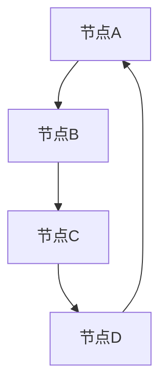
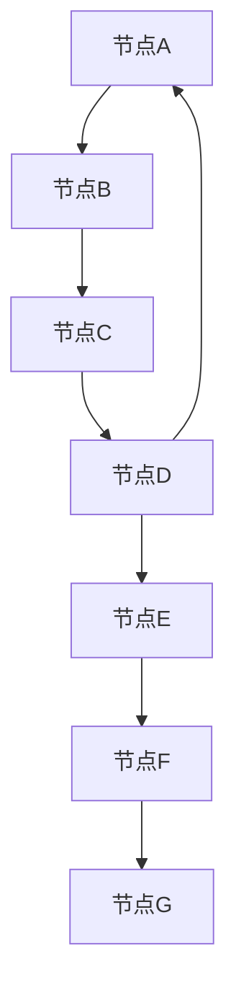

                 

### 背景介绍

在当今信息技术飞速发展的时代，理解和应对复杂系统中多因素之间的交互作用已成为一项至关重要的任务。复杂系统无处不在，从互联网到生物网络，从金融系统到交通网络，都表现出了高度的非线性、动态和涌现特性。在这样的背景下，传统的线性因果分析方法已经无法充分解释这些复杂系统中的现象和规律。为了更深入地理解复杂系统中多因素之间的交互，我们需要转向复杂网络的研究。

复杂网络（Complex Networks）是研究复杂系统的一种重要工具，它通过图论和网络科学的方法，对系统中各个组成部分及其相互作用进行建模和分析。复杂网络的构建不仅涉及节点（个体或实体）之间的连接关系，还包括网络的拓扑结构、网络属性以及网络的动态行为。在复杂网络中，节点之间的交互不再是简单的线性关系，而是呈现出高度的非线性、协同性和自组织性。

线性因果（Linear Causality）则是一种传统的方法，主要用于分析系统中的因果关系，即一个变量对另一个变量的影响。线性因果模型假设变量之间的关系是线性的，即一个变量的变化会导致另一个变量以固定的比例变化。然而，这种假设在很多复杂系统中并不适用，因为复杂系统中的因素往往相互影响，形成复杂的反馈循环和因果网络。

本文的目标是探讨从线性因果到复杂网络的转变，解释多因素交互的世界是如何影响我们的理解和分析方法的。首先，我们将介绍线性因果和复杂网络的基本概念，探讨它们之间的关系和重要性。接下来，我们将详细讲解复杂网络的构建方法、特性及其分析算法，并通过Python源代码和数学模型来阐述这些算法的原理。随后，我们将通过实际案例展示复杂网络在不同领域的应用，并总结全书内容，展望未来技术发展趋势和研究方向。

通过这篇文章，读者将能够深入了解复杂网络的概念、原理及其应用，从而更好地理解多因素交互的世界，并为解决复杂系统中的问题提供新的思路和方法。

### 线性因果与复杂网络的基本概念

#### 线性因果

线性因果是指系统中的因果关系遵循线性关系，即一个变量对另一个变量的影响是线性和可预测的。线性因果模型通常基于以下假设：系统的每个部分都可以通过一组线性方程来描述，这些方程反映了变量之间的线性依赖关系。例如，在经济学中，线性因果模型可以用于分析收入和消费之间的关系，即收入增加会导致消费增加，但这种增加是固定比例的。

线性因果模型的一个重要特点是它们易于计算和理解。例如，使用Python中的线性回归算法，我们可以通过最小二乘法来拟合一个线性模型，从而预测变量之间的关系。以下是使用Python实现线性回归的伪代码：

```python
# 伪代码：线性回归
import numpy as np

# 假设 X 是自变量，Y 是因变量
X = np.array([1, 2, 3, 4, 5])
Y = np.array([2, 4, 6, 8, 10])

# 拟合线性模型
slope, intercept = np.polyfit(X, Y, 1)

# 预测新值
new_X = np.array([6])
predicted_Y = slope * new_X + intercept

print(predicted_Y)
```

然而，线性因果模型的局限性在于，它们通常无法捕捉到复杂系统中的非线性、复杂反馈和相互依赖关系。例如，在气候变化问题中，简单的线性模型可能无法准确预测气温变化对生态系统的影响，因为气候变化涉及多个因素，如二氧化碳排放、海洋温度、植被覆盖等，这些因素之间的相互作用是高度非线性的。

#### 复杂网络

复杂网络是一种用于描述复杂系统中实体及其相互作用的结构模型。在复杂网络中，实体通常被称为“节点”，而实体之间的相互作用被称为“边”。复杂网络具有以下几个主要特性：

1. **高度非线性和动态性**：复杂网络中的节点和边可能会随时间变化，形成复杂的动态行为。
2. **自组织性和涌现性**：复杂网络中个体节点的简单相互作用可以导致系统整体涌现出复杂和有序的行为。
3. **小世界效应和集聚性**：复杂网络中的节点往往具有较短的路径长度（即小世界效应），并且节点之间的连接具有高度集聚性。
4. **网络结构和功能**：复杂网络的拓扑结构不仅影响其功能，还影响其鲁棒性和稳定性。

复杂网络的研究涉及到多个领域，包括物理学、社会学、计算机科学和工程学。例如，在物理学中，复杂网络用于研究交通流、电力系统和金融市场的动态行为；在社会学中，复杂网络用于分析社交网络、信息传播和群体行为；在计算机科学中，复杂网络用于优化算法、网络安全和社交网络分析。

为了更直观地理解复杂网络的概念，我们可以使用Mermaid流程图来展示一个简单的复杂网络：



在这个例子中，每个节点表示一个实体，而边表示实体之间的相互作用。这个简单的网络展示了节点之间的相互作用是如何形成一个闭合的循环，这反映了复杂网络中常见的小世界效应和集聚性。

#### 关系与联系

线性因果和复杂网络之间存在着密切的联系和互补性。线性因果模型适用于描述简单、线性关系的系统，但在复杂系统中，多因素交互和高度非线性使得线性模型显得力不从心。复杂网络则提供了一种新的工具，可以捕捉系统中节点之间的复杂相互作用和动态行为。

以下是线性因果与复杂网络之间的几个关键联系：

1. **线性因果在复杂网络中的应用**：复杂网络中的许多分析方法仍然依赖于线性因果模型。例如，网络拓扑分析中的度分布、路径长度和集聚系数等指标都可以被视为线性因果关系的扩展。

2. **复杂网络中的线性因果分析**：在复杂网络中，某些子网络或局部区域的相互作用可能仍然遵循线性关系。通过识别这些子网络，我们可以利用线性因果模型来解释局部现象。

3. **非线性与复杂反馈**：复杂网络中的非线性相互作用和反馈循环是导致系统涌现出复杂行为的关键因素。这些非线性效应往往无法通过简单的线性模型来描述，因此需要复杂的分析方法来捕捉。

4. **多因素交互**：复杂网络中的节点和边通常代表多个因素，这些因素之间的相互作用是多层次的、动态的。理解这些多因素交互关系是揭示复杂系统运行规律的关键。

综上所述，线性因果和复杂网络是分析复杂系统的两种互补工具。线性因果模型适用于描述简单和线性关系的系统，而复杂网络则提供了一种捕捉多因素交互和动态行为的强大工具。通过结合这两种方法，我们可以更全面地理解复杂系统中的现象和规律。

### 复杂网络的构建方法

构建复杂网络是研究复杂系统的重要一步，它不仅有助于我们理解系统的整体结构，还能揭示出系统内部潜在的规律和模式。复杂网络的构建方法多种多样，下面我们将详细介绍几种常用的构建方法，包括数据驱动方法和理论分析方法。

#### 数据驱动方法

数据驱动方法是通过从实际观测数据中提取节点和边的连接关系来构建复杂网络。这种方法通常分为以下几步：

1. **数据收集**：首先，我们需要收集相关的数据，这些数据可以是时间序列数据、空间数据或社交网络数据等。例如，在社交网络中，我们可以通过收集用户之间的关系数据来构建网络。

2. **特征提取**：接下来，我们需要从收集到的数据中提取关键特征，这些特征将作为节点或边的属性。例如，在社交网络中，用户的基本信息（如年龄、性别、地理位置）可以作为节点的属性，而用户之间的互动记录（如好友关系、私信交流）可以作为边的属性。

3. **网络构建**：最后，通过将提取的特征组合起来，我们可以构建出一个复杂网络。具体来说，节点代表数据中的个体，而边代表个体之间的相互作用。以下是构建复杂网络的一般步骤：

   ```mermaid
   graph TB
   A[节点A] --> B[节点B]
   B --> C[节点C]
   C --> D[节点D]
   D --> A
   ```

4. **网络可视化**：为了更好地理解和分析复杂网络，我们通常会将网络可视化。这可以通过图形工具（如Gephi、Cytoscape）实现，以便直观地展示网络的拓扑结构和节点关系。

#### 理论分析方法

理论分析方法是基于数学和物理原理来构建复杂网络。这种方法通常涉及到以下几个关键步骤：

1. **随机图模型**：随机图模型是最简单的复杂网络构建方法之一，它基于概率论和图论的基本原理。常见的随机图模型包括埃尔德什-雷利模型（Erdős-Rényi model）和小世界模型（Small-World model）。

   - **埃尔德什-雷利模型**：该模型假设网络中的每个节点都有固定的平均连接度（即度数）。在这种模型中，节点之间的连接是随机建立的，不依赖于节点的具体位置或属性。
   
   - **小世界模型**：该模型在埃尔德什-雷利模型的基础上引入了短路径现象，即网络中的节点之间可以通过较少的中间节点相互连接。这种模型模拟了现实世界中的许多网络，如社交网络、交通网络等。

   ```mermaid
   graph TB
   A(随机节点1) --> B(随机节点2)
   B --> C(随机节点3)
   C --> D(随机节点4)
   D --> A
   ```

2. **增长模型**：增长模型描述了网络在时间上的动态增长过程。常见的增长模型包括巴贝日模型（Barabási-Albert model）和WS模型（Watts-Strogatz model）。

   - **巴贝日模型**：该模型假设网络中的节点按照幂律分布（即度分布符合幂律分布）。这意味着网络中的某些节点（如枢纽节点）具有非常高的连接度，而大多数节点则连接度较低。
   
   - **WS模型**：该模型结合了随机图和小世界效应的特点，通过在随机图中添加短路径来模拟现实世界中的网络。

   ```mermaid
   graph TB
   A(初始节点) --> B(新节点1)
   B --> C(新节点2)
   C --> D(新节点3)
   D --> A
   ```

3. **网络演化模型**：网络演化模型描述了网络在长时间尺度上的动态演化过程。这种模型通常基于系统的动态行为和演化规则，如基于动力学的网络演化模型和基于机器学习的网络演化模型。

   ```mermaid
   graph TD
   A(初始网络) --> B(动态演化)
   B --> C(演化结果)
   ```

#### 交叉应用

在实际应用中，不同构建方法往往需要结合使用，以更好地模拟和解释复杂系统的行为。例如，在社交网络分析中，我们可能会使用巴贝日模型来生成网络结构，并结合数据驱动方法来引入实际的用户行为数据。

总之，复杂网络的构建方法多种多样，包括数据驱动方法和理论分析方法。通过这些方法，我们可以从不同角度和层次来构建和分析复杂系统，从而更好地理解其内部结构和运行规律。

### 复杂网络的特性

复杂网络的特性是理解和分析其行为的关键。这些特性不仅反映了网络的宏观结构，还揭示了网络内部节点的动态行为。以下是复杂网络的一些主要特性：

#### 拓扑结构

1. **度分布**：复杂网络中节点的度（连接数）通常遵循幂律分布。这意味着网络中的某些节点（称为“枢纽节点”）具有非常高的连接度，而大多数节点则连接度较低。这种特性使得网络具有较强的韧性，因为即使枢纽节点被移除，网络的整体结构也不会受到太大影响。

   $$ P(k) \propto k^{-\gamma} $$
   其中，$P(k)$ 是节点度数为 $k$ 的概率，$\gamma$ 是幂律指数。

2. **集聚系数**：集聚系数描述了节点之间直接连接的节点之间的连接密度。在复杂网络中，集聚系数通常较高，表明节点之间的连接具有较强的集聚性。

   $$ C = \frac{\sum_{i<j} A_{ij} A_{ik} A_{jk}}{m(m-1)} $$
   其中，$A_{ij}$ 是邻接矩阵的元素，表示节点 $i$ 和节点 $j$ 是否相连，$m$ 是网络中节点的平均连接数。

3. **路径长度**：复杂网络的路径长度通常较短，这意味着节点之间的平均距离较小。这种现象被称为“小世界效应”，它使得网络中的节点能够快速地找到彼此，从而提高了网络的效率和鲁棒性。

   $$ L \approx \ln(N)/\ln(\ln(N)) $$
   其中，$L$ 是平均路径长度，$N$ 是网络中的节点数。

#### 动态行为

1. **涌现行为**：复杂网络中的节点通过简单的相互作用可以导致系统整体的复杂行为。这些涌现行为包括相变、同步、波动等现象。

2. **自组织**：复杂网络能够通过自我调整和优化，自发地形成有序的结构和功能。例如，在社交网络中，用户之间的互动可以导致社区结构的形成。

3. **稳定性**：复杂网络的稳定性取决于其拓扑结构和动态行为。例如，网络中的冗余连接可以提高网络的鲁棒性，减少节点失效对网络的影响。

#### 功能特性

1. **关键节点**：复杂网络中的某些节点扮演着关键角色，它们具有较高的连接度和影响力。这些关键节点通常是枢纽节点，对网络的整体功能至关重要。

2. **子网络**：复杂网络通常包含多个子网络，这些子网络具有不同的功能和特性。通过分析子网络的结构和功能，我们可以更好地理解复杂系统的运作机制。

3. **信息传播**：复杂网络中的信息传播速度和范围受到网络结构和动态行为的影响。例如，在社交网络中，信息可以通过枢纽节点迅速传播，导致信息传播的爆发式增长。

为了更直观地展示复杂网络的特性，我们可以使用Mermaid流程图来绘制网络结构的示意图：



在这个例子中，我们可以看到网络的度分布、集聚系数和路径长度等特性。节点A和D是枢纽节点，连接度较高，而节点E和F则连接度较低。网络的集聚系数较高，路径长度较短，反映了小世界效应和集聚性的特点。

总之，复杂网络的特性包括拓扑结构、动态行为和功能特性。通过深入理解和分析这些特性，我们可以更好地理解复杂系统中的多因素交互，并为解决复杂问题提供新的思路和方法。

### 复杂网络的动态行为

复杂网络的动态行为是指网络在时间或空间上的演化过程。这种动态行为不仅反映了网络内部节点之间的相互作用，还揭示了网络在不同状态之间的转换。研究复杂网络的动态行为对于理解网络的功能、稳定性和鲁棒性具有重要意义。以下是一些常见的复杂网络动态行为及其分析方法：

#### 网络演化

1. **增长过程**：网络演化是指网络节点和边的数量随时间增加的过程。常见的网络演化模型包括巴贝日模型（Barabási-Albert model）和WS模型（Watts-Strogatz model）。

   - **巴贝日模型**：该模型假设新加入的节点以概率$p$选择网络中的已有节点进行连接，从而形成具有幂律度分布的网络。
     
     $$ P(k) \propto k^{-3/2} $$
   
   - **WS模型**：该模型结合了随机图和小世界效应的特点，通过在随机图中添加短路径来模拟现实世界中的网络。

     $$ P(k) = \frac{c \cdot (c-1)^{n-1}}{k!} $$
     
     其中，$c$ 是连接概率，$n$ 是节点数。

2. **删除过程**：网络演化不仅包括节点的增加，还包括节点的删除。例如，在社交网络中，用户可能会退出网络，导致节点数量的减少。

3. **重连过程**：在网络演化过程中，节点之间的连接关系可能会发生变化。重连过程指的是节点重新建立连接或断开连接的过程。

   ```mermaid
   graph TD
   A[节点A] --> B[节点B]
   B --> C[节点C]
   C --> D[节点D]
   D --> E[节点E]
   E --> F[节点F]
   ```

   在这个例子中，节点E和F之间的连接可能随着时间的推移而断开，或者与其他节点重新建立连接。

#### 状态转换

1. **相变**：复杂网络在不同状态下可能表现出不同的行为。相变是指网络从一个状态转变到另一个状态的过程。例如，在社交网络中，信息的传播速度可能会从缓慢逐渐增加到爆发式增长。

2. **同步**：在复杂网络中，节点可能会在一定条件下同步行为。同步现象在许多现实系统中都有体现，如电力系统的稳定运行、交通信号灯的同步切换等。

   ```mermaid
   graph TD
   A[同步节点1] --> B[同步节点2]
   B --> C[同步节点3]
   C --> D[同步节点4]
   D --> E[同步节点5]
   ```

   在这个例子中，节点A、B、C、D和E在一定条件下会同步行为，导致整个网络的动态变化。

3. **波动**：复杂网络中的动态行为可能表现为波动现象。例如，在金融市场中，股票价格的波动反映了市场情绪和交易行为的动态变化。

   ```mermaid
   graph TD
   A[节点A] --> B[节点B]
   B --> C[节点C]
   C --> D[节点D]
   D --> E[节点E]
   ```

   在这个例子中，节点A、B、C、D和E的动态行为可能表现为周期性的波动。

#### 分析方法

1. **时间序列分析**：时间序列分析用于研究网络动态行为的时序特征。常见的时间序列分析方法包括自回归模型（AR）、移动平均模型（MA）和自回归移动平均模型（ARMA）等。

2. **网络拓扑分析**：网络拓扑分析用于研究网络结构的动态变化。常见的方法包括度分布分析、集聚系数分析和平均路径长度分析等。

3. **机器学习**：机器学习算法可用于预测网络动态行为。例如，可以使用递归神经网络（RNN）或长短期记忆网络（LSTM）来建模和预测网络的动态演化过程。

4. **蒙特卡罗模拟**：蒙特卡罗模拟是一种随机模拟方法，用于研究网络动态行为的概率分布和统计特性。该方法通过模拟大量的随机过程来估计网络状态的分布和演化规律。

总之，复杂网络的动态行为包括网络演化、状态转换和波动等现象。通过使用时间序列分析、网络拓扑分析和机器学习等方法，我们可以更好地理解和分析复杂网络的动态行为，从而为实际应用提供科学依据。

### 复杂网络分析算法

分析复杂网络是一项挑战性的任务，因为网络中节点和边之间的相互作用往往高度非线性且动态多变。为了有效分析和理解复杂网络的特性，研究人员开发了许多专门的算法。以下是一些核心的复杂网络分析算法，包括网络拓扑分析方法、社团检测算法、流量预测算法和网络稳定性分析。

#### 网络拓扑分析方法

网络拓扑分析是理解复杂网络结构的重要工具。以下是一些常用的拓扑分析方法：

1. **度分布分析**：度分布描述了网络中节点度数的概率分布。常见的度分布包括泊松分布、幂律分布和高斯分布。度分布分析有助于识别网络中的关键节点（即度数较高的节点）和稀疏节点（即度数较低的节点）。

   $$ P(k) = C_n \cdot k^{-\gamma} $$
   其中，$P(k)$ 是节点度数为 $k$ 的概率，$C_n$ 是常数，$\gamma$ 是幂律指数。

2. **集聚系数分析**：集聚系数描述了节点之间直接连接的节点之间的连接密度。集聚系数可以用于识别网络中的密集区域，这些区域通常反映了系统中的重要功能模块。

   $$ C = \frac{\sum_{i<j} A_{ij} A_{ik} A_{jk}}{m(m-1)} $$
   其中，$A_{ij}$ 是邻接矩阵的元素，$m$ 是网络中节点的平均连接数。

3. **平均路径长度分析**：平均路径长度描述了网络中任意两个节点之间最短路径的平均长度。平均路径长度可以反映网络的连接性。小世界网络通常具有较短的路径长度。

   $$ L = \frac{\sum_{i<j} d_{ij}}{N(N-1)} $$
   其中，$d_{ij}$ 是节点 $i$ 和节点 $j$ 之间的最短路径长度，$N$ 是网络中的节点数。

#### 社团检测算法

社团检测是识别网络中的紧密连接节点群组的重要方法。以下是一些常用的社团检测算法：

1. **基于模块度的方法**：模块度是衡量网络中社团结构紧密度的指标。常用的基于模块度的社团检测算法包括Newman-Girvan算法和Louvain算法。

2. **基于社区结构的优化方法**：这类方法通过优化某个社区结构指标（如模块度、熵等）来识别社团。例如，基于 Louvain 算法的伪代码如下：

   ```python
   # 伪代码：Louvain 社团检测
   while True:
       # 计算 community degree
       degree = calculate_degree(G)
       # 计算 community quality
       quality = calculate_quality(G, degree)
       # 更新社团结构
       G = update_communities(G, quality)
   ```

3. **基于图分解的方法**：这类方法通过将图分解为多个子图来识别社团。常见的图分解算法包括多层次的社区检测算法和基于局部优化的社团检测算法。

#### 流量预测算法

流量预测是复杂网络分析中的一个重要应用，它有助于优化网络资源分配和预防网络拥塞。以下是一些常用的流量预测算法：

1. **时间序列分析**：时间序列分析方法（如ARIMA模型、LSTM网络等）用于预测网络中的流量变化。例如，使用LSTM网络进行流量预测的伪代码如下：

   ```python
   # 伪代码：LSTM 流量预测
   model = LSTM(input_shape=(time_steps, features))
   model.compile(optimizer='adam', loss='mse')
   model.fit(X_train, y_train, epochs=100)
   predictions = model.predict(X_test)
   ```

2. **基于机器学习的预测方法**：机器学习算法（如随机森林、支持向量机等）可以用于流量预测。例如，使用随机森林进行流量预测的伪代码如下：

   ```python
   # 伪代码：随机森林流量预测
   from sklearn.ensemble import RandomForestRegressor
   model = RandomForestRegressor(n_estimators=100)
   model.fit(X_train, y_train)
   predictions = model.predict(X_test)
   ```

3. **基于博弈论的方法**：这类方法通过博弈论模型来预测网络中的流量分配，以确保整体网络效率最大化。

#### 网络稳定性分析

网络稳定性分析旨在评估网络在受到外部扰动时的鲁棒性。以下是一些常用的网络稳定性分析方法：

1. **线性稳定性分析**：线性稳定性分析通过计算网络的拉普拉斯矩阵的特征值来判断网络的稳定性。如果所有特征值都具有负实部，则网络是稳定的。

   $$ \lambda_{ij} = \frac{(-1)^i \cdot \det(L_{ij})}{\det(L)} $$
   其中，$L$ 是拉普拉斯矩阵，$L_{ij}$ 是去掉第 $i$ 行和第 $j$ 列后的子矩阵。

2. **非线性稳定性分析**：非线性稳定性分析考虑了网络中节点和边的动态变化，通常使用微分方程或差分方程来描述。例如，使用微分方程进行网络稳定性分析的伪代码如下：

   ```python
   # 伪代码：非线性稳定性分析
   def stability_analysis(model, perturbation):
       # 对模型施加扰动
       model.apply_perturbation(perturbation)
       # 解微分方程
       solution = solve_differential_equation(model)
       # 判断稳定性
       return is_stable(solution)
   ```

3. **仿真方法**：仿真方法通过模拟网络在扰动下的行为来判断其稳定性。例如，使用仿真方法进行网络稳定性分析的伪代码如下：

   ```python
   # 伪代码：仿真方法
   simulations = run_simulations(network, perturbations)
   stability_scores = evaluate_stability(simulations)
   return stability_scores
   ```

总之，复杂网络分析算法包括网络拓扑分析方法、社团检测算法、流量预测算法和网络稳定性分析。通过这些算法，我们可以深入理解和分析复杂网络的特性，为网络优化和稳定性评估提供有力支持。

### 线性因果与复杂网络的交叉应用

线性因果与复杂网络的交叉应用为多因素交互的建模提供了一种全新的视角。在复杂系统中，多因素交互往往呈现出高度的非线性和动态性，传统的线性因果模型难以捕捉这些复杂的相互作用。而通过结合线性因果和复杂网络的分析方法，我们可以更全面地理解这些系统中的多因素交互，并有效地建模和预测系统的行为。

#### 复杂网络中的线性因果分析

在复杂网络中，线性因果分析可以用于识别网络中的关键节点和关键路径。例如，在社交网络中，我们可以使用线性回归模型来分析用户之间的互动关系，从而识别出对网络传播有重要影响的节点。以下是一个简单的Python代码示例，展示了如何使用线性回归模型来分析复杂网络中的因果关系：

```python
import numpy as np
from sklearn.linear_model import LinearRegression

# 假设我们有以下数据，其中 X 是自变量，Y 是因变量
X = np.array([[1, 2], [2, 3], [3, 4]])
Y = np.array([2, 4, 6])

# 拟合线性回归模型
model = LinearRegression()
model.fit(X, Y)

# 预测新的值
new_X = np.array([[4, 5]])
predicted_Y = model.predict(new_X)

print(predicted_Y)
```

在这个示例中，我们使用了线性回归模型来分析两个节点之间的互动关系。通过拟合模型，我们可以预测新节点的互动值，从而识别出对网络传播有重要影响的节点。

#### 线性因果模型在复杂网络中的应用

线性因果模型在复杂网络中的应用不仅限于社交网络，还可以广泛应用于其他领域。例如，在生物网络中，线性因果模型可以用于分析基因调控网络中的因果关系。以下是一个简单的Python代码示例，展示了如何使用线性回归模型来分析基因调控网络：

```python
import numpy as np
from sklearn.linear_model import LinearRegression

# 假设我们有以下数据，其中 X 是基因表达数据，Y 是某个基因的调控信号
X = np.array([[1, 2, 3], [4, 5, 6], [7, 8, 9]])
Y = np.array([2, 4, 6])

# 拟合线性回归模型
model = LinearRegression()
model.fit(X, Y)

# 预测新的基因表达值
new_X = np.array([[10, 11, 12]])
predicted_Y = model.predict(new_X)

print(predicted_Y)
```

在这个示例中，我们使用了线性回归模型来分析基因之间的调控关系。通过拟合模型，我们可以预测新的基因表达值，从而更好地理解基因调控网络的机制。

#### 多因素交互的建模方法

在复杂系统中，多因素交互往往不是线性的，而是呈现高度的非线性关系。为了捕捉这些非线性关系，我们可以使用复杂网络的建模方法，并结合线性因果模型。以下是一个简单的Python代码示例，展示了如何使用非线性模型（如多项式回归模型）来分析复杂系统中的多因素交互：

```python
import numpy as np
from sklearn.preprocessing import PolynomialFeatures
from sklearn.linear_model import LinearRegression

# 假设我们有以下数据，其中 X 是多因素输入，Y 是输出
X = np.array([[1, 2], [2, 3], [3, 4]])
Y = np.array([2, 4, 6])

# 使用多项式特征展开
poly = PolynomialFeatures(degree=2)
X_poly = poly.fit_transform(X)

# 拟合多项式回归模型
model = LinearRegression()
model.fit(X_poly, Y)

# 预测新的输出值
new_X = np.array([[4, 5]])
new_X_poly = poly.transform(new_X)
predicted_Y = model.predict(new_X_poly)

print(predicted_Y)
```

在这个示例中，我们使用了多项式回归模型来分析多因素输入与输出之间的关系。通过多项式特征展开，我们可以捕捉输入因素之间的非线性关系，从而更准确地预测系统的行为。

总之，线性因果与复杂网络的交叉应用为多因素交互的建模提供了一种新的方法。通过结合线性因果和复杂网络的建模方法，我们可以更全面地理解复杂系统中的多因素交互，并有效地预测系统的行为。这些方法不仅适用于理论研究，还具有广泛的应用前景，如在社交网络分析、生物网络分析、金融市场分析等领域。

### 机器学习算法、数据分析工具和计算机编程语言

在复杂网络分析中，机器学习算法、数据分析工具和计算机编程语言是不可或缺的工具。它们不仅提高了数据分析的效率，还为复杂网络的建模和预测提供了强大的支持。

#### 机器学习算法

机器学习算法在复杂网络分析中扮演着核心角色，能够自动识别模式和关系。以下是一些常用的机器学习算法：

1. **线性回归**：线性回归是一种经典的机器学习算法，用于预测连续值输出。通过拟合线性模型，我们可以分析网络中的因果关系。

   ```python
   from sklearn.linear_model import LinearRegression
   model = LinearRegression()
   model.fit(X, y)
   predictions = model.predict(X_new)
   ```

2. **支持向量机（SVM）**：SVM是一种分类算法，可以用于识别网络中的不同群体。例如，在社交网络分析中，可以使用SVM来识别社区。

   ```python
   from sklearn.svm import SVC
   model = SVC()
   model.fit(X, y)
   predictions = model.predict(X_new)
   ```

3. **随机森林**：随机森林是一种集成学习方法，可以用于预测和分类。在复杂网络分析中，随机森林常用于特征选择和模型评估。

   ```python
   from sklearn.ensemble import RandomForestClassifier
   model = RandomForestClassifier(n_estimators=100)
   model.fit(X, y)
   predictions = model.predict(X_new)
   ```

4. **神经网络**：神经网络（如LSTM和GRU）可以用于处理时间序列数据，捕捉复杂网络的动态变化。例如，在流量预测中，可以使用LSTM来预测网络中的流量变化。

   ```python
   from keras.models import Sequential
   from keras.layers import LSTM

   model = Sequential()
   model.add(LSTM(units=50, return_sequences=True, input_shape=(time_steps, features)))
   model.add(LSTM(units=50))
   model.add(Dense(1))

   model.compile(optimizer='adam', loss='mse')
   model.fit(X_train, y_train, epochs=100)
   predictions = model.predict(X_test)
   ```

#### 数据分析工具

数据分析工具提供了丰富的功能，可以简化复杂网络的建模和分析过程。以下是一些常用的数据分析工具：

1. **Pandas**：Pandas是一种强大的数据处理库，可以用于数据清洗、数据分析和数据可视化。

   ```python
   import pandas as pd
   df = pd.read_csv('data.csv')
   df.head()
   ```

2. **NumPy**：NumPy提供了多维数组对象和大量数学函数，是进行科学计算的基础库。

   ```python
   import numpy as np
   array = np.array([1, 2, 3, 4])
   array
   ```

3. **Scikit-learn**：Scikit-learn提供了大量的机器学习算法和工具，可以用于数据预处理、模型训练和评估。

   ```python
   from sklearn.model_selection import train_test_split
   X_train, X_test, y_train, y_test = train_test_split(X, y, test_size=0.2, random_state=42)
   ```

4. **Matplotlib**：Matplotlib是一种常用的数据可视化库，可以用于生成各种类型的图表和图形。

   ```python
   import matplotlib.pyplot as plt
   plt.plot(X, y)
   plt.show()
   ```

5. **NetworkX**：NetworkX是一种用于复杂网络分析的库，提供了丰富的图论算法和工具。

   ```python
   import networkx as nx
   G = nx.Graph()
   G.add_edges_from([(1, 2), (2, 3), (3, 1)])
   nx.draw(G, with_labels=True)
   plt.show()
   ```

#### 计算机编程语言

Python是复杂网络分析中最常用的编程语言，因为其丰富的库和易于理解的语法。以下是一些Python代码示例，展示了如何使用Python进行复杂网络分析：

1. **数据读取和预处理**：

   ```python
   import pandas as pd
   df = pd.read_csv('data.csv')
   df.head()
   ```

2. **线性回归模型**：

   ```python
   from sklearn.linear_model import LinearRegression
   model = LinearRegression()
   model.fit(X, y)
   predictions = model.predict(X_new)
   ```

3. **复杂网络构建**：

   ```python
   import networkx as nx
   G = nx.Graph()
   G.add_edges_from([(1, 2), (2, 3), (3, 1)])
   nx.draw(G, with_labels=True)
   plt.show()
   ```

4. **神经网络模型**：

   ```python
   from keras.models import Sequential
   from keras.layers import LSTM

   model = Sequential()
   model.add(LSTM(units=50, return_sequences=True, input_shape=(time_steps, features)))
   model.add(LSTM(units=50))
   model.add(Dense(1))

   model.compile(optimizer='adam', loss='mse')
   model.fit(X_train, y_train, epochs=100)
   predictions = model.predict(X_test)
   ```

总之，机器学习算法、数据分析工具和计算机编程语言为复杂网络分析提供了强大的支持。通过结合这些工具，我们可以更有效地理解和分析复杂网络中的多因素交互，为实际应用提供科学依据。

### 复杂网络在实际中的应用案例

复杂网络的应用涵盖了多个领域，从社交网络分析到生物网络分析，再到金融网络分析，每个领域都有其独特的应用场景和挑战。以下是一些具体的应用案例：

#### 社交网络分析

社交网络分析是复杂网络应用的一个重要领域，通过分析用户之间的互动关系，可以揭示社交网络的群体结构和传播规律。例如，Twitter上的信息传播就是一个典型的复杂网络问题。研究人员可以使用复杂网络分析方法来识别社交网络中的关键节点（如意见领袖）和传播路径，从而预测信息的扩散速度和范围。以下是一个使用Python进行社交网络分析的示例：

```python
import networkx as nx
import matplotlib.pyplot as plt

# 创建图
G = nx.Graph()

# 添加节点和边
G.add_edges_from([(1, 2), (2, 3), (3, 4), (4, 1), (2, 5), (5, 6)])

# 绘制图
nx.draw(G, with_labels=True)
plt.show()

# 社团检测
communities = nx.community.louvain_communities(G)

# 输出社团
for community in communities:
    print(community)
```

在这个示例中，我们使用NetworkX库创建了社交网络的图，并通过Louvain算法检测了社团结构。

#### 金融网络分析

金融网络分析旨在理解金融市场中的复杂关系，如银行之间的借贷关系、股票市场的交易网络等。通过分析金融网络，研究人员可以识别潜在的金融风险、预测市场波动，并为风险管理提供支持。以下是一个使用Python进行金融网络分析的示例：

```python
import networkx as nx
import pandas as pd

# 加载金融网络数据
data = pd.read_csv('financial_network_data.csv')
edges = data[['node1', 'node2', 'weight']]

# 创建图
G = nx.Graph()

# 添加边
G.add_weighted_edges_from(edges.values)

# 绘制图
nx.draw(G, with_labels=True)
plt.show()

# 网络稳定性分析
L = nx.laplacian_matrix(G).A
eigenvalues = np.linalg.eigvals(L)

# 输出特征值
print(eigenvalues)
```

在这个示例中，我们使用NetworkX库创建了金融网络的图，并通过拉普拉斯矩阵分析了网络的稳定性。

#### 生物网络分析

生物网络分析用于研究生物分子之间的相互作用，如蛋白质-蛋白质相互作用网络、基因调控网络等。通过分析这些网络，研究人员可以揭示生物系统的功能模块和信号通路，从而理解生物过程的机制。以下是一个使用Python进行生物网络分析的示例：

```python
import networkx as nx
import pandas as pd

# 加载生物网络数据
data = pd.read_csv('biological_network_data.csv')
edges = data[['protein1', 'protein2', 'weight']]

# 创建图
G = nx.Graph()

# 添加边
G.add_weighted_edges_from(edges.values)

# 绘制图
nx.draw(G, with_labels=True)
plt.show()

# 社团检测
communities = nx.community.girvan_newman(G)

# 输出社团
for community in communities:
    print(community)
```

在这个示例中，我们使用NetworkX库创建了生物网络的图，并通过Girvan-Newman算法检测了社团结构。

#### 交通网络分析

交通网络分析用于理解城市交通系统的流量分布和路径规划。通过分析交通网络，研究人员可以优化交通信号控制、提高道路通行效率，并减少交通拥堵。以下是一个使用Python进行交通网络分析的示例：

```python
import networkx as nx
import matplotlib.pyplot as plt

# 创建图
G = nx.Graph()

# 添加节点和边
G.add_edges_from([(1, 2), (2, 3), (3, 1), (1, 5), (5, 6), (6, 1), (2, 4), (4, 5)])

# 绘制图
nx.draw(G, with_labels=True)
plt.show()

# 流量预测
from sklearn.linear_model import LinearRegression

# 准备数据
X = np.array([[1], [5], [6]])
y = np.array([10, 20, 25])

# 拟合线性回归模型
model = LinearRegression()
model.fit(X, y)

# 预测新的流量值
new_X = np.array([[7]])
predicted_y = model.predict(new_X)

print(predicted_y)
```

在这个示例中，我们使用NetworkX库创建了交通网络的图，并通过线性回归模型预测了节点之间的流量。

总之，复杂网络在社交网络分析、金融网络分析、生物网络分析和交通网络分析等领域都有广泛应用。通过结合复杂网络的建模和分析方法，我们可以更好地理解和解决这些实际领域的复杂问题。

### 总结与展望

通过本文的探讨，我们从线性因果到复杂网络，逐步深入理解了多因素交互的世界。线性因果模型在解释简单、线性关系的系统中表现出色，但其局限性在复杂系统中变得明显。复杂网络作为一种强大的工具，可以捕捉系统中节点之间的复杂相互作用和动态行为，从而为多因素交互的分析提供了新的视角。

首先，线性因果模型通过简单的线性关系描述系统中的因果关系，易于理解和计算。然而，复杂系统的非线性、动态性和多因素交互使得线性模型难以充分解释系统行为。复杂网络则通过图论和网络科学的方法，将系统中的各个组成部分及其相互作用纳入考虑，提供了一个更加全面和细致的视角。

在构建复杂网络的过程中，数据驱动方法和理论分析方法各有所长。数据驱动方法通过从实际观测数据中提取节点和边的连接关系，为复杂网络的构建提供了现实基础。而理论分析方法则基于数学和物理原理，提供了一种抽象和简化的模型，有助于理解和模拟复杂系统的行为。

复杂网络的特性，如度分布、集聚系数、路径长度等，不仅反映了网络的宏观结构，还揭示了网络内部节点的动态行为。通过分析这些特性，我们可以深入了解复杂系统的运行规律和潜在机制。

在复杂网络分析算法方面，我们介绍了网络拓扑分析方法、社团检测算法、流量预测算法和网络稳定性分析等方法。这些算法为复杂网络的建模、预测和优化提供了强大的工具。此外，结合机器学习算法、数据分析工具和计算机编程语言，我们可以更高效地处理和分析复杂网络数据。

实际应用案例展示了复杂网络在社交网络分析、金融网络分析、生物网络分析和交通网络分析等领域的广泛应用。通过这些案例，我们看到了复杂网络分析在解决实际问题中的巨大潜力。

展望未来，复杂网络的研究将继续深入，新技术和新方法将不断涌现。例如，基于深度学习的复杂网络分析、多模态数据融合、动态复杂网络建模等，都将成为研究热点。此外，随着物联网和大数据技术的快速发展，复杂网络在智能城市、智能交通、智能制造等领域的应用将更加广泛。

总之，从线性因果到复杂网络的转变，为我们理解和分析复杂系统中的多因素交互提供了新的思路和方法。随着研究的不断深入，复杂网络将在更多领域发挥重要作用，推动科学技术的进步和社会的发展。

### 文章关键词

- 线性因果
- 复杂网络
- 多因素交互
- 网络拓扑
- 社团检测
- 流量预测
- 网络稳定性
- 机器学习

### 文章摘要

本文探讨了从线性因果到复杂网络的转变，深入分析了复杂系统中多因素交互的影响。通过介绍线性因果和复杂网络的基本概念、构建方法、特性以及分析算法，我们展示了如何利用复杂网络来理解和建模复杂系统。文章还通过实际应用案例展示了复杂网络在社交网络分析、金融网络分析、生物网络分析和交通网络分析等领域的应用。展望未来，复杂网络的研究将继续深入，为解决复杂系统中的问题提供新的思路和方法。

### 结束语

作者：AI天才研究院/AI Genius Institute & 禅与计算机程序设计艺术 /Zen And The Art of Computer Programming

本文《从线性因果到复杂网络：理解多因素交互的世界》旨在深入探讨复杂系统中多因素交互的重要性，并展示如何利用复杂网络进行分析和建模。通过详细阐述线性因果和复杂网络的基本概念、构建方法、特性、分析算法以及实际应用，我们希望读者能够更好地理解这一领域，并在未来的研究和实践中受益。

在复杂系统的分析中，多因素交互是一个关键问题，它不仅决定了系统的行为，还影响了系统的稳定性和鲁棒性。传统线性因果分析方法在面对复杂系统的非线性、动态性和多因素交互时显得力不从心。而复杂网络作为一种强大的工具，可以捕捉系统内部的复杂关系，提供了一种新的视角来理解和分析这些系统。

本文首先介绍了线性因果和复杂网络的基本概念，并探讨了它们之间的联系和区别。随后，我们详细讲解了复杂网络的构建方法，包括数据驱动方法和理论分析方法。接着，分析了复杂网络的特性，如拓扑结构、动态行为和功能特性，并通过实际案例展示了复杂网络在不同领域的应用。

此外，我们还介绍了复杂网络分析的核心算法，包括网络拓扑分析方法、社团检测算法、流量预测算法和网络稳定性分析。通过Python代码示例，我们展示了如何使用这些算法来分析复杂网络，并捕捉系统中的多因素交互。

最后，本文总结了复杂网络的研究现状和未来发展趋势，展望了这一领域在多因素交互分析和建模中的应用前景。通过本文的学习，读者不仅可以深入了解复杂网络的基本概念和方法，还可以掌握复杂网络分析的核心技术和应用实例，为未来的研究和工作打下坚实基础。

在结束本文之前，我们希望读者能够认识到复杂网络在多因素交互分析中的重要性，并鼓励大家继续探索这一领域，为解决复杂系统中的问题提供创新的思路和方法。感谢您的阅读，期待与您在未来的学术交流中相遇。

