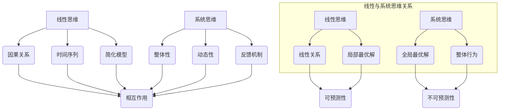

                 

### 引言

**从线性思维到系统思维：全局视角下的世界理解**

在当今快速发展的信息技术时代，我们正经历着前所未有的复杂性和不确定性。无论是科技、经济、社会还是环境，各种系统之间的相互作用变得越来越紧密，形成了复杂的网络和动态系统。在这种情况下，传统的线性思维模式已逐渐暴露出其局限性和不足。线性思维侧重于因果关系和时间序列分析，强调局部最优和短期效益，而在面对复杂系统时，其局限性变得尤为明显。为了更好地应对复杂性和不确定性，我们需要转向系统思维，这是一种更全面、更深刻的思维方式，它能够帮助我们更好地理解系统的结构和动态，从而找到更有效的解决方案。

**关键词**

- 线性思维
- 系统思维
- 复杂系统
- 全局视角
- 解决方案

**摘要**

本文旨在探讨从线性思维到系统思维的转变，以及这种转变对于理解和应对复杂世界的重要性。文章首先介绍了线性思维和系统思维的基本概念及其特点，然后详细阐述了系统思维的基本原理、方法和应用。通过具体案例，文章展示了系统思维在多个领域的实际应用，并探讨了如何从线性思维转向系统思维。最后，文章总结了全文的主要观点，并展望了系统思维的未来发展趋势。文章旨在为读者提供一种全新的视角，帮助他们在面对复杂问题时能够运用系统思维，从而找到更全面、更有效的解决方案。

### 背景介绍

**线性思维的历史与发展**

线性思维作为一种基本的思维方式，起源于古希腊哲学和科学。亚里士多德在《工具论》中提出了因果关系的基本原理，认为事物之间的联系是线性的、可预测的。这种思维方式在后来的科学研究中得到了广泛应用，特别是在牛顿力学和经典物理学中，线性思维成为了分析问题的基本工具。线性思维强调因果关系和时间序列，通过观察现象的变化来推断其因果关系。例如，在物理学中，牛顿的运动定律就是基于线性思维，通过描述物体之间的相互作用和运动状态来预测未来的变化。

线性思维在工业革命和计算机科学的发展过程中发挥了重要作用。在工业革命时期，为了提高生产效率，人们开始使用流水线作业，这种作业模式本质上是一种线性思维的应用。每个工人负责完成一个特定的任务，然后将半成品传递给下一个工人，最终完成整个产品的生产。这种方法使得生产过程更加高效和有序。

随着计算机科学的兴起，线性思维在算法设计和软件开发中得到了广泛应用。计算机科学的基本原理是基于逻辑和数学的，这些原理通常是通过线性思维来理解和分析的。例如，算法设计中的递归、分治和贪心算法等，都是基于线性思维的原理。线性思维使得计算机科学家能够更高效地分析和解决问题，推动了计算机技术的快速发展。

**系统思维的发展与应用**

与线性思维不同，系统思维是一种更全面、更深刻的思维方式。系统思维最早可以追溯到20世纪初，由美籍奥地利生物学家路德维希·冯·贝塔朗菲提出的一般系统论。贝塔朗菲认为，所有的事物都可以被视为一个系统，系统具有整体性、动态性和复杂性。系统思维强调系统的整体性和相互作用，通过分析系统的结构和动态来理解系统的行为。

系统思维在许多领域都得到了广泛应用。在经济学中，系统思维被用于分析市场和经济系统的动态变化。在生态学中，系统思维被用于研究生态系统的结构和功能。在工程学中，系统思维被用于系统设计和优化。此外，系统思维还在管理学、社会问题解决等领域发挥了重要作用。

系统思维的核心在于理解系统之间的相互作用和反馈机制。系统思维认为，系统是由多个相互作用的组成部分构成的，这些组成部分之间的相互作用决定了系统的整体行为。通过系统思维，我们可以更好地理解复杂系统的运作机制，从而找到更有效的解决方案。

**线性思维与系统思维的关系**

线性思维和系统思维虽然有不同的侧重点，但它们并不是完全独立的。事实上，线性思维可以被视为系统思维的一种简化形式。在许多情况下，我们可以将复杂系统分解为多个线性子系统，然后分别进行分析。这种方法在许多情况下是有效的，因为线性思维提供了简单的模型和工具，可以快速地分析和解决问题。

然而，当面对高度复杂的系统时，线性思维可能无法提供足够的洞察力。线性思维忽略了系统内部的反馈机制和相互作用，这可能导致分析结果的不准确。因此，在复杂系统的分析中，系统思维提供了更全面和深刻的视角，可以帮助我们更好地理解系统的行为。

总的来说，线性思维和系统思维是两种互补的思维方式。线性思维适用于简单的、可预测的系统，而系统思维适用于复杂的、不确定的系统。通过结合这两种思维方式，我们可以更全面地分析和解决复杂问题。

### 核心概念与联系

为了深入理解线性思维和系统思维，我们需要明确它们的核心概念和它们之间的关系。以下是这两个思维方式的定义、特点和区别：

**线性思维**

**定义**：线性思维是一种分析问题和解决问题的方法，它假设事物之间的关系是线性的，即一个事件或变量影响另一个事件或变量，而这种影响是直接且单向的。

**特点**：
1. **因果关系明确**：线性思维强调事件之间的因果关系，认为一个事件的结果完全由前一个事件决定。
2. **时间序列**：线性思维通常通过时间序列来分析事件的变化，关注事件的先后顺序和逐步积累的效果。
3. **简化模型**：线性思维倾向于将复杂系统简化为一系列简单的线性关系，从而便于分析和理解。

**区别**：
- **系统思维**更全面地考虑了系统中各个部分之间的相互作用，而线性思维则主要关注单一变量或事件的影响。
- **系统思维**关注系统的整体行为，而线性思维更多关注局部最优解。

**系统思维**

**定义**：系统思维是一种分析问题和解决问题的方法，它假设事物之间的关系是复杂的、相互依赖的，并且系统的行为是由多个部分之间的相互作用和反馈机制决定的。

**特点**：
1. **整体性**：系统思维强调系统的整体性，认为系统的行为不能仅通过分析系统的各个部分来理解，而需要考虑部分与整体之间的关系。
2. **动态性**：系统思维关注系统的动态变化，认为系统是一个不断演化、适应和调整的过程。
3. **反馈机制**：系统思维强调系统内部的反馈机制，认为这些反馈机制会影响系统的稳定性和适应性。

**区别**：
- **线性思维**倾向于关注单个变量或事件的影响，而系统思维更注重系统的整体行为和相互作用。
- **线性思维**通常假设系统是静态的，而系统思维认为系统是动态的，需要考虑系统内部的反馈和调整过程。

**核心概念关系图**

为了更直观地理解线性思维和系统思维之间的关系，我们可以使用Mermaid流程图来展示它们的核心概念及其联系。

在上述流程图中，我们可以看到线性思维和系统思维的核心概念及其相互关系。线性思维侧重于因果关系、时间序列和简化模型，而系统思维则强调整体性、动态性和反馈机制。这两种思维方式并不是相互排斥的，而是可以相互补充的。在某些情况下，我们可以使用线性思维来简化问题的分析，而在更复杂的情况下，系统思维提供了更全面的视角。

通过理解这些核心概念和它们之间的联系，我们可以更好地运用线性思维和系统思维来分析和解决问题，从而在面对复杂性和不确定性时能够找到更有效的解决方案。

### 系统思维的基本原理

系统思维是一种复杂的思维方式，它强调系统的整体性、动态性和相互依赖性。为了更好地理解系统思维，我们需要深入探讨其基本原理，包括系统模型、系统分析和系统思考。

**系统模型**

系统模型是系统思维的基础，它通过图形、方程或算法等方式，将系统中的各个部分及其相互作用关系表示出来。系统模型可以分为物理模型、数学模型和概念模型。

1. **物理模型**：物理模型通常使用具体的实物或装置来模拟系统。例如，在工程学中，我们可以使用机械装置来模拟机械系统的运作。物理模型直观且易于理解，但通常难以表示复杂的动态系统。

2. **数学模型**：数学模型使用数学方程和公式来表示系统。例如，在经济学中，我们可以使用微分方程来模拟市场的动态变化。数学模型具有高度的抽象性，可以处理复杂的系统，但需要具备一定的数学基础。

3. **概念模型**：概念模型使用图形、符号和文字来表示系统的概念和关系。例如，在生态学中，我们可以使用流程图来表示生态系统中的食物链和生物循环。概念模型直观易懂，适合初学者和跨学科应用。

**系统分析方法**

系统分析方法是一种用于分析和设计系统的工具，它通过分解、组合和综合等步骤，逐步深入理解系统的结构和动态。

1. **分解**：分解是将复杂系统拆分为多个子系统和组件。这种方法有助于我们理解系统的各个部分及其功能。例如，在一个企业管理系统中，我们可以将系统分解为销售、生产、财务等模块。

2. **组合**：组合是将分解后的子系统重新组合，以构建完整的系统。组合过程中，需要考虑子系统之间的相互作用和依赖关系。例如，在构建一个电子商务平台时，我们需要将前端、后端和数据库等模块进行组合。

3. **综合**：综合是对系统进行分析和设计的结果进行整合，以形成最终的解决方案。综合过程中，需要考虑系统的整体性能和可行性。例如，在开发一个智能交通系统时，我们需要综合考虑交通流量、道路状况和用户需求等因素。

**系统思考**

系统思考是一种通过分析和理解系统的动态行为，以发现和解决系统问题的方法。系统思考包括以下几个关键步骤：

1. **识别系统问题**：首先，我们需要识别系统存在的问题。这可以通过观察系统行为、收集数据和进行实验来实现。例如，在环境保护领域，我们可以通过监测空气质量、水质等指标来识别环境问题。

2. **建立系统模型**：接下来，我们需要建立一个系统模型，以更好地理解系统行为。系统模型可以基于物理模型、数学模型或概念模型。例如，在医疗领域，我们可以建立一个疾病传播模型，以分析疫情的传播趋势。

3. **分析系统动态**：通过系统模型，我们可以分析系统的动态行为，包括系统稳定性、响应性和适应性。这有助于我们预测系统未来的行为，并发现潜在的问题。例如，在能源领域，我们可以分析电力系统的负荷变化，以预测能源需求。

4. **提出解决方案**：最后，基于系统分析和思考的结果，我们可以提出解决方案，以解决系统问题。解决方案可以是技术性的，也可以是管理性的。例如，在环境保护领域，我们可以提出节能减排、生态修复等解决方案。

通过系统思维的基本原理和方法，我们可以更全面、更深入地理解复杂系统，从而找到更有效的解决方案。系统思维不仅适用于科学和工程领域，还可以应用于社会、经济和生态等领域，为解决复杂问题提供有力支持。

### 系统思维的应用

系统思维作为一种全面的思维方式，在各个领域都有广泛的应用。以下将详细探讨系统思维在企业管理、社会问题解决和环境保护等领域的实际应用，并分析其效果和重要性。

**企业管理中的应用**

在企业管理中，系统思维被广泛应用于战略规划、组织管理、创新管理等方面。通过系统思维，企业可以更好地理解其内部和外部环境，从而制定更有效的战略和决策。

1. **战略规划**：系统思维帮助企业从整体视角出发，分析市场趋势、竞争对手、客户需求等多方面因素，制定长远的战略规划。例如，一家传统制造业企业可以通过系统思维，分析产业链上下游的关系，制定跨行业的多元化战略，以降低市场风险。

2. **组织管理**：系统思维有助于企业优化组织结构和流程，提高运营效率。通过分析组织内部的相互作用和反馈机制，企业可以识别瓶颈和冗余，进行优化调整。例如，一家高科技企业可以通过系统思维，优化研发、生产和销售等各个环节，提高整体运营效率。

3. **创新管理**：系统思维鼓励企业从全局视角出发，探索创新的商业模式和技术。通过系统思维，企业可以发现潜在的机会和挑战，从而推动创新。例如，一家互联网企业可以通过系统思维，分析用户需求和市场趋势，开发出新的产品和服务。

**社会问题解决中的应用**

在社会问题解决中，系统思维提供了更全面、更深入的视角，有助于识别和解决复杂的社会问题。以下是一些具体应用案例：

1. **公共卫生管理**：系统思维在公共卫生管理中发挥着重要作用。通过建立传染病传播模型，卫生部门可以预测疫情的发展趋势，制定有效的防控措施。例如，在COVID-19疫情期间，许多国家和地区利用系统思维，建立了传染病传播模型，为政策制定提供了科学依据。

2. **教育改革**：系统思维有助于教育工作者从整体视角出发，分析教育系统的各个组成部分及其相互作用。通过系统思维，教育工作者可以优化课程设置、教学方法和管理模式，提高教育质量。例如，一些国家通过系统思维，改革了教育体制，推动了教育公平和多元化。

3. **社会问题治理**：系统思维在解决社会问题，如贫困、失业和犯罪等方面也有广泛应用。通过分析社会问题的根本原因和影响因素，政策制定者可以制定更有效的解决方案。例如，一些国家通过系统思维，制定了综合性的扶贫政策，取得了显著成效。

**环境保护中的应用**

在环境保护中，系统思维有助于我们更好地理解环境问题的复杂性和相互作用，从而制定更有效的环境保护措施。

1. **生态系统管理**：系统思维在生态系统管理中具有重要意义。通过分析生态系统的结构、功能和动态，生态学家可以制定有效的生态保护策略。例如，一些自然保护区通过系统思维，优化了物种保护和生态修复方案，取得了显著成效。

2. **气候变化应对**：系统思维在气候变化应对中发挥着关键作用。通过建立气候模型，科学家可以预测气候变化的趋势和影响，制定应对措施。例如，国际社会通过系统思维，制定了《巴黎协定》，旨在全球范围内应对气候变化。

3. **可持续发展**：系统思维在可持续发展中具有重要意义。通过分析经济、社会和环境之间的关系，政策制定者可以制定可持续发展的战略和措施。例如，一些国家和地区通过系统思维，制定了绿色经济和低碳发展的政策，推动了可持续发展。

**效果与重要性**

系统思维在实际应用中取得了显著效果，其重要性体现在以下几个方面：

1. **全面性**：系统思维能够从整体视角出发，分析复杂系统的各个组成部分及其相互作用，从而提供更全面的解决方案。

2. **前瞻性**：系统思维强调预测和规划，有助于我们在面对复杂性和不确定性时，提前做好准备，制定有效的应对策略。

3. **创新性**：系统思维鼓励创新思维，通过探索系统内部的潜在机会和挑战，推动技术创新和管理创新。

4. **适应性**：系统思维能够适应复杂系统的变化，提供灵活的解决方案，从而提高系统的稳定性和适应性。

总之，系统思维在企业管理、社会问题解决和环境保护等领域的应用，不仅提高了效果和效率，还推动了创新和可持续发展。随着复杂性的不断增加，系统思维的重要性将日益凸显，为解决全球性问题提供了有力支持。

### 从线性思维转向系统思维的策略

在面对复杂性和不确定性的环境中，从线性思维转向系统思维是一个必要且重要的转变。这一转变不仅需要个人和组织的自我提升，还需要一系列策略和方法的支持。以下将详细探讨如何从线性思维转向系统思维，包括教育、培训和文化变革等方面。

**教育**

1. **基础教育**：在基础教育阶段，学校应加强系统思维的教育，培养学生的系统思维意识。可以通过引入系统思维相关的课程和项目，让学生从小学会分析复杂系统的结构和动态。

2. **专业教育**：在高等教育阶段，专业课程应涵盖系统思维的基本原理和应用。例如，在工程学、经济学、管理学和生态学等专业中，可以开设系统思维相关的课程，帮助学生建立系统思维的基础。

3. **跨学科教育**：系统思维是一个跨学科的领域，因此跨学科教育尤为重要。通过跨学科的课程和项目，学生可以更好地理解不同学科之间的相互作用和反馈机制。

**培训**

1. **专业技能培训**：针对已经在职场中工作的人员，可以通过专业技能培训来提高他们的系统思维能力。例如，企业可以组织系统思维工作坊、研讨会和培训课程，帮助员工理解和应用系统思维。

2. **实战演练**：通过实际案例分析、模拟演练和项目实践，员工可以在实际工作中应用系统思维，提高解决问题的能力。例如，企业可以组织团队项目，要求员工运用系统思维分析项目中的复杂问题和挑战。

3. **反思与总结**：在培训过程中，员工应不断反思和总结系统思维的应用效果，从中学习和改进。通过定期进行反思和总结，员工可以不断提高系统思维的能力。

**文化变革**

1. **领导层支持**：领导层在文化变革中起着关键作用。领导者应倡导系统思维，并将其纳入组织的战略和决策过程中。通过领导层的示范和推广，可以促进组织内部对系统思维的认同和应用。

2. **组织文化建设**：组织文化应鼓励创新、协作和开放性思维。通过建立以系统思维为核心的组织文化，可以激发员工的创造力和合作精神，从而推动组织整体向系统思维的转变。

3. **激励机制**：组织应建立激励机制，鼓励员工应用系统思维解决问题。例如，可以设置系统思维项目奖金、评选系统思维优秀员工等，以激发员工的积极性和主动性。

**总结**

从线性思维转向系统思维是一个长期且持续的过程，需要个人和组织的共同努力。通过教育、培训和文化的变革，我们可以逐步提高系统思维能力，从而更好地应对复杂性和不确定性。系统思维的推广和应用，不仅有助于个人和组织的成长，也为社会的可持续发展提供了重要支持。

### 实际案例：从线性思维到系统思维的转变

为了更好地理解从线性思维到系统思维的转变，我们可以通过几个实际案例来探讨这一过程。这些案例涵盖了不同领域，包括企业管理、社会问题解决和环境保护，展示了系统思维在实际应用中的具体表现和效果。

**案例一：企业管理中的战略转型**

某大型制造企业长期以来依赖线性思维进行战略规划，注重短期利润和市场份额。然而，随着市场竞争的加剧和外部环境的变化，企业开始意识到这种线性思维的局限性。为了实现可持续发展，企业决定采用系统思维进行战略转型。

1. **问题识别**：首先，企业通过系统思维方法，识别了其面临的关键问题和挑战，包括市场需求变化、供应链风险、环境保护等。

2. **系统模型构建**：企业构建了系统模型，将各个部门、市场和环境等因素纳入模型，分析其相互作用和反馈机制。通过模型，企业发现供应链中的某些环节存在瓶颈，影响了整体运营效率。

3. **解决方案制定**：基于系统模型分析，企业制定了一系列解决方案，包括优化供应链管理、提高产品质量、开发绿色产品等。这些解决方案不仅关注短期效益，还考虑了长期可持续性。

4. **实施与评估**：企业逐步实施这些解决方案，并通过定期评估和反馈，不断优化和调整。最终，企业实现了从线性思维到系统思维的转变，运营效率显著提高，市场份额稳步增长，企业形象也得到了提升。

**案例二：社会问题解决中的传染病防控**

在COVID-19疫情期间，全球各国纷纷采用了系统思维进行传染病防控，以应对疫情的迅速扩散。

1. **问题识别**：各国政府通过系统思维，识别了传染病防控的关键问题和挑战，包括疫情传播途径、医疗资源分配、疫苗接种策略等。

2. **系统模型构建**：各国政府和科学家构建了传染病传播模型，分析疫情在不同地区、不同人群中的传播动态，预测疫情发展趋势。

3. **解决方案制定**：基于系统模型分析，各国政府制定了一系列防控措施，包括封锁措施、社交距离、口罩佩戴、疫苗接种等。这些措施不仅关注疫情的防控，还考虑了社会经济的影响和公众的心理健康。

4. **实施与评估**：各国政府逐步实施这些防控措施，并通过实时监测和评估，不断调整和优化措施。例如，中国通过大规模核酸检测和健康码系统，有效控制了疫情传播；美国通过疫苗接种计划，加快了疫情的控制。

**案例三：环境保护中的生态修复**

在某生态保护区，由于长期的过度开发和污染，生态系统遭到严重破坏。为了恢复生态平衡，保护区管理部门采用了系统思维进行生态修复。

1. **问题识别**：通过系统思维，保护区管理部门识别了生态破坏的关键原因和影响因素，包括水资源污染、土地退化、生物多样性减少等。

2. **系统模型构建**：保护区管理部门构建了生态修复系统模型，分析了生态系统中的各种相互作用和反馈机制。通过模型，他们发现水资源污染是导致土地退化和生物多样性减少的主要原因。

3. **解决方案制定**：基于系统模型分析，保护区管理部门制定了一系列生态修复方案，包括水资源治理、土地复垦、植被恢复等。这些方案不仅关注生态系统的恢复，还考虑了社会经济的影响和可持续性。

4. **实施与评估**：保护区管理部门逐步实施这些生态修复方案，并通过定期监测和评估，不断优化和调整措施。经过几年的努力，生态保护区的生态环境显著改善，生物多样性逐步恢复，生态系统的稳定性也得到了增强。

**总结**

通过以上实际案例，我们可以看到从线性思维到系统思维的转变在实际应用中的具体表现和效果。系统思维不仅帮助企业和组织更好地应对复杂性和不确定性，还为解决社会问题和保护环境提供了有力支持。随着复杂性的不断增加，系统思维的重要性将日益凸显，为未来的发展提供了新的视角和方法。

### 总结与展望

通过本文的探讨，我们深入理解了从线性思维到系统思维的重要转变，以及系统思维在复杂世界中的广泛应用。线性思维虽然在某些简单场景中仍然有效，但面对复杂系统和不确定性时，其局限性变得越来越明显。系统思维通过全面考虑系统的整体性、动态性和相互依赖性，提供了更深刻的洞察力和更有效的解决方案。

**核心观点回顾**

1. **线性思维与系统思维的区别**：线性思维侧重于因果关系和时间序列，而系统思维强调系统的整体性和相互作用。
2. **系统思维的基本原理**：包括系统模型、系统分析和系统思考，为理解复杂系统提供了基础。
3. **系统思维的应用**：在企业管理、社会问题解决和环境保护等领域，系统思维展现了其独特的价值和效果。
4. **从线性思维转向系统思维的策略**：包括教育、培训和文化的变革，是推动系统思维普及的关键。

**未来展望**

随着全球化、数字化和智能化的发展，复杂系统将更加普遍和多样化。系统思维在未来的应用前景将更加广阔，有望成为应对复杂性的核心工具。以下是对未来发展的展望：

1. **跨学科融合**：系统思维将与其他学科如人工智能、大数据分析等深度融合，为解决复杂问题提供更全面的视角和方法。
2. **技术进步**：随着计算能力的提升和数据分析技术的进步，系统模型和分析方法将变得更加精细和高效。
3. **社会变革**：系统思维将在社会管理和公共决策中发挥更大的作用，推动社会系统的可持续发展和创新。
4. **教育和培训**：系统思维的普及和教育将更加重视，为未来的人才培养奠定坚实的基础。

总之，从线性思维到系统思维是一个必然的趋势，它不仅有助于我们更好地理解复杂世界，也为解决未来面临的各种挑战提供了新的思路和方法。我们期待在未来的发展中，系统思维能够发挥更大的作用，推动社会的进步和繁荣。

### 结语

本文探讨了从线性思维到系统思维的重要转变，以及系统思维在复杂世界中的应用和意义。线性思维虽然有其优势，但在面对复杂性和不确定性时，系统思维提供了更全面的视角和更有效的解决方案。通过教育、培训和文化的变革，我们可以逐步提高系统思维能力，从而更好地应对未来的挑战。

最后，感谢您的阅读，希望本文能对您在理解复杂系统和应用系统思维方面有所启发。如果您对系统思维有任何疑问或想法，欢迎在评论区留言交流，我们期待与您共同探讨和进步。

**作者：AI天才研究院/AI Genius Institute & 禅与计算机程序设计艺术 /Zen And The Art of Computer Programming**

