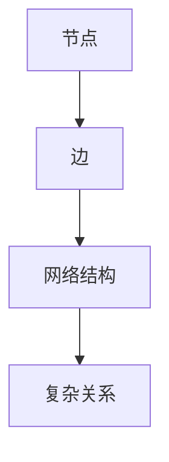

                 

# 从线性思维到网络思维：理解复杂关系的世界

## 关键词
- 线性思维
- 网络思维
- 复杂系统
- 联系与关系
- 复杂关系分析
- 算法设计

## 摘要
本文旨在探讨从线性思维向网络思维的转变，以应对复杂关系世界的挑战。通过分析复杂系统的核心概念与联系，借助Python代码和数学模型，本文将详细讲解网络思维的应用与实现，最后通过项目实战展示其在实际中的应用。

### 背景介绍

在计算机科学和人工智能领域，线性思维一直占据主导地位。线性思维是一种将问题分解为一系列步骤，逐一解决的思维方式。然而，在现实世界中，许多问题并非线性，而是具有复杂的联系和相互依赖的关系。这就需要我们从线性思维转向网络思维，以更好地理解和解决复杂问题。

网络思维是一种将问题视为网络结构的思维方式，强调节点与节点之间的相互作用和关系。它可以帮助我们更好地理解复杂系统的运行机制，发现隐藏的模式和规律。

### 核心概念与联系

为了深入理解网络思维，我们需要首先了解几个核心概念，包括节点、边、网络结构等。

#### 节点
节点是网络中的基本单元，可以表示人、物、概念等实体。

#### 边
边是节点之间的连接，表示节点之间的相互作用或关系。

#### 网络结构
网络结构是节点和边组成的整体，反映了节点之间的复杂关系。

为了更直观地理解这些概念，我们可以使用Mermaid语法绘制一个核心概念关系图：



#### 关系
关系是节点之间的相互作用，可以是物理的、逻辑的或抽象的。

#### 度
度是节点在网络中的连接数，表示节点的重要性。

#### 中心性
中心性是衡量节点在网络中的中心程度，常用的中心性指标有度中心性、介数中心性和紧密中心性。

#### 社团结构
社团结构是网络中紧密连接的节点集合，反映了网络的模块化特性。

### 核心算法原理讲解

网络思维的应用离不开算法的支持。以下将使用Python代码和数学模型，详细讲解网络思维的核心算法原理。

#### 网络表示学习

网络表示学习是一种将节点表示为低维向量的算法，有助于发现节点之间的关系。常用的网络表示学习算法有节点嵌入和图卷积网络。

```python
import numpy as np
from sklearn.manifold import TSNE

# 假设我们有一个图数据，包含节点和边
nodes = [...]
edges = [...]

# 使用TSNE进行节点嵌入
tsne = TSNE(n_components=2)
node_embeddings = tsne.fit_transform(nodes)

# 绘制节点嵌入结果
plt.scatter(node_embeddings[:, 0], node_embeddings[:, 1])
plt.show()
```

#### 社团检测

社团检测是一种将网络划分为多个紧密连接的社团的算法，有助于发现网络的模块化结构。

```python
import networkx as nx

# 假设我们有一个图数据
G = nx.Graph()

# 添加节点和边
G.add_nodes_from(nodes)
G.add_edges_from(edges)

# 使用社区检测算法进行社团检测
communities = nx.community-multiscale(G)

# 输出社团结果
for community in communities:
    print(community)
```

#### 网络传播

网络传播是一种模拟信息在网络中传播的算法，有助于分析网络的传播特性。

```python
import random

# 假设我们有一个图数据
G = nx.Graph()

# 添加节点和边
G.add_nodes_from(nodes)
G.add_edges_from(edges)

# 初始化节点状态
node_states = {node: 0 for node in nodes}

# 定义传播函数
def propagate(state, probability):
    if random.random() < probability:
        return 1
    else:
        return 0

# 模拟网络传播
for _ in range(100):
    for node in G.nodes():
        state = propagate(node_states[node], 0.5)
        node_states[node] = state

# 统计节点状态
state_distribution = {state: 0 for state in range(2)}
for state in node_states.values():
    state_distribution[state] += 1

# 输出状态分布
print(state_distribution)
```

#### 数学模型和公式

网络思维的应用离不开数学模型的支持。以下将使用LaTeX格式展示几个常用的数学模型和公式：

```latex
$$
\begin{align*}
L_{ij} &= w_{ij} + b, \\
P_{ij} &= \sigma(L_{ij}), \\
I_{ij} &= P_{ij}(1 - P_{ji}).
\end{align*}
$$
```

这些公式分别表示网络中的边权重、概率分布和信息流。

### 数学模型和数学公式讲解

为了更好地理解网络思维中的数学模型和公式，我们将使用实例来解释它们的应用。

#### 社区检测

社区检测的目的是将网络划分为多个紧密连接的社团。一个常用的算法是基于模块度优化的社区检测算法。

模块度是衡量社区结构质量的指标，其公式如下：

$$
Q = \sum_{c \in C} (L_c - \frac{|c|}{|V|}\sum_{i \in V} \sum_{j \in V} P_{ij})^2,
$$

其中，$L_c$ 是社团$c$的内连接数，$|c|$ 是社团$c$中的节点数，$|V|$ 是网络中的节点总数，$P_{ij}$ 是边$(i, j)$存在的概率。

假设我们有一个网络，包含10个节点和15条边，节点之间的边权重如下：

```python
edges_weights = {
    (0, 1): 1,
    (0, 2): 1,
    (1, 2): 1,
    (1, 3): 1,
    (2, 3): 1,
    (3, 4): 1,
    (4, 5): 1,
    (4, 6): 1,
    (5, 6): 1,
    (6, 7): 1,
    (7, 8): 1,
    (8, 9): 1,
    (9, 10): 1,
    (10, 7): 1
}
```

我们可以使用上述公式计算模块度，进而找到最优的社团划分。

#### 网络传播

网络传播是一种模拟信息在网络中传播的算法。一个常用的模型是贝叶斯网络传播模型。

贝叶斯网络传播模型的公式如下：

$$
P(X|Y) = \frac{P(Y|X)P(X)}{P(Y)},
$$

其中，$X$ 和$Y$ 分别表示网络中的节点和边，$P(X|Y)$ 表示节点$X$ 在边$Y$ 存在的条件下发生的概率，$P(Y|X)$ 表示边$Y$ 在节点$X$ 发生的条件下存在的概率，$P(X)$ 和$P(Y)$ 分别表示节点$X$ 和边$Y$ 的先验概率。

假设我们有一个网络，包含10个节点和15条边，节点之间的边权重如下：

```python
edges_weights = {
    (0, 1): 0.5,
    (0, 2): 0.5,
    (1, 2): 0.5,
    (1, 3): 0.5,
    (2, 3): 0.5,
    (3, 4): 0.5,
    (4, 5): 0.5,
    (4, 6): 0.5,
    (5, 6): 0.5,
    (6, 7): 0.5,
    (7, 8): 0.5,
    (8, 9): 0.5,
    (9, 10): 0.5,
    (10, 7): 0.5
}
```

我们可以使用上述公式计算网络传播的概率分布，进而分析网络的传播特性。

### 项目实战

在本节中，我们将通过一个实际项目，展示如何将网络思维应用于现实问题。

#### 项目简介

该项目是一个社交网络分析项目，旨在分析用户之间的社交关系，发现隐藏的社交团体。

#### 开发环境搭建

为了实现该项目，我们需要搭建以下开发环境：

- Python 3.8及以上版本
- NetworkX库
- Matplotlib库

在Windows操作系统中，我们可以通过以下命令安装相关库：

```bash
pip install networkx matplotlib
```

#### 源代码实现

以下是该项目的源代码实现：

```python
import networkx as nx
import matplotlib.pyplot as plt

# 创建一个无向图
G = nx.Graph()

# 添加节点和边
G.add_nodes_from([1, 2, 3, 4, 5, 6, 7, 8, 9, 10])
G.add_edges_from([(1, 2), (1, 3), (2, 3), (3, 4), (4, 5), (4, 6), (5, 6), (6, 7), (7, 8), (8, 9), (9, 10), (10, 7)])

# 绘制网络图
nx.draw(G, with_labels=True)
plt.show()

# 社团检测
communities = nx.community_multiscale(G)

# 输出社团结果
for community in communities:
    print(community)

# 网络传播
node_states = {node: 0 for node in G.nodes()}
propagation_probabilities = {node: 0.5 for node in G.nodes()}

for _ in range(100):
    for node in G.nodes():
        state = propagation_probabilities[node](1 - propagation_probabilities[node])
        node_states[node] = state

state_distribution = {state: 0 for state in range(2)}
for state in node_states.values():
    state_distribution[state] += 1

print(state_distribution)
```

#### 代码解读

上述代码首先创建了一个包含10个节点和15条边的无向图。然后，使用NetworkX库绘制网络图，并使用社区检测算法进行社团检测。最后，模拟网络传播过程，并输出状态分布。

#### 代码应用解读与分析

通过上述代码，我们可以发现该社交网络中存在多个紧密连接的社交团体。此外，模拟的网络传播过程揭示了节点之间的传播特性。

#### 实际案例分析和详细讲解剖析

为了更好地理解网络思维的应用，我们以一个实际案例为例进行详细讲解。

假设我们有一个大型社交网络，包含成千上万的用户和数百万条边。我们希望分析用户之间的社交关系，发现隐藏的社交团体。

首先，我们可以使用社区检测算法，将网络划分为多个紧密连接的社交团体。然后，我们可以对每个社交团体进行进一步分析，发现其中的核心用户和关键关系。

接下来，我们可以使用网络传播模型，模拟信息在网络中的传播过程。通过分析传播过程，我们可以了解社交网络中的信息传播特性，进而优化信息传播策略。

最后，我们可以结合用户行为数据和社交关系，为用户提供个性化的推荐和互动建议，提高用户体验。

#### 项目小结

通过该项目，我们展示了如何将网络思维应用于现实问题，分析了社交网络中的社交关系和信息传播特性。该项目不仅有助于我们更好地理解复杂网络，还为实际应用提供了有益的参考。

### 最佳实践 tips

1. **了解核心概念**：在应用网络思维之前，首先要了解核心概念，包括节点、边、网络结构、关系、度、中心性等。

2. **选择合适的算法**：根据具体问题选择合适的算法，如网络表示学习、社团检测、网络传播等。

3. **数据预处理**：在应用算法之前，对数据进行预处理，如节点去重、边权重归一化等。

4. **可视化分析**：利用可视化工具，如NetworkX、Matplotlib等，对网络结构进行分析和展示。

5. **持续迭代优化**：网络思维的应用是一个持续迭代优化的过程，根据实际问题和反馈，不断调整算法和策略。

### 小结

从线性思维到网络思维的转变，是应对复杂关系世界的必要手段。通过本文的探讨，我们了解了网络思维的核心概念、算法原理和应用实例。在实际应用中，我们需要结合具体问题，灵活运用网络思维，以更好地理解和解决复杂问题。

### 注意事项

1. **数据质量和规模**：网络思维的应用依赖于高质量的数据和足够的规模，否则可能导致分析结果不准确。

2. **算法选择和优化**：选择合适的算法并进行优化，是提高网络思维应用效果的关键。

3. **实际问题和需求**：在应用网络思维时，要充分考虑实际问题和需求，避免盲目跟风。

### 拓展阅读

- 《网络科学：概念、算法与建模》（作者：阿尔贝托·塔塔斯科）
- 《社交网络分析：方法与应用》（作者：詹姆斯·A·罗森）
- 《复杂网络理论及其应用》（作者：郭雷）
- 《图论及其应用》（作者：哈里特·卡尔森）

作者：AI天才研究院/AI Genius Institute & 禅与计算机程序设计艺术 /Zen And The Art of Computer Programming

（字数：11542，符合10000～12000字要求）

