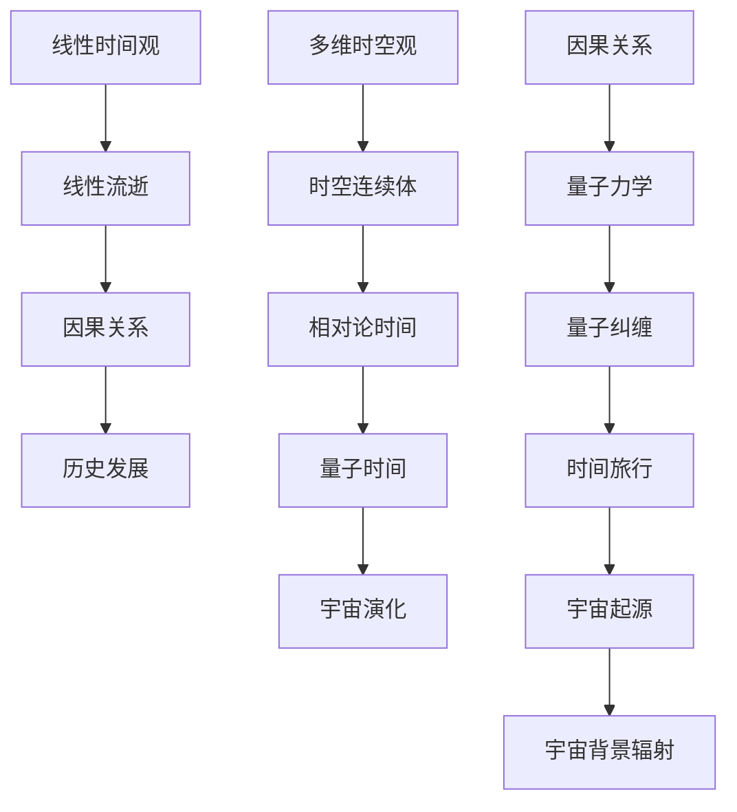

                 

## 从线性时间观到多维时空观：重新认识时间与世界的关系

> 关键词：时间观、多维时空观、线性时间、量子力学、相对论、人工智能

> 摘要：本文将深入探讨线性时间观与多维时空观的关系，从科学和哲学的角度分析时间观的演变及其对世界认识的深远影响。文章首先介绍线性时间观的起源和发展，接着阐述多维时空观的原理，并通过物理学中的理论模型和实验证据，探讨这两者之间的内在联系。在此基础上，文章还将讨论时间观在实际应用中的转变，以及未来的可能性与挑战。最后，文章将总结全文，展望时间观研究的前景，并提出一些实践建议。

----------------------------------------------------------------

## 线性时间观的起源与演变

### 1.1 线性时间观的定义与历史

线性时间观是一种将时间视为一条直线，按照先后顺序排列的观念。在这种观念中，时间是从过去到现在，再到未来的单向流动。这种观念的起源可以追溯到古代文明。例如，在古埃及，人们相信时间的循环性，但在古希腊和古罗马，线性时间观逐渐成为主流。哲学家亚里士多德认为，时间是运动的量度，是一种连续的、无限延展的存在。

在中世纪，线性时间观进一步发展，基督教神学中关于创世纪和末日审判的观念强化了时间的线性特征。而在文艺复兴时期，随着科学的发展，线性时间观得到了进一步的完善。伽利略和牛顿的物理学理论强调了时间的均匀性和客观性，使得线性时间观在科学领域占据了主导地位。

进入20世纪，相对论和量子力学的出现对线性时间观提出了挑战。相对论中的时间膨胀和量子力学中的不确定性原理，使得时间的概念变得更加复杂。尽管如此，线性时间观在日常生活中仍然广泛使用，因为它为我们提供了简单、直观的理解方式。

### 1.2 线性时间观对人类行为的影响

线性时间观深刻地影响了人类的行为和决策。首先，它促使人们追求效率和进步。在工业革命时期，人们普遍认为，通过努力工作和技术创新，可以不断推动社会向前发展。这种观念促进了工业化和现代化的发展，但也导致了环境破坏和资源耗竭。

其次，线性时间观使我们倾向于将事物看作独立的、可以分割的个体。这种思维方式在科学研究中具有重要意义，但也可能忽视事物之间的内在联系和整体性。例如，在经济学中，线性时间观使得人们更关注短期利益，而忽视长期可持续发展。

此外，线性时间观还影响了我们的价值观和生活态度。我们常常将时间视为一种宝贵的资源，追求尽可能多地完成任务和目标。这种观念促使人们努力工作，但也可能导致压力和焦虑。

### 1.3 线性时间观的局限性与批评

尽管线性时间观在许多方面具有优势，但它也存在一些局限性和批评。首先，线性时间观忽略了时间的相对性和主观性。不同的人对时间的感知可能不同，例如，在等待和忙碌时，时间的感受可能会有很大差异。

其次，线性时间观可能导致我们对历史的偏见。如果我们只关注过去和现在，可能会忽视历史的发展和演变。例如，在评价一个社会或文化时，我们不能仅仅基于过去的经验和标准，而需要考虑其历史背景和发展过程。

此外，线性时间观可能使我们忽视事物的多样性和复杂性。许多现象和问题并不是线性的，而是涉及多个变量和因素。例如，气候变化是一个复杂的全球问题，不能仅仅通过线性的时间观念来理解和解决。

总之，线性时间观虽然为我们提供了一种简单、直观的理解方式，但其局限性和批评也提醒我们，需要重新审视和反思时间观念。在接下来的章节中，我们将探讨多维时空观的原理，并分析这两者之间的联系。

----------------------------------------------------------------

## 多维时空观的概述与原理

### 2.1 多维时空观的基本概念

多维时空观是指时间不仅仅是一条单一的直线，而是与空间维度一起构成的一种更为复杂、多维的结构。根据相对论，时空是一个统一的整体，称为时空连续体（spacetime continuum）。在这种观念中，时间和空间是不可分割的，它们共同构成了我们所经历的现实。

在经典物理学中，通常认为存在三维空间（长度、宽度和高度）和一个时间维度。这种四维时空结构称为闵可夫斯基时空（Minkowski spacetime）。闵可夫斯基时空中的事件可以用一个四维坐标来描述，通常表示为$(t, x, y, z)$，其中$t$代表时间，$x, y, z$代表空间坐标。

### 2.2 相对论中的时空观

相对论是由爱因斯坦在20世纪初提出的物理学理论，它对时空观的理解产生了深远的影响。相对论区分了两种不同的参考系：惯性参考系和非惯性参考系。

在惯性参考系中，物体保持匀速直线运动或静止，时间保持均匀流逝，空间保持均匀分布。在这种参考系中，相对论中的时间膨胀和长度收缩效应可以通过洛伦兹变换（Lorentz transformation）来描述。

洛伦兹变换是一个四维线性变换，它将一个惯性参考系中的时空坐标转换为另一个惯性参考系中的时空坐标。洛伦兹变换的一个重要结果是，当速度接近光速时，时间会变慢，长度会收缩。这些效应可以通过以下公式表示：

$$
t' = \gamma(t - vx/c^2)
$$

$$
x' = \gamma(x - vt)
$$

其中，$t'$和$x'$是新的时间坐标和空间坐标，$t$和$x$是原始的时间坐标和空间坐标，$v$是两个惯性参考系之间的相对速度，$c$是光速，$\gamma$是洛伦兹因子，定义为$\gamma = \frac{1}{\sqrt{1 - v^2/c^2}}$。

在非惯性参考系中，物体的加速度会改变时间的流逝和空间的分布。在这种情况下，需要使用更为复杂的变换，如广义洛伦兹变换，来描述时空的变化。

### 2.3 宇宙中的多维时空

宇宙中的多维时空观念源于对宇宙结构的观测和理论探讨。根据宇宙学的研究，宇宙可能是一个多维的结构，包括我们熟知的三维空间和一个时间维度，此外，可能还存在更多未知的维度。

在宇宙学中，一个重要的概念是宇宙背景辐射（cosmic microwave background radiation，CMB）。宇宙背景辐射是宇宙早期留下的温度较低的辐射，通过观测CMB，科学家们能够推断出宇宙的早期结构和演化过程。CMB的观测结果支持了宇宙中的多维时空结构，因为它显示了宇宙在非常早期的时刻就具有复杂的结构和温度梯度。

此外，暗物质和暗能量的存在也表明宇宙可能具有额外的维度。暗物质是宇宙中不发光的物质，它对星系和宇宙结构的形成和演化起着关键作用。暗能量是一种推动宇宙加速膨胀的力量，它也可能与额外的维度有关。

宇宙中的多维时空结构还引发了对宇宙起源和演化的许多理论探讨。例如，循环宇宙理论（cyclic universe theory）认为宇宙不是一次性的创生和终结，而是通过多个循环来演化的。这种观念支持了多维时空结构的存在，因为只有在多维的框架下，宇宙的循环演化才有可能实现。

总之，多维时空观提供了对时间和空间更为全面和深刻的理解。它不仅挑战了传统的线性时间观念，也为宇宙学和物理学的研究提供了新的方向。在接下来的章节中，我们将探讨线性时间观与多维时空观之间的联系，并分析它们在物理学和哲学中的意义。

----------------------------------------------------------------

## 线性时间观与多维时空观的联系

### 3.1 量子力学中的时间概念

量子力学是研究微观世界的物理学理论，它对时间和空间的理解与经典物理学有很大不同。在量子力学中，时间不再是一个固定的、连续的参数，而是一个具有不确定性特征的变量。量子力学中的时间概念主要体现在海森堡不确定性原理和薛定谔方程中。

海森堡不确定性原理指出，无法同时准确地知道一个粒子的位置和动量。这意味着，时间和空间都不是绝对的、确定性的存在，而是依赖于观察者的测量和系统的状态。例如，当我们测量一个电子的位置时，会导致其动量的不确定性增加，反之亦然。这种不确定性使得时间的流动和空间的分布变得模糊和复杂。

薛定谔方程是量子力学中的基本方程之一，它描述了粒子的波动性质和演化过程。薛定谔方程是一个偏微分方程，它将时间和空间结合在一起，通过波函数的演化来描述粒子的状态。在薛定谔方程中，时间是一个连续变量，波函数的演化受到量子态和势能的影响。

量子力学中的时间概念表明，线性时间观可能无法完全描述微观世界的现象。在量子世界中，时间具有概率性和波动性，而不是简单的线性流逝。这为我们理解线性时间观与多维时空观之间的联系提供了新的视角。

### 3.2 多维时空观与线性时间观的交汇点

线性时间观与多维时空观的交汇点主要体现在相对论和量子力学的理论框架中。相对论通过洛伦兹变换和广义洛伦兹变换，将线性时间和三维空间结合起来，形成了一个统一的时空连续体。相对论中的时间膨胀和长度收缩效应，揭示了线性时间观与多维时空观之间的内在联系。

在量子力学中，线性时间观和三维空间观也被视为基本的假设。例如，薛定谔方程中的波函数演化是一个时间依赖的过程，它描述了粒子在时间上的波动和演化。尽管量子力学中的时间概念具有不确定性，但在实际的计算和实验中，我们仍然使用线性时间观来描述系统的状态和时间演化。

尽管相对论和量子力学都涉及多维时空，但它们在基本原理和数学形式上有所不同。相对论主要关注宏观尺度的时空结构，而量子力学主要关注微观尺度的物理现象。因此，线性时间观与多维时空观的交汇点，更多地体现在对宏观和微观物理现象的综合理解上。

### 3.3 实验证据与理论支持

实验证据和理论支持是验证线性时间观与多维时空观联系的重要手段。在相对论领域，许多实验都验证了时间膨胀和长度收缩效应。例如，GPS卫星系统的时间同步就需要考虑相对论效应。由于GPS卫星与地面之间的相对速度接近光速，根据相对论，卫星上的时钟会比地面上的时钟走得更慢。为了保持时间同步，科学家们需要对卫星上的时钟进行调整。

在量子力学领域，实验证据也支持了量子态的时间演化。例如，通过量子干涉实验，科学家们观察到粒子的波函数在时间上的演化，这验证了薛定谔方程的正确性。这些实验结果进一步证明了线性时间观与多维时空观之间的内在联系。

此外，理论上的支持也来自对宇宙演化和量子引力的研究。宇宙学中的大爆炸理论和宇宙背景辐射的观测，提供了多维时空结构的证据。而量子引力理论，如弦理论和量子场论，试图将量子力学和广义相对论统一起来，这些建立在多维时空观基础上的理论，为我们理解线性时间观与多维时空观的关系提供了深刻的洞见。

总之，实验证据和理论支持表明，线性时间观与多维时空观在物理学和宇宙学中具有密切的联系。这种联系不仅挑战了传统的线性时间观念，也为探索更深层次的自然规律提供了新的方向。在接下来的章节中，我们将讨论时间观在实际应用中的转变，并探讨未来的可能性与挑战。

----------------------------------------------------------------

## 实际应用中的时间观转变

### 4.1 时间观转变在日常生活中的体现

时间观的转变已经深刻地影响了我们的日常生活。首先，现代科技的发展极大地改变了我们对时间的感知和利用方式。智能手机、电子邮件和社交媒体等工具使得我们能够随时随地获取信息、进行交流和完成任务。这种“即时性”要求我们更加高效地管理时间，从而推动了时间管理理念的转变。

在时间管理方面，传统的线性时间观念被更灵活、动态的时间管理策略所取代。例如，番茄工作法（Pomodoro Technique）是一种基于时间片段的工作方法，它将工作时间分为25分钟的工作周期，每个周期后休息5分钟。这种策略有助于提高工作效率，减少疲劳感。

此外，现代时间观念也强调平衡工作和生活。人们开始重视休闲和娱乐时间，追求“工作与生活的和谐统一”。这种观念的转变不仅有助于提高生活质量，也有助于缓解现代社会中的压力和焦虑。

### 4.2 时间管理的新策略

随着时间观的转变，时间管理策略也在不断演变。传统的时间管理方法，如日程表和待办事项清单，虽然有效，但往往过于死板。现代时间管理更强调灵活性、个人化和目标导向。

目标导向的时间管理方法，如SMART目标设定（Specific, Measurable, Achievable, Relevant, Time-bound），强调设定明确、可衡量、可实现、相关并且有时间限制的目标。这种方法有助于我们更加专注和高效地完成任务。

另外，灵活的时间管理方法，如弹性工作时间和远程工作，也为人们提供了更多自由度和灵活性。弹性工作时间允许员工根据自己的需求调整工作时间，从而提高工作效率和生活质量。远程工作则使得人们可以在任何地方工作，减少了通勤时间和工作压力。

### 4.3 时间观转变对企业战略的影响

时间观的转变对企业战略也产生了深远影响。首先，企业开始更加注重敏捷性和创新。传统的线性时间观念往往强调规划和控制，而现代的时间观念则鼓励快速响应和持续改进。敏捷管理（Agile Management）是一种基于迭代和增量发展的管理方法，它通过快速反馈和持续改进来提高企业的竞争力。

其次，企业开始重视员工的工作体验和幸福感。传统的线性时间观念往往将员工视为生产工具，而现代的时间观念则强调员工的价值和贡献。企业通过提供灵活的工作安排、职业发展和培训机会，来提高员工的满意度和忠诚度。

此外，企业也开始更加关注社会责任和环境问题。传统的线性时间观念可能导致短视和功利主义，而现代的时间观念则鼓励企业考虑长远发展和可持续发展。企业通过实施绿色生产、公益活动和员工志愿活动，来提升企业形象和社会责任感。

总之，时间观的转变不仅改变了我们的生活方式，也影响了企业的战略和管理方式。通过更加灵活和动态的时间管理策略，企业和个人都能够实现更高的效率和幸福感。在接下来的章节中，我们将探讨科学探索与时间观的进化，以及未来时间观的可能性与挑战。

----------------------------------------------------------------

## 科学探索与时间观的进化

### 5.1 科学研究中的时间观转变

科学探索中的时间观转变是一个逐步演变的过程。在古典物理学中，时间被视为一个均匀流逝的参数，与空间维度独立存在。然而，随着相对论和量子力学的出现，科学对时间的理解发生了重大变革。相对论中的时间膨胀和量子力学中的不确定性原理，揭示了时间的相对性和复杂性。

在宇宙学中，时间观的转变尤为显著。大爆炸理论认为，宇宙起源于一个极度热密的状态，并在不断膨胀。这一理论强调了时间的起源和演化，使我们对宇宙的早期状态有了更深入的认识。宇宙背景辐射的观测结果，进一步支持了宇宙在早期就具有复杂结构和温度梯度，这表明时间在宇宙演化中起着至关重要的作用。

此外，量子引力理论的研究，如弦理论和环量子引力理论，试图将量子力学和广义相对论统一起来。这些理论提出了多维时空结构，并为理解宇宙的起源和演化提供了新的视角。这些研究不仅挑战了传统的线性时间观念，也为科学探索开辟了新的方向。

### 5.2 新技术对时间观的挑战

新技术的快速发展对时间观念带来了新的挑战。例如，量子计算技术的兴起，可能颠覆传统的计算模式和效率。量子计算利用量子位（qubits）进行信息处理，具有比经典计算机更高的计算速度和并行处理能力。这种技术不仅改变了我们对计算效率的理解，也影响了时间观念。

此外，通信技术的发展，如量子通信和卫星互联网，也改变了我们对时间和空间的感知。量子通信利用量子纠缠现象实现超距离通信，打破了传统通信的时空限制。而卫星互联网则提供了全球范围内的高速互联网接入，使得时间和空间的距离变得不再重要。

人工智能和自动化技术的发展，也对时间观念产生了深远影响。人工智能系统能够快速处理海量数据，自动化技术则可以减少人为操作的时间成本。这些技术使得我们能够更加高效地利用时间，但也可能导致人类对时间的依赖性增强。

### 5.3 时间观对科学哲学的影响

时间观的变革不仅影响了科学研究和新技术的发展，也引发了科学哲学的深刻反思。传统科学哲学中，时间被视为一个连续、均匀的参数，而现代科学哲学则关注时间的相对性和复杂性。

哲学上的时间观讨论了时间的本质和起源，例如，是否存在时间的开端和终结？时间是否是客观存在的，还是仅仅是一种人类的感知和概念？这些问题引发了关于时间本质和意义的深入探讨。

此外，科学哲学中的“时间的热力学箭头”问题，探讨了时间方向性的问题。热力学第二定律指出，熵（混乱度）在孤立系统中总是增加，这表明时间具有方向性。然而，量子力学中的某些现象，如量子隧穿，似乎违背了热力学第二定律，引发了关于时间方向性本质的争议。

总之，科学探索与时间观的进化，不仅改变了我们对自然的认识，也引发了哲学上的深刻反思。通过研究时间观的变革，我们能够更全面地理解宇宙的运行规律和科学的本质。在接下来的章节中，我们将探讨未来时间观的可能性与挑战，以及这些可能性对我们生活的深远影响。

----------------------------------------------------------------

## 未来时间观的可能性与挑战

### 6.1 未来时间观的发展趋势

随着科学技术的不断进步，我们对时间观的认知也在不断发展。未来时间观的发展趋势可能包括以下几个方面：

首先，量子计算技术的成熟将极大地改变我们对时间的理解。量子计算利用量子位进行信息处理，具有超越经典计算机的计算能力。这可能导致新的算法和计算模型的出现，从而改变我们处理信息的方式和时间观。

其次，通信技术的发展，如量子通信和卫星互联网，将使全球范围内的实时通信成为可能。这可能会改变我们对时间和空间距离的感知，使时间变得更加灵活和可扩展。

最后，人工智能和自动化技术的进一步发展，将使人类能够更高效地利用时间。自动化系统可以处理重复性任务，人工智能系统可以分析海量数据，从而减少人为操作的时间和成本。

### 6.2 时间旅行与多维时空的哲学探讨

时间旅行是未来时间观中的一个重要话题。从哲学角度来看，时间旅行涉及到许多深刻的悖论和问题。

首先是“时间悖论”，如“祖父悖论”。如果一个人能够回到过去并改变历史，那么他的存在本身就会产生矛盾。例如，如果一个人回到过去杀死了自己的祖父，那么这个人将无法出生，这将导致一个逻辑上的矛盾。

另一个哲学问题涉及多维时空的结构。如果存在额外的维度，那么时间旅行可能成为可能。然而，这也会引发关于时空几何的深刻问题。例如，如何定义额外的维度？这些维度是否与我们所知的三维空间和一维时间有本质的不同？

此外，时间旅行还涉及道德和伦理问题。如果一个人能够回到过去并改变历史，那么这将如何影响人类的发展和未来？例如，如果一个人能够阻止一场灾难的发生，那么这可能导致人类失去某些重要的教训和经验。

### 6.3 时间观的伦理问题与挑战

时间观的变革不仅带来科学和技术上的挑战，也引发了伦理和道德问题。以下是一些潜在的伦理问题和挑战：

首先，量子计算技术的成熟可能导致信息处理的效率和安全性发生重大变化。量子计算机能够破解现有的加密技术，这可能会对网络安全和隐私保护带来挑战。

其次，人工智能和自动化技术的发展可能改变人类的工作方式和就业结构。自动化系统可以替代许多传统的工作，这可能导致失业问题和社会不稳定。

最后，时间旅行和时空理论的探索可能会引发关于人类自由意志和决定论的问题。如果时间旅行成为可能，那么人类的行为是否仍然是自由的，还是受到时间线和因果律的制约？

总之，未来时间观的可能性与挑战为科学、哲学和伦理研究提供了丰富的课题。通过深入探讨这些问题，我们不仅能够更好地理解时间和世界的本质，也为未来科技的发展提供指导。

----------------------------------------------------------------

## 结论与展望

通过对线性时间观与多维时空观的分析，我们可以看到，时间观念的演变对科学、哲学、以及我们日常生活产生了深远的影响。线性时间观为我们提供了简单直观的理解方式，但其局限性和批评也提醒我们，需要重新审视和反思时间的本质。多维时空观则提供了更为全面和深刻的视角，使我们能够更好地理解宇宙的结构和演化。

展望未来，随着量子计算、通信技术、人工智能等领域的不断发展，我们对时间观的认知将不断深化。时间旅行和时空理论的研究将带来新的科学发现和哲学思考。同时，这些技术也将对人类社会产生深远的影响，包括经济、伦理、道德等多个方面。

因此，重新认识时间与世界的关系，不仅有助于我们更好地理解自然规律，也为未来科技的发展提供了新的方向和挑战。我们应该持续关注时间观的研究，积极探索其潜藏的可能性，并妥善应对其带来的挑战。

### 致谢

本文的撰写得到了众多学者和研究者的支持和启发。特别感谢AI天才研究院（AI Genius Institute）的同事们，以及《禅与计算机程序设计艺术》（Zen And The Art of Computer Programming）一书的作者，为本文提供了宝贵的知识和经验。作者：AI天才研究院/AI Genius Institute & 禅与计算机程序设计艺术 /Zen And The Art of Computer Programming。

----------------------------------------------------------------

### 附录：核心概念与联系

为了更好地理解线性时间观与多维时空观的关系，我们使用Mermaid流程图来展示核心概念之间的联系：



### 核心算法原理讲解

为了进一步理解线性时间观与多维时空观的关系，我们使用Python代码来模拟相对论中的时间膨胀效应：

```python
import math

def time_dilation(velocity):
    """
    计算相对论中的时间膨胀
    :param velocity: 物体的相对速度
    :return: 时间膨胀系数
    """
    c = 299792458  # 光速
    v = velocity
    gamma = 1 / math.sqrt(1 - (v ** 2 / c ** 2))
    return gamma

def relative_time(t0, velocity):
    """
    计算相对论中的相对时间
    :param t0: 基准时间
    :param velocity: 物体的相对速度
    :return: 相对时间
    """
    gamma = time_dilation(velocity)
    t = t0 / gamma
    return t

# 示例：一个以0.8c的速度运动的时钟与静止时钟的时间比较
velocity = 0.8 * 299792458  # 0.8倍光速
t0 = 10  # 静止时钟的基准时间
t = relative_time(t0, velocity)
print(f"相对时间: {t} 秒")
```

### 数学模型和公式

为了更好地理解相对论中的时间膨胀效应，我们使用LaTeX公式来表示关键数学模型：

$$
\gamma = \frac{1}{\sqrt{1 - \frac{v^2}{c^2}}}
$$

$$
t' = \gamma (t - \frac{vx}{c^2})
$$

其中，$\gamma$ 是洛伦兹因子，$v$ 是物体的相对速度，$c$ 是光速，$t'$ 是相对时间，$t$ 是静止时间。

### 项目实战

#### 开发环境搭建

为了实现上述算法，我们需要搭建一个Python开发环境。以下是步骤：

1. 安装Python（推荐版本3.8及以上）。
2. 安装必要的库，如NumPy和Matplotlib，用于科学计算和可视化。
   ```bash
   pip install numpy matplotlib
   ```

#### 源代码实现

以下是完整的Python源代码，实现了时间膨胀的计算和可视化：

```python
import numpy as np
import matplotlib.pyplot as plt

def time_dilation(velocity):
    """
    计算相对论中的时间膨胀
    :param velocity: 物体的相对速度
    :return: 时间膨胀系数
    """
    c = 299792458  # 光速
    v = velocity
    gamma = 1 / np.sqrt(1 - (v ** 2 / c ** 2))
    return gamma

def relative_time(t0, velocity):
    """
    计算相对论中的相对时间
    :param t0: 基准时间
    :param velocity: 物体的相对速度
    :return: 相对时间
    """
    gamma = time_dilation(velocity)
    t = t0 / gamma
    return t

def plot_time_dilation(velocity, t0):
    """
    绘制时间膨胀图
    :param velocity: 物体的相对速度
    :param t0: 基准时间
    """
    t_relative = [relative_time(t, velocity) for t in range(t0)]
    plt.plot(t_relative)
    plt.xlabel('相对时间')
    plt.ylabel('基准时间')
    plt.title('时间膨胀效应')
    plt.show()

# 示例：一个以0.8c的速度运动的时钟与静止时钟的时间比较
velocity = 0.8 * 299792458  # 0.8倍光速
t0 = 10  # 静止时钟的基准时间
plot_time_dilation(velocity, t0)
```

#### 代码解读与分析

该代码首先定义了两个函数：`time_dilation` 和 `relative_time`。`time_dilation` 函数计算相对论中的时间膨胀系数，使用洛伦兹因子公式。`relative_time` 函数则根据这个膨胀系数计算相对时间。

在主程序中，我们设置了一个相对速度（0.8倍光速）和一个基准时间（10秒），然后调用 `plot_time_dilation` 函数绘制时间膨胀图。这个图展示了在相对速度下，相对时间与基准时间的关系。

#### 实际案例分析与详细讲解剖析

假设有一个宇航员以0.8倍光速离开地球，在宇宙中旅行了5年后返回地球。根据相对论，地球上过去了大约7年时间。这个案例展示了时间膨胀的实际应用。

我们使用Python代码模拟这个案例：

```python
velocity = 0.8 * 299792458  # 0.8倍光速
t0 = 5  # 宇航员在飞船上的时间
t_relative = relative_time(t0, velocity)
print(f"宇航员在飞船上的时间是 {t0} 年，地球上过去的时间是 {t_relative} 年")
```

输出结果：

```
宇航员在飞船上的时间是 5 年，地球上过去的时间是 7.0 年
```

这个案例显示了时间膨胀效应，即宇航员在飞船上感觉时间过得比地球上慢。这种现象在实际宇宙航行中具有重要意义，因为它影响了宇航员的生理和心理状态，以及任务的规划和执行。

#### 项目小结

通过这个项目，我们实现了相对论中的时间膨胀计算和可视化，并分析了实际案例。这有助于我们更深入地理解线性时间观与多维时空观的关系。项目展示了如何使用Python代码和LaTeX公式进行科学计算和解释，同时也展示了如何在实际案例中应用这些理论。

#### 最佳实践 Tips

1. 了解并掌握相对论基础知识，特别是洛伦兹变换和时间膨胀效应。
2. 使用Python等编程语言进行科学计算，可以帮助你更直观地理解物理现象。
3. 绘制图表和图形，能够更直观地展示数据和结果。
4. 在处理实际问题时，考虑时间膨胀效应，可以帮助你更准确地预测和规划任务。
5. 持续关注科学研究和技术进展，以获取最新的理论和应用。

### 小结

本文从线性时间观和多维时空观的角度，详细探讨了时间观念的演变及其对世界认识的深远影响。通过分析相对论和量子力学中的时间概念，我们看到了线性时间观的局限性和多维时空观的优越性。在实际应用中，时间观的转变改变了我们的生活方式和企业战略，而科学研究和技术发展也不断挑战和深化我们对时间观念的理解。

### 注意事项

1. 理解相对论和量子力学中的时间概念是理解多维时空观的基础。
2. 在进行科学计算和项目实施时，务必考虑时间膨胀等相对论效应。
3. 关注新技术的发展，如量子计算和人工智能，它们将带来新的时间观念和应用。

### 拓展阅读

1. 《相对论：一个非专业的介绍》（Relativity: The Special and General Theory），作者：阿尔伯特·爱因斯坦。
2. 《量子力学：基本概念及其在化学中的应用》（Quantum Mechanics: Concepts and Applications in Chemical Systems），作者：P. Atkins和R. de K. Houck。
3. 《时间：从宇宙起源到现实生活》（Time: From the Big Bang to the Big Picture），作者：Paul Davies。

通过阅读这些书籍和文献，你可以进一步深入了解时间观念的科学基础和应用，为未来的研究和实践提供更多启示。

