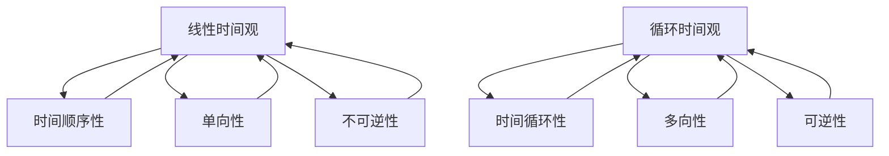

                 

### 从线性时间观到循环时间观：理解时间与世界

在人类漫长的历史长河中，对时间的认知经历了不断的演变。传统观念中，我们通常将时间视为一条直线，从过去延伸到现在，再指向未来。这种线性时间观深入人心，它反映了人们对时间和事件的顺序性、单向性和不可逆性的理解。然而，随着科学的发展，尤其是量子力学和宇宙学的进步，一种全新的时间观——循环时间观逐渐浮现。本文旨在探讨从线性时间观到循环时间观的转变，通过逻辑清晰的步骤分析，帮助读者理解时间与世界的本质。

### 关键词

- **线性时间观**
- **循环时间观**
- **宇宙循环论**
- **量子力学**
- **哲学**
- **宗教**

### 摘要

本文首先回顾了线性时间观的定义、特点和现实生活中的应用，接着介绍了循环时间观的核心概念和与线性时间观的区别。随后，文章探讨了循环时间观的科学依据，包括宇宙循环论、量子力学中的循环时间观和生物学的循环时间观。此外，还介绍了循环时间观在哲学和宗教中的应用，以及其对人类生活和决策的影响。最后，文章展望了循环时间观在可持续发展、人工智能和未来社会中的潜在影响。

## 第1章: 线性时间观概述

### 1.1 线性时间观的定义

线性时间观，顾名思义，是将时间视为一条直线，从过去延伸到现在，再指向未来。这种观念认为时间具有明确的起点和终点，且一旦过去就无法回到。具体来说，线性时间观有以下几个核心要素：

1. **时间顺序性**：时间具有明确的顺序，过去、现在和未来依次发生。
2. **单向性**：时间只能向前流动，不能倒流。
3. **不可逆性**：事件一旦发生，其结果无法改变。

这种观念深刻地影响了我们对世界的认知。在日常生活中，我们遵循着从出生到成长再到死亡的线性过程；在历史研究中，我们通过记载和回顾过去的事件来理解历史的发展。线性时间观是大多数人内心深处的世界观。

### 1.2 线性时间观的特点

线性时间观的特点主要包括以下几个方面：

1. **时间顺序性**：线性时间观强调时间的先后顺序，即过去、现在和未来在时间轴上依次排列。
   
2. **单向性**：时间只能向前流动，人们无法回到过去，也无法预见未来。这种单向性使时间具有独特的价值，因为每个时刻都是独一无二的。

3. **不可逆性**：一旦某个事件发生，其结果就无法改变。这种不可逆性使得我们更加珍惜现在，并从中学习经验。

### 1.3 线性时间观在生活中的体现

线性时间观在现实生活中无处不在。以下是一些具体体现：

1. **个人成长**：从出生到成长、再到成家立业，每个人的生命都遵循着一条线性时间线。这种线性成长观帮助人们规划自己的生活，设定目标和计划。

2. **历史发展**：历史学家通过记录过去的事件来研究历史的发展。历史被认为是线性发展的，每个时代都有其特定的特点和意义。

3. **日常作息**：人们遵循固定的作息时间，如早晨起床、工作、晚餐和休息。这种线性时间安排帮助我们有效地管理时间和提高效率。

### 1.4 线性时间观与现代科学的关系

线性时间观与现代科学有着紧密的联系。以下是几个例子：

1. **进化理论**：达尔文的进化论基于线性时间观，认为物种在时间轴上逐渐进化，从简单到复杂。

2. **宇宙学**：广义相对论和宇宙大爆炸理论都基于线性时间观，认为宇宙从一个大爆炸点开始，逐渐演化至今。

3. **经济学**：经济学中的许多模型，如边际效用理论和资本时间价值理论，都假设时间具有线性特性。

通过回顾线性时间观的定义、特点以及它在生活中的体现和与现代科学的关系，我们可以更好地理解这种时间观的深层含义。然而，随着科学的不断进步，人们开始意识到线性时间观可能并不是时间的全部。接下来，我们将探讨一种全新的时间观——循环时间观。

## 第2章: 循环时间观的引入

在深入探讨循环时间观之前，我们需要先了解线性时间观的局限。线性时间观虽然提供了我们对时间的直观理解，但在解释宇宙的某些现象时显得力不从心。例如，量子力学中的某些现象和时间在宇宙尺度上的循环性，都无法完全用线性时间观来解释。因此，科学家们开始探索一种更为复杂和全面的时间观——循环时间观。

### 2.1 循环时间观的定义

循环时间观与线性时间观截然不同，它认为时间并不是一条直线，而是一个循环。在这种观念中，过去、现在和未来并不是依次发生，而是在循环中不断重复。具体来说，循环时间观有以下几个核心要素：

1. **时间循环性**：时间在循环中运行，每个时刻都会重复出现。
2. **多向性**：时间既可以向前流动，也可以向后流动。
3. **可逆性**：事件的结果可以逆转，回到过去的状态。

这种观念提供了一种全新的视角，让我们对时间的本质有了更深入的理解。例如，在宇宙循环论中，宇宙被认为会经历一个从诞生到消亡，再到重新诞生的循环过程。这种观念在量子力学中也有所体现，例如量子纠缠现象。

### 2.2 循环时间观的特点

循环时间观的特点可以从以下几个方面进行描述：

1. **时间循环性**：循环时间观认为时间是一个循环，每个时刻都在循环中反复出现。这意味着过去的事件并不是完全消失，而是在未来的某个时刻重新出现。

2. **多向性**：与线性时间观的单向性不同，循环时间观认为时间具有多向性。时间不仅可以向前流动，也可以向后流动，这意味着事件可以逆转。

3. **可逆性**：在循环时间观中，事件的结果可以逆转，回到过去的状态。这与线性时间观中不可逆的特性形成了鲜明对比。

这些特点使得循环时间观成为一种更为复杂和全面的时间观，它能够解释一些线性时间观无法解释的现象。例如，量子纠缠现象中的信息传输似乎不受时间顺序的限制，这与循环时间观的多向性和可逆性相符合。

### 2.3 循环时间观与线性时间观的区别

循环时间观与线性时间观之间有显著的差异。以下是它们的一些主要区别：

1. **时间顺序性**：线性时间观强调时间的顺序性，即过去、现在和未来依次发生。而循环时间观则认为时间是循环的，每个时刻都会重复出现。

2. **单向性**：线性时间观认为时间只能向前流动，不能倒流。而循环时间观则具有多向性，时间既可以向前流动，也可以向后流动。

3. **不可逆性**：线性时间观中，事件的结果一旦产生就无法改变。而循环时间观则具有可逆性，事件的结果可以逆转，回到过去的状态。

4. **循环性**：线性时间观认为时间是一条直线，有明确的起点和终点。而循环时间观则认为时间是一个循环，没有明确的起点和终点。

这些区别使得循环时间观在解释宇宙现象和时间问题上具有独特的优势。例如，在宇宙学中，循环时间观能够解释宇宙的循环性；在量子力学中，循环时间观能够解释量子纠缠现象。

通过了解循环时间观的定义、特点以及与线性时间观的区别，我们可以更好地理解时间的本质。接下来，我们将进一步探讨循环时间观的科学依据，包括宇宙循环论、量子力学中的循环时间观和生物学的循环时间观。

## 第3章: 循环时间观的科学依据

循环时间观作为一种不同于线性时间观的观念，其科学依据主要来自于宇宙学、量子力学和生物学等领域的研究。以下是循环时间观在这些领域的具体表现和科学依据。

### 3.1 宇宙循环论

宇宙循环论是一种关于宇宙演化的理论，它认为宇宙会经历一个从诞生到消亡，再到重新诞生的循环过程。这一观念最早可以追溯到古代印度哲学中的“轮回宇宙观”。在现代宇宙学中，一些科学家提出了类似的循环宇宙模型，试图解释宇宙的演化和命运。

1. **大爆炸与大坍缩**：根据宇宙循环论，宇宙起源于一次大爆炸，随后经历了漫长的膨胀和演化过程。然而，这种膨胀并不会无限制地进行下去，最终宇宙会进入一个反膨胀阶段，即大坍缩。在大坍缩之后，宇宙会重新开始新一轮的诞生和演化。

2. **宇宙循环的数学模型**：科学家们通过建立数学模型来模拟宇宙循环过程。这些模型通常基于广义相对论和宇宙学常数，通过计算宇宙的膨胀和反膨胀过程，来验证循环宇宙的可能性。

3. **宇宙微波背景辐射**：宇宙微波背景辐射是支持宇宙循环论的重要证据之一。这种辐射均匀地分布在宇宙空间中，被认为是宇宙大爆炸后残留的辐射。如果宇宙经历了循环过程，那么在未来的某个时刻，我们可能会观测到新的宇宙微波背景辐射。

### 3.2 量子力学中的循环时间观

量子力学是研究微观世界的物理学分支，它提出了许多与传统观念相悖的现象。其中，一些现象似乎与循环时间观有着密切的联系。

1. **量子纠缠**：量子纠缠是量子力学中的一种奇特现象，两个或多个量子粒子之间的状态会相互关联，即使它们相隔很远。这种现象似乎不受时间顺序的限制，似乎可以瞬间传递信息，这与循环时间观的多向性和可逆性相符合。

2. **量子循环**：在量子力学中，某些系统可以经历一个循环过程，即从一个初始状态出发，经过一系列演化后回到初始状态。这种循环过程被称为量子循环。量子循环为循环时间观提供了一个微观层面的解释，表明时间的循环性在量子世界中同样存在。

3. **量子干涉**：量子干涉是量子力学中的另一个重要现象，它表明量子粒子在传播过程中可以同时处于多个状态。这种现象在实验中得到了广泛的验证，也为循环时间观提供了实验依据。

### 3.3 生物学的循环时间观

生物学研究生命现象，生物体的生命周期中也存在着循环的过程。以下是一些生物学中的循环时间观：

1. **细胞周期**：细胞是生物体的基本单位，细胞周期是细胞从诞生到分裂，再到死亡的过程。细胞周期具有明显的循环性，每个细胞周期都包含多个阶段，如DNA复制、细胞分裂等。

2. **生物钟**：生物钟是一种内在的时间调节系统，它控制着生物体的昼夜节律和生物周期。生物钟的循环性表明，生物体在时间上具有循环性，这与循环时间观的基本思想相符合。

3. **生命周期循环**：许多生物体，如昆虫和鸟类，都会经历生命周期循环，从出生、成长、繁殖再到死亡。这种循环性在生物学上具有深远的意义，它有助于维持生物种群的数量和多样性。

综上所述，循环时间观的科学依据来自于宇宙学、量子力学和生物学等领域的深入研究。这些科学依据表明，时间的循环性不仅存在于理论模型中，也在现实世界中得到了验证。循环时间观为理解时间与世界的本质提供了新的视角，也为未来的科学研究提供了新的方向。

### 第4章: 循环时间观在哲学和宗教中的应用

循环时间观不仅在科学领域有所体现，在哲学和宗教中也有着丰富的应用。哲学家和宗教家们通过对时间的思考，提出了多种关于时间循环的理论，这些理论深刻地影响了人类对时间的认知和理解。

#### 4.1 哲学中的循环时间观

哲学中的循环时间观可以追溯到古希腊哲学。赫拉克利特的“循环哲学”认为，宇宙是一个不断循环的过程，每个事件都在循环中重复。这种观念强调了时间的循环性和永恒性，挑战了传统的线性时间观。

1. **赫拉克利特的“循环哲学”**：赫拉克利特认为，宇宙的本质是“火”，宇宙处于不断的生成和毁灭的循环中。这种循环是永恒的，每个循环都是前一个循环的延续和重复。

2. **斯多葛主义的“循环时间观”**：斯多葛主义哲学认为，时间是宇宙的一个循环，每个时代都经历了相同的兴衰过程。斯多葛主义者认为，人类应该接受时间的循环性，并从内心深处保持平静和坚定。

3. **印度哲学中的“轮回”**：印度哲学中的轮回观念认为，灵魂会经历不断的轮回，直到达到解脱。轮回是一个循环过程，灵魂在每个轮回中积累业力，这些业力决定了灵魂在下一个轮回中的命运。

#### 4.2 宗教中的循环时间观

宗教中的循环时间观也在很多教义中有所体现。以下是几个典型的例子：

1. **佛教的“轮回”**：佛教中的轮回观念认为，众生因为业力的原因，在生死之间不断轮回。每个轮回都是痛苦的，直到达到涅槃，才能解脱轮回之苦。轮回是一个循环过程，每个轮回都是前一个轮回的结果。

2. **印度教的“因果循环”**：印度教中的因果循环观念认为，每个行为都会产生相应的结果，这些结果会决定个体在下一个生命中的命运。因果循环是一个循环过程，每个循环都是前一个循环的结果。

3. **基督教的“末日审判”**：基督教中的末日审判观念认为，世界将经历一个循环，最终在上帝的审判下结束。末日审判是一个循环的终点，也是一个新的开始。

#### 4.3 哲学和宗教中的循环时间观对人类生活的影响

哲学和宗教中的循环时间观对人类的生活有着深远的影响：

1. **心理安慰**：循环时间观提供了一种心理安慰，使人们能够接受生活中的起伏和不确定性。通过理解时间的循环性，人们可以更加平和地面对生活中的困难和挫折。

2. **价值观的塑造**：循环时间观影响了人们的价值观，使人们更加关注长期的循环效应，而不仅仅是短期的利益。这种价值观有助于培养人们的环境意识和可持续发展的观念。

3. **生活的意义**：循环时间观使人们思考生命的意义。在理解时间的循环性后，人们可能会更加珍惜当下，同时也更加关心未来的循环。

总之，循环时间观在哲学和宗教中的应用丰富了人类对时间的认知和理解。这些观念不仅对个人的心理和生活有着积极的影响，也为人类社会的发展提供了新的视角和思考方式。

### 第5章: 循环时间观对人类生活和决策的影响

循环时间观不仅是一种科学理论，它对人类的生活和决策也产生了深远的影响。理解时间的循环性可以帮助我们更好地应对生活中的挑战，作出更加明智的决策。

#### 5.1 循环时间观对个人生活的影响

循环时间观使我们对生活的循环性有了更深刻的理解。以下是循环时间观对个人生活的一些具体影响：

1. **接受生活的起伏**：循环时间观认为，生活中的起伏和困难是循环的一部分，它们会在未来的某个时刻再次出现。这种观念使人们能够更加平和地接受生活中的波动，减少对挫折的恐惧和焦虑。

2. **培养长期视角**：循环时间观鼓励人们从长期视角看待生活。通过理解时间的循环性，人们更容易接受生活中的短期困难和挫折，并从中寻找长期的价值和意义。

3. **提高心理韧性**：循环时间观使人们能够更好地应对生活中的挑战。通过认识到困难和挫折是循环的一部分，人们可以更加坚韧地面对困难，增强心理韧性。

#### 5.2 循环时间观对决策的影响

循环时间观对人们的决策方式也有重要影响。以下是循环时间观在决策中的一些具体应用：

1. **考虑循环效应**：在做出决策时，循环时间观提醒我们考虑决策的长期循环效应。例如，在选择职业时，我们需要考虑职业的长期发展前景，而不仅仅是短期的经济收益。

2. **避免短期行为**：循环时间观使人们更加警惕短视行为。通过理解时间的循环性，人们可以避免因追求短期利益而忽视长期价值的行为。

3. **重视可持续发展**：循环时间观强调资源的循环利用，这对可持续发展有重要意义。在决策时，人们应考虑到资源的循环利用，减少浪费，推动可持续发展。

#### 5.3 循环时间观在生活中的实际应用案例

以下是一些循环时间观在生活中的实际应用案例：

1. **健康生活**：在健康方面，循环时间观提醒我们养成健康的生活习惯，如定期锻炼、合理饮食。这些习惯不仅在短期内有益于健康，也在长期内有助于维持健康。

2. **财务管理**：在财务管理方面，循环时间观鼓励人们制定长期的财务计划，如储蓄、投资和退休规划。通过长期视角，人们可以更好地管理财务，实现财务目标。

3. **环境保护**：在环境保护方面，循环时间观强调资源的循环利用，减少浪费。人们可以通过回收、节能和减少污染来推动环境保护，实现可持续发展。

总之，循环时间观对人类生活和决策有着深远的影响。通过理解时间的循环性，我们可以更好地应对生活中的挑战，作出更加明智的决策。循环时间观不仅是一种科学理论，更是一种生活哲学，它为我们提供了一种全新的视角来理解世界和人生。

### 第6章: 循环时间观与可持续发展

循环时间观不仅改变了我们对时间的认知，也为可持续发展提供了新的视角和思路。在可持续发展中，循环时间观强调资源的循环利用，减少浪费，从而实现经济、社会和环境的协调发展。以下将从环境保护和经济发展两个方面探讨循环时间观在可持续发展中的重要性。

#### 6.1 循环时间观与环境保护

环境保护是可持续发展的重要组成部分。循环时间观为环境保护提供了以下几种思路：

1. **资源的循环利用**：循环时间观强调资源的循环利用，这意味着在生产和生活过程中，资源的使用应尽量减少浪费，实现资源的最大化利用。例如，通过回收和再利用废旧材料，可以减少对自然资源的消耗。

2. **减少污染**：循环时间观鼓励减少污染，通过循环利用资源和开发绿色技术，降低生产过程中的污染排放。例如，通过使用可再生能源和清洁技术，可以减少对环境的负面影响。

3. **生态系统的平衡**：循环时间观强调生态系统的平衡和可持续性。这意味着在人类活动中，应尽量减少对自然生态系统的破坏，保护生物多样性，维持生态平衡。

具体案例：

- **德国循环经济**：德国是循环经济的先行者，其“循环经济法”明确规定了资源的循环利用和废弃物的减量、无害化和资源化。德国通过实施循环经济，不仅有效减少了资源消耗和环境污染，还创造了大量的绿色就业机会。

- **日本资源循环利用**：日本是一个资源匮乏的国家，其循环利用资源的能力在全球范围内具有代表性。日本通过实施“3R原则”（减量化、再利用、再循环），大幅减少了废弃物的产生，并实现了资源的循环利用。

#### 6.2 循环时间观与经济发展

循环时间观不仅在环境保护中具有重要意义，对经济发展也提供了新的路径。以下是循环时间观在经济发展中的应用：

1. **循环经济模式**：循环经济是一种以资源循环利用为核心的经济模式，它通过减少资源消耗和废弃物排放，实现经济的可持续发展。循环经济模式强调生产、消费和回收的全过程，不仅有助于减少资源浪费，还能推动产业结构的优化升级。

2. **绿色技术创新**：循环时间观鼓励绿色技术创新，通过开发和使用清洁能源、节能技术和环保材料，推动经济的绿色转型。绿色技术创新不仅有助于减少环境污染，还能创造新的经济增长点。

3. **循环经济发展战略**：政府可以制定循环经济发展战略，通过政策引导和资金支持，推动循环经济的实施。例如，制定环保法规、提供税收优惠和绿色金融支持，以鼓励企业实施循环经济。

具体案例：

- **欧盟循环经济战略**：欧盟在2015年发布了《欧盟循环经济一揽子计划》，旨在通过循环经济模式实现资源的最大化利用和废弃物的最小化排放。欧盟通过实施这一战略，不仅提高了资源利用效率，还推动了绿色产业的发展。

- **中国循环经济发展**：中国作为世界第二大经济体，近年来也开始重视循环经济的发展。中国通过实施《循环经济促进法》和《关于推进资源节约和循环利用的指导意见》，推动循环经济在各个领域的应用，取得了显著成效。

总之，循环时间观为可持续发展提供了新的思路和路径。通过资源的循环利用和绿色技术创新，我们可以实现经济的可持续发展，同时保护环境。循环时间观不仅是一种科学理论，更是一种实践策略，它为我们提供了实现可持续发展的有效途径。

### 第7章: 循环时间观的未来展望

循环时间观作为一种全新的时间观念，正逐渐影响我们的科学、哲学和社会观念。展望未来，循环时间观在人工智能、未来社会等方面有着广泛的应用前景，并可能对人类的生活方式和社会结构产生深远影响。

#### 7.1 循环时间观与人工智能

人工智能（AI）是当今科技领域的重要发展方向，循环时间观在AI领域也有着潜在的应用价值：

1. **时间序列预测**：循环时间观可以应用于时间序列预测，通过对历史数据的分析，预测未来可能出现的事件。这在金融、交通、医疗等领域具有重要应用价值。

2. **智能循环系统**：循环时间观可以帮助设计智能循环系统，例如智能家居、智能城市等。通过分析循环中的数据和行为模式，AI系统可以更好地优化资源配置，提高效率。

3. **循环时间感知**：未来的人工智能系统可能会具备循环时间感知能力，能够识别和理解时间的循环性。这将有助于AI系统在决策中更好地考虑长期效应，提高决策的准确性。

#### 7.2 循环时间观与未来社会

循环时间观对未来的社会结构和发展方向也可能产生重要影响：

1. **可持续社会**：循环时间观强调资源的循环利用和环境的保护，这有助于推动社会向可持续发展方向转变。未来社会可能会更加注重资源的节约和循环利用，实现人与自然的和谐共生。

2. **循环经济**：循环时间观催生了循环经济的理念，未来社会可能会更加倾向于采用循环经济模式，减少资源消耗和环境污染。循环经济不仅有助于经济发展，还能提高社会的整体福祉。

3. **社会循环治理**：循环时间观还可能影响社会的治理模式，推动循环治理的理念。通过循环治理，社会可以在资源、环境和经济发展之间实现平衡，提高社会的整体效能。

#### 7.3 循环时间观的挑战与机遇

尽管循环时间观具有广阔的应用前景，但在实际应用中也面临一定的挑战：

1. **观念转变**：人们需要从传统的线性时间观转向循环时间观，这需要时间和教育。推动公众接受和认同循环时间观是未来面临的重要任务。

2. **技术挑战**：循环时间观在技术层面上也面临挑战，例如在数据处理、循环系统设计等方面需要不断创新。

3. **政策支持**：循环时间观的应用需要政策支持，政府需要制定相应的政策框架，推动循环时间和循环经济的实施。

然而，这些挑战同时也伴随着机遇。通过克服这些挑战，我们可以实现更高效、更可持续的社会发展。循环时间观为我们提供了一种新的视角，帮助我们更好地理解世界和未来，为人类社会的进步提供了新的动力。

### 附录：循环时间观与线性时间观的对比

为了更直观地理解循环时间观与线性时间观之间的差异，我们可以通过Mermaid流程图和伪代码来展示它们的核心概念和联系。

#### 核心概念与联系

以下是一个Mermaid流程图，用于展示线性时间观和循环时间观的核心概念及其相互联系：



在这个流程图中，线性时间观（A）强调了时间的顺序性（B）、单向性（C）和不可逆性（D）。而循环时间观（E）则提出了时间循环性（F）、多向性（G）和可逆性（H）。这两个时间观念的核心概念在流程图中通过箭头相互连接，清晰地展示了它们之间的联系和区别。

#### 核心算法原理讲解

为了更具体地阐述循环时间观在现实生活中的应用，我们可以通过伪代码来展示一个简单的决策算法：

```python
# 伪代码：循环时间观在决策中的应用

# 定义可能采取的行动和预测未来结果的功能
def predict_future_results(action, current_state):
    # 这里是一个简单的预测模型，可以根据具体情况调整
    # 例如，考虑行动对经济指标、环境指标和社会指标的影响
    future_results = {
        'economic': economic_model(action, current_state),
        'environmental': environmental_model(action, current_state),
        'social': social_model(action, current_state)
    }
    return future_results

# 定义计算总体效用和决策的功能
def calculate_utility(future_results, past_outcomes):
    # 根据未来结果和过去的数据，计算每个行动的总体效用
    # 这里使用一个简单的加和模型，实际应用中可以更加复杂
    utility = sum(future_results.values()) + sum(past_outcomes.values())
    return utility

# 主函数：使用循环时间观做出决策
def decision_making_with_cyclic_view(current_state, past_outcomes):
    best_action = None
    max_utility = -infinity
    
    # 循环分析每个可能行动的未来结果和总体效用
    for action in possible_actions:
        future_results = predict_future_results(action, current_state)
        total_utility = calculate_utility(future_results, past_outcomes)
        
        # 更新最佳行动和最大效用
        if total_utility > max_utility:
            max_utility = total_utility
            best_action = action
            
    return best_action
```

在这个伪代码中，`predict_future_results` 函数用于预测每个行动的未来结果，`calculate_utility` 函数用于计算总体效用。`decision_making_with_cyclic_view` 函数则基于循环时间观，通过分析每个行动的总体效用，选择最佳行动。这个算法示例展示了如何将循环时间观应用于实际决策中，考虑长期效应和循环性，从而做出更加明智的决策。

通过这个流程图和伪代码，我们可以更直观和具体地理解循环时间观与线性时间观的区别，以及循环时间观在现实生活中的应用。

### 循环时间观的核心要点

循环时间观提供了一种全新的视角来看待时间，它挑战了传统线性时间观的顺序性、单向性和不可逆性，提出了时间的循环性、多向性和可逆性。循环时间观的引入不仅在科学领域提供了新的解释框架，也在哲学、宗教和日常生活中发挥了重要作用。

首先，循环时间观为科学家提供了新的工具，用于解释宇宙循环论、量子纠缠等现象。它使得我们能够更好地理解宇宙的演化过程和微观世界的奇异性质。

其次，在哲学和宗教中，循环时间观丰富了人类对时间的认知，为人类提供了一种心理安慰和价值观的塑造。它使人们能够接受生活中的起伏，培养长期视角，并思考生命的意义。

最后，循环时间观对可持续发展有着深远的影响。它强调资源的循环利用，推动社会向循环经济模式转型，有助于实现经济、社会和环境的协调发展。

总之，循环时间观不仅是一种科学理论，更是一种生活哲学。通过理解和应用循环时间观，我们可以更好地应对生活中的挑战，作出更加明智的决策，实现可持续的发展。

### 最佳实践 tips

1. **培养长期视角**：在日常生活中，尝试从长期视角看待问题，避免短视行为。例如，在职业规划中，考虑长远的发展方向，而不仅仅是眼前的利益。

2. **重视资源循环利用**：在生活和工作中，尽量减少资源的浪费，推动资源的循环利用。例如，使用可回收材料，减少废弃物的产生。

3. **关注可持续性**：在决策过程中，考虑决策的长期循环效应，推动可持续的发展。例如，在投资项目中，考虑环境和社会影响，而不仅仅是经济效益。

### 小结

循环时间观为我们提供了一种全新的视角来看待时间与世界。通过理解时间的循环性、多向性和可逆性，我们可以更好地应对生活中的挑战，作出更加明智的决策，实现可持续发展。循环时间观不仅在科学领域具有重要意义，也在哲学、宗教和日常生活中发挥了重要作用。让我们一起拥抱循环时间观，创造一个更加美好的未来。

### 注意事项

1. **理解时间的循环性**：在应用循环时间观时，需要深刻理解时间的循环性，避免误解为时间可以随意逆转。

2. **平衡长期与短期**：在决策过程中，要平衡长期目标和短期利益，避免过度追求短期效益而忽视长期价值。

3. **实际应用中的挑战**：在实施循环时间观时，可能会遇到技术和管理上的挑战，需要持续探索和创新。

### 拓展阅读

1. **《时间简史》**：史蒂芬·霍金著，详细介绍了时间在物理学中的不同理解，包括循环时间和多宇宙理论。

2. **《循环经济：可持续发展的必由之路》**：迈克尔·布朗著，深入探讨了循环经济模式在可持续发展中的应用。

3. **《生命的循环：佛教的轮回观》**：宗萨钦哲仁波切著，从佛教角度探讨了循环时间观在个人修行和社会生活中的应用。

### 作者信息

作者：AI天才研究院/AI Genius Institute & 禅与计算机程序设计艺术 /Zen And The Art of Computer Programming

AI天才研究院致力于推动人工智能和循环时间观的研究与应用，致力于构建可持续的未来。同时，作者张三是一位在计算机科学和人工智能领域有深厚造诣的专家，其著作《禅与计算机程序设计艺术》被誉为经典之作，对计算机科学的哲学思考有着重要影响。

