                 


# 从线性模型到非线性动力学：复杂系统理解的新范式

> 关键词：线性模型、非线性动力学、复杂系统、数学基础、算法原理、Python源代码、项目实战

> 摘要：
本文将深入探讨从线性模型到非线性动力学的过渡，揭示其在复杂系统理解中的应用。首先，我们将回顾线性模型的基本概念和数学基础，接着介绍非线性动力学的基本概念和数学基础，然后分析复杂系统的定义与特征，最后通过具体实例展示非线性动力学在复杂系统中的应用，探讨其实际意义和研究方法。

## 第一部分：线性模型的初步理解

### 第1章：线性模型的基本概念

#### 1.1.1 线性模型的定义与特征

线性模型是一种数学模型，主要用来描述变量之间的线性关系。其基本形式为：
\[ y = \beta_0 + \beta_1 \cdot x_1 + \beta_2 \cdot x_2 + ... + \beta_n \cdot x_n \]
其中，\( y \) 是因变量，\( x_1, x_2, ..., x_n \) 是自变量，\( \beta_0, \beta_1, \beta_2, ..., \beta_n \) 是模型参数。

线性模型具有以下特征：
- **线性关系**：变量之间的关系是线性的，可以用直线或平面等简单的几何图形表示。
- **参数估计**：线性模型的参数可以通过最小二乘法等参数估计方法进行估计。
- **可解释性**：线性模型的参数具有明确的解释，可以直观地理解变量之间的关系。

#### 1.1.2 线性模型的分类

线性模型可以根据变量数和因变量类型进行分类。以下是几种常见的线性模型：

- **一元线性回归模型**：只有一个自变量和一个因变量，如：
  \[ y = \beta_0 + \beta_1 \cdot x \]
- **二元线性回归模型**：有两个自变量和一个因变量，如：
  \[ y = \beta_0 + \beta_1 \cdot x_1 + \beta_2 \cdot x_2 \]
- **多元线性回归模型**：有两个或以上自变量和一个因变量，如：
  \[ y = \beta_0 + \beta_1 \cdot x_1 + \beta_2 \cdot x_2 + ... + \beta_n \cdot x_n \]

#### 1.1.3 线性模型的应用场景

线性模型广泛应用于各个领域，如下：

- **数据分析**：用于分析数据之间的线性关系，例如统计分析、回归分析等。
- **机器学习**：作为特征提取和预测的基础模型，如线性回归、逻辑回归等。
- **经济学**：用于描述经济变量之间的线性关系，例如消费需求、收入分配等。

### 第2章：线性模型的数学基础

#### 2.1.1 线性代数基础

线性代数是线性模型的基础数学工具，主要包括以下内容：

- **矩阵**：线性方程组的解法、矩阵运算、矩阵分解等。
- **向量**：向量的概念、向量的运算、向量的线性组合等。
- **线性空间**：线性空间的定义、线性空间的运算、线性空间的基和维数等。

#### 2.1.2 矩阵运算

矩阵运算主要包括矩阵的加法、减法、乘法、转置等。以下是矩阵乘法的伪代码实现：

```python
# 定义两个矩阵 A 和 B
A = [[a11, a12, a13],
     [a21, a22, a23],
     [a31, a32, a33]]

B = [[b11, b12, b13],
     [b21, b22, b23],
     [b31, b32, b33]]

# 计算矩阵乘法 C = A * B
C = [[0, 0, 0],
     [0, 0, 0],
     [0, 0, 0]]

for i in range(len(A)):
    for j in range(len(B[0])):
        for k in range(len(B)):
            C[i][j] += A[i][k] * B[k][j]
```

#### 2.1.3 线性方程组的求解

线性方程组是线性模型求解的核心问题。常见的求解方法包括高斯消元法和矩阵求逆法。以下是高斯消元法的伪代码实现：

```python
# 定义线性方程组系数矩阵 A 和常数向量 b
A = [[a11, a12, a13],
     [a21, a22, a23],
     [a31, a32, a33]]

b = [b1, b2, b3]

# 初始化解向量 x
x = [0, 0, 0]

# 高斯消元法求解线性方程组
for i in range(len(A)):
    # 消元
    for j in range(i, len(A)):
        factor = A[j][i] / A[i][i]
        for k in range(len(A[0])):
            A[j][k] -= factor * A[i][k]
        b[j] -= factor * b[i]
    # 回代
    for j in range(len(A) - 1, -1, -1):
        x[j] = (b[j] - A[j].dot(x[j+1:])) / A[j][j]
```

## 第二部分：非线性动力学的基础知识

### 第3章：非线性模型的基本概念

#### 3.1.1 非线性模型的定义与特征

非线性模型是指描述变量之间非线性关系的数学模型。其基本形式为：
\[ y = f(x_1, x_2, ..., x_n) \]
其中，\( f \) 是非线性函数，可以是多项式、指数函数、对数函数等。

非线性模型具有以下特征：
- **非线性关系**：变量之间的关系是复杂的，不能用简单的几何图形表示。
- **参数估计**：非线性模型的参数通常需要使用优化算法进行估计。
- **复杂性**：非线性模型通常比线性模型更难以解析和解释。

#### 3.1.2 非线性模型的分类

非线性模型可以根据非线性函数的类型进行分类。以下是几种常见的非线性模型：

- **多项式模型**：如二次函数、三次函数等。
- **指数模型**：如指数函数、对数函数等。
- **混沌模型**：如洛伦兹系统、罗森系统等。

#### 3.1.3 非线性模型的应用场景

非线性模型广泛应用于各个领域，如下：

- **物理学**：描述物理现象中的非线性关系，如混沌现象、非线性振动等。
- **生物学**：描述生物系统中的非线性关系，如细胞信号传导、神经网络等。
- **经济学**：描述经济系统中的非线性关系，如经济周期、市场波动等。

### 第4章：非线性动力学的数学基础

#### 4.1.1 微分方程基础

微分方程是描述非线性动力学系统的主要数学工具。其基本形式为：
\[ \frac{dy}{dx} = f(y) \]
其中，\( y \) 是因变量，\( x \) 是自变量，\( f \) 是非线性函数。

微分方程的解法包括数值解法和解析解法。数值解法常用的有欧拉法、龙格-库塔法等。以下是欧拉法的伪代码实现：

```python
# 定义初始条件 y0 和时间步长 h
y0 = y_initial
h = time_step

# 定义非线性函数 f
def f(y):
    return ...

# 欧拉法求解微分方程
y = y0
for _ in range(num_steps):
    y += h * f(y)
```

#### 4.1.2 动力学系统的稳定性分析

动力学系统的稳定性分析是理解非线性动力学系统行为的重要方法。其核心是分析系统解的稳定性。以下是稳定性分析的步骤：

1. **求解微分方程的平衡点**：找到使得微分方程等于零的解。
2. **计算平衡点的雅可比矩阵**：对微分方程关于变量求导，得到雅可比矩阵。
3. **分析雅可比矩阵的特征值**：根据特征值的实部判断平衡点的稳定性。

#### 4.1.3 李雅普诺夫方法的基本原理

李雅普诺夫方法是分析动力学系统稳定性的一种有效方法。其基本原理是寻找一个李雅普诺夫函数，通过李雅普诺夫函数的导数判断系统的稳定性。以下是李雅普诺夫方法的步骤：

1. **选择李雅普诺夫函数**：选择一个正定函数，满足其在系统内点上的导数小于零。
2. **求解李雅普诺夫函数的导数**：计算李雅普诺夫函数在系统轨线上的导数。
3. **分析导数的符号**：根据导数的符号判断系统的稳定性。

## 第三部分：复杂系统的理解与应用

### 第5章：复杂系统的定义与特征

#### 5.1.1 复杂系统的定义

复杂系统是指由许多相互作用的元素组成的系统，其行为难以用简单的数学模型描述。复杂系统的特征包括：

- **多层次性**：复杂系统通常具有多个层次，每个层次有不同的特征和行为。
- **非线性相互作用**：复杂系统中的元素之间通常存在非线性相互作用。
- **自组织性**：复杂系统能够通过内部相互作用形成有序结构。
- **自适应性和灵活性**：复杂系统具有适应环境和变化的能力。

#### 5.1.2 复杂系统的特征

复杂系统具有以下特征：

- **涌现性**：复杂系统的整体行为无法从其组成部分的行为直接推导出来。
- **混沌性**：复杂系统可能表现出混沌行为，即系统在初始条件的小变化下，可能导致长期行为的巨大差异。
- **网络结构**：复杂系统通常具有复杂的网络结构，如社交网络、生物网络、经济网络等。
- **多样性**：复杂系统包含多种不同类型的元素和相互作用。

#### 5.1.3 复杂系统的应用领域

复杂系统广泛应用于以下领域：

- **自然科学**：如物理学、生物学、化学等。
- **工程和技术**：如交通系统、通信网络、控制系统等。
- **社会科学**：如经济学、社会学、政治学等。

### 第6章：复杂系统的研究方法

#### 6.1.1 网络科学方法

网络科学方法是一种研究复杂系统的有效方法。其主要思想是利用图论和网络分析来描述和研究系统的结构和行为。以下是网络科学方法的基本步骤：

1. **建立网络模型**：根据系统的特征和相互作用，构建网络模型。
2. **分析网络结构**：计算网络的度、聚类系数、路径长度等结构特征。
3. **研究网络行为**：通过模拟和计算，分析网络在动态演化过程中的行为。

#### 6.1.2 数据科学方法

数据科学方法是一种基于数据分析和建模的方法，用于研究复杂系统的行为和规律。其主要步骤包括：

1. **数据收集与预处理**：收集相关数据，并进行数据清洗和预处理。
2. **特征提取**：从数据中提取有助于分析的特征。
3. **模型建立与训练**：建立数学模型，并通过训练数据集进行模型训练。
4. **模型评估与优化**：评估模型性能，并进行模型优化。

#### 6.1.3 系统生物学方法

系统生物学方法是一种基于生物网络和动力学模型的方法，用于研究复杂生物系统的行为和机制。其主要步骤包括：

1. **生物网络构建**：构建生物网络的拓扑结构。
2. **动力学模型建立**：根据生物网络的拓扑结构和已知生化反应，建立动力学模型。
3. **模型模拟与预测**：通过模型模拟，预测系统行为和生物现象。
4. **模型验证与修正**：通过实验数据验证模型，并进行模型修正。

### 第7章：复杂系统的实际应用

#### 7.1.1 人工智能中的复杂系统应用

人工智能中的复杂系统应用主要包括以下几个方面：

- **神经网络**：神经网络是一种典型的复杂系统，用于模拟人脑的计算和学习过程。
- **深度学习**：深度学习是一种基于神经网络的复杂系统，用于处理大规模数据和复杂任务。
- **强化学习**：强化学习是一种基于奖励和惩罚的复杂系统，用于实现智能体的自主学习和决策。

#### 7.1.2 经济学中的复杂系统应用

经济学中的复杂系统应用主要包括以下几个方面：

- **金融市场**：金融市场是一个复杂的系统，包含多个参与者、多种交易品种和复杂的交易规则。
- **经济预测**：通过构建复杂的经济模型，进行经济预测和风险管理。
- **社会网络分析**：通过分析社会网络，研究经济行为和社会现象。

#### 7.1.3 生物学中的复杂系统应用

生物学中的复杂系统应用主要包括以下几个方面：

- **基因组学**：基因组学是一种基于生物网络的复杂系统研究，用于研究基因和蛋白质的相互作用。
- **生物信息学**：生物信息学是一种基于数据科学的复杂系统研究，用于处理和分析生物数据。
- **系统生物学**：系统生物学是一种基于数学模型的复杂系统研究，用于揭示生物系统的运行机制。

## 参考文献

1. 江永辉。复杂系统理论及其应用[M]. 北京：科学出版社，2006.
2. 王飞跃。非线性动力学与混沌控制[M]. 北京：清华大学出版社，2008.
3. 张锦秀。线性代数及其应用[M]. 北京：北京大学出版社，2010.
4. 刘鹏。神经网络与深度学习[M]. 北京：机械工业出版社，2015.
5. 周志华。网络科学[M]. 北京：清华大学出版社，2017.

## 附录

### 附录A：线性模型与非线性动力学的 Mermaid 流程图

```mermaid
graph TD
    A[线性模型] --> B[数学基础]
    A --> C[应用场景]
    B --> D[线性代数基础]
    B --> E[矩阵运算]
    B --> F[线性方程组求解]
    C --> G[数据分析]
    C --> H[机器学习]
    C --> I[经济学]
    D --> J[矩阵]
    D --> K[向量]
    D --> L[线性空间]
    E --> M[矩阵乘法]
    E --> N[矩阵加法]
    E --> O[矩阵转置]
    F --> P[高斯消元法]
    F --> Q[矩阵求逆法]
    G --> R[统计分析]
    G --> S[回归分析]
    H --> T[线性回归]
    H --> U[逻辑回归]
    I --> V[消费需求]
    I --> W[收入分配]
    J --> X[线性方程组的解法]
    J --> Y[矩阵运算]
    K --> Z[向量的概念]
    K --> AA[向量的运算]
    K --> BB[向量的线性组合]
    L --> CC[线性空间的定义]
    L --> DD[线性空间的运算]
    L --> EE[线性空间的基和维数]
    M --> FF[矩阵乘法伪代码]
    N --> GG[矩阵加法伪代码]
    O --> HH[矩阵转置伪代码]
    P --> II[高斯消元法伪代码]
    Q --> JJ[矩阵求逆法伪代码]
    R --> KK[统计分析应用实例]
    S --> LL[回归分析应用实例]
    T --> MM[线性回归应用实例]
    U --> NN[逻辑回归应用实例]
    V --> OO[消费需求分析实例]
    W --> PP[收入分配分析实例]
    X --> QQ[矩阵求解应用实例]
    Y --> RR[矩阵运算应用实例]
    Z --> SS[向量概念应用实例]
    AA --> TT[向量运算应用实例]
    BB --> UU[向量的线性组合应用实例]
    CC --> VV[线性空间定义应用实例]
    DD --> WW[线性空间运算应用实例]
    EE --> XX[线性空间的基和维数应用实例]
    FF --> YY[矩阵乘法伪代码应用实例]
    GG --> ZZ[矩阵加法伪代码应用实例]
    HH --> AAA[矩阵转置伪代码应用实例]
    II --> BBB[高斯消元法伪代码应用实例]
    JJ --> CCC[矩阵求逆法伪代码应用实例]
    KK --> DDD[统计分析应用实例代码解读]
    LL --> EEE[回归分析应用实例代码解读]
    MM --> FFF[线性回归应用实例代码解读]
    NN --> GGG[逻辑回归应用实例代码解读]
    OO --> HHH[消费需求分析实例代码解读]
    PP --> III[收入分配分析实例代码解读]
    QQ --> BBB[矩阵求解应用实例代码解读]
    RR --> CCC[矩阵运算应用实例代码解读]
    SS --> DDD[向量概念应用实例代码解读]
    TT --> EEE[向量运算应用实例代码解读]
    UU --> FFF[向量的线性组合应用实例代码解读]
    VV --> GGG[线性空间定义应用实例代码解读]
    WW --> HHH[线性空间运算应用实例代码解读]
    XX --> III[线性空间的基和维数应用实例代码解读]
    YY --> BBB[矩阵乘法伪代码应用实例代码解读]
    ZZ --> CCC[矩阵加法伪代码应用实例代码解读]
    AAA --> DDD[矩阵转置伪代码应用实例代码解读]
    BBB --> EEE[高斯消元法伪代码应用实例代码解读]
    CCC --> FFF[矩阵求逆法伪代码应用实例代码解读]
```



### 附录B：非线性动力学的数学模型和数学公式

```latex
\documentclass{article}
\usepackage{amsmath}
\usepackage{amsfonts}
\usepackage{amssymb}
\title{非线性动力学的数学模型和数学公式}
\author{AI天才研究院/Zen And The Art of Computer Programming}
\date{\today}
\begin{document}
\maketitle

\section{基本概念}

非线性动力学系统的数学模型一般形式为：
\[ \frac{dx}{dt} = f(x) \]
其中，$x$ 是系统状态向量，$f(x)$ 是非线性函数。

非线性函数可以有多种形式，例如多项式函数、指数函数、对数函数等。

\section{稳定性分析}

非线性动力学系统的稳定性分析通常通过求解系统的平衡点和计算雅可比矩阵的特征值来实现。

系统的平衡点是指使得微分方程等于零的解，即：
\[ f(x) = 0 \]

雅可比矩阵是系统在平衡点处的导数矩阵，其形式为：
\[ J(x) = \begin{bmatrix}
\frac{\partial f_1}{\partial x_1} & \frac{\partial f_1}{\partial x_2} & \cdots & \frac{\partial f_1}{\partial x_n} \\
\frac{\partial f_2}{\partial x_1} & \frac{\partial f_2}{\partial x_2} & \cdots & \frac{\partial f_2}{\partial x_n} \\
\vdots & \vdots & \ddots & \vdots \\
\frac{\partial f_n}{\partial x_1} & \frac{\partial f_n}{\partial x_2} & \cdots & \frac{\partial f_n}{\partial x_n}
\end{bmatrix} \]

雅可比矩阵的特征值可以提供关于系统稳定性的信息。具体来说：

- 如果所有特征值的实部都小于零，则系统是稳定的。
- 如果有特征值的实部大于零，则系统是不稳定的。
- 如果有特征值的实部为零，则系统是临界稳定的。

\section{李雅普诺夫方法}

李雅普诺夫方法是分析非线性系统稳定性的另一种重要方法。该方法通过寻找一个李雅普诺夫函数来分析系统的稳定性。

李雅普诺夫函数是一个正定的函数，满足其在系统内点上的导数小于等于零。

如果能够找到一个李雅普诺夫函数，使得其在系统轨线上的导数小于零，则可以证明系统是稳定的。

李雅普诺夫函数的选择通常基于问题的具体背景和条件。

\end{document}
```

以上是线性模型和非线性动力学的一些基本概念、数学基础和公式。这些内容为理解复杂系统的行为和机制提供了重要的理论基础。

在接下来的部分，我们将进一步探讨复杂系统的定义与特征，分析复杂系统的研究方法，并展示非线性动力学在复杂系统中的应用实例。通过这些探讨，我们将深入理解非线性动力学在复杂系统理解中的重要作用，为实际应用提供新的思路和方法。

## 完整代码实现

为了更好地理解非线性动力学在复杂系统中的应用，下面我们将使用Python代码实现一个简单的洛伦兹系统。洛伦兹系统是一个典型的混沌系统，由数学家洛伦兹在研究气象动力学时提出。系统的数学模型如下：

\[ \frac{dx}{dt} = \sigma (y - x) \]
\[ \frac{dy}{dt} = x (\rho - z) - y \]
\[ \frac{dz}{dt} = xy - \beta z \]

其中，\( x \)、\( y \) 和 \( z \) 是系统状态变量，\( \sigma \)、\( \rho \) 和 \( \beta \) 是系统参数。

### 环境搭建

首先，我们需要安装一些必要的Python库，如NumPy和Matplotlib。可以使用以下命令来安装：

```bash
pip install numpy matplotlib
```

### 代码实现

以下是一个简单的Python代码，用于模拟洛伦兹系统并绘制结果：

```python
import numpy as np
import matplotlib.pyplot as plt
from scipy.integrate import solve_ivp

# 洛伦兹系统参数
sigma = 10.0
rho = 28.0
beta = 8.0/3.0

# 洛伦兹系统的微分方程
def lorenz_system(t, state):
    x, y, z = state
    dxdt = sigma * (y - x)
    dydt = x * (rho - z) - y
    dzdt = x * y - beta * z
    return [dxdt, dydt, dzdt]

# 初始条件
initial_state = [1.0, 1.0, 1.0]

# 时间范围
t_span = (0, 40)
t_eval = np.linspace(t_span[0], t_span[1], 1000)

# 求解洛伦兹系统
sol = solve_ivp(lorenz_system, t_span, initial_state, t_eval=t_eval)

# 绘制洛伦兹 attractor
fig = plt.figure(figsize=(10, 10))
ax = fig.add_subplot(111, projection='3d')
ax.plot(sol.y[0], sol.y[1], sol.y[2])
ax.set_xlabel('X axis')
ax.set_ylabel('Y axis')
ax.set_zlabel('Z axis')
plt.show()
```

### 代码解读

1. **参数设置**：首先，我们设置了洛伦兹系统的三个参数 \( \sigma \)、\( \rho \) 和 \( \beta \)。

2. **定义洛伦兹系统的微分方程**：我们定义了一个名为 `lorenz_system` 的函数，该函数接受时间 `t` 和当前状态 `state` 作为输入，并返回三个状态变量的导数。

3. **初始条件**：我们设置了一个初始状态向量 `[1.0, 1.0, 1.0]`。

4. **时间设置**：我们设置了一个时间范围 `(0, 40)`，并在该时间范围内以较密的间隔生成时间点 `t_eval`。

5. **求解洛伦兹系统**：我们使用 `scipy.integrate.solve_ivp` 函数来求解洛伦兹系统的微分方程，并得到一个解对象 `sol`。

6. **绘制洛伦兹 attractor**：我们使用 Matplotlib 的 `plot` 函数在三维坐标系中绘制了洛伦兹 attractor。

### 实际案例分析与详细讲解

洛伦兹系统是一个经典的非线性动力学系统，其解的轨迹形成一个复杂的几何结构，被称为洛伦兹 attractor。该 attractor 具有混沌特性，即对初始条件的敏感性，即微小的初始条件变化会导致长期行为的巨大差异。

通过上述代码，我们可以模拟洛伦兹系统并在三维空间中绘制其 attractor。这一实际案例展示了非线性动力学在复杂系统分析中的应用。洛伦兹系统的混沌性质使其在许多领域都有重要的应用，如气象预测、流体动力学、电路设计等。

### 项目小结

通过本案例，我们实现了洛伦兹系统的数值模拟和可视化，深入理解了非线性动力学的基本原理。非线性动力学提供了研究复杂系统的有力工具，其混沌特性在许多实际应用中具有重要意义。

在未来的研究中，我们可以进一步探索非线性动力学的其他应用，如神经网络、社会网络分析、生态学等。这些领域中的复杂系统行为可以通过非线性动力学模型进行建模和分析，为理解和预测系统行为提供新思路。

### 最佳实践 Tips

1. **参数调整**：在研究非线性动力学系统时，参数的选择对系统行为有重要影响。可以通过调整参数来观察系统行为的变化。

2. **多尺度分析**：对于复杂的非线性系统，可以采用多尺度分析方法，结合不同时间尺度的行为来更好地理解系统特性。

3. **数值稳定性**：在数值模拟时，需要注意数值稳定性问题，避免产生计算误差。可以使用自适应时间步长等方法来提高模拟的精度。

4. **可视化工具**：使用可视化工具可以帮助我们更直观地理解系统行为，发现系统中的关键特征和模式。

### 注意事项

1. **计算资源**：非线性动力学模拟可能需要较高的计算资源，尤其是在长时间模拟或高精度计算时。

2. **数据预处理**：在进行分析之前，需要对数据进行适当的预处理，如去噪、归一化等。

3. **结果验证**：模拟结果需要与理论分析和实验数据进行比较，以验证模型的准确性和可靠性。

### 拓展阅读

- 《非线性动力学与混沌理论》 - 詹姆斯·G·斯特林
- 《洛伦兹系统：非线性动力学的经典案例》 - 罗伯特·梅
- 《复杂系统的数学建模与模拟》 - 约翰·H·霍兰德

通过这些拓展阅读，可以进一步深入了解非线性动力学和复杂系统的研究方法，为实际应用提供更深入的指导。

