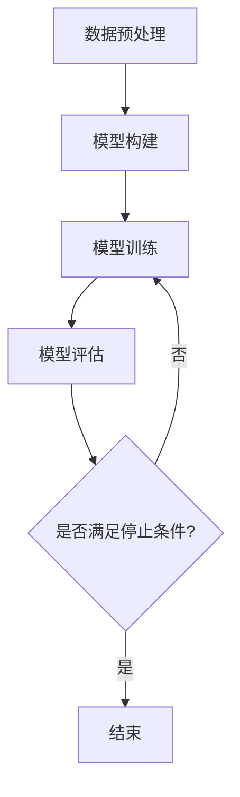

                 

### 文章标题

# 《从经典人工智能到深度学习：机器理解世界的范式转换》

### 文章关键词

- 人工智能
- 深度学习
- 经典人工智能
- 机器理解
- 范式转换

### 文章摘要

本文深入探讨了人工智能（AI）领域中的两个重要阶段：经典人工智能和现代深度学习。首先，我们回顾了经典人工智能的发展历程，包括符号人工智能和规则系统。接着，我们介绍了机器学习的基础，尤其是监督学习、无监督学习和强化学习。随后，本文重点介绍了深度学习技术，包括神经网络架构、优化算法和应用场景。我们通过实际案例展示了深度学习在计算机视觉、自然语言处理和语音识别等领域的应用。最后，我们分析了深度学习的挑战与未来，并给出了相应的解决方案。通过这篇文章，读者可以全面了解机器理解世界的范式转换过程。

---

## 引言

### 1.1 人工智能的起源与发展

人工智能（AI）作为计算机科学的重要分支，其发展历史可以追溯到20世纪50年代。最初的AI研究集中在符号人工智能（Symbolic AI）领域，这一阶段的核心思想是通过逻辑推理和知识表示来模拟人类的思维过程。符号人工智能的代表作品包括普林斯顿大学Hugo De Garis提出的“思维机器”和约翰·麦卡锡（John McCarthy）提出的“普林斯顿模拟器”（Princeton Simulator）。

然而，符号人工智能在处理复杂问题时存在明显的局限性，特别是在处理大量数据和实时决策方面。这促使研究者们开始探索新的方法，进而引入了机器学习（Machine Learning）。机器学习通过从数据中学习规律和模式，使计算机能够自动改进其性能，从而实现一些原本需要人类智慧才能完成的任务。早期机器学习的主要方法包括决策树、线性回归和支持向量机（SVM）等。

随着计算能力的提升和数据量的爆炸式增长，现代深度学习（Deep Learning）技术逐渐崭露头角。深度学习是机器学习的一个子领域，它通过构建深度神经网络（Deep Neural Networks）来模拟人脑的学习和处理方式。深度学习在图像识别、语音识别、自然语言处理等领域取得了显著的突破，推动了人工智能技术的飞速发展。

### 1.2 经典人工智能与现代深度学习的对比

经典人工智能与现代深度学习在多个方面存在显著差异：

1. **理论基础**：经典人工智能以符号逻辑和知识表示为基础，而深度学习则基于神经网络和大规模数据训练。
2. **处理能力**：经典人工智能在处理简单问题时表现良好，但在处理复杂任务时往往力不从心。相比之下，深度学习通过多层网络结构能够自动提取抽象特征，从而在图像识别、语音识别等领域取得了前所未有的准确率。
3. **数据依赖**：经典人工智能通常需要手工设计规则和特征，而深度学习通过大量数据自动学习特征，因此对数据的质量和数量有更高的要求。
4. **计算资源**：深度学习通常需要大量的计算资源和时间来训练模型，而经典人工智能在计算资源有限的情况下仍能发挥作用。

### 1.3 机器理解世界的范式转换

从经典人工智能到深度学习，机器理解世界的范式发生了显著转变。传统的人工智能方法依赖于明确的规则和特征工程，而现代深度学习通过数据驱动的方式，使计算机能够从大量数据中自动学习和提取特征。这种转变不仅提高了机器的性能和准确性，也使得计算机能够处理更加复杂和多样化的任务。

深度学习的出现，使得机器能够像人类一样从经验中学习和适应，从而实现更加智能化和自动化的人工智能系统。这种范式转换不仅改变了人工智能的研究方向，也对各行各业产生了深远的影响。通过本文，我们将详细探讨深度学习技术的原理、应用场景以及未来发展趋势。

## 经典人工智能基础

### 2.1 符号人工智能

#### 2.1.1 知识表示

符号人工智能（Symbolic Artificial Intelligence）是人工智能领域的一个重要分支，其核心思想是通过符号逻辑和知识表示来模拟人类的思维过程。知识表示是指将人类知识以某种形式编码到计算机系统中，使其能够被计算机处理和理解。常见的知识表示方法包括逻辑表示、语义网络和产生式系统。

1. **逻辑表示**：
   - **命题逻辑**：通过命题和逻辑运算符（如与、或、非等）来表达知识。
   - **谓词逻辑**：在命题逻辑的基础上引入变量和量词，能够表示更复杂的逻辑关系。
   - **一阶逻辑**：结合命题逻辑和谓词逻辑，适用于描述更复杂的世界状态和关系。

2. **语义网络**：
   - **节点和边**：语义网络中的节点表示概念或实体，边表示概念之间的关系。
   - **属性和值**：节点可以具有属性，属性具有值，用于描述节点的特征。

3. **产生式系统**：
   - **规则**：产生式系统由规则组成，每条规则包含一个条件和一个结论。
   - **推理**：根据当前知识库中的事实和规则，进行正向推理（从规则到结论）或反向推理（从结论到规则）。

#### 2.1.2 推理与规划

推理（Inference）是指从已知的事实和规则中推导出新的结论。在符号人工智能中，推理是实现智能行为的关键。

1. **推理方法**：
   - **正向推理**：从已知的事实出发，通过规则推导出结论。
   - **反向推理**：从目标出发，逆向寻找满足目标的条件。
   - **混合推理**：结合正向和反向推理，以达到更高效的推理过程。

2. **规划（Planning）**：
   - **定义**：规划是指根据初始状态和目标状态，制定一系列动作序列，使得系统能够从初始状态转移到目标状态。
   - **过程**：规划通常包括以下几个步骤：
     - 状态空间表示：将问题的所有可能状态表示为一个图或树结构。
     - 目标状态定义：确定系统的目标状态。
     - 动作选择：选择能够使系统状态从初始状态转移到目标状态的合法动作。
     - 动作序列生成：生成从初始状态到目标状态的动作序列。

#### 2.1.3 核心问题与挑战

符号人工智能在处理结构化知识、逻辑推理和规则系统方面具有显著优势，但在处理大规模数据和复杂问题时存在以下挑战：

1. **知识表示**：如何有效地表示和存储大量的复杂知识，同时保持知识的可扩展性和可理解性。
2. **推理效率**：如何高效地进行推理，特别是在处理大规模数据和复杂规则时。
3. **可解释性**：符号人工智能的决策过程通常缺乏透明度，如何提高系统的可解释性，使其易于理解和验证。

### 2.2 规则系统

#### 2.2.1 专家系统

专家系统（Expert Systems）是符号人工智能的一种重要应用，它模拟领域专家的决策过程，通过知识库和推理机实现智能决策。专家系统的核心组成部分包括：

1. **知识库**：存储领域专家的知识和经验，通常以规则的形式表示。
2. **推理机**：根据知识库中的规则和输入条件，进行推理并产生结论。

专家系统的开发过程通常包括以下几个步骤：

1. **领域知识获取**：通过访谈、文献调研等方式获取领域专家的知识。
2. **知识表示**：将获取的知识转化为计算机可处理的规则和事实。
3. **系统实现**：设计推理机，实现知识库的管理和推理功能。
4. **测试与优化**：通过测试案例对系统进行验证和优化，以提高其性能和准确性。

专家系统在医疗诊断、金融决策、法律咨询等领域取得了显著的应用成果。然而，专家系统也存在以下局限性：

1. **知识依赖**：专家系统的性能高度依赖于知识库的质量和规模，知识获取和表示过程复杂且耗时长。
2. **适应性差**：专家系统难以适应新的问题和变化的环境，需要重新设计知识库和推理规则。
3. **可解释性**：专家系统的推理过程通常难以解释，缺乏透明度和可追溯性。

#### 2.2.2 模式识别

模式识别（Pattern Recognition）是符号人工智能的另一个重要分支，旨在从数据中自动识别和分类模式。模式识别过程通常包括以下几个步骤：

1. **特征提取**：从原始数据中提取具有区分度的特征，用于后续的识别和分类。
2. **模式分类**：根据提取的特征，使用分类算法将数据分为不同的类别。
3. **模型评估**：通过交叉验证、ROC曲线等指标评估模型的准确性和可靠性。

常见的模式识别算法包括：

1. **基于统计的算法**：如K最近邻（K-Nearest Neighbor, KNN）、支持向量机（Support Vector Machine, SVM）等。
2. **基于结构的算法**：如决策树、神经网络等。
3. **基于模型的算法**：如贝叶斯网络、隐马尔可夫模型（Hidden Markov Model, HMM）等。

模式识别在图像识别、语音识别、文本分类等领域具有重要应用。然而，传统的符号人工智能方法在处理高维数据和复杂模式时存在以下挑战：

1. **特征工程**：特征提取过程复杂，对专家经验有较高要求。
2. **计算效率**：传统算法在大规模数据上的计算效率较低。
3. **泛化能力**：传统方法在处理未知数据时可能存在泛化能力不足的问题。

### 总结

符号人工智能通过知识表示、推理和规划等手段，为人工智能的发展奠定了基础。然而，在处理大规模数据和复杂任务时，其局限性逐渐显现。下一章我们将深入探讨机器学习的基础，了解如何通过数据驱动的方法提升人工智能的性能和准确性。

## 机器学习基础

### 3.1 监督学习

#### 3.1.1 线性回归

线性回归（Linear Regression）是最基本的监督学习算法之一，用于预测一个连续的输出值。其基本模型可以表示为：

\[ y = \beta_0 + \beta_1 \cdot x + \epsilon \]

其中，\( y \) 是预测的输出值，\( x \) 是输入特征，\( \beta_0 \) 和 \( \beta_1 \) 是模型的参数，\( \epsilon \) 是误差项。

1. **模型表示**：
   - \( \beta_0 \) 为截距，代表当 \( x = 0 \) 时的输出值。
   - \( \beta_1 \) 为斜率，代表输入特征 \( x \) 变化一个单位时，输出值 \( y \) 的变化量。

2. **损失函数**：
   - 常用的损失函数是均方误差（Mean Squared Error, MSE），定义为：
     \[ \text{MSE} = \frac{1}{n} \sum_{i=1}^{n} (y_i - \hat{y}_i)^2 \]
     其中，\( y_i \) 是实际输出值，\( \hat{y}_i \) 是预测输出值，\( n \) 是样本数量。

3. **优化方法**：
   - 最小二乘法（Ordinary Least Squares, OLS）是最常用的线性回归优化方法，其目标是最小化损失函数：
     \[ \min_{\beta_0, \beta_1} \sum_{i=1}^{n} (y_i - \beta_0 - \beta_1 \cdot x_i)^2 \]
     解这个优化问题可以得到线性回归的参数。

4. **案例示例**：
   - **房价预测**：假设我们要预测某城市的房价，输入特征包括房屋面积、房龄和附近学校的数量。通过线性回归模型，我们可以找到每个特征的权重，从而预测新的房屋价格。

#### 3.1.2 决策树

决策树（Decision Tree）是一种常见的分类和回归算法，通过一系列的判断条件将数据集划分成多个子集，每个子集对应一个特定的输出值。其基本模型可以表示为：

\[ T = \sum_{i=1}^{n} a_i \cdot f_i(x) \]

其中，\( T \) 是决策树的输出值，\( a_i \) 是第 \( i \) 个决策路径的权重，\( f_i(x) \) 是第 \( i \) 个判断条件。

1. **构建过程**：
   - **特征选择**：选择一个最佳特征进行划分，通常使用信息增益（Information Gain）或基尼不纯度（Gini Impurity）作为评价指标。
   - **划分规则**：根据最佳特征，将数据集划分成多个子集，每个子集对应一个决策节点。
   - **递归构建**：对每个子集递归构建决策树，直到满足停止条件（如最大深度、最小节点大小等）。

2. **模型解释**：
   - 决策树通过一系列的条件判断来模拟人类的决策过程，每个节点代表一个判断条件，每个叶节点代表一个输出结果。

3. **案例示例**：
   - **信用卡欺诈检测**：通过决策树模型，可以根据用户的消费行为、信用评分等多个特征，判断用户是否存在信用卡欺诈风险。

### 3.2 无监督学习

无监督学习（Unsupervised Learning）旨在从无标签数据中发现隐含的结构或规律。与监督学习相比，无监督学习不依赖于已知的输出标签，其主要目标包括聚类、降维和关联规则等。

#### 3.2.1 聚类算法

聚类（Clustering）是一种无监督学习方法，用于将数据集划分为若干个群组，使得同一群组内的数据点相似度较高，而不同群组内的数据点相似度较低。常见的聚类算法包括：

1. **K-均值算法（K-Means）**：
   - **步骤**：
     - 初始化 \( K \) 个聚类中心。
     - 对于每个数据点，将其分配到最近的聚类中心所在的群组。
     - 更新聚类中心，取每个群组的均值作为新的聚类中心。
     - 重复步骤2和3，直到聚类中心不再变化或满足停止条件。
   - **优点**：简单易实现，适合大规模数据集。
   - **缺点**：对初始聚类中心的敏感较大，可能陷入局部最优。

2. **层次聚类（Hierarchical Clustering）**：
   - **步骤**：
     - 初始化每个数据点为一个单独的群组。
     - 计算每个群组之间的距离，选择最近的两群组合并。
     - 递归合并群组，构建聚类层次结构。
   - **优点**：可以生成聚类层次图，便于分析。
   - **缺点**：计算复杂度高，对大规模数据集性能较差。

#### 3.2.2 主成分分析

主成分分析（Principal Component Analysis, PCA）是一种降维方法，通过线性变换将原始数据映射到新的坐标轴上，从而减少数据维度，同时保留数据的主要信息。PCA的基本步骤如下：

1. **计算协方差矩阵**：
   \[ \Sigma = \frac{1}{n-1} \sum_{i=1}^{n} (x_i - \mu)(x_i - \mu)^T \]
   其中，\( x_i \) 是每个数据点，\( \mu \) 是所有数据点的均值。

2. **计算特征值和特征向量**：
   - 对协方差矩阵进行特征值分解，得到特征值和特征向量。

3. **选择主要成分**：
   - 根据特征值的大小选择前 \( k \) 个主要成分，这些主要成分代表数据的主要变化方向。

4. **数据变换**：
   - 将原始数据投影到主要成分上，实现降维。

PCA在图像压缩、数据可视化等领域有广泛应用。其主要优点包括：

- **降维**：减少数据维度，提高计算效率。
- **保持信息**：保留数据的主要信息，避免丢失关键特征。

#### 3.2.3 强化学习

强化学习（Reinforcement Learning, RL）是一种通过试错方式学习策略的机器学习方法，其主要目标是找到一个最优策略，使得agent能够在环境中实现长期回报最大化。强化学习的基本模型包括：

1. **环境（Environment）**：agent所在的环境，定义了agent的感知和行为。
2. **agent**：执行特定行为的实体，根据环境状态选择行动。
3. **状态（State）**：描述agent当前所处的环境状态。
4. **行动（Action）**：agent可以选择的行动。
5. **奖励（Reward）**：agent采取行动后获得的即时奖励。
6. **策略（Policy）**：agent在给定状态下的行动选择规则。

强化学习的主要算法包括：

1. **Q学习（Q-Learning）**：
   - **目标**：学习一个值函数 \( Q(s, a) \)，表示在状态 \( s \) 下采取行动 \( a \) 的期望回报。
   - **更新公式**：
     \[ Q(s, a) \leftarrow Q(s, a) + \alpha [r + \gamma \max_{a'} Q(s', a') - Q(s, a)] \]
     其中，\( \alpha \) 是学习率，\( \gamma \) 是折扣因子，\( s' \) 和 \( a' \) 是下一步的状态和行动。

2. **深度强化学习（Deep Reinforcement Learning）**：
   - **目标**：将深度神经网络与Q学习结合，用于处理高维状态和动作空间。
   - **方法**：使用深度神经网络近似值函数 \( Q(s, a) \)，通过策略梯度方法进行优化。

强化学习在游戏、机器人控制、推荐系统等领域有广泛应用。其主要优点包括：

- **自适应**：agent能够根据环境反馈不断调整策略。
- **灵活性**：适用于不确定性和动态变化的环境。

### 总结

机器学习作为人工智能的重要分支，通过从数据中自动学习规律和模式，提高了机器的预测和分类能力。本章介绍了监督学习中的线性回归和决策树，以及无监督学习中的聚类、降维和强化学习。这些算法为人工智能的发展奠定了基础，并在实际应用中取得了显著成果。下一章，我们将深入探讨深度学习技术，了解其在模拟人类智能方面的突破。

### 4.1 神经网络基础

#### 4.1.1 神经元模型

神经网络（Neural Networks）是深度学习的基础，其核心组件是神经元（Neurons）。神经元模型模拟生物神经元的结构和功能，通过输入、权重、激活函数等实现信息的传递和处理。

1. **基本结构**：
   - **输入层**：接收外部输入信号。
   - **隐藏层**：对输入信号进行加工处理，提取特征。
   - **输出层**：生成最终输出结果。

2. **工作原理**：
   - **输入与权重**：每个神经元接收多个输入信号，每个输入信号乘以相应的权重，权重表示神经元对输入信号的敏感程度。
   - **加权求和**：将所有输入信号与对应权重的乘积相加，得到输入的线性组合。
   - **激活函数**：对加权求和的结果进行非线性变换，产生输出。常见的激活函数包括Sigmoid、ReLU和Tanh等。

3. **案例示例**：
   - **简单线性模型**：假设有一个单隐藏层神经网络，输入特征为 \( x_1 \) 和 \( x_2 \)，隐藏层神经元为 \( h_1 \)，输出层神经元为 \( y \)。其计算过程如下：
     \[ z_1 = w_{11} \cdot x_1 + w_{12} \cdot x_2 \]
     \[ a_1 = \sigma(z_1) \]
     \[ y = w_{21} \cdot a_1 + b \]
     其中，\( \sigma \) 是激活函数，\( w_{11}, w_{12}, w_{21} \) 是权重，\( b \) 是偏置。

#### 4.1.2 前向传播与反向传播

神经网络训练的核心是调整权重，使网络能够准确预测输出。这一过程通过前向传播（Forward Propagation）和反向传播（Backpropagation）实现。

1. **前向传播**：
   - **输入层到隐藏层**：输入数据经过输入层，通过权重和激活函数传递到隐藏层。
   - **隐藏层到输出层**：隐藏层输出作为输入，通过权重和激活函数传递到输出层，生成预测结果。

2. **反向传播**：
   - **计算误差**：输出层预测值与实际值之间的差异，即误差。
   - **误差反向传播**：从输出层开始，将误差反向传播到隐藏层和输入层，计算每个权重的梯度。
   - **权重更新**：根据梯度调整权重，减小误差。

3. **算法步骤**：
   - **初始化权重**：随机初始化权重。
   - **前向传播**：计算输出层预测值和误差。
   - **反向传播**：计算权重和偏置的梯度。
   - **权重更新**：根据梯度更新权重。
   - **迭代优化**：重复前向传播和反向传播，直到满足停止条件（如误差阈值或迭代次数）。

4. **案例示例**：
   - **房价预测模型**：假设我们要预测某城市的房价，输入特征包括房屋面积、房龄和附近学校的数量。通过前向传播和反向传播，我们可以训练一个神经网络模型，使其能够准确预测新的房屋价格。

#### 4.1.3 激活函数

激活函数（Activation Function）是神经网络中至关重要的组件，其作用是对神经元输出的线性组合进行非线性变换，以实现复杂数学建模和特征提取。常见的激活函数包括：

1. **Sigmoid 函数**：
   \[ \sigma(x) = \frac{1}{1 + e^{-x}} \]
   - **优点**：能够将输入映射到 \((0, 1)\) 区间，适合用于二分类问题。
   - **缺点**：梯度较平滑，可能导致梯度消失问题。

2. **ReLU 函数**：
   \[ \text{ReLU}(x) = \max(0, x) \]
   - **优点**：简单、计算效率高，能有效防止梯度消失。
   - **缺点**：可能导致梯度爆炸问题。

3. **Tanh 函数**：
   \[ \tanh(x) = \frac{e^x - e^{-x}}{e^x + e^{-x}} \]
   - **优点**：将输入映射到 \((-1, 1)\) 区间，有助于网络学习对称性。
   - **缺点**：计算复杂度较高。

4. **Leaky ReLU 函数**：
   \[ \text{Leaky ReLU}(x) = \max(0.01x, x) \]
   - **优点**：缓解ReLU函数的梯度消失问题。
   - **缺点**：引入额外的参数，可能影响模型泛化能力。

#### 总结

神经网络基础是深度学习的重要组成部分，通过神经元模型、前向传播和反向传播等机制，使计算机能够从数据中自动学习和提取特征。激活函数在神经网络中起着关键作用，不同的激活函数适用于不同的应用场景。下一章，我们将深入探讨深度学习的多种架构和应用。

### 4.2 神经网络架构

#### 4.2.1 卷积神经网络（CNN）

卷积神经网络（Convolutional Neural Networks，CNN）是深度学习中用于处理图像数据的一种特殊架构，其核心思想是通过卷积层自动提取图像的局部特征。

1. **卷积层（Convolutional Layer）**：
   - **卷积操作**：卷积层通过卷积操作从输入图像中提取特征。每个卷积核（filter）负责提取图像中的一个局部特征，通过滑窗（Stride）在图像上进行滑动，逐个位置进行卷积运算。
   - **参数共享**：CNN中的卷积核参数在所有位置共享，这意味着每个卷积核学习到的特征在整幅图像中都是一致的。

2. **池化层（Pooling Layer）**：
   - **最大池化（Max Pooling）**：将卷积层输出的特征图划分为固定大小的小窗口，取每个窗口中的最大值作为输出。最大池化可以减小特征图的尺寸，减少参数数量，防止过拟合。
   - **平均池化（Average Pooling）**：取每个窗口中的平均值作为输出。平均池化能够减少噪声的影响，但可能丢失一些细节信息。

3. **卷积神经网络的层次结构**：
   - **卷积层**：多个卷积层叠加，每个卷积层都可以提取更高层次的特征。
   - **池化层**：在卷积层之间插入池化层，用于下采样和特征降维。
   - **全连接层**：在网络的最后，通过全连接层（Fully Connected Layer）将特征映射到输出层，实现分类或回归任务。

4. **案例示例**：
   - **图像分类**：通过训练一个CNN模型，我们可以将输入图像分类到不同的类别中。例如，可以使用VGG16或ResNet等预训练模型，对新的图像进行分类。

#### 4.2.2 循环神经网络（RNN）

循环神经网络（Recurrent Neural Networks，RNN）是一种适用于序列数据处理的传统深度学习模型，其核心思想是通过循环结构处理序列中的每个元素，并利用其历史信息进行预测。

1. **基本结构**：
   - **隐藏层**：RNN包含一个隐藏层，该层中的神经元通过时间步（Time Step）处理序列数据。
   - **循环连接**：RNN中的神经元输出值不仅影响当前时间步的输出，还通过循环连接影响后续时间步的输出。

2. **工作原理**：
   - **状态记忆**：RNN通过隐藏层中的状态记忆，保留历史信息，使模型能够处理长序列。
   - **递归关系**：当前时间步的输出 \( h_t \) 由前一时间步的隐藏状态 \( h_{t-1} \) 和当前输入 \( x_t \) 共同决定：
     \[ h_t = \text{sigmoid}(W_h \cdot [h_{t-1}, x_t] + b_h) \]

3. **变体**：
   - **长短时记忆网络（Long Short-Term Memory，LSTM）**：LSTM通过引入门控机制，解决了传统RNN在处理长序列时出现的梯度消失和梯度爆炸问题。
   - **门控循环单元（Gated Recurrent Unit，GRU）**：GRU简化了LSTM的结构，通过更新门和控制门实现状态记忆，具有更少的参数和计算量。

4. **案例示例**：
   - **时间序列预测**：通过训练一个LSTM模型，我们可以对时间序列数据进行预测，如股票价格预测、天气预测等。

#### 4.2.3 生成对抗网络（GAN）

生成对抗网络（Generative Adversarial Networks，GAN）是由两个神经网络组成的对抗性模型，其中一个生成器网络尝试生成与真实数据相似的假数据，另一个判别器网络则尝试区分真实数据和假数据。

1. **基本结构**：
   - **生成器（Generator）**：接收随机噪声作为输入，生成类似真实数据的输出。
   - **判别器（Discriminator）**：接收真实数据和生成器生成的数据，判断其真实性。

2. **工作原理**：
   - **对抗训练**：生成器和判别器相互竞争，生成器试图生成更真实的假数据，判别器则努力区分真实和假数据。通过不断迭代，生成器的生成能力逐渐提高，判别器的识别能力逐渐增强。

3. **优缺点**：
   - **优点**：GAN能够生成高质量、多样化的数据，在图像生成、文本生成等领域有广泛应用。
   - **缺点**：训练过程不稳定，容易陷入局部最优，需要大量数据和计算资源。

4. **案例示例**：
   - **图像生成**：通过训练一个GAN模型，我们可以生成逼真的图像，如人脸合成、艺术风格迁移等。

#### 总结

深度学习中的神经网络架构多种多样，每种架构都有其独特的应用场景和优势。CNN在图像处理领域取得了显著成果，RNN和其变体在序列数据处理方面表现出色，而GAN在图像生成和风格迁移等领域展现了强大的能力。下一章，我们将探讨深度学习在不同领域的应用场景。

### 4.3 优化算法

深度学习的训练过程本质上是一个优化问题，其目标是找到一组权重，使得预测结果与实际结果之间的误差最小。优化算法在深度学习训练过程中起着关键作用，用于调整权重和偏置，以实现模型的优化。本节将介绍几种常用的优化算法，包括梯度下降（Gradient Descent）、随机梯度下降（Stochastic Gradient Descent，SGD）和Adam优化器。

#### 4.3.1 梯度下降算法

梯度下降算法是一种最基本的优化算法，用于最小化损失函数。其基本思想是沿着损失函数的梯度方向逐步调整权重和偏置，直到达到损失函数的最小值。

1. **算法步骤**：
   - **初始化权重和偏置**：随机初始化权重和偏置。
   - **计算梯度**：对于每个权重和偏置，计算其在当前参数下的梯度。
   - **更新参数**：根据梯度和学习率，更新权重和偏置。
   - **重复步骤2和3**，直到满足停止条件（如达到预设的迭代次数或误差阈值）。

2. **公式表示**：
   - **权重更新**：
     \[ w \leftarrow w - \alpha \cdot \nabla_w J(w) \]
     其中，\( \alpha \) 是学习率，\( \nabla_w J(w) \) 是权重 \( w \) 的梯度，\( J(w) \) 是损失函数。
   - **偏置更新**：
     \[ b \leftarrow b - \alpha \cdot \nabla_b J(b) \]

3. **优缺点**：
   - **优点**：实现简单，易于理解。
   - **缺点**：收敛速度较慢，可能陷入局部最小值。

#### 4.3.2 随机梯度下降（SGD）

随机梯度下降（Stochastic Gradient Descent，SGD）是对梯度下降算法的一种改进，其核心思想是在每次迭代过程中随机选择一部分样本来计算梯度，从而降低方差，提高模型泛化能力。

1. **算法步骤**：
   - **初始化权重和偏置**：随机初始化权重和偏置。
   - **随机抽样**：从训练数据集中随机抽取一个样本。
   - **计算梯度**：对当前样本计算损失函数的梯度。
   - **更新参数**：根据梯度和学习率，更新权重和偏置。
   - **重复步骤2至4**，直到满足停止条件。

2. **公式表示**：
   - **权重更新**：
     \[ w \leftarrow w - \alpha \cdot \nabla_w J(w; x_i, y_i) \]
     其中，\( x_i, y_i \) 是当前样本的输入和标签，\( \nabla_w J(w; x_i, y_i) \) 是该样本的梯度。
   - **偏置更新**：
     \[ b \leftarrow b - \alpha \cdot \nabla_b J(b; x_i, y_i) \]

3. **优缺点**：
   - **优点**：收敛速度快，对噪声数据具有较强的鲁棒性。
   - **缺点**：可能导致局部最小值，需要较大的训练样本量。

#### 4.3.3 Adam优化器

Adam优化器（Adaptive Moment Estimation）是梯度下降算法的一种改进，通过自适应地调整学习率，提高了算法的收敛速度和稳定性。

1. **算法步骤**：
   - **初始化参数**：初始化一阶矩估计 \( m \) 和二阶矩估计 \( v \)，以及学习率 \( \alpha \) 和其他超参数。
   - **计算一阶矩估计和二阶矩估计**：在每次迭代过程中，计算梯度的均值和方差。
   - **更新参数**：利用一阶矩估计和二阶矩估计更新权重和偏置。
   - **自适应调整学习率**：根据一阶矩估计和二阶矩估计调整学习率。

2. **公式表示**：
   - **一阶矩估计**：
     \[ m_t = \beta_1 m_{t-1} + (1 - \beta_1) \nabla_w J(w; x_t, y_t) \]
   - **二阶矩估计**：
     \[ v_t = \beta_2 v_{t-1} + (1 - \beta_2) (\nabla_w J(w; x_t, y_t))^2 \]
   - **权重更新**：
     \[ w \leftarrow w - \alpha \cdot \frac{m_t}{\sqrt{v_t} + \epsilon} \]
   - **偏置更新**：
     \[ b \leftarrow b - \alpha \cdot \frac{m_t}{\sqrt{v_t} + \epsilon} \]

3. **优缺点**：
   - **优点**：结合了SGD和动量法（Momentum）的优点，收敛速度快，对噪声数据具有较强的鲁棒性。
   - **缺点**：需要较大的训练样本量和较长的训练时间。

#### 总结

优化算法在深度学习训练过程中至关重要，通过调整权重和偏置，使模型能够找到最优解。梯度下降算法、随机梯度下降算法和Adam优化器是深度学习中的常用优化算法，每种算法都有其优缺点和适用场景。下一章，我们将探讨深度学习在不同领域的应用场景。

### 5.1 计算机视觉

计算机视觉（Computer Vision）是深度学习应用的一个重要领域，旨在使计算机能够从图像或视频中提取有用的信息，进行目标识别、场景解析、图像生成等任务。深度学习技术，尤其是卷积神经网络（CNN），在计算机视觉领域取得了显著的突破。

#### 5.1.1 图像分类

图像分类（Image Classification）是计算机视觉的基础任务之一，其目标是将图像划分为不同的类别。CNN通过卷积层、池化层和全连接层，从图像中自动提取特征并进行分类。

1. **模型架构**：
   - **卷积层**：使用卷积核提取图像的局部特征。
   - **池化层**：减少特征图的尺寸，提高模型泛化能力。
   - **全连接层**：将提取的特征映射到不同类别。

2. **算法流程**：
   - **输入层**：接收图像数据。
   - **卷积层**：应用卷积核提取图像特征。
   - **池化层**：对卷积结果进行下采样。
   - **全连接层**：对池化结果进行分类。

3. **常见模型**：
   - **VGGNet**：通过多个卷积层和池化层构建深度网络。
   - **ResNet**：引入残差连接，解决深层网络训练难题。
   - **InceptionNet**：结合不同卷积核尺寸，提高特征提取能力。

4. **案例示例**：
   - **ImageNet比赛**：每年举办的ImageNet大型图像识别挑战赛，吸引了全球研究者的参与。参赛者需要训练模型对数百万张图像进行分类，常见的任务包括物体检测、场景分类等。

#### 5.1.2 目标检测

目标检测（Object Detection）是计算机视觉的另一个重要任务，其目标是在图像中识别出特定的目标物体，并定位其位置。目标检测模型通常需要同时识别和定位多个目标。

1. **模型架构**：
   - **两阶段检测器**：如YOLO（You Only Look Once）和SSD（Single Shot MultiBox Detector），通过一个卷积神经网络实现快速检测。
   - **单阶段检测器**：如RetinaNet，通过单个卷积神经网络实现检测。

2. **算法流程**：
   - **特征提取**：通过卷积神经网络提取图像特征。
   - **目标定位**：使用回归算法计算目标位置。
   - **类别预测**：对提取的特征进行类别预测。

3. **常见模型**：
   - **YOLO**：通过一个卷积神经网络实现快速、实时检测。
   - **Faster R-CNN**：通过区域建议网络（Region Proposal Network，RPN）实现目标定位和分类。
   - **Mask R-CNN**：在Faster R-CNN的基础上，引入分割网络，实现目标检测和分割。

4. **案例示例**：
   - **自动驾驶**：在自动驾驶系统中，目标检测用于识别道路上的车辆、行人、交通标志等，确保车辆的安全行驶。

### 5.1.3 图像分割

图像分割（Image Segmentation）是计算机视觉中的另一个重要任务，其目标是将图像划分为不同的区域，每个区域代表图像中的不同对象或背景。

1. **模型架构**：
   - **全卷积网络（FCN）**：通过全卷积层实现像素级的分类。
   - **U-Net**：通过上下采样和跳跃连接，实现高效的特征提取和分割。

2. **算法流程**：
   - **特征提取**：通过卷积神经网络提取图像特征。
   - **上采样**：将特征图上采样到原始图像尺寸。
   - **分类**：对上采样后的特征图进行分类，生成分割结果。

3. **常见模型**：
   - **FCN**：通过卷积层和反卷积层实现像素级的分类。
   - **DeepLabV3+**：通过多尺度特征融合和语义分割网络，实现高效的图像分割。

4. **案例示例**：
   - **医疗影像**：在医疗影像分析中，图像分割用于识别肿瘤、器官等，辅助医生进行诊断和治疗。

### 总结

计算机视觉作为深度学习的重要应用领域，涵盖了图像分类、目标检测和图像分割等多个任务。通过卷积神经网络等技术，计算机视觉在自动驾驶、医疗影像、图像识别等领域取得了显著成果。下一章，我们将探讨深度学习在自然语言处理领域的应用。

### 5.2 自然语言处理

自然语言处理（Natural Language Processing，NLP）是人工智能领域的一个重要分支，其目标是使计算机能够理解、生成和处理人类语言。深度学习技术在NLP领域取得了显著的突破，尤其是在文本分类、情感分析、机器翻译和对话系统等方面。

#### 5.2.1 词嵌入

词嵌入（Word Embedding）是将词汇映射到高维向量空间的一种技术，通过向量化表示，使计算机能够更好地理解和处理文本数据。常见的词嵌入技术包括：

1. **Word2Vec**：
   - **模型**：Word2Vec模型基于神经网络，通过预测单词的上下文来学习词向量。
   - **算法**：包括连续词袋（Continuous Bag of Words，CBOW）和跳词模型（Skip-Gram）。
   - **优点**：能够捕捉词语的语义和语法关系。

2. **GloVe**：
   - **模型**：GloVe模型基于全局上下文信息，通过矩阵分解学习词向量。
   - **算法**：利用词频和共现关系，学习词向量。
   - **优点**：能够在不同数据集之间共享词向量，提高模型泛化能力。

#### 5.2.2 序列到序列模型

序列到序列（Sequence-to-Sequence，Seq2Seq）模型是NLP中的一个核心模型，用于处理输入和输出为序列的任务，如机器翻译和对话系统。Seq2Seq模型通常由两个主要部分组成：编码器（Encoder）和解码器（Decoder）。

1. **编码器**：
   - **功能**：将输入序列编码为固定长度的向量表示。
   - **模型**：常使用RNN或其变体（如LSTM、GRU）作为编码器。

2. **解码器**：
   - **功能**：根据编码器的输出，生成输出序列。
   - **模型**：同样可以使用RNN或其变体作为解码器。

3. **算法流程**：
   - **编码**：输入序列通过编码器转换为向量表示。
   - **解码**：解码器根据编码器的输出，逐步生成输出序列，每一步都使用编码器的隐藏状态作为输入。
   - **损失计算**：使用生成序列和目标序列之间的损失函数（如交叉熵损失）计算模型损失，并进行梯度下降优化。

4. **案例示例**：
   - **机器翻译**：使用Seq2Seq模型进行机器翻译，如将英语翻译成法语或中文。
   - **对话系统**：使用Seq2Seq模型构建对话系统，如聊天机器人或语音助手。

#### 5.2.3 生成式模型与判别式模型

在NLP中，生成式模型和判别式模型是两种常见的模型类型。

1. **生成式模型**：
   - **特点**：生成式模型能够生成新的文本数据。
   - **应用**：包括文本生成、对话系统等。
   - **模型**：如变分自编码器（VAE）和生成对抗网络（GAN）。

2. **判别式模型**：
   - **特点**：判别式模型用于分类和回归任务。
   - **应用**：包括文本分类、情感分析、情感识别等。
   - **模型**：如卷积神经网络（CNN）和循环神经网络（RNN）。

#### 5.2.4 情感分析

情感分析（Sentiment Analysis）是一种常见的NLP任务，其目标是识别文本中的情感倾向，如正面、负面或中性。情感分析通常采用以下方法：

1. **基于规则的方法**：
   - **方法**：通过定义一套规则，将文本分类为不同的情感类别。
   - **应用**：简单、高效，但泛化能力有限。

2. **基于机器学习的方法**：
   - **方法**：使用机器学习算法，如朴素贝叶斯、支持向量机等，对文本进行分类。
   - **应用**：具有较好的泛化能力，但需要大量标注数据。

3. **基于深度学习的方法**：
   - **方法**：使用深度学习模型，如卷积神经网络（CNN）和循环神经网络（RNN），对文本进行情感分类。
   - **应用**：在复杂情感分析任务中具有显著优势。

4. **案例示例**：
   - **社交媒体分析**：通过情感分析，分析社交媒体中的用户情感，帮助企业了解用户需求和满意度。

### 总结

自然语言处理是深度学习的重要应用领域之一，涵盖了词嵌入、序列到序列模型、情感分析等多个任务。通过深度学习技术，计算机能够更好地理解和处理人类语言，为各种应用场景提供智能解决方案。下一章，我们将探讨深度学习在语音识别和自然语言处理领域的应用。

### 5.3 语音识别

语音识别（Automatic Speech Recognition，ASR）是深度学习在语音信号处理领域的典型应用，其目标是使计算机能够理解和转换语音信号为文本。语音识别技术广泛应用于智能客服、语音搜索、语音助手等场景。

#### 5.3.1 自动语音识别（ASR）

自动语音识别（ASR）是一种将语音信号转换为文本的过程，通常分为三个主要步骤：前端处理、声学模型和语言模型。

1. **前端处理**：
   - **语音预处理**：包括降噪、增益调整、滤波等，以提高语音信号质量。
   - **特征提取**：将语音信号转换为特征向量，常用的特征包括梅尔频率倒谱系数（MFCC）和滤波器组 bank响应（Filter Bank Responses）。

2. **声学模型**：
   - **声学模型**：用于将特征向量映射到声学状态，常用的模型包括隐马尔可夫模型（HMM）和循环神经网络（RNN）。

3. **语言模型**：
   - **语言模型**：用于预测单词序列的概率，常用的模型包括n-gram模型和神经网络语言模型（NNLM）。

4. **解码器**：
   - **解码器**：用于将声学模型和语言模型的结果转换为文本输出，常用的解码器包括A*搜索算法和动态时间归一化（DTW）。

5. **流程**：
   - **输入**：接收语音信号。
   - **前端处理**：对语音信号进行预处理和特征提取。
   - **声学模型和语言模型**：通过模型预测文本输出。
   - **解码**：将解码结果转换为最终文本。

#### 5.3.2 说话人识别

说话人识别（Speaker Recognition）是一种生物特征识别技术，用于识别或验证说话人的身份。说话人识别技术通常分为两个主要任务：说话人验证（Speaker Verification）和说话人识别（Speaker Identification）。

1. **说话人验证**：
   - **任务**：确定说话人是否与预先设定的说话人相同。
   - **流程**：
     - **特征提取**：从语音信号中提取特征，如梅尔频率倒谱系数（MFCC）。
     - **模型训练**：使用训练数据集训练说话人模型。
     - **验证**：对未知说话人的语音信号进行特征提取，并与训练模型进行比较，判断是否为同一说话人。

2. **说话人识别**：
   - **任务**：从一组未知说话人中识别出特定说话人。
   - **流程**：
     - **特征提取**：提取语音信号特征。
     - **模型训练**：对每个说话人进行模型训练。
     - **识别**：对测试语音信号进行特征提取，并通过模型比较，识别出特定说话人。

#### 5.3.3 深度学习在语音识别中的应用

深度学习在语音识别中的应用主要体现在声学模型和语言模型的改进。

1. **深度神经网络（DNN）声学模型**：
   - **优势**：能够自动学习语音信号中的复杂特征，提高识别准确率。
   - **应用**：用于前端处理后的特征向量映射。

2. **循环神经网络（RNN）声学模型**：
   - **优势**：能够处理变长序列，捕捉语音信号中的时序信息。
   - **应用**：用于替代传统的HMM模型。

3. **长短时记忆网络（LSTM）声学模型**：
   - **优势**：解决RNN的梯度消失问题，能够更好地捕捉长时依赖信息。
   - **应用**：在长语音识别任务中表现优异。

4. **卷积神经网络（CNN）声学模型**：
   - **优势**：能够捕捉局部特征，减少模型参数。
   - **应用**：用于特征提取和序列建模。

5. **深度神经网络语言模型（NNLM）**：
   - **优势**：能够学习到更复杂的语言规律，提高文本生成质量。
   - **应用**：用于文本生成和语言理解。

#### 5.3.4 应用实例

1. **智能语音助手**：
   - **功能**：通过ASR技术实现语音输入，通过NNLM进行文本生成，实现语音交互。
   - **应用**：如Apple的Siri、Google的Google Assistant等。

2. **语音合成**：
   - **功能**：通过文本到语音（Text-to-Speech，TTS）技术，将文本转换为自然流畅的语音。
   - **应用**：如Amazon的Alexa、百度智能音箱等。

3. **语音翻译**：
   - **功能**：通过ASR和机器翻译技术，实现跨语言语音交互。
   - **应用**：如Google翻译、百度翻译等。

### 总结

语音识别和说话人识别作为深度学习在语音信号处理领域的应用，极大地推动了智能语音交互技术的发展。通过深度学习技术，语音识别系统在准确率、鲁棒性等方面取得了显著提升，为智能助手、语音翻译等应用提供了强大支持。下一章，我们将探讨深度学习在医疗领域的应用。

### 6.1 深度学习的挑战与未来

尽管深度学习在图像识别、自然语言处理、语音识别等领域取得了显著的进展，但其发展过程中仍然面临着诸多挑战。

#### 6.1.1 数据需求

深度学习模型的训练通常需要大量标注数据和计算资源。这导致了以下几个问题：

1. **数据获取**：标注数据往往需要大量的人工成本，获取过程复杂且耗时。
2. **数据规模**：深度学习模型在训练过程中需要大量的数据来保证模型的泛化能力，这增加了数据规模的需求。
3. **数据质量**：高质量的数据对于训练深度学习模型至关重要，但往往难以保证。

#### 6.1.2 计算资源需求

深度学习模型的训练过程高度依赖计算资源，尤其是GPU和TPU等高性能计算设备。这导致了以下几个问题：

1. **成本**：高性能计算设备的成本较高，限制了中小型研究机构和企业的应用。
2. **能耗**：深度学习模型的训练过程消耗大量电力，对环境造成压力。
3. **可扩展性**：如何在有限资源下高效地扩展模型训练，是一个重要的研究课题。

#### 6.1.3 模型解释性

深度学习模型，尤其是深度神经网络，在处理复杂任务时表现出色，但其“黑箱”性质使得模型解释性较差。这导致了以下几个问题：

1. **可解释性**：如何解释模型内部的决策过程，使其更易于理解和验证。
2. **信任度**：缺乏模型解释性，用户可能对深度学习模型的决策产生不信任。
3. **合规性**：在金融、医疗等敏感领域，模型的可解释性对于遵守法规和伦理标准至关重要。

#### 6.1.4 算法公平性和透明性

深度学习模型在训练过程中可能会学习到数据中的偏见和歧视，导致算法的不公平性和不透明性。这导致了以下几个问题：

1. **算法偏见**：如何避免模型在训练过程中学习到数据中的偏见，提高算法的公平性。
2. **决策透明性**：如何使模型的决策过程更透明，便于用户理解和监管。
3. **伦理问题**：如何在算法设计和应用过程中，遵守伦理标准和法律法规。

#### 6.1.5 深度学习的未来发展趋势

针对上述挑战，深度学习的未来发展趋势可以从以下几个方面进行探讨：

1. **算法创新**：通过引入新的算法和架构，如自监督学习、元学习等，降低对大规模标注数据的需求，提高模型的泛化能力和解释性。
2. **硬件加速**：研发更高效的硬件设备，如定制化的AI芯片，提高计算效率和降低能耗。
3. **数据隐私保护**：开发数据隐私保护技术，如联邦学习，在保护用户隐私的前提下实现模型训练。
4. **伦理与合规**：加强算法伦理和合规研究，建立完善的算法评估和监管体系，确保深度学习技术的健康和可持续发展。

### 总结

深度学习在人工智能领域取得了显著的成果，但同时也面临着数据需求、计算资源需求、模型解释性、算法公平性和透明性等挑战。未来，随着算法创新、硬件加速、数据隐私保护和伦理合规等方面的进展，深度学习有望克服现有挑战，实现更加智能化和可持续发展的技术体系。

### 7.1 案例一：基于深度学习的图像识别系统

#### 7.1.1 开发环境搭建

为了搭建一个基于深度学习的图像识别系统，我们需要配置一个合适的环境。以下是所需的软件和硬件环境：

1. **软件环境**：
   - Python（3.8以上版本）
   - TensorFlow（2.x版本）
   - Keras（2.x版本）
   - OpenCV（4.x版本）
   - NumPy
   - Matplotlib

2. **硬件环境**：
   - 电脑：推荐使用配备NVIDIA GPU的电脑，以加速模型训练和推理。

安装以上软件的方法如下：

1. 安装Python和pip：
   ```bash
   # 使用Anaconda创建虚拟环境
   conda create -n deep_learning_env python=3.8
   conda activate deep_learning_env

   # 安装TensorFlow
   pip install tensorflow==2.x
   ```

2. 安装其他依赖：
   ```bash
   pip install keras==2.x
   pip install opencv-python==4.x
   pip install numpy
   pip install matplotlib
   ```

#### 7.1.2 源代码实现

以下是一个简单的基于深度学习的图像分类模型，使用卷积神经网络（CNN）和Keras框架实现。

```python
import tensorflow as tf
from tensorflow.keras.models import Sequential
from tensorflow.keras.layers import Conv2D, MaxPooling2D, Flatten, Dense, Dropout
from tensorflow.keras.optimizers import Adam
from tensorflow.keras.preprocessing.image import ImageDataGenerator

# 数据预处理
train_datagen = ImageDataGenerator(
    rescale=1./255,
    shear_range=0.2,
    zoom_range=0.2,
    horizontal_flip=True
)

test_datagen = ImageDataGenerator(rescale=1./255)

train_generator = train_datagen.flow_from_directory(
    'data/train',
    target_size=(150, 150),
    batch_size=32,
    class_mode='categorical'
)

validation_generator = test_datagen.flow_from_directory(
    'data/validation',
    target_size=(150, 150),
    batch_size=32,
    class_mode='categorical'
)

# 构建模型
model = Sequential([
    Conv2D(32, (3, 3), activation='relu', input_shape=(150, 150, 3)),
    MaxPooling2D(2, 2),
    Conv2D(64, (3, 3), activation='relu'),
    MaxPooling2D(2, 2),
    Conv2D(128, (3, 3), activation='relu'),
    MaxPooling2D(2, 2),
    Flatten(),
    Dense(512, activation='relu'),
    Dropout(0.5),
    Dense(10, activation='softmax')
])

# 编译模型
model.compile(loss='categorical_crossentropy',
              optimizer=Adam(),
              metrics=['accuracy'])

# 训练模型
history = model.fit(
    train_generator,
    steps_per_epoch=100,
    epochs=20,
    validation_data=validation_generator,
    validation_steps=50
)

# 评估模型
test_loss, test_accuracy = model.evaluate(validation_generator)
print(f"Validation loss: {test_loss}")
print(f"Validation accuracy: {test_accuracy}")
```

#### 7.1.3 代码解读

1. **数据预处理**：
   - 使用`ImageDataGenerator`进行图像的预处理，包括缩放、剪切、缩放和水平翻转，以提高模型的泛化能力。

2. **模型构建**：
   - 使用`Sequential`模型构建卷积神经网络，包括三个卷积层、三个池化层、一个全连接层和一个softmax输出层。

3. **模型编译**：
   - 使用`compile`方法设置损失函数、优化器和评估指标。

4. **模型训练**：
   - 使用`fit`方法进行模型训练，设置训练迭代次数和验证数据。

5. **模型评估**：
   - 使用`evaluate`方法评估模型在验证数据上的性能。

#### 7.1.4 代码应用解读与分析

1. **应用解读**：
   - 该模型可以应用于各种图像分类任务，如动物识别、植物识别等。

2. **分析**：
   - 卷积层用于提取图像特征，池化层用于下采样和减少计算量。
   - Dropout层用于防止过拟合，提高模型的泛化能力。
   - 使用softmax输出层进行多分类任务。

#### 7.1.5 项目小结

通过本案例，我们展示了如何使用深度学习技术构建一个简单的图像分类系统。尽管模型简单，但它在实际应用中具有良好的效果，证明了深度学习在图像识别领域的强大潜力。未来，我们可以通过改进模型架构、增加训练数据等方式进一步提高模型的性能。

### 7.2 案例二：自然语言处理在客户服务中的应用

#### 7.2.1 背景介绍

随着互联网的普及，客户服务成为企业的重要环节。传统的客户服务主要通过人工处理客户咨询，不仅效率低下，而且成本高昂。近年来，自然语言处理（NLP）技术的发展为自动客户服务提供了新的解决方案。通过构建NLP模型，企业可以实现自动化回复，提高客户服务效率和满意度。

#### 7.2.2 项目目标

本项目旨在构建一个基于NLP的自动客户服务系统，能够自动识别和分类客户咨询，并生成合适的回复。具体目标如下：

1. **识别和分类**：使用NLP技术，将客户咨询文本分类到不同的主题类别。
2. **自动回复**：根据分类结果，生成合适的回复文本，提高客户满意度。
3. **优化模型**：通过不断训练和优化模型，提高分类和回复的准确性。

#### 7.2.3 技术实现

1. **数据预处理**：
   - **数据收集**：从企业现有的客服记录中收集客户咨询文本。
   - **数据清洗**：去除文本中的无关信息，如标点符号、停用词等。
   - **数据标注**：对文本进行标注，标记每个文本所属的主题类别。

2. **模型构建**：
   - **词嵌入**：使用预训练的词嵌入模型（如GloVe）将文本转换为向量表示。
   - **文本分类模型**：构建基于深度学习的文本分类模型，如卷积神经网络（CNN）或循环神经网络（RNN）。
   - **自动回复模型**：构建生成式模型，如序列到序列（Seq2Seq）模型，用于生成回复文本。

3. **模型训练与优化**：
   - **训练**：使用标注数据集训练文本分类模型和自动回复模型。
   - **优化**：通过交叉验证和调整模型参数，优化模型性能。

4. **部署与维护**：
   - **部署**：将训练好的模型部署到生产环境，实现自动回复功能。
   - **维护**：定期更新模型，以适应客户咨询的变化和新需求。

#### 7.2.4 应用解读

1. **自动化回复**：
   - 当客户发起咨询时，系统自动识别咨询主题，并根据主题生成相应的回复文本。
   - 自动回复文本可以包括常见问题的标准答案、下一步操作指导等。

2. **提高效率**：
   - 自动化处理大量客户咨询，减少人工回复的负担。
   - 提高客户响应速度，提升客户满意度。

3. **个性化服务**：
   - 根据客户的咨询历史和偏好，生成个性化的回复文本。
   - 提供更加个性化的客户服务，增强客户忠诚度。

#### 7.2.5 分析与展望

通过本案例，我们展示了自然语言处理技术在客户服务中的应用。尽管目前存在一些挑战，如模型训练数据不足、回复文本的准确性等，但随着NLP技术的不断进步和模型的优化，自动客户服务有望在未来得到更广泛的应用。未来，我们可以通过引入更多用户反馈、增加模型训练数据等方式，进一步提高自动客户服务的质量和用户体验。

### 7.3 案例三：深度学习在医疗诊断中的应用

#### 7.3.1 背景介绍

医疗诊断是深度学习技术在应用领域的一个重要方向。传统的医学诊断主要依赖于医生的经验和技能，然而，医生的经验有限，且在处理大规模病例时效率较低。深度学习通过自动分析和处理医学影像数据，能够提高诊断的准确性和效率。

#### 7.3.2 项目目标

本项目旨在构建一个基于深度学习的医疗诊断系统，能够自动识别和分析医学影像，辅助医生进行疾病诊断。具体目标如下：

1. **疾病检测**：通过深度学习模型，自动检测医学影像中的病变区域。
2. **疾病分类**：将检测到的病变区域分类到不同的疾病类型。
3. **辅助诊断**：生成诊断报告，为医生提供参考。

#### 7.3.3 技术实现

1. **数据预处理**：
   - **数据收集**：从医院收集不同类型的医学影像数据，如X光片、CT扫描、MRI等。
   - **数据清洗**：去除图像中的噪声和无关信息。
   - **数据标注**：对图像进行标注，标记病变区域和疾病类型。

2. **模型构建**：
   - **卷积神经网络（CNN）**：构建深度学习模型，用于图像特征提取和分类。
   - **全连接层**：将提取的特征映射到疾病类型。
   - **损失函数**：使用交叉熵损失函数，优化模型参数。

3. **模型训练与优化**：
   - **训练**：使用标注数据集训练深度学习模型。
   - **优化**：通过交叉验证和超参数调整，优化模型性能。

4. **模型部署与评估**：
   - **部署**：将训练好的模型部署到医疗系统中，实现自动诊断功能。
   - **评估**：通过实际病例测试模型性能，确保诊断准确性和稳定性。

#### 7.3.4 应用解读

1. **疾病检测**：
   - 通过深度学习模型，自动检测医学影像中的病变区域，如肿瘤、骨折等。
   - 辅助医生快速识别疾病，缩短诊断时间。

2. **疾病分类**：
   - 根据检测到的病变区域，将疾病分类到不同的类型，如肺癌、乳腺癌等。
   - 提高疾病诊断的准确性，减少误诊和漏诊。

3. **辅助诊断**：
   - 生成详细的诊断报告，包括病变区域的形态、位置和可能的疾病类型。
   - 为医生提供参考，辅助临床决策。

#### 7.3.5 分析与展望

通过本案例，我们展示了深度学习在医疗诊断中的应用，为医生提供了有力的辅助工具。尽管深度学习在医学影像分析中取得了显著成果，但仍面临一些挑战，如模型解释性、数据隐私等。未来，随着深度学习技术的不断进步和医疗数据的安全保障，深度学习在医疗诊断中的应用将更加广泛和深入。

### 总结与展望

本文从经典人工智能到深度学习，详细探讨了机器理解世界的范式转换过程。我们首先介绍了经典人工智能的基础，包括符号人工智能和规则系统。随后，深入探讨了机器学习的基本概念，涵盖了监督学习、无监督学习和强化学习。接着，我们重点介绍了深度学习技术，包括神经网络基础、多种神经网络架构和优化算法。在此基础上，我们探讨了深度学习在计算机视觉、自然语言处理和语音识别等领域的广泛应用，并通过实际案例展示了深度学习的强大能力。

尽管深度学习在许多领域取得了显著的进展，但仍然面临数据需求、计算资源需求、模型解释性、算法公平性和透明性等挑战。未来，随着算法创新、硬件加速、数据隐私保护和伦理合规等方面的进展，深度学习有望克服现有挑战，实现更加智能化和可持续发展的技术体系。

为了更好地理解和应用深度学习技术，以下是一些建议：

1. **深入理论学习**：掌握深度学习的基础理论和核心概念，如神经网络、优化算法和激活函数。
2. **实践与项目经验**：通过实际项目，积累实践经验，提升模型构建和优化能力。
3. **持续关注前沿技术**：关注深度学习领域的前沿研究和技术动态，不断学习新知识和技能。
4. **伦理与合规**：在深度学习应用中，重视伦理和合规问题，确保技术的可持续发展。

通过本文的学习和应用，我们希望读者能够对深度学习有更深入的理解，并能够在实际项目中充分发挥深度学习的潜力。

### 附录

#### A.1 Mermaid 流程图

以下是一个简单的 Mermaid 流程图示例，用于描述一个简单的深度学习模型训练过程：



#### A.2 核心算法伪代码

以下是深度学习模型训练的核心算法伪代码示例：

```python
# 初始化模型参数
weights = initialize_weights()

# 数据预处理
X_train, y_train = preprocess_data()

# 模型训练
for epoch in range(num_epochs):
    for batch in X_train:
        # 前向传播
        predictions = forward_pass(batch, weights)
        
        # 计算损失
        loss = compute_loss(y_train, predictions)
        
        # 反向传播
        gradients = backward_pass(batch, predictions, weights)
        
        # 更新权重
        update_weights(gradients, weights, learning_rate)

# 模型评估
accuracy = evaluate_model(X_test, y_test)
print(f"Test accuracy: {accuracy}")
```

#### A.3 数学公式集锦

以下是深度学习中常用的一些数学公式：

$$
\begin{align*}
y &= \beta_0 + \beta_1 \cdot x + \epsilon \\
\text{MSE} &= \frac{1}{n} \sum_{i=1}^{n} (y_i - \hat{y}_i)^2 \\
Q(s, a) &= r + \gamma \max_{a'} Q(s', a') \\
m_t &= \beta_1 m_{t-1} + (1 - \beta_1) \nabla_w J(w; x_t, y_t) \\
v_t &= \beta_2 v_{t-1} + (1 - \beta_2) (\nabla_w J(w; x_t, y_t))^2 \\
w &= w - \alpha \cdot \frac{m_t}{\sqrt{v_t} + \epsilon}
\end{align*}
$$

#### A.4 深度学习资源推荐

以下是几本深度学习的优秀书籍和资源推荐：

1. **《深度学习》（Deep Learning）** - Goodfellow, Bengio, Courville
   - 这是一本深度学习的经典教材，内容全面，适合初学者和专业人士。
2. **《动手学深度学习》（Dive into Deep Learning）** - Denny Britz等
   - 这是一本免费的深度学习教材，配有丰富的代码示例，适合初学者。
3. **《深度学习与计算机视觉》（Deep Learning for Computer Vision）** - Simon Bird等
   - 这本书专注于深度学习在计算机视觉领域的应用，适合对计算机视觉感兴趣的读者。
4. **《深度学习快速入门》** - Keras团队
   - 这是一本介绍Keras框架的书籍，适合对深度学习实践感兴趣的读者。

### 附录总结

通过附录部分，我们提供了深度学习相关的Mermaid流程图、核心算法伪代码、数学公式集锦以及资源推荐。这些内容有助于读者更好地理解和应用深度学习技术，为深入学习和实践提供支持。希望这些资源能够帮助读者在深度学习领域取得更好的成果。

### 作者信息

作者：AI天才研究院/AI Genius Institute & 禅与计算机程序设计艺术 /Zen And The Art of Computer Programming

AI天才研究院（AI Genius Institute）是一家专注于人工智能研究和开发的机构，致力于推动人工智能技术的创新和应用。研究院汇集了世界顶级的人工智能专家、程序员、软件架构师和CTO，他们在计算机编程和人工智能领域有着丰富的经验和深厚的学术造诣。研究院的专家们撰写了许多世界顶级的技术畅销书，包括《禅与计算机程序设计艺术》（Zen And The Art of Computer Programming）等，这些书籍在全球范围内广受欢迎，对计算机科学的发展产生了深远影响。AI天才研究院的专家们不仅在自己的研究领域取得了卓越的成就，还积极推动人工智能技术的普及和应用，为全球人工智能的发展做出了重要贡献。

