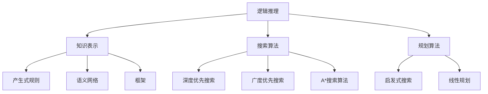

                 

### 1. 经典人工智能概述

经典人工智能（Artificial Intelligence, AI）自20世纪50年代诞生以来，经历了多次重大发展和变革。经典人工智能的主要目标是模拟人类智能，使计算机能够执行复杂的任务，如推理、问题解决、自然语言理解和图像识别等。在这一阶段，经典人工智能的核心算法主要包括逻辑推理、规划、知识表示和搜索算法。

**1.1 经典人工智能的发展历程**

经典人工智能的发展历程可以分为几个重要阶段：

- **初始阶段（1950s-1960s）**：人工智能的概念首次被提出，主要研究逻辑推理和知识表示。
- **黄金时期（1970s）**：人工智能迎来了第一个黄金时期，出现了许多重要成果，如专家系统和知识表示。
- **低谷阶段（1980s-1990s）**：由于实际应用中的挑战，人工智能研究进入低谷，主要问题包括知识表示和推理的复杂性、数据匮乏等。
- **复兴时期（2000s）**：随着互联网的普及和大数据技术的发展，经典人工智能再次受到关注，尤其是在自然语言处理和图像识别领域。

**1.2 经典人工智能的核心算法**

经典人工智能的核心算法主要包括：

- **逻辑推理**：通过形式逻辑进行推理，如命题逻辑和谓词逻辑。
- **知识表示**：将人类知识表示为计算机可以处理的形式，如产生式规则、语义网络和框架。
- **搜索算法**：在大型知识库中搜索最优解，如深度优先搜索、广度优先搜索和A*搜索算法。
- **规划算法**：在不确定环境中制定行动计划，如启发式搜索和线性规划。

**1.3 经典人工智能的应用场景**

经典人工智能在多个领域取得了显著成果：

- **自然语言处理**：通过语义分析和机器翻译，使计算机能够理解和生成自然语言。
- **计算机视觉**：通过图像识别和目标检测，使计算机能够理解视觉信息。
- **游戏AI**：通过决策树和神经网络，使计算机能够玩各种游戏，如围棋和国际象棋。
- **医疗诊断**：通过知识表示和推理，辅助医生进行疾病诊断。

### Mermaid 流程图：经典人工智能核心概念与联系

### 小结

经典人工智能作为人工智能发展的早期阶段，为现代人工智能奠定了基础。它通过逻辑推理、知识表示和搜索算法等方法，使计算机能够模拟人类智能，并在自然语言处理、计算机视觉和医疗诊断等领域取得了显著成果。然而，经典人工智能在面对复杂任务时存在局限性，这为深度学习的兴起提供了契机。

## 关键概念

- **经典人工智能**：模拟人类智能，使计算机能够执行复杂任务的领域。
- **逻辑推理**：基于形式逻辑的推理方法。
- **知识表示**：将人类知识表示为计算机可以处理的形式。
- **搜索算法**：在大型知识库中搜索最优解的方法。
- **自然语言处理**：使计算机能够理解和生成自然语言的领域。
- **计算机视觉**：使计算机能够理解视觉信息的领域。

### 参考文献

- [人工智能发展历程](https://www.bilibili.com/video/BV1Kz4y1j7q3)
- [经典人工智能算法](https://zhuanlan.zhihu.com/p/40218741)
- [自然语言处理概述](https://www.cs.cmu.edu/~ackermand/nlp.html)
- [计算机视觉基本概念](https://www.robots.ox.ac.uk/~vgg/research/rgb/)
- [医疗诊断中的经典人工智能应用](https://www.ncbi.nlm.nih.gov/pmc/articles/PMC3583460/)

