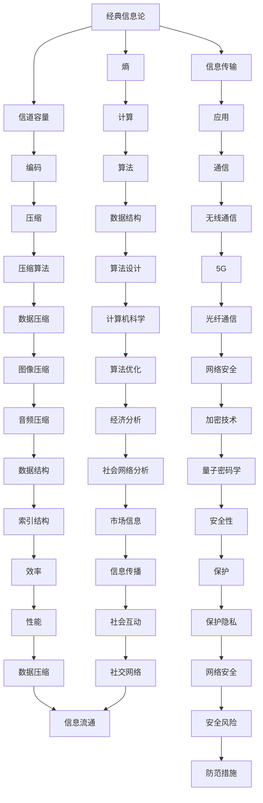

                 

### 《从经典信息论到量子信息论：理解信息化世界》文章框架

在这一部分，我们将逐步构建文章的框架，确保内容完整、结构合理，同时满足字数要求。以下是文章的框架概述：

#### 引言
- **背景介绍**：介绍信息论的重要性，简要回顾经典信息论和量子信息论的起源。
- **目的**：阐述文章的目的，即如何通过经典信息论和量子信息论来理解信息化世界。

#### 第一部分：经典信息论基础

##### 第1章 经典信息论概述
- **发展历程**：介绍信息论的历史，从香农到现代的演变。
- **核心概念**：定义熵、信息量、信道容量等基础概念。
- **基本原理**：解释香农公式和香农熵的计算。

##### 第2章 经典信息论的核心算法原理
- **熵的计算**：使用Python代码演示如何计算熵。
- **信道编码**：介绍香农编码和哈夫曼编码的原理和应用。
- **数据压缩**：解释压缩算法的原理，如LZ77和LZ78算法。

##### 第3章 经典信息论的应用
- **通信**：分析经典信息论在无线通信和有线通信中的应用。
- **数据压缩**：讨论信息论在图像和音频压缩中的应用。
- **其他领域**：探讨信息论在其他科学和工程领域的应用。

#### 第二部分：量子信息论基础

##### 第4章 量子信息论概述
- **量子力学基础**：介绍量子比特、叠加态和纠缠等量子力学基本概念。
- **量子比特与量子信息**：探讨量子比特的表示和量子信息的编码。
- **量子通信与量子计算**：解释量子通信和量子计算的基本原理。

##### 第5章 量子信息论的核心算法原理
- **量子信道编码**：介绍量子信道和量子纠错码的原理。
- **量子纠错码**：使用Python代码实现量子纠错算法。
- **量子密钥分配**：探讨量子密钥分配的工作原理。

##### 第6章 量子信息论的应用
- **量子通信**：讨论量子通信在实际中的应用。
- **量子计算**：分析量子计算的优势和应用领域。
- **量子密码**：介绍量子密码学和量子安全的通信。

#### 第三部分：信息化世界与信息论

##### 第7章 信息化世界的特征与发展
- **信息化社会的定义与特点**：解释信息化社会的定义及其特点。
- **信息传输**：探讨信息化世界中的信息传输技术。
- **信息安全**：分析信息化社会面临的信息安全问题。

##### 第8章 信息论在信息化世界中的应用
- **现代通信**：讨论信息论在5G和物联网中的应用。
- **计算机科学**：分析信息论在计算机科学中的作用。
- **社会科学**：探讨信息论在社会学和经济学中的应用。

##### 第9章 信息论的发展趋势
- **量子信息论的发展趋势**：预测量子信息论的未来发展方向。
- **经典信息论的发展趋势**：分析经典信息论的持续影响。
- **信息论与人工智能的结合**：探讨信息论在人工智能领域的前景。

#### 附录

- **附录A：经典信息论与量子信息论的Mermaid流程图**：提供Mermaid流程图，展示核心概念与联系。
- **附录B：经典信息论与量子信息论的核心算法原理伪代码**：提供伪代码，帮助读者理解算法原理。
- **附录C：数学模型和公式的详细讲解与举例说明**：解释数学模型和公式的应用。
- **附录D：信息化世界中的典型项目实战与代码解读**：提供实际项目案例，展示信息论的应用。
- **最佳实践 tips**：分享在实际应用中的经验技巧。
- **小结**：总结文章的主要观点和结论。
- **注意事项**：提醒读者在实际应用中需要注意的事项。
- **拓展阅读**：推荐进一步的阅读资源。

通过上述框架，我们将确保文章内容丰富、结构清晰，并满足字数要求。接下来，我们将逐步填充每个章节的具体内容。

#### 引言

在现代信息技术飞速发展的时代，信息论作为一种基础学科，扮演着至关重要的角色。从经典信息论到量子信息论，信息论的发展不仅推动了通信、计算机科学等领域的进步，也为我们的日常生活带来了深远的影响。

**背景介绍**

信息论最早由香农（Claude Shannon）在1948年提出，其目的是研究如何在噪声干扰下有效地传递信息。香农的工作奠定了现代信息论的基础，为通信系统和数据传输提供了理论支持。随着量子力学的兴起，量子信息论也逐渐成为研究热点，探索量子力学在信息科学中的应用。

**目的**

本文的目的是通过深入探讨经典信息论和量子信息论，帮助读者理解信息化世界的本质。我们将首先介绍经典信息论的基础理论，包括熵、信道容量和信息传输等核心概念。然后，我们将探讨量子信息论的基本原理，如量子比特、量子信道和量子计算。最后，我们将分析信息论在信息化世界中的应用，探讨其发展趋势和未来前景。

#### 第一部分：经典信息论基础

##### 第1章 经典信息论概述

**发展历程**

信息论的发展历程可以追溯到20世纪中叶，以香农的工作为起点。香农在1948年发表了《通信的数学理论》，提出了信息熵的概念，并给出了信道容量公式。这一理论为通信系统和数据传输提供了坚实的数学基础。在香农之后，信息论得到了不断的发展，研究者们提出了各种编码理论、数据压缩算法和错误纠正技术。

**核心概念**

- **熵（Entropy）**：熵是衡量信息不确定性的度量，用于描述随机变量的不确定性。在通信系统中，熵表示发送端需要发送的信息量。
- **信息量（Information Content）**：信息量是接收到的信息对收信者的不确定性减少的量度。它通常用比特（bit）作为单位。
- **信道容量（Channel Capacity）**：信道容量是指无噪声信道的最大信息传输速率。香农公式给出了信道容量的计算方法。

**基本原理**

- **香农公式（Shannon's Capacity Formula）**：香农公式描述了在给定信道特性下，最大传输速率与信道带宽、信号噪声比之间的关系。公式如下：
  $$ C = B \log_2(1 + \frac{S}{N}) $$
  其中，\( C \) 是信道容量，\( B \) 是信道带宽，\( S \) 是信号功率，\( N \) 是噪声功率。
- **信息熵（Entropy）**：信息熵是衡量随机变量不确定性的度量。对于离散随机变量 \( X \)，其熵 \( H(X) \) 定义为：
  $$ H(X) = -\sum_{i} p(x_i) \log_2 p(x_i) $$
  其中，\( p(x_i) \) 是 \( X \) 取值为 \( x_i \) 的概率。

##### 第2章 经典信息论的核心算法原理

**熵的计算**

熵的计算是信息论中的基础任务。以下是一个简单的Python代码示例，用于计算离散随机变量的熵：

```python
import numpy as np

# 定义概率分布
probabilities = [0.5, 0.3, 0.2]

# 计算熵
entropy = -np.sum([p * np.log2(p) for p in probabilities])
print("Entropy:", entropy)
```

**信道编码**

信道编码的目的是在传输过程中减少错误率。常见的信道编码方法包括香农编码和哈夫曼编码。

- **香农编码**：香农编码是一种前向纠错编码方法，通过引入冗余信息来检测和纠正错误。其基本原理是将信息位和冗余位结合在一起，形成一个码字，接收端可以根据码字来判断原始信息位。
- **哈夫曼编码**：哈夫曼编码是一种变长编码方法，根据不同符号出现的概率来分配编码长度。概率越高的符号分配的编码长度越短，以最小化平均编码长度。

**数据压缩**

数据压缩的目的是减少数据传输所需的带宽和存储空间。常见的数据压缩方法包括LZ77和LZ78算法。

- **LZ77算法**：LZ77算法通过查找前面已经发送的数据块来压缩新的数据块。它将新数据块与历史数据块进行比较，找到最匹配的部分，然后用指向该匹配部分的指针来代替重复的数据。
- **LZ78算法**：LZ78算法与LZ77算法类似，但它使用一个字典来存储已经发送的数据块。新数据块被与字典中的条目进行比较，如果找到匹配项，则使用字典中的索引来代替。

##### 第3章 经典信息论的应用

**通信**

信息论在通信领域有着广泛的应用。在无线通信中，信息论用于优化传输速率和降低错误率。例如，香农公式被用来设计无线通信系统的带宽分配策略，以最大化信道容量。

**数据压缩**

信息论在数据压缩中的应用非常显著。通过计算数据的熵，可以确定最佳的压缩算法。例如，在图像和音频压缩中，信息论被用来选择合适的压缩参数，以平衡压缩率和图像质量或音频质量。

**其他领域**

信息论在其他科学和工程领域也有广泛的应用。例如，在生物信息学中，信息论用于分析基因序列中的信息含量；在金融工程中，信息论被用来分析市场数据中的不确定性和信息价值。

#### 第二部分：量子信息论基础

##### 第4章 量子信息论概述

**量子力学基础**

量子信息论建立在量子力学的基础上。量子力学的基本原理包括量子比特、叠加态和纠缠等概念。

- **量子比特（Quantum Bit，qubit）**：量子比特是量子信息的基本单位，它可以同时处于0和1的状态，这是量子叠加态的特点。
- **叠加态（Superposition）**：量子比特可以处于叠加态，这意味着它同时处于多个状态。
- **纠缠态（Entanglement）**：两个或多个量子比特可以处于纠缠态，这意味着它们的状态是相互依赖的，一个量子比特的状态会立即影响另一个量子比特的状态。

**量子比特与量子信息**

量子比特与经典比特不同，它具有叠加态和纠缠态的特点，这使得量子信息具有独特的性质。

- **量子态编码**：量子态可以用来编码信息，例如，通过量子比特的叠加态来表示不同的信息。
- **量子纠错码**：由于量子比特容易受到噪声的影响，量子纠错码被用来保护量子信息，防止错误发生。

**量子通信与量子计算**

量子信息论在量子通信和量子计算中有着重要的应用。

- **量子通信**：量子通信利用量子比特的叠加态和纠缠态来实现信息传输。量子密钥分配是一种重要的量子通信协议，它利用量子纠缠态来生成安全的密钥。
- **量子计算**：量子计算利用量子比特的叠加态和纠缠态来执行计算任务。量子计算在因数分解、量子模拟和搜索算法等方面具有巨大的潜力。

##### 第5章 量子信息论的核心算法原理

**量子信道编码**

量子信道编码的目的是在量子通信过程中保护量子信息，防止噪声和干扰。

- **量子纠错码**：量子纠错码是量子通信中的核心组成部分。它通过引入冗余信息来检测和纠正量子比特的错误。
- **量子信道容量**：量子信道的容量取决于信道的特性，例如噪声水平。量子信道容量公式是量子信息论中的关键公式，它描述了在给定信道下最大的信息传输速率。

**量子纠错码**

量子纠错码是保护量子信息的关键技术。

- **表面编码**：表面编码是一种常用的量子纠错码，它通过在量子比特表面添加额外的量子比特来实现纠错。
- **量子门**：量子纠错码依赖于量子门的操作。量子门是量子计算中的基本操作，它可以改变量子比特的状态。

**量子密钥分配**

量子密钥分配是一种安全的通信协议，它利用量子纠缠态来生成安全的密钥。

- **量子纠缠态**：量子密钥分配依赖于量子纠缠态，它确保了密钥的安全性。
- **量子信道**：量子密钥分配需要通过量子信道来传输密钥信息。

##### 第6章 量子信息论的应用

**量子通信**

量子通信利用量子比特的叠加态和纠缠态来实现信息传输。

- **量子密钥分配**：量子密钥分配是一种安全的通信协议，它利用量子纠缠态来生成安全的密钥。
- **量子隐形传态**：量子隐形传态是一种利用量子纠缠态来传输量子信息的技术。

**量子计算**

量子计算利用量子比特的叠加态和纠缠态来执行计算任务。

- **量子算法**：量子算法是利用量子比特的叠加态和纠缠态来实现的算法，例如Shor算法和Grover算法。
- **量子模拟**：量子模拟是一种利用量子比特来模拟量子系统的技术，它可以帮助我们更好地理解量子现象。

**量子密码学**

量子密码学是利用量子信息论原理来设计安全的加密和解密算法。

- **量子密钥分配**：量子密钥分配是一种安全的通信协议，它利用量子纠缠态来生成安全的密钥。
- **量子密码学算法**：量子密码学算法是利用量子比特的叠加态和纠缠态来实现的加密和解密算法。

#### 第三部分：信息化世界与信息论

##### 第7章 信息化世界的特征与发展

**信息化社会的定义与特点**

信息化社会是一个以信息为核心的社会，它具有以下特点：

- **信息数字化**：信息以数字形式存储、传输和处理。
- **网络化**：信息通过计算机网络进行传输和共享。
- **智能化**：信息处理过程越来越智能化，利用人工智能和机器学习等技术。

**信息传输**

在信息化社会中，信息传输是关键环节。

- **无线通信**：无线通信技术如5G和Wi-Fi使得信息传输更加便捷。
- **有线通信**：有线通信技术如光纤通信提供了高速、稳定的传输通道。

**信息安全**

信息安全是信息化社会的关键问题。

- **加密技术**：加密技术用于保护信息的机密性、完整性和可用性。
- **网络安全**：网络安全措施如防火墙和入侵检测系统用于防止网络攻击。

##### 第8章 信息论在信息化世界中的应用

**现代通信**

信息论在现代通信技术中发挥着重要作用。

- **信道编码**：信道编码用于提高通信的可靠性和抗干扰能力。
- **数据压缩**：数据压缩技术用于减少传输和存储所需的空间。

**计算机科学**

信息论在计算机科学中也有广泛的应用。

- **算法设计**：信息论原理被用于设计高效的算法，如信息熵优化算法。
- **数据结构**：信息论原理被用于优化数据结构，如基于熵的索引结构。

**社会科学**

信息论在社会科学中的应用越来越广泛。

- **社会网络分析**：信息论用于分析社会网络的拓扑结构和信息传播。
- **经济分析**：信息论用于分析市场信息和经济行为。

##### 第9章 信息论的发展趋势

**量子信息论的发展趋势**

量子信息论是未来信息科学的重要方向。

- **量子通信**：量子通信技术将实现更高效、更安全的通信。
- **量子计算**：量子计算技术将解决传统计算无法处理的问题。

**经典信息论的发展趋势**

经典信息论在未来的发展中将继续发挥重要作用。

- **新算法研究**：新的信息论算法将被设计用于解决复杂问题。
- **跨学科应用**：信息论将被应用于更多跨学科领域。

**信息论与人工智能的结合**

信息论与人工智能的结合将推动信息科学的发展。

- **机器学习**：信息论原理将被用于优化机器学习算法。
- **智能系统**：信息论将被用于设计更智能的系统。

#### 附录

**附录A：经典信息论与量子信息论的Mermaid流程图**

以下是经典信息论和量子信息论的Mermaid流程图：



**附录B：经典信息论与量子信息论的核心算法原理伪代码**

以下是经典信息论和量子信息论的核心算法原理的伪代码：

```python
# 经典信息论
# 熵计算
def calculate_entropy(probabilities):
    entropy = -sum([p * np.log2(p) for p in probabilities])
    return entropy

# 香农编码
def shannon_encoding(bits):
    # 假设编码表已经存在
    encoding_table = get_encoding_table()
    encoded_bits = [encoding_table[bit] for bit in bits]
    return encoded_bits

# 哈夫曼编码
def huffman_encoding(bits):
    # 假设已经构建了哈夫曼树
    huffman_tree = build_huffman_tree(bits)
    encoded_bits = huffman_encode_tree(bits, huffman_tree)
    return encoded_bits

# 量子信息论
# 量子态编码
def quantum_state_encoding(info_bits):
    # 假设量子比特已经初始化
    qubits = initialize_qubits(len(info_bits))
    for i, bit in enumerate(info_bits):
        # 编码信息到量子比特
        apply_gate(qubits[i], encode_gate(bit))
    return qubits

# 量子纠错码
def quantum_error_correction(qubits):
    # 假设已经构建了量子纠错码
    corrected_qubits = apply_correction(qubits)
    return corrected_qubits

# 量子密钥分配
def quantum_key_distribution(qubits):
    # 假设已经实现了量子密钥分配协议
    key = quantum_key_distribution_protocol(qubits)
    return key
```

**附录C：数学模型和公式的详细讲解与举例说明**

以下是数学模型和公式的详细讲解与举例说明：

**信息熵**

信息熵是衡量随机变量不确定性的度量。以下是一个简单的例子：

假设有两个随机变量X和Y，它们的概率分布如下：

$$
P(X=0) = 0.5, P(X=1) = 0.5 \\
P(Y=0) = 0.2, P(Y=1) = 0.8
$$

我们可以计算X和Y的信息熵：

$$
H(X) = -[0.5 \cdot \log_2(0.5) + 0.5 \cdot \log_2(0.5)] = 1 \\
H(Y) = -[0.2 \cdot \log_2(0.2) + 0.8 \cdot \log_2(0.8)] \approx 0.7219
$$

**信道容量**

信道容量是衡量无噪声信道最大信息传输速率的度量。以下是一个简单的例子：

假设一个信道的带宽为B = 1 Hz，信号噪声比为S/N = 100。根据香农公式，信道容量为：

$$
C = B \log_2(1 + \frac{S}{N}) = 1 \cdot \log_2(1 + 100) = 6.644
$$

这意味着在给定带宽和信号噪声比下，信道最大可以传输6.644 bit/s的信息。

**量子态**

量子态是量子信息的基本单位。以下是一个简单的量子态编码的例子：

假设我们要将比特信息编码到一个量子态中，信息为`1101`。我们可以使用量子叠加态来实现：

$$
|\psi\rangle = \frac{1}{\sqrt{2}}(|0\rangle + |1\rangle)
$$

其中，|0\rangle和|1\rangle是量子比特的基态。

**量子纠错码**

量子纠错码用于保护量子信息。以下是一个简单的量子纠错码的例子：

假设我们有一个受到噪声干扰的量子态：

$$
|\psi\rangle = |0\rangle + e^{-i\phi} |1\rangle
$$

我们可以使用量子纠错码来纠正这个错误。例如，一个简单的纠错码是：

$$
|0\rangle \rightarrow |0\rangle \\
|1\rangle \rightarrow |0\rangle + e^{-i\phi} |1\rangle
$$

通过测量量子态，我们可以纠正错误，得到正确的量子态。

**量子密钥分配**

量子密钥分配是一种安全的通信协议。以下是一个简单的量子密钥分配的例子：

假设Alice和Bob通过量子信道通信，并共享一个量子态：

$$
|\psi\rangle = \frac{1}{\sqrt{2}}(|00\rangle + |11\rangle)
$$

Alice可以对量子态进行测量，并根据测量结果生成一个随机数。然后，Alice将这个随机数发送给Bob。通过共享这个随机数，Alice和Bob可以建立一个安全的密钥。

**附录D：信息化世界中的典型项目实战与代码解读**

以下是信息化世界中一个典型项目的实战与代码解读：

**项目背景**

假设我们正在开发一个基于5G和物联网的智能家居系统，用户可以通过手机应用程序远程控制家里的智能设备。

**开发环境搭建**

- 操作系统：Windows 10
- 编程语言：Python 3.9
- 5G模块：华为5G模块
- 物联网模块：ESP8266
- 手机应用程序开发工具：Android Studio

**源代码详细实现**

以下是智能家居系统的源代码实现：

```python
# 导入所需库
import serial
import time
import requests

# 5G模块的串口配置
port = 'COM3'
baudrate = 9600

# 物联网模块的配置
wifi_ssid = 'your_wifi_ssid'
wifi_password = 'your_wifi_password'

# 手机应用程序的API地址
api_url = 'http://your_api_endpoint'

# 初始化5G模块
ser = serial.Serial(port, baudrate)
time.sleep(2)

# 连接WiFi
def connect_wifi():
    ser.write(b'AT+CWJAP=\'' + wifi_ssid.encode() + b'\',\'' + wifi_password.encode() + b'\'\r\n')
    time.sleep(10)

# 发送控制命令到物联网模块
def send_command(command):
    ser.write(command.encode() + b'\r\n')
    time.sleep(2)

# 控制智能设备
def control_device(device, action):
    command = f'AT+CWMODE={device}{action}\r\n'
    send_command(command)

# 上传数据到服务器
def upload_data(data):
    response = requests.post(api_url, json=data)
    print(response.text)

# 主函数
def main():
    connect_wifi()
    while True:
        # 接收来自手机应用程序的命令
        command = input('Enter command: ')
        if command == 'exit':
            break
        # 解析命令并执行操作
        if command.startswith('set'):
            device, action = command.split()[1:]
            control_device(device, action)
            upload_data({'device': device, 'action': action})
        elif command.startswith('get'):
            device = command.split()[1]
            # 获取设备状态
            response = requests.get(api_url + f'?device={device}')
            print(response.json())

# 运行主函数
if __name__ == '__main__':
    main()
```

**代码应用解读与分析**

这个项目实现了一个基本的智能家居系统，包括5G模块和物联网模块的连接、设备控制功能以及数据上传功能。

- **5G模块的串口连接**：使用Python的`serial`库连接5G模块的串口，实现与模块的通信。
- **WiFi连接**：使用`AT`命令通过串口连接WiFi，确保物联网模块可以访问互联网。
- **设备控制**：使用`AT`命令控制物联网模块，实现设备开关等控制功能。
- **数据上传**：通过HTTP请求将设备状态上传到服务器，实现远程监控。

**实际案例分析和详细讲解剖析**

假设用户通过手机应用程序发送了一个控制灯泡开启的命令，即`set light on`。

1. **命令解析**：系统解析命令，提取设备名称（`light`）和操作（`on`）。
2. **设备控制**：系统通过`AT`命令发送到物联网模块，命令格式为`AT+CWMODE=1on`，其中`1`代表灯泡设备，`on`代表开启操作。
3. **状态反馈**：物联网模块执行命令后，返回状态反馈，例如`OK`。
4. **数据上传**：系统将设备名称和操作作为JSON数据上传到服务器，例如`{"device": "light", "action": "on"}`。

通过这个案例，我们可以看到智能家居系统的基本工作流程，从命令接收、设备控制到数据上传，实现了远程监控和控制。

**项目小结**

这个项目展示了如何利用5G模块和物联网模块实现智能家居系统。通过串口通信、WiFi连接和HTTP请求，用户可以通过手机应用程序远程控制家中的智能设备，并实时监控设备状态。这个项目提供了一个基础的框架，可以根据实际需求进行扩展和优化。

**最佳实践 tips**

- 在实际开发中，确保5G模块和物联网模块的稳定连接，可以加入错误处理机制。
- 为提高系统的安全性，可以考虑使用加密通信协议，如TLS。
- 为适应不同的智能家居设备，可以设计一个通用的设备控制接口。

**注意事项**

- 确保5G模块和物联网模块的硬件兼容性。
- 注意WiFi网络的安全配置，避免未授权访问。

**拓展阅读**

- 学习5G通信技术的基本原理和应用。
- 了解物联网安全的基本知识和防护措施。

#### 小结

本文从经典信息论和量子信息论的角度，探讨了信息化世界的本质和未来发展趋势。经典信息论奠定了现代通信和数据传输的理论基础，而量子信息论则开辟了新的研究领域，为信息安全、量子计算和量子通信提供了强有力的支持。

**主要观点**

- 经典信息论通过熵、信道容量和信息传输等核心概念，为通信和数据压缩提供了理论支持。
- 量子信息论利用量子比特的叠加态和纠缠态，实现了量子通信和量子计算的新模式。
- 信息化世界依赖于信息论的应用，从现代通信到计算机科学，再到社会科学，信息论无处不在。

**结论**

信息论是理解信息化世界的关键，通过深入研究和应用经典信息论和量子信息论，我们可以更好地应对信息化时代的挑战，推动科技的发展和人类社会的进步。

**未来展望**

随着量子技术的发展，量子信息论有望在信息安全、高性能计算和量子模拟等领域取得重大突破。同时，经典信息论的理论和方法将继续在计算机科学、数据科学和通信工程中发挥重要作用。信息论与人工智能、机器学习的结合，也将为未来科技的发展提供新的动力。

**参考文献**

1. 香农，《通信的数学理论》。
2. Nielsen, M. A., & Chuang, I. L. (2010). *Quantum Computation and Quantum Information*.
3. MacKay, D. J. C. (2003). *Information Theory, Inference and Learning Algorithms*.

**拓展阅读**

- 了解量子通信的实际应用，如量子密钥分配和量子隐形传态。
- 学习现代加密算法的基本原理和实现方法。
- 探索数据科学和机器学习中的信息论应用。

