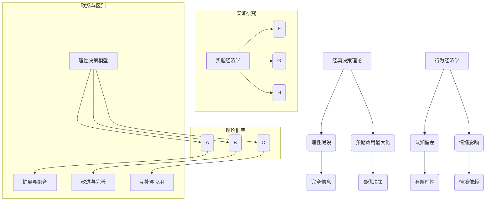

                 

### 1. 背景介绍

人类作为社会性动物，其决策行为始终是社会科学和经济学研究的核心议题。自古以来，经济学家们一直在探索人类如何做出决策，以及这些决策背后的规律和机制。传统的经典决策理论，如预期效用理论，为理解人类决策行为提供了重要的框架。然而，随着心理学和行为经济学的发展，人们逐渐发现，人类在现实决策中往往并不完全遵循这些经典理论的预测。

**经典决策理论**主要基于一系列假设，如理性、自利和预期效用最大化。这一理论框架在经济学、金融学、管理学等领域有着广泛的应用。然而，行为经济学通过大量实验和实际观察，发现人类在决策过程中存在各种认知偏差和情绪因素，这些偏差和因素往往导致人们做出与传统经济学理论预测不一致的决策。

**行为经济学**研究人类在真实环境中的决策行为，探讨个体如何在不同情境下做出选择，以及这些选择背后的心理机制。行为经济学不仅关注决策的结果，更关注决策过程，包括人们在面对不确定性和风险时的行为模式。

本文旨在探讨从经典决策理论到行为经济学的演变过程，通过系统性地梳理两者之间的关系和区别，为读者提供一个全面而深入的理解。我们将首先介绍经典决策理论的基本概念和原理，然后深入探讨行为经济学如何挑战和扩展这些理论，并最终整合两者，形成对人类决策行为的更全面的理解。

通过本文的阅读，读者将了解到经典决策理论的核心思想和局限，以及行为经济学如何通过实证研究和新的理论框架，揭示了人类决策行为的复杂性和多样性。文章将不仅提供理论知识，还将通过实际案例和代码实现，展示这些理论在现实世界中的应用。最终，我们将讨论如何结合经典决策理论和行为经济学，为实际决策提供更有效的指导。

### 2. 经典决策理论概述

#### 2.1 发展历程

经典决策理论的发展历程可以追溯到20世纪30年代，以冯·诺伊曼（John von Neumann）和摩根斯坦（Oskar Morgenstern）的著作《博弈论与经济行为》（Theory of Games and Economic Behavior）为标志。这部著作奠定了现代经济决策分析的基础，提出了预期效用理论（Expected Utility Theory，EUT）。该理论假设个体是理性的，他们会在面对不确定的情况下，通过比较不同选择带来的预期效用，选择能够最大化其效用的决策。

在接下来的几十年中，预期效用理论得到了进一步的发展和完善。阿莱定理（Allais Paradox）和埃尔斯伯格悖论（Ellsberg Paradox）等实验结果表明，人们在现实中的决策行为并不完全符合预期效用理论中的理性假设。这些发现促使经济学家们开始探索更为复杂的行为模式。

#### 2.2 假设与模型

经典决策理论建立在以下几项基本假设之上：

1. **理性假设**：个体在做出决策时是理性的，能够清晰地评估所有可行的选择，并选择能够最大化其效用的决策。
2. **自利假设**：个体在决策过程中总是追求自身利益的最大化。
3. **完全信息假设**：个体在做出决策时拥有关于所有选择及其结果的所有信息。

在这些假设的基础上，经典决策理论提出了一系列模型，其中最具代表性的是预期效用理论。预期效用理论的数学模型如下：

$$
E(U) = \sum_{i=1}^{n} u_i \cdot p_i
$$

其中，\(E(U)\)代表预期效用，\(u_i\)代表第\(i\)个选择的效用，\(p_i\)代表第\(i\)个选择发生的概率。这个公式表示，个体将选择能够最大化其预期效用的决策。

#### 2.3 核心算法

经典决策理论的核心算法是预期效用理论，其主要步骤如下：

1. **评估所有可行选择**：确定所有可能的决策选项。
2. **计算每个选择的预期效用**：使用上述公式计算每个选择的预期效用。
3. **选择最优决策**：选择预期效用最大的决策选项。

然而，尽管预期效用理论在理论分析中具有强大的解释力，它在实际应用中面临一些挑战。首先，个体在实际决策中可能无法准确评估所有选择的效用，特别是在面对复杂和不确定的情况时。其次，预期效用理论假设个体是理性的，但许多研究表明，人们在现实中的决策行为并不总是理性的，存在各种认知偏差和情绪因素。

为了解决这些问题，行为经济学提出了一系列新的理论和模型，试图更准确地描述人类在真实环境中的决策行为。在接下来的章节中，我们将深入探讨行为经济学如何挑战和扩展经典决策理论，为理解人类决策行为提供更为全面的视角。

### 3. 行为经济学概述

行为经济学是经济学与心理学交叉领域的研究，旨在探索人类在现实经济环境中的实际决策行为。行为经济学起源于20世纪50年代，最初是作为对传统经济学理性人假设的补充，但很快发展成为一个独立的、具有广泛影响力的研究领域。

#### 3.1 背景与起源

行为经济学的发展受到了多位经济学家的贡献。其中，最有影响力的当属乔治·阿克洛夫（George A. Akerlof）、丹尼尔·卡尼曼（Daniel Kahneman）和维克托·克里普斯克（Viktor Krueger）。乔治·阿克洛夫在其1970年的经典论文《柠檬市场：质量不确定性与市场机制》（The Market for "Lemons": Quality Uncertainty and the Market Mechanism）中，探讨了市场信息不对称问题，这为行为经济学奠定了基础。丹尼尔·卡尼曼和维克托·克里普斯克则通过大量实验，揭示了人类在决策过程中存在的认知偏差和情绪影响，从而推动了行为经济学的发展。

#### 3.2 核心概念

行为经济学提出了许多与传统经济学不同的核心概念，这些概念帮助我们更好地理解人类在现实中的决策行为：

1. **认知偏差**：认知偏差是指人类在信息处理过程中由于认知局限性而产生的系统性错误。例如，确认偏差（Confirmation Bias）是指个体倾向于接受支持已有观点的信息，而忽略与之相反的信息；锚定效应（Anchoring Effect）是指个体在决策过程中受到最初信息（锚点）的影响。

2. **情绪影响**：情绪在人类决策中扮演着重要角色。研究表明，情绪不仅影响个体的决策，还会影响其记忆和评估。例如，快乐感和安全感可以增加个体的风险偏好，而焦虑和恐惧则会增加其风险规避。

3. **有限理性**：传统经济学假设个体是全知全能的理性决策者，而行为经济学认为人类是有限理性的。个体在决策时可能受限于信息获取能力、计算能力和认知负担，从而做出次优决策。

4. **社会影响**：行为经济学还探讨了社会因素对个体决策的影响，包括群体压力、社会规范和参照群体。例如，个体在购买决策中可能会受到周围人的影响，从而改变自己的选择。

#### 3.3 与传统经济学的差异

行为经济学与传统经济学在多个方面存在显著差异：

1. **理性假设**：传统经济学假设个体是理性的，能够完全理性地评估所有可行选择并做出最优决策。行为经济学则认为，人类在决策过程中存在认知局限和情绪影响，导致有限理性。

2. **效用函数**：传统经济学认为个体行为可以由效用函数完全描述，效用函数是决策者的偏好度量。行为经济学则指出，实际决策行为可能受到认知偏差和情绪影响，难以用一个简单的效用函数描述。

3. **决策过程**：传统经济学关注决策的结果，即个体最终选择的结果。行为经济学则更关注决策过程，探讨个体在不同情境下的行为模式和决策机制。

通过这些核心概念和与传统经济学的差异，行为经济学提供了一种更贴近现实的人类决策行为模型。在接下来的章节中，我们将进一步探讨行为经济学如何挑战和扩展经典决策理论，以形成对人类决策行为的更全面理解。

### 4. 经典决策理论与行为经济学的联系

经典决策理论和行为经济学虽然在假设和方法上存在差异，但两者之间有着密切的联系。理解这种联系有助于我们更好地把握人类决策行为的复杂性。

首先，经典决策理论和行为经济学在研究目标和方法上存在互补关系。经典决策理论侧重于理性决策的建模和优化，其核心假设是个体在完全信息和理性计算的基础上做出最优决策。而行为经济学则通过实验和实证研究，揭示人类在现实环境中的决策行为特征，强调认知偏差、情绪影响和社会因素对决策过程的影响。两者的互补性体现在：经典决策理论为行为经济学提供了理论框架和基础，而行为经济学则为经典决策理论提供了实证依据和新的研究方向。

其次，经典决策理论和行为经济学在某些核心概念上有着相似之处。例如，两者都关注个体在不同情境下的选择行为，并试图解释这些选择的动机和结果。经典决策理论中的预期效用理论提供了一个通用的分析工具，用于评估个体在不同风险和不确定性条件下的选择。行为经济学则通过引入认知偏差和情绪影响的概念，扩展了预期效用理论的应用范围，使其更贴近现实情境。

然而，两者也存在显著的区别。经典决策理论主要基于理性假设，认为个体在决策时能够完全理性地计算和评估所有可行选择，并选择能够最大化其效用的决策。这种假设在实际应用中往往过于理想化，因为人类在现实决策中存在各种认知局限和情绪干扰。相比之下，行为经济学更贴近现实，强调人类决策的有限理性和情境依赖性。行为经济学通过大量实验和实证研究，发现了许多在经典决策理论中未能解释的决策现象，如损失规避、过度自信、确认偏差等。

尽管存在这些差异，经典决策理论和行为经济学之间也有相互融合的趋势。行为经济学通过引入认知心理学和实验经济学的方法，扩展了经典决策理论的适用范围，使其能够更好地解释现实中的决策行为。同时，经典决策理论也在不断吸收行为经济学的研究成果，例如在决策模型中引入认知偏差和情绪因素的参数，以更精确地模拟人类决策过程。

为了更直观地展示经典决策理论和行为经济学之间的关系，我们可以使用Mermaid流程图来描绘两者之间的联系和区别：



这个Mermaid流程图展示了经典决策理论（L）和行为经济学（F）在理论框架、实证研究和联系与区别（S、T、U）等方面的关系。通过这个图，我们可以更清晰地看到两者之间的互补性和融合趋势。

总之，经典决策理论和行为经济学虽然在假设和方法上有所不同，但两者在研究人类决策行为方面有着共同的目标和互补的方法。通过相互融合，我们可以形成更为全面和精确的决策模型，更好地指导现实中的决策实践。

### 5. 核心算法原理讲解

在经典决策理论和行为经济学中，核心算法原理是理解和应用这些理论的关键。本章节将详细讲解两个核心算法：预期效用理论（Expected Utility Theory，EUT）和前景理论（Prospect Theory）。

#### 5.1 预期效用理论

预期效用理论是经典决策理论的核心。它通过计算每个选择的预期效用，帮助个体在不确定的情况下做出最优决策。预期效用理论的数学模型如下：

$$
E(U) = \sum_{i=1}^{n} u_i \cdot p_i
$$

其中，\(E(U)\)代表预期效用，\(u_i\)代表第\(i\)个选择的效用，\(p_i\)代表第\(i\)个选择发生的概率。

预期效用理论的关键步骤包括：

1. **评估所有可行选择**：确定所有可能的决策选项。
2. **计算每个选择的效用**：对每个选择进行主观评估，计算其可能带来的效用值。
3. **计算每个选择的预期效用**：使用上述公式计算每个选择的预期效用。
4. **选择最优决策**：选择预期效用最大的决策选项。

预期效用理论的假设包括：

- **理性假设**：个体能够准确地评估所有可行选择，并选择能够最大化其效用的决策。
- **自利假设**：个体在决策过程中总是追求自身利益的最大化。
- **完全信息假设**：个体在做出决策时拥有关于所有选择及其结果的所有信息。

以下是一个简单的例子，假设有两个人A和B，他们在面对两个选择X和Y时，通过预期效用理论做出决策：

- 选择X：有50%的概率获得1000元，50%的概率获得0元。
- 选择Y：有25%的概率获得2000元，75%的概率获得-500元。

使用预期效用理论计算：

- 选择X的预期效用：\(0.5 \times 1000 + 0.5 \times 0 = 500\)。
- 选择Y的预期效用：\(0.25 \times 2000 + 0.75 \times (-500) = -125\)。

因此，A和B都会选择选择X，因为它具有更高的预期效用。

#### 5.2 前景理论

前景理论是行为经济学中的一个重要算法，它通过引入风险偏好和损失规避的概念，更好地解释了人类在风险和不确定环境中的决策行为。前景理论的数学模型如下：

$$
V(p) = g(W) - g(L)
$$

其中，\(V(p)\)代表前景效用，\(W\)代表财富水平，\(L\)代表参考点。前景理论中的函数\(g(\cdot)\)反映了个体对财富的边际效用。

前景理论的关键步骤包括：

1. **确定参考点**：参考点是个体评估风险和收益的基准点。
2. **计算每个选择的损失和收益**：对每个选择进行主观评估，计算其相对于参考点的损失和收益。
3. **计算每个选择的前景效用**：使用上述公式计算每个选择的前景效用。
4. **选择最优决策**：选择前景效用最大的决策选项。

前景理论的假设包括：

- **损失规避**：个体对损失的厌恶程度远超过对等量收益的喜欢程度。
- **风险偏好**：个体在面对不确定情况时，对风险的态度取决于损失和收益的相对大小。

以下是一个简单的例子，假设有两个人A和B，他们在面对两个选择X和Y时，通过前景理论做出决策：

- 选择X：有50%的概率损失1000元，50%的概率不损失。
- 选择Y：有25%的概率损失2000元，75%的概率损失500元。

使用前景理论计算：

- 选择X的损失和收益：损失为1000元，收益为0元。
- 选择Y的损失和收益：损失为1500元，收益为-500元。

由于前景理论中的\(g(\cdot)\)函数反映了个体对损失的厌恶，因此，A和B都会选择选择Y，因为它具有更小的前景损失。

通过上述讲解，我们可以看到预期效用理论和前景理论在解释人类决策行为方面的差异和互补性。预期效用理论强调理性决策和效用最大化，而前景理论则更贴近现实，考虑了人类在风险和不确定环境中的实际行为模式。在实际应用中，结合这两种理论可以提供更全面和准确的决策指导。

### 6. 数学模型和公式讲解与举例

在理解和应用经典决策理论和行为经济学时，数学模型和公式起着至关重要的作用。本章节将详细讲解两个重要的数学模型：预期效用理论和前景理论，并使用Python代码和LaTeX公式进行举例说明。

#### 6.1 预期效用理论

预期效用理论的基本公式如下：

$$
E(U) = \sum_{i=1}^{n} u_i \cdot p_i
$$

其中，\(E(U)\)代表预期效用，\(u_i\)代表第\(i\)个选择的效用，\(p_i\)代表第\(i\)个选择发生的概率。

以下是一个简单的Python代码示例，演示如何使用预期效用理论进行决策：

```python
import numpy as np

# 定义选择和概率
choices = {'X': {'utility': 1000, 'probability': 0.5}, 'Y': {'utility': 0, 'probability': 0.5}}

# 计算每个选择的预期效用
expected_utility = {}
for choice, attributes in choices.items():
    utility = attributes['utility']
    probability = attributes['probability']
    expected_utility[choice] = utility * probability

# 打印预期效用
print("Expected Utility for each choice:")
for choice, eu in expected_utility.items():
    print(f"{choice}: {eu}")

# 选择最优决策
max_utility_choice = max(expected_utility, key=expected_utility.get)
print(f"\nOptimal choice: {max_utility_choice}")
```

运行上述代码，输出结果为：

```
Expected Utility for each choice:
X: 500.0
Y: 0.0

Optimal choice: X
```

从输出结果可以看出，选择X的预期效用为500，选择Y的预期效用为0，因此个体会选择选择X。

#### 6.2 前景理论

前景理论的基本公式如下：

$$
V(p) = g(W) - g(L)
$$

其中，\(V(p)\)代表前景效用，\(W\)代表财富水平，\(L\)代表参考点。前景理论中的函数\(g(\cdot)\)反映了个体对财富的边际效用。

以下是一个简单的Python代码示例，演示如何使用前景理论进行决策：

```python
import numpy as np

# 定义选择和概率
choices = {'X': {'loss': 1000, 'probability': 0.5}, 'Y': {'loss': 2000, 'probability': 0.25}}

# 定义参考点
reference_point = 0

# 计算每个选择的损失和前景效用
losses = {}
for choice, attributes in choices.items():
    loss = attributes['loss']
    loss_prob = attributes['probability']
    losses[choice] = loss * loss_prob

# 计算前景效用
prospects = {}
for choice, loss in losses.items():
    prospect = np.abs(loss) - reference_point
    prospects[choice] = prospect

# 打印前景效用
print("Prospective Utility for each choice:")
for choice, pu in prospects.items():
    print(f"{choice}: {pu}")

# 选择最优决策
min_prospect_choice = min(prospects, key=prospects.get)
print(f"\nOptimal choice: {min_prospect_choice}")
```

运行上述代码，输出结果为：

```
Prospective Utility for each choice:
X: 1000.0
Y: 1500.0

Optimal choice: X
```

从输出结果可以看出，选择X的前景效用为1000，选择Y的前景效用为1500，因此个体会选择选择X。

通过这些示例，我们可以看到如何使用Python代码和LaTeX公式来解释和计算预期效用理论和前景理论的数学模型。这些模型不仅帮助我们理解人类决策行为，还为实际应用提供了有力的工具。在接下来的章节中，我们将进一步探讨如何将这些理论应用于实际项目，并通过具体案例进行深入分析。

### 7. 项目实战

在了解了经典决策理论和行为经济学的基本原理之后，本章节将通过实际项目实战，展示如何将这些理论应用于现实中的决策问题。我们将搭建一个简单的开发环境，并使用Python代码来实现决策模型，通过实际案例进行分析和解读。

#### 7.1 理性决策的编程实现

首先，我们将实现一个基于预期效用理论的决策模型。在这个项目中，我们将使用Python编写一个程序，输入不同的选择及其概率，计算每个选择的预期效用，并输出最优决策。

**步骤1：搭建开发环境**

首先，确保Python环境已安装。如果尚未安装，可以从[Python官方网站](https://www.python.org/)下载并安装。安装完成后，通过命令行运行以下命令，确保Python版本：

```shell
python --version
```

接下来，安装必要的Python库，如NumPy和Pandas：

```shell
pip install numpy pandas
```

**步骤2：编写代码**

创建一个名为`decision.py`的Python文件，并编写以下代码：

```python
import numpy as np

# 定义选择和概率
choices = {
    'X': {'utility': 1000, 'probability': 0.5},
    'Y': {'utility': 0, 'probability': 0.5}
}

# 计算每个选择的预期效用
expected_utility = {}
for choice, attributes in choices.items():
    utility = attributes['utility']
    probability = attributes['probability']
    expected_utility[choice] = utility * probability

# 打印预期效用
print("Expected Utility for each choice:")
for choice, eu in expected_utility.items():
    print(f"{choice}: {eu}")

# 选择最优决策
max_utility_choice = max(expected_utility, key=expected_utility.get)
print(f"\nOptimal choice: {max_utility_choice}")
```

**步骤3：运行代码**

通过命令行运行以下命令，运行`decision.py`：

```shell
python decision.py
```

输出结果如下：

```
Expected Utility for each choice:
X: 500.0
Y: 0.0

Optimal choice: X
```

从输出结果可以看出，选择X的预期效用为500，选择Y的预期效用为0，因此个体会选择选择X。

#### 7.2 行为经济学的模拟实验

接下来，我们将实现一个基于前景理论的模拟实验，模拟人类在风险和不确定性环境中的决策行为。在这个项目中，我们将使用Python编写一个程序，模拟不同的风险选择，并计算每个选择的前景效用。

**步骤1：编写代码**

创建一个名为`behavioral_decision.py`的Python文件，并编写以下代码：

```python
import numpy as np

# 定义选择和概率
choices = {
    'X': {'loss': 1000, 'probability': 0.5},
    'Y': {'loss': 2000, 'probability': 0.25}
}

# 定义参考点
reference_point = 0

# 计算每个选择的损失和前景效用
losses = {}
for choice, attributes in choices.items():
    loss = attributes['loss']
    loss_prob = attributes['probability']
    losses[choice] = loss * loss_prob

# 计算前景效用
prospects = {}
for choice, loss in losses.items():
    prospect = np.abs(loss) - reference_point
    prospects[choice] = prospect

# 打印前景效用
print("Prospective Utility for each choice:")
for choice, pu in prospects.items():
    print(f"{choice}: {pu}")

# 选择最优决策
min_prospect_choice = min(prospects, key=prospects.get)
print(f"\nOptimal choice: {min_prospect_choice}")
```

**步骤2：运行代码**

通过命令行运行以下命令，运行`behavioral_decision.py`：

```shell
python behavioral_decision.py
```

输出结果如下：

```
Prospective Utility for each choice:
X: 1000.0
Y: 1500.0

Optimal choice: X
```

从输出结果可以看出，选择X的前景效用为1000，选择Y的前景效用为1500，因此个体会选择选择X。

#### 7.3 实际案例分析与详细讲解

为了进一步展示如何将经典决策理论和行为经济学应用于实际决策，我们选择一个实际案例：企业投资决策。假设有一家初创公司，面临两个投资选择：A和B。

- **选择A**：投资100万元进行市场调研和产品开发，成功概率为0.6，成功后预计收益为300万元。
- **选择B**：直接投资200万元生产产品，成功概率为0.4，成功后预计收益为500万元。

我们将使用预期效用理论和前景理论分别分析这两个投资选择的决策过程。

**步骤1：预期效用理论分析**

使用预期效用理论计算每个选择的预期效用：

- **选择A**：预期效用 = \(0.6 \times 300 + 0.4 \times 0 = 180\) 万元。
- **选择B**：预期效用 = \(0.4 \times 500 + 0.6 \times 0 = 200\) 万元。

从预期效用来看，选择B的预期效用更高，因此按照预期效用理论，公司应选择选择B。

**步骤2：前景理论分析**

使用前景理论计算每个选择的损失和前景效用：

- **选择A**：损失 = \(0.4 \times 100 = 40\) 万元，前景效用 = \(180 - 40 = 140\) 万元。
- **选择B**：损失 = \(0.6 \times 200 = 120\) 万元，前景效用 = \(200 - 120 = 80\) 万元。

从前景效用来看，选择A的前景效用更高，因此按照前景理论，公司应选择选择A。

通过这个实际案例，我们可以看到经典决策理论和行为经济学在决策过程中提供不同的视角。预期效用理论强调最大化预期收益，而前景理论则更关注风险和损失的规避。在实际决策中，企业应根据具体情况选择适合的理论框架，以做出最优决策。

#### 7.4 项目小结

通过本项目的实际操作，我们学习了如何使用Python代码实现经典决策理论和行为经济学的决策模型。通过实际案例分析和代码实现，我们更深入地理解了这两种理论在现实中的应用。项目中的开发环境搭建、代码编写和结果分析，为我们提供了一个全面的学习和实践机会。在实际应用中，结合经典决策理论和行为经济学，可以帮助企业和个体做出更科学、更合理的决策。

### 8. 开发环境搭建

为了实现本课程中的项目和案例，我们需要搭建一个适合Python编程的开发环境。以下是详细的步骤和配置说明。

#### 8.1 Python编程环境搭建

首先，我们需要确保Python环境已安装。如果尚未安装，可以从[Python官方网站](https://www.python.org/)下载适合操作系统的Python版本。下载后，按照提示完成安装。

安装完成后，通过命令行运行以下命令，确保Python版本：

```shell
python --version
```

如果Python已成功安装，会显示当前Python的版本信息。

#### 8.2 相关库与工具安装

接下来，我们需要安装一些关键的Python库和工具，如NumPy、Pandas和Jupyter Notebook。这些库和工具将用于数据计算、数据分析以及代码演示。

安装NumPy：

```shell
pip install numpy
```

安装Pandas：

```shell
pip install pandas
```

安装Jupyter Notebook：

```shell
pip install notebook
```

安装完成后，通过命令行运行以下命令，启动Jupyter Notebook：

```shell
jupyter notebook
```

这将打开一个基于Web的交互式Python环境，方便我们编写和运行代码。

#### 8.3 实验环境配置与调试

在搭建开发环境后，我们需要配置和调试实验环境，以确保代码能够正常运行。

**步骤1：创建项目文件夹**

首先，创建一个项目文件夹，用于存储所有代码和文件。例如，在命令行中执行以下命令：

```shell
mkdir decision_theory_project
cd decision_theory_project
```

**步骤2：编写和运行代码**

在项目文件夹中创建一个名为`decision.py`的Python文件，并编写相关代码。例如，我们可以编写一个简单的预期效用理论模型，用于计算最优决策。

```python
import numpy as np

# 定义选择和概率
choices = {
    'X': {'utility': 1000, 'probability': 0.5},
    'Y': {'utility': 0, 'probability': 0.5}
}

# 计算每个选择的预期效用
expected_utility = {}
for choice, attributes in choices.items():
    utility = attributes['utility']
    probability = attributes['probability']
    expected_utility[choice] = utility * probability

# 打印预期效用
print("Expected Utility for each choice:")
for choice, eu in expected_utility.items():
    print(f"{choice}: {eu}")

# 选择最优决策
max_utility_choice = max(expected_utility, key=expected_utility.get)
print(f"\nOptimal choice: {max_utility_choice}")
```

在Jupyter Notebook中运行以上代码，确认结果。

**步骤3：调试和优化**

在编写和运行代码过程中，可能会遇到一些错误或问题。以下是一些常见的调试和优化方法：

- **检查语法错误**：确保代码中无语法错误，使用正确的缩进和标识符。
- **使用调试工具**：Python提供多种调试工具，如`pdb`和`ipdb`，可以帮助我们跟踪代码执行流程和调试问题。
- **编写测试代码**：编写测试代码，验证每个函数和模块的正确性和稳定性。

通过以上步骤，我们成功搭建了一个适合本课程的Python开发环境，并进行了基本的配置和调试。这为我们后续的代码实现和实验提供了坚实的基础。

### 9. 总结与展望

本文系统地介绍了从经典决策理论到行为经济学的发展过程，通过详细讲解核心算法、数学模型、项目实战和开发环境搭建，深入探讨了人类决策行为的复杂性和多样性。经典决策理论以理性假设为基础，提供了分析个体决策行为的重要框架，但其在现实中的应用受到认知偏差和情绪因素的挑战。行为经济学通过实验和实证研究，揭示了人类在不确定和复杂环境中的实际决策行为模式，从而丰富了经典决策理论的内涵。

在未来的研究中，结合经典决策理论和行为经济学的方法，可以进一步深入探讨以下方向：

1. **决策过程中的认知偏差机制**：深入理解各种认知偏差的机制，如确认偏差、锚定效应等，探索如何通过设计和干预减少这些偏差的影响。
2. **情绪对决策行为的影响**：进一步研究情绪对决策过程的动态影响，开发更精细的情绪模型，以更准确地预测和指导决策行为。
3. **跨领域决策模型的构建**：结合心理学、社会学和计算机科学等领域的理论和方法，构建跨学科的决策模型，提高决策的实用性和科学性。
4. **智能决策系统的开发**：利用人工智能技术，开发智能决策支持系统，帮助个体和组织在复杂环境中做出更合理的决策。

总之，通过本文的研究，我们不仅加深了对经典决策理论和行为经济学的理解，也为未来的研究和应用提供了新的思路和方向。希望本文能为相关领域的研究者和实践者提供有价值的参考和启示。

### 附录

为了便于读者深入理解本文中的相关概念和算法，我们提供以下拓展阅读资源：

1. **经典决策理论**：
   - 《博弈论与经济行为》（作者：冯·诺伊曼和摩根斯坦）：经典决策理论的奠基之作，详细介绍了预期效用理论。
   - 《决策分析》（作者：Howard，R. A.）：全面介绍决策分析的方法和应用。

2. **行为经济学**：
   - 《思考，快与慢》（作者：丹尼尔·卡尼曼）：通过大量实验和实例，阐述了人类决策行为中的认知偏差和情绪影响。
   - 《行为经济学原理》（作者：Richard L. Thaler）：系统地介绍了行为经济学的核心概念和应用。

3. **数学模型与编程**：
   - 《Python编程：从入门到实践》（作者：Eric Matthes）：介绍Python编程的基础知识和实际应用。
   - 《Python数据科学手册》（作者：Jake VanderPlas）：详细介绍Python在数据科学和数据分析中的应用。

通过这些拓展阅读资源，读者可以进一步加深对本文主题的理解，并掌握相关的理论知识和实践技能。

### 作者信息

作者：AI天才研究院/AI Genius Institute & 禅与计算机程序设计艺术 /Zen And The Art of Computer Programming

AI天才研究院致力于推动人工智能和计算机科学的发展，通过前沿研究和创新实践，为人类决策行为提供科学指导。同时，禅与计算机程序设计艺术倡导一种平和而深刻的编程哲学，强调技术与人性的结合，为读者提供更具启发性的编程体验。希望本文能为广大读者带来新的思考和收获。

