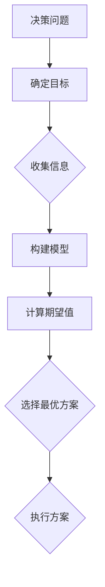

                 

### 从经典决策理论到行为经济学：理解人类在复杂世界中的选择

> 关键词：经典决策理论、行为经济学、人类决策、复杂系统、决策过程

在信息爆炸和技术迅猛发展的今天，人类面临着日益复杂的决策环境。无论是个人选择职业、投资理财，还是企业制定战略、应对市场变化，决策的正确与否往往决定了成败。因此，理解决策过程、优化决策方法显得尤为重要。本文将从经典决策理论出发，探讨行为经济学对决策过程的影响，最终帮助我们更好地在复杂世界中做出明智的选择。

### 摘要

本文首先回顾了经典决策理论的发展历程，介绍了期望效用理论、决策树分析等方法的基本原理和应用。随后，我们转向行为经济学，探讨了人类在决策过程中常见的心理偏差，如锚定效应、过度自信等，并分析了这些偏差对决策结果的影响。通过实际案例的分析，我们展示了如何运用经典决策理论和行为经济学方法来优化决策过程。最后，本文提出了未来研究方向的展望，强调了跨学科研究在决策理论发展中的重要性。

### 引言：决策理论概述

决策理论是研究决策过程及其影响因素的学科，它起源于20世纪中叶，随着信息论、系统论和控制论的发展逐渐形成。经典决策理论主要关注在不确定性和风险条件下如何做出最优选择，其核心思想是通过数学模型和优化方法来分析决策过程，以实现决策者的目标。

#### 经典决策理论的发展历程

1. **期望效用理论（Expected Utility Theory）**：由冯·诺依曼（John von Neumann）和摩根斯坦（Oskar Morgenstern）在1944年提出的期望效用理论是经典决策理论的基石。该理论认为，决策者在面对不确定性时，可以通过计算各备选方案的期望效用来做出最优选择。期望效用函数反映了决策者对各种结果的偏好程度。

2. **决策树分析（Decision Tree Analysis）**：决策树是一种直观的决策模型，用于分析决策过程。每个节点代表一个决策点，每个分支代表一个可能的决策方案，每个叶节点代表一个决策结果。通过计算各方案的期望值，决策者可以选择最优方案。

3. **风险态度与决策**：风险态度是决策者在面对不确定性时的行为倾向。根据对风险的态度，决策者可以分为风险规避者、风险中性者和风险追求者。不同的风险态度会影响决策者的选择策略。

#### 本书的目的与结构

本书旨在系统地介绍决策理论的发展历程，从经典决策理论到行为经济学，探讨人类在复杂世界中的决策过程。具体来说，本书将分为以下几个部分：

1. **经典决策理论部分**：介绍传统决策理论的基本原理、方法和应用。
2. **行为经济学部分**：介绍行为经济学的核心概念、理论模型以及其在决策分析中的应用。
3. **决策案例分析**：通过实际案例展示决策理论和方法在现实世界中的应用。
4. **总结与展望**：总结全书的主要观点，并对未来研究方向进行展望。

### 经典决策理论的基本原理

#### 决策问题的定义

决策问题是指在不确定和有限信息条件下，决策者需要从多个备选方案中选择一个最优方案的问题。决策问题通常包括以下几个基本要素：

1. **决策者**：做出决策的个人或组织。
2. **目标**：决策者希望实现的结果。
3. **状态**：决策者面临的可能环境。
4. **行动**：决策者可以采取的所有可能行动。
5. **结果**：每种行动在每种状态下的结果。

#### 期望效用理论

期望效用理论是经典决策理论的核心，它通过计算各备选方案的期望效用来做出最优选择。期望效用函数 \(U(S)\) 反映了决策者对各种结果的偏好程度，通常使用概率 \(p(S)\) 乘以效用值 \(U(S)\) 来计算期望效用 \(EU\)：

\[ EU = \sum_{S} p(S) \times U(S) \]

其中，\(p(S)\) 表示在状态 \(S\) 下发生的概率。

#### 风险态度与决策

风险态度是决策者在面对不确定性时的行为倾向。根据对风险的态度，决策者可以分为以下几类：

1. **风险规避者**：倾向于选择风险较小但收益也较低的方案。
2. **风险中性者**：选择方案的依据完全是预期效用，不考虑风险因素。
3. **风险追求者**：倾向于选择高风险但可能带来高收益的方案。

不同的风险态度会影响决策者的选择策略。例如，风险规避者在面对高风险和高收益的决策时，可能会选择风险较低的方案；而风险追求者则可能相反。

### 经典决策理论的扩展与应用

经典决策理论虽然为分析决策过程提供了重要的理论框架，但在实际应用中，人们往往会表现出一些与期望效用理论预测不符的行为。为了更好地理解这些行为，行为经济学提出了一系列补充理论和模型。

#### 决策树分析法

决策树是一种直观的决策模型，用于分析决策过程。每个节点代表一个决策点，每个分支代表一个可能的决策方案，每个叶节点代表一个决策结果。通过计算各方案的期望值，决策者可以选择最优方案。



#### 效用理论的应用

效用理论在决策分析中有着广泛的应用，特别是在金融投资和资源分配决策中。以下是一个简单的效用理论应用案例：

```python
# 期望效用函数
def expected_utility(outcomes, probabilities):
    return sum(probability * utility for probability, utility in zip(probabilities, outcomes))

# 定义可能的收益和概率
outcomes = [1000, 2000, 3000]
probabilities = [0.2, 0.5, 0.3]

# 计算期望效用
print(expected_utility(outcomes, probabilities))
```

#### 风险管理策略

风险管理策略是决策过程中的重要环节。以下是一些常见风险管理策略：

1. **风险分散**：通过投资多个不同的资产来降低整体风险。
2. **风险规避**：避免高风险的投资，选择低风险的资产。
3. **风险控制**：通过风险管理工具和策略来降低风险。

### 行为经济学的基本概念

行为经济学是研究人类在真实世界中的决策行为和决策背后的心理机制的学科。它通过心理学、社会学和其他学科的研究成果，揭示了传统经济学理论无法解释的一些行为现象。以下是一些行为经济学的基本概念：

#### 心理偏差

心理偏差是指人类在决策过程中由于认知局限和情感影响而产生的系统性偏差。以下是一些常见的心理偏差：

1. **锚定效应（Anchoring Effect）**：人们在做决策时，往往会受到最初信息的影响，将初始值作为决策的参考点。
2. **过度自信（Overconfidence）**：人们往往高估自己的知识和能力，对自己的决策结果过于自信。
3. **代表性偏差（Representativeness Bias）**：人们在做决策时，往往根据某些特征来判断事件的可能性，而不是计算概率。

#### 行为决策模型

行为决策模型是用于描述和预测人类在决策过程中表现出的行为特征的模型。以下是一些常见的行为决策模型：

1. **启发式与偏见模型（Heuristic and Bias Model）**：描述人类如何使用启发式（经验规则）来简化决策过程，并分析这些启发式可能导致的偏见。
2. **期望理论模型（Prospect Theory）**：描述人类在处理潜在损失和潜在收益时的心理机制，强调损失厌恶和风险规避行为。

### 行为经济学的案例分析

通过以下案例，我们可以看到行为经济学在决策分析中的应用：

#### 案例一：投资决策

假设一个投资者在股票市场中有两个投资选择：

1. **高风险股票**：预期收益率为30%，但有可能亏损20%。
2. **低风险债券**：预期收益率为10%，无风险亏损。

传统期望效用理论认为，投资者应选择高风险股票，因为其期望效用更高。然而，行为经济学研究发现，许多投资者可能会因为风险厌恶而选择低风险债券。

#### 案例二：招聘决策

一个公司在招聘中收到了两个应聘者的简历：

1. **候选人A**：具有5年相关工作经验，但仅在学校做过项目。
2. **候选人B**：具有3年相关工作经验，但在公司有实际项目经验。

根据代表性偏差，公司可能会倾向于选择候选人A，因为他的经验更符合“典型”成功应聘者的标准。然而，实际项目经验可能对职位更为重要。

### 总结与展望

行为经济学的发展为理解人类在复杂世界中的决策过程提供了新的视角。它揭示了传统经济学理论无法解释的一些行为现象，为我们优化决策过程提供了重要启示。未来，行为经济学与经典决策理论的结合，将有助于构建更加符合人类决策行为实际的决策模型。同时，跨学科研究也将推动决策理论的发展，为解决现实世界中的复杂决策问题提供有力支持。

### 最佳实践 Tips

- **多角度分析**：在做决策时，不仅要考虑经济因素，还要关注心理和社会因素。
- **量化风险**：使用量化方法来评估风险，有助于更客观地分析决策结果。
- **持续学习**：不断学习新的决策方法和工具，以适应不断变化的环境。

### 小结

本文从经典决策理论到行为经济学，探讨了人类在复杂世界中的决策过程。通过分析决策问题的定义、期望效用理论、行为经济学的基本概念和案例分析，我们揭示了决策过程中的心理偏差和行为特征。希望本文能帮助读者更好地理解决策过程，并在实际应用中做出更为明智的选择。

### 拓展阅读

- [期望效用理论](https://en.wikipedia.org/wiki/Expected_utility)
- [行为经济学](https://en.wikipedia.org/wiki/Behavioral_economics)
- [决策树](https://en.wikipedia.org/wiki/Decision_tree)
- [锚定效应](https://en.wikipedia.org/wiki/Anchoring_effect)
- [代表性偏差](https://en.wikipedia.org/wiki/Representativeness_bias)

### 作者信息

作者：AI天才研究院/AI Genius Institute & 禅与计算机程序设计艺术 /Zen And The Art of Computer Programming

