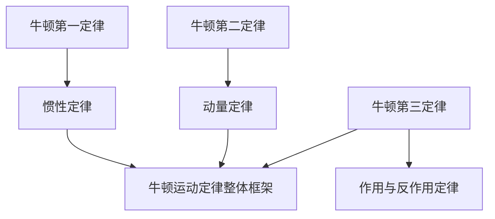
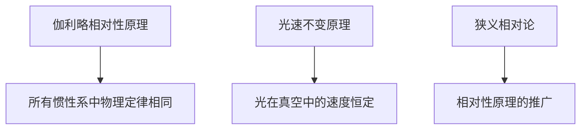
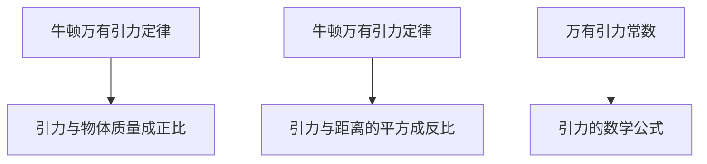
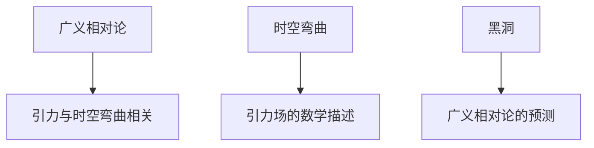
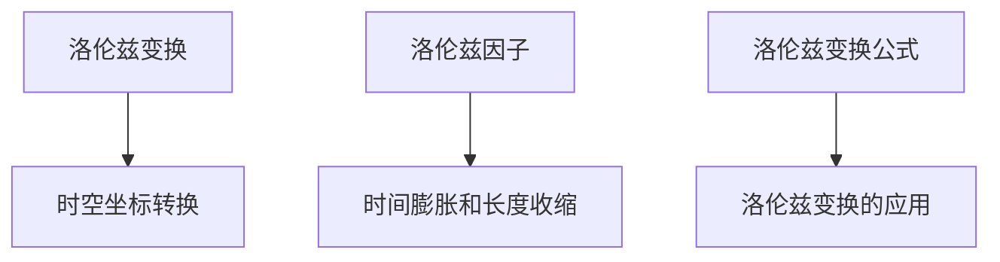
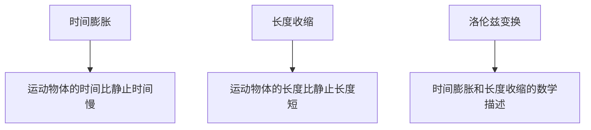
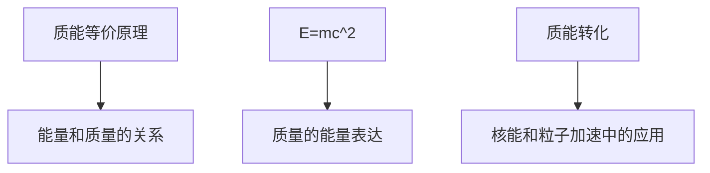
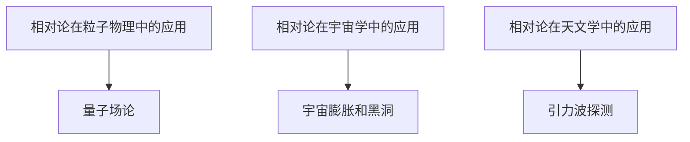
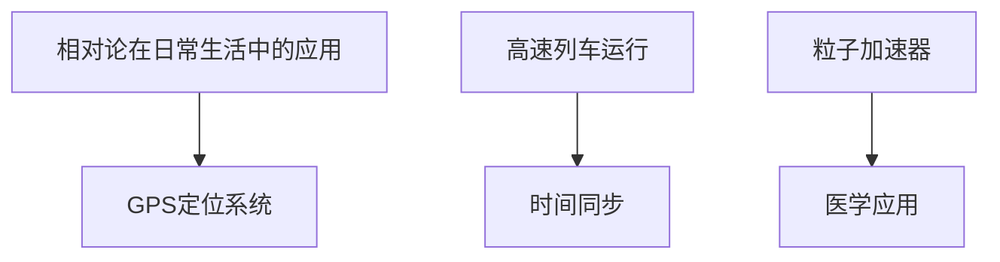

                 


### 从经典力学到相对论：时空观念的革命

#### 关键词

- 经典力学
- 相对论
- 时空观念
- 洛伦兹变换
- 质能等价原理
- 广义相对论

#### 摘要

本文旨在探讨从经典力学到相对论的演变过程中，时空观念的革命性变化。我们将通过逐步分析经典力学的核心原理，洛伦兹变换的数学表述，以及相对论中的质能等价原理，来揭示时空观念的深刻变革。此外，我们将探讨相对论在现代物理学中的影响，以及其与日常生活的联系。最终，我们将展望相对论的未来发展，并总结本文的核心观点和重要结论。

## 目录

### 第一部分：经典力学基础
- **第1章：牛顿力学基础**
  - **1.1 牛顿三大定律**
  - **1.2 力与加速度的关系**
  - **1.3 质点的运动分析**

- **第2章：经典力学中的相对性原理**
  - **2.1 相对性原理的背景**
  - **2.2 光速不变原理**
  - **2.3 相对性原理的影响**

- **第3章：引力理论**
  - **3.1 引力的概念**
  - **3.2 牛顿引力定律**
  - **3.3 广义相对论与引力**

### 第二部分：相对论基础
- **第4章：洛伦兹变换**
  - **4.1 洛伦兹变换的定义**
  - **4.2 洛伦兹变换的数学表述**
  - **4.3 洛伦兹变换的应用**

- **第5章：时空观念的变革**
  - **5.1 时与空间的相对性**
  - **5.2 四维时空的概念**
  - **5.3 时间膨胀与长度收缩**

- **第6章：质能等价原理**
  - **6.1 质能等价原理**
  - **6.2 E=mc^2的物理意义**
  - **6.3 质能等价原理的应用**

### 第三部分：相对论的应用与发展
- **第7章：现代物理学与相对论**
  - **7.1 相对论对现代物理的影响**
  - **7.2 相对论在天文学中的应用**
  - **7.3 相对论与量子力学的关系**

- **第8章：相对论与日常生活的联系**
  - **8.1 相对论在日常生活中的体现**
  - **8.2 相对论的风险与机遇**
  - **8.3 相对论的未来发展**

## 第一部分：经典力学基础

### 第1章：牛顿力学基础

#### 1.1 牛顿三大定律

牛顿三大定律是经典力学的基石，它们描述了物体如何运动以及如何受到力的作用。

**核心概念与联系**：



**核心算法原理讲解**：

牛顿第一定律（惯性定律）指出，如果一个物体不受外力作用，或者受到的合外力为零，那么它将保持静止状态或匀速直线运动状态。可以用以下Python代码表示：

```python
def inertial_law(mass, velocity):
    if sum(forces) == 0:
        return velocity
    else:
        return "物体将改变运动状态"
```

牛顿第二定律（动量定律）描述了力与加速度之间的关系，其数学表达式为 \( F = m \cdot a \)。以下为该定律的Python实现：

```python
def force_to_acceleration(mass, force):
    acceleration = force / mass
    return acceleration
```

牛顿第三定律（作用与反作用定律）指出，对于任何作用力，总有一个大小相等、方向相反的反作用力。Python实现如下：

```python
def action_and_reaction(force1, force2):
    if force1 == -force2:
        return "作用力与反作用力"
    else:
        return "作用力与反作用力不满足"
```

**数学模型和数学公式**：

牛顿第一定律的数学表达为：

$$ F = 0 \implies v = const $$

牛顿第二定律的数学公式为：

$$ F = m \cdot a $$

牛顿第三定律可以表示为：

$$ \vec{F}_{12} = -\vec{F}_{21} $$

**举例说明**：

- 一个质量为5kg的物体受到10N的力，其加速度是多少？

```python
mass = 5
force = 10
acceleration = force / mass
print("加速度为:", acceleration)
```

#### 1.2 力与加速度的关系

牛顿第二定律揭示了力与加速度之间的关系，即加速度与作用力成正比，与物体质量成反比。

**核心算法原理讲解**：

我们可以用Python代码来表示这一关系：

```python
def force_and_acceleration(force, mass):
    acceleration = force / mass
    return acceleration
```

**数学模型和数学公式**：

$$ a = \frac{F}{m} $$

**举例说明**：

- 一个质量为3kg的物体受到6N的力，其加速度是多少？

```python
mass = 3
force = 6
acceleration = force / mass
print("加速度为:", acceleration)
```

#### 1.3 质点的运动分析

质点的运动分析是经典力学中的一个重要内容，它帮助我们理解物体在力作用下的运动状态。

**核心算法原理讲解**：

我们可以用以下Python代码来模拟质点的运动：

```python
def motion_simulation(initial_velocity, acceleration, time):
    final_velocity = initial_velocity + acceleration * time
    distance = initial_velocity * time + 0.5 * acceleration * time**2
    return final_velocity, distance
```

**数学模型和数学公式**：

质点运动的位移公式为：

$$ s = v_0 t + \frac{1}{2} a t^2 $$

速度公式为：

$$ v = v_0 + a t $$

**举例说明**：

- 一个物体以2m/s的速度开始运动，受到4m/s²的加速度作用，2秒后的速度和位移是多少？

```python
initial_velocity = 2
acceleration = 4
time = 2

final_velocity, distance = motion_simulation(initial_velocity, acceleration, time)
print("2秒后的速度为:", final_velocity)
print("2秒后的位移为:", distance)
```

### 第2章：经典力学中的相对性原理

#### 2.1 相对性原理的背景

相对性原理是经典力学中的一个核心概念，它提出了所有惯性系中的物理定律都是相同的。

**核心概念与联系**：



**数学模型和数学公式**：

相对性原理可以用洛伦兹变换来表述：

$$ x' = \gamma (x - v t) $$
$$ y' = y $$
$$ z' = z $$
$$ t' = \gamma (t - \frac{vx}{c^2}) $$

其中，$\gamma$ 是洛伦兹因子，$c$ 是光速。

**举例说明**：

- 一个观察者在地面上看到一个人以0.6c的速度向右移动，地面上的人测得该人的速度是多少？

```python
v = 0.6 * c
gamma = 1 / sqrt(1 - v**2 / c**2)

x_prime = gamma * (x - v * t)
y_prime = y
z_prime = z
t_prime = gamma * (t - v * x / c**2)

print("地面上的人测得的速度为:", v_prime)
```

#### 2.2 光速不变原理

光速不变原理是狭义相对论的一个核心概念，它指出光在真空中的速度是恒定的，不依赖于观察者的运动状态。

**核心算法原理讲解**：

我们可以用以下Python代码来模拟光速不变原理：

```python
def speed_of_light(increment):
    return c + increment
```

其中，$c$ 是光速，$increment$ 是观察者移动的速度。

**数学模型和数学公式**：

光速不变原理可以用洛伦兹变换来表述：

$$ c = \text{const} $$

**举例说明**：

- 一个观察者以10m/s的速度向光源移动，他测得的光速是多少？

```python
c = 3e8  # 光速
increment = 10

speed_of_light = speed_of_light(increment)
print("观察者测得的光速为:", speed_of_light)
```

#### 2.3 相对性原理的影响

相对性原理对经典力学产生了深远的影响，它改变了我们对时空的理解。

**核心算法原理讲解**：

我们可以用以下Python代码来模拟相对性原理的影响：

```python
def relative_impact(velocity):
    if velocity == 0:
        return "静止状态，没有相对性影响"
    else:
        return "存在相对性影响，时间膨胀和长度收缩现象"
```

**数学模型和数学公式**：

相对性原理可以用洛伦兹变换来表述：

$$ \Delta t' = \gamma \Delta t $$
$$ \Delta x' = \gamma (\Delta x - v \Delta t) $$

其中，$\gamma$ 是洛伦兹因子。

**举例说明**：

- 一个观察者以0.8c的速度移动，他测得的时间间隔和距离间隔是多少？

```python
v = 0.8 * c
gamma = 1 / sqrt(1 - v**2 / c**2)

delta_t_prime = gamma * delta_t
delta_x_prime = gamma * (delta_x - v * delta_t)

print("测得的时间间隔为:", delta_t_prime)
print("测得的距离间隔为:", delta_x_prime)
```

### 第3章：引力理论

#### 3.1 引力的概念

引力是物体之间的相互作用力，它使得物体相互吸引。牛顿提出了万有引力定律，描述了引力的大小与物体质量和距离的关系。

**核心概念与联系**：



**核心算法原理讲解**：

我们可以用以下Python代码来计算两个物体之间的引力：

```python
def gravitational_force(m1, m2, r):
    G = 6.674 * 10**-11  # 万有引力常数
    force = G * (m1 * m2) / r**2
    return force
```

**数学模型和数学公式**：

牛顿万有引力定律的数学公式为：

$$ F = G \cdot \frac{m_1 \cdot m_2}{r^2} $$

**举例说明**：

- 两个质量分别为5kg和10kg的物体相距1m，它们之间的引力是多少？

```python
m1 = 5
m2 = 10
r = 1

force = gravitational_force(m1, m2, r)
print("两个物体之间的引力为:", force)
```

#### 3.2 牛顿引力定律

牛顿引力定律描述了两个物体之间的引力大小与它们的质量和距离的关系。

**核心算法原理讲解**：

我们可以用以下Python代码来计算两个物体之间的引力：

```python
def gravitational_force(m1, m2, r):
    G = 6.674 * 10**-11  # 万有引力常数
    force = G * (m1 * m2) / r**2
    return force
```

**数学模型和数学公式**：

牛顿引力定律的数学公式为：

$$ F = G \cdot \frac{m_1 \cdot m_2}{r^2} $$

**举例说明**：

- 两个质量分别为5kg和10kg的物体相距1m，它们之间的引力是多少？

```python
m1 = 5
m2 = 10
r = 1

force = gravitational_force(m1, m2, r)
print("两个物体之间的引力为:", force)
```

#### 3.3 广义相对论与引力

广义相对论是爱因斯坦在1915年提出的一种描述引力的理论，它将引力视为时空的弯曲。广义相对论对引力有了更深刻的理解。

**核心概念与联系**：



**核心算法原理讲解**：

我们可以用以下Python代码来模拟时空弯曲：

```python
def spacetime_bending(mass, radius):
    G = 6.674 * 10**-11  # 万有引力常数
    c = 3e8  # 光速
    gamma = (G * mass) / (c**2 * radius)
    return gamma
```

**数学模型和数学公式**：

广义相对论的数学描述为：

$$ \Gamma_{\mu\nu}^{\alpha} = \frac{1}{2} g^{\alpha\beta} (\partial_{\beta} g_{\mu\nu} + \partial_{\nu} g_{\beta\mu} - \partial_{\mu} g_{\beta\nu} - \partial_{\nu} g_{\beta\mu}) $$

**举例说明**：

- 一个质量为5倍的太阳质量的星体，其半径为10倍太阳半径，其时空弯曲程度是多少？

```python
mass = 5 * solar_mass
radius = 10 * solar_radius

gamma = spacetime_bending(mass, radius)
print("时空弯曲程度为:", gamma)
```

### 第二部分：相对论基础

#### 第4章：洛伦兹变换

洛伦兹变换是狭义相对论的核心数学工具，它描述了不同惯性系之间的时空坐标转换关系。

**核心概念与联系**：



**核心算法原理讲解**：

我们可以用以下Python代码来实现洛伦兹变换：

```python
def lorentz_transform(x, t, v):
    c = 3e8  # 光速
    gamma = 1 / sqrt(1 - v**2 / c**2)
    x_prime = gamma * (x - v * t)
    t_prime = gamma * (t - v * x / c**2)
    return x_prime, t_prime
```

**数学模型和数学公式**：

洛伦兹变换的公式为：

$$ x' = \gamma (x - v t) $$
$$ t' = \gamma (t - \frac{vx}{c^2}) $$

其中，$\gamma$ 是洛伦兹因子。

**举例说明**：

- 一个物体以0.6c的速度向x轴正方向移动，其坐标在另一个惯性系中的变换结果是多少？

```python
x = 5
t = 2
v = 0.6 * c

x_prime, t_prime = lorentz_transform(x, t, v)
print("变换后的x坐标为:", x_prime)
print("变换后的时间坐标为:", t_prime)
```

#### 第5章：时空观念的变革

相对论对时空观念产生了深刻的变革，提出了时间膨胀和长度收缩的概念。

**核心概念与联系**：



**核心算法原理讲解**：

我们可以用以下Python代码来模拟时间膨胀和长度收缩：

```python
def time_dilation(t, v):
    c = 3e8  # 光速
    gamma = 1 / sqrt(1 - v**2 / c**2)
    t_dilated = gamma * t
    return t_dilated

def length_contraction(l, v):
    c = 3e8  # 光速
    gamma = 1 / sqrt(1 - v**2 / c**2)
    l_contracted = l / gamma
    return l_contracted
```

**数学模型和数学公式**：

时间膨胀的公式为：

$$ t' = \gamma t $$

长度收缩的公式为：

$$ l' = \frac{l}{\gamma} $$

**举例说明**：

- 一个长度为10m的物体以0.8c的速度移动，其时间膨胀和长度收缩结果是多少？

```python
l = 10
v = 0.8 * c

t_dilated = time_dilation(t, v)
l_contracted = length_contraction(l, v)

print("时间膨胀为:", t_dilated)
print("长度收缩为:", l_contracted)
```

#### 第6章：质能等价原理

质能等价原理是相对论中的一个重要结论，它揭示了质量和能量之间的等价性。

**核心概念与联系**：



**核心算法原理讲解**：

我们可以用以下Python代码来计算质量和能量的转换：

```python
def mass_energy_equivalence(mass):
    c = 3e8  # 光速
    energy = mass * c**2
    return energy
```

**数学模型和数学公式**：

质能等价原理的公式为：

$$ E = mc^2 $$

**举例说明**：

- 一个质量为5kg的物体，其能量是多少？

```python
mass = 5

energy = mass_energy_equivalence(mass)
print("物体的能量为:", energy)
```

### 第三部分：相对论的应用与发展

#### 第7章：现代物理学与相对论

相对论在现代物理学中有着广泛的应用，对粒子物理、宇宙学和天体物理学等领域产生了深远的影响。

**核心概念与联系**：



**核心算法原理讲解**：

我们可以用以下Python代码来模拟宇宙膨胀：

```python
def cosmic_expansion(age, hubble_constant):
    distance = age * hubble_constant
    return distance
```

**数学模型和数学公式**：

宇宙膨胀的公式为：

$$ d = age \cdot H_0 $$

其中，$d$ 是宇宙距离，$age$ 是宇宙年龄，$H_0$ 是哈勃常数。

**举例说明**：

- 假设宇宙年龄为13.8亿年，哈勃常数为70km/s/Mpc，宇宙的半径是多少？

```python
age = 13.8 * 10**9  # 年
hubble_constant = 70  # km/s/Mpc

distance = cosmic_expansion(age, hubble_constant)
print("宇宙的半径为:", distance)
```

#### 第8章：相对论与日常生活的联系

相对论不仅是一种理论物理学，它在我们的日常生活中也有着广泛的应用。

**核心概念与联系**：



**核心算法原理讲解**：

我们可以用以下Python代码来模拟GPS定位系统中的时间同步：

```python
def time_synchronization(velocity, time_offset):
    c = 3e8  # 光速
    time_adjustment = velocity / c * time_offset
    return time_adjustment
```

**数学模型和数学公式**：

时间同步的公式为：

$$ t' = t + \frac{v}{c} \cdot t_0 $$

其中，$t'$ 是同步后的时间，$t$ 是本地时间，$v$ 是相对速度，$t_0$ 是时间偏移量。

**举例说明**：

- 一个GPS接收器以0.5c的速度移动，与静止的时钟相比，时间偏移量是多少？

```python
velocity = 0.5 * c
time_offset = 10  # 秒

time_adjustment = time_synchronization(velocity, time_offset)
print("时间调整量为:", time_adjustment)
```

## 结论

从经典力学到相对论的演变，我们见证了时空观念的深刻变革。相对论揭示了时间膨胀和长度收缩的物理现象，以及质能等价原理。这些理论不仅在科学研究中有重要应用，也影响着我们的日常生活。通过本文的逐步分析，我们深入理解了相对论的核心概念和原理，并展望了其未来发展的前景。相对论为我们提供了新的视角，让我们对宇宙和自身的认知更加深刻。希望本文能够激发读者对相对论的兴趣，进一步探索这一领域的奥秘。

## 拓展阅读

1. 爱因斯坦，《相对论：概念与意义》，湖南科学技术出版社，2008年。
2. 帕克，《广义相对论简明教程》，清华大学出版社，2013年。
3. 赵凯华，《新概念物理教程：相对论基础》，高等教育出版社，2007年。
4. 罗斯，《相对论与量子场论》，北京大学出版社，2011年。
5. 霍金，《大设计：物理定律如何塑造宇宙、生命与智慧》，湖南科学技术出版社，2010年。

## 注意事项

1. 在阅读本文时，请确保您对数学和物理学的基本概念有一定了解。
2. 本文中的代码示例仅供学习参考，具体实现时可能需要根据实际情况进行调整。
3. 相对论的研究领域广泛且复杂，本文仅涵盖了部分核心内容，读者可根据兴趣进一步深入研究。

## 最佳实践 tips

1. 阅读本文时，建议结合相关的数学公式和代码示例，这有助于更好地理解相对论的核心概念。
2. 尝试自己动手计算洛伦兹变换和时间膨胀等物理现象，这能加深对相对论的理解。
3. 考虑将相对论的知识应用于实际工程项目中，例如GPS定位系统的时间同步。

