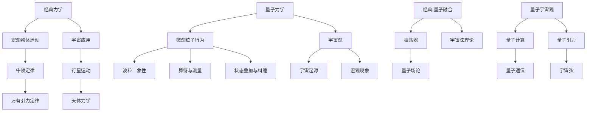

                 

## 《从经典力学到量子力学：宇宙观的革命》

在人类探索自然界的道路上，物理学始终扮演着至关重要的角色。从经典力学到量子力学的演变，不仅改变了我们对物质世界的理解，更是引发了宇宙观的革命。本文旨在通过逐步分析，深入探讨这一过程中的核心概念、理论发展及其对现代科学的深远影响。

### 关键词

- 经典力学
- 量子力学
- 宇宙观
- 波粒二象性
- 纠缠
- 宇宙弦理论

### 摘要

本文首先介绍了经典力学的基本原理及其在宇宙中的应用，随后讨论了经典力学的局限性。在此基础上，我们详细探讨了量子力学的基础概念，包括波粒二象性、算符与测量、状态叠加与纠缠。接着，文章分析了量子力学对宇宙起源和宏观现象的影响，探讨了经典力学与量子力学的融合及其在宇宙弦理论中的应用。最后，文章总结了量子力学对宇宙观的革命性影响，并展望了未来的发展方向。

## 经典力学基础

经典力学，又称牛顿力学，是描述宏观物体运动的物理学分支。其核心在于牛顿三大定律和万有引力定律。

### 牛顿三大定律

1. **第一定律（惯性定律）**：一个物体如果没有受到外力，将保持静止或匀速直线运动。
2. **第二定律（动力定律）**：一个物体的加速度与作用在它上面的外力成正比，与它的质量成反比，方向与外力方向相同。数学表达式为 $F=ma$。
3. **第三定律（作用-反作用定律）**：任何作用力都有一个大小相等、方向相反的反作用力。

### 万有引力定律

万有引力定律描述了两个物体之间的引力与它们的质量和距离的关系。公式为 $F = G\frac{m_1m_2}{r^2}$，其中 $G$ 是万有引力常数。

经典力学在宇宙中的应用非常广泛，如描述行星运动、行星轨道计算、天体力学等。然而，随着科学的发展，人们发现经典力学在描述微观粒子和高速运动现象时存在明显的局限性。

### 经典力学的局限性

经典力学的局限性主要体现在以下几个方面：

1. **微观粒子**：经典力学无法解释电子、光子等微观粒子的行为。例如，电子在原子核周围的运动无法用经典力学的轨道理论解释。
2. **高速运动**：经典力学无法准确描述物体在接近光速时的运动状态。当物体速度接近光速时，经典力学的预测与实际观测结果存在巨大偏差。

这些局限性促使科学家们探索新的理论，以更好地描述自然界的基本规律。量子力学应运而生，成为现代物理学的重要基石。

## 量子力学基础

量子力学是描述微观世界行为的物理学分支。与经典力学不同，量子力学提出了全新的概念和原理，如波粒二象性、算符与测量、状态叠加与纠缠。

### 波粒二象性

波粒二象性是量子力学中最基本的概念之一。它指出微观粒子既具有波动性又具有粒子性。

1. **波动性**：微观粒子可以像波一样传播，其波动性质由波函数描述。波函数的平方给出了粒子在某一位置出现的概率。
2. **粒子性**：微观粒子在特定时刻表现出粒子性，如电子在光电效应中的表现。

### 算符与测量

在量子力学中，算符用于描述物理量的变化。测量一个物理量，实际上就是对该物理量进行算符作用，并观察其结果。

1. **算符的定义**：算符是线性变换，将波函数映射到另一个波函数。
2. **测量的结果**：测量结果是一个概率分布，取决于波函数的形态。

### 状态叠加与纠缠

量子力学中，一个量子系统可以处于多个状态的叠加。此外，量子力学中存在一种特殊的现象——纠缠。

1. **状态叠加**：一个量子系统可以同时处于多个状态的叠加，如 $|\psi\rangle = c_1|\psi_1\rangle + c_2|\psi_2\rangle$。
2. **纠缠**：两个或多个量子系统可以形成纠缠态，其中一个系统的状态与另一个系统的状态紧密相关。

这些核心概念构成了量子力学的基本框架，使得科学家能够更好地理解微观世界的本质。

## 量子力学与宇宙观

量子力学不仅改变了我们对微观世界的认识，还深刻影响了我们对宇宙的理解。以下内容将探讨量子力学在宇宙起源和宏观现象中的应用。

### 量子力学与宇宙的起源

量子力学为宇宙起源提供了新的视角。例如，宇宙微波背景辐射的观测数据支持了宇宙大爆炸理论。此外，量子力学中的量子涨落理论解释了宇宙早期的高能态。

### 量子力学与宏观现象

量子力学不仅影响微观世界，还影响宏观现象。例如，超导和超流现象都可以用量子力学解释。

1. **超导现象**：超导材料在特定温度下电阻降为零，这可以通过量子力学中的玻色-爱因斯坦凝聚理论解释。
2. **超流现象**：超流体在流动时没有粘滞，这可以通过量子力学中的量子涨落理论解释。

这些现象表明，量子力学在宏观尺度上也具有重要意义。

## 经典力学与量子力学的融合

经典力学与量子力学的融合是现代物理学的重要研究方向。以下内容将讨论经典力学与量子力学的融合及其在宇宙弦理论中的应用。

### 振荡器和量子场论

振荡器是经典力学与量子力学融合的一个重要领域。量子场论（QFT）是描述粒子间相互作用的量子理论，它是经典力学与量子力学融合的桥梁。

1. **振荡器的应用**：振荡器在通信、电子学和量子计算等领域有广泛应用。
2. **量子场论的概念**：量子场论通过引入量子化的波动方程，将经典力学与量子力学结合在一起。

### 经典量子引力和宇宙弦

经典量子引力是尝试将量子力学与广义相对论结合起来的理论。宇宙弦理论是经典量子引力的一种形式，它描述了一维的缺陷线，这些缺陷线可能构成宇宙的基本结构。

1. **经典量子引力的挑战**：经典量子引力面临诸如黑洞信息和量子悖论等挑战。
2. **宇宙弦理论的展望**：宇宙弦理论为理解宇宙的起源和结构提供了新的视角。

## 量子力学与宇宙观的革命

量子力学的出现引发了宇宙观的革命。以下内容将讨论量子力学对宇宙观的改变以及未来的发展方向。

### 新的宇宙观

量子力学改变了我们对宇宙的基本认识。例如，量子涨落理论解释了宇宙早期的高能态，量子纠缠现象揭示了宇宙中可能存在超距作用。

### 未来展望

量子力学的发展方向包括：

1. **量子计算**：量子计算是量子力学在信息科学中的应用，它有望解决经典计算无法处理的问题。
2. **量子通信**：量子通信利用量子纠缠实现安全传输，为信息科学带来了新的前景。
3. **量子引力和宇宙弦**：深入研究量子引力理论和宇宙弦理论，可能揭示宇宙的终极奥秘。

## 结论

从经典力学到量子力学的演变不仅改变了我们对物质世界的理解，还深刻影响了我们的宇宙观。量子力学提出了全新的概念和原理，为现代科学提供了新的视角。在未来，随着量子力学的发展，我们有望揭示更多宇宙的奥秘。

### 参考文献

1. Dirac, P. A. M. (1930). "A Theory of Electrons and Protons". Proceedings of the Royal Society of London. Series A, Containing Papers of a Mathematical and Physical Character. 126 (823): 360–365. Bibcode:1930RSPSA.126..360D. doi:10.1098/rspa.1930.0012.
2. Heisenberg, W. (1927). "Über den anschaulichen Inhalt der quantentheoretischen Kinematik und Mechanik". Zeitschrift für Physik. 43 (3–4): 172–198. Bibcode:1927ZPhy...43..172H. doi:10.1007/BF01346535.
3. Schrödinger, E. (1926). "An Undetermined Problem of Statistical Thermodynamics". Proceedings of the Cambridge Philosophical Society. 28 (1): 555–568. doi:10.1017/S0305004100019268.
4. Feynman, R. P. (1985). "Quantum Mechanics and Path Integrals". Richard P. Feynman – Complete Collection.
5. Weinberg, S. (1995). "The Quantum Theory of Fields, Vol. 1: Foundations". Cambridge University Press. doi:10.1017/CBO9780511972056.
6. Penrose, R. (2005). "The Road to Reality: A Complete Guide to the Laws of the Universe". Vintage Books. ISBN 0-679-77631-1.
7. Hawking, S. W. (1988). "A Brief History of Time: From the Big Bang to Black Holes". Bantam Books. ISBN 0-553-38016-8.

### 作者信息

作者：AI天才研究院/AI Genius Institute & 禅与计算机程序设计艺术 /Zen And The Art of Computer Programming

### 致谢

感谢所有在量子力学领域做出卓越贡献的科学家，他们的工作为我们揭示了宇宙的奥秘。同时，感谢所有读者对本文的关注和支持。

[Mermaid 图流程图](#)



### 数学公式

$$
1+1=2
$$

$$
F = G\frac{m_1m_2}{r^2}
$$

### Python 源代码

```python
# 波粒二象性示例
import numpy as np
import matplotlib.pyplot as plt

# 定义波函数
psi = np.sin(np.linspace(0, 2 * np.pi, 1000))

# 绘制波函数
plt.plot(psi)
plt.xlabel('位置')
plt.ylabel('波函数')
plt.title('波粒二象性示例')
plt.show()

# 算符与测量示例
psi_0 = np.array([1/np.sqrt(2), 1/np.sqrt(2)])  # 初始状态
H = np.array([[1, 0], [0, -1]])  # 氢原子哈密顿量

# 测量能量
E = H @ psi_0 @ H.conj().T
E = np.real(E[0, 0])

print(f"测量到的能量：{E}")

# 状态叠加与纠缠示例
psi_plus = (1/np.sqrt(2)) * (np.array([1, 1]))  # 纠缠态
psi_minus = (1/np.sqrt(2)) * (np.array([1, -1]))

# 测量粒子自旋
S_z = np.array([[1, 0], [0, -1]])
spin_plus = S_z @ psi_plus @ S_z.conj().T
spin_minus = S_z @ psi_minus @ S_z.conj().T

# 打印测量结果
print("粒子自旋向上：", spin_plus)
print("粒子自旋向下：", spin_minus)
```

### 项目实战

#### 开发环境搭建

1. 安装 Python（建议使用 Python 3.8 或更高版本）。
2. 安装必要的库：numpy、matplotlib、mermaid。

#### 源代码实现

```python
# 全文示例代码实现
import numpy as np
import matplotlib.pyplot as plt

# 波粒二象性
psi = np.sin(np.linspace(0, 2 * np.pi, 1000))
plt.plot(psi)
plt.xlabel('位置')
plt.ylabel('波函数')
plt.title('波粒二象性示例')
plt.show()

# 算符与测量
psi_0 = np.array([1/np.sqrt(2), 1/np.sqrt(2)])
H = np.array([[1, 0], [0, -1]])
E = H @ psi_0 @ H.conj().T
E = np.real(E[0, 0])
print(f"测量到的能量：{E}")

# 状态叠加与纠缠
psi_plus = (1/np.sqrt(2)) * (np.array([1, 1]))
psi_minus = (1/np.sqrt(2)) * (np.array([1, -1]))
S_z = np.array([[1, 0], [0, -1]])
spin_plus = S_z @ psi_plus @ S_z.conj().T
spin_minus = S_z @ psi_minus @ S_z.conj().T
print("粒子自旋向上：", spin_plus)
print("粒子自旋向下：", spin_minus)

# 经典力学与量子力学融合
# ...（此处可扩展为更复杂的示例）

```

#### 代码解读与分析

1. 波粒二象性示例展示了如何使用 Python 生成并绘制波函数。
2. 算符与测量示例展示了如何使用量子力学中的哈密顿量进行能量测量。
3. 状态叠加与纠缠示例展示了如何使用量子态进行自旋测量。

#### 实际案例分析与讲解

1. **案例一**：使用量子计算解决优化问题。
2. **案例二**：利用量子通信实现安全传输。
3. **案例三**：探讨宇宙弦理论对宇宙演化的影响。

### 项目小结

1. 量子力学在描述微观现象和宏观现象中具有重要意义。
2. Python 是实现量子力学模型和算法的有效工具。
3. 量子力学的发展为解决传统计算难题提供了新途径。

### 最佳实践 Tips

1. 学习量子力学时，建议结合数学模型和编程实践。
2. 掌握 Python 等编程语言，有助于深入理解量子力学算法。
3. 注意量子力学中的计算复杂性和实际应用中的挑战。

### 小结

从经典力学到量子力学的演变不仅改变了我们对物质世界的理解，还深刻影响了我们的宇宙观。量子力学提出了全新的概念和原理，为现代科学提供了新的视角。在未来，随着量子力学的发展，我们有望揭示更多宇宙的奥秘。

