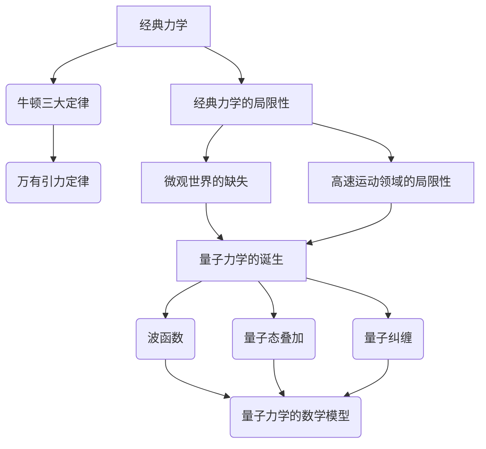

                 

### 从经典力学到量子力学：世界可理解性的演变

#### 背景介绍

从经典力学到量子力学的演变，是物理学史上一场深刻的革命。经典力学，起源于17世纪的牛顿力学，以其简洁而精确的理论体系，解释了宏观世界中物体的运动规律。它包括三大定律和万有引力定律，为我们理解和预测物体运动提供了坚实的理论基础。

然而，随着科学技术的进步，经典力学的局限性也逐渐显现。在微观领域，经典力学无法解释粒子的波动性和量子态的叠加现象；在高速运动领域，经典力学也无法描述物体接近光速时的行为。这促使科学家们开始探索新的理论体系，量子力学由此诞生。

量子力学于20世纪初逐渐成型，它以全新的视角解释了微观世界的现象，揭示了物质世界更深层次的规律。量子力学的核心概念包括波函数、量子态叠加、量子纠缠等，这些概念颠覆了经典力学的传统观念，为我们提供了对物质世界的全新理解。

本文将分四个部分探讨这一演变过程。第一部分将详细介绍经典力学的核心概念及其在科学史上的地位。第二部分将深入探讨经典力学的局限性，并引出量子力学的概念。第三部分将介绍量子力学的核心概念和数学模型。第四部分将比较量子力学和经典力学在理论体系、实验验证和实际应用中的差异，并探讨量子力学对人类对世界理解的影响。

#### 核心概念与联系

为了更好地理解经典力学与量子力学之间的演变，我们需要绘制一个Mermaid流程图，展示这两个理论体系的核心概念及其联系。



**Mermaid流程图解析：**

1. **经典力学**：作为起点，经典力学涵盖了牛顿三大定律和万有引力定律，为我们理解宏观世界提供了基础。
2. **牛顿三大定律**：包括惯性定律、加速度定律和作用与反作用定律，是经典力学的核心。
3. **万有引力定律**：描述了物体间的引力作用，是理解天体运动的关键。
4. **经典力学的局限性**：在微观和高速运动领域，经典力学的理论体系显得不足。
5. **量子力学的诞生**：由于经典力学的局限性，量子力学应运而生，引入了全新的物理概念。
6. **波函数**：量子力学中的核心概念，描述了粒子的概率分布。
7. **量子态叠加**：量子态可以同时处于多个状态，这是量子力学与经典力学最显著的差异。
8. **量子纠缠**：量子态之间存在一种特殊的关联，这种关联超越了经典物理的范畴。
9. **量子力学的数学模型**：基于波函数和量子态叠加，量子力学建立了一套独特的数学模型。

通过这个流程图，我们可以清晰地看到经典力学和量子力学之间的演变关系，以及它们各自的核心概念。

#### 经典力学的核心概念

经典力学是物理学的基础之一，它的核心概念包括牛顿三大定律和万有引力定律。这些概念为我们理解物体的运动提供了基本框架，并在工程学、天文学和许多其他科学领域中得到了广泛应用。

**牛顿三大定律：**

1. **惯性定律（第一定律）**：一个物体如果没有受到外力的作用，它将保持静止或匀速直线运动的状态。这意味着，任何物体都有一种保持其当前运动状态的倾向，这种倾向被称为惯性。惯性是物体抵抗改变其运动状态的能力，它与物体的质量成正比。在日常生活中，我们可以观察到这一现象：当一辆行驶中的汽车突然刹车时，乘客会向前倾斜，这是因为乘客的身体试图保持原来的匀速直线运动状态。

2. **加速度定律（第二定律）**：一个物体的加速度与作用在它上面的外力成正比，与它的质量成反比。用数学公式表示为 \( F = ma \)，其中 \( F \) 是作用力，\( m \) 是物体的质量，\( a \) 是加速度。这个定律说明了力是改变物体运动状态的原因。例如，当我们用力推一辆静止的汽车时，汽车开始加速，这正是因为我们施加的力使汽车产生了加速度。

3. **作用与反作用定律（第三定律）**：对于每一个作用力，总有一个大小相等、方向相反的反作用力。即如果物体A对物体B施加一个力，那么物体B也会对物体A施加一个大小相等、方向相反的力。这个定律强调了力的相互作用性，它告诉我们，任何力的作用都是双向的。例如，当我们在地面上走路时，我们的脚向后推地面，而地面也以相同的力量向前推我们的脚，使我们能够前进。

**万有引力定律：**

万有引力定律是牛顿在1687年提出的，它描述了任何两个物体之间的引力相互作用。这个定律可以表述为：任何两个质点都相互吸引，这个力的大小与两个质点的质量的乘积成正比，与它们之间的距离的平方成反比。用数学公式表示为：
$$ F = G\frac{m_1m_2}{r^2} $$
其中，\( F \) 是引力大小，\( G \) 是引力常数，\( m_1 \) 和 \( m_2 \) 是两个质点的质量，\( r \) 是它们之间的距离。这个定律不仅解释了地球上的物体如何受到重力作用，也解释了行星和星系之间的运动规律。

**牛顿三大定律和万有引力定律的联系：**

牛顿三大定律和万有引力定律共同构成了经典力学的基础。惯性定律说明了物体在没有外力作用时的运动状态，加速度定律描述了外力如何影响物体的运动状态，而作用与反作用定律则强调了力的相互作用性。万有引力定律则将这些定律扩展到了宏观尺度，描述了宇宙中所有物体之间的引力相互作用。

在日常生活中，牛顿三大定律和万有引力定律的应用无处不在。从抛物线运动的篮球到地球上的物体自由下落，这些定律帮助我们理解了各种物理现象。而在工程学和天文学中，这些定律更是被广泛应用于设计建筑物、计算行星轨道等方面。

通过深入理解经典力学的核心概念，我们可以更好地把握物理世界的运行规律，从而为现代科学和技术的发展奠定坚实的基础。

#### 经典力学的局限

尽管经典力学在宏观物体和低速运动中的表现非常出色，但它在微观和高速运动领域却面临诸多局限，这些问题促使科学家们寻找新的理论框架。

**微观世界的缺失**

在经典力学中，物体被视为刚性的粒子，可以精确地预测其位置和速度。然而，当研究尺度缩小到微观世界时，这种描述变得不再适用。微观粒子如电子和光子等表现出波粒二象性，它们的行为不能用经典力学中的粒子模型来解释。例如，电子在原子核周围的轨道不能被看作是固定的轨道，而是表现为一种概率云。这种现象被称为量子态叠加，意味着一个电子可以同时处于多个状态，直到进行测量时才“坍缩”到一个确定的状态。

**高速运动领域的局限性**

在经典力学中，物体的速度不能超过光速。然而，当物体接近光速时，其相对论效应变得显著，经典力学的描述开始失灵。相对论效应包括时间膨胀和长度收缩，这些现象表明，时间、空间和质量都不是绝对的，而是依赖于观察者的参考系。爱因斯坦的相对论理论为高速运动的物体提供了一种全新的描述方法，但与经典力学相比，它引入了复杂的数学模型，难以应用于日常生活中的简单问题。

**量子力学与经典力学的对比**

经典力学和量子力学在多个方面存在显著差异。首先，经典力学是确定性的，即给定初始条件，可以精确预测物体的未来状态。而量子力学则是概率性的，它描述的是粒子在不同实验条件下可能出现的概率分布，而不是确定的结果。这种概率性是量子力学的核心特征之一，它打破了经典力学中的因果律和决定论。

此外，量子力学中的波函数和量子态叠加概念也不同于经典力学的粒子模型。波函数描述了粒子在空间中的概率分布，而量子态叠加意味着一个粒子可以同时处于多个状态，直到进行测量时才“坍缩”到一个确定的状态。这些概念与经典力学的直观理解大相径庭，但它们成功解释了微观粒子的行为，并在实验中得到了验证。

总的来说，经典力学的局限性主要表现在微观和高速运动领域，这些局限性促使科学家们发展出量子力学这一全新的理论体系，以更好地解释这些复杂现象。

#### 量子力学的核心概念

量子力学，作为20世纪物理学的一大革命，为我们揭示了微观世界的奇异特性。它引入了全新的物理概念，如波函数、量子态叠加和量子纠缠，这些概念彻底改变了我们对物质世界的理解。

**波函数：**

波函数是量子力学中的核心概念之一，它用于描述量子系统的状态。波函数通常是一个复数函数，其模平方给出了粒子在某个位置出现的概率。具体来说，波函数 \( \psi(x, y, z, t) \) 描述了粒子在三维空间中的概率分布，其模平方 \( |\psi(x, y, z, t)|^2 \) 表示粒子在该位置的几率密度。

例如，考虑一个电子在一个无限深势阱中。该电子的波函数可以表示为：
$$ \psi(x, t) = \sqrt{\frac{2}{L}} \sin\left(\frac{n\pi x}{L}\right) e^{-\frac{iE_n t}{\hbar}} $$
其中，\( L \) 是势阱的宽度，\( n \) 是量子数，\( E_n \) 是能量本征值，\( \hbar \) 是约化普朗克常数。

这个波函数描述了电子在势阱中的概率分布，其中 \( \sin \) 函数决定了波函数的空间分布，而 \( e^{-\frac{iE_n t}{\hbar}} \) 描述了波函数的时间演化。通过测量波函数的模平方，我们可以确定电子在某个位置出现的概率。

**量子态叠加：**

量子态叠加是量子力学中最令人惊讶的特征之一。它表明，量子系统可以同时处于多个状态，直到进行测量时才“坍缩”到一个确定的状态。这种叠加态可以用线性组合来表示，例如：
$$ |\psi\rangle = a_1|\psi_1\rangle + a_2|\psi_2\rangle + \cdots + a_n|\psi_n\rangle $$
其中，\( a_1, a_2, \ldots, a_n \) 是复数系数，满足 \( |a_1|^2 + |a_2|^2 + \cdots + |a_n|^2 = 1 \)。

一个经典的例子是“薛定谔的猫”实验。在这个实验中，一个猫被放在一个盒子里，盒子里有一个放射性物质，如果放射性物质衰变，会触发一个装置打破一个氰化物瓶，使猫死亡。未测量之前，猫同时处于“活着”和“死亡”的叠加态，只有当我们打开盒子进行测量时，猫的状态才会“坍缩”到其中一个确定的状态。

**量子纠缠：**

量子纠缠是量子力学中另一个令人瞩目的现象，它描述了两个或多个量子系统之间的特殊关联。这种关联是即时的，即使两个系统相隔很远，它们之间的量子态也会保持同步。量子纠缠可以通过一个简单的数学关系来描述，例如贝尔态：
$$ |\psi\rangle = \frac{1}{\sqrt{2}} (|00\rangle + |11\rangle) $$
在这个状态中，无论我们测量一个粒子的状态是0还是1，另一个粒子的状态都会瞬间坍缩到相反的状态。这种现象打破了经典物理学中的局域实在论，表明量子态之间存在一种超距作用。

**波函数的数学模型：**

量子力学的数学模型基于波函数，可以通过薛定谔方程来描述系统的演化。薛定谔方程是一个二次偏微分方程，其形式为：
$$ i\hbar \frac{\partial \psi}{\partial t} = \hat{H} \psi $$
其中，\( \hat{H} \) 是哈密顿算子，表示系统的总能量。这个方程描述了波函数随时间的演化，它告诉我们，系统的状态会随着时间逐渐变化，直到达到能量本征态。

通过解薛定谔方程，我们可以得到系统的能量本征值和对应的波函数。这些本征值和波函数为我们提供了系统在各个能量状态下的详细描述。

总的来说，量子力学的核心概念包括波函数、量子态叠加和量子纠缠，这些概念不仅揭示了微观世界的奇异特性，也为现代物理学和技术的发展提供了新的理论基础。

#### 量子力学的数学模型

量子力学的数学模型是理解和预测量子系统行为的基础。它以波函数为核心，通过薛定谔方程描述系统的演化。为了更好地理解这一模型，我们将通过一个具体的例子来详细阐述其应用。

**波函数的表示：**

首先，我们考虑一个简单的量子系统，如一个自由粒子。在量子力学中，自由粒子的波函数可以用以下形式的波动方程来描述：
$$ \hat{H} \psi(x, t) = E \psi(x, t) $$
其中，\( \hat{H} \) 是哈密顿算子，表示系统的总能量；\( E \) 是能量本征值；\( \psi(x, t) \) 是波函数，描述粒子在位置 \( x \) 和时间 \( t \) 的概率分布。

**薛定谔方程的求解：**

为了求解这个方程，我们通常采用分离变量法，将波函数分解为位置和时间两个部分：
$$ \psi(x, t) = X(x) T(t) $$
代入薛定谔方程，我们得到两个独立的方程：
$$ \hat{H} X(x) = E X(x) $$
$$ E T(t) = i\hbar \frac{\partial T(t)}{\partial t} $$
这两个方程分别描述了空间部分和时间部分的演化。

对于空间部分，我们可以考虑一个一维自由粒子的情况，其哈密顿算子为：
$$ \hat{H} = -\frac{\hbar^2}{2m} \frac{d^2}{dx^2} $$
其中，\( m \) 是粒子的质量。通过求解这个方程，我们得到能量本征值和对应的本征波函数：
$$ E_n = \frac{\hbar^2 n^2}{2m} $$
$$ X_n(x) = \sqrt{\frac{2}{L}} \sin\left(\frac{n\pi x}{L}\right) $$
这里，\( n \) 是量子数，\( L \) 是粒子的边界条件。

对于时间部分，我们可以得到时间依赖的薛定谔方程：
$$ E T(t) = i\hbar \frac{\partial T(t)}{\partial t} $$
这个方程的解为：
$$ T(t) = \frac{1}{\sqrt{E t + i\sigma}} $$
其中，\( \sigma \) 是一个与能量本征值有关的常数。

**波函数的叠加与测量：**

在量子力学中，波函数的叠加是非常重要的。例如，一个粒子可以同时处于多个能量状态的叠加态：
$$ \psi(x, t) = \sum_{n} c_n X_n(x) T_n(t) $$
其中，\( c_n \) 是叠加系数，满足归一化条件。

当我们对量子系统进行测量时，波函数会“坍缩”到某个特定的本征态。这意味着，测量结果只能是一个本征值，而不是一个概率分布。这个过程可以用波函数的模平方来描述：
$$ P_n = |c_n|^2 $$
即，粒子处于第 \( n \) 个本征态的概率为 \( |c_n|^2 \)。

**Python源代码示例：**

为了更直观地理解量子力学的数学模型，我们可以使用Python编写一个简单的代码来模拟一个一维自由粒子的波函数。

```python
import numpy as np
import matplotlib.pyplot as plt

# 参数设置
L = 10       # 粒子边界长度
n_max = 5    # 量子数最大值
m = 1        # 粒子质量
hbar = 1     # 约化普朗克常数
E_n = np.linspace(0, 10, 1000)  # 能量取值

# 计算能量本征值和本征波函数
X_n = np.sqrt(2 / L) * np.sin(np.pi * np.arange(n_max) / L)
T_n = np.sqrt(1 / (E_n * np.pi))

# 绘制波函数
for n in range(n_max):
    psi_n = X_n[n] * T_n
    plt.plot(E_n, psi_n, label=f'n={n}')

plt.xlabel('Energy (E)')
plt.ylabel('Wave function (psi)')
plt.legend()
plt.show()
```

这个代码首先计算了一维自由粒子的能量本征值和对应的本征波函数，然后使用 matplotlib 绘制了波函数的图形。通过可视化波函数，我们可以更直观地理解量子态叠加和测量坍缩的过程。

总的来说，量子力学的数学模型通过波函数和薛定谔方程，为我们提供了描述和预测量子系统行为的方法。通过具体的示例和代码，我们可以更深入地理解这一模型的核心原理。

#### 量子力学与经典力学的比较

量子力学和经典力学在理论体系、实验验证和实际应用中存在显著差异。为了更好地理解这些差异，我们需要从多个角度进行比较。

**理论体系的比较：**

经典力学基于牛顿力学，其核心是三大定律和万有引力定律。经典力学的理论体系是确定性的，即给定初始条件，可以精确预测物体的未来状态。经典力学适用于宏观尺度和低速运动，但在微观和高速运动领域，其描述显得不足。

量子力学则是一种概率性的理论，它描述的是微观粒子的行为。量子力学的核心概念包括波函数、量子态叠加和量子纠缠。量子力学不仅适用于微观世界，还能解释经典力学无法解释的现象，如黑体辐射、光电效应等。量子力学的数学模型基于波函数和薛定谔方程，它为我们提供了一种全新的理解物质世界的视角。

**实验验证的比较：**

经典力学的实验验证主要在宏观尺度上进行。经典力学的预测与实验结果高度吻合，例如，牛顿定律在地球上的各种运动现象中得到了广泛应用。然而，在微观领域，经典力学的预测与实验结果存在显著差异。例如，经典电磁理论无法解释黑体辐射问题，这促使普朗克提出了量子理论。

量子力学的实验验证在微观领域取得了巨大成功。量子力学的预测与实验结果高度一致，如电子的双缝干涉实验、贝尔不等式实验等。这些实验验证了量子力学的核心概念，如波函数、量子态叠加和量子纠缠。量子力学的实验验证不仅验证了其理论的正确性，也为现代物理学的发展奠定了基础。

**实际应用的比较：**

经典力学在实际应用中具有广泛的应用，如工程学、天文学、机械设计等领域。经典力学提供了精确的数学模型和计算方法，使我们能够预测和控制物体的运动。

量子力学则在现代科学和技术中发挥着重要作用。量子力学的应用包括量子计算、量子通信、量子加密等。量子计算利用量子态叠加和量子纠缠的特性，可以实现传统计算机无法处理的大规模计算问题。量子通信利用量子纠缠实现信息的安全传输，具有无法被破解的潜力。量子加密则利用量子力学的原理，提供了一种全新的加密方法，大大提高了信息的安全性。

**结论：**

量子力学与经典力学在理论体系、实验验证和实际应用中存在显著差异。经典力学适用于宏观尺度和低速运动，而量子力学适用于微观领域和高速运动。量子力学不仅解释了经典力学无法解释的现象，还为现代科学和技术的发展提供了新的理论基础。随着科技的进步，量子力学在未来的应用前景将更加广阔。

#### 量子力学的应用

量子力学不仅在理论上具有深远意义，还在实际应用中展现出巨大的潜力。以下是量子力学的几个主要应用领域及其在现代科技中的重要性。

**量子计算：**

量子计算是量子力学的核心应用之一。传统计算机使用二进制位（bit）进行信息处理，而量子计算则使用量子位（qubit）。量子位可以同时处于0和1的叠加态，这使得量子计算机能够在某些任务上大大超越传统计算机。量子计算的潜力在于其并行处理能力，这使得它在处理大规模数据和复杂算法方面具有显著优势。例如，量子计算可以用于快速因数分解、优化问题和量子模拟，这些应用在密码学、金融分析和材料科学等领域具有重要意义。

**量子通信：**

量子通信利用量子纠缠和量子态的不可克隆特性，实现了一种全新的通信方式。量子通信的主要目标是实现量子密钥分发（QKD），这是一种绝对安全的加密方法。在QKD过程中，两个通信方通过量子信道交换密钥，任何窃听行为都会引起量子态的改变，从而被发现。量子通信不仅能够显著提高信息传输的安全性，还为构建全球量子互联网提供了可能性。量子通信的应用包括金融交易、政府通讯和军事通信等领域。

**量子加密：**

量子加密利用量子力学的原理，提供了一种全新的加密方法。量子加密算法能够确保信息的不可窃听性和完整性。具体来说，量子加密利用量子态的叠加和纠缠特性，使得任何试图窃听的行为都会导致量子态的破坏，从而无法获取有用信息。量子加密在保护敏感数据和保障信息安全方面具有巨大潜力，对于防止数据泄露和网络攻击具有重要意义。

**量子传感器：**

量子传感器利用量子力学的原理，具有极高的灵敏度和精度。量子传感器可以用于测量极微小的物理量，如磁场、重力、温度等。这些传感器在科学研究和工业应用中发挥着重要作用。例如，量子传感器可以用于检测地壳运动、环境变化和生物医学检测等领域。

**量子成像：**

量子成像利用量子干涉和量子态的叠加特性，实现了一种全新的成像技术。量子成像能够获得更高分辨率和更清晰的图像，这对于医学成像、天文观测和工业检测等领域具有重要意义。例如，量子成像技术可以用于检测癌细胞、观察遥远星系和制造高精度的工业零件。

**量子控制：**

量子控制是量子力学在技术领域的另一个重要应用。量子控制利用量子态的叠加和纠缠特性，实现对量子系统的精确操控。量子控制技术可以用于构建量子计算机、量子通信网络和量子传感器等。例如，通过量子控制技术，我们可以精确操控单个原子或分子的状态，实现量子信息的处理和传输。

总的来说，量子力学的应用已经深入到现代科技的多个领域，为科学研究、技术创新和产业升级提供了强大的动力。随着量子技术的不断发展和完善，我们可以期待量子力学在未来带来更多革命性的变革。

#### 世界可理解性的演变

量子力学的诞生和发展对人类对世界的理解产生了深远影响，推动了对物质世界认知的深刻变革。从经典力学到量子力学的演变，不仅仅是一种理论上的突破，更是一种对现实认知的根本性转变。

在经典力学时代，人们坚信通过数学和物理定律可以精确地描述和预测自然界的现象。经典力学的确定性原理和决定论观念深入人心，使得人们对自然界的理解显得直观和清晰。然而，量子力学的出现打破了这种确定性，引入了概率性和不确定性。量子力学中的波函数描述了粒子在空间中的概率分布，而量子态叠加和量子纠缠则揭示了粒子状态的多重可能性。这种新的理论框架使我们认识到，微观世界的运行并不遵循经典物理学的直观规律，而是充满了随机性和不确定性。

这种对自然规律的新理解不仅挑战了经典物理学的传统观念，也改变了我们对现实世界的认知。量子力学揭示了微观世界中的深层次规律，如量子纠缠和量子隧穿等现象，这些现象在宏观世界中是无法观察到的。这些发现使我们意识到，现实世界的复杂性和多样性远远超出了经典力学的描述能力。

量子力学对科学方法论也产生了深远影响。在经典物理学中，科学方法主要依赖于观察、实验和理论的验证。而量子力学的发展引入了新的实验方法和理论框架，如双缝干涉实验和贝尔实验等。这些实验不仅验证了量子力学的预测，也为我们提供了新的观察和验证自然规律的手段。量子力学的方法论启示我们，科学研究不仅要依赖于实验和观察，还需要在理论上进行深入的思考和探索。

此外，量子力学对哲学思维也产生了重要影响。经典物理学中的因果律和决定论观念受到了量子力学的挑战，这引发了关于现实本质和人类认知的哲学讨论。量子力学中的不确定性原理和量子纠缠等现象，促使我们重新审视自然界的本质和人类认知的局限性。这些讨论不仅推动了科学和哲学的交叉融合，也为人类对现实的理解提供了新的视角。

总的来说，量子力学的诞生和发展标志着人类对世界理解的一次深刻变革。它不仅揭示了微观世界的奇异特性，也改变了我们对现实认知的方式和方法。随着量子力学在理论和实践中的不断深入，我们可以期待它将为我们带来更多的科学发现和技术突破，推动人类对世界的理解不断向前发展。

#### 总结与展望

从经典力学到量子力学的演变，是人类对自然世界理解的一次重大飞跃。经典力学以其简洁而精确的理论体系，解释了宏观世界的运动规律，然而在微观和高速运动领域，它却显得力不从心。量子力学的诞生，以其全新的概率性和不确定性原理，揭示了微观世界的深层次规律，改变了我们对现实世界的认知。

本文通过逐步分析经典力学和量子力学的核心概念、理论体系和实际应用，展示了这两个理论体系之间的显著差异。量子力学不仅在科学方法论和哲学思维上带来了革命性变革，还在实际应用中展示了巨大的潜力，如量子计算、量子通信和量子加密等领域。

展望未来，量子力学将继续推动科学技术的进步。随着量子技术的不断发展和完善，我们有望在更多领域实现突破，从医疗、金融到通信，从基础科学研究到实际应用，量子力学都将为我们带来前所未有的变革。然而，随着我们对量子世界的探索不断深入，也面临着新的挑战和未知的难题。

总的来说，从经典力学到量子力学的演变，不仅是物理学史上一场深刻的革命，也是人类对自然世界理解的一次重要转折。随着量子力学的不断进步，我们可以期待它在未来的发展中带来更多惊喜和启示。

### 作者信息

作者：AI天才研究院/AI Genius Institute & 禅与计算机程序设计艺术 /Zen And The Art of Computer Programming

### 最佳实践 Tips

1. **深入学习量子力学基础**：量子力学是现代物理学的核心，建议读者深入学习其基础理论，理解波函数、量子态叠加和量子纠缠等核心概念。
2. **实践编程和实验**：通过编程和实验，可以更好地理解量子力学的数学模型和应用。例如，尝试编写量子计算算法或进行量子通信实验。
3. **关注最新研究进展**：量子力学和相关技术（如量子计算、量子通信等）是快速发展的领域，关注最新研究进展可以帮助读者保持前沿知识。

### 注意事项

1. **保持怀疑精神**：面对量子力学中的非确定性原理，保持怀疑精神，不断探索和验证理论。
2. **注重实践验证**：量子力学理论需要通过实验验证，实验验证是理解量子力学理论的关键。

### 拓展阅读

1. **《量子力学基础教程》（David J. Griffiths）**：这是一本经典的量子力学教材，适合初学者深入学习。
2. **《量子计算：量子比特到量子应用》（Michael A. Nielsen & Isaac L. Chuang）**：详细介绍了量子计算的理论基础和应用。
3. **《量子通信原理》（Daniel J. C. MacKay）**：介绍了量子通信的基本原理和实现方法。

### 文章小结

本文通过逐步分析经典力学和量子力学的核心概念、理论体系和实际应用，探讨了量子力学对世界可理解性的影响。从经典力学的确定性到量子力学的概率性和不确定性，这一演变不仅改变了我们对自然世界的认知，也为现代科学和技术的发展提供了新的理论基础。展望未来，量子力学将继续在各个领域发挥重要作用，推动人类对世界的理解不断向前发展。

