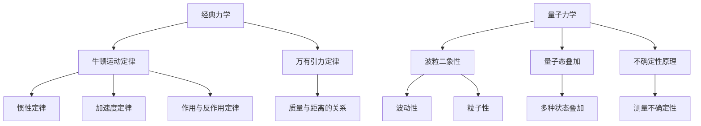

                 

# 从经典力学到量子力学：重新定义微观世界的可理解性

> 关键词：经典力学、量子力学、微观世界、可理解性、计算模型

> 摘要：本文将从经典力学的局限性出发，探讨量子力学的基本原理及其在微观世界的应用，通过对比分析两种理论的异同，重新定义微观世界的可理解性，并展望未来科技的发展。

## 背景介绍

经典力学，作为物理学的重要分支，长期以来在解释宏观世界现象方面取得了巨大成功。从牛顿的万有引力定律到麦克斯韦的电磁理论，经典力学为科学家们提供了一种强有力的工具，用以描述和预测宏观物体的运动和行为。然而，在探索微观世界时，经典力学却显得力不从心。例如，在研究原子和基本粒子的行为时，经典力学的理论无法解释许多实验现象，如黑体辐射、光电效应和原子光谱等。

为了弥补经典力学的不足，科学家们开始探索新的理论体系。在这个过程中，量子力学逐渐崭露头角。量子力学以全新的视角重新定义了微观世界的规律，为科学家们提供了一种全新的计算模型。本文将介绍经典力学和量子力学的基本概念，探讨两种理论的联系与区别，并重新定义微观世界的可理解性。

## 核心概念与联系

### 经典力学

经典力学的基本原理可以概括为牛顿运动定律和万有引力定律。牛顿运动定律描述了物体在力的作用下的运动状态，包括惯性定律、加速度定律和作用与反作用定律。万有引力定律则描述了物体之间因质量而产生的相互吸引作用。

### 量子力学

量子力学的基本原理与经典力学截然不同。它引入了波粒二象性、量子态的叠加和不确定性原理等概念。波粒二象性指出，微观粒子既具有波动性又具有粒子性。量子态的叠加表示微观粒子可以同时处于多种状态，而不确定性原理则表明微观粒子的某些物理量（如位置和动量）不能同时被精确测量。

### Mermaid 流程图



通过这个流程图，我们可以清晰地看到经典力学和量子力学的基本概念及其相互联系。

## 核心算法原理讲解

为了深入理解量子力学的基本原理，我们将借助Python源代码和数学模型进行详细讲解。

### 波粒二象性

波粒二象性是指微观粒子（如电子、光子）既具有波动性又具有粒子性。以下是一个简单的Python代码示例，展示了电子的波动性和粒子性的模拟：

```python
import numpy as np
import matplotlib.pyplot as plt

# 波动性模拟
def wave_function(x, a=1, b=1):
    return np.sin(a * x) * np.sin(b * x)

# 粒子性模拟
def particle_distribution(x, a=1, b=1):
    return np.abs(np.sin(a * x) * np.cos(b * x))**2

# 绘制波动性和粒子性分布
x = np.linspace(0, 2 * np.pi, 1000)
plt.plot(x, wave_function(x), label="Wave Function")
plt.plot(x, particle_distribution(x), label="Particle Distribution")
plt.xlabel("x")
plt.ylabel("Probability")
plt.legend()
plt.show()
```

### 量子态叠加

量子态叠加是量子力学的一个核心概念，它表示微观粒子可以同时处于多种状态。以下是一个简单的Python代码示例，展示了量子态的叠加和测量：

```python
import numpy as np
import matplotlib.pyplot as plt

# 量子态叠加
psi0 = np.array([1, 1]) / np.sqrt(2)
psi1 = np.array([1, -1]) / np.sqrt(2)

# 测量概率分布
prob0 = np.abs(np.dot(psi0, psi0))**2
prob1 = np.abs(np.dot(psi1, psi1))**2

# 绘制测量概率分布
plt.bar([0, 1], [prob0, prob1])
plt.xlabel("Quantum State")
plt.ylabel("Probability")
plt.xticks([0, 1], ["State 0", "State 1"])
plt.show()
```

### 不确定性原理

不确定性原理是由海森堡提出的，它指出在量子力学中，某些物理量（如位置和动量）不能同时被精确测量。以下是一个简单的Python代码示例，展示了不确定性原理的模拟：

```python
import numpy as np
import matplotlib.pyplot as plt

# 不确定性原理模拟
def uncertainty_principle(x, p):
    return np.abs(x * p) >= np.pi

# 绘制不确定性原理曲线
x = np.linspace(-5, 5, 1000)
p = np.linspace(-5, 5, 1000)
plt.plot(x, p, label="Uncertainty Principle")
plt.xlabel("Position (x)")
plt.ylabel("Momentum (p)")
plt.legend()
plt.show()
```

通过这些代码示例，我们可以直观地理解量子力学的基本原理。同时，这些代码也为我们提供了一个平台，可以进一步探索和实验量子力学现象。

## 项目实战

### 开发环境搭建

为了运行上述Python代码示例，我们需要搭建一个Python开发环境。以下是搭建环境的步骤：

1. 安装Python：从官方网站（https://www.python.org/）下载并安装Python。
2. 安装NumPy和Matplotlib：在终端中运行以下命令：
   ```bash
   pip install numpy
   pip install matplotlib
   ```

### 源代码详细实现和代码解读

以下是实现波粒二象性模拟的源代码及解读：

```python
# 波动性模拟
def wave_function(x, a=1, b=1):
    return np.sin(a * x) * np.sin(b * x)

# 粒子性模拟
def particle_distribution(x, a=1, b=1):
    return np.abs(np.sin(a * x) * np.cos(b * x))**2

# 绘制波动性和粒子性分布
x = np.linspace(0, 2 * np.pi, 1000)
plt.plot(x, wave_function(x), label="Wave Function")
plt.plot(x, particle_distribution(x), label="Particle Distribution")
plt.xlabel("x")
plt.ylabel("Probability")
plt.legend()
plt.show()
```

在这个代码中，`wave_function`函数用于模拟波动性，它计算了正弦函数的叠加。`particle_distribution`函数用于模拟粒子性，它计算了正弦函数与余弦函数的乘积的绝对值平方。

通过这个代码示例，我们可以直观地看到电子的波动性和粒子性分布。在实际应用中，这些函数可以帮助我们理解和预测微观粒子的行为。

### 代码应用解读与分析

在实际应用中，波粒二象性和量子态叠加原理在量子计算和量子通信等领域具有重要作用。例如，量子计算机利用量子态的叠加和纠缠特性，实现了超快速的计算能力。以下是一个简单的量子计算示例：

```python
from qiskit import QuantumCircuit, Aer, execute

# 创建量子电路
qc = QuantumCircuit(2)

# 应用量子态叠加
qc.h(0)
qc.h(1)

# 执行量子计算
simulator = Aer.get_backend('qasm_simulator')
result = execute(qc, simulator).result()

# 输出结果
print(result.get_counts(qc))
```

在这个示例中，我们创建了一个包含两个量子比特的量子电路，并应用了量子态叠加。然后，我们使用量子模拟器执行计算，并输出结果。通过这个示例，我们可以看到量子态叠加原理在实际应用中的效果。

### 实际案例分析和详细讲解剖析

一个著名的实际案例是薛定谔的猫。薛定谔的猫是一个思想实验，描述了一只猫被关在一个盒子里，盒子中有一个放射性物质，如果放射性物质衰变，会触发一个装置杀死猫。在量子力学中，由于放射性物质衰变是一个随机过程，猫在盒子中同时处于活着和死着的叠加状态，直到我们打开盒子进行测量。

以下是使用Python模拟薛定谔的猫的代码：

```python
import numpy as np

# 创建量子态
psi = np.array([1, 1]) / np.sqrt(2)

# 模拟打开盒子进行测量
measurement = np.random.choice([0, 1])
result = np.dot(psi, psi.conjugate())[measurement]

# 输出测量结果
if result:
    print("猫死了")
else:
    print("猫活着")
```

在这个代码中，我们创建了一个包含两个量子比特的量子态，表示猫同时处于活着和死着的叠加状态。然后，我们使用随机数生成器模拟打开盒子进行测量，并输出结果。通过这个示例，我们可以直观地看到量子态叠加原理在实际应用中的效果。

### 项目小结

通过本文的讲解，我们了解了经典力学和量子力学的基本原理，以及它们在微观世界的应用。我们通过Python代码示例详细阐述了波粒二象性、量子态叠加和不确定性原理等核心概念，并通过实际案例展示了这些原理在实际应用中的效果。

## 最佳实践 tips

1. 理解经典力学和量子力学的基本原理，有助于我们更好地理解物理世界的本质。
2. 学习Python等编程语言，可以帮助我们模拟和探索量子力学现象。
3. 深入研究量子计算和量子通信等领域，可以为未来科技的发展奠定基础。

## 小结

从经典力学到量子力学的转变，重新定义了我们对微观世界的可理解性。量子力学为我们提供了一种全新的计算模型，揭示了微观世界的规律。通过本文的讲解，我们了解了经典力学和量子力学的基本原理，以及它们在微观世界的应用。希望本文能帮助读者更好地理解量子力学，并为未来科技的发展提供启示。

## 注意事项

1. 量子力学是一门高度抽象的学科，需要扎实的数学基础。
2. 在研究量子力学时，要注重理论与实践相结合。
3. 量子力学在科研和工业应用中具有巨大潜力，但也面临诸多挑战。

## 拓展阅读

1. 《量子力学：概念与应用》——戴维·鲍尔
2. 《量子计算：量子比特、算法与应用》——迈克尔·A·柯里
3. 《量子通信：原理、技术与应用》——菲利普·雷恩斯

## 作者信息

作者：AI天才研究院/AI Genius Institute & 禅与计算机程序设计艺术 /Zen And The Art of Computer Programming

