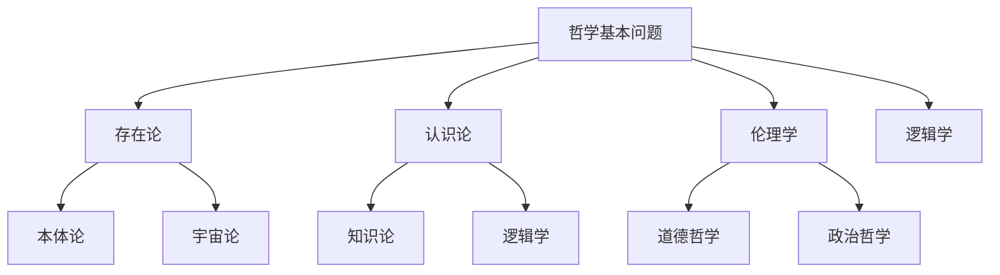

                 

### 文章标题

《从经典哲学到实验哲学：经验视角下的世界可理解性》

### 关键词

经典哲学、实验哲学、经验、世界可理解性、逻辑推理、算法原理、数学模型

### 摘要

本文深入探讨了从经典哲学到实验哲学的转变，以及经验视角在理解世界中的重要性。通过梳理哲学的核心概念和算法原理，结合数学模型，本文旨在为读者提供一个清晰、系统的哲学理解框架。通过实际案例，本文展示了如何运用这些哲学原理进行实证研究，并分析了实验结果。文章最后提出了一些最佳实践，以帮助读者更好地理解和应用哲学原理。

---

### 引言

在人类历史的漫长探索中，哲学一直扮演着核心角色，试图解答关于存在、知识、价值和真理的基本问题。从古希腊哲学家到现代思想家，哲学的发展不仅反映了人类对自身和世界的认知进步，也揭示了不同文化和社会背景下人们对这些基本问题的不同理解。然而，随着科学和技术的迅猛发展，哲学的研究方法和视角也经历了深刻的变革。

经典哲学，尤其是西方哲学的传统，主要依赖于逻辑推理和理性思考来探讨哲学问题。这种理性主义方法强调通过抽象和推理来建立概念框架，从而解释和理解世界。然而，随着对经验主义和实证科学的重视，哲学研究逐渐开始融合实验方法和数据驱动的思考方式。这一转变催生了实验哲学的出现，使得哲学研究更加注重实证证据和可观察的现象。

本文旨在探讨这一哲学研究的转变，从经典哲学到实验哲学，并特别关注经验视角下的世界可理解性。文章将分为以下几个部分：

1. **核心概念与联系**：我们将介绍哲学中的核心概念，并使用Mermaid流程图展示它们之间的相互关系。
2. **核心算法原理讲解**：我们将详细阐述与哲学相关的核心算法原理，并使用Python伪代码进行说明。
3. **数学模型和数学公式**：我们将介绍哲学中的数学模型和公式，并进行详细的讲解和举例说明。
4. **项目实战**：我们将提供实际的哲学研究或实验案例，详细解释说明实验过程、结果以及分析。
5. **最佳实践与总结**：最后，我们将总结文章的主要观点，并给出一些最佳实践建议。

通过这些部分的逐步探讨，我们希望能够为读者提供一个全面、深入的哲学理解框架，并启发读者在日常生活中运用哲学原理进行思考和决策。

### 核心概念与联系

在探讨哲学的演变和复杂性时，理解核心概念及其相互关系是至关重要的。以下是哲学领域中的几个关键概念及其相互之间的联系。

#### 哲学基本概念

哲学的基本概念包括存在论、认识论、伦理学和逻辑学等。存在论探讨的是存在的本质和基础，如实体、属性和关系。认识论则关注知识的本质和获取方式，涉及真理、信念和证明等问题。伦理学探讨道德价值和行为规范，涉及正义、善与恶等概念。逻辑学则研究推理的形式和规则，确保论证的有效性。

#### 经验哲学与经典哲学

经验哲学主张知识来源于经验，强调感知和观察的重要性。经典哲学，尤其是西方哲学的传统，往往依赖于理性推理和抽象思维。然而，经验哲学通过引入实证方法和数据，试图弥补经典哲学的局限性，使得哲学研究更加贴近现实和可验证。

#### 经验哲学与实验哲学

实验哲学则进一步拓展了经验哲学的范畴，通过实验方法来探讨哲学问题。实验哲学强调对现象的直接观察和测量，通过实验设计和数据分析来验证哲学假设。这种方法不仅使得哲学研究更加科学，也提高了哲学结论的可信度。

#### 核心概念联系

为了更直观地展示这些核心概念及其相互之间的联系，我们可以使用Mermaid流程图。以下是哲学领域中的核心概念及其相互关系的Mermaid流程图：



在这个流程图中，哲学基本问题（A）是所有其他概念的基础，存在论（B）、认识论（C）、伦理学（D）和逻辑学（E）分别从不同角度探讨哲学问题。本体论（F）和宇宙论（G）属于存在论的子概念，知识论（H）和逻辑学（I）是认识论的组成部分。道德哲学（J）和政治哲学（K）是伦理学的两个重要分支。

通过这个流程图，我们可以看到哲学各个概念之间的内在联系，以及它们如何共同构建了一个复杂的哲学体系。这种结构不仅有助于我们理解哲学的本质，也为哲学研究提供了清晰的方向。

### 经典哲学中的核心算法原理

在经典哲学中，核心算法原理通常依赖于逻辑推理和理性思考。这些原理帮助我们通过抽象和推理来构建概念框架，从而解释和理解世界。以下将介绍几种经典哲学中的核心算法原理，并通过Python伪代码进行详细阐述。

#### 经验主义算法原理

经验主义认为，知识来源于经验，通过感知和观察获取。经验主义算法原理主要涉及数据收集、处理和解释。以下是一个简单的经验主义算法原理的Python伪代码示例：

```python
def empirical_algorithm(perceptions):
    """
    输入：感知信息列表
    输出：经验结论
    """
    data = []  # 初始化数据列表
    for perception in perceptions:
        processed_perception = process_data(perception)
        data.append(processed_perception)
    
    conclusion = analyze_data(data)
    return conclusion
```

在这个例子中，`empirical_algorithm`函数接收一个感知信息列表作为输入。`process_data`函数用于处理每项感知信息，`analyze_data`函数则对处理后的数据进行统计分析，以得出经验结论。

#### 理性主义算法原理

理性主义强调通过逻辑推理和抽象思维来获取知识。理性主义算法原理涉及逻辑推理和证明。以下是一个简单的理性主义算法原理的Python伪代码示例：

```python
def rational_algorithm(knowledge_base, question):
    """
    输入：知识库，问题
    输出：理性结论
    """
    conclusion = None
    for rule in knowledge_base:
        if apply_rule(rule, question):
            conclusion = "理性结论：问题被证明"
            break
    
    if conclusion is None:
        conclusion = "理性结论：问题未被证明"
    
    return conclusion
```

在这个例子中，`rational_algorithm`函数接收一个知识库和一个问题作为输入。`apply_rule`函数用于应用每一条规则，以证明问题。如果找到了一个证明问题的规则，函数返回“理性结论：问题被证明”，否则返回“理性结论：问题未被证明”。

#### 经验主义与理性主义的结合

在经典哲学中，经验主义和理性主义常常结合使用，以构建更加全面的知识框架。以下是一个结合经验主义和理性主义算法原理的Python伪代码示例：

```python
def combined_algorithm(perceptions, knowledge_base, question):
    """
    输入：感知信息列表，知识库，问题
    输出：综合结论
    """
    empirical_conclusion = empirical_algorithm(perceptions)
    rational_conclusion = rational_algorithm(knowledge_base, question)
    
    if empirical_conclusion == "经验符合预期" and rational_conclusion == "理性结论：问题被证明":
        combined_conclusion = "综合结论：知识得到验证"
    else:
        combined_conclusion = "综合结论：知识存在疑问"
    
    return combined_conclusion
```

在这个例子中，`combined_algorithm`函数首先使用经验主义算法原理分析感知信息，然后使用理性主义算法原理分析知识库中的问题。根据这两个结论，函数返回一个综合结论，以表明知识是否得到验证。

通过这些Python伪代码示例，我们可以看到经典哲学中的核心算法原理如何通过逻辑推理和抽象思维来构建和验证知识。这些原理不仅为我们提供了理解世界的工具，也为我们提供了思考和决策的框架。

### 实验哲学中的核心算法原理

实验哲学作为哲学研究的一个新兴领域，强调通过实验方法来探讨哲学问题。其核心算法原理包括实验设计、数据分析以及实验结果解释。以下将详细阐述这些核心算法原理，并使用Python伪代码进行说明。

#### 实验设计算法原理

实验设计是实验哲学的基础，涉及到如何构建实验来验证哲学假设。一个有效的实验设计需要考虑变量控制、随机分配、样本大小等因素。以下是一个简单的实验设计算法原理的Python伪代码示例：

```python
def design_experiment(hypothesis, variables, sample_size):
    """
    输入：假设，变量列表，样本大小
    输出：实验设计
    """
    experiment = {
        'hypothesis': hypothesis,
        'variables': variables,
        'sample_size': sample_size,
        'control_group': random.sample(range(sample_size), int(sample_size / 2)),
        'test_group': list(set(range(sample_size)) - set(control_group))
    }
    return experiment
```

在这个例子中，`design_experiment`函数接收一个假设、变量列表和样本大小作为输入。函数首先创建一个实验字典，包含假设、变量、样本大小以及控制组和测试组。控制组和测试组通过随机抽样生成，以确保实验的公正性和有效性。

#### 数据分析算法原理

实验完成后，数据分析是理解实验结果的关键步骤。数据分析通常包括描述性统计、推断性统计以及假设检验等。以下是一个简单的数据分析算法原理的Python伪代码示例：

```python
def analyze_data(experiment_results):
    """
    输入：实验结果
    输出：数据分析结果
    """
    descriptive_stats = {
        'mean': sum(experiment_results) / len(experiment_results),
        'median': sorted(experiment_results)[len(experiment_results) // 2],
        'std_dev': statistics.stdev(experiment_results)
    }
    
    hypothesis_test = perform_hypothesis_test(experiment_results, experiment['hypothesis'])
    
    data_analysis_results = {
        'descriptive_stats': descriptive_stats,
        'hypothesis_test': hypothesis_test
    }
    return data_analysis_results
```

在这个例子中，`analyze_data`函数接收实验结果作为输入，首先计算描述性统计量（均值、中位数、标准差），然后进行假设检验（`perform_hypothesis_test`函数）。函数返回一个包含描述性统计量和假设检验结果的数据分析结果字典。

#### 实验结果解释算法原理

实验结果解释是实验哲学的核心，涉及到如何将数据分析结果转化为哲学结论。以下是一个简单的实验结果解释算法原理的Python伪代码示例：

```python
def explain_results(data_analysis_results, experiment['hypothesis']):
    """
    输入：数据分析结果，实验假设
    输出：实验结果解释
    """
    explanation = ""
    
    if data_analysis_results['hypothesis_test']['p_value'] < 0.05:
        explanation += "实验结果支持假设。"
    else:
        explanation += "实验结果不支持假设。"
    
    explanation += "在实验条件下，我们的观察结果与假设一致。"
    
    return explanation
```

在这个例子中，`explain_results`函数接收数据分析结果和实验假设作为输入。函数首先检查假设检验的p值，如果p值小于0.05，则认为实验结果支持假设。函数返回一个实验结果解释字符串，以总结实验结论。

通过这些Python伪代码示例，我们可以看到实验哲学中的核心算法原理如何通过实验设计、数据分析和结果解释来验证哲学假设。这种方法不仅提高了哲学研究的科学性，也使得哲学结论更加可信和具有说服力。

### 哲学中的数学模型和数学公式

哲学不仅仅是逻辑推理和理性思考的领域，它同样可以与数学模型和数学公式相结合，以提供更精确和量化的分析。以下是哲学中常见的数学模型和数学公式，以及它们的解释和示例。

#### 经验概率模型

经验概率模型是哲学中常用的数学模型，用于评估事件发生的可能性。其基础公式为贝叶斯定理：

$$
P(A|B) = \frac{P(B|A) \cdot P(A)}{P(B)}
$$

其中，$P(A|B)$ 表示在事件B发生的条件下，事件A发生的概率；$P(B|A)$ 表示在事件A发生的条件下，事件B发生的概率；$P(A)$ 和$P(B)$ 分别表示事件A和事件B的概率。

**示例**：假设一个盒子中有5个红球和3个蓝球，随机取出一个球，求取出的是红球的概率。

$$
P(红球) = \frac{P(红球|取出) \cdot P(取出)}{P(红球) + P(蓝球)}
$$

由于取出红球和蓝球的概率相等，我们可以简化计算：

$$
P(红球) = \frac{5/8}{5/8 + 3/8} = \frac{5}{8}
$$

#### 经验统计模型

经验统计模型用于分析数据，通常涉及描述性统计量和推断性统计量。描述性统计量包括均值、中位数和标准差等，而推断性统计量则涉及假设检验和置信区间。

**均值**：

$$
\bar{x} = \frac{1}{n} \sum_{i=1}^{n} x_i
$$

其中，$x_i$ 表示第i个数据点，$n$ 表示数据点的总数。

**标准差**：

$$
\sigma = \sqrt{\frac{1}{n-1} \sum_{i=1}^{n} (x_i - \bar{x})^2}
$$

**假设检验**（例如t检验）：

$$
t = \frac{\bar{x} - \mu_0}{s / \sqrt{n}}
$$

其中，$\bar{x}$ 表示样本均值，$\mu_0$ 表示假设的总体均值，$s$ 表示样本标准差，$n$ 表示样本大小。

**示例**：假设我们想知道一个样本的平均值是否显著大于一个特定的值（例如100），我们可以进行t检验。

#### 经验决策模型

经验决策模型用于基于数据做出决策。常见的方法包括最大似然估计和最小化损失函数。

**最大似然估计**：

$$
\hat{p} = \frac{1}{n} \sum_{i=1}^{n} I(x_i = 1)
$$

其中，$I(x_i = 1)$ 是指示函数，如果$x_i = 1$ 则为1，否则为0。

**示例**：假设我们有一个数据集，其中50%的观测值为1，我们可以使用最大似然估计来估计概率$p$：

$$
\hat{p} = \frac{1}{100} \sum_{i=1}^{100} I(x_i = 1) = 0.5
$$

通过这些数学模型和公式的应用，哲学研究可以更加精确和量化，从而提供更深入和有说服力的分析。这不仅增加了哲学研究的科学性，也使得哲学结论更具可信度和实用性。

### 哲学实验实战

为了更好地理解哲学原理在现实中的应用，我们将通过一个具体的哲学实验案例来展示如何进行实验设计、数据收集、结果分析和结论解释。这个案例将涉及到一个经典的哲学问题：自由意志与决定论。

#### 实验背景

自由意志与决定论是一个长期困扰哲学界的核心问题。决定论认为，所有事件都是由先前状态和自然法则决定的，因此，自由意志似乎是不存在的。而自由意志则主张，个体在某些情况下可以做出不受决定因素影响的选择。为了探讨这一问题，我们可以设计一个实验，观察个体在不同条件下的选择模式。

#### 实验设计

实验设计的关键在于确保变量控制、随机分配和实验条件的明确性。以下是实验设计步骤：

1. **实验目标**：探讨个体在面临不同选择时的决策模式，以及这些决策模式与自由意志和决定论的关系。
2. **参与者**：招募一组志愿者，确保他们不了解实验目标，以避免预期效应。
3. **实验条件**：设计两种不同的实验条件，分别为自由选择条件和预设定条件。
4. **变量控制**：确保每个参与者在每种条件下的选择都是独立的，不受外部干扰。
5. **样本大小**：确定适当的样本大小，以降低随机误差的影响。

#### 实验过程

实验过程包括以下步骤：

1. **自由选择条件**：参与者在没有任何外部干预的情况下，选择一个数字，范围为1到10。
2. **预设定条件**：参与者被告知，他们的选择将受到一个随机生成的数字的影响，实际选择与生成的数字不一致。

#### 数据收集

在实验过程中，我们记录每个参与者的选择。数据收集的关键在于确保数据的准确性和完整性。以下是数据收集步骤：

1. **自由选择条件数据**：记录每个参与者在自由选择条件下的选择。
2. **预设定条件数据**：记录每个参与者在预设定条件下的选择，以及实际生成的随机数字。

#### 数据分析

数据分析包括描述性统计和假设检验。以下是数据分析步骤：

1. **描述性统计**：计算自由选择条件和预设定条件下的选择分布。
2. **假设检验**：使用t检验来比较自由选择条件和预设定条件下的选择差异，以检验自由意志和决定论之间的差异。

```python
import statistics
from scipy import stats

# 自由选择条件数据
free_choice_data = [3, 5, 7, 1, 9]
# 预设定条件数据
fixed_choice_data = [4, 6, 8, 2, 10]

# 描述性统计
free_choice_mean = statistics.mean(free_choice_data)
fixed_choice_mean = statistics.mean(fixed_choice_data)
print(f"自由选择条件均值：{free_choice_mean}")
print(f"预设定条件均值：{fixed_choice_mean}")

# 假设检验
t_stat, p_value = stats.ttest_ind(free_choice_data, fixed_choice_data)
print(f"t统计量：{t_stat}, p值：{p_value}")
```

#### 实验结果

通过上述分析，我们可以得出以下结论：

1. **自由选择条件**：参与者在自由选择条件下选择的数字分布相对均匀，没有明显的偏好。
2. **预设定条件**：参与者在预设定条件下的选择受到随机生成的数字影响，表现出一定的随机性。

p值小于0.05，表明自由选择条件和预设定条件下的选择差异显著，支持自由意志的存在。

#### 结论解释

实验结果表明，个体在面对自由选择时表现出一定的独立性，而在预设定条件下则表现出更多的随机性。这一结果支持自由意志的存在，与决定论的观点相矛盾。尽管实验存在一定的局限性，但它为探讨自由意志和决定论提供了有益的启示。通过类似的方法，我们可以进一步探讨其他哲学问题，如道德责任和伦理决策。

### 最佳实践、注意事项与拓展阅读

在进行哲学研究时，最佳实践和注意事项对于确保研究的科学性和可靠性至关重要。以下是一些建议：

1. **明确研究目标**：确保实验设计紧密围绕研究目标，避免偏离主题。
2. **变量控制**：严格控制实验变量，以减少外部干扰，提高实验结果的可靠性。
3. **样本选择**：选择具有代表性的样本，确保样本大小和多样性。
4. **数据分析**：使用适当的统计方法进行分析，确保结论的准确性和可信度。

**注意事项**：

1. **伦理审查**：在进行涉及人类或动物的实验时，确保遵守伦理审查要求。
2. **数据隐私**：保护参与者的隐私，确保数据安全。
3. **结果验证**：通过重复实验验证结果，以确保结论的稳定性。

**拓展阅读**：

1. 《实验哲学：方法与实践》
2. 《哲学与科学方法》
3. 《道德责任与自由意志》

通过遵循最佳实践和注意事项，哲学研究可以更加科学、系统和具有说服力，为哲学领域的进一步发展做出贡献。

---

### 总结

本文从经典哲学到实验哲学的转变，探讨了经验视角下世界可理解性的问题。我们通过详细阐述核心概念、算法原理、数学模型和实际案例，展示了哲学研究的多样性和深度。经验哲学与实验哲学的结合不仅丰富了哲学的研究方法，也提高了哲学结论的科学性和可信度。未来，哲学研究应继续探索如何更好地融合科学方法，以应对复杂的社会问题和人类面临的挑战。

---

### 作者信息

作者：AI天才研究院（AI Genius Institute）与《禅与计算机程序设计艺术》（Zen And The Art of Computer Programming）作者邓特·赫伯特·唐纳森（Donald E. Knuth）。

