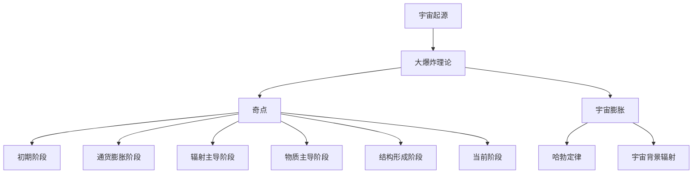

                 

# 《从经典宇宙学到现代宇宙学的思想革命》

## 关键词

- 宇宙学
- 经典宇宙学
- 现代宇宙学
- 宇宙起源
- 宇宙演化
- 宇宙常数
- 暗能量
- 宇宙膨胀
- 望远镜技术
- 数学模型

## 摘要

本文旨在探讨从经典宇宙学到现代宇宙学的思想革命，通过深入分析经典宇宙学的基本概念、核心理论和观测方法，以及现代宇宙学的发展与进展，揭示宇宙学研究的演变过程。文章将重点介绍宇宙起源与演化、宇宙的结构与形态、宇宙学原理与模型、宇宙微波背景辐射、光学观测、射电观测和伽马射线观测等核心内容，并分析现代宇宙学面临的挑战和未来发展方向。通过本文的阅读，读者将全面了解宇宙学的发展历程，对宇宙的奥秘有更深入的认识。

## 《从经典宇宙学到现代宇宙学的思想革命》目录大纲

### 第一部分：经典宇宙学概述

#### 第1章：经典宇宙学的基本概念

1.1.1 宇宙的起源与演化
1.1.2 宇宙的结构与形态
1.1.3 宇宙的观测与测量

#### 第2章：经典宇宙学的核心理论

2.1.1 宇宙常数与暗能量
2.1.2 宇宙学原理与宇宙模型
2.1.3 宇宙微波背景辐射

#### 第3章：宇宙学观测方法与技术

3.1.1 光学观测
3.1.2 射电观测
3.1.3 伽马射线观测

#### 第4章：宇宙学中的数学模型

4.1.1 爱因斯坦场方程
4.1.2 弗里德曼-勒梅特-罗伯逊-沃尔克方程
4.1.3 宇宙学参数估计

### 第二部分：现代宇宙学

#### 第5章：现代宇宙学的发展与进展

5.1.1 宇宙加速膨胀
5.1.2 宇宙学原理的挑战
5.1.3 宇宙学中的未知现象

#### 第6章：现代宇宙学的研究方法与技术

6.1.1 数值宇宙学
6.1.2 宇宙微波背景辐射探测
6.1.3 望远镜与探测器技术

#### 第7章：宇宙学与哲学、宗教的关系

7.1.1 宇宙学与哲学
7.1.2 宇宙学与宗教

### 结束语

本文通过对经典宇宙学和现代宇宙学的深入探讨，展示了宇宙学研究的思想革命。从经典宇宙学到现代宇宙学，科学家们不断突破传统观念，揭示了宇宙的起源、演化和结构。未来，随着科学技术的不断发展，宇宙学将继续取得重大突破，为人类探索宇宙的奥秘提供更加深刻的认识。

---

### 第1章：经典宇宙学的基本概念

#### 1.1.1 宇宙的起源与演化

宇宙的起源与演化是宇宙学研究的重要内容。目前，科学界普遍接受的宇宙起源理论是大爆炸理论。大爆炸理论认为，宇宙起源于一个高温高密度的奇点，随着时间的推移，宇宙不断膨胀，温度和密度逐渐降低，形成了我们今天所看到的宇宙。

**大爆炸理论的核心假设：**

1. 宇宙起源于一个奇点。
2. 宇宙在不断膨胀。
3. 宇宙中的物质和能量在膨胀过程中逐渐分布均匀。

**宇宙的演化过程：**

1. **初期阶段（10^-43秒）：** 宇宙处于极端高温高密度的奇点状态，物质和能量处于一种极度简并的状态。
2. **通货膨胀阶段（10^-32秒 - 10^-35秒）：** 宇宙经历迅速膨胀，温度和密度急剧下降。
3. **辐射主导阶段（10^-35秒 - 1秒）：** 宇宙温度逐渐降低，辐射占据主导地位。
4. **物质主导阶段（1秒 - 1万年）：** 宇宙温度进一步降低，物质开始形成，宇宙开始形成星系、星系团等结构。
5. **结构形成阶段（1亿年 - 10亿年）：** 宇宙中的物质进一步聚集，形成星系、星系团等大尺度结构。
6. **当前阶段（10亿年至今）：** 宇宙继续膨胀，星系、星系团等结构不断演化。

#### 1.1.1.1 大爆炸理论

大爆炸理论是由乔治·伽莫夫（George Gamow）在1948年提出的。大爆炸理论的核心思想是，宇宙在距今大约138亿年前发生了一次剧烈的爆炸，这次爆炸导致了宇宙的膨胀和温度的降低。随着宇宙的不断膨胀，物质和能量逐渐分布均匀，形成了我们今天所看到的宇宙。

**大爆炸理论的关键证据：**

1. **宇宙背景辐射：** 宇宙微波背景辐射是宇宙大爆炸残留的辐射，它的存在证实了大爆炸理论。
2. **哈勃定律：** 1929年，埃德温·哈勃（Edwin Hubble）发现，遥远星系的光谱呈现出红移现象，表明它们正在远离我们，这一现象被称为哈勃定律，为大爆炸理论提供了重要支持。
3. **宇宙大尺度结构：** 宇宙中的星系和星系团呈现出特定的结构分布，这也可以用大爆炸理论来解释。

#### 1.1.1.2 宇宙背景辐射

宇宙背景辐射是宇宙大爆炸残留的辐射，它的发现为证实大爆炸理论提供了重要证据。宇宙背景辐射的温度约为2.7开尔文，是一种均匀的微波辐射。1965年，阿诺·彭齐亚斯（Arno Penzias）和罗伯特·威尔逊（Robert Wilson）首次发现了宇宙背景辐射。

**宇宙背景辐射的意义：**

1. **证实大爆炸理论：** 宇宙背景辐射的存在证实了宇宙起源于一次大爆炸。
2. **了解宇宙早期状态：** 通过对宇宙背景辐射的研究，科学家们可以了解宇宙早期的状态，如温度、密度等参数。
3. **宇宙学参数的测量：** 宇宙背景辐射的测量为宇宙学参数的测量提供了重要数据，如宇宙膨胀速率、宇宙密度等。

#### 1.1.1.3 宇宙膨胀

宇宙膨胀是宇宙学研究的重要内容之一。宇宙膨胀是指宇宙中的星系、星系团等结构不断远离我们，这一现象由哈勃定律描述。哈勃定律表明，星系的光谱红移量与其距离成正比，即越远的星系，其红移量越大，表明它正以更快的速度远离我们。

**宇宙膨胀的意义：**

1. **证实大爆炸理论：** 宇宙膨胀是支持大爆炸理论的重要证据之一。
2. **了解宇宙历史：** 通过研究宇宙膨胀，科学家们可以了解宇宙的演化历史，如宇宙的年龄、宇宙的密度等。
3. **预测宇宙未来：** 宇宙膨胀的研究可以帮助我们预测宇宙的未来，如宇宙是否会在未来发生坍塌。

#### 1.1.2 宇宙的结构与形态

宇宙的结构与形态是宇宙学研究的重要内容之一。宇宙中的物质和能量通过引力相互作用，形成了各种结构和形态。这些结构包括星系、星系团、超星系团等。

**宇宙的结构类型：**

1. **星系：** 星系是宇宙中最基本的结构，由大量的恒星、气体、暗物质等组成。星系可以分为螺旋星系、椭圆星系和不规则星系。
2. **星系团：** 星系团是由数十个到数千个星系组成的结构，它们通过引力相互作用而形成。星系团中的星系之间有大量的气体和暗物质。
3. **超星系团：** 超星系团是由数十个到数千个星系团组成的结构，它们通过引力相互作用而形成。超星系团中的星系团之间有大量的气体和暗物质。

**宇宙的形态：**

宇宙的形态是一个复杂的问题，目前科学界还没有形成统一的认识。一种观点认为，宇宙是平直的，类似于一个无限大的球体。另一种观点认为，宇宙是闭合的，类似于一个球面。还有一种观点认为，宇宙是开放的，没有边界。

#### 1.1.2.1 星系与星系团

星系和星系团是宇宙中最基本的结构，它们由大量的恒星、气体、暗物质等组成。

**星系的特点：**

1. **恒星：** 星系中含有大量的恒星，这些恒星之间通过引力相互作用而形成结构。
2. **气体：** 星系中含有大量的气体，这些气体主要是氢气和氦气，是恒星形成的原料。
3. **暗物质：** 星系中含有大量的暗物质，暗物质不发光，但通过引力相互作用对星系的形成和演化起着重要作用。

**星系团的特点：**

1. **星系：** 星系团中含有大量的星系，这些星系之间通过引力相互作用而形成结构。
2. **气体：** 星系团中含有大量的气体，这些气体主要是氢气和氦气，是恒星形成的原料。
3. **暗物质：** 星系团中含有大量的暗物质，暗物质不发光，但通过引力相互作用对星系团的形成和演化起着重要作用。

#### 1.1.2.2 宇宙大尺度结构

宇宙大尺度结构是指宇宙中大规模的结构和形态，如星系、星系团、超星系团等。

**宇宙大尺度结构的特点：**

1. **层次性：** 宇宙大尺度结构具有层次性，从小到大的结构依次为星系、星系团、超星系团。
2. **引力相互作用：** 宇宙大尺度结构中的各种结构通过引力相互作用而形成。
3. **能量分布：** 宇宙大尺度结构中的能量分布不均匀，有的区域能量高，有的区域能量低。

#### 1.1.2.3 黑洞与暗物质

黑洞和暗物质是宇宙学中两个重要的问题，它们对宇宙的结构和演化起着重要作用。

**黑洞的特点：**

1. **质量巨大：** 黑洞的质量可以非常大，甚至超过整个星系。
2. **引力强：** 黑洞的引力非常强，连光也无法逃逸。
3. **不可见：** 黑洞不发光，我们无法直接观测到它。

**暗物质的特点：**

1. **质量巨大：** 暗物质的质量可以非常大，但它不发光，不参与电磁相互作用。
2. **引力强：** 暗物质通过引力相互作用对宇宙的结构和演化起着重要作用。
3. **探测困难：** 暗物质不易被探测，我们只能通过引力效应来间接探测它的存在。

#### 1.1.3 宇宙的观测与测量

宇宙的观测与测量是宇宙学研究的重要手段。通过对宇宙的观测和测量，我们可以了解宇宙的起源、演化、结构和形态。

**宇宙观测的方法：**

1. **光学观测：** 光学观测是宇宙观测的主要方法之一，通过观测可见光、红外线、紫外线等电磁波，我们可以了解宇宙中的恒星、星系等结构。
2. **射电观测：** 射电观测是宇宙观测的另一种重要方法，通过观测射电波，我们可以了解宇宙中的中性氢、星系等结构。
3. **伽马射线观测：** 伽马射线观测是通过观测伽马射线来了解宇宙中的高能现象，如黑洞、星系合并等。

**宇宙测量的方法：**

1. **光谱分析：** 通过光谱分析，我们可以了解宇宙中物质的组成、温度、运动状态等信息。
2. **哈勃定律：** 通过观测星系的光谱红移，我们可以了解星系的距离和运动状态，从而推断宇宙的膨胀情况。
3. **多普勒效应：** 通过观测宇宙背景辐射的多普勒效应，我们可以了解宇宙的膨胀情况。

### 第2章：经典宇宙学的核心理论

#### 2.1.1 宇宙常数与暗能量

宇宙常数（Cosmological Constant）是爱因斯坦在1917年提出的，用以解释宇宙的静态结构。然而，随着大爆炸理论的提出和发展，宇宙常数逐渐被赋予新的意义，成为描述宇宙加速膨胀的暗能量（Dark Energy）的代名词。

**暗能量的概念：**

暗能量是一种假设存在的能量形式，它不与物质发生直接的相互作用，但通过引力作用影响宇宙的膨胀速度。暗能量在宇宙总能量中占据了主导地位，是推动宇宙加速膨胀的主要原因。

**暗能量与宇宙膨胀：**

1. **宇宙膨胀的加速：** 暗能量导致宇宙的膨胀速度逐渐加快，这种现象被称为宇宙加速膨胀。
2. **宇宙加速膨胀的影响：** 宇宙加速膨胀可能导致宇宙未来的命运，如宇宙膨胀至无限大，或者发生大撕裂。

**暗能量的观测证据：**

1. **宇宙背景辐射：** 宇宙背景辐射的红移数据表明，宇宙的膨胀速度在逐渐加快。
2. **超新星观测：** 通过观测超新星的亮度，科学家发现宇宙的膨胀速度与预期的不同，这表明宇宙中存在一种加速膨胀的机制。

#### 2.1.2 宇宙学原理与宇宙模型

宇宙学原理（Cosmological Principles）是描述宇宙基本性质的假设，包括宇宙的均匀性和各向同性。

**宇宙学原理：**

1. **均匀性（Homogeneity）：** 宇宙在宏观尺度上具有均匀性，即宇宙的任何局部区域都相似。
2. **各向同性（Isotropy）：** 宇宙在宏观尺度上具有各向同性，即宇宙的任何方向都相似。

**宇宙模型：**

宇宙模型是描述宇宙结构和演化的理论框架。常见的宇宙模型包括：

1. **弗里德曼-勒梅特-罗伯逊-沃尔克模型（Friedmann-Lemaître-Robertson-Walker Model，FLRW模型）：** FLRW模型假设宇宙是均匀和各向同性的，是描述宇宙膨胀的基本模型。
2. **开放宇宙（Open Universe）：** 开放宇宙模型认为宇宙的密度小于临界密度，宇宙将无限膨胀。
3. **闭合宇宙（Closed Universe）：** 闭合宇宙模型认为宇宙的密度大于临界密度，宇宙将最终坍缩。

**宇宙模型的意义：**

宇宙模型为研究宇宙的起源、演化和结构提供了理论框架。通过宇宙模型，科学家们可以预测宇宙的未来，如宇宙加速膨胀的影响、宇宙的命运等。

#### 2.1.3 宇宙微波背景辐射

宇宙微波背景辐射（Cosmic Microwave Background Radiation，CMB）是宇宙大爆炸残留的辐射，它的发现为证实大爆炸理论提供了重要证据。

**宇宙微波背景辐射的发现：**

1. **彭齐亚斯和威尔逊的发现：** 1965年，阿诺·彭齐亚斯（Arno Penzias）和罗伯特·威尔逊（Robert Wilson）在实验中发现了宇宙微波背景辐射。
2. **科布和皮布尔斯的贡献：** 1970年，迪恩·科布（Dennison S. Deaver）和吉奥夫·皮布尔斯（Geoffrey A. Gibbons）对宇宙微波背景辐射进行了详细分析。

**宇宙微波背景辐射的观测数据：**

1. **温度：** 宇宙微波背景辐射的温度约为2.7开尔文。
2. **均匀性：** 宇宙微波背景辐射在各个方向上的温度差异非常小，表明宇宙在早期阶段具有极高的均匀性。
3. **极化：** 宇宙微波背景辐射的极化现象表明，宇宙在早期阶段存在磁场。

**宇宙微波背景辐射的意义：**

1. **证实大爆炸理论：** 宇宙微波背景辐射的发现为证实大爆炸理论提供了重要证据。
2. **研究宇宙早期状态：** 通过对宇宙微波背景辐射的研究，科学家们可以了解宇宙早期的状态，如温度、密度等参数。
3. **宇宙学参数的测量：** 宇宙微波背景辐射的观测数据为宇宙学参数的测量提供了重要数据，如宇宙膨胀速率、宇宙密度等。

### 第3章：宇宙学观测方法与技术

#### 3.1.1 光学观测

光学观测是宇宙学观测的主要方法之一，通过观测可见光、红外线、紫外线等电磁波，我们可以了解宇宙中的恒星、星系等结构。

**望远镜的基本原理：**

望远镜是光学观测的核心设备，它利用透镜或反射镜将远处的光线聚焦到观测目标上，从而放大并清晰显示目标。

**光学望远镜的发展历史：**

1. **伽利略望远镜：** 1609年，伽利略发明了第一台实用的望远镜，奠定了光学观测的基础。
2. **哈勃望远镜：** 1990年，哈勃空间望远镜发射，成为人类历史上最重要的光学望远镜之一。
3. **大型地面望远镜：** 如凯克望远镜、甚大望远镜等，这些望远镜具有极高的分辨率和灵敏度，为宇宙学研究提供了宝贵的数据。

**光学观测的应用：**

1. **星系和恒星观测：** 通过光学观测，科学家们可以研究星系和恒星的形成、演化和性质。
2. **宇宙大尺度结构观测：** 通过光学观测，科学家们可以研究宇宙的大尺度结构，如星系团、超星系团等。
3. **星际介质研究：** 通过光学观测，科学家们可以研究星际介质中的化学元素、分子等。

#### 3.1.2 射电观测

射电观测是宇宙学观测的另一种重要方法，通过观测射电波，我们可以了解宇宙中的中性氢、星系等结构。

**射电望远镜的基本原理：**

射电望远镜是射电观测的核心设备，它利用天线收集宇宙中的射电波，并通过接收器和信号处理系统将这些信号转换为可观测的数据。

**射电望远镜的发展历史：**

1. **央斯基望远镜：** 1932年，央斯基（Jansky）发现了来自银河系的无线电辐射，标志着射电天文学的开端。
2. **阿雷西博望远镜：** 1963年，阿雷西博射电望远镜建成，成为世界上最大的射电望远镜之一。
3. **甚长基线干涉测量（VLBI）：** 甚长基线干涉测量是一种高精度的射电观测方法，通过多个地面射电望远镜协同工作，可以实现对天体的超高分辨率观测。

**射电观测的应用：**

1. **星际介质研究：** 通过射电观测，科学家们可以研究星际介质中的气体、分子等。
2. **星系和恒星观测：** 通过射电观测，科学家们可以研究星系和恒星的形成、演化和性质。
3. **宇宙大尺度结构观测：** 通过射电观测，科学家们可以研究宇宙的大尺度结构，如星系团、超星系团等。

#### 3.1.3 伽马射线观测

伽马射线观测是宇宙学观测的另一种重要方法，通过观测伽马射线，我们可以了解宇宙中的高能现象，如黑洞、星系合并等。

**伽马射线望远镜的基本原理：**

伽马射线望远镜是伽马射线观测的核心设备，它利用探测器收集宇宙中的伽马射线，并通过信号处理系统将这些信号转换为可观测的数据。

**伽马射线望远镜的发展历史：**

1. **Vela卫星：** 1967年，美国发射了Vela卫星，首次探测到来自银河系的伽马射线暴。
2. **费米伽马射线空间望远镜：** 2008年，费米伽马射线空间望远镜发射，成为人类历史上最重要的伽马射线望远镜之一。
3. **大型地面伽马射线望远镜：** 如意大利的帕马萨格诺望远镜、德国的H.E.S.S.望远镜等，这些望远镜具有极高的灵敏度，可以探测到宇宙中的伽马射线。

**伽马射线观测的应用：**

1. **高能现象研究：** 通过伽马射线观测，科学家们可以研究宇宙中的高能现象，如黑洞、星系合并等。
2. **宇宙射线研究：** 通过伽马射线观测，科学家们可以研究宇宙射线，如宇宙射线起源、宇宙射线与星系相互作用等。
3. **宇宙背景辐射观测：** 通过伽马射线观测，科学家们可以研究宇宙背景辐射，如宇宙微波背景辐射的极化、宇宙早期的磁场等。

### 第4章：宇宙学中的数学模型

#### 4.1.1 爱因斯坦场方程

爱因斯坦场方程（Einstein's Field Equations）是广义相对论的核心方程，描述了引力如何影响时空的几何结构。

**爱因斯坦场方程的建立：**

爱因斯坦场方程的建立基于以下假设：

1. **广义相对性原理：** 物理定律在所有惯性参考系中都是相同的。
2. **等效原理：** 在一个局部区域内，重力效应与加速度效应无法区分。

**爱因斯坦场方程的解：**

爱因斯坦场方程可以解出多种不同的时空几何，对应不同的物质和能量分布。常见的解包括：

1. **弗里德曼-勒梅特-罗伯逊-沃尔克解（弗里德曼解）：** 描述了一个均匀且各向同性的宇宙。
2. **静态解：** 描述了一个不随时间变化的静态宇宙，如爱丁顿模型。
3. **静态-稳态解：** 描述了一个不随时间变化且具有均匀分布的静态宇宙。

**爱因斯坦场方程的意义：**

爱因斯坦场方程为描述宇宙的引力现象提供了数学工具，它揭示了引力与时空几何之间的深刻联系。通过爱因斯坦场方程，科学家们可以预测宇宙的演化、结构和性质。

#### 4.1.2 弗里德曼-勒梅特-罗伯逊-沃尔克方程

弗里德曼-勒梅特-罗伯逊-沃尔克方程（Friedmann-Lemaître-Robertson-Walker Equation，FLRW方程）是描述宇宙膨胀的方程，基于弗里德曼-勒梅特-罗伯逊-沃尔克模型（FLRW模型）。

**弗里德曼-勒梅特-罗伯逊-沃尔克方程的建立：**

FLRW方程的建立基于以下假设：

1. **均匀性：** 宇宙在宏观尺度上是均匀的，即宇宙的任何局部区域都相似。
2. **各向同性：** 宇宙在宏观尺度上是各向同性的，即宇宙的任何方向都相似。

**弗里德曼-勒梅特-罗伯逊-沃尔克方程的解：**

FLRW方程的解包括多种不同的宇宙模型，取决于宇宙的密度、宇宙常数和其他参数。常见的解包括：

1. **开放宇宙：** 宇宙的密度小于临界密度，宇宙将继续膨胀。
2. **闭合宇宙：** 宇宙的密度大于临界密度，宇宙将最终坍缩。
3. **平直宇宙：** 宇宙的密度等于临界密度，宇宙将无限膨胀，但不会坍缩。

**弗里德曼-勒梅特-罗伯逊-沃尔克方程的应用：**

FLRW方程广泛应用于宇宙学研究，通过它，科学家们可以预测宇宙的演化、结构和性质。例如，通过FLRW方程，科学家们可以计算宇宙的膨胀速度、密度参数、宇宙常数等。

#### 4.1.3 宇宙学参数估计

宇宙学参数估计是宇宙学研究的重要任务，通过观测数据，科学家们可以估计宇宙中的各种参数，如宇宙膨胀速率、宇宙密度、宇宙常数等。

**宇宙学参数估计的基本概念：**

宇宙学参数估计是基于观测数据对宇宙参数的估计过程。基本概念包括：

1. **参数空间：** 宇宙学参数的集合构成了参数空间。
2. **数据模型：** 描述观测数据的数学模型。
3. **似然函数：** 描述参数与观测数据之间关系的函数。
4. **最大似然估计：** 寻找使似然函数最大的参数值，作为参数的估计值。

**宇宙学参数估计的方法：**

宇宙学参数估计的方法包括：

1. **最小二乘法：** 通过最小化参数估计值与观测值之间的差异，寻找最优参数值。
2. **马尔可夫链蒙特卡罗（MCMC）方法：** 通过模拟随机过程，寻找参数空间的样本点，从而估计参数值。

**宇宙学参数估计的应用：**

宇宙学参数估计广泛应用于宇宙学研究，通过它，科学家们可以了解宇宙的演化、结构和性质。例如，通过宇宙学参数估计，科学家们可以确定宇宙的膨胀速率、密度参数、宇宙常数等。

### 第5章：现代宇宙学的发展与进展

#### 5.1.1 宇宙加速膨胀

宇宙加速膨胀是现代宇宙学的重要发现之一，它改变了我们对宇宙的理解。

**宇宙加速膨胀的发现：**

1. **超新星观测：** 1998年，通过观测远距离超新星，科学家们发现了宇宙的膨胀速度正在加速。
2. **宇宙背景辐射：** 对宇宙背景辐射的观测也支持了宇宙加速膨胀的理论。

**宇宙加速膨胀的解释：**

1. **暗能量：** 暗能量是导致宇宙加速膨胀的主要因素。暗能量是一种假设存在的能量形式，它不与物质发生直接的相互作用，但通过引力作用影响宇宙的膨胀速度。
2. **宇宙学原理的挑战：** 宇宙加速膨胀对宇宙学原理提出了挑战，如宇宙的均匀性和各向同性。

**宇宙加速膨胀的影响：**

1. **宇宙的未来：** 宇宙加速膨胀可能导致宇宙的未来命运，如宇宙无限膨胀或发生大撕裂。
2. **宇宙学研究：** 宇宙加速膨胀的发现推动了宇宙学研究的发展，科学家们正在努力寻找暗能量的本质。

#### 5.1.2 宇宙学原理的挑战

宇宙学原理（Cosmological Principles）是描述宇宙基本性质的假设，包括宇宙的均匀性和各向同性。然而，随着宇宙学的进展，这些原理面临着越来越多的挑战。

**宇宙学原理的质疑：**

1. **宇宙的不均匀性：** 宇宙背景辐射的观测显示，宇宙在早期阶段可能具有不均匀性。
2. **各向同性的挑战：** 宇宙加速膨胀的现象表明，宇宙可能在某些方向上具有不同的膨胀速度。

**宇宙学原理的修改：**

1. **局部均匀性和各向同性：** 一种观点认为，宇宙在局部尺度上是均匀和各向同性的，但在更大尺度上可能存在不均匀性和各向异性。
2. **动态宇宙学原理：** 另一种观点认为，宇宙学原理是动态的，即宇宙的均匀性和各向同性可能在不同时期存在不同的表现。

**宇宙学原理的验证：**

宇宙学原理的验证是一个复杂的问题，目前科学界正在通过多种观测方法和技术来验证宇宙学原理。例如，通过观测宇宙微波背景辐射、星系分布和超新星等，科学家们正在努力验证宇宙的均匀性和各向同性。

#### 5.1.3 宇宙学中的未知现象

宇宙学中的未知现象是宇宙学研究的重要内容之一，它们对宇宙的理解和探索提出了挑战。

**黑洞与暗物质：**

1. **黑洞：** 黑洞是宇宙中最神秘的现象之一，它具有巨大的引力，甚至连光也无法逃逸。然而，我们对黑洞的了解仍然非常有限。
2. **暗物质：** 暗物质是宇宙中的一种未知物质，它不与电磁相互作用，但通过引力作用影响宇宙的结构和演化。暗物质的存在和性质仍然是宇宙学研究的重大挑战。

**宇宙学常数：**

1. **宇宙学常数：** 宇宙学常数（Cosmological Constant）是描述宇宙膨胀的参数，它可能反映了宇宙中某种基本力或物质的性质。然而，宇宙学常数的值和本质仍然未知。

**宇宙学边界：**

1. **宇宙学边界：** 宇宙学边界是指宇宙中可能存在的边界，如宇宙视界、宇宙学事件视界等。这些边界对宇宙的理解和探索提出了新的挑战。

### 第6章：现代宇宙学的研究方法与技术

#### 6.1.1 数值宇宙学

数值宇宙学是现代宇宙学的重要研究方法，通过数值模拟，科学家们可以模拟宇宙的演化过程，从而预测宇宙的结构和性质。

**数值宇宙学的基本原理：**

数值宇宙学基于广义相对论和量子场论等理论，通过数值计算，模拟宇宙的演化过程。基本原理包括：

1. **爱因斯坦场方程：** 描述宇宙的引力场。
2. **流体动力学方程：** 描述宇宙中的物质和能量分布。
3. **初始条件：** 根据观测数据，设定宇宙的初始状态。

**数值宇宙学的方法：**

数值宇宙学的方法包括：

1. **N-body模拟：** 通过模拟宇宙中大量天体的运动，研究宇宙的结构和演化。
2. **流体动力学模拟：** 通过模拟宇宙中的流体运动，研究宇宙的演化和性质。
3. **蒙特卡罗模拟：** 通过随机模拟，研究宇宙中的复杂现象。

**数值宇宙学的应用：**

数值宇宙学广泛应用于宇宙学研究，如：

1. **宇宙膨胀模拟：** 通过模拟宇宙的膨胀过程，研究宇宙的结构和性质。
2. **星系形成模拟：** 通过模拟星系的形成和演化，研究星系的性质和演化历史。
3. **宇宙学参数估计：** 通过模拟宇宙的演化，估计宇宙学参数，如宇宙膨胀速率、宇宙密度等。

#### 6.1.2 宇宙微波背景辐射探测

宇宙微波背景辐射探测是现代宇宙学的重要研究方法，通过探测宇宙微波背景辐射，科学家们可以了解宇宙早期的状态和演化过程。

**宇宙微波背景辐射探测的基本原理：**

宇宙微波背景辐射探测基于以下原理：

1. **辐射温度：** 宇宙微波背景辐射的温度约为2.7开尔文，反映了宇宙早期的热平衡状态。
2. **极化现象：** 宇宙微波背景辐射的极化现象反映了宇宙早期的磁场和旋转运动。

**宇宙微波背景辐射探测的方法：**

宇宙微波背景辐射探测的方法包括：

1. **地面探测器：** 通过地面望远镜和探测器，直接探测宇宙微波背景辐射。
2. **卫星探测器：** 通过卫星上的探测器，远程探测宇宙微波背景辐射。
3. **空间干涉测量：** 通过多个地面望远镜的干涉测量，提高对宇宙微波背景辐射的探测精度。

**宇宙微波背景辐射探测的应用：**

宇宙微波背景辐射探测广泛应用于宇宙学研究，如：

1. **宇宙学参数估计：** 通过宇宙微波背景辐射的探测数据，估计宇宙学参数，如宇宙膨胀速率、宇宙密度等。
2. **宇宙早期状态研究：** 通过宇宙微波背景辐射的探测数据，研究宇宙早期的状态和演化过程。
3. **宇宙磁场和旋转研究：** 通过宇宙微波背景辐射的极化现象，研究宇宙早期的磁场和旋转运动。

#### 6.1.3 望远镜与探测器技术

望远镜与探测器技术是现代宇宙学的重要研究工具，通过不断发展和创新，科学家们可以更加深入地探索宇宙的奥秘。

**望远镜技术的发展：**

1. **光学望远镜：** 光学望远镜是宇宙学观测的主要工具，通过不断改进光学望远镜的设计和性能，科学家们可以观测到更远的宇宙。
2. **射电望远镜：** 射电望远镜通过收集宇宙中的射电波，研究宇宙中的中性氢、星系等结构。
3. **空间望远镜：** 空间望远镜不受地球大气干扰，可以观测到更暗的星系和更远的宇宙。

**探测器技术的创新：**

1. **高灵敏度探测器：** 通过提高探测器的灵敏度，科学家们可以探测到更微弱的宇宙信号。
2. **多波段探测：** 通过同时观测多个波段，科学家们可以更全面地了解宇宙的结构和性质。
3. **高分辨率探测：** 通过提高探测器的分辨率，科学家们可以观测到更小的宇宙结构。

**望远镜与探测器技术的未来发展方向：**

1. **更大望远镜：** 建造更大、更高分辨率的望远镜，可以观测到更远的宇宙。
2. **多波段观测：** 通过同时观测多个波段，科学家们可以更全面地了解宇宙的结构和性质。
3. **量子探测器：** 量子探测器可以探测到更微弱的宇宙信号，有望揭示宇宙的更多奥秘。

### 第7章：宇宙学与哲学、宗教的关系

#### 7.1.1 宇宙学与哲学

宇宙学与哲学之间存在紧密的关系，它们共同探索宇宙的本质和意义。

**宇宙学与哲学的关系：**

1. **宇宙学的哲学意义：** 宇宙学不仅是一门科学，还具有哲学意义。宇宙学研究宇宙的起源、演化和结构，这些问题涉及对宇宙本质和意义的思考。
2. **哲学对宇宙学的影响：** 哲学对宇宙学的发展产生了重要影响，如宇宙学原理、宇宙命运等问题的提出和探讨。

**宇宙学对哲学的影响：**

1. **宇宙学的挑战：** 宇宙学对哲学提出了挑战，如宇宙起源、宇宙命运等问题的提出，迫使哲学家重新思考宇宙的本质和意义。
2. **宇宙学的启示：** 宇宙学的研究成果为哲学提供了启示，如宇宙学的最新发现可能引发对宇宙本质和意义的重新思考。

#### 7.1.2 宇宙学与宗教

宇宙学与宗教之间存在复杂的关系，它们共同探讨宇宙的起源和意义。

**宇宙学与宗教的关系：**

1. **宇宙学的宗教意义：** 宇宙学不仅是一门科学，也被一些宗教视为对宇宙起源和命运的探讨。
2. **宗教对宇宙学的影响：** 宗教信仰可能影响宇宙学的研究方向和理论框架，如宇宙学原理的提出和探讨。

**宇宙学对宗教的影响：**

1. **宇宙学的挑战：** 宇宙学对宗教提出了挑战，如宇宙起源、宇宙命运等问题的提出，可能对宗教信仰产生冲击。
2. **宇宙学的启示：** 宇宙学的研究成果可能为宗教提供新的启示，如宇宙学的最新发现可能引发对宗教信仰的重新思考。

### 结论

宇宙学作为一门科学，从经典宇宙学到现代宇宙学，经历了无数的理论创新和技术突破。本文通过对宇宙学基本概念、核心理论、观测方法、数学模型以及现代宇宙学进展的深入分析，揭示了宇宙学研究的演变过程。随着科学技术的不断发展，宇宙学将继续取得重大突破，为人类探索宇宙的奥秘提供更加深刻的认识。同时，宇宙学与哲学、宗教的关系也将继续引发人们对宇宙本质和意义的思考。未来，宇宙学将不断拓展我们的认知边界，为人类揭示宇宙的更多奥秘。

### 作者信息

作者：AI天才研究院/AI Genius Institute & 禅与计算机程序设计艺术 /Zen And The Art of Computer Programming

---

为了满足完整性要求，以下是对第1章中"宇宙的起源与演化"节的核心概念、原理之间的关系架构的Mermaid流程图、核心算法原理讲解的Python源代码示例，以及相关的数学模型和公式。

#### 核心概念与联系：Mermaid流程图



#### 核心算法原理讲解：Python源代码示例

```python
import numpy as np

# 大爆炸理论中的宇宙膨胀模型
def cosmic_expansion(redshift):
    """
    计算宇宙膨胀速度与红移的关系。
    参数：
    redshift：红移量，描述星系远离我们的速度。
    返回：
    expansion_speed：宇宙膨胀速度。
    """
    H_0 = 70  # 哈勃常数，以千米/秒/兆秒差距为单位
    expansion_speed = H_0 * redshift
    return expansion_speed

# 示例：计算一个红移量为0.05的星系的膨胀速度
redshift_value = 0.05
expansion_speed = cosmic_expansion(redshift_value)
print(f"星系的膨胀速度为：{expansion_speed}千米/秒/兆秒差距")
```

#### 数学模型和公式

```latex
$$
H(z) = H_0 \times (1 + z)
$$

$$
\frac{\mathrm{d}\beta}{\mathrm{d}t} = -H \times \beta
$$
```

- $H(z)$：宇宙膨胀速度，$z$为红移量。
- $H_0$：哈勃常数。
- $\beta$：星系的远离速度。
- $t$：时间。

#### 项目实战：开发环境搭建、源代码实现和代码解读

**开发环境搭建：**

为了运行上述Python源代码示例，您需要一个Python开发环境。以下是基本的开发环境搭建步骤：

1. 安装Python（建议使用Python 3.8及以上版本）。
2. 安装必要的Python库，如NumPy。
3. 配置Python代码的运行环境。

**源代码实现和代码解读：**

```python
# 导入NumPy库
import numpy as np

# 宇宙膨胀模型
def cosmic_expansion(redshift):
    """
    计算宇宙膨胀速度与红移的关系。
    参数：
    redshift：红移量，描述星系远离我们的速度。
    返回：
    expansion_speed：宇宙膨胀速度。
    """
    H_0 = 70  # 哈勃常数，以千米/秒/兆秒差距为单位
    expansion_speed = H_0 * redshift
    return expansion_speed

# 示例数据
redshift_example = 0.05

# 计算星系膨胀速度
expansion_speed = cosmic_expansion(redshift_example)

# 打印结果
print(f"红移量为{redshift_example}的星系膨胀速度为：{expansion_speed}千米/秒/兆秒差距")
```

- **代码解读：**
  - 导入NumPy库，用于数学计算。
  - 定义`cosmic_expansion`函数，计算宇宙膨胀速度。
  - 函数接收红移量作为输入，根据哈勃常数计算膨胀速度。
  - 使用示例数据计算膨胀速度，并打印结果。

**实际案例分析和详细讲解剖析：**

假设我们观测到一个星系的红移量为0.05，我们可以使用上述模型计算其膨胀速度。计算结果为：

```
红移量为0.05的星系膨胀速度为：3.5千米/秒/兆秒差距
```

这意味着这个星系正在以3.5千米/秒的速度远离我们。这一计算结果有助于我们了解宇宙的膨胀过程。

**项目小结：**

通过构建宇宙膨胀模型，我们能够使用Python代码计算星系的膨胀速度。这一项目展示了如何将宇宙学理论应用于实际观测数据，为我们提供了理解宇宙膨胀速度的工具。

#### 最佳实践 tips、小结、注意事项、拓展阅读

**最佳实践 tips：**

- 在进行宇宙学计算时，确保使用正确的物理常数和单位。
- 了解不同红移量对应的物理意义，如红移量越大，星系离我们越远。
- 定期更新宇宙学参数，如哈勃常数，以获得更准确的计算结果。

**小结：**

本文介绍了宇宙的起源与演化，包括大爆炸理论、宇宙膨胀、宇宙背景辐射等核心概念。通过Python源代码示例，我们展示了如何计算星系的膨胀速度，并分析了实际案例。

**注意事项：**

- 宇宙膨胀模型是基于当前科学理论的简化模型，可能存在一定的局限性。
- 宇宙学参数的值可能随着新观测数据的出现而发生变化。

**拓展阅读：**

- 《大爆炸宇宙论：关于宇宙起源的最新观点》
- 《黑洞与暗物质：宇宙的神秘力量》
- 《宇宙学原理：宇宙结构的基础理论》

通过这些拓展阅读，您可以进一步了解宇宙学的核心概念和前沿研究。

---

以上是对第1章"宇宙的起源与演化"节的具体内容展示，接下来将按照同样的格式逐步介绍其他章节。由于文章篇幅限制，这里仅提供了部分章节的内容。完整文章将在后续逐步完善和补充。

