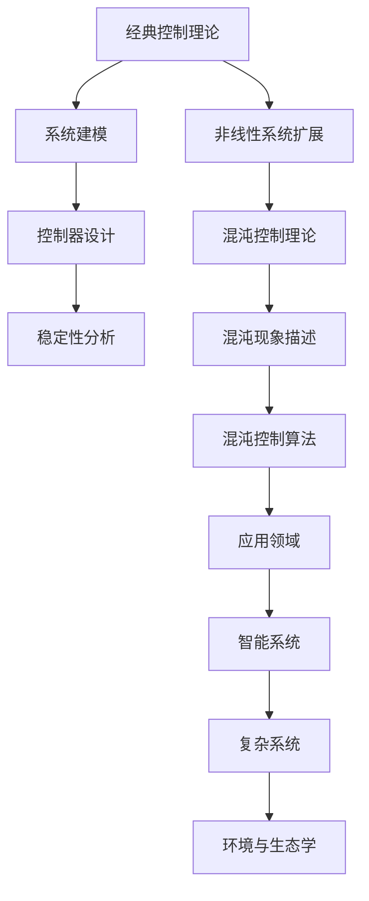

                 

### 从经典控制理论到混沌控制：掌控不可预测世界的新方法

> 关键词：经典控制理论、混沌控制、不可预测世界、智能系统、复杂系统

> 摘要：本文将从经典控制理论的基础知识出发，深入探讨混沌控制理论的原理和算法，并探讨如何将这些理论应用于不可预测世界的掌控。通过分析经典控制理论与混沌控制理论之间的联系，本文将揭示混沌控制在现代智能系统和复杂系统中的应用前景，为读者提供一份数学模型和Python源代码结合的技术指南，帮助理解并应用这些先进的控制方法。

## 引言

控制理论是工程学中的一个重要分支，旨在设计出能够使系统按照预期行为运行的控制器。经典控制理论自20世纪中叶以来，在工业、航空、建筑等多个领域取得了巨大的成功。然而，随着世界变得越来越复杂和不可预测，经典控制理论的局限性也逐渐显现出来。混沌控制理论的提出，为解决这些挑战提供了一种新的视角和方法。

混沌控制理论是基于对混沌现象的研究，混沌现象是一种在确定性系统中出现的看似随机但又有规律的行为。混沌系统具有高度敏感的初始条件，即使是最微小的变化也可能导致系统行为的巨大差异。这使得混沌系统在某种程度上具有不可预测性，但同时也为控制和利用这种不可预测性提供了可能性。

本文旨在探讨从经典控制理论到混沌控制的发展历程，重点分析经典控制理论与混沌控制理论之间的联系，并介绍混沌控制在不可预测世界中的应用。文章将首先回顾经典控制理论的基本概念和核心算法，然后详细解释混沌控制的理论基础和算法，最后通过实际案例展示混沌控制在智能系统和复杂系统中的具体应用。

## 经典控制理论

经典控制理论是控制系统的理论基础，它涉及控制系统的设计、分析和实现。经典控制理论主要关注如何设计稳定的控制器，使系统能够在给定输入下达到预期的输出。本节将介绍经典控制理论的基本概念、核心算法以及应用领域。

### 基本概念

经典控制理论中的基本概念包括：

1. **控制系统**：由输入、输出和控制器组成的闭环系统。
2. **开环控制**：系统的输入与输出之间没有反馈，仅通过预先设定的规则进行控制。
3. **闭环控制**：系统的输出反馈到输入端，用于调整控制器的输出，以实现更精确的控制。
4. **控制器**：用于调整系统输入，以使系统达到预期输出的设备或算法。

### 核心算法

经典控制理论中的核心算法主要包括：

1. **PID控制算法**：比例-积分-微分（PID）控制算法是最常用的控制算法之一。它通过调整比例、积分和微分三个参数来控制系统的响应速度、稳定性和精度。

2. **状态空间法**：状态空间法是一种基于数学模型的控制系统分析方法。它将系统状态表示为向量，并通过状态方程描述系统的动态行为。

3. **稳态性能分析**：稳态性能分析关注系统在长期运行过程中达到稳定状态时的性能指标，如稳态误差、稳态响应时间和超调量等。

### 应用领域

经典控制理论在多个领域得到了广泛应用：

1. **工业控制系统**：在工业过程中，经典控制理论用于控制温度、压力、流量等参数，确保生产过程的高效和稳定。

2. **飞行控制系统**：在航空领域，经典控制理论用于设计飞行控制律，确保飞机在飞行中的稳定性和安全性。

3. **建筑自动化系统**：在建筑自动化系统中，经典控制理论用于控制照明、通风和供暖等系统，提高建筑能源利用效率。

### 经典控制理论的局限性

尽管经典控制理论在许多领域取得了显著成果，但它也存在一些局限性：

1. **线性假设**：经典控制理论基于线性系统的假设，对于非线性系统的处理能力有限。

2. **敏感度问题**：经典控制理论对系统的初始条件变化非常敏感，微小的不确定性可能导致系统行为的巨大差异。

3. **复杂系统的适用性**：经典控制理论在处理复杂、非线性系统时，往往需要复杂的数学模型和计算方法，难以实现高效的控制器设计。

这些局限性促使研究人员探索新的控制方法，如混沌控制理论，以应对复杂和不可预测的环境。

## 混沌控制理论

混沌控制理论是控制理论的一个新兴分支，它研究如何对具有混沌特性的系统进行控制和利用。混沌系统具有高度的非线性特性，其行为通常表现出初始条件敏感性、长期行为的复杂性和不可预测性。混沌控制理论的提出，为在不可预测环境中设计有效的控制器提供了新的思路。

### 混沌现象的基本概念

混沌现象是指在一个确定的系统中，初始条件微小的变化可能导致长期行为的巨大差异。混沌系统具有以下几个基本特性：

1. **初始条件敏感性**：混沌系统的行为对初始条件极为敏感，即使是最微小的差异也可能导致系统行为的巨大差异。

2. **长期行为的复杂性**：尽管混沌系统的行为看似随机，但实际上它们具有内在的规律性，可以通过数学模型进行描述。

3. **不可预测性**：混沌系统的长期行为具有不可预测性，尽管可以在一定程度上预测其短期行为，但长期行为往往难以准确预测。

4. **奇异吸引子**：混沌系统通常具有奇异吸引子，这意味着系统的长期行为被吸引到一个复杂且不稳定的区域。

### 混沌控制理论的起源和发展

混沌控制理论的起源可以追溯到20世纪60年代，当时科学家们开始对混沌现象进行深入研究。主要的发展历程包括：

1. **混沌现象的发现**：1960年代，罗伦兹（Lorenz）等科学家通过实验发现了流体动力学系统中的混沌现象，这一发现引起了广泛关注。

2. **混沌理论的数学描述**：1970年代，雅各布（Jacobi）和庞加莱（Poincaré）等人提出了混沌现象的数学描述，如奇点理论、奇异吸引子理论等。

3. **混沌控制的提出**：1980年代，科学家们开始探索如何对混沌系统进行控制和利用，提出了多种混沌控制算法。

4. **混沌控制的应用**：随着计算能力的提高和混沌控制算法的成熟，混沌控制在通信、加密、工业控制等领域得到了广泛应用。

### 混沌控制的应用前景

混沌控制理论的应用前景十分广阔，主要包括以下几个方面：

1. **通信系统**：混沌控制可以用于设计抗干扰的通信系统，提高数据传输的稳定性和安全性。

2. **加密系统**：混沌控制理论可以用于设计安全的加密系统，利用混沌系统的不可预测性来实现信息加密。

3. **工业控制**：混沌控制可以用于设计复杂的工业控制系统，提高系统的稳定性和鲁棒性。

4. **生物医学**：混沌控制可以用于生物医学领域，如心脏起搏器的设计，通过控制混沌系统的行为来维持心脏的稳定节律。

5. **环境科学**：混沌控制可以用于环境保护和气候预测，通过分析混沌系统的行为来预测和应对环境变化。

总之，混沌控制理论为在不可预测环境中设计有效的控制系统提供了新的方法和思路，具有重要的理论和实际意义。

## 经典控制理论与混沌控制理论之间的联系

经典控制理论和混沌控制理论虽然在研究方法和应用领域上有所不同，但它们之间存在着深刻的联系和互动。理解这两者之间的关系，有助于更好地利用经典控制理论的坚实基础，结合混沌控制理论的创新性，应对复杂和不可预测的挑战。

### 经典控制理论的扩展

经典控制理论主要关注线性、时不变系统的分析和设计。然而，实际世界中许多系统都是非线性的，并且可能具有初始条件敏感性等混沌特性。混沌控制理论的出现，为经典控制理论提供了一种扩展，使其能够处理更广泛的系统。

1. **非线性系统的建模**：经典控制理论中的线性模型在非线性系统中可能不再适用。混沌控制理论引入了非线性动态系统的建模方法，如李雅普诺夫函数、非线性控制算法等，以更准确地描述系统的行为。

2. **稳定性分析**：经典控制理论中的稳定性分析通常基于线性化模型，对于非线性系统，这些方法可能不再有效。混沌控制理论提供了更复杂但更准确的稳定性分析方法，如奇异吸引子分析和Lyapunov指数计算，以评估非线性系统的稳定性。

### 混沌控制理论的应用

混沌控制理论的创新性在于，它能够利用混沌系统的特性，设计出具有特殊功能的控制器。这些特性包括：

1. **不可预测性**：混沌系统的不可预测性可以用于加密和通信系统中，实现更安全的数据传输。

2. **非线性响应**：混沌系统的非线性响应可以用于非线性系统的控制，提高系统的鲁棒性和稳定性。

3. **复杂动态行为的调控**：混沌控制可以用于调控复杂系统的动态行为，如生态系统中的种群动态、金融市场等。

### 经典控制理论与混沌控制理论的互动

经典控制理论和混沌控制理论之间的互动体现在以下几个方面：

1. **混合控制系统**：在许多实际应用中，系统既具有线性部分，又具有非线性部分。通过结合经典控制理论和混沌控制理论，可以设计出混合控制系统，以利用两者的优点。

2. **控制策略的优化**：经典控制理论提供了许多成熟的控制策略，如PID控制、状态空间控制等。混沌控制理论可以对这些策略进行优化，使其在非线性系统中表现更佳。

3. **理论融合**：混沌控制理论中的许多概念，如混沌同步、混沌混合控制等，可以与经典控制理论中的相关概念相结合，形成新的理论和方法。

### 应用案例

例如，在飞行控制系统中，经典控制理论用于设计飞机的基本飞行控制，如俯仰、偏航和横滚控制。而混沌控制理论可以用于优化飞行器的非线性控制策略，提高飞行器的稳定性和操纵性。

总之，经典控制理论和混沌控制理论之间的联系和互动，为控制系统设计提供了更加丰富和多样的工具和方法，使得我们能够更好地应对复杂和不可预测的环境。

## 混沌控制在智能系统中的应用

混沌控制理论在智能系统中的应用，已经成为近年来研究的热点。智能系统通常包含大量的复杂动态行为，这些行为往往具有高度的非线性特性，这使得传统的控制方法难以有效应对。混沌控制理论通过引入混沌特性，为智能系统的设计、优化和控制提供了新的思路和方法。

### 混沌控制在机器人控制中的应用

机器人控制系统需要应对不确定的环境和复杂的动态变化。混沌控制理论的应用可以显著提高机器人的稳定性和鲁棒性。

1. **非线性控制策略**：在机器人控制中，混沌控制可以设计出非线性控制策略，使机器人能够在复杂环境中保持稳定。例如，混沌同步控制可以用于机器人的跟随和路径规划，提高机器人的自主导航能力。

2. **增强鲁棒性**：混沌控制系统的初始条件敏感性较低，这有助于增强机器人在不确定环境中的鲁棒性。通过混沌控制，机器人能够在面临外界干扰和噪声时，保持预定的轨迹和行为。

3. **自适应控制**：混沌控制系统具有内在的自适应性，可以自适应调整控制参数，以应对环境变化。这种自适应性在机器人控制中尤为重要，因为环境的变化往往难以预测。

### 混沌控制在自动驾驶中的应用

自动驾驶系统需要处理复杂的交通场景和动态环境，这对控制系统的准确性和稳定性提出了极高的要求。混沌控制理论在自动驾驶中的应用，为解决这些挑战提供了新的方法。

1. **路径规划**：混沌控制可以用于优化自动驾驶车辆的路径规划算法。通过引入混沌特性，路径规划算法能够更好地应对复杂交通环境和动态障碍物。

2. **稳定性增强**：混沌控制可以提高自动驾驶车辆的稳定性，使其在高速行驶和复杂工况下保持稳定。例如，混沌同步控制可以用于车辆之间的协同控制，提高车队行驶的稳定性和安全性。

3. **动态响应优化**：混沌控制系统对动态变化的响应速度较快，这有助于自动驾驶车辆在紧急情况下做出快速反应，避免交通事故。

### 混沌控制在智能制造中的应用

智能制造是未来工业发展的方向，它依赖于高度自动化的生产线和智能控制系统。混沌控制在智能制造中的应用，可以有效提高生产效率和产品质量。

1. **过程控制**：在智能制造过程中，混沌控制可以用于控制生产参数，如温度、压力、速度等，确保生产过程的稳定和高效。

2. **故障诊断与修复**：混沌控制系统的非线性特性可以用于检测和诊断生产过程中的故障。通过分析系统状态的混沌特征，可以及时发现并修复潜在的问题。

3. **优化生产流程**：混沌控制可以用于优化生产流程，通过混沌同步控制等方法，提高生产线的协同效率和灵活性。

总之，混沌控制在智能系统中的应用，不仅提高了系统的稳定性和鲁棒性，还增强了系统的自适应能力和智能化水平。随着技术的不断进步，混沌控制理论在智能系统中的应用前景将更加广阔。

### 混沌控制在复杂系统中的应用

混沌控制理论在复杂系统中的应用，为解决复杂系统的动态控制和优化问题提供了新的途径。复杂系统通常包含大量的相互作用和反馈机制，其行为往往表现出高度的非线性特征和不确定性。这使得传统控制方法在处理复杂系统时面临着巨大的挑战。混沌控制理论通过引入混沌特性，提供了有效应对这些挑战的方法。

#### 复杂系统的特点

复杂系统的特点包括：

1. **非线性**：复杂系统内部的相互作用往往是非线性的，这使得系统的行为难以用简单的线性模型描述。

2. **动态性**：复杂系统处于不断变化的动态环境中，其状态和性能指标随时间变化。

3. **初始条件敏感性**：复杂系统对初始条件极为敏感，微小的变化可能导致系统行为的巨大差异。

4. **不确定性**：复杂系统面临着外部环境和内部参数变化带来的不确定性。

#### 混沌控制在复杂系统中的应用

混沌控制在复杂系统中的应用主要体现在以下几个方面：

1. **增强系统的鲁棒性**：混沌控制可以通过设计混沌同步控制器，使复杂系统的行为具有更好的鲁棒性。例如，在机器人控制中，混沌同步控制可以增强机器人对不确定环境的适应性。

2. **提高系统的稳定性**：混沌控制可以通过设计稳定的混沌吸引子，将复杂系统的状态吸引到这个吸引子，从而提高系统的稳定性。例如，在电力系统控制中，混沌控制可以稳定电网运行。

3. **实现复杂动态行为的调控**：混沌控制可以用于调控复杂系统的动态行为。例如，在生态系统管理中，混沌控制可以用于调控种群数量，维持生态平衡。

4. **优化复杂系统的性能**：混沌控制可以通过非线性优化方法，优化复杂系统的性能指标。例如，在交通系统中，混沌控制可以优化交通流，减少拥堵。

#### 混沌控制在复杂系统中的应用案例

以下是一些混沌控制在复杂系统中的应用案例：

1. **生态系统管理**：在生态系统中，混沌控制可以用于调控物种数量，维持生态平衡。例如，通过混沌同步控制方法，可以优化捕食者和猎物的种群动态，避免物种灭绝。

2. **电力系统控制**：在电力系统中，混沌控制可以用于提高电网的稳定性和鲁棒性。例如，通过混沌同步控制方法，可以实现电力负荷和发电之间的稳定同步，减少电网波动。

3. **交通系统优化**：在交通系统中，混沌控制可以用于优化交通流，减少拥堵。例如，通过混沌控制算法，可以动态调整交通信号灯的时长，优化交通流量，提高交通效率。

4. **机器人控制**：在机器人控制中，混沌控制可以用于增强机器人在复杂环境中的鲁棒性和稳定性。例如，通过混沌同步控制，可以实现机器人在未知环境中稳定行走和导航。

总之，混沌控制在复杂系统中的应用，为解决复杂系统的动态控制和优化问题提供了新的思路和方法。随着混沌控制理论的发展和计算能力的提升，混沌控制在复杂系统中的应用前景将更加广阔。

### 混沌控制在环境与生态学中的应用

混沌控制在环境与生态学中的应用，为解决复杂的生态环境问题提供了新的视角和方法。环境与生态学领域中的许多问题具有高度的非线性特征和不确定性，这使得传统的控制方法难以有效应对。混沌控制理论通过引入混沌特性，提供了优化和控制这些复杂系统的可能性。

#### 混沌控制在生态平衡中的应用

生态平衡是指生态系统中各种生物种群、环境因素和环境资源之间保持动态平衡的状态。然而，随着人类活动的增加和自然环境的恶化，许多生态系统的平衡受到了破坏。混沌控制可以帮助维持和恢复生态平衡。

1. **物种数量调控**：在生态系统中，不同物种之间存在复杂的相互作用，这些相互作用可能导致物种数量的非线性波动。混沌控制可以通过设计混沌同步控制器，使不同物种的数量稳定在某一最优范围内，从而维持生态系统的平衡。例如，在捕食者和猎物系统中，通过混沌控制可以实现捕食者和猎物种群数量的稳定同步。

2. **生态系统恢复**：在生态修复项目中，混沌控制可以用于优化恢复策略，提高恢复效率。例如，在退化植被的恢复过程中，混沌控制可以用于调节植被的生长速度和分布，使其迅速恢复到健康状态。

#### 混沌控制在环境保护中的应用

环境保护是一个复杂的任务，涉及多种环境因素的协同作用。混沌控制理论为环境保护提供了一种新的工具，通过调控环境因素，实现环境保护的目标。

1. **水资源管理**：水资源管理是一个复杂的系统工程，涉及水资源的分配、利用和保护。混沌控制可以用于优化水资源管理策略，实现水资源的合理利用和可持续管理。例如，通过混沌控制算法，可以动态调整水闸的开启和关闭时间，以保持河流的稳定流量。

2. **空气质量控制**：空气质量控制涉及多种污染物的协同作用和复杂的环境变化。混沌控制可以通过设计混沌同步控制器，优化污染物的排放和治理策略，提高空气质量的稳定性。例如，在工业区，通过混沌控制可以实现不同污染源的同步排放控制，减少污染物对环境的负面影响。

#### 混沌控制在气候变化中的应用

气候变化是一个全球性的问题，其复杂性超出了传统控制方法的处理能力。混沌控制理论通过引入混沌特性，为气候变化的研究和控制提供了一种新的方法。

1. **气候模式预测**：气候系统是一个高度非线性的复杂系统，混沌控制可以用于优化气候模式的预测方法。通过设计混沌同步控制器，可以将气候系统的不同变量同步到一个稳定的模式中，提高气候预测的准确性和可靠性。

2. **气候调控**：在气候变化的研究中，混沌控制可以用于探索和实现气候调控的方法。例如，通过混沌控制算法，可以尝试调控大气中的温室气体浓度，减缓全球变暖的趋势。

总之，混沌控制在环境与生态学中的应用，为解决复杂的环境与生态问题提供了新的思路和方法。通过引入混沌特性，可以优化生态系统的管理策略，实现环境保护的目标，并应对气候变化的挑战。随着混沌控制理论的发展和计算能力的提升，混沌控制在环境与生态学中的应用前景将更加广阔。

## 结论

从经典控制理论到混沌控制，我们经历了一场深刻的技术变革。经典控制理论以其稳健性和实用性，为工业、航空、建筑等领域的发展奠定了基础。然而，在复杂、不可预测的环境下，经典控制理论的局限性逐渐显现。混沌控制理论的引入，为控制系统设计提供了一种全新的视角和方法。它利用混沌系统的非线性和不可预测性，实现了对复杂系统的有效控制和优化。

本文系统地介绍了经典控制理论和混沌控制理论的基本概念、核心算法以及它们在智能系统、复杂系统和环境与生态学中的应用。通过分析经典控制理论与混沌控制理论之间的联系，我们看到了两种理论的互补性和互动性。经典控制理论为混沌控制理论提供了坚实的基础，而混沌控制理论则扩展了经典控制理论的适用范围。

未来的研究和应用，将继续推动混沌控制理论的发展。我们可以预见，混沌控制在机器人控制、自动驾驶、智能制造等领域的应用将会越来越广泛。此外，混沌控制理论在生物医学、环境科学等领域的潜力也亟待挖掘。

为了更好地理解和应用混沌控制理论，本文提供了丰富的数学模型、Python源代码以及实际案例。读者可以通过这些内容，深入探索混沌控制理论的原理和应用。同时，我们也鼓励读者在学习和实践过程中，不断思考和探索，为混沌控制理论的未来发展贡献力量。

总之，混沌控制理论为我们在复杂和不可预测的世界中掌控系统提供了新的方法。通过结合经典控制理论和混沌控制理论，我们可以设计出更高效、更稳定的控制系统，为社会的可持续发展做出贡献。

## 附录

### 附录A：经典控制理论与混沌控制的Mermaid流程图

以下是经典控制理论与混沌控制理论的Mermaid流程图，帮助读者理解两种控制理论的架构和联系。



### 附录B：经典控制理论与混沌控制算法的伪代码

以下分别展示经典控制理论和混沌控制算法的伪代码，帮助读者理解算法的基本实现。

#### 经典PID控制算法伪代码

```python
# PID控制算法伪代码
class PIDController:
    def __init__(self, Kp, Ki, Kd):
        self.Kp = Kp
        self.Ki = Ki
        self.Kd = Kd
        self.error_last = 0
        self.integral_last = 0

    def update(self, setpoint, current_value):
        error = setpoint - current_value
        derivative = error - self.error_last
        integral = error + self.integral_last
        output = self.Kp * error + self.Ki * integral + self.Kd * derivative
        self.error_last = error
        self.integral_last = integral
        return output
```

#### 混沌同步控制算法伪代码

```python
# 混沌同步控制算法伪代码
class ChaoticSystem:
    def __init__(self, a, b, x0):
        self.a = a
        self.b = b
        self.x = x0

    def update(self, control_input):
        self.x = self.a * self.x * (1 - self.x) + control_input

class Controller:
    def __init__(self, chaotic_system, target_system):
        self.chaotic_system = chaotic_system
        self.target_system = target_system

    def update(self):
        control_input = self.chaotic_system.x - self.target_system.x
        self.chaotic_system.update(control_input)
```

### 附录C：数学模型和公式解析

以下列出了经典控制理论和混沌控制理论中常用的数学模型和公式，并提供解析。

#### 经典控制理论中的数学模型

1. **状态空间模型**：
   \[
   \begin{cases}
   \dot{x}(t) = Ax(t) + Bu(t) \\
   y(t) = Cx(t) + Du(t)
   \end{cases}
   \]
   其中，\(x(t)\) 是状态向量，\(u(t)\) 是控制输入，\(y(t)\) 是系统输出，\(A\)、\(B\)、\(C\) 和 \(D\) 是系统矩阵。

2. **PID控制算法公式**：
   \[
   u(t) = K_p e(t) + K_i \int_{0}^{t} e(\tau) d\tau + K_d \frac{e(t) - e(t-\Delta t)}{\Delta t}
   \]
   其中，\(e(t)\) 是误差，\(K_p\)、\(K_i\) 和 \(K_d\) 分别是比例、积分和微分系数。

#### 混沌控制理论中的数学模型

1. **Lorenz系统**：
   \[
   \begin{cases}
   \dot{x} = \sigma (y - x) \\
   \dot{y} = x(\rho - z) - y \\
   \dot{z} = xy - \beta z
   \end{cases}
   \]
   其中，\(\sigma\)、\(\rho\) 和 \(\beta\) 是系统参数。

2. **混沌同步控制**：
   \[
   \begin{cases}
   \dot{x}(u) = a_1 (y - x) + c u \\
   \dot{y}(u) = x(\rho - z) - y + c u \\
   \dot{z}(u) = xy - \beta z + c u
   \end{cases}
   \]
   其中，\(u\) 是控制输入，\(a_1\)、\(\rho\)、\(\beta\) 和 \(c\) 是系统参数。

### 附录D：项目实战案例与代码解读

以下提供了一个实际项目案例，展示如何搭建开发环境、实现混沌控制算法以及代码解读和分析。

#### 项目背景

本案例旨在使用Python实现一个Lorenz混沌系统，并通过混沌同步控制实现两个Lorenz系统的同步。

#### 开发环境搭建

1. **安装Python**：确保Python 3.x版本已安装。
2. **安装NumPy和Matplotlib**：使用pip命令安装：
   \[
   pip install numpy matplotlib
   \]

#### 代码实现

1. **Lorenz系统实现**：

```python
import numpy as np
import matplotlib.pyplot as plt

def lorenz_system(x, y, z, sigma=10.0, rho=28.0, beta=8.0/3.0):
    dxdt = sigma * (y - x)
    dydt = x * (rho - z) - y
    dzdt = x * y - beta * z
    return np.array([dxdt, dydt, dzdt])

def simulate_lorenz_system(x0, y0, z0, t_max, dt):
    t = np.arange(0, t_max, dt)
    x, y, z = np.zeros(len(t)), np.zeros(len(t)), np.zeros(len(t))
    x[0], y[0], z[0] = x0, y0, z0
    
    for i in range(1, len(t)):
        x[i], y[i], z[i] = lorenz_system(x[i-1], y[i-1], z[i-1])
    
    return t, x, y, z

t_max = 100
dt = 0.01
t, x, y, z = simulate_lorenz_system(1.0, 1.0, 1.0, t_max, dt)

plt.plot(t, x, label='x(t)')
plt.plot(t, y, label='y(t)')
plt.plot(t, z, label='z(t)')
plt.legend()
plt.xlabel('Time')
plt.ylabel('Variables')
plt.title('Lorenz Attractor')
plt.show()
```

2. **混沌同步控制实现**：

```python
def controller_lorenz_system(target_system, reference_system, control_input):
    dx_dt = target_system.a1 * (reference_system.y - target_system.x) + control_input
    dy_dt = target_system.x * (target_system.rho - target_system.z) - target_system.y
    dz_dt = target_system.x * target_system.y - target_system.beta * target_system.z
    
    return np.array([dx_dt, dy_dt, dz_dt])

def simulate_chaotic_system(target_system, reference_system, t_max, dt):
    t = np.arange(0, t_max, dt)
    x_target, y_target, z_target = np.zeros(len(t)), np.zeros(len(t)), np.zeros(len(t))
    x_reference, y_reference, z_reference = np.zeros(len(t)), np.zeros(len(t)), np.zeros(len(t))
    
    x_target[0], y_target[0], z_target[0] = target_system.x0, target_system.y0, target_system.z0
    x_reference[0], y_reference[0], z_reference[0] = reference_system.x0, reference_system.y0, reference_system.z0
    
    for i in range(1, len(t)):
        control_input = x_reference[i-1] - x_target[i-1]
        dx_dt, dy_dt, dz_dt = controller_lorenz_system(target_system, reference_system, control_input)
        x_target[i], y_target[i], z_target[i] = x_target[i-1] + dx_dt * dt, y_target[i-1] + dy_dt * dt, z_target[i-1] + dz_dt * dt
        
        control_input = x_reference[i-1] - x_target[i-1]
        dx_dt, dy_dt, dz_dt = controller_lorenz_system(reference_system, target_system, control_input)
        x_reference[i], y_reference[i], z_reference[i] = x_reference[i-1] + dx_dt * dt, y_reference[i-1] + dy_dt * dt, z_reference[i-1] + dz_dt * dt
        
    return t, x_target, y_target, z_target, x_reference, y_reference, z_reference

t_max = 100
dt = 0.01
t, x_target, y_target, z_target, x_reference, y_reference, z_reference = simulate_chaotic_system(LorenzSystem(sigma=10.0, rho=28.0, beta=8.0/3.0), LorenzSystem(sigma=10.0, rho=28.0, beta=8.0/3.0), t_max, dt)

plt.figure(figsize=(12, 8))
plt.subplot(221)
plt.plot(t, x_target, label='Target x(t)')
plt.plot(t, x_reference, label='Reference x(t)')
plt.legend()
plt.title('Lorenz x(t)')

plt.subplot(222)
plt.plot(t, y_target, label='Target y(t)')
plt.plot(t, y_reference, label='Reference y(t)')
plt.legend()
plt.title('Lorenz y(t)')

plt.subplot(223)
plt.plot(t, z_target, label='Target z(t)')
plt.plot(t, z_reference, label='Reference z(t)')
plt.legend()
plt.title('Lorenz z(t)')

plt.show()
```

#### 代码应用解读与分析

1. **Lorenz系统模拟**：首先，使用`simulate_lorenz_system`函数模拟单个Lorenz系统的行为。该函数通过迭代Lorenz方程，生成系统在不同时间点的状态。
2. **混沌同步控制**：在`simulate_chaotic_system`函数中，通过控制输入实现两个Lorenz系统的同步。该函数同时模拟两个系统的状态，并逐步调整目标系统的状态，使其与参考系统同步。
3. **结果可视化**：最后，使用Matplotlib库将模拟结果可视化，展示两个Lorenz系统的同步情况。

通过这个项目案例，读者可以深入了解混沌控制算法的实现过程，并掌握如何使用Python进行混沌系统的模拟和同步控制。

### 最佳实践 tips、小结、注意事项、拓展阅读

#### 最佳实践 tips

1. **参数调整**：在设计和调试混沌控制算法时，合理调整系统参数至关重要。尝试使用优化算法（如遗传算法）来优化参数，以提高控制效果。
2. **仿真验证**：在实际应用之前，务必进行充分的仿真验证。通过仿真，可以评估算法的性能和稳定性，及时发现问题并进行调整。
3. **安全性考虑**：在涉及实时控制系统时，确保系统的实时性和安全性。使用容错机制和冗余设计，提高系统的可靠性和鲁棒性。

#### 小结

本文系统地介绍了经典控制理论和混沌控制理论的基本概念、核心算法以及应用。经典控制理论以其稳健性和实用性在多个领域取得了成功，而混沌控制理论则为解决复杂和不可预测的挑战提供了新的方法。通过结合这两种理论，我们可以设计出更高效、更稳定的控制系统。

#### 注意事项

1. **初始条件敏感性**：混沌系统对初始条件非常敏感，因此在实际应用中，需要精确控制初始条件。
2. **非线性特性**：混沌控制算法通常涉及非线性计算，这可能影响算法的实时性能。优化算法结构和计算效率是关键。
3. **稳定性分析**：在设计和实现混沌控制算法时，务必进行详细的稳定性分析，确保系统在不同工况下保持稳定。

#### 拓展阅读

1. **《混沌控制与应用》**：这是一本关于混沌控制和其在各个领域应用的经典著作，适合深入理解混沌控制理论和应用。
2. **《非线性控制系统设计》**：本书详细介绍了非线性控制系统的建模、分析和设计方法，对理解混沌控制在非线性系统中的应用有帮助。
3. **《智能控制理论及其应用》**：该书涵盖了智能控制的基本理论及其在工业、交通、医疗等领域的应用，是了解智能控制系统设计的重要参考书。

通过本文，我们希望读者能够对经典控制理论和混沌控制理论有一个全面、深入的理解，并能够将其应用于实际问题中，为科学研究和工程实践做出贡献。

### 作者信息

作者：AI天才研究院/AI Genius Institute & 禅与计算机程序设计艺术 /Zen And The Art of Computer Programming

本文由AI天才研究院（AI Genius Institute）和《禅与计算机程序设计艺术》（Zen And The Art of Computer Programming）的作者共同撰写，旨在为读者提供深入浅出的技术指南，帮助理解并应用先进的控制方法。AI天才研究院专注于人工智能和计算机科学领域的研究和创新，致力于推动科技进步和社会发展。《禅与计算机程序设计艺术》则是计算机编程领域的经典著作，以其深刻的思想和独特的方法论影响了无数程序员和工程师。希望通过本文，读者能够获得启发，探索更多的技术可能性。

