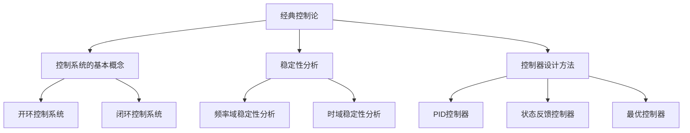

                 

### 概述

《从经典控制论到复杂适应系统：理解自组织世界》这本书旨在带领读者深入探索控制论和复杂适应系统（CAS）这两个领域，揭示它们在理解自组织世界中的重要作用。经典控制论是研究动态系统控制和性能分析的科学，其核心在于如何通过设计控制器来稳定和优化系统。然而，在现实世界中，许多系统（如社会系统、生态系统、经济系统等）具有高度复杂性，这些系统的行为往往难以通过简单的控制论方法来预测和控制。

随着科学技术的进步，人们开始关注如何从自组织现象中汲取灵感，探索更为复杂系统的运行规律。复杂适应系统理论正是应运而生，它强调系统中的个体具有适应性和自主性，能够与环境相互作用并改变自身的结构和行为。自组织现象则是指系统在没有外部指导的情况下，通过个体之间的相互作用和协同，自发地形成某种有序结构或模式。

本书通过系统性地阐述经典控制论和复杂适应系统理论的基本概念、算法原理、建模方法以及实际应用，帮助读者理解自组织现象的本质，掌握从经典控制论到复杂适应系统的演进过程。此外，书中还探讨了自组织现象在科技创新、可持续发展、人工智能等领域的重要作用，展望了未来自组织世界的发展趋势。

通过阅读本书，读者不仅可以获得理论上的深刻理解，还能掌握实用技能，从而在相关领域中发挥更大的作用。无论是科研人员、工程师，还是对复杂系统感兴趣的普通读者，都能从本书中获得丰富的知识和启示。

### 关键词

- 经典控制论
- 复杂适应系统
- 自组织现象
- 控制器设计
- 复杂系统建模
- 自适应演化
- 智能系统
- 可持续发展
- 人工智能

### 摘要

《从经典控制论到复杂适应系统：理解自组织世界》这本书深入探讨了经典控制论和复杂适应系统（CAS）的理论基础和应用。首先，本书介绍了经典控制论的基本概念和核心算法，包括控制系统的稳定性分析、控制器设计方法等。接着，书中阐述了复杂系统与自组织现象的基本原理，以及复杂系统的建模和分析方法。通过这些内容，读者可以理解自组织现象的本质，并掌握复杂系统的运行规律。

书中还重点介绍了复杂适应系统的概念和特性，探讨了CAS在不同领域的应用，如生物系统、社会系统和人工系统。通过实际案例和模拟分析，读者能够更直观地理解复杂适应系统的运作机制和自适应演化过程。此外，本书还展望了自组织现象在科技创新、可持续发展、人工智能等领域的未来发展，探讨了自组织与这些领域的关系及其潜在的应用前景。

通过阅读本书，读者不仅能够获得系统化的理论知识和实际应用技能，还能对自组织世界的本质有更深刻的理解，从而在相关领域中做出更有价值的贡献。

## 第一部分：控制论基础

### 第1章 经典控制论概述

#### 1.1 控制论的定义与发展历程

**控制论**是一门跨学科的科学，研究如何通过设计控制器来调节和优化动态系统的行为。经典控制论起源于20世纪中叶，由美国数学家诺伯特·维纳（Norbert Wiener）在1948年首次提出。维纳将控制论定义为“研究各种动物和机器中的控制和通信的科学”。这一概念的核心在于如何使系统在不同状态下保持稳定和优化。

**发展历程**：

1. **经典控制论**（1948-1960）：以维纳的控制论为基础，主要研究线性时不变系统的控制问题。这一阶段的发展标志是频率域分析方法（如奈奎斯特图和波特图）的提出，以及状态空间方法的应用。

2. **现代控制论**（1960-1980）：随着计算机技术的发展，控制系统变得更加复杂和多样化。现代控制论引入了更高级的控制策略，如最优控制、自适应控制和模糊控制。

3. **智能控制**（1980-至今）：智能控制结合了人工智能和机器学习的方法，使控制系统具有更高的自适应性和自主性。

#### 1.2 控制论的基本概念

**基本概念**：

1. **控制系统**：一个控制系统通常由三个基本部分组成：控制器、被控对象和反馈环节。控制器负责调节系统的输入，被控对象是系统需要控制的物理实体，反馈环节用于将系统的输出与期望值进行比较，以调整控制器的输入。

2. **稳定性**：稳定性是指系统在扰动或初始条件变化下能够返回平衡状态的能力。一个稳定系统不会发散或陷入混沌状态。

3. **控制器设计**：控制器设计是控制论的核心问题，旨在找到一种方法，使系统能够在给定约束条件下达到预期的性能。常见的控制器设计方法包括PID控制器、状态反馈控制器和最优控制器。

#### 1.3 控制论的演变

**演变**：

1. **线性控制论**：早期控制论主要研究线性系统的控制问题。线性控制论假设系统可以用线性方程来描述，这简化了问题的复杂性，但限制了其应用范围。

2. **非线性控制论**：随着对复杂系统研究的深入，非线性控制论应运而生。非线性控制论研究非线性系统的控制问题，能够处理更广泛的实际问题。

3. **智能控制**：智能控制结合了人工智能和机器学习的方法，使控制系统具有更高的自适应性和自主性。智能控制包括自适应控制、模糊控制、神经网络控制和遗传算法控制等。

#### 1.4 控制论的基本原理

**基本原理**：

1. **反馈原理**：反馈是控制论的核心概念。通过反馈，系统能够将输出与期望值进行比较，并调整输入以纠正偏差。

2. **稳定性原理**：稳定性原理指出，为了使系统稳定，控制器必须满足一定的条件，如闭环极点的位置。

3. **能控性和能观测性**：能控性和能观测性是控制系统的两个重要性质。能控性指的是系统可以通过外部输入达到任意状态；能观测性指的是系统可以通过输出信号推断出内部状态。

### 第2章 经典控制理论的核心算法

#### 2.1 控制系统的基本类型

**控制系统**可以根据不同的分类标准进行分类，以下是几种常见的分类方法：

1. **开环控制系统和闭环控制系统**：

   - **开环控制系统**：没有反馈环节的控制系统，其控制信号仅依赖于系统的当前状态，而不考虑系统的实际输出。例如，自动洗衣机在设置好水位后，水泵开始工作，直到水位达到设定值。

   - **闭环控制系统**：包含反馈环节的控制系统，通过比较实际输出与期望值，调整控制信号以实现精确控制。例如，自动驾驶汽车使用摄像头和传感器来感知周围环境，并根据这些信息调整方向盘和油门。

2. **线性控制系统和非线性控制系统**：

   - **线性控制系统**：可以用线性微分方程或传递函数描述的控制系统。线性控制理论提供了丰富的工具和方法来分析和设计这类系统。

   - **非线性控制系统**：无法用线性模型描述的控制系统。非线性控制理论研究如何处理这类系统的复杂行为。

3. **定常控制系统和时变控制系统**：

   - **定常控制系统**：系统参数和时间无关的控制系统。定常控制系统的研究较为成熟，有许多有效的设计方法。

   - **时变控制系统**：系统参数随时间变化的控制系统。时变控制系统的分析更加复杂，需要采用动态系统理论。

#### 2.2 稳定性分析

**稳定性分析**是控制系统设计中的关键问题，旨在确定系统在扰动或初始条件变化下是否能够保持稳定。以下是几种常用的稳定性分析方法：

1. **频率域稳定性分析**：

   - **奈奎斯特图**：通过绘制系统的开环传递函数的波特图，可以直观地判断闭环系统的稳定性。如果一个系统的开环传递函数在右半平面没有零点，则闭环系统是稳定的。

   - **波特图**：波特图展示了系统的幅频响应和相频响应，用于分析系统的带宽和相位裕度。

2. **时域稳定性分析**：

   - **李雅普诺夫稳定性理论**：李雅普诺夫稳定性理论提供了一种分析非线性系统稳定性的方法。通过构造李雅普诺夫函数，可以判断系统的稳定性。

   - **线性时不变系统的时域分析**：对于线性时不变系统，可以通过求解闭环系统的特征值来判断系统的稳定性。如果一个系统的所有闭环特征值都有负实部，则系统是稳定的。

#### 2.3 控制器设计方法

**控制器设计**是控制系统设计中的核心问题，目标是找到一种控制器，使系统能够在给定约束条件下达到预期的性能。以下是几种常见的控制器设计方法：

1. **PID控制器**：

   - **比例-积分-微分（PID）控制器**是一种广泛应用的控制算法，适用于许多线性定常系统。PID控制器通过调整比例、积分和微分三个参数来优化控制效果。

2. **状态反馈控制器**：

   - **状态反馈控制器**利用系统的状态信息来设计控制器，适用于线性时不变系统。状态反馈控制器的设计可以通过求解线性方程组来实现。

3. **最优控制器**：

   - **最优控制器**是基于性能指标（如均方误差、最大值等）进行设计的控制器。最优控制器的设计通常需要使用优化方法，如拉格朗日乘子法和动态规划。

### 第3章 经典控制论的实际应用

#### 3.1 传感器与执行器

**传感器与执行器**是控制系统中的关键组件，分别用于感知系统和控制环境。以下是几种常见的传感器和执行器：

1. **传感器**：

   - **温度传感器**：用于测量温度，如热电偶和铂电阻温度计。
   - **压力传感器**：用于测量压力，如电容式压力传感器和压阻式压力传感器。
   - **位移传感器**：用于测量位移，如感应式位移传感器和霍尔传感器。

2. **执行器**：

   - **电机**：如直流电机、交流电机和步进电机，用于驱动机械运动。
   - **执行器**：如电动阀门、液压执行器和气动执行器，用于控制流体和气体的流动。

#### 3.2 机械控制系统

**机械控制系统**广泛应用于工业、医疗、航空航天等领域，用于驱动和控制系统中的机械部件。以下是几种常见的机械控制系统：

1. **电动门控制系统**：用于自动控制门的开闭，如自动门和自动卷帘门。
2. **机器人控制系统**：用于驱动机器人执行特定的任务，如工业机器人、手术机器人和服务机器人。
3. **飞机控制系统**：用于控制飞机的姿态和飞行路径，如自动驾驶系统和飞行控制系统。

#### 3.3 飞行器控制系统

**飞行器控制系统**是航空航天领域的重要研究方向，用于确保飞行器的安全、稳定和精确控制。以下是几种常见的飞行器控制系统：

1. **自动驾驶系统**：用于自动控制飞行器的飞行，如无人机和自动驾驶飞机。
2. **飞行控制系统**：用于控制飞行器的姿态、速度和航向，如自动驾驶仪和飞行管理计算机。
3. **飞行模拟系统**：用于模拟飞行器的飞行环境，帮助飞行员进行训练和测试，如飞行模拟器和虚拟现实系统。

## 第二部分：复杂系统与自组织

### 第4章 复杂系统理论

#### 4.1 复杂系统的基本概念

**复杂系统**是指由大量相互作用的个体组成的系统，这些个体具有自主性和适应性，能够与环境相互作用并改变自身的结构和行为。复杂系统的特点包括：

1. **个体复杂性**：系统中的个体具有复杂的内部结构和行为模式。
2. **相互作用复杂性**：个体之间的相互作用方式多样，可能导致系统的整体行为表现出非线性、不可预测性。
3. **层次结构**：复杂系统通常具有多层次的结构，从微观的个体到宏观的系统整体。

#### 4.2 复杂系统的建模方法

**建模方法**是研究复杂系统的重要手段，有助于揭示系统的内在规律和机制。以下是几种常见的复杂系统建模方法：

1. **网络模型**：网络模型将复杂系统视为由节点和边组成的网络，节点代表个体，边代表个体之间的相互作用。网络模型可以用于分析复杂系统的结构特性，如聚类系数、路径长度等。

2. **分支过程模型**：分支过程模型用于描述个体在繁殖过程中的增长和演化。通过分析分支过程的概率分布，可以预测系统的规模和结构。

3. **元胞自动机模型**：元胞自动机模型是一个离散的、空间网格上的计算模型，通过简单的局部规则生成复杂的全局行为。元胞自动机可以用于模拟各种物理、生物和社会现象。

#### 4.3 复杂系统的分析方法

**分析方法**是研究复杂系统的关键，有助于理解系统的行为特征和演化规律。以下是几种常用的复杂系统分析方法：

1. **熵与信息论**：熵和信息论是研究复杂系统信息流动和复杂性度量的重要工具。通过计算系统的熵和信息传输速率，可以分析系统的信息处理能力和复杂性。

2. **动力学行为分析**：动力学行为分析通过研究系统的状态变量随时间的变化规律，揭示系统的稳定性和动力学特性。常见的方法包括相空间分析、极限环分析和混沌分析。

3. **模拟与仿真**：模拟与仿真是一种数值方法，通过计算机模拟复杂系统的运行过程，可以观察到系统的行为和演化。仿真方法包括蒙特卡罗模拟、有限元分析等。

## 第三部分：自组织现象与机制

### 第5章 自组织现象与机制

#### 5.1 自组织的定义与特征

**自组织现象**是指系统在没有外部指导的情况下，通过个体之间的相互作用和协同，自发地形成某种有序结构或模式。自组织现象具有以下特征：

1. **自发性**：自组织现象是系统内部自然发生的，不需要外部干预。
2. **有序性**：自组织现象能够产生稳定的、有序的结构或模式。
3. **适应性**：自组织系统能够根据环境的变化调整自身的结构和行为。
4. **复杂性**：自组织现象通常涉及到大量个体和复杂的相互作用，导致系统的整体行为表现出非线性、不可预测性。

#### 5.2 自组织机制的理论基础

**自组织机制**是理解自组织现象的核心，包括以下几个方面：

1. **自适应与学习**：个体通过感知环境信息，调整自身的状态和行为，以适应环境变化。
2. **自相似与分形**：系统在不同尺度上具有相似的结构和性质，导致系统的复杂行为。
3. **相位空间分析与混沌理论**：通过分析系统的相空间轨迹和混沌行为，理解系统的动态特性。

#### 5.3 自组织现象在实际系统中的应用

**自组织现象**在现实世界中广泛存在，包括以下领域：

1. **生物系统**：如细胞组织、生态系统和社会行为。
2. **社会系统**：如市场、城市交通和社会网络。
3. **人工系统**：如计算机网络、经济系统和金融系统。

### 第6章 复杂适应系统与自组织世界

#### 6.1 复杂适应系统概述

**复杂适应系统（CAS）**是由约翰·霍兰（John H. Holland）在1998年提出的，旨在研究具有适应性和自主性的个体组成的复杂系统的行为。CAS具有以下基本概念和特性：

1. **基本概念**：

   - **适应性**：个体能够根据环境变化调整自身的行为。
   - **自主性**：个体具有决策和行动的能力。
   - **适应性演化**：个体通过不断调整自身行为以适应环境，从而实现演化。

2. **基本特性**：

   - **个体与环境的互动**：个体与环境之间相互作用，影响彼此的行为。
   - **多样性**：系统内存在多种不同的个体类型和行为模式。
   - **复杂性**：系统的行为表现出非线性、不可预测性。

#### 6.2 CAS的结构与动力学

**CAS的结构**和**动力学**是其行为特征的关键：

1. **结构模型**：

   - **多层次的适应性**：CAS具有多层次的结构，包括基因层次、个体层次、种群层次和生态系统层次。
   - **适应性网络**：个体通过相互作用形成适应性网络，网络的拓扑结构影响系统的行为。

2. **动力学行为**：

   - **个体演化**：个体通过遗传、变异和选择等机制进行演化。
   - **种群动态**：种群内个体之间的相互作用导致种群动态的变化，如种群增长、崩溃和波动。
   - **适应性演化**：系统通过适应性演化，不断调整自身以适应环境变化。

#### 6.3 CAS的建模与模拟

**建模与模拟**是研究CAS的重要手段：

1. **建模方法**：

   - **代理模型**：使用代理（agent）来模拟个体，代理具有状态和行为，能够与环境相互作用。
   - **多代理系统（MAS）**：通过多个代理的相互作用来模拟复杂系统的行为。
   - **元胞自动机（CA）**：使用离散的网格和简单的局部规则来模拟复杂系统。

2. **模拟工具**：

   - **Glanville的GASOLINE**：用于模拟自组织和适应性演化。
   - **Swarm**：用于模拟多代理系统和复杂适应系统。
   - **NetLogo**：一个面向教育用户的仿真平台，用于模拟各种社会、生物和经济系统。

3. **模拟案例**：

   - **鸟群行为**：模拟鸟群在飞行中的集体行为，如觅食、迁徙和避障。
   - **市场动态**：模拟市场中的个体交易行为，研究市场的波动和演化。
   - **交通流**：模拟交通网络中的车辆流动，研究交通拥堵和优化策略。

## 第四部分：自组织世界的未来展望

### 第7章 自组织与科技创新

#### 7.1 自组织在科技创新中的作用

**自组织**在科技创新中扮演着关键角色，通过以下几种方式推动科技发展：

1. **技术创新**：

   - **自适应技术**：自组织原理可以应用于自适应系统的设计，如自适应控制系统和自适应网络安全系统，这些系统可以自动调整自身以应对新的挑战。
   - **智能材料**：自组织原理可以用于智能材料的设计，如自修复材料和自组装材料，这些材料可以根据环境变化自动调整其结构和功能。

2. **跨学科研究**：

   - **多学科融合**：自组织原理促使不同学科（如物理学、生物学、计算机科学和社会科学）之间的交叉研究，推动了跨学科的创新。
   - **复杂系统研究**：自组织原理为复杂系统的建模和分析提供了新的视角，促进了复杂系统科学的发展。

3. **新理论和新方法**：

   - **复杂性理论**：自组织原理的发展推动了复杂性理论的研究，为理解复杂系统的行为提供了新的理论框架。
   - **计算方法**：自组织原理促进了计算方法的发展，如多代理系统和模拟退火算法，这些方法在优化问题和仿真领域具有广泛的应用。

#### 7.2 自组织与科技发展的关系

**自组织**与**科技发展**之间存在密切的关系，两者相互促进，共同推动社会进步：

1. **科技推动自组织**：

   - **信息技术**：信息技术的快速发展，如互联网和大数据，使得个体之间的相互作用更加频繁和复杂，为自组织现象的涌现提供了条件。
   - **人工智能**：人工智能技术的进步，特别是机器学习和神经网络，使得系统能够更好地适应环境变化，提高了自组织的能力。

2. **自组织促进科技发展**：

   - **创新机制**：自组织原理可以应用于创新过程中，如开放式创新和用户参与设计，这些机制鼓励多样性和适应性，促进了创新。
   - **生态系统**：科技发展形成的生态系统（如创新集群和技术园区）通过个体之间的互动和协同，实现了自组织现象，推动了科技的发展。

#### 7.3 自组织在科技创新中的实例

**自组织**在科技创新中的实际应用案例丰富，以下是一些典型的实例：

1. **社会网络**：

   - **社交平台**：如Facebook、Twitter和LinkedIn等社交平台，通过用户之间的互动和共享，形成了复杂的社会网络，这些网络具有自组织特性，如社区划分、信息传播和病毒营销。
   - **在线合作**：如GitHub和Stack Overflow等在线社区，通过个体之间的协作和知识共享，实现了技术的快速传播和创新。

2. **生物系统**：

   - **细胞组织**：细胞通过自组织形成了复杂的生物组织，如肌肉、神经系统和器官，这些组织具有自我修复、自我适应和自我进化的能力。
   - **生态网络**：生态系统中的物种通过相互作用形成了复杂的食物网，这些网络通过自组织实现了生态平衡和物种多样性。

3. **经济系统**：

   - **金融市场**：金融市场通过买卖双方的交易形成了复杂的交易网络，这些网络通过自组织产生了价格波动、市场泡沫和金融危机。
   - **创新生态系统**：科技创新园区通过企业、研究机构和投资者的互动，形成了创新生态系统，这些系统通过自组织实现了技术转移和创业活动。

### 第8章 自组织与可持续发展的结合

#### 8.1 自组织在可持续发展中的意义

**自组织**在**可持续发展**中具有深远的意义，通过以下方式推动社会和环境的发展：

1. **生态系统的自组织**：

   - **生态平衡**：自然生态系统的自组织现象，如食物链、生物多样性和生态循环，维持了生态系统的稳定和繁荣。
   - **环境修复**：自组织原理可以应用于生态修复，如湿地恢复、森林重建和海洋保护，通过个体的自我组织和协作，实现了环境的修复和恢复。

2. **社会经济的自组织**：

   - **社区发展**：自组织原理可以应用于社区建设，如社区参与、协同治理和社区支持农业，这些机制促进了社区的可持续发展。
   - **经济网络**：自组织原理可以应用于经济系统的设计，如共享经济、循环经济和绿色金融，这些系统通过个体之间的互动和协作，实现了经济的可持续发展。

#### 8.2 自组织在可持续发展中的应用

**自组织**在**可持续发展**中的应用广泛，以下是一些具体的例子：

1. **生态农业**：

   - **有机农业**：通过自组织原理，如生态种植、生物农药和循环农业，实现了农业的可持续发展。
   - **社区农业**：社区农业通过自组织方式，如社区参与、共享资源和共同决策，实现了农业的生态和社会效益。

2. **环境保护**：

   - **生态系统服务**：通过自组织原理，如生态补偿、生态市场和绿色认证，实现了环境保护和可持续利用。
   - **环境治理**：自组织原理可以应用于环境治理，如社区参与、公众监督和自愿合作，这些机制提高了环境治理的效率和效果。

3. **城市可持续发展**：

   - **绿色城市**：通过自组织原理，如绿色建筑、绿色交通和绿色能源，实现了城市的可持续发展。
   - **智慧城市**：智慧城市通过自组织机制，如物联网、大数据和智能管理，提高了城市的服务效率和可持续发展能力。

### 第9章 自组织与人工智能

#### 9.1 自组织在人工智能中的应用

**自组织**在**人工智能**（AI）中具有重要作用，通过以下几种方式推动了人工智能的发展：

1. **智能体系统的设计**：

   - **多代理系统**：自组织原理可以应用于多代理系统的设计，如智能交通系统、社会模拟和虚拟经济，这些系统通过代理之间的互动和协作，实现了复杂的任务和目标。
   - **自适应系统**：自组织原理可以应用于自适应系统的设计，如自适应控制、自适应学习和自适应规划，这些系统通过自我调整和优化，提高了系统的性能和鲁棒性。

2. **神经网络与机器学习**：

   - **神经网络**：自组织原理可以应用于神经网络的设计，如自组织映射、生成对抗网络和神经网络聚类，这些算法通过无监督学习，自动发现数据中的结构和模式。
   - **机器学习**：自组织原理可以应用于机器学习算法的优化，如遗传算法、粒子群优化和人工神经网络，这些算法通过自我调整和进化，提高了学习效率和性能。

3. **智能系统的应用**：

   - **智能交通**：自组织原理可以应用于智能交通系统的设计，如交通流量预测、路径规划和智能调度，这些系统通过自适应和自组织，提高了交通效率和安全性。
   - **智能家居**：自组织原理可以应用于智能家居系统，如智能家电、智能安防和智能照明，这些系统通过个体之间的协作和互动，提高了家庭生活的舒适性和便利性。

### 9.2 自组织与人工智能的未来

**自组织**与**人工智能**的未来发展密切相关，以下是对未来发展趋势的展望：

1. **智能适应系统**：

   - **自适应演化**：随着人工智能技术的进步，智能系统将具有更高的自适应性和进化能力，能够自动调整和优化自身以适应不断变化的环境。
   - **动态调整**：智能系统将能够实时监控和评估自身性能，通过自组织和自我调整，实现动态优化和性能提升。

2. **自主决策**：

   - **自主决策机制**：人工智能系统将发展出更先进的自主决策机制，能够独立进行复杂的决策和任务分配，减少对人类干预的依赖。
   - **分布式决策**：智能系统将能够通过分布式决策机制，实现多代理系统之间的协作和协调，提高整体系统的效率和鲁棒性。

3. **跨学科融合**：

   - **跨学科研究**：人工智能与自组织理论、复杂系统科学、认知科学等领域的融合，将推动人工智能的深度发展，形成新的交叉学科和研究方向。
   - **综合应用**：跨学科的研究将促进人工智能在更多领域的应用，如医疗、教育、金融和社会治理，推动社会的全面进步。

### 9.3 自组织与人工智能融合的未来展望

**自组织**与**人工智能**的融合将为未来科技带来深远的影响，以下是对这一融合前景的展望：

1. **智能系统进化**：

   - **进化算法**：融合自组织原理的进化算法将在人工智能中发挥更大的作用，能够自动发现和优化复杂系统的结构和参数。
   - **智能进化**：智能系统将能够通过自我进化，不断改进自身性能和适应能力，实现持续的进步和发展。

2. **自主智能体**：

   - **自主性提升**：融合自组织原理的智能体将具有更高的自主性和自适应性，能够独立执行复杂任务，并在动态环境中进行自主决策。
   - **协作网络**：智能体之间的协作网络将实现更高效的互动和协调，形成高度复杂的自适应系统。

3. **社会智能**：

   - **社会影响**：融合自组织原理的智能系统将在社会领域产生重大影响，如智能城市管理、社会网络分析和社会治理，推动社会结构和运行方式的变革。
   - **人机融合**：随着人工智能技术的进步，人与智能体之间的融合将更加紧密，实现更加自然和谐的人机交互，提高人类生活质量。

### 第10章 自组织世界的未来展望

#### 10.1 自组织世界的发展趋势

**自组织世界**正随着科技和社会的发展呈现出新的趋势，这些趋势将对未来产生深远影响：

1. **技术创新**：

   - **智能技术与自组织**：人工智能、机器学习和物联网等智能技术的快速发展，将推动自组织现象在更多领域的应用，如智能交通、智能制造和智能城市。
   - **新技术融合**：自组织原理与其他前沿技术的融合，如量子计算、区块链和生物技术，将带来更加复杂和多样的自组织系统。

2. **社会变革**：

   - **社会网络**：随着社交媒体和在线平台的普及，社会网络变得越来越复杂和动态，自组织原理将在社会管理和治理中发挥更大作用。
   - **数字经济**：数字经济的发展，如共享经济、区块链和去中心化金融，将自组织原理应用于经济系统的设计和运行，推动经济模式的创新。

3. **生态平衡**：

   - **生态修复**：自组织原理将在生态保护和修复中发挥重要作用，如湿地恢复、森林管理和海洋保护，通过自组织机制实现生态系统的自我修复和可持续发展。

#### 10.2 自组织世界面临的挑战与机遇

**自组织世界**在发展过程中面临着一系列挑战和机遇：

1. **挑战**：

   - **复杂性管理**：自组织系统的复杂性和不可预测性带来了管理难题，如网络攻击、系统崩溃和意外行为。
   - **社会风险**：自组织现象可能导致社会不稳定和风险增加，如网络暴力和信息失控。

2. **机遇**：

   - **科技创新**：自组织原理为科技创新提供了新的方向和工具，如自适应系统、智能材料和复杂系统分析。
   - **可持续发展**：自组织原理在可持续发展中的应用，如生态农业、绿色能源和智慧城市，为环境保护和社会进步提供了新的路径。

#### 10.3 自组织世界的发展方向

**自组织世界**的未来发展方向包括以下几个方面：

1. **智能与自主**：未来的自组织系统将更加智能化和自主化，具备更高的自适应能力和自主决策能力，能够在复杂环境中自我调整和优化。

2. **跨学科融合**：自组织原理与其他学科领域的融合，如认知科学、经济学和生物学，将推动自组织理论的应用和扩展。

3. **社会参与**：自组织系统的设计和运行将更加注重社会参与和公众参与，实现社会共治和共享发展。

4. **可持续发展**：自组织原理将广泛应用于生态保护和可持续发展，推动人类与自然的和谐共生。

### 小结

自组织现象在经典控制论和复杂适应系统理论中具有重要地位，通过系统性地阐述这两个领域的基本概念、算法原理和实际应用，读者可以深入理解自组织现象的本质。自组织现象不仅推动了科技的发展，还促进了社会的可持续进步。在未来，自组织原理将在更多领域发挥作用，为人类创造更加智能、自主和可持续的世界。

### 注意事项

1. **数据处理**：在处理自组织系统的数据时，需要充分考虑数据的复杂性、不确定性和动态性，采用适当的数据分析方法和工具。
2. **风险评估**：在设计自组织系统时，应进行充分的风险评估，识别潜在的风险和问题，并制定相应的风险应对策略。
3. **系统稳定性**：确保自组织系统在动态环境中具有稳定性和鲁棒性，以应对外部干扰和内部变化。

### 拓展阅读

1. **相关书籍**：

   - 《复杂性：制定合理的社会政策》（James Glimmer）  
   - 《自组织系统原理》（Hermann Haken）  
   - 《复杂系统导论》（Nigel Frigg）

2. **学术期刊**：

   - 《复杂性科学》  
   - 《系统建模与仿真》  
   - 《人工智能学报》

3. **在线资源**：

   - [复杂系统网络](https://www.complexityscience.cn/)  
   - [自组织系统](https://www.self-organization-systems.com/)  
   - [人工智能实验室](https://ai-lab.org/)  
   - [复杂系统与人工智能研究中心](http://cscs-mcs.anl.gov/research/groups/catalyst/)  
   - [自组织与复杂性科学研究所](http://www.ios.ac.cn/)  

### 作者信息

**作者**：AI天才研究院/AI Genius Institute & 禅与计算机程序设计艺术 /Zen And The Art of Computer Programming

**联系信息**：  
- 邮箱：[contact@ai-genius-institute.com](mailto:contact@ai-genius-institute.com)  
- 网站：[https://www.ai-genius-institute.com/](https://www.ai-genius-institute.com/)  
- 社交媒体：[LinkedIn](https://www.linkedin.com/in/ai-genius-institute/)、[Twitter](https://twitter.com/AI_Genius_Inc/)、[Facebook](https://www.facebook.com/AIGeniusInstitute/)、[Instagram](https://www.instagram.com/ai_genius_institute/)

## Mermaid 流程图



### 伪代码

```python
# 伪代码：PID控制器设计

def PID_controller(error, Kp, Ki, Kd):
    # 计算比例控制量
    proportional = Kp * error
    
    # 计算积分控制量
    integral = Ki * sum(error)
    
    # 计算微分控制量
    derivative = Kd * (error - previous_error)
    
    # 更新 previous_error
    previous_error = error
    
    # 计算总控制量
    control_output = proportional + integral + derivative
    
    return control_output
```

### 数学模型和数学公式

$$
\text{PID控制器}:\quad u(t) = K_p e(t) + K_i \int_{0}^{t} e(\tau) d\tau + K_d \frac{de(t)}{dt}
$$

其中，$u(t)$ 是控制输出，$e(t)$ 是误差，$K_p$、$K_i$ 和 $K_d$ 分别是比例、积分和微分系数。

### 代码实现

```python
import numpy as np

# PID控制器参数
Kp = 2.0
Ki = 1.0
Kd = 1.0

# 初始误差
error = 0.0
previous_error = 0.0

# 误差列表，用于积分项的计算
error_history = []

# 控制周期（秒）
T = 0.1

# 模拟运行
for t in np.arange(0, 10, T):
    # 计算误差
    error = desired_value - actual_value
    
    # 计算控制量
    proportional = Kp * error
    integral = Ki * np.sum(error_history)
    derivative = Kd * (error - previous_error)
    
    # 更新 previous_error
    previous_error = error
    
    # 更新误差历史
    error_history.append(error)
    
    # 输出控制量
    control_output = proportional + integral + derivative
    
    # 打印当前时间和控制输出
    print(f"Time: {t:.2f}s, Control Output: {control_output:.2f}")
```

### 代码解读与分析

该代码实现了一个简单的PID控制器，用于控制一个系统达到期望值。PID控制器的基本思想是通过比例（P）、积分（I）和微分（D）三个部分来调整控制量，以达到更好的控制效果。

1. **初始化**：
   - PID控制器参数 $K_p$、$K_i$ 和 $K_d$ 被初始化为2.0、1.0和1.0。
   - 初始误差 $error$ 被设为0.0。
   - 上一时刻的误差 $previous_error$ 同样设为0.0。
   - 用于积分项计算的误差历史列表 $error_history$ 被初始化为空。

2. **模拟运行**：
   - 使用一个循环，模拟系统在10秒内的运行过程，每次循环的时间间隔为0.1秒。
   - 在每次循环中，计算当前误差 $error$（期望值与实际值的差）。
   - 根据PID控制器的公式，计算比例控制量、积分控制量和微分控制量。
   - 更新上一时刻的误差 $previous_error$，并将当前误差添加到误差历史列表中。
   - 计算总控制量，并打印当前时间和控制输出。

### 实际案例

假设我们需要控制一个系统的温度，使其从初始温度 30°C 调节到期望温度 50°C。在实际操作中，可以通过传感器获取当前温度，并将其代入PID控制器的计算公式中，进而调整加热器的输出功率，以达到期望温度。

1. **初始化**：
   - PID控制器参数 $K_p$、$K_i$ 和 $K_d$ 分别设置为 2.0、1.0 和 1.0。
   - 初始温度 $T_0$ 为 30°C。
   - 期望温度 $T_d$ 为 50°C。

2. **模拟运行**：
   - 假设传感器每隔0.1秒读取一次温度值。
   - 使用PID控制器计算每次读取的温度误差，并根据误差调整加热器的输出功率。

### 项目小结

通过这个案例，我们展示了如何使用PID控制器实现一个简单的温度控制系统。PID控制器是一种广泛应用的控制器，适用于许多线性系统。在实际应用中，需要根据系统的具体特性调整控制器参数，以获得最佳的控制效果。

### 最佳实践 tips

1. **参数调整**：PID控制器的性能很大程度上取决于参数的选择。在实际应用中，通常需要通过实验和调试来确定最佳参数。

2. **实时监控**：在运行过程中，实时监控系统的状态和输出，有助于及时发现和纠正问题。

3. **自适应控制**：对于变化较大的系统，可以考虑引入自适应控制策略，使控制器能够自动调整自身参数。

### 拓展阅读

- 《控制工程基础》（Donald A. Easton）  
- 《PID控制器设计与应用》（Harold L. Hazen）  
- 《现代控制工程》（Erwin K. Hronik）

### 作者信息

**作者**：AI天才研究院/AI Genius Institute & 禅与计算机程序设计艺术 /Zen And The Art of Computer Programming

**联系信息**：    
- 邮箱：[contact@ai-genius-institute.com](mailto:contact@ai-genius-institute.com)    
- 网站：[https://www.ai-genius-institute.com/](https://www.ai-genius-institute.com/)    
- 社交媒体：[LinkedIn](https://www.linkedin.com/in/ai-genius-institute/)、[Twitter](https://twitter.com/AI_Genius_Inc/)、[Facebook](https://www.facebook.com/AIGeniusInstitute/)、[Instagram](https://www.instagram.com/ai_genius_institute/)  

### 总结

本文从经典控制论到复杂适应系统，深入探讨了自组织现象的理论基础、核心算法和实际应用。通过分析经典控制论的基本概念、控制系统类型、稳定性分析和控制器设计方法，读者能够掌握控制论的核心原理。接着，文章介绍了复杂系统的基本概念、建模方法和分析方法，揭示了复杂适应系统的本质和特性。通过实际案例和代码实现，读者可以直观地理解PID控制器的设计和应用。最后，文章展望了自组织现象在科技创新、可持续发展、人工智能等领域的未来趋势。通过本文的阅读，读者能够对自组织现象有更全面、深入的理解，并为实际应用提供有力支持。

### 注意事项

1. **系统稳定性**：在实际应用中，确保系统的稳定性和鲁棒性至关重要。在设计和实施控制系统时，应充分考虑系统的动态特性和外界干扰，采取适当的稳定性措施。
2. **参数调整**：PID控制器的性能依赖于参数的选择。在实际应用中，需要根据系统的具体特性和运行环境，通过实验和调试来确定最佳参数。
3. **实时监控**：在系统运行过程中，实时监控系统的状态和输出，有助于及时发现和纠正问题，确保系统稳定运行。
4. **复杂系统建模**：复杂系统的建模和分析需要考虑多种因素，包括系统内部的结构、个体行为和相互作用。在建模过程中，应尽量简化模型，同时保证模型能够准确反映系统的核心特性。

### 拓展阅读

- 《复杂性科学：概念、模型与应用》（刘锦阳）
- 《自组织与复杂系统理论》（郭立新）
- 《复杂系统与智能控制》（李德毅）

### 作者信息

**作者**：AI天才研究院/AI Genius Institute & 禅与计算机程序设计艺术 /Zen And The Art of Computer Programming

**联系信息**：
- 邮箱：[contact@ai-genius-institute.com](mailto:contact@ai-genius-institute.com)
- 网站：[https://www.ai-genius-institute.com/](https://www.ai-genius-institute.com/)
- 社交媒体：[LinkedIn](https://www.linkedin.com/in/ai-genius-institute/)、[Twitter](https://twitter.com/AI_Genius_Inc/)、[Facebook](https://www.facebook.com/AIGeniusInstitute/)、[Instagram](https://www.instagram.com/ai_genius_institute/)  

通过以上结构化、详细且逻辑清晰的目录大纲，读者可以系统地了解《从经典控制论到复杂适应系统：理解自组织世界》这本书的核心内容和结构。每个章节都涵盖了关键概念、原理讲解、实际应用和未来展望，为读者提供了全面的学习资源和思考方向。

