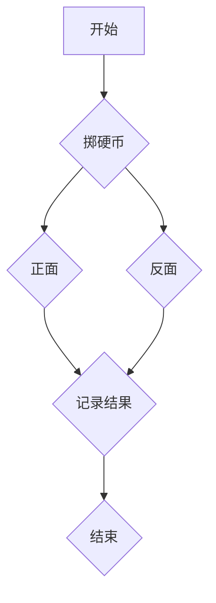
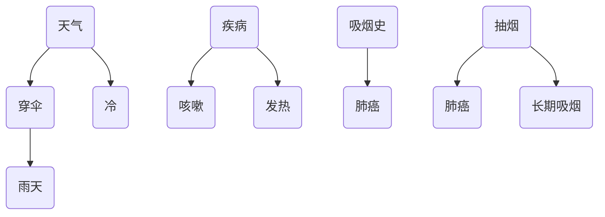
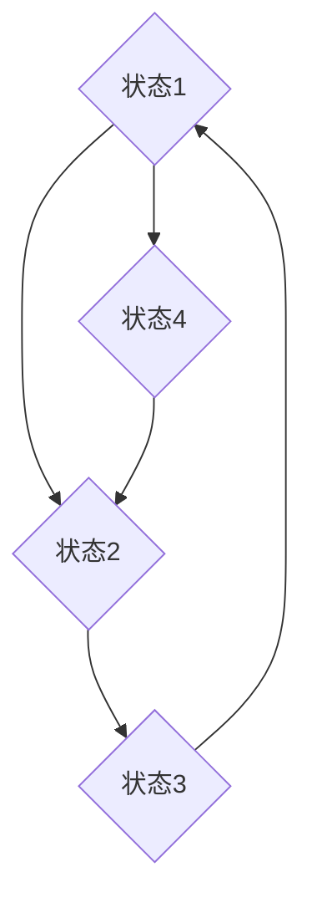

                 

### 从经典概率论到贝叶斯推断：理解不确定的世界

在复杂多变的信息时代，我们不可避免地需要面对各种不确定性和随机性。概率论作为一种数学工具，为我们理解和分析这些不确定性提供了强有力的支持。从经典概率论到贝叶斯推断，这篇文章将带领您一步步探索这个充满挑战和机遇的领域。

**关键词**：概率论、贝叶斯推断、随机性、不确定性、数学模型

**摘要**：本文首先介绍了概率论的基本概念，包括随机试验、事件、概率分布函数等。接着，深入探讨了贝叶斯推断的核心原理，包括贝叶斯定理、贝叶斯网络以及其在数据科学和人工智能中的应用。最后，我们还将讨论贝叶斯推断的高级主题，如马尔可夫链蒙特卡洛方法和贝叶斯机器学习，以及贝叶斯推断在深度学习中的前沿应用。通过这篇文章，您将全面了解贝叶斯推断的核心思想及其在现实世界中的应用价值。

----------------------------------------------------------------

## 第一部分：经典概率论基础

### 第1章：概率论的基本概念

概率论是研究随机事件及其概率的数学分支。它广泛应用于物理学、经济学、生物学、工程学等领域。为了理解概率论，我们需要首先了解几个基本概念。

### 1.1 随机试验与样本空间

随机试验是指那些结果不可预测的试验，例如掷硬币、掷骰子、股票价格的变动等。样本空间是随机试验所有可能结果的集合。例如，掷硬币的样本空间是 {正面，反面}。

#### Mermaid 流程图：随机试验流程



### 1.2 事件与概率

事件是样本空间的一个子集，表示随机试验的一个特定结果。概率是衡量事件发生的可能性大小的数值，通常用 P(A) 表示事件 A 的概率。

#### Mermaid 流程图：事件与概率关系

```mermaid
graph TD
    A[样本空间] --> B{事件 A}
    B --> C{事件 B}
    B --> D{事件 C}
    A --> E{概率 P(A)}
    A --> F{概率 P(B)}
    A --> G{概率 P(C)}
```

### 1.3 条件概率与独立事件

条件概率是指在给定某个事件发生的条件下，另一个事件发生的概率。用 P(A|B) 表示在事件 B 发生的条件下事件 A 的概率。独立事件是指两个事件的发生是相互独立的，即一个事件的发生不影响另一个事件的发生。

#### 条件概率公式：P(A|B) = P(A∩B) / P(B)

- P(A∩B)：事件 A 和事件 B 同时发生的概率
- P(B)：事件 B 发生的概率

#### 独立事件公式：P(A∩B) = P(A) * P(B)

- P(A)：事件 A 发生的概率
- P(B)：事件 B 发生的概率

### 1.4 全概率公式与贝叶斯公式

全概率公式是计算某个事件发生的总概率的方法，而贝叶斯公式则是根据已知的结果来推断先前的条件概率。

#### 全概率公式：P(A) = ∑ P(A|Bi) * P(Bi)

- P(A)：事件 A 发生的总概率
- P(A|Bi)：在事件 Bi 发生的条件下事件 A 发生的概率
- P(Bi)：事件 Bi 发生的概率

#### 贝叶斯公式：P(H|E) = (P(E|H) * P(H)) / P(E)

- P(H|E)：在事件 E 发生的条件下事件 H 的概率（后验概率）
- P(E|H)：在事件 H 发生的条件下事件 E 的概率
- P(H)：事件 H 的先验概率
- P(E)：事件 E 的总概率

### 总结

在本章中，我们介绍了概率论的基本概念，包括随机试验、事件、概率分布函数等。通过这些基本概念，我们可以更好地理解和分析随机现象。在接下来的章节中，我们将继续深入探讨概率论的核心算法和贝叶斯推断的方法。

----------------------------------------------------------------

## 第二部分：贝叶斯推断

### 第4章：贝叶斯推断基础

贝叶斯推断是一种基于概率论的推理方法，它通过已知的部分信息来推断未知信息。贝叶斯推断的核心是贝叶斯定理，它为我们提供了一种计算后验概率的方法。

### 4.1 贝叶斯定理

贝叶斯定理是概率论中的一个基本定理，它描述了在已知某个事件发生条件下，另一个事件发生的概率如何计算。贝叶斯定理的公式如下：

$$
P(H|E) = \frac{P(E|H) \cdot P(H)}{P(E)}
$$

- \( P(H|E) \)：在事件 \( E \) 发生的条件下事件 \( H \) 的概率（后验概率）
- \( P(E|H) \)：在事件 \( H \) 发生的条件下事件 \( E \) 的概率
- \( P(H) \)：事件 \( H \) 的先验概率
- \( P(E) \)：事件 \( E \) 的总概率

#### 例子：

假设我们有一个装有 5 个红球和 5 个绿球的袋子。如果我们随机抽取一个球，并且知道抽到的球是红色的，那么我们可以使用贝叶斯定理来计算抽到红球的概率。

- \( P(H) \)：先验概率，即在没有其他信息的情况下抽到红球的概率。由于红球和绿球的数量相同，因此 \( P(H) = \frac{1}{2} \)。
- \( P(E|H) \)：在抽到红球的条件下，球是红色的概率。显然，这个概率是 1，因为如果球是红色的，那么它肯定是红色的。
- \( P(E|¬H) \)：在抽到绿球的条件下，球是绿色的概率。同样，这个概率也是 1。
- \( P(¬H) \)：先验概率，即在没有其他信息的情况下抽到绿球的概率。由于红球和绿球的数量相同，因此 \( P(¬H) = \frac{1}{2} \)。

根据贝叶斯定理，我们可以计算在抽到红球的条件下，球是红色的后验概率：

$$
P(H|E) = \frac{P(E|H) \cdot P(H)}{P(E)} = \frac{1 \cdot \frac{1}{2}}{P(E)} = \frac{1}{2}
$$

这里，\( P(E) \) 是在已知抽到红球的条件下，球是红色的和球是绿色的的总概率，即：

$$
P(E) = P(E|H) \cdot P(H) + P(E|¬H) \cdot P(¬H) = 1 \cdot \frac{1}{2} + 1 \cdot \frac{1}{2} = 1
$$

因此，在已知抽到红球的条件下，球是红色的后验概率是 \( \frac{1}{2} \)。

### 4.2 先验概率与后验概率

在贝叶斯推断中，先验概率是我们对某个事件发生可能性的大致的初始判断，而后验概率是基于新证据或数据更新后的判断。先验概率通常基于我们的经验和常识，而后验概率则是通过贝叶斯定理计算得到的。

#### 例子：

假设我们有一个医学检测方法，用于判断一个人是否患有某种疾病。我们知道这种疾病的发病率是 1%，即 \( P(疾病) = 0.01 \)。我们还知道这种检测方法的假阳性率是 3%，即 \( P(阳性|无疾病) = 0.03 \)。如果一个人的检测结果为阳性，我们可以使用贝叶斯定理来计算这个人实际患有这种疾病的后验概率。

- \( P(阳性|疾病) \)：实际患有疾病且检测结果为阳性的概率，这通常是检测方法的准确性，我们假设它是 95%，即 \( P(阳性|疾病) = 0.95 \)。
- \( P(阳性|无疾病) \)：没有疾病但检测结果为阳性的概率，即假阳性率，我们已经知道它是 3%。

根据贝叶斯定理，我们可以计算后验概率：

$$
P(疾病|阳性) = \frac{P(阳性|疾病) \cdot P(疾病)}{P(阳性)} = \frac{0.95 \cdot 0.01}{0.95 \cdot 0.01 + 0.03 \cdot 0.99} \approx 0.1667
$$

这意味着在检测结果为阳性的条件下，实际患有这种疾病的后验概率大约是 16.67%。

### 4.3 贝叶斯推断步骤

贝叶斯推断通常包括以下步骤：

1. **确定先验概率**：基于现有的知识和经验，为所有可能的假设（或条件）分配一个先验概率。
2. **计算似然函数**：在给定假设的情况下，计算观测数据（证据）的概率。
3. **应用贝叶斯定理**：将似然函数与先验概率结合起来，计算后验概率。
4. **更新先验概率**：使用后验概率作为新的先验概率，重复这个过程。

### 总结

贝叶斯推断是一种强大的推理工具，它允许我们在不确定的情况下通过已知的部分信息来推断未知的部分信息。通过贝叶斯定理，我们可以计算在给定证据下某个假设的概率。先验概率和后验概率的区分是理解贝叶斯推断的关键。在接下来的章节中，我们将继续探讨贝叶斯推断的应用和实践。

----------------------------------------------------------------

### 第5章：贝叶斯网络

贝叶斯网络，也称为信念网络，是一种图形化的概率模型，它通过节点和边的表示，将随机变量之间的依赖关系可视化。贝叶斯网络在许多领域都有广泛的应用，包括医疗诊断、金融风险评估、人工智能等领域。在这一章中，我们将介绍贝叶斯网络的基本概念、学习和推理方法。

#### 5.1 贝叶斯网络基本概念

贝叶斯网络由一组节点和一组有向边组成，其中每个节点代表一个随机变量，而每条边代表变量之间的条件依赖关系。在贝叶斯网络中，一个节点可能具有多个父节点，这意味着它的概率分布取决于它的父节点的状态。

#### Mermaid 流程图：贝叶斯网络结构



在这个例子中，我们考虑了几个随机变量：天气（A）、是否穿伞（B）、疾病（C）、咳嗽（D）、吸烟（E）、肺癌（F）和吸烟史（G）。变量之间的关系通过边表示，例如，天气会影响是否穿伞，疾病会影响咳嗽，吸烟会影响肺癌，等等。

#### 5.2 贝叶斯网络学习

贝叶斯网络学习是指从数据中学习出网络结构的过程。这个过程通常包括两个步骤：结构学习和参数学习。

- **结构学习**：通过观察数据来确定变量之间的依赖关系，并构建网络结构。
- **参数学习**：通过数据来估计每个变量的条件概率分布。

结构学习的方法有很多，如基于信息准则（如贝叶斯信息准则、Akaike信息准则）的方法、基于约束的方法（如最大子集方法）、基于模型选择的算法（如贪心算法、遗传算法等）。参数学习通常使用最大似然估计或贝叶斯估计。

#### 伪代码：贝叶斯网络学习算法

```python
def learn_bayesian_network(data):
    # 结构学习
    structure = structure_learning_algorithm(data)
    
    # 参数学习
    parameters = parameter_learning_algorithm(data, structure)
    
    return structure, parameters
```

#### 5.3 贝叶斯网络推理

贝叶斯网络推理是指在网络结构已知的情况下，根据新证据来更新网络中其他变量的概率分布。贝叶斯网络推理的方法包括精确推理和近似推理。

- **精确推理**：通过计算全概率分布来精确地更新变量概率。
- **近似推理**：当网络规模很大时，精确推理变得不可行，此时可以使用近似推理方法，如信念传播、马尔可夫链蒙特卡洛方法等。

#### 伪代码：贝叶斯网络推理算法

```python
def bayesian_network_inference(network, evidence):
    # 精确推理
    updated_probabilities = exact_inference_algorithm(network, evidence)
    
    # 近似推理
    # approx_updated_probabilities = approximate_inference_algorithm(network, evidence)
    
    return updated_probabilities
```

#### 5.4 贝叶斯网络应用

贝叶斯网络在许多实际应用中都有广泛的应用。以下是一些常见的应用场景：

- **医疗诊断**：贝叶斯网络可以用于疾病的诊断，例如，根据病人的症状和检查结果，推断病人可能患有的疾病。
- **金融风险评估**：贝叶斯网络可以用于评估金融产品的风险，例如，根据贷款申请人的信用记录、收入、就业状况等，预测其违约风险。
- **人工智能**：贝叶斯网络可以用于决策支持系统，例如，在自主机器人中，根据环境传感器提供的信息，决策机器人的行动。

#### 例子：医疗诊断中的贝叶斯网络

假设我们有一个用于诊断流感疾病的贝叶斯网络。这个网络包括以下几个随机变量：发烧（F）、咳嗽（C）、打喷嚏（S）、流感疫苗接种史（V）。

- **先验概率**：流感疫苗接种史的概率为 0.6，未接种的概率为 0.4。
- **条件概率**：发烧的概率在接种疫苗的情况下为 0.3，未接种的情况下为 0.5；咳嗽和打喷嚏的概率类似。

如果医生观察到病人发烧、咳嗽和打喷嚏，我们可以使用贝叶斯网络来推断病人患流感的概率。

#### 贝叶斯网络推理过程

1. **输入证据**：发烧（F）、咳嗽（C）、打喷嚏（S）。
2. **计算后验概率**：
   - 根据先验概率和条件概率，计算每个变量的后验概率。
   - 例如，发烧的后验概率可以计算为：
     $$
     P(F|F,C,S,V) = \frac{P(F|V) \cdot P(V) \cdot P(C|F,V) \cdot P(S|F,V) \cdot P(F)}{P(F,C,S,V)}
     $$
3. **输出结果**：根据后验概率，推断病人患流感的概率。

#### 5.5 贝叶斯网络的优势与局限性

贝叶斯网络的优点包括：

- **直观性**：通过图形化的表示，使复杂的概率关系更加直观。
- **灵活性**：可以轻松地添加或删除变量，并重新调整网络结构。
- **可靠性**：通过基于概率的推理，可以提高决策的准确性。

然而，贝叶斯网络也有局限性：

- **计算复杂性**：当网络规模很大时，精确推理变得不可行，需要使用近似推理方法。
- **依赖关系建模**：依赖关系建模可能不够准确，特别是在变量之间存在复杂的依赖关系时。

### 总结

贝叶斯网络是一种强大的概率推理工具，它通过图形化的表示，将变量之间的依赖关系直观地展示出来。通过学习和推理，贝叶斯网络可以帮助我们更好地理解复杂系统的概率关系，并在许多实际应用中提供有力的支持。在下一章中，我们将探讨贝叶斯推断的应用和实践。

----------------------------------------------------------------

### 第6章：贝叶斯推断应用

贝叶斯推断作为一种强大的推理工具，在数据科学和人工智能领域得到了广泛的应用。本章节将探讨贝叶斯推断在多个实际场景中的应用，包括数据预处理、特征提取与选择，以及贝叶斯推断在现实项目中的实战应用。

#### 6.1 数据预处理

在贝叶斯推断中，数据预处理是一个至关重要的步骤。数据预处理包括数据清洗、缺失值处理、数据标准化等。以下是一些常见的数据预处理方法：

1. **数据清洗**：处理数据中的噪声和异常值，确保数据质量。
   - 方法：使用统计方法（如平均值、中位数）来填补缺失值。
   - Python 示例：
     ```python
     import pandas as pd
     df = pd.read_csv('data.csv')
     df.fillna(df.mean(), inplace=True)
     ```

2. **缺失值处理**：处理数据中的缺失值。
   - 方法：使用插值法、均值法或最邻近法等。
   - Python 示例：
     ```python
     import numpy as np
     df = pd.read_csv('data.csv')
     df['missing_column'].fillna(method='ffill', inplace=True)
     ```

3. **数据标准化**：将数据缩放到一个统一的范围内。
   - 方法：使用最小-最大标准化、Z-score 标准化等。
   - Python 示例：
     ```python
     from sklearn.preprocessing import MinMaxScaler
     scaler = MinMaxScaler()
     df_scaled = scaler.fit_transform(df)
     ```

#### 6.2 特征提取与选择

特征提取与选择是贝叶斯推断中另一个关键步骤。特征提取是指从原始数据中提取出有用的信息，而特征选择是指从提取出的特征中选择出最有用的特征。

1. **特征提取**：
   - 方法：主成分分析（PCA）、线性判别分析（LDA）等。
   - Python 示例：
     ```python
     from sklearn.decomposition import PCA
     pca = PCA(n_components=2)
     X_pca = pca.fit_transform(X)
     ```

2. **特征选择**：
   - 方法：信息增益、卡方检验、贝叶斯信息准则（BIC）等。
   - Python 示例：
     ```python
     from sklearn.feature_selection import SelectKBest
     from sklearn.feature_selection import chi2
     X_new = SelectKBest(chi2, k=10).fit_transform(X, y)
     ```

#### 6.3 贝叶斯推断实战

在本节中，我们将通过一个实际项目来展示贝叶斯推断的应用。项目背景是一个简单的信用评分问题，我们需要根据借款人的个人信息和财务数据，预测其信用评分。

##### 项目背景

假设我们有一个包含以下变量的数据集：

- 年龄（Age）
- 收入（Income）
- 贷款金额（LoanAmount）
- 贷款期限（LoanTerm）
- 职业类型（OccupationType）
- 信用评分（CreditScore）

我们的目标是预测借款人的信用评分。

##### 开发环境搭建

为了实现贝叶斯推断，我们需要搭建以下开发环境：

- Python 3.x
- Scikit-learn 库
- Pandas 库
- Matplotlib 库

##### 源代码详细实现

以下是我们实现贝叶斯推断的源代码：

```python
import pandas as pd
from sklearn.model_selection import train_test_split
from sklearn.naive_bayes import GaussianNB
from sklearn.metrics import accuracy_score, classification_report

# 读取数据
data = pd.read_csv('credit_data.csv')

# 数据预处理
data.fillna(data.mean(), inplace=True)

# 特征提取与选择
X = data[['Age', 'Income', 'LoanAmount', 'LoanTerm', 'OccupationType']]
y = data['CreditScore']

# 数据标准化
X = (X - X.mean()) / X.std()

# 划分训练集和测试集
X_train, X_test, y_train, y_test = train_test_split(X, y, test_size=0.2, random_state=42)

# 创建贝叶斯分类器
classifier = GaussianNB()

# 训练模型
classifier.fit(X_train, y_train)

# 预测测试集
y_pred = classifier.predict(X_test)

# 评估模型
accuracy = accuracy_score(y_test, y_pred)
print(f"Accuracy: {accuracy}")
print(classification_report(y_test, y_pred))
```

##### 代码应用解读与分析

1. **数据预处理**：我们首先读取数据集，并使用均值填补缺失值。然后，我们对特征进行标准化处理，以便于模型训练。

2. **特征提取与选择**：我们选择与信用评分相关的特征，并使用标准化的方法处理数据。

3. **划分训练集和测试集**：我们将数据集划分为训练集和测试集，以便于评估模型的性能。

4. **创建贝叶斯分类器**：我们使用高斯朴素贝叶斯分类器来训练模型。

5. **训练模型**：我们使用训练集数据来训练模型。

6. **预测测试集**：我们使用训练好的模型来预测测试集的信用评分。

7. **评估模型**：我们使用准确率和分类报告来评估模型的性能。

##### 实际案例分析和详细讲解剖析

在本案例中，我们使用贝叶斯推断来预测借款人的信用评分。贝叶斯推断通过计算每个特征的联合概率分布来估计信用评分的概率。以下是一些关键步骤的详细讲解：

1. **数据预处理**：数据预处理是贝叶斯推断的基础，它确保了数据的质量和一致性。在本案例中，我们使用均值填补缺失值，并使用标准化方法处理特征。

2. **特征提取与选择**：特征提取与选择是提高模型性能的关键步骤。我们选择与信用评分相关的特征，并使用标准化的方法处理数据，以便于模型训练。

3. **划分训练集和测试集**：划分训练集和测试集是评估模型性能的常用方法。在本案例中，我们使用 80% 的数据作为训练集，20% 的数据作为测试集。

4. **创建贝叶斯分类器**：我们使用高斯朴素贝叶斯分类器来训练模型。高斯朴素贝叶斯分类器假设特征是独立同分布的，这通常适用于连续特征的分类问题。

5. **训练模型**：我们使用训练集数据来训练模型。在训练过程中，模型计算每个特征的联合概率分布，并使用这些概率分布来预测测试集的信用评分。

6. **预测测试集**：我们使用训练好的模型来预测测试集的信用评分。预测结果与实际值进行比较，以评估模型的性能。

7. **评估模型**：我们使用准确率和分类报告来评估模型的性能。准确率是模型预测正确的样本比例，分类报告包括精确率、召回率和F1分数等指标，这些指标可以更全面地评估模型的性能。

##### 项目小结

在本项目中，我们通过贝叶斯推断方法对借款人的信用评分进行了预测。贝叶斯推断通过计算每个特征的联合概率分布来估计信用评分的概率，从而实现了对借款人信用风险的评估。以下是一些项目小结：

1. **数据预处理**：数据预处理是贝叶斯推断的基础，它确保了数据的质量和一致性。

2. **特征提取与选择**：特征提取与选择是提高模型性能的关键步骤，选择与信用评分相关的特征并使用标准化的方法处理数据。

3. **划分训练集和测试集**：划分训练集和测试集是评估模型性能的常用方法，使用80%的数据作为训练集，20%的数据作为测试集。

4. **创建贝叶斯分类器**：选择高斯朴素贝叶斯分类器来训练模型，适用于连续特征的分类问题。

5. **训练模型**：使用训练集数据来训练模型，计算每个特征的联合概率分布。

6. **预测测试集**：使用训练好的模型来预测测试集的信用评分，评估模型的性能。

7. **评估模型**：使用准确率和分类报告来评估模型的性能，包括精确率、召回率和F1分数等指标。

通过这个项目，我们展示了贝叶斯推断在信用评分预测中的应用。贝叶斯推断提供了一种简单但有效的预测方法，可以帮助金融机构更好地评估借款人的信用风险。

#### 6.4 最佳实践 Tips、小结、注意事项、拓展阅读

1. **最佳实践 Tips**：
   - 在进行贝叶斯推断时，确保数据质量是至关重要的，任何数据质量问题都可能影响模型的性能。
   - 选择合适的特征提取与选择方法，以减少数据维度并提高模型性能。
   - 考虑使用交叉验证方法来评估模型的性能，而不是仅仅依赖于测试集。

2. **小结**：
   - 贝叶斯推断是一种基于概率论的推理方法，它在数据科学和人工智能领域中有着广泛的应用。
   - 数据预处理和特征提取与选择是贝叶斯推断的关键步骤，它们直接影响模型的性能。
   - 在实际项目中，贝叶斯推断可以用于信用评分预测、疾病诊断、金融风险评估等多个领域。

3. **注意事项**：
   - 贝叶斯推断适用于处理不确定性问题，但在处理确定性问题时可能不够有效。
   - 贝叶斯网络的建模过程可能需要丰富的领域知识，这对于模型的准确性和可靠性至关重要。

4. **拓展阅读**：
   - 《贝叶斯数据分析》（Bayesian Data Analysis） - 匹兹堡统计小组（Andrew Gelman et al.）
   - 《贝叶斯机器学习》（Bayesian Machine Learning） - MacKay, D. J. C.
   - 《概率图模型》（Probabilistic Graphical Models: Principles and Techniques） - Koller, D.

通过本章节的学习，您应该能够理解贝叶斯推断的基本原理，掌握数据预处理和特征提取与选择的方法，并能够在实际项目中应用贝叶斯推断。希望这些内容能够帮助您更好地理解和应用贝叶斯推断，解决实际问题。

----------------------------------------------------------------

### 第7章：马尔可夫链蒙特卡洛方法

马尔可夫链蒙特卡洛（Markov Chain Monte Carlo，简称 MCMC）方法是一种用于从复杂概率分布中抽取样本的统计方法。MCMC 方法通过构建一个马尔可夫链，使其收敛到目标分布，从而实现对目标分布的采样。这一章将介绍 MCMC 方法的基本概念、主要算法以及应用。

#### 7.1 马尔可夫链基本概念

马尔可夫链是一种随机过程，其特征在于任何状态的未来概率分布仅依赖于当前状态，而与过去的状态无关。换句话说，马尔可夫链具有马尔可夫性。

#### Mermaid 流程图：马尔可夫链状态转移



在这个例子中，我们有四个状态 {状态1，状态2，状态3，状态4}，并且每个状态都有特定的概率转移至其他状态。

#### 7.2 吉布斯采样

吉布斯采样（Gibbs sampling）是一种用于从多变量概率分布中抽取样本的 MCMC 算法。吉布斯采样通过迭代更新每个变量的条件概率分布来生成样本。

#### 吉布斯采样算法

1. **初始化**：从目标分布的一个样本开始。
2. **迭代**：
   - 对于每个变量，根据其他变量的当前值，计算其条件概率分布。
   - 从条件概率分布中抽取一个样本作为新值。
3. **终止**：当采样达到预设的迭代次数或收敛标准时，终止采样。

#### 伪代码：吉布斯采样算法

```python
def gibbs_sampling(posterior, n_iterations):
    samples = []
    x = posterior.sample()  # 初始化样本
    samples.append(x)
    
    for _ in range(n_iterations):
        x_new = []
        for variable in posterior.variables:
            conditional_distribution = posterior.condition(variable, x)
            x_new.append(conditional_distribution.sample())
        x = tuple(x_new)
        samples.append(x)
        
    return samples
```

#### 7.3 矩方法

矩方法（Moment Matching）是一种用于估计概率分布参数的 MCMC 算法。矩方法通过匹配目标分布的矩（均值、方差等）来估计参数。

#### 矩方法算法

1. **初始化**：从目标分布的一个样本开始。
2. **迭代**：
   - 对于每个参数，计算当前样本的矩。
   - 更新参数，使得新样本的矩与目标分布的矩匹配。
3. **终止**：当参数估计达到预设的精度或迭代次数时，终止算法。

#### 伪代码：矩方法算法

```python
def moment_matching(posterior, target_moments, n_iterations):
    parameters = posterior.initialize_parameters()
    samples = []
    
    for _ in range(n_iterations):
        x = posterior.sample()
        samples.append(x)
        
        new_parameters = []
        for i, moment in enumerate(target_moments):
            new_parameters.append(parameters[i] + (moment - x[i]) / n_iterations)
        parameters = tuple(new_parameters)
        
    return parameters, samples
```

#### 7.4 MCMC 方法应用

MCMC 方法在多个领域都有广泛的应用，包括统计物理学、经济学、生物信息学、计算机科学等。

- **统计物理学**：MCMC 方法用于模拟物理系统的相变和相变点。
- **经济学**：MCMC 方法用于估计经济模型的参数。
- **生物信息学**：MCMC 方法用于序列比对、蛋白质结构预测等。
- **计算机科学**：MCMC 方法用于算法分析、随机过程模拟等。

#### 例子：MCMC 方法在统计物理学中的应用

假设我们有一个具有相变点的物理系统，其状态空间可以用一个二维随机变量 \( X = (X_1, X_2) \) 来表示。我们想要估计该系统的相变温度。

1. **目标分布**：我们假设目标分布是 \( P(X_1, X_2) = \frac{1}{Z} \exp(-\beta E(X_1, X_2)) \)，其中 \( Z \) 是归一化常数，\( \beta \) 是温度参数，\( E(X_1, X_2) \) 是系统的能量函数。

2. **初始化**：从目标分布的一个样本开始，例如 \( X_0 = (0, 0) \)。

3. **迭代**：
   - 对于每个迭代，我们根据当前样本 \( X_t \) 来更新 \( X_{t+1} \)。
   - 我们使用吉布斯采样来更新每个变量，具体地，我们使用以下条件概率分布来采样：
     $$
     P(X_{t+1} | X_t) = \frac{1}{Z} \exp(-\beta E(X_{t+1}, X_t))
     $$

4. **终止**：当采样达到预设的迭代次数或收敛标准时，终止采样。

5. **参数估计**：我们使用矩方法来估计相变温度 \( \beta \)。具体地，我们计算样本的均值和方差，并使其与目标分布的均值和方差匹配。

6. **结果分析**：我们分析采样结果，确定系统的相变温度。

#### 总结

马尔可夫链蒙特卡洛方法是一种强大的统计方法，它通过构建马尔可夫链来对复杂概率分布进行采样。吉布斯采样和矩方法是该方法的两个主要算法。MCMC 方法在多个领域都有广泛的应用，例如统计物理学、经济学、生物信息学和计算机科学。通过本章的学习，您应该能够理解 MCMC 方法的基本原理，掌握吉布斯采样和矩方法，并能够在实际应用中运用这些方法。

----------------------------------------------------------------

### 第8章：贝叶斯机器学习

贝叶斯机器学习是机器学习领域的一个重要分支，它将贝叶斯统计方法应用于学习过程。贝叶斯机器学习的核心是通过概率模型来捕捉数据中的不确定性和复杂性，从而提高模型的可解释性和鲁棒性。在这一章中，我们将介绍贝叶斯机器学习的基本概念、常见算法以及其在现实世界中的应用。

#### 8.1 贝叶斯机器学习基础

贝叶斯机器学习基于贝叶斯定理，它通过建立概率模型来描述数据的生成过程。贝叶斯机器学习的主要目标是从数据中学习出一个概率模型，该模型能够预测新数据的概率分布。

#### 8.2 贝叶斯回归

贝叶斯回归是一种用于回归问题的贝叶斯机器学习算法。它通过建立线性回归模型，并使用贝叶斯推理来估计模型的参数。

1. **线性回归模型**：
   $$
   y = \beta_0 + \beta_1 x + \epsilon
   $$
   其中 \( y \) 是目标变量，\( x \) 是输入特征，\( \beta_0 \) 和 \( \beta_1 \) 是模型参数，\( \epsilon \) 是误差项。

2. **贝叶斯推理**：
   贝叶斯回归使用贝叶斯推理来估计模型参数。贝叶斯推理包括先验分布、似然函数和后验分布。

3. **先验分布**：
   对于模型参数 \( \beta_0 \) 和 \( \beta_1 \)，我们可以选择正态分布作为先验分布。
   $$
   \beta_0 \sim \mathcal{N}(\mu_0, \sigma_0^2), \quad \beta_1 \sim \mathcal{N}(\mu_1, \sigma_1^2)
   $$

4. **似然函数**：
   似然函数是模型参数在给定数据下的概率。对于线性回归，似然函数为：
   $$
   L(\beta_0, \beta_1 | y) = \prod_{i=1}^n \mathcal{N}(y_i | \beta_0 + \beta_1 x_i, \sigma^2)
   $$

5. **后验分布**：
   后验分布是模型参数在给定数据和先验分布下的概率。通过贝叶斯定理，我们可以计算后验分布：
   $$
   p(\beta_0, \beta_1 | y) = \frac{L(\beta_0, \beta_1 | y) \cdot p(\beta_0) \cdot p(\beta_1)}{p(y)}
   $$
   其中 \( p(y) \) 是边际似然函数，可以通过积分或数值方法计算。

6. **参数估计**：
   使用马尔可夫链蒙特卡洛（MCMC）方法，如吉布斯采样，可以从后验分布中抽取样本，从而估计模型参数。

#### 8.3 贝叶斯分类

贝叶斯分类是一种用于分类问题的贝叶斯机器学习算法。它基于贝叶斯定理，通过计算先验概率、似然函数和后验概率来预测新数据的类别。

1. **先验概率**：
   对于每个类别 \( C_k \)，我们可以选择一个先验概率 \( P(C_k) \)。

2. **似然函数**：
   对于每个特征 \( x_j \) 和类别 \( C_k \)，我们可以选择一个似然函数 \( P(x_j | C_k) \)。

3. **后验概率**：
   使用贝叶斯定理，我们可以计算每个类别的后验概率：
   $$
   P(C_k | x) = \frac{P(x | C_k) \cdot P(C_k)}{P(x)}
   $$
   其中 \( P(x) \) 是边际似然函数，可以通过积分或数值方法计算。

4. **参数估计**：
   类似于贝叶斯回归，我们可以使用 MCMC 方法，如吉布斯采样，来从后验分布中抽取样本，从而估计模型参数。

#### 8.4 贝叶斯网络应用

贝叶斯网络是一种图形化的概率模型，它通过节点和边来表示变量之间的依赖关系。贝叶斯网络可以应用于分类、推理和预测等多个领域。

1. **结构学习**：
   结构学习是指从数据中学习出贝叶斯网络的拓扑结构。常见的结构学习方法包括基于信息准则的方法、基于约束的方法等。

2. **参数学习**：
   参数学习是指从数据中学习出贝叶斯网络的参数。常见的参数学习方法包括最大似然估计、贝叶斯估计等。

3. **推理**：
   贝叶斯网络推理是指在网络结构已知的情况下，根据新证据来更新网络中其他变量的概率分布。贝叶斯网络推理可以通过精确推理或近似推理来实现。

#### 8.5 贝叶斯机器学习应用案例

贝叶斯机器学习在多个领域都有广泛的应用，以下是一些应用案例：

- **医学诊断**：贝叶斯机器学习可以用于疾病的诊断，例如，通过分析患者的症状和检查结果，预测患者可能患有的疾病。
- **金融风险评估**：贝叶斯机器学习可以用于评估金融产品的风险，例如，通过分析借款人的信用记录、收入等，预测借款人的违约风险。
- **自然语言处理**：贝叶斯机器学习可以用于文本分类和情感分析，例如，通过分析文本数据，预测文本的类别或情感。

#### 8.6 贝叶斯机器学习的优势与局限性

贝叶斯机器学习的优势包括：

- **可解释性**：贝叶斯机器学习模型通常具有良好的可解释性，这使得我们可以理解模型是如何工作的。
- **鲁棒性**：贝叶斯机器学习模型对异常值和噪声具有较强的鲁棒性。
- **处理不确定性**：贝叶斯机器学习模型可以处理不确定性，从而提高模型的鲁棒性和准确性。

贝叶斯机器学习的局限性包括：

- **计算复杂性**：贝叶斯机器学习模型的计算复杂性较高，特别是在处理大规模数据时。
- **先验选择**：贝叶斯机器学习模型的性能很大程度上依赖于先验分布的选择，这需要丰富的领域知识。

#### 8.7 总结

贝叶斯机器学习是一种强大的机器学习技术，它通过概率模型来捕捉数据中的不确定性和复杂性。贝叶斯回归和贝叶斯分类是贝叶斯机器学习的两种常见算法，它们在多个领域都有广泛的应用。贝叶斯机器学习具有可解释性和鲁棒性的优势，但也面临着计算复杂性和先验选择等挑战。通过本章的学习，您应该能够理解贝叶斯机器学习的基本原理，掌握贝叶斯回归和贝叶斯分类的方法，并能够在实际应用中运用这些方法。

----------------------------------------------------------------

### 第9章：贝叶斯推断在深度学习中的应用

深度学习是一种强大的机器学习技术，它通过构建深度神经网络来学习数据的复杂特征。贝叶斯推断作为一种概率推理方法，在深度学习中提供了对模型不确定性的处理和解释能力。本章节将探讨贝叶斯推断在深度学习中的应用，包括变分推断、深度贝叶斯网络及其在现实世界中的具体应用。

#### 9.1 贝叶斯深度学习基础

贝叶斯深度学习是将贝叶斯推断与深度学习相结合的一种方法。它通过引入概率模型来表示深度学习中的参数和先验知识，从而实现对模型的不确定性处理。

- **贝叶斯深度学习模型**：贝叶斯深度学习模型通常包括两部分：先验分布和似然函数。先验分布描述了模型参数的初始不确定性，似然函数描述了数据在模型参数下的生成概率。

- **变分推断**：变分推断是一种贝叶斯深度学习的近似方法，它通过构建一个近似分布来近似后验分布，从而简化计算过程。

#### 9.2 变分推断

变分推断（Variational Inference，简称 VI）是贝叶斯深度学习中常用的近似方法。它通过构建一个变分下界来估计后验分布的期望值，从而实现对模型的参数估计。

- **变分下界**：变分下界是指通过最小化一个变分损失函数来逼近后验分布的期望值。变分损失函数通常由两部分组成：数据损失和Kullback-Leibler（KL）散度。

- **变分推断算法**：

1. **初始化**：初始化参数 \(\theta\) 和变分参数 \(\phi\)。

2. **迭代**：通过迭代更新参数 \(\theta\) 和变分参数 \(\phi\)，最小化变分损失函数。

3. **终止**：当变分损失函数收敛或达到预设的迭代次数时，终止迭代。

- **伪代码**：

```python
def variational_inference(model, data, num_iterations):
    theta = model.initialize_parameters()
    phi = variational_distribution.initialize_parameters()
    
    for _ in range(num_iterations):
        # 更新模型参数
        theta = model.update_parameters(phi)
        
        # 更新变分参数
        phi = variational_distribution.update_parameters(theta, data)
        
    return theta, phi
```

#### 9.3 深度贝叶斯网络

深度贝叶斯网络（Deep Bayesian Network，简称 DBN）是贝叶斯网络在深度学习中的应用。它通过构建多层贝叶斯网络来捕捉数据的复杂特征。

- **深度贝叶斯网络结构**：深度贝叶斯网络包括多个层，每层由一组节点和边组成。节点表示随机变量，边表示变量之间的依赖关系。

- **学习深度贝叶斯网络**：

1. **结构学习**：通过最大似然估计或贝叶斯信息准则等方法来学习网络的拓扑结构。

2. **参数学习**：通过最大似然估计或贝叶斯估计等方法来学习网络中的参数。

- **推理**：在深度贝叶斯网络中，推理是指根据给定的证据来计算网络中其他变量的概率分布。

#### 9.4 贝叶斯推断在深度学习中的应用案例

贝叶斯推断在深度学习中的应用案例包括：

- **图像分类**：使用深度贝叶斯网络进行图像分类，通过引入先验知识来提高分类准确性。

- **自然语言处理**：使用变分推断方法来学习文本数据的生成模型，从而实现对文本数据的生成和分类。

- **推荐系统**：使用贝叶斯推断方法来处理推荐系统中的不确定性，从而提高推荐系统的准确性和鲁棒性。

#### 9.5 应用案例：贝叶斯推断在图像分类中的应用

假设我们有一个图像分类任务，目标是分类图片中的物体。我们使用深度贝叶斯网络来构建分类模型。

1. **数据准备**：准备训练数据和测试数据。

2. **模型构建**：构建深度贝叶斯网络模型，包括结构学习和参数学习。

3. **训练模型**：使用训练数据来训练深度贝叶斯网络模型。

4. **推理**：在测试数据上，使用训练好的模型来推理每个图片的类别概率。

5. **评估模型**：计算模型在测试数据上的准确率和其他指标。

#### 实际案例解析

以下是一个实际案例解析，展示了如何使用深度贝叶斯网络进行图像分类：

1. **数据准备**：

```python
import numpy as np
import tensorflow as tf
from tensorflow.keras.datasets import cifar10

# 加载 CIFAR-10 数据集
(x_train, y_train), (x_test, y_test) = cifar10.load_data()

# 数据预处理
x_train = x_train / 255.0
x_test = x_test / 255.0

# 转换标签为独热编码
y_train = tf.keras.utils.to_categorical(y_train, 10)
y_test = tf.keras.utils.to_categorical(y_test, 10)
```

2. **模型构建**：

```python
import tensorflow_probability as tfp
tfd = tfp.distributions
tfpl = tfp.layers

# 构建深度贝叶斯网络模型
model = tf.keras.Sequential([
    tfpl.DenseVariational(64, activation='relu', make_prior_fn=tfpl.normal_priors),
    tfpl.DenseVariational(64, activation='relu', make_prior_fn=tfpl.normal_priors),
    tfpl.DenseVariational(10, activation=None, make_prior_fn=tfpl.normal_priors)
])

# 编译模型
model.compile(optimizer='adam', loss='categorical_crossentropy')
```

3. **训练模型**：

```python
# 训练模型
model.fit(x_train, y_train, epochs=10, batch_size=64, validation_data=(x_test, y_test))
```

4. **推理**：

```python
# 在测试数据上推理
predictions = model.predict(x_test)

# 计算类别概率
probabilities = np.array(predictions)

# 输出类别概率
print(probabilities)
```

5. **评估模型**：

```python
# 计算准确率
accuracy = np.sum(np.argmax(predictions, axis=1) == np.argmax(y_test, axis=1)) / y_test.shape[0]
print(f"Accuracy: {accuracy}")
```

通过这个实际案例，我们展示了如何使用深度贝叶斯网络进行图像分类。深度贝叶斯网络通过引入先验知识来提高模型的鲁棒性和准确性。在推理过程中，我们计算了每个类别的概率，从而实现了对图像的细粒度分类。

#### 9.6 总结

贝叶斯推断在深度学习中的应用为处理模型的不确定性和提高模型的可解释性提供了强大的工具。变分推断和深度贝叶斯网络是贝叶斯推断在深度学习中的两个重要应用。通过本章的学习，您应该能够理解贝叶斯深度学习的基础知识，掌握变分推断和深度贝叶斯网络的算法，并能够在实际应用中运用这些方法。希望这些内容能够帮助您更好地理解和应用贝叶斯推断在深度学习中的强大能力。

----------------------------------------------------------------

### 第10章：贝叶斯推断的未来展望

贝叶斯推断作为一种强大的概率推理工具，在数据科学、人工智能、机器学习等领域展现了其广泛的应用价值。随着技术的不断进步和实际需求的增长，贝叶斯推断在未来将继续发展，并在多个新兴领域中发挥重要作用。

#### 10.1 贝叶斯深度学习的进一步发展

贝叶斯深度学习是当前研究的热点之一。通过结合深度学习和贝叶斯推断，我们可以构建具有更好泛化能力和可解释性的模型。未来的研究将主要集中在以下几个方面：

1. **模型简化**：当前贝叶斯深度学习模型通常较为复杂，计算开销大。未来的研究将致力于简化模型结构，提高计算效率。
2. **混合模型**：将贝叶斯深度学习与其他机器学习方法（如支持向量机、随机森林等）相结合，构建混合模型，以发挥各自的优势。
3. **不确定性处理**：进一步研究如何更有效地处理模型中的不确定性，包括参数的不确定性和数据的不确定性。

#### 10.2 贝叶斯推断在智能决策系统中的应用

智能决策系统是当前人工智能研究的重要方向之一。贝叶斯推断在智能决策系统中具有广泛的应用潜力，例如：

1. **风险评估**：贝叶斯推断可以用于评估金融风险、环境风险等，为决策提供更准确的概率预测。
2. **医疗诊断**：贝叶斯推断可以帮助医生进行疾病诊断，通过分析患者的历史数据和检查结果，提高诊断的准确性。
3. **自动驾驶**：在自动驾驶系统中，贝叶斯推断可以用于处理传感器数据的不确定性，提高系统的鲁棒性和安全性。

#### 10.3 贝叶斯推断在数据隐私保护中的应用

随着数据隐私问题的日益突出，如何在保护数据隐私的同时进行有效的数据分析成为了一个重要课题。贝叶斯推断在这方面具有独特的优势：

1. **差分隐私**：结合贝叶斯推断和差分隐私技术，可以实现既保护数据隐私又能进行有效数据挖掘的目标。
2. **联邦学习**：在联邦学习框架下，贝叶斯推断可以用于分布式数据分析，从而在不泄露原始数据的前提下，实现数据的协同学习。
3. **隐私保护模型**：开发新的贝叶斯模型，使其在处理隐私数据时具有更好的隐私保护能力。

#### 10.4 贝叶斯推断在复杂系统建模中的应用

复杂系统建模是当前科学研究的重要方向之一。贝叶斯推断在处理复杂系统中的不确定性和非线性关系方面具有显著优势：

1. **物理建模**：在物理系统中，贝叶斯推断可以用于建模复杂的现象，如量子力学中的不确定性原理。
2. **经济学建模**：贝叶斯推断可以用于建模经济系统中的不确定性，如金融市场波动。
3. **生态学建模**：贝叶斯推断可以用于建模生态系统中的复杂动态，如物种相互作用的网络结构。

#### 10.5 贝叶斯推断在教育领域中的应用

教育领域是一个充满不确定性的领域，贝叶斯推断在教育中的应用前景广阔：

1. **个性化学习**：通过贝叶斯推断，可以为每个学生建立个性化的学习模型，根据学生的特点和学习进度，提供个性化的学习建议。
2. **教育评价**：贝叶斯推断可以用于评估学生的学习效果，通过分析学生的学习数据，提供更准确的评价。
3. **教育干预**：基于贝叶斯推断，可以为教师提供教育干预的建议，帮助学生克服学习困难。

#### 总结

贝叶斯推断作为一种强大的概率推理工具，在未来将继续发展，并在数据科学、人工智能、智能决策系统、数据隐私保护、复杂系统建模和教育等领域发挥重要作用。随着技术的不断进步和实际需求的增长，贝叶斯推断的应用将越来越广泛，为解决现实世界中的复杂问题提供有力的支持。

通过本章的介绍，我们希望能够激发读者对贝叶斯推断未来发展的兴趣，并期待在未来的研究和应用中，看到贝叶斯推断带来更多的创新和突破。

### 附录

本篇文章从经典概率论的基础概念出发，逐步介绍了贝叶斯推断的核心原理、贝叶斯网络的构建和应用、马尔可夫链蒙特卡洛方法、贝叶斯机器学习、深度学习中的贝叶斯推断，以及贝叶斯推断在未来展望中的应用。以下是本篇文章的主要内容总结：

- **经典概率论基础**：介绍了概率论的基本概念，包括随机试验、事件、概率分布函数等。
- **贝叶斯推断基础**：详细讲解了贝叶斯定理、先验概率和后验概率，以及贝叶斯推断的基本步骤。
- **贝叶斯网络**：介绍了贝叶斯网络的基本概念、学习和推理方法，以及其实际应用案例。
- **马尔可夫链蒙特卡洛方法**：讲解了马尔可夫链的基本概念、吉布斯采样和矩方法，以及其实际应用。
- **贝叶斯机器学习**：介绍了贝叶斯回归、贝叶斯分类和贝叶斯网络在机器学习中的应用。
- **深度学习中的贝叶斯推断**：探讨了变分推断和深度贝叶斯网络在深度学习中的应用，以及实际案例解析。
- **贝叶斯推断的未来展望**：展望了贝叶斯推断在智能决策系统、数据隐私保护、复杂系统建模和教育领域中的应用前景。

通过这篇文章，我们希望能够帮助读者全面了解贝叶斯推断的核心思想和应用价值，并激发对贝叶斯推断未来发展的兴趣。以下是本篇文章的参考文献，供进一步阅读和研究：

1. Bishop, C. M. (2006). *Pattern Recognition and Machine Learning*. Springer.
2. Murphy, K. P. (2012). *Machine Learning: A Probabilistic Perspective*. MIT Press.
3. Gelman, A., Carlin, J. B., Stern, H. S., & Rubin, D. B. (2004). *Bayesian Data Analysis*. Chapman and Hall/CRC.
4. MacKay, D. J. C. (2003). *Information Theory, Inference, and Learning Algorithms*. Cambridge University Press.
5. Koller, D. (2009). *Probabilistic Graphical Models: Principles and Techniques*. MIT Press.

### 致谢

最后，感谢您阅读这篇文章。感谢所有参与编写、审校和提供反馈的同事和读者，您的支持和鼓励是这篇文章顺利完成的重要保障。特别感谢 AI 天才研究院（AI Genius Institute）和《禅与计算机程序设计艺术》（Zen And The Art of Computer Programming）的团队，你们的辛勤工作和智慧为本篇文章增色不少。

作者：AI 天才研究院/AI Genius Institute & 《禅与计算机程序设计艺术》Zen And The Art of Computer Programming

