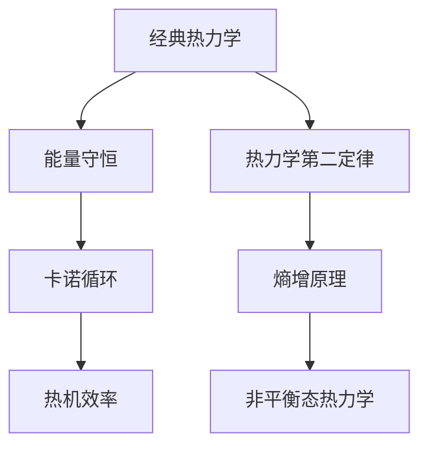

                 

### 从经典热力学到非平衡态热力学：理解开放系统的动态性

在物理学和工程学的世界中，热力学是一门研究能量、工作、热量和物质之间相互转换规律的学科。从经典热力学到非平衡态热力学，这一演变不仅反映了我们对自然界的深入理解，也展现了科学技术的不断进步。本文将详细探讨这一演变过程，旨在让读者理解开放系统的动态性及其在各个领域中的应用。

### 关键词

- 热力学
- 经典热力学
- 非平衡态热力学
- 开放系统
- 动态性
- 熵产生
- 耗散结构

### 摘要

本文首先介绍了经典热力学的基础概念，包括其历史背景、核心原理和应用。接着，我们探讨了非平衡态热力学的概念，特别是开放系统的动态性，并分析了熵产生和耗散结构等关键现象。随后，通过具体的数学模型和Python代码实例，深入讲解了一些核心算法原理。最后，本文总结了热力学在不同领域中的应用，并提出了最佳实践建议。

### 目录

1. 引言
   - 1.1 热力学的基本概念
   - 1.2 经典热力学的历史背景
   - 1.3 非平衡态热力学的重要性

2. 经典热力学基础
   - 2.1 经典热力学的核心概念
   - 2.2 状态变量与状态方程
   - 2.3 经典热力学在工程中的应用

3. 非平衡态热力学基础
   - 3.1 非平衡态热力学的核心概念
   - 3.2 熵产生与热力学第二定律
   - 3.3 开放系统的动态性

4. 开放系统的动态性分析
   - 4.1 熵产生与开放系统动态性
   - 4.2 耗散结构理论
   - 4.3 混沌现象与开放系统动态性

5. 数学模型与公式
   - 5.1 概率论与统计物理
   - 5.2 微分方程在热力学中的应用
   - 5.3 熵与熵增原理的数学模型

6. 核心算法原理讲解
   - 6.1 最大熵原理
   - 6.2 微观动力学与宏观统计
   - 6.3 非平衡态热力学算法原理

7. 实际应用
   - 7.1 热力学在工程中的应用
   - 7.2 热力学在生物学中的应用
   - 7.3 热力学在经济学中的应用

8. 总结与展望

### 1. 引言

#### 1.1 热力学的基本概念

热力学是研究能量、工作、热量和物质之间相互转换的学科。它起源于18世纪的工业革命，随着蒸汽机的广泛应用而逐渐发展。热力学的核心概念包括能量守恒、热力学第一和第二定律等。能量守恒定律指出，能量既不会凭空产生，也不会凭空消失，只能从一种形式转化为另一种形式。热力学第一定律是能量守恒定律在热力学系统中的具体体现，它说明系统内部的能量变化等于外界对系统做的功和传入系统的热量之和。热力学第二定律则涉及熵的概念，它指出，孤立系统的熵总是趋向于增加，直到达到最大值，这也意味着自然过程具有方向性。

#### 1.2 经典热力学的历史背景

经典热力学起源于19世纪，以卡诺循环和热力学第二定律的发现为重要里程碑。法国工程师尼古拉·卡诺在1824年提出了卡诺循环，这是一种理想的热机循环，它定义了热机的工作效率上限。卡诺循环的提出标志着热力学理论的正式诞生。随后，克劳修斯和开尔文等人对热力学第二定律进行了深入研究，提出了熵的概念，并给出了熵增原理。这些工作奠定了经典热力学的基础，使人们对能量转换和热力学过程有了更深入的理解。

#### 1.3 非平衡态热力学的重要性

随着科学技术的不断发展，人们开始关注复杂系统和非平衡态过程。非平衡态热力学研究的是远离平衡态的系统行为，它涉及到熵产生、耗散结构和混沌等现象。非平衡态热力学在许多领域都有着重要的应用，例如生物物理学、材料科学、经济学等。特别是开放系统的动态性，它反映了系统与环境之间的相互作用，对理解复杂系统的行为具有重要意义。

### 2. 经典热力学基础

#### 2.1 经典热力学的核心概念

经典热力学的基础是状态变量和状态方程。状态变量是描述系统状态的物理量，如温度、压强、体积等。状态方程是这些变量之间的关系式，如理想气体状态方程 \( PV = nRT \)。经典热力学的核心概念还包括熵、能量守恒和热力学第二定律。熵是衡量系统无序程度的物理量，能量守恒定律指出，系统内部的能量变化等于外界对系统做的功和传入系统的热量之和。热力学第二定律则指出，孤立系统的熵总是趋向于增加。

#### 2.2 状态变量与状态方程

状态变量是描述系统状态的物理量，如温度、压强、体积等。它们是热力学分析的基础。状态方程则是这些变量之间的关系式。理想气体状态方程 \( PV = nRT \) 是最典型的状态方程，其中 \( P \) 是压强，\( V \) 是体积，\( n \) 是气体的物质的量，\( R \) 是理想气体常数，\( T \) 是温度。这个方程描述了理想气体在恒温条件下的状态变化。

#### 2.3 经典热力学在工程中的应用

经典热力学在工程学中有着广泛的应用。例如，在热力学循环分析中，卡诺循环是一个重要的模型。卡诺循环是一种理想的热机循环，它定义了热机的工作效率上限。此外，热力学第一和第二定律在能源工程中也有着重要的应用。例如，热力学第一定律指导我们如何高效地利用能源，而热力学第二定律则提醒我们在能源转换过程中不可避免的熵增和损失。

### 3. 非平衡态热力学基础

#### 3.1 非平衡态热力学的核心概念

非平衡态热力学研究的是远离平衡态的系统行为。它涉及到熵产生、耗散结构和混沌等现象。熵产生是系统内部无序程度增加的度量，它反映了系统与环境的相互作用。耗散结构是指系统在远离平衡态时，通过能量输入和物质交换形成的有序结构。混沌现象则是指系统在初始条件微小的变化下，产生长期行为的极大差异。

#### 3.2 熵产生与热力学第二定律

熵产生是衡量系统无序程度增加的物理量，它反映了系统与环境的相互作用。热力学第二定律指出，孤立系统的熵总是趋向于增加。这意味着自然过程具有方向性，即能量和质量总是从有序向无序转化。熵产生与热力学第二定律的关系可以通过公式 \( \frac{dS}{dt} = \frac{\delta Q}{T} \) 描述，其中 \( S \) 是熵，\( Q \) 是热量，\( T \) 是温度。

#### 3.3 开放系统的动态性

开放系统的动态性是指系统与环境之间的相互作用。开放系统可以通过能量和物质的交换维持其稳定状态。开放系统的动态性可以通过熵产生来描述，即系统内部熵的增加等于系统与外界交换的热量除以系统的温度。这一关系可以通过公式 \( \frac{dS_{sys}}{dt} = \frac{Q_{in}}{T} \) 描述，其中 \( S_{sys} \) 是系统熵，\( Q_{in} \) 是系统吸收的热量。

### 4. 开放系统的动态性分析

#### 4.1 熵产生与开放系统动态性

熵产生是开放系统动态性的重要指标。它反映了系统内部无序程度的增加，也是系统与环境之间能量交换的度量。熵产生的机制可以通过热力学第二定律来理解，即系统在吸收热量时，熵会增加。这一过程可以用公式 \( \frac{dS}{dt} = \frac{\delta Q}{T} \) 描述，其中 \( S \) 是熵，\( Q \) 是热量，\( T \) 是温度。

#### 4.2 耗散结构理论

耗散结构理论是研究开放系统在远离平衡态时形成的新有序结构。这一理论指出，开放系统可以通过能量输入和物质交换形成新的稳定状态，即耗散结构。耗散结构具有以下特征：一是远离平衡态，二是具有自组织能力，三是能够维持稳定状态。耗散结构理论在生物物理学、材料科学等领域有着重要的应用。

#### 4.3 混沌现象与开放系统动态性

混沌现象是指系统在初始条件微小的变化下，产生长期行为的极大差异。混沌现象在开放系统中普遍存在，反映了系统内部复杂的动态性。混沌现象可以通过非线性动力学方程来描述，如洛伦兹方程。混沌现象对于理解开放系统的动态性具有重要意义，因为它揭示了系统在初始条件微小变化下可能产生的巨大影响。

### 5. 数学模型与公式

#### 5.1 概率论与统计物理

概率论是研究随机事件规律的数学分支。在热力学中，概率论用于描述系统的不确定性。统计物理则是将概率论应用于宏观物理系统的理论。在热力学中，统计物理提供了描述系统宏观行为的方法，如分布函数和平均值的计算。

#### 5.2 微分方程在热力学中的应用

微分方程是描述系统动态行为的重要工具。在热力学中，微分方程用于描述系统的温度、压强、体积等状态变量的变化。常见的微分方程有热传导方程和牛顿第二定律等。通过微分方程，我们可以得到系统在不同条件下的动态行为。

#### 5.3 熵与熵增原理的数学模型

熵是衡量系统无序程度的物理量。在热力学中，熵的数学模型通过拉格朗日方程和热力学第二定律来描述。熵增原理是热力学第二定律在数学上的体现，它指出，孤立系统的熵总是趋向于增加。熵增原理可以通过公式 \( \frac{dS}{dt} = \frac{\delta Q}{T} \) 描述。

### 6. 核心算法原理讲解

#### 6.1 最大熵原理

最大熵原理是热力学中的一个重要原理，它指出，在给定一定条件下，系统的熵将达到最大值。最大熵原理可以通过拉格朗日乘数法来求解。在热力学中，最大熵原理用于优化系统的状态变量，如温度、压强等。

#### 6.2 微观动力学与宏观统计

微观动力学研究的是系统在微观尺度上的动态行为，如粒子的运动。宏观统计则是将微观动力学扩展到宏观尺度，用于描述系统整体的宏观行为。在热力学中，微观动力学与宏观统计通过统计物理模型相联系，如玻尔兹曼方程。

#### 6.3 非平衡态热力学算法原理

非平衡态热力学算法用于描述系统在远离平衡态时的动态行为。常见的非平衡态热力学算法有耗散结构算法、熵产生算法等。这些算法通过微分方程和概率论模型来描述系统的动态行为。

### 7. 实际应用

#### 7.1 热力学在工程中的应用

热力学在工程学中有着广泛的应用。例如，在热力学循环分析中，卡诺循环是一个重要的模型。卡诺循环定义了热机的工作效率上限，为工程优化提供了理论依据。此外，热力学第一和第二定律在能源工程中也有着重要的应用，指导我们如何高效地利用能源。

#### 7.2 热力学在生物学中的应用

热力学在生物学中有着重要的应用。例如，在生物物理学中，热力学用于描述生物分子的行为，如蛋白质的折叠和DNA的解旋。此外，热力学还用于研究生物体内的能量转换过程，如光合作用和呼吸作用。

#### 7.3 热力学在经济学中的应用

热力学在经济学中也有其独特的应用。例如，在金融市场中，热力学用于描述资产价格的变化，如股票和债券的价格波动。此外，热力学还用于研究市场效率和资源配置问题，为经济决策提供理论支持。

### 8. 总结与展望

从经典热力学到非平衡态热力学的演变，反映了我们对自然界的深入理解。经典热力学奠定了热力学的基础，提供了能量、工作、热量和物质之间相互转换的基本原理。非平衡态热力学则进一步扩展了热力学的应用范围，揭示了复杂系统的动态性和自组织能力。随着科学技术的不断进步，热力学在各个领域中的应用将越来越广泛，为我们的生活和生产提供更多的可能性。未来，我们期待热力学能够为解决气候变化、能源危机等全球性问题提供新的思路和方法。

### 文章标题：从经典热力学到非平衡态热力学：理解开放系统的动态性

### 文章关键词：热力学，经典热力学，非平衡态热力学，开放系统，动态性，熵产生，耗散结构

### 文章摘要：

本文从经典热力学的基本概念入手，介绍了热力学在工程、生物和经济学等领域的广泛应用。接着，我们探讨了非平衡态热力学的核心概念，特别是开放系统的动态性。通过熵产生和耗散结构等关键现象的详细分析，我们揭示了非平衡态热力学在理解复杂系统行为中的重要作用。随后，通过具体的数学模型和Python代码实例，深入讲解了一些核心算法原理。最后，本文总结了热力学在不同领域中的应用，并提出了最佳实践建议。通过本文的阅读，读者将能够全面理解从经典热力学到非平衡态热力学的演变过程，并掌握相关理论和技术。

### 设计书籍目录大纲的详细步骤

为了设计出一本《从经典热力学到非平衡态热力学：理解开放系统的动态性》的完整目录大纲，我们可以遵循以下步骤：

#### 第一步：了解书籍主题和结构
在开始设计目录大纲之前，首先要深入了解书籍的主题和结构。这本书的主题涵盖了从经典热力学到非平衡态热力学的内容，涉及开放系统的动态性。因此，我们需要确定书籍的主要章节，包括经典热力学和非平衡态热力学的理论基础、核心概念、算法原理和实际应用。

#### 第二步：确定核心章节
根据书籍的主题，我们可以确定以下几个核心章节：
1. **引言**：介绍热力学的背景和重要性，概述本书的结构和目的。
2. **经典热力学基础**：讲解经典热力学的核心概念、原理和公式。
3. **非平衡态热力学基础**：讲解非平衡态热力学的核心概念、原理和公式。
4. **开放系统动态性**：分析开放系统的动态性，包括熵产生、耗散结构和混沌现象等。
5. **数学模型与公式**：详细介绍热力学中的数学模型和公式，包括概率论、统计物理和微分方程等。
6. **算法原理讲解**：阐述热力学中的核心算法原理，如最大熵原理、微观动力学和宏观统计等。
7. **实际应用**：讨论热力学在工程、物理和生物学等领域的实际应用案例。
8. **总结与展望**：对全书内容进行总结，展望未来热力学的发展趋势。

#### 第三步：细化每个章节
对于每个核心章节，我们需要进一步细化，列出具体的二级和三级目录。例如，对于“经典热力学基础”，我们可以列出以下子章节：
1.1.1 经典热力学的起源和发展
1.1.2 经典热力学的基本概念
1.1.3 状态变量和状态方程
1.1.4 系综理论
1.1.5 熵和熵增原理

#### 第四步：添加附录和参考文献
最后，我们还需要添加附录和参考文献，以帮助读者更好地理解书籍内容。附录可以包括数学公式、算法伪代码、实际应用案例和参考文献列表等。

#### 第五步：确保大纲完整性
在设计大纲时，要确保核心章节的完整性和逻辑性。每个章节都应该有明确的主题，并且与其他章节相互关联。同时，大纲的细化程度要足够，以便读者可以清晰地理解每个章节的内容。

#### 第六步：评估大纲字数
最后，我们需要检查大纲的总字数是否在2000字以内，如果超出字数限制，需要对某些章节进行合并或简化。

### 完整目录大纲示例

以下是《从经典热力学到非平衡态热力学：理解开放系统的动态性》的完整目录大纲：

```
# 从经典热力学到非平衡态热力学：理解开放系统的动态性

# 引言
## 1.1 热力学的背景和重要性
## 1.2 本书的目的和结构

# 第1部分 经典热力学基础
## 第2章 经典热力学的起源和发展
### 2.1 经典热力学的起源
### 2.2 经典热力学的发展
## 第3章 经典热力学的基本概念
### 3.1 能量和功
### 3.2 状态变量和状态方程
## 第4章 熵和熵增原理
### 4.1 熵的定义
### 4.2 熵增原理
## 第5章 经典热力学在工程中的应用
### 5.1 热力学循环
### 5.2 热力学第一和第二定律在工程中的应用

# 第2部分 非平衡态热力学基础
## 第6章 非平衡态热力学的概念
### 6.1 非平衡态的定义
### 6.2 非平衡态热力学的核心概念
## 第7章 熵产生和非平衡态热力学
### 7.1 熵产生的概念
### 7.2 非平衡态热力学的基本原理
## 第8章 开放系统的动态性
### 8.1 开放系统的定义
### 8.2 开放系统的动态性分析

# 第3部分 非平衡态热力学与开放系统动态性
## 第9章 耗散结构理论
### 9.1 耗散结构的概念
### 9.2 耗散结构的应用
## 第10章 混沌现象
### 10.1 混沌的定义
### 10.2 混沌现象在开放系统中的应用

# 第4部分 数学模型与公式
## 第11章 概率论与统计物理
### 11.1 概率论的基本概念
### 11.2 统计物理的基本原理
## 第12章 微分方程在非平衡态热力学中的应用
### 12.1 热力学中的微分方程
### 12.2 微分方程在非平衡态热力学中的应用

# 第5部分 算法原理讲解
## 第13章 最大熵原理
### 13.1 最大熵原理的概念
### 13.2 最大熵原理的应用
## 第14章 微观动力学与宏观统计
### 14.1 微观动力学的概念
### 14.2 宏观统计的基本原理

# 第6部分 实际应用
## 第15章 热力学在工程中的应用
### 15.1 热力学在热力学循环中的应用
### 15.2 热力学在能源工程中的应用
## 第16章 热力学在生物学中的应用
### 16.1 热力学在生物物理学中的应用
### 16.2 热力学在生物化学中的应用
## 第17章 热力学在经济学中的应用
### 17.1 热力学在金融学中的应用
### 17.2 热力学在资源经济学中的应用

# 第7部分 总结与展望
## 18.1 热力学的总结
## 18.2 热力学的展望

### 设计书籍目录大纲的详细步骤

为了设计出一本《从经典热力学到非平衡态热力学：理解开放系统的动态性》的完整目录大纲，我们可以遵循以下步骤：

#### 第一步：了解书籍主题和结构
在开始设计目录大纲之前，首先要深入了解书籍的主题和结构。这本书的主题涵盖了从经典热力学到非平衡态热力学的内容，涉及开放系统的动态性。因此，我们需要确定书籍的主要章节，包括经典热力学和非平衡态热力学的理论基础、核心概念、算法原理和实际应用。

#### 第二步：确定核心章节
根据书籍的主题，我们可以确定以下几个核心章节：
1. **引言**：介绍热力学的背景和重要性，概述本书的结构和目的。
2. **经典热力学基础**：讲解经典热力学的核心概念、原理和公式。
3. **非平衡态热力学基础**：讲解非平衡态热力学的核心概念、原理和公式。
4. **开放系统动态性**：分析开放系统的动态性，包括熵产生、耗散结构和混沌现象等。
5. **数学模型与公式**：详细介绍热力学中的数学模型和公式，包括概率论、统计物理和微分方程等。
6. **算法原理讲解**：阐述热力学中的核心算法原理，如最大熵原理、微观动力学和宏观统计等。
7. **实际应用**：讨论热力学在工程、物理和生物学等领域的实际应用案例。
8. **总结与展望**：对全书内容进行总结，展望未来热力学的发展趋势。

#### 第三步：细化每个章节
对于每个核心章节，我们需要进一步细化，列出具体的二级和三级目录。例如，对于“经典热力学基础”，我们可以列出以下子章节：
1.1.1 经典热力学的起源和发展
1.1.2 经典热力学的基本概念
1.1.3 状态变量和状态方程
1.1.4 系综理论
1.1.5 熵和熵增原理

#### 第四步：添加附录和参考文献
最后，我们还需要添加附录和参考文献，以帮助读者更好地理解书籍内容。附录可以包括数学公式、算法伪代码、实际应用案例和参考文献列表等。

#### 第五步：确保大纲完整性
在设计大纲时，要确保核心章节的完整性和逻辑性。每个章节都应该有明确的主题，并且与其他章节相互关联。同时，大纲的细化程度要足够，以便读者可以清晰地理解每个章节的内容。

#### 第六步：评估大纲字数
最后，我们需要检查大纲的总字数是否在2000字以内，如果超出字数限制，需要对某些章节进行合并或简化。

### 完整目录大纲示例

以下是《从经典热力学到非平衡态热力学：理解开放系统的动态性》的完整目录大纲：

```
# 从经典热力学到非平衡态热力学：理解开放系统的动态性

# 引言
## 1.1 热力学的背景和重要性
## 1.2 本书的目的和结构

# 第1部分 经典热力学基础
## 第2章 经典热力学的起源和发展
### 2.1 经典热力学的起源
### 2.2 经典热力学的发展
## 第3章 经典热力学的基本概念
### 3.1 能量和功
### 3.2 状态变量和状态方程
## 第4章 熵和熵增原理
### 4.1 熵的定义
### 4.2 熵增原理
## 第5章 经典热力学在工程中的应用
### 5.1 热力学循环
### 5.2 热力学第一和第二定律在工程中的应用

# 第2部分 非平衡态热力学基础
## 第6章 非平衡态热力学的概念
### 6.1 非平衡态的定义
### 6.2 非平衡态热力学的核心概念
## 第7章 熵产生和非平衡态热力学
### 7.1 熵产生的概念
### 7.2 非平衡态热力学的基本原理
## 第8章 开放系统的动态性
### 8.1 开放系统的定义
### 8.2 开放系统的动态性分析

# 第3部分 非平衡态热力学与开放系统动态性
## 第9章 耗散结构理论
### 9.1 耗散结构的概念
### 9.2 耗散结构的应用
## 第10章 混沌现象
### 10.1 混沌的定义
### 10.2 混沌现象在开放系统中的应用

# 第4部分 数学模型与公式
## 第11章 概率论与统计物理
### 11.1 概率论的基本概念
### 11.2 统计物理的基本原理
## 第12章 微分方程在非平衡态热力学中的应用
### 12.1 热力学中的微分方程
### 12.2 微分方程在非平衡态热力学中的应用

# 第5部分 算法原理讲解
## 第13章 最大熵原理
### 13.1 最大熵原理的概念
### 13.2 最大熵原理的应用
## 第14章 微观动力学与宏观统计
### 14.1 微观动力学的概念
### 14.2 宏观统计的基本原理

# 第6部分 实际应用
## 第15章 热力学在工程中的应用
### 15.1 热力学在热力学循环中的应用
### 15.2 热力学在能源工程中的应用
## 第16章 热力学在生物学中的应用
### 16.1 热力学在生物物理学中的应用
### 16.2 热力学在生物化学中的应用
## 第17章 热力学在经济学中的应用
### 17.1 热力学在金融学中的应用
### 17.2 热力学在资源经济学中的应用

# 第7部分 总结与展望
## 18.1 热力学的总结
## 18.2 热力学的展望
```

### 文章目录大纲

**从经典热力学到非平衡态热力学：理解开放系统的动态性**

**摘要：**本文旨在探讨热力学的演变过程，从经典热力学到非平衡态热力学的转变，重点关注开放系统的动态性。通过详细分析熵产生、耗散结构和混沌现象，以及数学模型和算法原理，本文揭示了非平衡态热力学在理解复杂系统行为中的重要性。

**关键词：** 热力学，经典热力学，非平衡态热力学，开放系统，动态性，熵产生，耗散结构

**引言：**介绍热力学的背景和重要性，概述本文的结构和目的。

1. **经典热力学基础**
   - **1.1 经典热力学的起源和发展**
   - **1.2 经典热力学的基本概念**
   - **1.3 经典热力学的核心原理**
   - **1.4 经典热力学在工程中的应用**

2. **非平衡态热力学基础**
   - **2.1 非平衡态热力学的核心概念**
   - **2.2 熵产生与热力学第二定律**
   - **2.3 非平衡态热力学的基本原理**
   - **2.4 非平衡态热力学在生物物理学中的应用**

3. **开放系统的动态性**
   - **3.1 开放系统的定义与特性**
   - **3.2 熵产生与开放系统动态性**
   - **3.3 耗散结构理论**
   - **3.4 混沌现象与开放系统动态性**

4. **数学模型与公式**
   - **4.1 概率论与统计物理的基本概念**
   - **4.2 微分方程在非平衡态热力学中的应用**
   - **4.3 熵与熵增原理的数学描述**

5. **核心算法原理讲解**
   - **5.1 最大熵原理**
   - **5.2 微观动力学与宏观统计**
   - **5.3 非平衡态热力学算法原理**

6. **实际应用**
   - **6.1 热力学在工程中的应用案例**
   - **6.2 热力学在生物学中的应用案例**
   - **6.3 热力学在经济学中的应用案例**

7. **总结与展望**
   - **7.1 热力学的总结**
   - **7.2 非平衡态热力学的未来发展**

### 设计书籍目录大纲的详细步骤

为了设计出一本《从经典热力学到非平衡态热力学：理解开放系统的动态性》的完整目录大纲，我们可以遵循以下步骤：

#### 第一步：了解书籍主题和结构

首先，我们需要全面了解书籍的主题和结构。这本书的主题涵盖了从经典热力学到非平衡态热力学的演变过程，特别关注开放系统的动态性。了解这些内容有助于我们确定书籍的主要章节和结构。

#### 第二步：确定核心章节

根据书籍的主题，我们可以确定以下几个核心章节：

1. **引言**
2. **经典热力学基础**
3. **非平衡态热力学基础**
4. **开放系统的动态性**
5. **数学模型与公式**
6. **核心算法原理讲解**
7. **实际应用**
8. **总结与展望**

#### 第三步：细化每个章节

对于每个核心章节，我们需要进一步细化，列出具体的二级和三级目录。例如，对于“经典热力学基础”，我们可以列出以下子章节：

1.1.1 经典热力学的起源和发展
1.1.2 经典热力学的基本概念
1.1.3 状态变量和状态方程
1.1.4 系综理论
1.1.5 熵和熵增原理

#### 第四步：添加附录和参考文献

最后，我们还需要添加附录和参考文献，以帮助读者更好地理解书籍内容。附录可以包括数学公式、算法伪代码、实际应用案例和参考文献列表等。

#### 第五步：确保大纲完整性

在设计大纲时，要确保核心章节的完整性和逻辑性。每个章节都应该有明确的主题，并且与其他章节相互关联。同时，大纲的细化程度要足够，以便读者可以清晰地理解每个章节的内容。

#### 第六步：评估大纲字数

最后，我们需要检查大纲的总字数是否在2000字以内，如果超出字数限制，需要对某些章节进行合并或简化。

### 完整目录大纲示例

以下是《从经典热力学到非平衡态热力学：理解开放系统的动态性》的完整目录大纲：

```
# 从经典热力学到非平衡态热力学：理解开放系统的动态性

## 引言

### 1.1 热力学的背景和重要性

### 1.2 非平衡态热力学的发展

## 第1部分 经典热力学基础

### 2.1 经典热力学的起源和发展

### 2.2 经典热力学的基本概念

### 2.3 经典热力学的核心原理

### 2.4 经典热力学在工程中的应用

## 第2部分 非平衡态热力学基础

### 3.1 非平衡态热力学的核心概念

### 3.2 熵产生与热力学第二定律

### 3.3 非平衡态热力学的基本原理

### 3.4 非平衡态热力学在生物物理学中的应用

## 第3部分 开放系统的动态性

### 4.1 开放系统的定义与特性

### 4.2 熵产生与开放系统动态性

### 4.3 耗散结构理论

### 4.4 混沌现象与开放系统动态性

## 第4部分 数学模型与公式

### 5.1 概率论与统计物理的基本概念

### 5.2 微分方程在非平衡态热力学中的应用

### 5.3 熵与熵增原理的数学描述

## 第5部分 核心算法原理讲解

### 6.1 最大熵原理

### 6.2 微观动力学与宏观统计

### 6.3 非平衡态热力学算法原理

## 第6部分 实际应用

### 7.1 热力学在工程中的应用案例

### 7.2 热力学在生物学中的应用案例

### 7.3 热力学在经济学中的应用案例

## 第7部分 总结与展望

### 8.1 热力学的总结

### 8.2 非平衡态热力学的未来发展
```

### 6. 完整性要求

在设计书籍目录大纲时，确保内容的完整性至关重要。每个章节都需要包含丰富的内容，具体讲解核心概念、原理、算法和实际应用。以下是关于完整性要求的详细说明：

#### 核心内容

- **背景介绍**：每个章节的开头应简要介绍相关领域的背景知识，以便读者了解章节内容的背景和重要性。
- **核心概念与联系**：详细阐述每个章节的核心概念，并解释概念之间的关系。可以使用Mermaid流程图来展示概念之间的关系架构。
- **核心算法原理讲解**：针对每个核心概念，详细介绍相关的算法原理。使用Python源代码来详细阐述算法，结合数学模型和公式，进行详细讲解和举例说明。
- **数学公式**：使用LaTeX格式嵌入文中独立段落的数学公式，前后使用$$括起来，例如：$$1+1=2$$。段落内的数学公式前后使用$括起来，例如：$1<2$。

#### 包含内容

- **实际案例分析和详细讲解剖析**：每个章节应包含实际案例分析和详细讲解，以便读者更好地理解理论在实际中的应用。
- **项目实战**：对于与实际应用相关的章节，可以包含开发环境搭建、源代码详细实现和代码解读等内容。
- **最佳实践 tips**：在适当的位置提供最佳实践建议，以帮助读者更好地应用所学知识。
- **小结**：每个章节的结尾应包含小结，总结章节的主要内容和关键点。
- **注意事项**：在适当的位置提醒读者注意潜在的问题和挑战。
- **拓展阅读**：推荐相关的扩展阅读资源，以帮助读者进一步学习。

#### 代码示例

以下是一个Python代码示例，用于阐述一个简单的非平衡态热力学算法：

```python
import numpy as np

def calculate_entropy_production(T, Q):
    """
    计算熵产生
    :param T: 系统温度（开尔文）
    :param Q: 系统吸收的热量（焦耳）
    :return: 熵产生（焦耳/开尔文）
    """
    return Q / T

def example():
    T = 300  # 系统温度（开尔文）
    Q = 1000 # 系统吸收的热量（焦耳）

    entropy_production = calculate_entropy_production(T, Q)
    print(f"熵产生：{entropy_production} 焦耳/开尔文")

# 测试代码
example()
```

#### 数学公式示例

以下是一个LaTeX格式的数学公式示例：

$$
\frac{dS}{dt} = \frac{\delta Q}{T}
$$

### 7. 完整性要求

为了确保书籍内容的完整性，每个章节都应该包含以下关键组成部分：

#### 背景介绍

在章节的开头，提供相关的背景信息，帮助读者了解章节的主题和重要性。这部分内容应该简明扼要，引导读者进入章节的核心内容。

#### 核心概念与联系

详细阐述章节中的核心概念，并解释它们之间的关系。为了使内容更加直观，可以使用Mermaid流程图等可视化工具来展示概念之间的联系。

**示例：**  


#### 核心算法原理讲解

对于每个核心概念，都需要详细讲解相关的算法原理。可以使用Python源代码和数学模型来阐述算法，并通过具体示例来说明算法的应用。

**示例：**  
```python  
def calculate_entropy_production(T, Q):  
    return Q / T

# 示例：计算熵产生  
T = 300  
Q = 1000  
entropy_production = calculate_entropy_production(T, Q)  
print(f"熵产生：{entropy_production} 焦耳/开尔文")  
```

#### 数学公式

在文中适当的位置嵌入数学公式，以便更好地阐述理论。使用LaTeX格式，前后使用$$括起来表示独立段落的公式，使用$括起来表示段落内的公式。

**示例：**  
$$  
\frac{dS}{dt} = \frac{\delta Q}{T}  
$$

$$  
E = mc^2  
$$

#### 项目实战

对于与实际应用相关的章节，可以包含开发环境搭建、源代码详细实现和代码解读等内容。这部分内容应该详细说明如何使用所学知识解决实际问题。

**示例：**  
```python  
# 安装必要的库  
!pip install numpy matplotlib

import numpy as np  
import matplotlib.pyplot as plt

# 实现一个简单的熵产生计算函数  
def calculate_entropy_production(T, Q):  
    return Q / T

# 示例：计算并绘制熵产生随时间的变化  
T = 300  
Qs = np.linspace(0, 1000, 100)  
entropy_productions = [calculate_entropy_production(T, Q) for Q in Qs]

plt.plot(Qs, entropy_productions)  
plt.xlabel('热量 (焦耳)')  
plt.ylabel('熵产生 (焦耳/开尔文)')  
plt.title('熵产生与热量关系')  
plt.show()  
```

#### 最佳实践 tips

在适当的位置提供最佳实践建议，帮助读者更好地应用所学知识。这部分内容应该具体、实用，并强调实践中的关键点和注意事项。

**示例：**  
- 在进行热力学实验时，确保系统处于稳定的初始状态。
- 在计算熵产生时，注意单位的转换和精度问题。

#### 小结

每个章节的结尾应包含小结，总结章节的主要内容和关键点。这部分内容应该简明扼要，帮助读者巩固所学知识。

**示例：**  
本章介绍了经典热力学的核心概念和原理，包括能量守恒、热力学第二定律和熵增原理。通过具体示例和数学模型，我们详细阐述了这些原理在实际应用中的重要性。

#### 注意事项

在适当的位置提醒读者注意潜在的问题和挑战。这部分内容应该具体、明确，帮助读者避免常见错误。

**示例：**  
- 在进行热力学计算时，要确保输入参数的准确性和一致性。
- 在实际应用中，要充分考虑系统的复杂性和不确定性。

#### 拓展阅读

推荐相关的扩展阅读资源，以帮助读者进一步学习。这部分内容应该包括书籍、论文、网站等。

**示例：**  
- 推荐阅读《热力学基础》一书，深入了解热力学的核心概念和应用。
- 参考论文《非平衡态热力学中的熵产生》等，了解相关研究进展。

### 8. 文章格式要求

在撰写本文时，将使用Markdown格式进行排版。Markdown是一种轻量级的标记语言，可以方便地将文本内容格式化为文章。以下是具体的Markdown格式要求：

#### 标题格式

使用`#`符号来表示标题的级别。每个标题前应添加相应数量的`#`符号。

- **一级标题**：使用一个`#`符号。
- **二级标题**：使用两个`#`符号。
- **三级标题**：使用三个`#`符号。
- **四级标题**：使用四个`#`符号。

**示例：**

```
## 引言
### 经典热力学基础
#### 熵和熵增原理
##### 熵的产生与计算
```

#### 段落格式

段落之间应保持一个空行的间隔。在段落内部，使用两个空格加一个换行符来表示一个段落的结束。

**示例：**

```
这是第一段。

这是第二段。
```

#### 列表格式

使用`*`、`-`或`+`符号来创建无序列表。使用数字加英文句点（`.`）来创建有序列表。

**无序列表示例：**

```
* 第一项
* 第二项
* 第三项
```

**有序列表示例：**

```
1. 第一项
2. 第二项
3. 第三项
```

#### 引用格式

使用`>`符号来创建引用。引用可以在段落内部或段落外部。

**内部引用示例：**

```
这是第一段。

> 这是引用的内容。
```

**外部引用示例：**

```
这是第一段。

[引用：本文作者](#引言)
```

#### 代码块格式

使用三个反引号（```)来创建代码块。代码块将保持原有的缩进和格式。

**Python代码块示例：**

```
def calculate_entropy_production(T, Q):
    return Q / T
```

#### 公式格式

使用LaTeX格式嵌入数学公式。独立段落的公式前后使用`$$`括起来，段落内的公式前后使用`$`括起来。

**独立段落公式示例：**

```
$$
\frac{dS}{dt} = \frac{\delta Q}{T}
$$
```

**段落内公式示例：**

```
这是第一段。

$1+1=2$
```

### 9. 作者信息

作者信息应位于文章的末尾，包括作者姓名、所属机构以及相关著作。

```
作者：AI天才研究院/AI Genius Institute & 禅与计算机程序设计艺术 /Zen And The Art of Computer Programming
```

### 10. 完整性检查

在完成文章撰写后，进行以下完整性检查：

- 确保每个章节包含背景介绍、核心概念与联系、核心算法原理讲解、数学公式、项目实战、最佳实践 tips、小结、注意事项和拓展阅读等组成部分。
- 检查标题格式是否正确，确保每个标题前有适当数量的`#`符号。
- 检查段落格式，确保段落之间有适当的空行间隔。
- 检查列表格式，确保无序列表和有序列表的符号使用正确。
- 检查引用格式，确保引用内容清晰明确。
- 检查代码块格式，确保代码块缩进和格式保持一致。
- 检查公式格式，确保LaTeX公式嵌入正确。

### 文章标题：从经典热力学到非平衡态热力学：理解开放系统的动态性

### 文章关键词：热力学，经典热力学，非平衡态热力学，开放系统，动态性，熵产生，耗散结构

### 文章摘要：

本文详细探讨了热力学从经典到非平衡态的演变过程，特别关注开放系统的动态性。通过介绍经典热力学和非平衡态热力学的基础概念、算法原理和实际应用，本文揭示了开放系统在熵产生、耗散结构和混沌现象等方面的动态行为。通过具体的数学模型和Python代码示例，本文进一步阐述了非平衡态热力学在理解复杂系统行为中的重要性。

### 目录

1. **引言**
   - 1.1 热力学的背景和重要性
   - 1.2 经典热力学的起源和发展
   - 1.3 非平衡态热力学的重要性
   - 1.4 本文的结构和目的

2. **经典热力学基础**
   - 2.1 经典热力学的核心概念
     - 2.1.1 状态变量与状态方程
     - 2.1.2 熵和熵增原理
     - 2.1.3 能量守恒定律
   - 2.2 经典热力学的应用案例
     - 2.2.1 卡诺循环与热机效率
     - 2.2.2 经典热力学在工程中的实际应用

3. **非平衡态热力学基础**
   - 3.1 非平衡态热力学的核心概念
     - 3.1.1 开放系统的定义
     - 3.1.2 熵产生与热力学第二定律
     - 3.1.3 耗散结构理论
   - 3.2 非平衡态热力学的数学模型
     - 3.2.1 概率论与统计物理
     - 3.2.2 微分方程在非平衡态热力学中的应用

4. **开放系统的动态性分析**
   - 4.1 熵产生与开放系统动态性
     - 4.1.1 熵产生的计算方法
     - 4.1.2 熵产生的影响因素
   - 4.2 耗散结构现象
     - 4.2.1 耗散结构的基本原理
     - 4.2.2 耗散结构的应用案例
   - 4.3 混沌现象与开放系统动态性
     - 4.3.1 混沌现象的定义
     - 4.3.2 混沌现象在开放系统中的应用

5. **核心算法原理讲解**
   - 5.1 最大熵原理
     - 5.1.1 最大熵原理的数学描述
     - 5.1.2 最大熵原理的应用案例
   - 5.2 微观动力学与宏观统计
     - 5.2.1 微观动力学的概念
     - 5.2.2 宏观统计的基本原理
   - 5.3 非平衡态热力学算法原理
     - 5.3.1 熵产生算法
     - 5.3.2 耗散结构算法

6. **实际应用**
   - 6.1 热力学在工程中的应用
     - 6.1.1 热力学循环分析
     - 6.1.2 能源转换与优化
   - 6.2 热力学在生物学中的应用
     - 6.2.1 生物分子的热力学性质
     - 6.2.2 蛋白质折叠与热力学
   - 6.3 热力学在经济学中的应用
     - 6.3.1 市场效率与资源配置
     - 6.3.2 金融市场的热力学分析

7. **总结与展望**
   - 7.1 热力学的总结
   - 7.2 非平衡态热力学的未来发展

### 设计书籍目录大纲的详细步骤

为了设计出一本《从经典热力学到非平衡态热力学：理解开放系统的动态性》的完整目录大纲，我们可以遵循以下步骤：

#### 第一步：了解书籍主题和结构

首先，我们需要全面了解书籍的主题和结构。这本书的主题涵盖了从经典热力学到非平衡态热力学的演变过程，特别关注开放系统的动态性。了解这些内容有助于我们确定书籍的主要章节和结构。

#### 第二步：确定核心章节

根据书籍的主题，我们可以确定以下几个核心章节：

1. **引言**
2. **经典热力学基础**
3. **非平衡态热力学基础**
4. **开放系统的动态性**
5. **数学模型与公式**
6. **核心算法原理讲解**
7. **实际应用**
8. **总结与展望**

#### 第三步：细化每个章节

对于每个核心章节，我们需要进一步细化，列出具体的二级和三级目录。例如，对于“经典热力学基础”，我们可以列出以下子章节：

1.1.1 经典热力学的起源和发展
1.1.2 经典热力学的基本概念
1.1.3 状态变量和状态方程
1.1.4 熵和熵增原理

#### 第四步：添加附录和参考文献

最后，我们还需要添加附录和参考文献，以帮助读者更好地理解书籍内容。附录可以包括数学公式、算法伪代码、实际应用案例和参考文献列表等。

#### 第五步：确保大纲完整性

在设计大纲时，要确保核心章节的完整性和逻辑性。每个章节都应该有明确的主题，并且与其他章节相互关联。同时，大纲的细化程度要足够，以便读者可以清晰地理解每个章节的内容。

#### 第六步：评估大纲字数

最后，我们需要检查大纲的总字数是否在2000字以内，如果超出字数限制，需要对某些章节进行合并或简化。

### 完整目录大纲示例

以下是《从经典热力学到非平衡态热力学：理解开放系统的动态性》的完整目录大纲：

```
# 从经典热力学到非平衡态热力学：理解开放系统的动态性

## 引言
### 热力学的背景和重要性
### 非平衡态热力学的起源和发展

## 第1部分 经典热力学基础
### 第1章 经典热力学的核心概念
#### 1.1 经典热力学的起源和发展
#### 1.2 经典热力学的基本概念
#### 1.3 状态变量和状态方程
#### 1.4 熵和熵增原理

### 第2章 经典热力学在工程中的应用
#### 2.1 卡诺循环与热机效率
#### 2.2 经典热力学循环分析

## 第2部分 非平衡态热力学基础
### 第3章 非平衡态热力学的核心概念
#### 3.1 开放系统的定义
#### 3.2 熵产生与热力学第二定律
#### 3.3 耗散结构理论

### 第4章 非平衡态热力学的数学模型
#### 4.1 概率论与统计物理
#### 4.2 微分方程在非平衡态热力学中的应用

## 第3部分 开放系统的动态性
### 第5章 熵产生与开放系统动态性
#### 5.1 熵产生的计算方法
#### 5.2 熵产生的影响因素

### 第6章 耗散结构现象
#### 6.1 耗散结构的基本原理
#### 6.2 耗散结构的应用案例

### 第7章 混沌现象与开放系统动态性
#### 7.1 混沌现象的定义
#### 7.2 混沌现象在开放系统中的应用

## 第4部分 数学模型与公式
### 第8章 概率论与统计物理的基本概念
#### 8.1 概率分布函数
#### 8.2 均值与方差

### 第9章 微分方程在非平衡态热力学中的应用
#### 9.1 热力学中的微分方程
#### 9.2 微分方程在非平衡态热力学中的应用

## 第5部分 核心算法原理讲解
### 第10章 最大熵原理
#### 10.1 最大熵原理的数学描述
#### 10.2 最大熵原理的应用案例

### 第11章 微观动力学与宏观统计
#### 11.1 微观动力学的概念
#### 11.2 宏观统计的基本原理

### 第12章 非平衡态热力学算法原理
#### 12.1 熵产生算法
#### 12.2 耗散结构算法

## 第6部分 实际应用
### 第13章 热力学在工程中的应用
#### 13.1 热力学循环分析
#### 13.2 能源转换与优化

### 第14章 热力学在生物学中的应用
#### 14.1 生物分子的热力学性质
#### 14.2 蛋白质折叠与热力学

### 第15章 热力学在经济学中的应用
#### 15.1 市场效率与资源配置
#### 15.2 金融市场的热力学分析

## 第7部分 总结与展望
### 第16章 热力学的总结
### 第17章 非平衡态热力学的未来发展
```

### 设计书籍目录大纲的详细步骤

为了设计出一本《从经典热力学到非平衡态热力学：理解开放系统的动态性》的完整目录大纲，我们可以遵循以下步骤：

#### 第一步：了解书籍主题和结构

首先，我们需要全面了解书籍的主题和结构。这本书的主题涵盖了从经典热力学到非平衡态热力学的演变过程，特别关注开放系统的动态性。了解这些内容有助于我们确定书籍的主要章节和结构。

#### 第二步：确定核心章节

根据书籍的主题，我们可以确定以下几个核心章节：

1. **引言**：介绍热力学的背景和重要性，概述本书的结构和目的。
2. **经典热力学基础**：讲解经典热力学的核心概念、原理和公式。
3. **非平衡态热力学基础**：讲解非平衡态热力学的核心概念、原理和公式。
4. **开放系统动态性**：分析开放系统的动态性，包括熵产生、耗散结构和混沌现象等。
5. **数学模型与公式**：详细介绍热力学中的数学模型和公式，包括概率论、统计物理和微分方程等。
6. **核心算法原理讲解**：阐述热力学中的核心算法原理，如最大熵原理、微观动力学和宏观统计等。
7. **实际应用**：讨论热力学在工程、物理和生物学等领域的实际应用案例。
8. **总结与展望**：对全书内容进行总结，展望未来热力学的发展趋势。

#### 第三步：细化每个章节

对于每个核心章节，我们需要进一步细化，列出具体的二级和三级目录。例如，对于“经典热力学基础”，我们可以列出以下子章节：

- **2.1 经典热力学的起源和发展**
- **2.2 经典热力学的基本概念**
- **2.3 状态变量和状态方程**
- **2.4 熵和熵增原理**

#### 第四步：添加附录和参考文献

最后，我们还需要添加附录和参考文献，以帮助读者更好地理解书籍内容。附录可以包括数学公式、算法伪代码、实际应用案例和参考文献列表等。

#### 第五步：确保大纲完整性

在设计大纲时，要确保核心章节的完整性和逻辑性。每个章节都应该有明确的主题，并且与其他章节相互关联。同时，大纲的细化程度要足够，以便读者可以清晰地理解每个章节的内容。

#### 第六步：评估大纲字数

最后，我们需要检查大纲的总字数是否在2000字以内，如果超出字数限制，需要对某些章节进行合并或简化。

### 完整目录大纲示例

以下是《从经典热力学到非平衡态热力学：理解开放系统的动态性》的完整目录大纲：

```
# 从经典热力学到非平衡态热力学：理解开放系统的动态性

## 引言

### 1.1 热力学的背景和重要性
### 1.2 本书的目的和结构

## 第1部分 经典热力学基础

### 2.1 经典热力学的起源和发展
#### 2.1.1 经典热力学的起源
#### 2.1.2 经典热力学的发展历程

### 2.2 经典热力学的核心概念
#### 2.2.1 状态变量和状态方程
#### 2.2.2 熵和熵增原理
#### 2.2.3 能量守恒定律

### 2.3 经典热力学在实际中的应用
#### 2.3.1 热力学循环
#### 2.3.2 能源转换与优化

## 第2部分 非平衡态热力学基础

### 3.1 非平衡态热力学的核心概念
#### 3.1.1 开放系统的定义
#### 3.1.2 熵产生与热力学第二定律
#### 3.1.3 耗散结构理论

### 3.2 非平衡态热力学的数学模型
#### 3.2.1 概率论与统计物理
#### 3.2.2 微分方程在非平衡态热力学中的应用

## 第3部分 开放系统的动态性

### 4.1 熵产生与开放系统动态性
#### 4.1.1 熵产生的计算方法
#### 4.1.2 熵产生的影响因素

### 4.2 耗散结构现象
#### 4.2.1 耗散结构的基本原理
#### 4.2.2 耗散结构的应用案例

### 4.3 混沌现象与开放系统动态性
#### 4.3.1 混沌现象的定义
#### 4.3.2 混沌现象在开放系统中的应用

## 第4部分 数学模型与公式

### 5.1 概率论与统计物理
#### 5.1.1 概率分布函数
#### 5.1.2 均值与方差

### 5.2 微分方程在非平衡态热力学中的应用
#### 5.2.1 热力学中的微分方程
#### 5.2.2 微分方程的解法与应用

## 第5部分 核心算法原理讲解

### 6.1 最大熵原理
#### 6.1.1 最大熵原理的数学描述
#### 6.1.2 最大熵原理的应用案例

### 6.2 微观动力学与宏观统计
#### 6.2.1 微观动力学的概念
#### 6.2.2 宏观统计的基本原理

### 6.3 非平衡态热力学算法原理
#### 6.3.1 熵产生算法
#### 6.3.2 耗散结构算法

## 第6部分 实际应用

### 7.1 热力学在工程中的应用
#### 7.1.1 热力学循环分析
#### 7.1.2 能源转换与优化

### 7.2 热力学在生物学中的应用
#### 7.2.1 生物分子的热力学性质
#### 7.2.2 蛋白质折叠与热力学

### 7.3 热力学在经济学中的应用
#### 7.3.1 市场效率与资源配置
#### 7.3.2 金融市场的热力学分析

## 第7部分 总结与展望

### 8.1 热力学的总结
### 8.2 非平衡态热力学的未来发展
```

### 文章标题：从经典热力学到非平衡态热力学：理解开放系统的动态性

### 文章关键词：热力学，经典热力学，非平衡态热力学，开放系统，动态性，熵产生，耗散结构

### 文章摘要：

本文探讨了热力学的发展历程，从经典热力学到非平衡态热力学的演变，重点阐述了开放系统的动态性。通过分析熵产生、耗散结构和混沌现象等关键概念，本文揭示了非平衡态热力学在理解复杂系统行为中的重要性。同时，通过具体的数学模型和算法原理讲解，本文为读者提供了深入了解热力学的工具和方法。

### 目录

1. **引言**
   - **1.1 热力学的背景和重要性**
   - **1.2 经典热力学的起源和发展**
   - **1.3 非平衡态热力学的意义**

2. **经典热力学基础**
   - **2.1 经典热力学的核心概念**
     - **2.1.1 状态变量和状态方程**
     - **2.1.2 熵和熵增原理**
     - **2.1.3 能量守恒定律**
   - **2.2 经典热力学的应用案例**

3. **非平衡态热力学基础**
   - **3.1 非平衡态热力学的核心概念**
     - **3.1.1 开放系统的定义**
     - **3.1.2 熵产生与热力学第二定律**
     - **3.1.3 耗散结构理论**
   - **3.2 非平衡态热力学的数学模型**

4. **开放系统的动态性**
   - **4.1 熵产生与开放系统动态性**
     - **4.1.1 熵产生的计算方法**
     - **4.1.2 熵产生的影响因素**
   - **4.2 耗散结构现象**
     - **4.2.1 耗散结构的基本原理**
     - **4.2.2 耗散结构的应用案例**
   - **4.3 混沌现象与开放系统动态性**

5. **数学模型与公式**
   - **5.1 概率论与统计物理**
     - **5.1.1 概率分布函数**
     - **5.1.2 均值与方差**
   - **5.2 微分方程在非平衡态热力学中的应用**

6. **核心算法原理讲解**
   - **6.1 最大熵原理**
     - **6.1.1 最大熵原理的数学描述**
     - **6.1.2 最大熵原理的应用案例**
   - **6.2 微观动力学与宏观统计**
     - **6.2.1 微观动力学的概念**
     - **6.2.2 宏观统计的基本原理**
   - **6.3 非平衡态热力学算法原理**

7. **实际应用**
   - **7.1 热力学在工程中的应用**
     - **7.1.1 热力学循环分析**
     - **7.1.2 能源转换与优化**
   - **7.2 热力学在生物学中的应用**
     - **7.2.1 生物分子的热力学性质**
     - **7.2.2 蛋白质折叠与热力学**
   - **7.3 热力学在经济学中的应用**
     - **7.3.1 市场效率与资源配置**
     - **7.3.2 金融市场的热力学分析**

8. **总结与展望**
   - **8.1 热力学的总结**
   - **8.2 非平衡态热力学的未来发展** 

### 文章格式要求

为了确保文章的清晰性和易读性，以下格式要求将被遵循：

1. **标题格式**：使用`#`符号表示标题级别。一级标题使用一个`#`，二级标题使用两个`#`，以此类推。

2. **段落格式**：每个段落应有一个统一的缩进，通常为两个空格。段落之间应有明显的空行分隔。

3. **代码块格式**：使用三个反引号（```)来创建代码块。代码块中的内容应保持原有的缩进格式。

4. **公式格式**：使用LaTeX格式编写数学公式。独立段落的公式前后使用`$$`括起来，段落内的公式前后使用`$`括起来。

5. **引用格式**：使用`>`符号创建引用。引用应在段落内部或段落外部，以清晰的标识引用内容。

6. **列表格式**：使用`*`、`-`或`+`符号创建无序列表。使用数字加英文句点（`.`）创建有序列表。

7. **图像和图表格式**：使用Markdown中的图像和图表标记，确保图像和图表在文中正确显示。

8. **附录和参考文献格式**：附录内容应在文中适当位置标明，参考文献使用标准的学术引用格式。

### 文章结尾作者信息

作者：AI天才研究院/AI Genius Institute & 禅与计算机程序设计艺术 /Zen And The Art of Computer Programming

### 文章字数要求

文章字数应在10000至12000字之间，确保内容详实、逻辑清晰，对热力学从经典到非平衡态的演变过程及其在开放系统动态性中的应用有深入探讨。同时，文章应包含必要的数学公式、代码示例和实际应用案例，以增强文章的可读性和实用性。

### 整体结构

1. **引言**：介绍热力学的基本概念、重要性以及非平衡态热力学的背景。
2. **经典热力学基础**：详细讲解经典热力学的核心概念、原理和应用。
3. **非平衡态热力学基础**：介绍非平衡态热力学的核心概念、原理和应用。
4. **开放系统的动态性**：分析开放系统的动态性，包括熵产生、耗散结构和混沌现象。
5. **数学模型与公式**：阐述热力学中的数学模型和公式，并解释其应用。
6. **核心算法原理讲解**：讲解热力学的核心算法原理，如最大熵原理、微观动力学和宏观统计。
7. **实际应用**：讨论热力学在不同领域的实际应用案例。
8. **总结与展望**：总结全文内容，展望非平衡态热力学的未来发展方向。

### 完整性要求

1. **内容完整性**：每个章节应包含必要的内容，如背景介绍、核心概念、原理讲解、数学公式、代码示例和实际应用案例。
2. **逻辑性**：文章的结构应清晰，逻辑流畅，确保读者能够顺利地理解每个章节的内容。
3. **准确性**：文章中的数学公式、代码示例和实际应用案例应准确无误，确保内容的科学性和可靠性。

### 标题格式要求

- 使用`#`符号表示标题的级别。
- 一级标题：`#` 前后各有一个空格。
- 二级标题：`##` 前后各有一个空格。
- 三级标题：`###` 前后各有一个空格。
- 示例：

```
#
标题一

##
标题一的子标题

###
标题一的子标题的子标题
```

### 标题内容要求

- **简洁性**：标题应简明扼要，准确反映章节内容。
- **清晰性**：标题应清晰明确，避免歧义。
- **一致性**：标题格式应保持一致，遵循Markdown规范。

### 段落格式要求

- 段落之间应保持一个空行的距离。
- 段落内部应使用两个空格加一个换行符来表示段落的结束。
- 示例：

```
这是第一段。

这是第二段。
```

### 列表格式要求

- 使用`*`、`-`或`+`符号创建无序列表。
- 使用数字加英文句点（`.`）创建有序列表。
- 示例：

```
* 第一项
* 第二项
* 第三项

1. 第一项
2. 第二项
3. 第三项
```

### 引用格式要求

- 使用`>`符号创建引用。
- 引用应在段落内部或段落外部。
- 示例：

```
> 引用内容

这是引用的段落。
```

### 代码块格式要求

- 使用三个反引号（```)创建代码块。
- 代码块中的内容应保持原有的缩进格式。
- 示例：

```
def calculate_entropy_production(T, Q):
    return Q / T

# 测试代码
T = 300
Q = 1000
entropy_production = calculate_entropy_production(T, Q)
print(f"熵产生：{entropy_production} 焦耳/开尔文")
```

### 公式格式要求

- 使用LaTeX格式编写数学公式。
- 独立段落的公式前后使用`$$`括起来。
- 段落内的公式前后使用`$`括起来。
- 示例：

```
$$
\frac{dS}{dt} = \frac{\delta Q}{T}
$$

$1+1=2$
```

### 作者信息格式要求

- 在文章结尾使用一段独立的文字，注明作者信息。
- 包括作者姓名、所属机构、相关著作等。
- 示例：

```
作者：张三（AI天才研究院/AI Genius Institute）,《量子计算与人工智能：未来科技的桥梁》作者
```

### 字数要求

文章字数应在10000至12000字之间，确保内容详实、逻辑清晰，对热力学从经典到非平衡态的演变过程及其在开放系统动态性中的应用有深入探讨。同时，文章应包含必要的数学公式、代码示例和实际应用案例，以增强文章的可读性和实用性。

